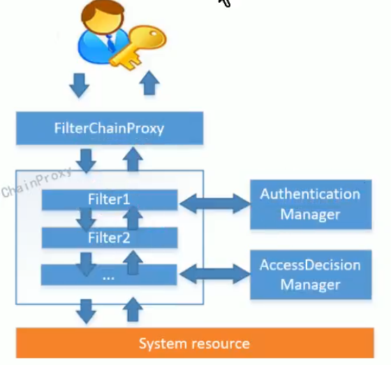

## 1. 添加maven依赖

```xml
<!--SpringSecurity依赖配置-->
<dependency>
    <groupId>org.springframework.boot</groupId>
    <artifactId>spring-boot-starter-security</artifactId>
</dependency>
<!--Hutool Java工具包-->
<dependency>
    <groupId>cn.hutool</groupId>
    <artifactId>hutool-all</artifactId>
    <version>4.5.7</version>
</dependency>
<!--JWT(Json Web Token)登录支持-->
<dependency>
    <groupId>io.jsonwebtoken</groupId>
    <artifactId>jjwt</artifactId>
    <version>0.9.0</version>
</dependency>
```

## 2. 配置SpringSecurity

到这里基本操作都写好啦，现在就需要我们将这些辛苦写好的“组件”组合到一起发挥作用了，那就需要配置了。需要开启一下注解`@EnableWebSecurity`然后再继承一下`WebSecurityConfigurerAdapter`就可以，这里面有三个重要的方法需要我们重写一下。

#### 1.configure(HttpSecurity http)：

这个方法是我们配置拦截的地方   

-  .and().authorizeRequests()这个后边配置那些路径有需要什么权限，比如我配置的那几个url都是permitAll(),及不需要权限就可以访问。剩下的就是要权限才能访问的，值得一提的是antMatchers(HttpMethod.OPTIONS,"/**")，是为了方便后面写前后端分离的时候前端过来的第一次验证请求，这样做，会减少这种请求的时间和资源使用。
- csrf().disable()是为了防止csdf攻击的。
- sessionManagement().sessionCreationPolicy(SessionCreationPolicy.STATELESS);因为我们要使用jwt托管安全信息，所以把Session禁止掉。看下SessionCreationPolicy枚举的几个参数：

```java
public enum SessionCreationPolicy {
 ALWAYS,//总是会新建一个Session。
 NEVER,//不会新建HttpSession，但是如果有Session存在，就会使用它。
 IF_REQUIRED,//如果有要求的话，会新建一个Session。
 STATELESS;//这个是我们用的，不会新建，也不会使用一个HttpSession。

 private SessionCreationPolicy() {
 }
 }
```

- .and().exceptionHandling().authenticationEntryPoint(),这里面主要配置如果没有凭证的行为，这个后面会看jwtAuthenticationEntryPoint这个里面的代码。
- .add().addFilterBefore(jwtAuthenticationTokenFilter(), UsernamePasswordAuthenticationFilter.class);  这行代码主要是用于JWT验证，**这个jwtAuthenticationTokenFilter() 很重要呀，具体功能后面再说。**

#### 2. configure(WebSecurity web)：

configure(WebSecurity web)：这个方法我代码中没有用，这个方法主要用于访问一些静态的东西控制。其中ignoring()方法可以让访问跳过filter验证。

#### 3. configure(AuthenticationManagerBuilder auth)

这个方法主要查询用户信息进行验证的地方，**其中userDetailsService() 代码待会会看**， passwordEncoder(passwordEncoderBean())是定义密码编码器。

还有两个解：@EnableWebSecurity，这个注解必须加，开启Security，@EnableGlobalMethodSecurity(prePostEnabled = true)，保证post之前的注解可以使用

以上，我们可以确定了哪些路径访问不需要任何权限了，至于哪些路径需要什么权限接着往下看。

## 3. 实现UserDetailsService接口

​	使用springSecurity需要实现`UserDetailsService`接口供权限框架调用（这个方法里面也就是重写了刚才说的userDetailsService()方法），该方法只需要实现一个方法就可以了，那就是根据用户名去获取用户，这个方法是做真正的认证的，或者说从数据库拿信息，具体拿认证信息的方法就是在这个方法里面,这里实现此接口并注入到SecurityConfig.java中。

```java

/**
 * security模块相关配置
 */
@Configuration
@EnableWebSecurity
@EnableGlobalMethodSecurity(prePostEnabled=true)
public class MySecurityConfig extends SecurityConfig {

    @Autowired
    AdminService adminService;

    @Override
    @Bean
    public UserDetailsService userDetailsService(){
        UserDetailsService userDetailsService = new UserDetailsService() {
            @Override
            public UserDetails loadUserByUsername(String s) throws UsernameNotFoundException {
                return adminService.loadUserByUsername(s);
            }
        };
        return userDetailsService;
    }
}

```

下面是具体从数据库获取主体信息代码，可以略过。

```java
/**
 * <p>
 * 后台用户表 服务实现类
 * </p>
 *
 * @author test
 * @since 2019-12-16
 */

@Slf4j
@Service
public class AdminServiceImpl extends ServiceImpl<AdminMapper, Admin> implements AdminService, UserDetailsService {

    @Autowired
    AdminMapper adminMapper;

    @Autowired
    AdminRoleRelationMapper adminRoleRelationMapper;

    //@Autowired
    JwtTokenUtil jwtTokenUtil = new JwtTokenUtil();

    //@Autowired
    private PasswordEncoder passwordEncoder = new SecurityConfig().passwordEncoder();

    @Override
    public List<Permission> getPermissionList(Long adminId) {
        return adminRoleRelationMapper.getPermissionList(adminId);
    }


    @Override
    public Admin getAdminByUsername(String username) {
        Map<String,Object> columnMap = new HashMap<>();
        //写表中的列名
        columnMap.put("username",username);
        List<Admin> employees = adminMapper.selectByMap(columnMap);
        if (employees!=null && employees.size()>0){
            return  employees.get(0);
        }
        else {
            return null;
        }
    }


    @Override
    public UserDetails loadUserByUsername(String username){
        Admin admin = getAdminByUsername(username);
        if (admin!=null){
            List<Permission> permissionList =getPermissionList(admin.getId());
            return new AdminUserDetails(admin,permissionList);
        }
        throw new UsernameNotFoundException("用户名或密码错误");
    }

    @Override
    public Admin register(Admin umsAdminParam) {
        Admin umsAdmin = new Admin();
        BeanUtils.copyProperties(umsAdminParam, umsAdmin);
        umsAdmin.setCreateTime(new Date());
        umsAdmin.setStatus(1);
        //查询是否有相同用户名的用户
        Map<String,Object> columnMap = new HashMap<>();
        //写表中的列名
        columnMap.put("username",umsAdmin.getUsername());
        List<Admin> employees = adminMapper.selectByMap(columnMap);
        if (employees!=null && employees.size()>0 ) {
            return null;
        }else {
            //将密码进行加密操作
            String encodePassword = passwordEncoder.encode(umsAdmin.getPassword());
            umsAdmin.setPassword(encodePassword);
            adminMapper.insert(umsAdmin);
            return umsAdmin;
        }
    }

    @Override
    public String login(String username, String password) {
        String token = null;
        try {
            // 验证密码是否正确
            UserDetails userDetails = loadUserByUsername(username);
            if (!passwordEncoder.matches(password, userDetails.getPassword())) {
                throw new BadCredentialsException("密码不正确");
            }
            // 进行登录操作
//            UsernamePasswordAuthenticationToken authentication = new UsernamePasswordAuthenticationToken(userDetails, null, userDetails.getAuthorities());
//            SecurityContextHolder.getContext().setAuthentication(authentication);
            token = jwtTokenUtil.generateToken(userDetails);
        } catch (AuthenticationException e) {
            log.warn("登录异常:{}", e.getMessage());
        }
        return token;
    }
}

```

由于接口方法需要返回一个`UserDetails`类型的接口，所以这边就再写一个类去实现一下这个接口。

## 4. 实现UserDetails

在实现`UserDetails`接口的时候写了一些奇怪的东西，就是这个`getAuthorities`方法啦。这是springSecurity用来获取用户权限的方法，在这里面要重写几个方法，用来获取用户名和密码还有权限信息。

```java

public class AdminUserDetails implements UserDetails , Serializable {
    private Admin admin;
    private List<Permission> permissionList;

    public AdminUserDetails(Admin admin, List<Permission> permissionList) {
        this.admin = admin;
        this.permissionList = permissionList;
    }

    @Override
    public Collection<? extends GrantedAuthority> getAuthorities() {
        List<SimpleGrantedAuthority> list = new ArrayList<>();
        for (Permission permission : permissionList) {
            if (permission.getValue() != null) {
                SimpleGrantedAuthority simpleGrantedAuthority = new SimpleGrantedAuthority(permission.getValue());
                list.add(simpleGrantedAuthority);
            }
        }
        return list;
    }


    @Override
    public String getPassword() {
        return admin.getPassword();
    }


    @Override
    public String getUsername() {
        return admin.getUsername();
    }


    @Override
    /**
     *账号是否未过期，默认是false
     */
    public boolean isAccountNonExpired() {
        return true;
    }


    /**
     *账号是否未锁定，默认是false
     */
    @Override
    public boolean isAccountNonLocked() {
        return true;
    }

    /**
     *  账号凭证是否未过期，默认是false
     */
    @Override
    public boolean isCredentialsNonExpired() {
        return true;
    }


    @Override
    public boolean isEnabled() {
        return admin.getStatus().equals(1);
    }
}

```

现在我们知道了怎么配置各种url是否需要权限才能访问，也知道了哪里可以拿到我们的主体信息。


## 5. JwtAuthorizationTokenFilter

​	JWT终于可以上场了。至于怎么生成这个token凭证，待会会说，现在假设前端已经拿到了token凭证，要访问某个接口了，看看怎么进行jwt业务的拦截吧。不懂过滤器的同学可以先康康这篇博客哦，[过滤器概念](https://blog.csdn.net/qq_29329703/article/details/80690890)。[另外可以看看拦截器和过滤器的概念区分](https://blog.csdn.net/zxd1435513775/article/details/80556034)

​	首先从header中获取凭证authToken，从中挖掘出来我们的username，然后看看上下文中是否有我们以这个username为标识的主体。没有，那去new一个。然后就是验证这个authToken是否在有效期呢啊，验证token是否对啊等等吧。到这里我才发现有点自做多情了，因为生成Security承认的主体是通过UsernamePasswordAuthenticationToken类似与这种类去实现的，之前之所以叫SecurityUserDetails为主体，只是它存了一些关键信息。然后将主体信息—authentication，存入上下文环境，供后面使用。

```java
/**
 * 在用户名和密码校验前添加的过滤器，如果有jwt的token，会自行根据token信息进行登录。
 */
@Slf4j
public class JwtAuthenticationTokenFilter extends OncePerRequestFilter {

    //@Qualifier("jwtUserDetailsService")选择注入指定的对象
    @Autowired
    private UserDetailsService userDetailsService;

    @Autowired
    private JwtTokenUtil jwtTokenUtil;

    // @Value("${jwt.tokenHeader}")
    private String tokenHeader = "Authorization";
    // @Value("${jwt.tokenHead}")
    private String tokenHead = "Bearer";


    @Override
    protected void doFilterInternal(HttpServletRequest request,
                                    HttpServletResponse response,
                                    FilterChain chain)  throws ServletException, IOException{
        // 1.从header中获取凭证authToken
        String authHeader = request.getHeader(this.tokenHeader);
        if (authHeader != null && authHeader.startsWith(this.tokenHead)) {
            //去除token前带有的Bearer前缀的
            String authToken = authHeader.substring(this.tokenHead.length());
            // 2.获取username
            String username = jwtTokenUtil.getUserNameFromToken(authToken);
            log.info("checking username:{}", username);
            // 3.看看上下文中是否有我们以这个username为标识的主体，这个上下文是一次请求有效的，用完就被clean了
            if (username != null && SecurityContextHolder.getContext().getAuthentication() == null) {
                UserDetails userDetails = this.userDetailsService.loadUserByUsername(username);
                // 4.验证这个authToken 是否在有效期呢啊
                if (jwtTokenUtil.validateToken(authToken, userDetails)) {
                    // 5.生成主体信息
                    UsernamePasswordAuthenticationToken authentication = new UsernamePasswordAuthenticationToken(userDetails, null, userDetails.getAuthorities());
                    authentication.setDetails(new WebAuthenticationDetailsSource().buildDetails(request));
                    // 6.然后将主体信息————authentication，存入上下文环境
                    SecurityContextHolder.getContext().setAuthentication(authentication);
                }
            }
        }
        chain.doFilter(request, response);
        //在视图页面返回给客户端之前执行，但是执行顺序在Interceptor之后
       // System.out.println("############TestFilter1 doFilter after############");
    }

}

```

## 6.jwtTokenUtil工具类

### JWT

[啥是jwt？](https://www.cnblogs.com/cjsblog/p/9277677.html)

此处涉及到jjwt（java json web token）包的使用，详情参考s

- [jjwt工具包相关使用](https://www.cnblogs.com/jtlgb/p/10449899.html)
- jwt[视频讲解](https://www.bilibili.com/video/av81717531?p=18)


```java
package com.gcb.learning.mybatisplus.security.utils;


import cn.hutool.core.date.DateUtil;
import cn.hutool.core.util.StrUtil;
import io.jsonwebtoken.Claims;
import io.jsonwebtoken.Jwts;
import io.jsonwebtoken.SignatureAlgorithm;
import lombok.extern.slf4j.Slf4j;
import org.springframework.security.core.userdetails.UserDetails;

import java.util.Date;
import java.util.HashMap;
import java.util.Map;

@Slf4j
public class JwtTokenUtil {

    /**
     * 这些都是负载内部定义好的一些key
     * iss (issuer)签发者, exp (expiration time)过期时间, sub (subject)用户名, aud (audience)接受者
     * 还可以自定义key
     */
    private static final String CLAIM_KEY_USERNAME = "sub";
    private static final String CLAIM_KEY_CREATED = "created";

    //@Value("${jwt.secret}")
    //生成签名的时候使用的秘钥secret，切记这个秘钥不能外露哦。它就是你服务端的私钥，在任何场景都不应该流露出去。
    //一旦客户端得知这个secret, 那就意味着客户端是可以自我签发jwt了。
    private String secret = "mySecret";

    //@Value("${jwt.expiration}")
    private Long expiration = 604800L;

   // @Value("${jwt.tokenHead}")
    private String tokenHead = "Bearer";


    /**
     * 从token中获取claims，即负载
     * @param token
     * @return
     */
    private Claims getClaimsFromToken(String token){
        Claims claims = null;
        try {
               claims = Jwts.parser()
                        // 设置签名，得到token中的负载
                        .setSigningKey(secret)
                        .parseClaimsJws(token)
                        .getBody();
        }catch (Exception e){
            log.info("JWT格式验证失败:{}", token);
        }
        return claims;
    }

    /**
     * 从token中获取用户名
     * @param token
     * @return
     */
    public String getUserNameFromToken(String token){
        String username;
        Claims claims = getClaimsFromToken(token);
        try {
            username = claims.getSubject();
        }catch (Exception e){
            username = null;
        }
        return username;
    }


    /**
     * 判断token是否时间过期
     * @param token
     * @return
     */
    private boolean isTokenExpired(String token) {
        Date dateFromToken = getClaimsFromToken(token).getExpiration();
        return dateFromToken.before(new Date());
    }


    /**
     * 判断token是否有效
     * @param token
     * @param userDetails  从数据库中查询出来的用户信息
     * @return
     */
    public boolean validateToken(String token, UserDetails userDetails){
        String username = getUserNameFromToken(token);
        return username.equals(userDetails.getUsername()) && !isTokenExpired(token);
    }

    /**
     * 根据负载生成jwt的Token
     * @param claims claims中包含用户名和登录时间，即是token的载荷信息
     * @return
     */
    private String generateToken(Map<String,Object> claims){
        return Jwts.builder()
                .setClaims(claims)
                .setExpiration(generateExpirationDate())
                // 指定加密方式和签名
                .signWith(SignatureAlgorithm.HS512, secret)
                // 返回一个字符串
                .compact();
    }


    /**
     * 根据用户信息生成token
     * @param userDetails
     * @return
     */
    public  String generateToken(UserDetails userDetails){
        Map<String,Object> claims = new HashMap<>();
        claims.put(CLAIM_KEY_USERNAME,userDetails.getUsername());
        claims.put(CLAIM_KEY_CREATED, new Date());
        return generateToken(claims);
    }


    /**
     * 判断token在指定时间内是否刚刚刷新过
     * @param token 原token
     * @param time 指定时间（秒）
     */
    private boolean tokenRefreshJustBefore(String token, int time){
        Claims claims = getClaimsFromToken(token);
        Date created = claims.get(CLAIM_KEY_CREATED, Date.class);
        Date refreshDate = new Date();
        if (refreshDate.after(created) && refreshDate.before(DateUtil.offsetSecond(created,time))){
            return true;
        }
        return false;
    }

    /**
     * 刷新token
     * @param oldToken
     * @return
     */
    public String refreshHeadToken(String oldToken){
        if (StrUtil.isEmpty(oldToken)){
            return null;
        }
        String token = oldToken.substring(tokenHead.length());
        if (StrUtil.isEmpty(token)){
            return null;
        }
        //token校验不通过
        Claims claims = getClaimsFromToken(token);
        if(claims==null){
            return null;
        }
        //如果token已经过期，不支持刷新
        if(isTokenExpired(token)){
            return null;
        }
        //如果token在30分钟之内刚刷新过，返回原token
        if(tokenRefreshJustBefore(token,30*60)){
            return token;
        }else{
            claims.put(CLAIM_KEY_CREATED, new Date());
            return generateToken(claims);
        }
    }

    /**
     * 从token中得到过期时间
     * @param token
     * @return
     */
    private Date getExpiredDateFromToken(String token){
        Claims claims = getClaimsFromToken(token);
        return claims.getExpiration();
    }

    private Date generateExpirationDate() {
        return new Date(System.currentTimeMillis() + expiration * 1000);
    }

}

```

## 7.统一异常处理

当然会有一些需求是要统一处理被403响应的事件，很简单，只要新建一个类`JWTAuthenticationEntryPoint`实现一下接口`AuthenticationEntryPoint`就可以了

```java

/**
 * 当未登录或者token失效访问接口时，用于返回JSON格式的处理结果；
 */
public class JWTAuthenticationEntryPoint implements AuthenticationEntryPoint {

    @Override
    public void commence(HttpServletRequest httpServletRequest,
                         HttpServletResponse httpServletResponse, AuthenticationException authException)
            throws IOException{
        httpServletResponse.setCharacterEncoding("UTF-8");
        httpServletResponse.setContentType("application/json");
        httpServletResponse.setStatus(HttpServletResponse.SC_FORBIDDEN);
        httpServletResponse.getWriter().println(JSONUtil.parse(new CommonResult().unauthorized("JWTAuthenticationEntryPoint"+authException.getMessage())));
        // String reason = "统一处理，原因："+authException.getMessage();
        // httpServletResponse.getWriter().write(new ObjectMapper().writeValueAsString(reason));
        httpServletResponse.getWriter().flush();
    }
}

```


## 8. 登录

先登录一下，看看怎么生成token扔给前端的吧。

```java
    @ApiOperation(value = "登录以后返回token")
    @RequestMapping(value = "/login", method = RequestMethod.POST)
    @ResponseBody
    public CommonResult login(@RequestBody UmsAdminLoginParam umsAdminLoginParam, BindingResult result) {
        String token = adminService.login(umsAdminLoginParam.getUsername(), umsAdminLoginParam.getPassword());
        if (token == null) {
            return CommonResult.validateFailed("用户名或密码错误");
        }
        Map<String, String> tokenMap = new HashMap<>();
        tokenMap.put("token", token);
        tokenMap.put("tokenHead", tokenHead);
        return CommonResult.success(tokenMap);
    }
```

这边通过jwt生成一个token串，具体方法请看jwtTokenUtil.generateToken，已经写了。只要知道这里面存了username、加密规则、过期时间就好了。


## 9. 一个重要的问题

先说结论：Security上下文环境(里面有主体)生命周期只限于一次请求。

我做了一个测试：

把SecurityConfig里面configure(HttpSecurity http)这个方法里面

```java
http.addFilterBefore(authenticationTokenFilter, UsernamePasswordAuthenticationFilter.class);
```

这行代码注释掉，不走那个jwt filter。就是不每次都添加上下上下文环境。

然后loginController改成

```java
    @ApiOperation(value = "登录以后返回token")
    @RequestMapping(value = "/login", method = RequestMethod.POST)
    public CommonResult login(@RequestBody AdminLoginParam adminLoginParam, BindingResult result) {
        String token = adminService.login(adminLoginParam.getUsername(), adminLoginParam.getPassword());
        if (token == null) {
            return new CommonResult().validateFailed("用户名或密码错误");
        }
        //添加 start
        UsernamePasswordAuthenticationToken authentication = new UsernamePasswordAuthenticationToken(userDetails, null, userDetails.getAuthorities());
        SecurityContextHolder.getContext().setAuthentication(authentication);
        //添加 end
        Map<String, String> tokenMap = new HashMap<>();
        tokenMap.put("token", token);
        tokenMap.put("tokenHead", tokenHead);
        return new CommonResult().success(tokenMap);
    }

    @PostMapping("haha")
    public CommonResult haha(){
        Authentication authentication = SecurityContextHolder.getContext().getAuthentication();
        Object details = authentication.getDetails();
        return new CommonResult().success(authentication);
    }
    
```

然后登陆，然后访问/haha，崩了，发现userDetails里面没数据。说明这会上下文环境中我们主体不存在。为什么会这样呢？

SecurityContextPersistenceFilter 一次请求，filter链结束之后 会清除掉Context里面的东西。所说以，主体数据生命周期是一次请求。

源码如下:

```java
public void doFilter(ServletRequest req, ServletResponse res, FilterChain chain)
        throws IOException, ServletException {
    ...假装有一堆代码...
    try {
    }
    finally {
        SecurityContext contextAfterChainExecution = SecurityContextHolder
                .getContext();
        // Crucial removal of SecurityContextHolder contents - do this before anything
        // else.
        SecurityContextHolder.clearContext();
        repo.saveContext(contextAfterChainExecution, holder.getRequest(),
                holder.getResponse());
        request.removeAttribute(FILTER_APPLIED);
    }
}
```

关键就是finally里面 SecurityContextHolder.clearContext(); 这句话。这才体现了那句，把维护信息的事扔给了客户端，你不请求，我也不知道你有啥。

总的来说，就是1.实现了UserDetailsService接口和接口需要的UserDetails类，用来给springSecurity获取主体信息（注入到springsecurity配置类中和JwtAuthorizationFilter中使用），2.实现JwtAuthorizationTokenFilter，自定义实际的获取主体信息操作。

参考博客和项目：

- https://www.cnblogs.com/pjjlt/p/10960690.html
- http://www.macrozheng.com/#/architect/mall_arch_09
- https://github.com/echisan/springboot-jwt-demo/blob/master/blog_content.md




AuthenticationManager认证管理器

AccessDecisionManager决策管理器


问题

- [ ] session到底哪里不行？