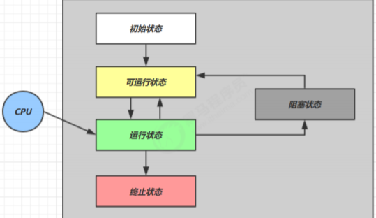
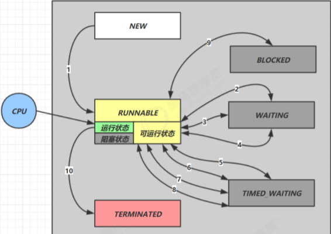

# 线程与进程

## 2.1 进程与进程

### 进程

- 程序由指令和数据组成，但是这些指令要运行，数据要读写，就必须将指令加载到cpu，数据加载至内存。在指令运行过程中还需要用到磁盘，网络等设备，进程就是用来加载指令管理内存管理IO的
- 当一个指令被运行，从磁盘加载这个程序的代码到内存，这时候就开启了一个进程
- 进程就可以视为程序的一个实例，大部分程序都可以运行多个实例进程（例如记事本，浏览器等），部分只可以运行一个实例进程（例如360安全卫士）

### 线程

- 一个进程之内可以分为一到多个线程。
- 一个线程就是一个指令流，将指令流中的一条条指令以一定的顺序交给 CPU 执行
- Java 中，线程作为最小调度单位，进程作为资源分配的最小单位。 在 windows 中进程是不活动的，只是作
  为线程的容器（这里感觉要学了计算机组成原理之后会更有感觉吧！）

### 二者对比

进程基本上相互独立的，而线程存在于进程内，是进程的一个子集
进程拥有共享的资源，如内存空间等，供其内部的线程共享
进程间通信较为复杂
同一台计算机的进程通信称为 IPC（Inter-process communication）
不同计算机之间的进程通信，需要通过网络，并遵守共同的协议，例如 HTTP
线程通信相对简单，因为它们共享进程内的内存，一个例子是多个线程可以访问同一个共享变量
线程更轻量，线程上下文切换成本一般上要比进程上下文切换低


## 2.2 并行与并发

### 并行

在单核 cpu 下，线程实际还是串行执行的。操作系统中有一个组件叫做任务调度器，将 cpu 的时间片（windows
下时间片最小约为 15 毫秒）分给不同的程序使用，只是由于 cpu 在线程间（时间片很短）的切换非常快，人类感
觉是同时运行的 。一般会将这种线程轮流使用 CPU 的做法称为并发（concurrent）


### 并发

多核 cpu下，每个核（core） 都可以调度运行线程，这时候线程可以是并行的，不同的线程同时使用不同的cpu在执行。


### 二者对比

引用 Rob Pike 的一段描述：并发（concurrent）是同一时间应对（dealing with）多件事情的能力并行（parallel）是同一时间动手做（doing）多件事情的能力

- 家庭主妇做饭、打扫卫生、给孩子喂奶，她一个人轮流交替做这多件事，这时就是并发
- 雇了3个保姆，一个专做饭、一个专打扫卫生、一个专喂奶，互不干扰，这时是并行
- 家庭主妇雇了个保姆，她们一起这些事，这时既有并发，也有并行（这时会产生竞争，例如锅只有一口，一
  个人用锅时，另一个人就得等待）


### 应用

#### 同步和异步的概念

<span style ="color:red">以调用方的角度讲</span>，如果需要等待结果返回才能继续运行的话就是同步，如果不需要等待就是异步

#### 1) 设计

多线程可以使方法的执行变成异步的，比如说读取磁盘文件时，假设读取操作花费了5秒，如果没有线程的调度机制，这么cpu只能等5秒，啥都不能做。

#### 2) 结论

- 比如在项目中，视频文件需要转换格式等操作比较费时，这时开一个新线程处理视频转换，避免阻塞主线程
- tomcat 的异步 servlet 也是类似的目的，让用户线程处理耗时较长的操作，避免阻塞 tomcat 的工作线程
- ui 程序中，开线程进行其他操作，避免阻塞 ui 线程


# java线程

## 3.1 创建和运行线程

#### 方法一，直接使用 Thread

```java
// 构造方法的参数是给线程指定名字，推荐
Thread t1 = new Thread("t1") {
 @Override
 // run 方法内实现了要执行的任务
 public void run() {
 log.debug("hello");
 }
};
t1.start();
```


#### 方法二，使用 Runnable 配合 Thread

把【线程】和【任务】（要执行的代码）分开，Thread 代表线程，Runnable 可运行的任务（线程要执行的代码）Test2.java

```java
// 创建任务对象
Runnable task2 = new Runnable() {
 @Override
 public void run() {
 log.debug("hello");
 }
};
// 参数1 是任务对象; 参数2 是线程名字，推荐
Thread t2 = new Thread(task2, "t2");
t2.start();
```

#### 小结

方法1 是把线程和任务合并在了一起，方法2 是把线程和任务分开了，用 Runnable 更容易与线程池等高级 API 配合，用 Runnable 让任务类脱离了 Thread 继承体系，更灵活。通过查看源码可以发现，方法二其实到底还是通过方法一执行的！

#### 方法三，FutureTask 配合 Thread

FutureTask 能够接收 Callable 类型的参数，用来处理有返回结果的情况Test3.java

```java
    public static void main(String[] args) throws ExecutionException, InterruptedException {
        // 实现多线程的第三种方法可以返回数据
        FutureTask futureTask = new FutureTask<>(new Callable<Integer>() {
            @Override
            public Integer call() throws Exception {
                log.debug("多线程任务");
                Thread.sleep(100);
                return 100;
            }
        });
        // 主线程阻塞，同步等待 task 执行完毕的结果
        new Thread(futureTask,"我的名字").start();
        log.debug("主线程");
        log.debug("{}",futureTask.get());
    }
```

## 3.2 线程运行原理

### 虚拟机栈与栈帧

拟机栈描述的是Java方法执行的内存模型：每个方法被执行的时候都会同时创建一个栈帧(stack frame)用于存储局部变量表、操作数栈、动态链接、方法出口等信息，是属于线程的。当java中使用多线程时，每个线程都会维护它自己的栈帧！每个线程只能有一个活动栈帧，对应着当前正在执行的那个方法

### 线程上下文切换（Thread Context Switch）

因为以下一些原因导致 cpu 不再执行当前的线程，转而执行另一个线程的代码

- 线程的 cpu 时间片用完(每个线程轮流执行，看前面并行的概念)
- 垃圾回收
- 有更高优先级的线程需要运行
- 线程自己调用了 sleep、yield、wait、join、park、synchronized、lock 等方法

当 Context Switch 发生时，需要由操作系统保存当前线程的状态，并恢复另一个线程的状态，Java 中对应的概念
就是程序计数器（Program Counter Register），它的作用是记住下一条 jvm 指令的执行地址，是线程私有的

## 3.3 Thread的常见方法


### 3.3.1 start 与 run

#### 调用start

```java
    public static void main(String[] args) {
        Thread thread = new Thread(){
          @Override
          public void run(){
              log.debug("我是一个新建的线程正在运行中");
              FileReader.read(fileName);
          }
        };
        thread.setName("新建线程");
        thread.start();
        log.debug("主线程");
    }
```

输出：程序在 t1 线程运行， FileReader.read() 方法调用是异步的Test4

```properties
11:59:40.711 [main] DEBUG com.concurrent.test.Test4 - 主线程
11:59:40.711 [新建线程] DEBUG com.concurrent.test.Test4 - 我是一个新建的线程正在运行中
11:59:40.732 [新建线程] DEBUG com.concurrent.test.FileReader - read [test] start ...
11:59:40.735 [新建线程] DEBUG com.concurrent.test.FileReader - read [test] end ... cost: 3 ms
```

#### 调用run

将上面代码的`thread.start();`改为 `thread.run();`输出结果如下：程序仍在 main 线程运行， FileReader.read() 方法调用还是同步的

```properties
12:03:46.711 [main] DEBUG com.concurrent.test.Test4 - 我是一个新建的线程正在运行中
12:03:46.727 [main] DEBUG com.concurrent.test.FileReader - read [test] start ...
12:03:46.729 [main] DEBUG com.concurrent.test.FileReader - read [test] end ... cost: 2 ms
12:03:46.730 [main] DEBUG com.concurrent.test.Test4 - 主线程
```

#### 小结

直接调用 run 是在主线程中执行了 run，没有启动新的线程
使用 start 是启动新的线程，通过新的线程间接执行 run 中的代码

### 3.3.2 sleep 与 yield

#### sleep

1. 调用 sleep 会让当前线程从 Running 进入 Timed Waiting 状态（阻塞）
2. 其它线程可以使用 interrupt 方法打断正在睡眠的线程，那么被打断的线程就会停止执行，并且这时 sleep 方法会抛出 InterruptedException【注意：这里打断的是正在休眠的线程，而不是其它状态的线程】
3. 睡眠结束后的线程未必会立刻得到执行(需要分配到cpu时间片)
4. 建议用 TimeUnit 的 sleep 代替 Thread 的 sleep 来获得更好的可读性

#### yield

1. 调用 yield 会让当前线程从 Running 进入 Runnable 就绪状态，然后调度执行其它线程
2. 具体的实现依赖于操作系统的任务调度器(就是可能没有其它的线程正在执行，虽然调用了yield方法，但是也没有用)

#### 小结

yield使cpu调用其它线程，但是cpu可能会再分配时间片给该线程；而sleep需要等过了休眠时间之后才有可能被分配cpu时间片

### 3.3.3 线程优先级

线程优先级会提示（hint）调度器优先调度该线程，但它仅仅是一个提示，调度器可以忽略它
如果 cpu 比较忙，那么优先级高的线程会获得更多的时间片，但 cpu 闲时，优先级几乎没作用

### 3.3.4 join

在主线程中调用t1.join，则主线程会等待t1线程执行完之后再继续执行 Test10.java

```java
    private static void test1() throws InterruptedException {
        log.debug("开始");
        Thread t1 = new Thread(() -> {
            log.debug("开始");
            sleep(1);
            log.debug("结束");
            r = 10;
        },"t1");
        t1.start();
        t1.join();
        log.debug("结果为:{}", r);
        log.debug("结束");
    }
```


### 3.3.5 interrupt 方法详解

#### 打断 sleep，wait，join 的线程

 sleep，wait，join 的线程，这几个方法都会让线程进入阻塞状态，以 sleep 为例Test7.java

```java
    public static void main(String[] args) throws InterruptedException {
        Thread t1 = new Thread() {
            @Override
            public void run() {
                log.debug("线程任务执行");
                try {
                    Thread.sleep(10000); // wait, join
                } catch (InterruptedException e) {
                    //e.printStackTrace();
                    log.debug("被打断");
                }
            }
        };
        t1.start();
        Thread.sleep(500);
        log.debug("111是否被打断？{}",t1.isInterrupted());
        t1.interrupt();
        log.debug("222是否被打断？{}",t1.isInterrupted());
        Thread.sleep(500);
        log.debug("222是否被打断？{}",t1.isInterrupted());
        log.debug("主线程");
    }
```
输出结果：（我下面将中断和打断两个词混用）可以看到，打断 sleep 的线程, 会清空中断状态，刚被中断完之后`t1.isInterrupted()`的值为`true`，后来变为`false`，即中断状态会被清除。那么线程是否被中断过可以通过异常来判断。【同时要注意如果打断被`join()`，`wait()` blocked的线程也是一样会被清除，被清除(interrupt status will be cleared)的意思即中断状态设置为`false`，被设置( interrupt status will be set)的意思就是中断状态设置为`true`】

```properties
17:06:11.890 [Thread-0] DEBUG com.concurrent.test.Test7 - 线程任务执行
17:06:12.387 [main] DEBUG com.concurrent.test.Test7 - 111是否被打断？false
17:06:12.390 [Thread-0] DEBUG com.concurrent.test.Test7 - 被打断
17:06:12.390 [main] DEBUG com.concurrent.test.Test7 - 222是否被打断？true
17:06:12.890 [main] DEBUG com.concurrent.test.Test7 - 222是否被打断？false
17:06:12.890 [main] DEBUG com.concurrent.test.Test7 - 主线程
```

#### 打断正常运行的线程

打断正常运行的线程, 线程并不会暂停，只是调用方法`Thread.currentThread().isInterrupted();`的返回值为true，可以判断`Thread.currentThread().isInterrupted();`的值来手动停止线程

```java
    public static void main(String[] args) throws InterruptedException {
        Thread t1 = new Thread(() -> {
            while(true) {
                boolean interrupted = Thread.currentThread().isInterrupted();
                if(interrupted) {
                    log.debug("被打断了, 退出循环");
                    break;
                }
            }
        }, "t1");
        t1.start();
        Thread.sleep(1000);
        log.debug("interrupt");
        t1.interrupt();
    }
```

#### 终止模式之两阶段终止模式

Two Phase Termination，就是考虑在一个线程T1中如何优雅地终止另一个线程T2？这里的优雅指的是给T2一个料理后事的机会（如释放锁）。

如下所示：那么线程的`isInterrupted()`方法可以取得线程的打断标记，如果线程在睡眠`sleep`期间被打断，打断标记是不会变的，为false，但是`sleep`期间被打断会抛出异常，我们据此手动设置打断标记为`true`；如果是在程序正常运行期间被打断的，那么打断标记就被自动设置为`true`。处理好这两种情况那我们就可以放心地来料理后事啦！


代码实现如下：

```java
@Slf4j
public class Test11 {
    public static void main(String[] args) throws InterruptedException {
        TwoParseTermination twoParseTermination = new TwoParseTermination();
        twoParseTermination.start();
        Thread.sleep(3000);  // 让监控线程执行一会儿
        twoParseTermination.stop(); // 停止监控线程
    }
}


@Slf4j
class TwoParseTermination{
    Thread thread ;
    public void start(){
        thread = new Thread(()->{
            while(true){
                if (Thread.currentThread().isInterrupted()){
                    log.debug("线程结束。。正在料理后事中");
                    break;
                }
                try {
                    Thread.sleep(500);
                    log.debug("正在执行监控的功能");
                } catch (InterruptedException e) {
                    Thread.currentThread().interrupt();
                    e.printStackTrace();
                }
            }
        });
        thread.start();
    }
    public void stop(){
        thread.interrupt();
    }
}
```

## 3.4 守护线程

默认情况下，java进程需要等待所有的线程结束后才会停止，但是有一种特殊的线程，叫做守护线程，在其他线程全部结束的时候即使守护线程还未结束代码未执行完java进程也会停止。普通线程t1可以调用`t1.setDeamon(true);` 方法变成守护线程 

> 注意
> 垃圾回收器线程就是一种守护线程
> Tomcat 中的 Acceptor 和 Poller 线程都是守护线程，所以 Tomcat 接收到 shutdown 命令后，不会等
> 待它们处理完当前请求

## 3.5 线程状态之五种状态

五种状态的划分主要是从操作系统的层面进行划分的



1. 初始状态，仅仅是在语言层面上创建了线程对象，即`Thead thread = new Thead();`，还未与操作系统线程关联
2. 可运行状态，也称就绪状态，指该线程已经被创建，与操作系统相关联，等待cpu给它分配时间片就可运行
3. 运行状态，指线程获取了CPU时间片，正在运行
   1. 当CPU时间片用完，线程会转换至【可运行状态】，等待 CPU再次分配时间片，会导致我们前面讲到的上下文切换
4. 阻塞状态
   1. 如果调用了阻塞API，如BIO读写文件，那么线程实际上不会用到CPU，不会分配CPU时间片，会导致上下文切换，进入【阻塞状态】
   2. 等待BIO操作完毕，会由操作系统唤醒阻塞的线程，转换至【可运行状态】
   3. 与【可运行状态】的区别是，只要操作系统一直不唤醒线程，调度器就一直不会考虑调度它们，CPU就一直不会分配时间片
5. 终止状态，表示线程已经执行完毕，生命周期已经结束，不会再转换为其它状态

## 3.6 线程状态之六种状态

这是从 Java API 层面来描述的
根据 Thread.State 枚举，分为六种状态 Test12.java



1. NEW 跟五种状态里的初始状态是一个意思
2. RUNNABLE 是当调用了 `start()` 方法之后的状态，注意，Java API 层面的 `RUNNABLE` 状态涵盖了操作系统层面的
   【可运行状态】、【运行状态】和【阻塞状态】（由于 BIO 导致的线程阻塞，在 Java 里无法区分，仍然认为
   是可运行）
3. `BLOCKED` ， `WAITING` ， `TIMED_WAITING` 都是 Java API 层面对【阻塞状态】的细分，后面会在状态转换一节
   详述