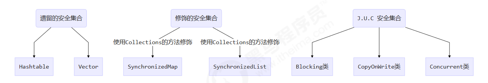

# 7. 线程安全集合类概述



## 7.1 线程安全集合类可以分为三大类

1. 遗留的线程安全集合如 `Hashtable` ， `Vector`
2. 使用 `Collections` 装饰的线程安全集合，如：
   1. Collections.synchronizedCollection
   2. Collections.synchronizedList
   3. Collections.synchronizedMap
   4. Collections.synchronizedSet
   5. Collections.synchronizedNavigableMap
   6. Collections.synchronizedNavigableSet
   7. Collections.synchronizedSortedMap
   8. Collections.synchronizedSortedSet
3. java.util.concurrent.*

## 7.2 重点

重点介绍 java.util.concurrent.* 下的线程安全集合类，可以发现它们有规律，里面包含三类关键词：
`Blocking`、`CopyOnWrite`、`Concurrent`

1. `Blocking`  ：大部分实现基于锁，并提供用来阻塞的方法

2. `CopyOnWrite` 之类容器：修改开销相对较重

3. `Concurrent` 类型的容器

   1. 内部很多操作使用 cas 优化，一般可以提供较高吞吐量
   2. 弱一致性

   > 1. 遍历时弱一致性，例如，当利用迭代器遍历时，如果容器发生修改，迭代器仍然可以继续进行遍
   >    历，这时内容是旧的(fast-safe机制)
   > 2. 求大小弱一致性，size 操作未必是 100% 准确
   > 3. 读取弱一致性

对于非安全容器来讲，如果遍历时如果发生了修改，使用`fail-fast`机制让遍历立刻失败，抛出`ConcurrentModificationException`，不再继续遍历


# 8. ConcurrentHashMap

## 8.1 使用不安全的集合类示例

- HashMap和ConcurrentHashMap的使用示例 test1.java类


## 8.2 JDK 7 HashMap 并发死链

1. JDK 7 HashMap 并发死链
注意：要在 JDK 7 下运行，否则扩容机制和 hash 的计算方法都变了


源码分析
HashMap 的并发死链发生在扩容时

```java
    public static void main(String[] args) {
        // 测试 java 7 中哪些数字的 hash 结果相等
        System.out.println("长度为16时，桶下标为1的key");
        for (int i = 0; i < 64; i++) {
            if (hash(i) % 16 == 1) {
                System.out.println(i);
            }
        }
        System.out.println("长度为32时，桶下标为1的key");
        for (int i = 0; i < 64; i++) {
            if (hash(i) % 32 == 1) {
                System.out.println(i);
            }
        }
        // 1, 35, 16, 50 当大小为16时，它们在一个桶内   1, 35 当大小为32时，它们在一个桶内
        final HashMap<Integer, Integer> map = new HashMap<Integer, Integer>();
        // 放 12 个元素
        map.put(2, null);
        map.put(3, null);
        map.put(4, null);
        map.put(5, null);
        map.put(6, null);
        map.put(7, null);
        map.put(8, null);
        map.put(9, null);
        map.put(10, null);
        map.put(16, null);
        map.put(35, null);
        map.put(1, null);
        System.out.println("扩容前大小[main]:"+map.size());
        new Thread() {
            @Override
            public void run() {
                // 放第 13 个元素, 发生扩容
                map.put(50, null);
                System.out.println("扩容后大小[Thread-0]:"+map.size());
            }
        }.start();
        new Thread() {
            @Override
            public void run() {
                // 放第 13 个元素, 发生扩容
                map.put(50, null);
                System.out.println("扩容后大小[Thread-1]:"+map.size());
            }
        }.start();
    }
    
    final static int hash(Object k) {
        int h = 0;
        if (0 != h && k instanceof String) {
            return 0;
            // 下面这行代码必须将环境调味  
//            return sun.misc.Hashing.stringHash32((String) k);
        }
        h ^= k.hashCode();
        h ^= (h >>> 20) ^ (h >>> 12);
        return h ^ (h >>> 7) ^ (h >>> 4);
    }
```


#### 死链复现

调试工具使用 idea
在 HashMap 源码 590 行加断点 `int newCapacity = newTable.length;`

断点的条件如下，目的是让 HashMap 在扩容为 32 时，并且线程为 Thread-0 或 Thread-1 时停下来

```
newTable.length==32 &&
(
Thread.currentThread().getName().equals("Thread-0")||
Thread.currentThread().getName().equals("Thread-1")
)
```

断点暂停方式选择 Thread，否则在调试 Thread-0 时，Thread-1 无法恢复运行
运行代码，程序在预料的断点位置停了下来，输出

```
长度为16时，桶下标为1的key
1
16
35
50
长度为32时，桶下标为1的key
1
35
扩容前大小[main]:12 
```

接下来进入扩容流程调试
在 HashMap 源码 594 行加断点

```
Entry<K,V> next = e.next; // 593
if (rehash) // 594
// ...

```

这是为了观察 `e` 节点和 `next` 节点的状态，`Thread-0` 单步执行到 594 行（注意是使`Thread-0`，在debug切换线程再单步执行！），再 594 处再添加一个断点（条件`Thread.currentThread().getName().equals("Thread-0")`）
这时可以在 `Variables` 面板观察到 `e` 和 `next` 变量，使用 `view as -> Object` 查看节点状态

```
e (1)->(35)->(16)->null
next (35)->(16)->null 
```

在 Threads 面板选中 Thread-1 恢复运行，可以看到控制台输出新的内容如下，Thread-1 扩容已完成

```java
newTable[1] (35)->(1)->null 
```

```java
扩容后大小:13 
```

这时 Thread-0 还停在 594 处， Variables 面板变量的状态已经变化为

```java
e (1)->null
next (35)->(1)->null 
```

为什么呢，因为 `Thread-1` 扩容时链表也是后加入的元素放入链表头，因此链表就倒过来了，但 `Thread-1` 虽然结
果正确，但它结束后 `Thread-0` 还要继续运行

接下来就可以单步调试（F8）观察死链的产生了，下一轮循环到 594，将 `e` 搬迁到 `newTable` 链表头

```java
newTable[1] (1)->null
e           (35)->(1)->null
next        (1)->null 
```

下一轮循环到 594，将 e 搬迁到 newTable 链表头

```java
newTable[1] (35)->(1)->null
e           (1)->null
next        null 
```

再看看源码

```java
e.next = newTable[1];
// 这时 e (1,35)
// 而 newTable[1] (35,1)->(1,35) 因为是同一个对象
newTable[1] = e;
// 再尝试将 e 作为链表头, 死链已成
e = next;
// 虽然 next 是 null, 会进入下一个链表的复制, 但死链已经形成了
```

#### 源码分析

HashMap 的并发死链发生在扩容时

```java
// 将 table 迁移至 newTable
    void transfer(Entry[] newTable, boolean rehash) {
        int newCapacity = newTable.length;
        for (Entry<K,V> e : table) {
            while(null != e) {
                Entry<K,V> next = e.next;
                // 1 处
                if (rehash) {
                    e.hash = null == e.key ? 0 : hash(e.key);
                }
                int i = indexFor(e.hash, newCapacity);
                // 2 处
                // 将新元素加入 newTable[i], 原 newTable[i] 作为新元素的 next
                e.next = newTable[i];
                newTable[i] = e;
                e = next;
            }
        }
    }
```


## 8.3 JDK 8 ConcurrentHashMap


### 重要方法

```java
    // 获取 Node[] 中第 i 个 Node
    static final <K,V> Node<K,V> tabAt(Node<K,V>[] tab, int i)

    // cas 修改 Node[] 中第 i 个 Node 的值, c 为旧值, v 为新值
    static final <K,V> boolean casTabAt(Node<K,V>[] tab, int i, Node<K,V> c, Node<K,V> v)

    // 直接修改 Node[] 中第 i 个 Node 的值, v 为新值
    static final <K,V> void setTabAt(Node<K,V>[] tab, int i, Node<K,V> v)

```


### 重要属性和内部类

```java
// 默认为 0
    // 当初始化时, 为 -1
    // 当扩容时, 为 -(1 + 扩容线程数)
    // 当初始化或扩容完成后，为 下一次的扩容的阈值大小
    private transient volatile int sizeCtl;
    // 整个 ConcurrentHashMap 就是一个 Node[]
    static class Node<K,V> implements Map.Entry<K,V> {}
    // hash 表
    transient volatile Node<K,V>[] table;
    // 扩容时的 新 hash 表
    private transient volatile Node<K,V>[] nextTable;
    // 扩容时如果某个 bin 迁移完毕, 用 ForwardingNode 作为旧 table bin 的头结点
    static final class ForwardingNode<K,V> extends Node<K,V> {}
    // 用在 compute 以及 computeIfAbsent 时, 用来占位, 计算完成后替换为普通 Node
    static final class ReservationNode<K,V> extends Node<K,V> {}
    // 作为 treebin 的头节点, 存储 root 和 first
    static final class TreeBin<K,V> extends Node<K,V> {}
    // 作为 treebin 的节点, 存储 parent, left, right
    static final class TreeNode<K,V> extends Node<K,V> {}
```

### 构造器分析

可以看到实现了懒惰初始化，在构造方法中仅仅计算了 table 的大小，以后在第一次使用时才会真正创建

```java
    public ConcurrentHashMap(int initialCapacity, float loadFactor, int concurrencyLevel) {
        if (!(loadFactor > 0.0f) || initialCapacity < 0 || concurrencyLevel <= 0)
            throw new IllegalArgumentException();
        if (initialCapacity < concurrencyLevel) // Use at least as many bins
            initialCapacity = concurrencyLevel; // as estimated threads
        long size = (long)(1.0 + (long)initialCapacity / loadFactor);
        // tableSizeFor方法仍然是保证cap计算的大小是 2^n, 即 16,32,64 ...
        int cap = (size >= (long)MAXIMUM_CAPACITY) ?
                MAXIMUM_CAPACITY : tableSizeFor((int)size);
        this.sizeCtl = cap;
    }
```


### get 流程

```java
 public V get(Object key) {
        Node<K,V>[] tab; Node<K,V> e, p; int n, eh; K ek;
        // spread 方法能确保返回结果是正数
        int h = spread(key.hashCode());
        if ((tab = table) != null && (n = tab.length) > 0 &&
                (e = tabAt(tab, (n - 1) & h)) != null) {
            // 1.如果头结点已经是要查找的 key
            if ((eh = e.hash) == h) {
                //先使用==比较，再用 equals 比较
                if ((ek = e.key) == key || (ek != null && key.equals(ek)))
                    return e.val;
            }
            //2. hash 为负数表示该 bin 在扩容中或是 treebin, 这时调用 find 方法来查找
            else if (eh < 0)
                return (p = e.find(h, key)) != null ? p.val : null;
            //3. 正常遍历链表, 先使用==比较，再用 equals 比较
            while ((e = e.next) != null) {
                if (e.hash == h &&
                        ((ek = e.key) == key || (ek != null && key.equals(ek))))
                    return e.val;
            }
        }
        return null;
    }

```


### put流程

#### putVal()方法

```java
public V put(K key, V value) {
     return putVal(key, value, false);
}


final V putVal(K key, V value, boolean onlyIfAbsent) {
        if (key == null || value == null) throw new NullPointerException();
        // 其中 spread 方法会综合高位低位, 返回的hash为正值，具有更好的 hash 性
        int hash = spread(key.hashCode());
        // 这个变量记录的是链表的长度
        int binCount = 0;
        for (Node<K,V>[] tab = table;;) {
            // f 是链表头节点
            // fh 是链表头结点的 hash
            // i 是链表在 table 中的下标
            Node<K,V> f; int n, i, fh;
            // 1. 如果要创建 table
            if (tab == null || (n = tab.length) == 0)
                // 初始化 table 使用了 cas, 无需 synchronized。 创建成功, 进入下一轮循环
                // 这个方法看下面的分析
                tab = initTable();
            // 2.如果要创建链表头节点
            else if ((f = tabAt(tab, i = (n - 1) & hash)) == null) {
                // 添加链表头使用了 cas, 无需 synchronized
                if (casTabAt(tab, i, null,
                        new Node<K,V>(hash, key, value, null)))
                    break;
            }
            // 3.线程正在扩容：帮忙扩容(按理来说，在一个线程扩容的过程中，另一个线程应该阻塞住的，但是没有，是因为扩容线程是把锁加在链表中的，所以另一个线程可以帮忙扩容)
            else if ((fh = f.hash) == MOVED)
                // 帮忙之后, 进入下一轮循环
                tab = helpTransfer(tab, f);
            // 4.捅下标冲突的情况
            else {
                V oldVal = null;
                // 锁住链表头节点
                synchronized (f) {
                    // 再次确认链表头节点没有被移动
                    if (tabAt(tab, i) == f) {
                        // 链表，判断hash码是不是大于0，普通节点的都是大于0滴，如果是红黑树或者扩容中，那么就是小于0de
                        if (fh >= 0) {
                            binCount = 1;
                            // 遍历链表
                            for (Node<K,V> e = f;; ++binCount) {
                                K ek;
                                // 找到相同的 key
                                if (e.hash == hash &&
                                        ((ek = e.key) == key ||
                                                (ek != null && key.equals(ek)))) {
                                    oldVal = e.val;
                                    // 更新
                                    if (!onlyIfAbsent)
                                        e.val = value;
                                    break;
                                }
                                Node<K,V> pred = e;
                                // 已经是最后的节点了, 新增 Node, 追加至链表尾
                                if ((e = e.next) == null) {
                                    pred.next = new Node<K,V>(hash, key,
                                            value, null);
                                    break;
                                }
                            }
                        }
                        // 红黑树
                        else if (f instanceof TreeBin) {
                            Node<K,V> p;
                            binCount = 2;
                            // putTreeVal 会看 key 是否已经在树中, 是, 则返回对应的 TreeNode
                            if ((p = ((TreeBin<K,V>)f).putTreeVal(hash, key,
                                    value)) != null) {
                                oldVal = p.val;
                                if (!onlyIfAbsent)
                                    p.val = value;
                            }
                        }
                    }
                    // 释放链表头节点的锁
                }

                if (binCount != 0) {
                    if (binCount >= TREEIFY_THRESHOLD)
                        // 如果链表长度 >= 树化阈值(8), 进行链表转为红黑树
                        // 注意这里也不是立马变成红黑树，而是将链表扩容到64之后，如果还是链表长度 >= 树化阈值(8)才变红黑树
                        treeifyBin(tab, i);
                    if (oldVal != null)
                        return oldVal;
                    break;
                }
            }
        }
        // 增加 size 计数，除了维护元素计数的功能外，扩容的逻辑也在这里
    	// 这个方法看下面的分析
        addCount(1L, binCount);
        return null;
    }
```

#### initTable()方法

```java
private final Node<K,V>[] initTable() {
        Node<K,V>[] tab; int sc;
        while ((tab = table) == null || tab.length == 0) {
            /**sizeCtl
             * 默认为 0
             * 当初始化时, 为 -1
             * 当扩容时, 为 -(1 + 扩容线程数)
             * 当初始化或扩容完成后，为下一次的扩容的阈值大小
             */
            if ((sc = sizeCtl) < 0)
                Thread.yield();
            // 尝试将 sizeCtl 设置为 -1（表示初始化 table）
            // compareAndSwapInt(this, valueOffset, expect, update);
            else if (U.compareAndSwapInt(this, SIZECTL, sc, -1)) {
                // 获得锁, 创建 table, 这时其它线程会在 while() 循环中 yield 直至 table 创建
                try {
                    if ((tab = table) == null || tab.length == 0) {
                        int n = (sc > 0) ? sc : DEFAULT_CAPACITY;
                        Node<K,V>[] nt = (Node<K,V>[])new Node<?,?>[n];
                        table = tab = nt;
                        // 设置为下次要扩容时的阈值
                        sc = n - (n >>> 2);
                    }
                } finally {
                    sizeCtl = sc;
                }
                break;
            }
        }
        return tab;
    }
```

#### addCount()方法

```java
  /**
     * x是需要增加的长度
     * check 是之前 binCount 的个数(即当前链表的长度
     * 
     * 这里设置了多个累加单元，可以保证多线程去做计数增长时，cas冲突减少，增加性能
     * @param x
     * @param check
     */
    private final void addCount(long x, int check) {
        CounterCell[] as; long b, s;
        if (
            // 已经有了 counterCells（累加单元数组）, 向 cell 累加
                (as = counterCells) != null ||
                        // 还没有, 向 baseCount 累加
                        !U.compareAndSwapLong(this, BASECOUNT, b = baseCount, s = b + x)
        ) {
            CounterCell a; long v; int m;
            boolean uncontended = true;
            if (
                // 还没有 counterCells
                    as == null || (m = as.length - 1) < 0 ||
                            // 还没有 cell
                            (a = as[ThreadLocalRandom.getProbe() & m]) == null ||
                            // cell cas 增加计数失败
                            !(uncontended = U.compareAndSwapLong(a, CELLVALUE, v = a.value, v + x))
            ) {
                // 创建累加单元数组和cell, 累加重试
                fullAddCount(x, uncontended);
                return;
            }
            if (check <= 1)
                return;
            // 获取元素个数
            // 这个方法看下面的分析
            s = sumCount();
        }
        if (check >= 0) {
            Node<K,V>[] tab, nt; int n, sc;
            // 判断一下元素个数s是不是大于扩容的阈值
            while (s >= (long)(sc = sizeCtl) && (tab = table) != null &&
                    (n = tab.length) < MAXIMUM_CAPACITY) {
                int rs = resizeStamp(n);
                if (sc < 0) {
                    if ((sc >>> RESIZE_STAMP_SHIFT) != rs || sc == rs + 1 ||
                            sc == rs + MAX_RESIZERS || (nt = nextTable) == null ||
                            transferIndex <= 0)
                        break;
                    // newtable 已经创建了，帮忙扩容
                    if (U.compareAndSwapInt(this, SIZECTL, sc, sc + 1))
                        transfer(tab, nt);
                }
                // 需要扩容，这时 newtable 未创建
                // rs << RESIZE_STAMP_SHIFT) + 2的结果就是一个负数
                else if (U.compareAndSwapInt(this, SIZECTL, sc,
                        (rs << RESIZE_STAMP_SHIFT) + 2)) 
         		   // transfer()为扩容函数，private final void transfer(Node<K,V>[] tab, Node<K,V>[] nextTab) 
                    // 第一个参数为原始的table，第二个为新的table
                    transfer(tab, null);
                s = sumCount();
            }
        }
    }
```


#### size()方法 计算流程

size 计算实际发生在 put，remove 改变集合元素的操作之中；这个计数是不准确的，因为是在多线程的环境中

1. 没有竞争发生，向 baseCount 累加计数
2. 有竞争发生，新建 counterCells，向其中的一个 cell 累加计数
   1. counterCells 初始有两个 cell
   2. 如果计数竞争比较激烈，会创建新的 cell 来累加计数

```java
    public int size() {
        long n = sumCount();
        return ((n < 0L) ? 0 :
                (n > (long)Integer.MAX_VALUE) ? Integer.MAX_VALUE :
                        (int)n);
    }
    final long sumCount() {
        CounterCell[] as = counterCells; CounterCell a;
        // 将 baseCount 计数与所有 cell 计数累加
        long sum = baseCount;
        if (as != null) {
            for (int i = 0; i < as.length; ++i) {
                if ((a = as[i]) != null)
                    sum += a.value;
            }
        }
        return sum;
    }
```


#### transfer()方法

```java
  private final void transfer(ConcurrentHashMap.Node<K,V>[] tab, ConcurrentHashMap.Node<K,V>[] nextTab) {
        int n = tab.length, stride;
        if ((stride = (NCPU > 1) ? (n >>> 3) / NCPU : n) < MIN_TRANSFER_STRIDE)
            stride = MIN_TRANSFER_STRIDE; // subdivide range
        // 创建新的nexttable
        if (nextTab == null) {            // initiating
            try {
                @SuppressWarnings("unchecked")
                // n << 1就是原有的容量给她值变为两倍        
                ConcurrentHashMap.Node<K,V>[] nt = (ConcurrentHashMap.Node<K,V>[])new ConcurrentHashMap.Node<?,?>[n << 1];
                nextTab = nt;
            } catch (Throwable ex) {      // try to cope with OOME
                sizeCtl = Integer.MAX_VALUE;
                return;
            }
            nextTable = nextTab;
            transferIndex = n;
        }
        int nextn = nextTab.length;
        ConcurrentHashMap.ForwardingNode<K,V> fwd = new ConcurrentHashMap.ForwardingNode<K,V>(nextTab);
        boolean advance = true;
        boolean finishing = false; // to ensure sweep before committing nextTab
        for (int i = 0, bound = 0;;) {
            ConcurrentHashMap.Node<K,V> f; int fh;
            while (advance) {
     			 /** 
     			 * 省略
                  */
                            
            }
            if (i < 0 || i >= n || i + n >= nextn) {
     			 /** 
     			 * 省略
                  */
            }
            // 找到这个链表的链表头，如果为null，代表已经被处理完了，那么就把链表头替换为fwd
            else if ((f = tabAt(tab, i)) == null)
                advance = casTabAt(tab, i, null, fwd);
            // 如果发现链表头已经被置为了fwd，那么就继续处理下一个链表
            else if ((fh = f.hash) == MOVED)
                advance = true; // already processed
            else {
                // 把链表头锁住
                synchronized (f) {
                    if (tabAt(tab, i) == f) {
                        ConcurrentHashMap.Node<K,V> ln, hn;
                        // 发现是普通节点
                        if (fh >= 0) {
                            /**
                             * 省略
                             */
                        }
                        // 发现是树型节点
                        else if (f instanceof ConcurrentHashMap.TreeBin) {
                            /**
                             * 省略
                             */
                        }
                    }
                }
            }
        }
    }

```

## 8.4 JDK 7 ConcurrentHashMap

它维护了一个 segment 数组，每个 segment 对应一把锁

- 优点：如果多个线程访问不同的 segment，实际是没有冲突的，这与 jdk8 中是类似的（jdk8中是把锁加在链表头上，jdk7是把锁加在segment对象上）
- 缺点：Segments 数组默认大小为16，这个容量初始化指定后就不能改变了，并且不是懒惰初始化（构造方法一执行就会创建需要用到的数组）

#### 构造器分析

```java
    public ConcurrentHashMap(int initialCapacity, float loadFactor, int concurrencyLevel) {
        if (!(loadFactor > 0) || initialCapacity < 0 || concurrencyLevel <= 0)
            throw new IllegalArgumentException();
        if (concurrencyLevel > MAX_SEGMENTS)
            concurrencyLevel = MAX_SEGMENTS;
        // ssize 必须是 2^n, 即 2, 4, 8, 16 ... 表示了 segments 数组的大小
        int sshift = 0;
        int ssize = 1;
        while (ssize < concurrencyLevel) {
            ++sshift;
            ssize <<= 1;
        }
        // segmentShift 默认是 32 - 4 = 28
        // this.segmentShift 和 this.segmentMask 的作用是决定将 key 的 hash 结果匹配到哪个 segment
        this.segmentShift = 32 - sshift;
        // segmentMask 默认是 15 即 0000 0000 0000 1111
        this.segmentMask = ssize - 1;
        if (initialCapacity > MAXIMUM_CAPACITY)
            initialCapacity = MAXIMUM_CAPACITY;
        int c = initialCapacity / ssize;
        if (c * ssize < initialCapacity)
            ++c;
        int cap = MIN_SEGMENT_TABLE_CAPACITY;
        while (cap < c)
            cap <<= 1;
        // 创建 segments and segments[0]（segments[0]存的是一个HashEntry数组），这里说明了创建数组过程中和jdk8的不同，此处是直接创建需要用到的数组，
        //而不是jdk8的懒加载
        Segment<K,V> s0 =
                new Segment<K,V>(loadFactor, (int)(cap * loadFactor),
                        (HashEntry<K,V>[])new HashEntry[cap]);
        Segment<K,V>[] ss = (Segment<K,V>[])new Segment[ssize];
        UNSAFE.putOrderedObject(ss, SBASE, s0); // ordered write of segments[0]
        this.segments = ss;
    }
```

构造完成，如下图所示


可以看到 ConcurrentHashMap 没有实现懒惰初始化，空间占用不友好
其中 this.segmentShift 和 this.segmentMask 的作用是决定将 key 的 hash 结果匹配到哪个 segment

例如，根据某一 hash 值求 segment 位置，先将高位向低位移动 this.segmentShift 位


#### put() 方法

```java

    public V put(K key, V value) {
        Segment<K,V> s;
        if (value == null)
            throw new NullPointerException();
        // 计算出hash
        int hash = hash(key);
        // 计算出 segment 下标，进行移位运算之后再进行与运算
        int j = (hash >>> segmentShift) & segmentMask;

        // 获得 segment 对象, 判断是否为 null, 是则创建该 segment
        if ((s = (Segment<K,V>)UNSAFE.getObject
                (segments, (j << SSHIFT) + SBASE)) == null) {
            // 这时不能确定是否真的为 null, 因为其它线程也可能发现该 segment 为 null,因此在 ensureSegment 里用 cas 方式保证该 segment 安全性
            // ensureSegment中将创建Segment对象
            s = ensureSegment(j);
        }
        // concurrentHashMap实际上调用的是segment的put方法，进入 segment 的put 流程
        return s.put(key, hash, value, false);
    }


	//segment 继承了可重入锁（ReentrantLock），它的 put 方法为
    final V put(K key, int hash, V value, boolean onlyIfAbsent) {
        // tryLock()尝试加锁，tryLock()方法会立刻返回一个true或者false
        HashEntry<K,V> node = tryLock() ? null :
                // 如果不成功, 进入 scanAndLockForPut 流程
                // 如果是多核 cpu 最多 tryLock 64 次, 进入 lock 流程
                // 在尝试期间, 还可以顺便看该节点在链表中有没有, 如果没有顺便创建出来
                scanAndLockForPut(key, hash, value);

        // 执行到这里 segment 已经被成功加锁, 可以安全执行
        V oldValue;
        try {
            // HashEntry数组相当于一个小的hash表
            HashEntry<K,V>[] tab = table;
            int index = (tab.length - 1) & hash;
            // 找到链表的头结点
            HashEntry<K,V> first = entryAt(tab, index);
            for (HashEntry<K,V> e = first;;) {
                // 更新
                if (e != null) {
                    K k;
                    if ((k = e.key) == key ||
                            (e.hash == hash && key.equals(k))) {
                        oldValue = e.value;
                        if (!onlyIfAbsent) {
                            e.value = value;
                            ++modCount;
                        }
                        break;
                    }
                    e = e.next;
                }
                // 新增
                else {
                    // 1) 如果之前等待锁时, node 已经被创建, next 指向链表头
                    if (node != null)
                        node.setNext(first);
                    else
                   // 2) 创建新 node
                        node = new HashEntry<K,V>(hash, key, value, first);
                    int c = count + 1;
                    // 3) 扩容
                    if (c > threshold && tab.length < MAXIMUM_CAPACITY)
                        rehash(node);
                    else
                        // 将 node 作为链表头
                        setEntryAt(tab, index, node);
                    ++modCount;
                    count = c;
                    oldValue = null;
                    break;
                }
            }
        } finally {
            unlock();
        }
        return oldValue;
    }
```


#### rehash() 方法

发生在 put 中，因为此时已经获得了锁，因此 rehash 时不需要考虑线程安全

```java
  private void rehash(HashEntry<K,V> node) {
        HashEntry<K,V>[] oldTable = table;
        int oldCapacity = oldTable.length;
        // 新容量为旧容量的两倍
        int newCapacity = oldCapacity << 1;
        threshold = (int)(newCapacity * loadFactor);
        HashEntry<K,V>[] newTable =
                (HashEntry<K,V>[]) new HashEntry[newCapacity];
        int sizeMask = newCapacity - 1;
        for (int i = 0; i < oldCapacity ; i++) {
            // 找到每一条链表
            HashEntry<K,V> e = oldTable[i];
            // 如果链表中有元素
            if (e != null) {
                HashEntry<K,V> next = e.next;
                // 求出第一个元素在扩容后的数组中的下标
                int idx = e.hash & sizeMask;
                // 1. Single node on list，如果只有一个节点，那么就直接移动到新数组中的合适位置
                if (next == null) 
                    newTable[idx] = e;
                // 2. 多个节点： Reuse consecutive sequence at same slot  在同一插槽中重复使用连续序列
                else {
                    HashEntry<K,V> lastRun = e;
                    int lastIdx = idx;
                    // 2.1 过一遍链表, 尽可能把 rehash 后 idx 不变的节点重用（即尽可能进行搬迁工作而不是重建）
                    for (HashEntry<K,V> last = next; last != null; last = last.next) {
                        int k = last.hash & sizeMask;
                        if (k != lastIdx) {
                            lastIdx = k;
                            lastRun = last;
                        }
                    }
                    newTable[lastIdx] = lastRun;
                    //  2.2 剩余节点需要新建
                    for (HashEntry<K,V> p = e; p != lastRun; p = p.next) {
                        V v = p.value;
                        int h = p.hash;
                        int k = h & sizeMask;
                        // 头结点插入
                        HashEntry<K,V> n = newTable[k];
                        newTable[k] = new HashEntry<K,V>(h, p.key, v, n);
                    }
                }
            }
        }
        // add the new node 扩容完成, 才加入新的节点
        int nodeIndex = node.hash & sizeMask;
        node.setNext(newTable[nodeIndex]);
        // 将新节点设置为链表头
        newTable[nodeIndex] = node;

        // 替换为新的 HashEntry table
        table = newTable;
    }
```

#### get() 方法

get 时并未加锁，用了 UNSAFE 方法保证了可见性，扩容过程中，get 先发生就从旧表取内容，get 后发生就从新
表取内容

```java
    public V get(Object key) {
        Segment<K,V> s; // manually integrate access methods to reduce overhead
        HashEntry<K,V>[] tab;
        int h = hash(key);
        // u 为 segment 对象在数组中的偏移量
        long u = (((h >>> segmentShift) & segmentMask) << SSHIFT) + SBASE;
        // 1.获取到Segment，s 即为 segment
        if ((s = (Segment<K,V>)UNSAFE.getObjectVolatile(segments, u)) != null &&
                (tab = s.table) != null) {
            // 2.获取到Segment中的HashEntry
            for (HashEntry<K,V> e = (HashEntry<K,V>) UNSAFE.getObjectVolatile
                    (tab, ((long)(((tab.length - 1) & h)) << TSHIFT) + TBASE);
                 e != null; e = e.next) {
                K k;
                if ((k = e.key) == key || (e.hash == h && key.equals(k)))
                    return e.value;
            }
        }
        return null;
    }
```

#### size() 方法

1. 计算元素个数前，先不加锁计算两次，如果前后两次结果如一样，认为个数正确返回
2. 如果不一样，进行重试，重试次数超过 3，将所有 segment 锁住，重新计算个数返回

```java
    public int size() {
        // Try a few times to get accurate count. On failure due to
        // continuous async changes in table, resort to locking.
        final Segment<K,V>[] segments = this.segments;
        int size;
        boolean overflow; // true if size overflows 32 bits
        long sum; // sum of modCounts
        long last = 0L; // previous sum
        int retries = -1; // first iteration isn't retry
        try {
            for (;;) {
                if (retries++ == RETRIES_BEFORE_LOCK) {
                    // 超过重试次数, 需要创建所有 segment 并加锁
                    for (int j = 0; j < segments.length; ++j)
                        ensureSegment(j).lock(); // force creation
                }
                sum = 0L;
                size = 0;
                overflow = false;
                for (int j = 0; j < segments.length; ++j) {
                    Segment<K,V> seg = segmentAt(segments, j);
                    if (seg != null) {
                        // modCount表示最近修改的次数，比如put
                        sum += seg.modCount;
                        // count表示元素的个数
                        int c = seg.count;
                        if (c < 0 || (size += c) < 0)
                            // 表示已经溢出了
                            overflow = true;
                    }
                }
                // 如果sum == last，那么说明这段区间没有其它线程干扰
                if (sum == last)
                    break;
                last = sum;
            }
        } finally {
            // 判断如果加了锁，那么就要进行解锁
            if (retries > RETRIES_BEFORE_LOCK) {
                for (int j = 0; j < segments.length; ++j)
                    segmentAt(segments, j).unlock();
            }
        }
        return overflow ? Integer.MAX_VALUE : size;
    }
```

# 9 LinkedBlockingQueue 原理

```java
    public class LinkedBlockingQueue<E> extends AbstractQueue<E>
            implements BlockingQueue<E>, java.io.Serializable {
        
        // Node为LinkedBlockingQueue内部的节点
        static class Node<E> { E item;
            /**
             * 下列三种情况之一
             * - 真正的后继节点
             * - 自己, 发生在出队时
             * - null, 表示是没有后继节点, 是最后了
             */
            Node<E> next;
            Node(E x) { item = x; }
        }
    }
```

初始化链表 `last = head = new Node(null);` `Dummy` 节点用来占位，`item` 为 `null`


## 9.1 基本入队出队

### 入队

当一个节点入队 `last = last.next = node`


再来一个节点入队 `last = last.next = node;`


### 出队

```java
    Node<E> h = head;
    Node<E> first = h.next;
    h.next = h; // help GC
    head = first;
    E x = first.item;
    first.item = null;
    return x;
```

`h = head`


`first = h.next`


`h.next = h`


`head = first`


```java
E x = first.item;
first.item = null;
return x;
```


## 9.2 加锁分析

==高明之处==在于用了两把锁和 dummy 节点

1. 用一把锁，同一时刻，最多只允许有一个线程（生产者或消费者，二选一）执行
2. 用两把锁，同一时刻，可以允许两个线程同时（一个生产者与一个消费者）执行
   1. 消费者与消费者线程仍然串行
   2. 生产者与生产者线程仍然串行
3. 线程安全分析
   1. 当节点总数大于 2 时（包括 `dummy` 节点），`putLock` 保证的是 `last` 节点的线程安全，`takeLock` 保证的是
      head 节点的线程安全。两把锁保证了入队和出队没有竞争
   2. 当节点总数等于 2 时（即一个 `dummy` 节点，一个正常节点）这时候，仍然是两把锁锁两个对象，不会竞争
   3. 当节点总数等于 1 时（就一个 `dummy` 节点）这时 `take` 线程会被 `notEmpty` 条件阻塞，有竞争，会阻塞

```java
// 用于 put(阻塞) offer(非阻塞)
private final ReentrantLock putLock = new ReentrantLock();
// 用户 take(阻塞) poll(非阻塞)
private final ReentrantLock takeLock = new ReentrantLock();
```

### put 操作

```java

    public void put(E e) throws InterruptedException {
        if (e == null) throw new NullPointerException();
        int c = -1;
        Node<E> node = new Node<E>(e);
        final ReentrantLock putLock = this.putLock;
        // count 用来维护元素计数
        final AtomicInteger count = this.count;
        putLock.lockInterruptibly();
        try {
            // 满了等待
            while (count.get() == capacity) {
                // 倒过来读就好: await notFull
                notFull.await();
            }
            // 有空位, 入队且计数加一
            enqueue(node);
            // 返回的是c加1之前的数值
            c = count.getAndIncrement();
            // 除了自己 put 以外, 如果队列还有空位, 由自己叫醒其他 put 线程
            // 这里与其它地方不同的是，put线程的唤醒是由其它put线程唤醒的；
            if (c + 1 < capacity)
                notFull.signal();
        } finally {
            putLock.unlock();
        }
        // 如果队列中只有一个元素, 叫醒 take 线程
        if (c == 0)
            // 这里调用的是 notEmpty.signal() 而不是 notEmpty.signalAll() 是为了减少竞争
            signalNotEmpty();
    }

```

### take 操作

```java
    public E take() throws InterruptedException {
        E x;
        int c = -1;
        final AtomicInteger count = this.count;
        final ReentrantLock takeLock = this.takeLock;
        takeLock.lockInterruptibly();
        try {
            while (count.get() == 0) {
                notEmpty.await();
            }
            x = dequeue();
            c = count.getAndDecrement();
            if (c > 1)
                // 唤醒其它take线程
                notEmpty.signal();
        } finally {
            takeLock.unlock();
        }
        // 如果队列中只有一个空位时, 叫醒 put 线程
        // 如果有多个线程进行出队, 第一个线程满足 c == capacity, 但后续线程 c < capacity
        if (c == capacity)
            // 这里调用的是 notFull.signal() 而不是 notFull.signalAll() 是为了减少竞争
            signalNotFull();
        return x;
    }
```

## 9.3 与ArrayBlockingQueue的性能比较

主要列举 LinkedBlockingQueue 与 ArrayBlockingQueue 的性能比较

1. Linked 支持有界，Array 强制有界
2. Linked 实现是链表，Array 实现是数组
3. Linked 是懒惰的，而 Array 需要提前初始化 Node 数组
4. Linked 每次入队会生成新 Node，而 Array 的 Node 是提前创建好的
5. Linked 两把锁，Array 一把锁


# 10. ConcurrentLinkedQueue 原理

ConcurrentLinkedQueue 的设计与 LinkedBlockingQueue 非常像，也是

1. 两把【锁】，同一时刻，可以允许两个线程同时（一个生产者与一个消费者）执行
2. dummy 节点的引入让两把【锁】将来锁住的是不同对象，避免竞争
3. 只是这【锁】使用了 cas 来实现

事实上，ConcurrentLinkedQueue 应用还是非常广泛的
例如之前讲的 Tomcat 的 Connector 结构时，Acceptor 作为生产者向 Poller 消费者传递事件信息时，正是采用了
ConcurrentLinkedQueue 将 SocketChannel 给 Poller 使用


# 11. CopyOnWriteArrayList

CopyOnWriteArraySet 是它的马甲 底层实现采用了 写入时拷贝 的思想，增删改操作会将底层数组拷贝一份，更
改操作在新数组上执行，这时不影响其它线程的并发读，读写分离。 以新增为例

```java

    public boolean add(E e) {
        synchronized (lock) {
            // 获取旧的数组
            Object[] es = getArray();
            int len = es.length;
            // 拷贝新的数组（这里是比较耗时的操作，但不影响其它读线程）
            es = Arrays.copyOf(es, len + 1);
            // 添加新元素
            es[len] = e;
            // 替换旧的数组
            setArray(es);
            return true;
        }
    }

```

> 这里的源码版本是 Java 11，在 Java 1.8 中使用的是可重入锁而不是 synchronized

其它读操作并未加锁，例如：

```java
public void forEach(Consumer<? super E> action) {
        Objects.requireNonNull(action);
        for (Object x : getArray()) {
            @SuppressWarnings("unchecked") E e = (E) x;
            action.accept(e);
        }
    }
```

适合『读多写少』的应用场景

## get 弱一致性


| 时间点 | 操作                                                         |
| ------ | ------------------------------------------------------------ |
| 1      | Thread-0 getArray()                                          |
| 2      | Thread-1 getArray()   先得到数组再进行拷贝                   |
| 3      | Thread-1 setArray(arrayCopy)     修改完数组再将数组设置回去  |
| 4      | Thread-0 array[index]    读到的还是旧数组的信息，就是说array[0]虽然被Thread-1删除了，但是还是能Thread-0可以读取到 |

> 不容易测试，但问题确实存在


## 迭代器弱一致性

```java
        CopyOnWriteArrayList<Integer> list = new CopyOnWriteArrayList<>();
        list.add(1);
        list.add(2);
        list.add(3);
        Iterator<Integer> iter = list.iterator();
        new Thread(() -> {
            list.remove(0);
            System.out.println(list);
        }).start();
        sleep1s();
        while (iter.hasNext()) {
            System.out.println(iter.next());
        }
```

> 不要觉得弱一致性就不好
>
> 1. 数据库的 MVCC 都是弱一致性的表现
> 2. 并发高和一致性是矛盾的，需要权衡