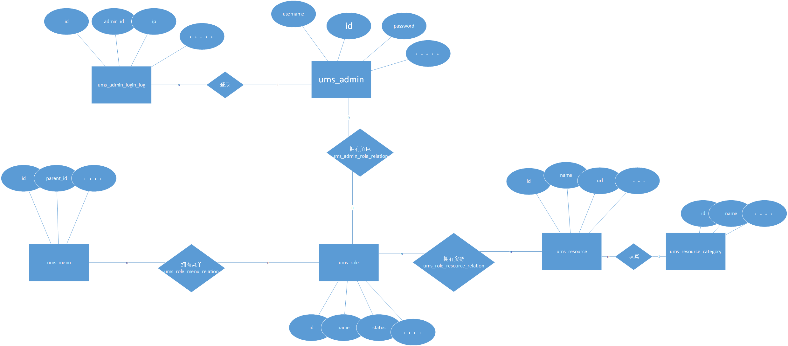

# 前言

很多介绍很难从初学者的角度出发，大部分都只是简单地跑起来截几个图，然后说一下功能就结束了，说实话这样的项目介绍除了让人知道有这个项目之外对如何掌握这个项目并没有什么实质的帮助！

mall-tiny 项目文档完善，但是比较乱，下面是我整理的一些必看的一些文章和对应的一些顺序！由浅入深地学习了这个项目！


# 1. 总体框架

## 1.1 mall-tiny数据库er图

[在线预览地址](https://viewer.diagrams.net/?highlight=0000ff&edit=_blank&layers=1&nav=1&title=#R7X1Zd6JM1PWvca3vvehezMMlg6CgKCBON89CJlEGZXD69W%2BRSLpjjF%2FSMUp47QvbFIMMu84%2B59SuUw2UC3diYq7m3dh2ggYC2bsGyjcQBMYIFPxXtOyfWyiMeG7wEt8%2B7vSnQfcPzrEROrbmvu2kr3bM4jjI%2FNXrRiuOIsfKXrWZSRJvX%2B%2FmxsHrX12ZnvOmQbfM4G3ryLez%2BfEuEPJPe8vxvXn5yzBBP28JzXLn452kc9OOt381oc0GyiVxnD1%2FC3ecExQPr3wuz8cJ72w9XtjGDPLjpTaaVIMVGnSz0SQaVLPB4I0m2WCZovF4sYkTZR85OfL25AgRgENZNwZnADeT7Y9PiFjncbnhV%2Fr0%2FhgEX%2B3KJtcM%2FQC8fEb3Qz2PQLMVB3ECGhoI6j79A222n4C358dgOxNkYCsbOFnmJL%2FSlWn5kQeaoadzBn7k%2FJofnzgDF%2FeBg%2Ba42C0rfgb%2Bc0ngm1f8n4fpf6Yd%2BlF5E7OkuPXj1rIRND3fXNmMvLpPZOMkmQ%2BAwQS%2BBy6TD33bLrax5rHBAg%2FXKS59k9q7Ng9a4OIh%2BEHAPd8xOAuKz%2BiZXVyxl5i2D44ot0VxVJwMoGRV%2FGCaOZHlB%2F8vmrIdPmY8vqn1oQOqt%2FcLZwvphubp4HRsJ6eX3Wk87sy3Ct0DDVm%2BZIJEWUkerB%2F4FqaOwH2BvZWJNx0sFwxmLLeS4Ylj8EwRluDH8KHjhvE%2BtMcxTO7m%2BCHUJELFEHbEuRYSS67NgKfFTjbgg%2BnT3IzsSWgLnBSRRLiliAfwlcKWwWDeH3IWuPL%2FKe4iS%2BKl89dtv7zowJw5AWtaSy%2BJ88g%2BufunNqcAIQT%2BmmdhcHyK27mfOTp4ycWz2QJT8%2FKG%2FgZ12SfAm3J2fzUdQS46cehkyR7sctxKQ8feerROKE49%2F73909dh4tiB53%2F3c%2BjYaB7ti%2Fdy7j%2FdCnw59qzzvQx9i7ESOcjXkbMZtjp82vaa%2Fa258NU2obkGeIdzapYjiMSJGltcKUEvRdg3Dzuc4s1DF7Rs2osFm4U%2B50PcKuAWjjWbUtHEwjkTHJ5GkpR2muvJYDWHOMxYzLHxJmya6wPoOxjsLTs0EZmxPZYTUSAmuqtmhg%2F1xmN%2BGKz7rqT0iTyNM2M%2BmUltoxuqM%2FCTopgwu5UWLIZ7i2dzC57LXaRjBWPwNgSyRUeCC942SyGcjeEDcNlsaKUrS9fCHBN%2BFN6w13gDTPIWb8gZvJHI1%2BGGvQ839OtwG0%2FovwwVgnTHYt%2FxqIEx8WR2I6DOXrDlHh4imY1wvoqiJiQb4oHNodBeeZS5ZqbNCTneS0tVgBle2o6XsJO4s2iDmtJAXu00eLWlhoeV4S3kHtnN4kNvF%2BFqh%2B9Ba76N%2BBtL3BXwLR5IFPj%2BuAA77jXfM0kvN%2FitEEE%2FDJFbQACvFa%2BDu%2FoKoYMXkv3N1qc29wiA9%2FD%2FCk%2FHxitC6ePuxutzVR2CxPtWCH%2BQXh1Jj4LgV6QH08TtSI98H27E1%2BFmHIZIJ8XbneZ8qAzacceP5AOEZQdou9oPGdgOmnA3Tbp7yMv2%2FpZNA10ZD0dKZPf3PtwZ%2BODypQ4Ft4EzLrSl5rIZqzIwtYjAixrHGrq7VoW2jwuspCZj3mxD0qHb181wvpyGjjcIZWvNiNP%2BkGHTtuOzPQ23eZtldfBc2K47EVTmvvRHVMr2UF%2BjPxirFP3lqZNEZuhclQRPbXBdSLBaQKTft0rkgwTrSIIwVLLePUK%2FMpt6DnDUD6bB3DfBo9ZE2Vp2O8wBHnQRNVOZGSfHXrJ0xmqkGoYXLSSENZg70iBdKesDn8kd%2F2AeXJlpuo2T6waDp2a4LjxYMSQi79sl%2BkGEtSTCl3x6mXMvw8ObAO5Czh2GfjIT5iAgTPURYEKFnxygzpSFi6AQgLgIClmb1Z6DwsX9g8Ky11fFCGHv0uHqLBcejS7zYnRDM%2FH86FfguAVrQX9akiOR%2FdWUxasXtjs2zeIsi8OX1oKKfvngAUfloZvyF1%2Fs%2FltCfcuLP5nTG020QUENCvnQl%2Fc4%2Fqv3P5g7YQHzO9z%2Fp3yZl%2BbVh%2F2bU3ati39TNdvyxRGXynVLskHTDRZ8wRss36Dxm0sqrqOpUPjY8Pj2s6bCYWQXTZVm0Jw0C96dAyeB3dqrRdsUONQ60L18yYscTLSmo3bX0DfsZjgIUNUDP86qy%2FVuFC0lcLqhBw%2FyDZvTI4QUXQRSQ2W2zCRtTw2xNdROx1I251MRmSiIapO8Do7GXFE8gBvaW8gUMXcDVELT%2FXyREYeNomPz7tjfGO5Pcu8I5ERRQZ1J9kPf1dsuDC7BnxzeO8GM%2B2p4u8BMR3Bwvw2t50yzBd4kKtCysGuPyNA14UhtI2Hho9OsHyKisk8Hu7XPjHasnkgii60kRk%2BYaaSxA6qV2SFfqGugXZjN4sWMnGODXJXkEY4odt7bT4apOpz5Cwj1%2B1Zrtc8wdOAnO5nwnH9y4v4Gz63hQZ7AAyvt9d%2FwoM7AA7mC3gYmv2iM4Q8aY9w6voFvNcbwVRMen%2B0fn%2FAI%2FhlwV3QLPp7%2FLw0Z%2FJukXmH1F%2FIbe4tWnPiNYWfwiv2msCtAtmZDVqUS878g9p4%2Fb%2B5AXGGA5SHK%2FE6OQBHktQtBnuGIbxNlwhfG5uDTsZKHD3EHfGDUa3yc9SHKaQbX9iHKc9TEh%2FiaJP6ND%2FHJ%2FvHDfIiPj52USMV%2FlwnnO%2FoQZQ87qzO%2FgvL3McpSfQ59cYBvkfQqf%2Fss4LCvA248oWd8rAIeHY6LwSOWn6mTMSZ2XUmWVdFqMoewXxhRNmwRCp05CE5ytNaK0Ykii20ZXP96CT7sJSaaDNsksG1PCQ1BYTqwv6UJ3sW3Xdoh5VDTwiIXBDBV%2BFZ9Q9%2FF%2Fbm9jyMtQI2hnOXhcmeZIzpqJ9F0aQ1Jf9kfp5G%2FLo7iugDHwtOMr7sOt3wCPTdBR6lHrkdI8xzOXFuKfmqW65KerxoWL8yJQR5y9FpSI3aSgrwtNeIXAPeTBel5e7LS21D30B8oh2nvSZBu%2Bkyu4Tb3JEh3qiBHL%2Ft7VcxPmZWsBxX6q%2BuSYF216FVD4YU5MshDjl5LEoRp%2FI4kSF0A3BXk6M9TkY3n%2BJCIWCVsW%2BBV0WHL1%2BdNdtLH%2Bkk6htIWr5BZdkDgjWevBgvM4gTR3c6C4aa7NRSYEf10uMKbRJsj4paJjEPYablT38kWA1HTczQPeK2IC4e6NDVaWxe3%2BHga7sXAVzszFsOCRFbtESFhkSMXiDeLtDzs73Y6rbnb7p2pkKyWESqTazWhwivHg3WVo1cMheiFeTLIQ5BeSyrEcfI1FeI3pEL0Qm4evYIeHVCh8pQqbQ%2F7EGGIwOC0qJ7lSAuJG%2FJcu4smpDdW53mUZRvaKYaTFyNSXEwkuTXbkFxRUcPZqPKaGTZnUw1CPEuAmSZcjFZulnhvN9fWBNqeSlriTmYKfkhlaATFHc%2BZAsoV4niJcNP5OMQn3VxO16vBHGZRycKm%2FIpcbYHJBPv4RP%2F%2BSdKy51fFECG1osN%2FknNfhznrKnSuGmDrldUvhEpJHHxtbv0%2FqJPQUxXeQ51UMXeBPkkfU9hNS8Y95ipVzlY8ldtkn8ptEg2aa1B0UYmTIRv0U0lO8Cf7SU77ufOW%2Fgg8C%2Bv5X%2BIE5tNP1e9Orz5D61%2FY4gojRo%2FJMN%2FIFSflHnH0DFecm%2B0AlyTzJa64MNaIfjKhdAIae0JLzy7GsARNy8G5ZyWr7M6KmcYR1x63ULfIXhQ6GE8a%2BbDgeDutw4uk0UPHGgM8DGkYLhhqtGTYDbOObJanxCwL%2B5uhbh7CDBkpuy0ATEyVgBkhkygFjoWQ%2BtDB76etVZTAm0gY%2BEOSwxnmC4Hkv2tawaMM%2FNXwXV%2F988ChT6bJnKlLe86Th6EruPLYQ%2BL6fjz52Y7zsySupcn4OFJ%2FwdRvBHkF1l8EenuRK3YhkYadBlUPY1clYwcCo9fWjsDRj1m7chDzS8D5qgajztbusz3nZ1k77NNQPWftYBh6abudufvqVNZqhdBP6TYnjfPEunnKDbuC4uCRcvtWsQqOvJ5FQ8G3zLlh9ZuDW%2Fa1%2Fywzc7y4eB637XT4FcY2H53uWzsdhWP37HTv64Eeie5KJbpZvAE8GtDCMg0a%2Br%2BU6D6muI%2Bm9DTXfc%2FEMH6dYcRHYvjbimCS9P%2FXuJ6PectM4JeWgflqhq9qdgkrSpJRzaeqZHCxAt6t3ZkrTKN%2B9Ldv7G8kfDpqf8OyZPiF3CRwsh4lRe5eUgQmqJMI80zNmTI5fu2SIjjyyEC%2Bvx7JJ%2FvHz8pA4v%2BQgYR%2Bl4C5Y00R%2FEIdbfyTksuHSfue%2BP2U8m5p0t6Xqf1Ek3bdSouf7R8%2FzKR9fLnBipm0C3IZ4uGlVcGkQdSJSSOwt158ed6r27THQPH7Nu2zHeSH2bRPy2JQ5DdZAZP2%2FijxI4leqSQ6JRTfm3iD%2BnxR%2FRok0UMnyiuVQCdP7dkjoVephB5Gn%2Bbzbqmsxi8UsCA%2FWbXm4Sq%2BJzFsvcvHn1%2BVAn9dyp2izgy3kN%2FkOBJfnRpZZ8fxs93lhzmO1GeR%2Bgsm0N%2Bva%2FPcw3MkvprAqZbTVTgahY9x63FB6iFzqrgjAeOvO9ttp%2FMSF3JO1OlKVw9H4v6OBAqfwOWcIwGds8tXQAv5mJj1viPx2e7ysxwJ4h8mZqHQ7%2FunoMgL2gf6YeGqkFVHT4OjM5NNYeKbRgrLLOnDpp2xaZ%2FtID%2FLppGfhiqO%2FUaJ%2B5u0C9oH%2BgoVGR5FAqsXJlAnlRxgCL1hlUDywjIF9BUqNI%2BNYoazuuVbmbJYc7rJENbIJVitbY%2B6pB4HPRRVumsWH01IO28zw1kfhJdIjM8X1NNbRRZbM2aXgwSEl4jkDQxGGLpFiKiq4KMnEdiw3xoszcUYjfhOEvYxz19jkDBLXSLL4WVn6EyNfr6belP%2FYImGnou4dHA3KapnEjXvwtL9KwSSHxc23AQT9VpZ%2BsoFc9%2FY4bqU%2FasaCi%2BsuExfYWLtgwurx4U0%2BjoHcmMuvLBaAX2FEs2AC1k%2B7r5woddRybRFeZnNrmNoFEzAi%2BsDNoxZpAsjZFcFfdgiO8xUTfRQBFcqLIlI36kstuiNdoq993ywa9JqdiFjS9kJZm2YwXJ6QFoLfoDKSsGERYLWdCcRRLpkAe%2F9apWTa4nrCEusvQutFTEIbHfqytBm39wYrXuy4McXUr4JGuo1Nzsyw6%2FVP3jDg6c2uDY8WDEcXlo1GLrCKNCDCKtHhDCE3DMqLOUt5zF3mjr6SYuJaVG8DPxQslWCmegMN2eoOYMw2k7qtK18nTPqnHHFWcp9qQTWlQjx46sC3wQUJYrrQYhpZmZ5elVKfGuOa8OJFYMicsk%2BIQ9OrCUnvsDphRPPKSq%2BDXMXcvOAna8QHk6K8FB9LgZJGCIx5T0kauUTvS0bVtPrHtZPw45Ej0Dd4s3T7GiLoCYk95Scs%2FG%2BOdAoCGNTTIEnyQySDI%2BDwVH%2BRsvBWy%2F0O2ubIDV5CvekYs0wS2H7qajPZ31wssTdqr15PosnQywwOg4lS9zIigka0naoKRexqbOfyuQslpBd%2F46sWPb9qpiiesnZbr6KyltzXRfOrBpQLwjCgCV9cGYdObP02cvytzcNIi8k8GHoCkugv16BDGGFuQOITpiFLX%2Fgq8aAax%2BiOdkeQt1DToAHIQxJkssG%2BTTbQrEyX1BiQaLpsAupLOSNQhtK%2BeYqZok4GqNq8qRJVVCRXkyjrrkZRuiGDcZ7ZM9aY1hmbFEo4CkPm6up4faZdCgOjbUR%2BDa1GgRRr3g8vUBIipJBggrdN5SkPi7yugk06lVj9sojjG%2BtcW0osWIwvDDZCoYeeptaUiJMnJSEvyknXkzmX0Nv84oToXln2o%2BLIFIFQSSkNvlDu1SvgjDyhRO1VnyYKLLYlt2soKvefsLTjNYksG1PCQ1BYXh4uaUJfkMutDWGDi3fRzf4TNkcpvSOF7xQBkcFHC0On8LMIT%2BbjMNFOuWUgLQW%2FqarzgHK6eGI3GkH1bonE3583tQtAEHXq17i85P%2B7%2BqEWFfNTdXQeEFSD0MP0U0tCRG5JyHSFzP5VxDd3G2kMY8nohPqomz5Sqd5gAZNRM1UZsbJsZcsnbEaqYbhRQsJYQ3mjoRIfxwwNwFEvVb7vUM%2Bta66nKoB9YJyHoYfupxaciWMnehyiHI20E0gdymFD19BllMMQTbj7tMQ5JIAlLUI2cy1t5q%2F7grz%2FTKxgWvAdoWwTUaETuNdFxOJwxZZM1Yz3R16s2gX6mwL4pcbfqytzD0DiJLlc8GUp5PNAjOcFSyLmkaCO2UyEZ3tTH072uaK3veGdiTTqmb73ibnjfXSXCGrjuAYKx1OFDJR9npALorj7j9fo%2Bz6VbFEXy0fWC3KvHbw%2BMYW14YQKwbDC%2FJ5GH6IcupJiPgpISI31OTQlxL48BU0OfeJHkdmGETrpuCH8aKLdGkOypYtgxG3vtlu460AEiBBaHewveINK6BTLTt%2BVezQ%2B%2Bt7%2FUQ6vPrEjbe2uDaEWC0gvtRxOm%2BeHpKbejIiAZ%2BGiMjtGLGYnXEBc1dR3YBr0PinKLGo%2F7Zag3clZlKStQrwCQNR52eMvCJ6M%2Fdp%2FXLeEosxR3IWZZ0p65CaqsRCPJjjLp7zwTRmMTWaOeLYimWT4fUFxYf7UeuQ0tpODjVNpxedeTGPEesFRrpu452emhB2gnPrWWR3DhwCt7SJSHaw1lTu0s62GNQUSUk96PccZ3zp%2FJUxRkitaDFPgiuzYl1FN9VD4iUlPfyQ3dSTFk%2FXybsxLV7M1l9FeHNCizF1WLHojtkdCuhhQddn4qY1wsG2PuS5mkLnCNqfjQg270J91ROlDmQVsEzF7l7laCbrkrEpKCOVWcdFxJjHq%2BJMqIK27fmyPcrcVR9x2SDaDQQvl1B5nD1LUtc015ppyWTcksBhhi5vs9F0H%2FVEg84pV%2B6MCQlmqfvGjC9GoDJGqV5Fb24%2F7vjGcNeHP6sG1UvCevih0qknf1Jluv%2FInyQK3ZI%2FLyb3r1Ec5%2FXQI%2B%2FbE37USvtTghMMS2Dh%2FgyZWwFn953BpuA1immNElGbKLIyKbhX9vpros06nuzbxqQl4l2OiEUiK%2BJBohC1HkJBcTvLbphOC4MX8UPwiSi6NDP62xyfbLT9LOaS0XgItUcjWd4gxmCt9zh6t29JyAAfAhALbAt27z8A%2BWICKmOS6lUs5%2BpDkHXV5FQPiJcE9shDlVNPbqRPJKy35Ub4Upof%2BcnVcoJobUh%2BKPFtqEtbB2XJP41Cym2xGIVki1FIqSqjkC9dvyqmCK5XvZzrj0O%2BMcf1YcWqQRG5ZKEe0pxasiICnay%2BcGNWvJTlR36sNqeY2ZFOQ8dXQ9ladhf6AT60qzmz46XbV8YMPWrlfJEx66rcuTNUwZ9JXLzbl20iuMN5N7adYo%2F%2FBQ%3D%3D)




## 1.2 mall-tiny学习路径

1. 每一个文章整合一个具体的功能，总的代码是在这里：https://github.com/macrozheng/mall-learning，在每一篇文章的末尾也可以看到具体每个小项目的地址！
2. [mall整合SpringBoot+MyBatis搭建基本骨架](http://www.macrozheng.com/#/architect/mall_arch_01?id=mall整合springbootmybatis搭建基本骨架)  
3. [MyBatis Generator使用过程中踩过的一个坑](http://www.macrozheng.com/#/technology/mybatis_mapper?id=mybatis-generator使用过程中踩过的一个坑)
4. [mall整合Swagger-UI实现在线API文档](http://www.macrozheng.com/#/architect/mall_arch_02?id=mall整合swagger-ui实现在线api文档)
5. [mall整合Redis实现缓存功能](http://www.macrozheng.com/#/architect/mall_arch_03?id=mall整合redis实现缓存功能)
6. [认证授权基础:搞清Authentication,Authorization以及Cookie、Session、Token、OAuth 2、SSO](https://snailclimb.gitee.io/javaguide/#/docs/system-design/authority-certification/basis-of-authority-certification)
7. [session原理](https://blog.csdn.net/weixin_42217767/article/details/92760353)
8. [spring security 视频](https://www.bilibili.com/video/BV1VE411h7aL?from=search&seid=791912643187913019)
9. [spring security 博客](https://gitee.com/gu_chun_bo/java-construct/blob/master/Construct/md%E6%96%87%E6%A1%A3/springSecurity%E6%95%B4%E5%90%88jwt.md) 
10. [mall整合SpringSecurity和JWT实现认证和授权（一）](http://www.macrozheng.com/#/architect/mall_arch_04?id=mall整合springsecurity和jwt实现认证和授权（一）)
11. [mall整合SpringSecurity和JWT实现认证和授权（二）](http://www.macrozheng.com/#/architect/mall_arch_05?id=mall整合springsecurity和jwt实现认证和授权（二）)
12. [手把手教你搞定权限管理，结合Spring Security实现接口的动态权限控制！](http://www.macrozheng.com/#/technology/permission_back?id=手把手教你搞定权限管理，结合spring-security实现接口的动态权限控制！)
13. [使用Redis+AOP优化权限管理功能，这波操作贼爽！](http://www.macrozheng.com/#/technology/redis_permission?id=使用redisaop优化权限管理功能，这波操作贼爽！)
14. [SpringBoot中处理校验逻辑的两种方式，真的很机智！](http://www.macrozheng.com/#/technology/springboot_validator?id=springboot中处理校验逻辑的两种方式，真的很机智！)
15. [参数校验](https://snailclimb.gitee.io/javaguide/#/./docs/system-design/framework/spring/spring-annotations?id=_6-%e5%8f%82%e6%95%b0%e6%a0%a1%e9%aa%8c)
16. [SpringBoot应用中使用AOP记录接口访问日志](http://www.macrozheng.com/#/technology/aop_log?id=springboot应用中使用aop记录接口访问日志)
17. [前后端分离项目，如何解决跨域问题](http://www.macrozheng.com/#/technology/springboot_cors?id=前后端分离项目，如何解决跨域问题)
18. [前后端分离项目，如何优雅实现文件存储！](http://www.macrozheng.com/#/technology/minio_use?id=前后端分离项目，如何优雅实现文件存储！)
19. [RabbitMQ博客地址](https://snailclimb.gitee.io/javaguide/#/?id=%e6%b6%88%e6%81%af%e9%98%9f%e5%88%97)
20. [RabbitMQ视频](https://www.bilibili.com/video/BV1KJ411z7ke?p=167)
21. [mall整合RabbitMQ实现延迟消息](http://www.macrozheng.com/#/architect/mall_arch_09?id=mall整合rabbitmq实现延迟消息)
22. [我常用的IDEA插件大公开，个个是精品！](http://www.macrozheng.com/#/reference/idea_plugins?id=我常用的idea插件大公开，个个是精品！)
23. [Java 8都出那么久了，Stream API了解下？](http://www.macrozheng.com/#/technology/java_stream?id=java-8都出那么久了，stream-api了解下？)
24. [IDEA中的Git操作，看这一篇就够了！](http://www.macrozheng.com/#/reference/idea_git?id=idea中的git操作，看这一篇就够了！)
25. **[Spring/Spring 常用注解总结！安排！](https://snailclimb.gitee.io/javaguide/#/./docs/system-design/framework/spring/SpringBoot+Spring常用注解总结)**

## 1.3 mall环境部署必看！

1. [mall在Linux环境下的部署（基于Docker容器）](http://www.macrozheng.com/#/deploy/mall_deploy_docker?id=mall在linux环境下的部署（基于docker容器）) 2. 结合  这个看[地址](https://gitee.com/gu_chun_bo/java-construct/blob/master/%E6%90%9E%E4%B8%83%E6%90%9E%E5%85%AB/%E5%BC%80%E5%8F%91%E9%83%A8%E7%BD%B2.docx)
2. [开发者必备Docker命令](http://www.macrozheng.com/#/reference/docker?id=开发者必备docker命令)
3. [开发者必备Linux命令](http://www.macrozheng.com/#/reference/linux?id=开发者必备linux命令)
4. [Linux防火墙Firewall和Iptables的使用](http://www.macrozheng.com/#/reference/linux_firewall?id=linux防火墙firewall和iptables的使用)


## 1.4 环境安装

1. idea的lombok插件的安装，[无法安装？](https://blog.csdn.net/chenpeng0708/article/details/105862193?utm_medium=distribute.pc_relevant.none-task-blog-BlogCommendFromMachineLearnPai2-2.nonecase&depth_1-utm_source=distribute.pc_relevant.none-task-blog-BlogCommendFromMachineLearnPai2-2.nonecase)
2. idea中mybatis插件的安装，[Free MyBatis plugin](http://www.macrozheng.com/#/reference/idea?id=free-mybatis-plugin)
3. [设置新建类文件的类注释模版](https://www.cnblogs.com/xiaostudy/p/11253510.html)
4. [使用idea查看类继承关系](https://www.cnblogs.com/deng-cc/p/6927447.html)
5. [我常用的IDEA插件大公开，个个是精品！](http://www.macrozheng.com/#/reference/idea_plugins?id=我常用的idea插件大公开，个个是精品！)
6. idea 
   1. 查看类的字段和属性：ctrl+F12 
   2. 查看类的继承关系；ctrl+h  
   3. 查看方法的具体实现 ctrl+alt+b   
   4. 在进行源码追踪时，返回上一层ctal+alt+左键     
   5. ctrl+alt +t 环绕代码块  
   6. ctrl + e 打开最近的文件


# 2. mall-tiny里面用到的一些知识点

## 2.1 java基础

### 面向对象

#### 枚举类的使用

- ResultCode 类中枚举类的使用


#### 范型类和范型方法的使用

- CommentPage，CommentResult类中范型的使用

#### String类的使用

- 非空校验 StringUtils.isEmpty()  UmsMemberServiceImpl类
- 检验字符串a是否以xx开头，使用a.startsWith() 方法  JwtAuthenticationTokenFilter类
- StringBuilder类的使用，用来构建字符串  UmsMemberServiceImpl类
- 不可变类了解：[地址](https://www.cnblogs.com/dolphin0520/p/10693891.html)


#### final关键字

- 快速入门：[博客地址](https://www.cnblogs.com/xiaoxi/p/6392154.html)


### 集合

- 判断list集合是否为空，使用list!= null和list.size()方法  UmsAdminServiceImpl类
- 集合类判空，使用（hutoos工具包）CollUtil.isEmpty(collection)  DynamicAccessDecisionManager类
- 遍历集合List 使用迭代器
- Map<String, String> tokenMap = new HashMap<>();   map的使用  UserAdminController类
- 创建一个指定元素的ArrayList   List<String> MENU = Arrays.asList("a","b", "c", "d");
- hashmap原理：[地址](https://blog.csdn.net/woshimaxiao1/article/details/83661464)


### 异常

- 异常入门：[地址](https://www.cnblogs.com/hysum/p/7112011.html)


### 反射

- 反射入门和反射的一些api：[地址](https://snailclimb.gitee.io/javaguide/#/docs/java/basic/reflection)
- 反射的应用：
  - 反射在spring中的使用-->spring ioc的实现原理，spring aop的实现原理（使用的是代理模式，包括动态代理和静态代理,介绍动静态代理[地址](https://blog.csdn.net/yinni11/article/details/80217241)，介绍aop[地址](https://snailclimb.gitee.io/javaguide/#/docs/system-design/framework/spring/SpringInterviewQuestions?id=aop)）
    - [ ] spring aop中的动态代理可以通过jdk或者cglib实现
      - [ ] 两种动态代理的视频教程：[地址](https://www.bilibili.com/video/BV1KW411R7F5?p=21)
      - [ ] 代码小案例：[地址](https://gitee.com/gu_chun_bo/java-construct/tree/master/%E4%BB%A3%E7%A0%81%E5%B0%8F%E5%AE%9E%E4%BE%8B/reflexandproxy)


### 注解

- [ ] 注解快速入门[地址](https://www.cnblogs.com/liangweiping/p/3837332.html)
- [ ] 自定义注解  FlagValidator类   CacheException 类


### 其它

- [ ] 函数式编程：[地址](https://www.cnblogs.com/snowInPluto/p/5981400.html#11-%E5%87%BD%E6%95%B0%E5%BC%8F%E7%BC%96%E7%A8%8B%E7%AE%80%E4%BB%8B)

## 2.2 框架的使用

### mybatis

- [ ] 更新方法中的updateByPrimaryKeySelective()如何使用
- [ ] 查询
  - [ ] 分页查询和模糊查询  list()   UserAdminController类
  - [ ] 主键查询 selectByPrimaryKey  UserAdminController类
- [ ] 增加
  - [ ] 插入一条 insert()  直接插入，不管为不为null  UserAdminController类
  - [ ] insertSelective()  不为null的才插入
- [ ] 更新
  - [ ] 部分主键更新  updateByPrimaryKeySelective() 不为null的才插入   UserAdminController类
  - [ ]  updateByPrimaryKey  直接插入


### spring

- [ ] 实体对象属性的复制 BeanUtils.copyProperties()方法   UmsAdminServiceImpl类
- [ ] **循环依赖问题 JwtAuthenticationTokenFilter加入Bean**
- [ ] AOP
  - [ ] AOP快速学习：[地址](https://blog.csdn.net/q982151756/article/details/80513340)
  - [ ] AOP记录接口访问日志  WebLogAspect类
  - [ ] AOP进行参数校验 BindingResultAspect类，使用了springmvc中的Hibernate Validator框架
    - [ ] [参数校验项目示例地址](http://www.macrozheng.com/#/technology/springboot_validator)  [参数校验地址](https://blog.csdn.net/wuseyukui/article/details/81164207)
- [ ] spring 对事务的支持？[地址](https://snailclimb.gitee.io/javaguide/#/docs/system-design/framework/spring/spring-transaction?id=_1-%e4%bb%80%e4%b9%88%e6%98%af%e4%ba%8b%e5%8a%a1%ef%bc%9f)
- [ ] spring 事务失效的情况：[地址](https://mp.weixin.qq.com/s?__biz=Mzg2OTA0Njk0OA==&mid=2247486483&idx=2&sn=77be488e206186803531ea5d7164ec53&chksm=cea243d8f9d5cacecaa5c5daae4cde4c697b9b5b21f96dfc6cce428cfcb62b88b3970c26b9c2&token=816772476&lang=zh_CN#rd)
- [ ] IOC
  - [ ] Spring中 Bean 的作用域与生命周期：[地址](https://snailclimb.gitee.io/javaguide/#/docs/system-design/framework/spring/SpringBean)
  - [ ] spring注入的几种方式，spring注入的几种注解：[地址一](https://www.cnblogs.com/fuchongjundream/p/3873073.html)  [地址二](https://www.cnblogs.com/java-class/p/4727775.html)
  - [ ] BeanFactory和ApplicationContext的区别  [地址](https://www.iteye.com/blog/youyu4-2346183)


### spring MVC

- [ ] spring mvc 原理(看之前记得温习上面的servlet)：[地址](https://www.cnblogs.com/xiaoxi/p/6164383.html)
- [ ] 关于视图和视图解析器，数据模型model等相关springmvc组件可以参看书籍：Java EE互联网轻量级框架整合开发 SSM框架

### springboot

- [ ] @ConditionalOnBean注解  SecurityConfig类

- [ ] @PostConstruct注解  DynamicSecurityMetadataSource类

- [ ] @ConfigurationProperties注解，读取配置文件信息  IgnoreUrlsConfig类

- [ ] [@Component和@Configuration作为配置类的差别](https://blog.csdn.net/long476964/article/details/80626930)

- [ ] 从springboot配置文件中读取常量，使用@value()   UmsMemberServiceImpl类

- [ ] ```java
  @Autowired
  public void setMyAccessDecisionManager(DynamicAccessDecisionManager dynamicAccessDecisionManager) {    super.setAccessDecisionManager(dynamicAccessDecisionManager);}
  ```

  注意以上的注入方式

- [ ] 全局异常处理

- [ ] 全局跨域处理


### rabbitmq 消息中间件

- [ ] 快速入门：[博客地址](https://snailclimb.gitee.io/javaguide/#/docs/system-design/data-communication/rabbitmq)
- [ ] 快速上手项目：[地址](http://www.macrozheng.com/#/architect/mall_arch_09)
- [ ] 视频快速入门：[地址](https://www.bilibili.com/video/BV1rJ41117Hi?p=167)
- [ ] ack手动确认机制
- [ ] 消息认制
    1)、如果这个消息收到了,在处理期间,出现了运行时异常，那么此时消息就处于没有被正确处理消息状态即unack；队列中感知到有一个 unack的消息。unack的消息队列会再次尝试把这个消息发给其他消费者。因此可能会造成锁在那里
        解决1)、手动ack，A消费者从queue中取消息，如果成功，那么就手动返回一个ack确认；如果认为失败，那就可以手动选择将消息丢弃或者是重回队列；如果不回复，那么消息在queue中的状态就是unack，即使消费者A长时间不回复，queue也不会再发送此条消息到消费者A中。
               2)、接口幂等性。在本地维护一个日志表,记录哪些会员哪些商品哪个订单已经减过库存,再来同样的消息
- [ ] 实现延时队列    RabbitMqConfig类


## 2.3 数据库

### redis

- [ ] 快速入门：[博客地址](http://www.macrozheng.com/#/architect/mall_arch_03)
- [ ] Spring Data Redis 最佳实践！：[地址](https://mp.weixin.qq.com/s/9j3exBtZ9FWWlyZkxlWaOA)

  

### mysql

- [ ] 索引优化

## 2.3 servlet和jsp

- [x] servlet和jsp快速入门：[博客地址](https://snailclimb.gitee.io/javaguide/#/docs/java/J2EE%E5%9F%BA%E7%A1%80%E7%9F%A5%E8%AF%86)   [视频地址](https://www.bilibili.com/video/BV18s411u7EH?p=20)
  - [x] servlet api继承体系图（servlet中拥有的对象应该是和jsp一模一样的，因为jsp本质就是简易的servlet）：[地址](https://gitee.com/gu_chun_bo/picture/raw/master/image/20200616233938-747558.png)
  - [ ] servlet分为httpservlet和非httpservlet
- [ ] spring mvc和servlet的简单对比：[地址](https://www.cnblogs.com/haolnu/p/7294533.html) ||  代码示例中，在servlet也可实现mvc模型，jsp就是View，userDao就是Model，servlet就是Controller（springMVC和Strus2也可以）    ||  三层模型和mvc模型是对项目从不同角度理解的结果，两者区别和联系图：[地址1](https://gitee.com/gu_chun_bo/picture/raw/master/image/20200617081646-431305.png) [地址2](https://gitee.com/gu_chun_bo/picture/raw/master/image/20200617082005-943616.png)   [地址3](https://gitee.com/gu_chun_bo/picture/raw/master/image/20200617084505-677895.png)   ||   servlet三层模型小项目示例：[地址](https://gitee.com/gu_chun_bo/java-construct/tree/master/%E4%BB%A3%E7%A0%81%E5%B0%8F%E5%AE%9E%E4%BE%8B/servletThreeTierSample/ThreeTierSample)
- [ ] servlet的生命周期：[地址](https://www.cnblogs.com/cuiliang/archive/2011/10/21/2220671.html)
- [ ] web容器和servlet容器的区别：[地址](https://blog.csdn.net/sky198989/article/details/81875590)
- [ ] 如何维持浏览器和客户端的会话之：[session和cookie](https://blog.csdn.net/weixin_42217767/article/details/92760353)
- [ ] RequestContextHolder.getRequestAttributes(); //获取当前请求request对象  WebLogAspect类中  


### 拦截器和过滤器

- [ ] 拦截器和过滤器的区别：[博客地址](https://mp.weixin.qq.com/s/KwlqFezzTkOfg97M59n3GA)  [代码地址](https://gitee.com/gu_chun_bo/java-construct/tree/master/%E4%BB%A3%E7%A0%81%E5%B0%8F%E5%AE%9E%E4%BE%8B/Interceptorandfilter)


## 2.4 设计模式

- [ ] JPA、Hibernate、Spring data jpa之间的关系：[地址](https://my.oschina.net/u/3080373/blog/1828589)
  - [ ] jap详解：[地址](https://www.cnblogs.com/holbrook/archive/2012/12/30/2839842.html)
- [ ] mvc参考：[博客地址](https://www.cnblogs.com/xiaoxi/p/6164383.html)
- [ ] aop即面向切面编程（代理设计模式 ：Spring AOP 功能的实现）：[地址](https://snailclimb.gitee.io/javaguide/#/docs/system-design/framework/spring/SpringInterviewQuestions?id=aop) 
- [ ] Builder模式：swagger和spring security配置类中使用到了
- [ ] 单例设计模式 : Spring 中的 Bean 默认都是单例的
- [ ] 模板方法模式 : Spring 中 `jdbcTemplate`、`hibernateTemplate` 、`redisTemplate` 等以 Template 结尾的对数据库操作的类，它们就使用到了模板模式。
- [ ] 工厂设计模式 : Spring使用工厂模式通过 `BeanFactory`、`ApplicationContext` 创建 bean 对象
- [ ] 适配器模式 :Spring AOP 的增强或通知(Advice)使用到了适配器模式、spring MVC 中也是用到了适配器模式适配`Controller`。
- [ ] 观察者模式: Spring 事件驱动模型就是观察者模式很经典的一个应用。
- [ ] [spring中用到的设计模式](https://snailclimb.gitee.io/javaguide/#/docs/system-design/framework/spring/Spring-Design-Patterns?id=%e4%bb%a3%e7%90%86%e8%ae%be%e8%ae%a1%e6%a8%a1%e5%bc%8f)，具体可参看《图解设计模式》


## 2.5计算机网络

### 跨域访问问题

- [ ] **此项目在多处对跨域进行了处理，处理的原理是什么？**
  - [ ] DynamicSecurityFilter 类中
  - [ ] RestfulAccessDeniedHandler  授权失败处理器类中
  - [ ] RestAuthenticationEntryPoint   认证失败处理类中
  - [ ] GlobalCorsConfig 全局跨域配置类
  - [ ] SecurityConfig  springsecurity配置类中

## 2.6 git

- [ ] git commit的规范：[地址](https://juejin.im/post/5e0c82a15188253a907111dc)
- [ ] git 分支管理：[视频地址](https://www.bilibili.com/video/BV1KE411b7Br?t=461)


## 2.7 docker

- [ ] dokcer基本命令 ：[地址](http://www.macrozheng.com/#/reference/docker)
- [ ] docker安装一些开发环境 ：[地址](http://www.macrozheng.com/#/deploy/mall_deploy_docker)


## 2.8项目部署

- [ ] maven项目依赖管理：[地址](https://www.cnblogs.com/1995hxt/p/5254448.html)

- [ ] 解决多模块项目打包时报错问题：[地址](https://www.cnblogs.com/ningheshutong/p/6435707.html)

- [ ] 在idea中使用dashboard

- [ ] 服务器容器比如tomcat是用来干嘛的，[jar和war的不同在哪里](https://blog.csdn.net/qq_22638399/article/details/81506448)

- [ ] jar包直接部署的方法：[地址](https://www.cnblogs.com/linliquan/p/11232331.html)

- [ ] 如果想杀掉运行中的jar程序，查看进程命令为：ps aux|grep getCimiss-surf.jar

  

# 学习方法

- [ ] 如何学习一门技术？先看大佬的总结文章再下载项目进行实战，再看视频理解项目可以做好笔记。如果想进一步深入那么就要看书学习。
- [ ] 以下内容皆出自Guide哥：常见的内容的重要程度如下：
  Java基础       +++++
  并发             +++++(大厂必备)
  JVM             +++
  计算机网络    ++++
  数据结构       ++++
  算法             ++++
  数据库          +++++
  分布式缓存    ++++
  - java基础书籍《java核心技术》用到了再看对应的知识点，可当作工具书看
  - 多线程的简单实用（推荐《Java并发编程之美》或者《实战Java高并发程序设计》）。
  - 《深入理解jvm虚拟机》需要过几遍
  - 如果你想进入大厂的话，我推荐你在学习完Java基础或者多线程之后，就开始每天抽出一点时间来学习算法和数据结构。为了提高自己的编程能力，你也可以坚持刷Leetcode。
  - 学习MySQL 的基本使用，基本的增删改查，SQL命令，索引、存储过程这些都学一下吧！
  - 源码如何看？[地址](https://gitee.com/gu_chun_bo/picture/raw/master/image/20200623155636-775972.png)
  - 框架：关于框架，你要做的就是把常用的东西串联起来，知道有这个东西就好。根据自己的实际能力，再对底层的东西进行学习就好。花少量时间在框架使用上，比如你使用 Spring Boot 你知道如何接受请求中的参数、如何处理异常等等内容就好了，框架使用的东西不需要记忆，你知道有这个东西，用的时候不知道的话再查就好了！一般都是面向google编程，这么多东西不可能都记住，你用多了之后会更熟练是真的！花大量时间在数据结构、算法、常用的设计模式以及jvm底层知识以及一些比较重要的框架源码上。
  - 笔记：我平时使用 Trello 记录一些自己想写的文章或者代码，以及一些读者的投稿情况和个人突然冒出来的idea。

- [ ] 经验：[地址](https://www.nowcoder.com/discuss/188241?type=2&order=1&pos=9&page=2)


