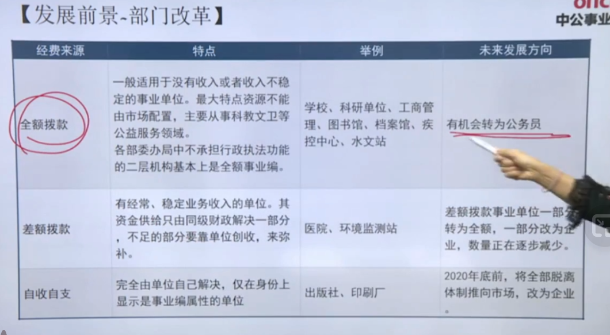
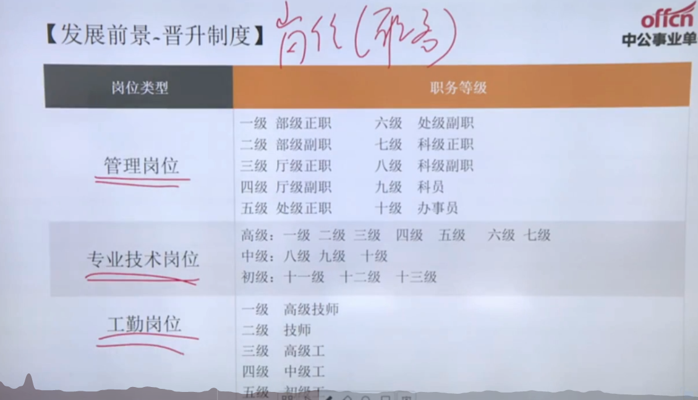
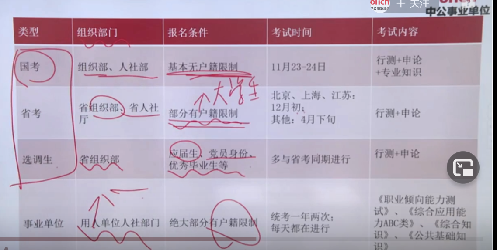

# 1. 事业单位是什么？

事业单位是计划经济的遗物：既承担了一部分政府的职能，又承担了企业的一部分职能；

官方定义：事业单位是指为了社会公益目的,由国家机关举办或者其他组织利用国有资产举办的，从事教育、文化、卫生等活动的社会服务组织。

从上面的定义可以知道，事业单位有三个大的群体：

1. 一个是教师编
2. 一个是医疗
3. 另一个是专技+管理类：承担一定的执法职能的，承担一定的监测职能的，图书馆等

## 1.1 按照是否参公分类

### 参公事业单位

就是指参照公务员管理的事业单位，待遇，福利，未来当中的晋升途径，甚至公务员所组织的一些遴选性的考试都可以参加。参公事业单位考试是放在国考和省考当中进行的

### 非参公事业单位

例子：学校，监测站，医院，执法大队，我们这篇文章讲的都是非参公事业单位

## 1.2 按资金来源分类

### 全额拨款

就是指事业单位所有的钱都是同级的政府财政部门给出，就是国家不想让你这个事业单位从事市场活动不需要你盈利，你只管服务就行了（这种事业单位一般是承担了部分政府的职能），比如公办小学，公办幼儿园，图书馆，卫生防疫站，城市综合执法大队，环境卫生管理处，动物防疫管理中心，融媒体中心，街道综合管理中心，水文站，疾控中心，工商管理，档案馆。

特点

1. 变成行政编的可能比较大
2. 收入更加稳定
3. 不接受市场调节

### 差额拨款

就是一部分政府给，一部分得单位自己赚。这种事业单位它是有盈利能力的，但是它不是以盈利为目标，它要求员工有较强的专业能力，医生医疗能力，教师知识能力。 比如高等院校，医院，环境监测。

特点：

1. 变成行政编的可能很小
2. 收入水平比全额拨款要高
3. 收入水平差距较大，如去北京的医院和去小的卫生所对比

### 自收自支

全都钱都是自己赚。发展趋势：现在已经很少了，国家要把它直接转成企业，将他的编制取消掉。比如有些部门的出版社，印刷厂，有些部门的宾馆

## 1.3 按服务内容分类

### 承担行政智能

主要是以全额拨款为主，未来这个极为可能转为行政编

### 从事生产经营活动

主要是自收自支

### 从事公益活动

公益一类：主要指全额拨款的那一部分，比如图书馆，公办小学，公办初中，博物馆

公益二类：主要指差额拨款的那一部分，如高等院校，医院

### 

# 2. 发展前途如何

## 2.1 部门改革

## 2.2 晋升制度

1. 管理岗位：等级提升取决于部门等级，百分之八十的人事业晋升停在科员
   1. 管理岗位的工资由职务和职级两方面决定，同等职务，职级越高工资越高，职级可以随着工作时间提高而提高
2. 专业技术岗位：通过评职称晋升，职称越高工资越高
3. 工勤岗位：通过职业水平测试晋升，等级越高工资越高

# 3. 与其他公职单位有什么异同

1. 国考：
2. 省考：省考联考的省份越来越多，可以进一步分级，如县级，区级等
3. 选调生：
4. 事业单位：分为全国统一考，省内统一考，事业单位自己指定时间安排考（绝大部分单位都是属于自己安排时间考）；       

# 考试内容有哪些

# 如何备考

