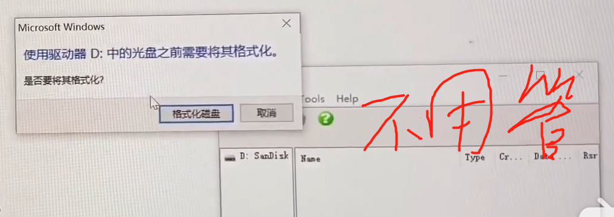
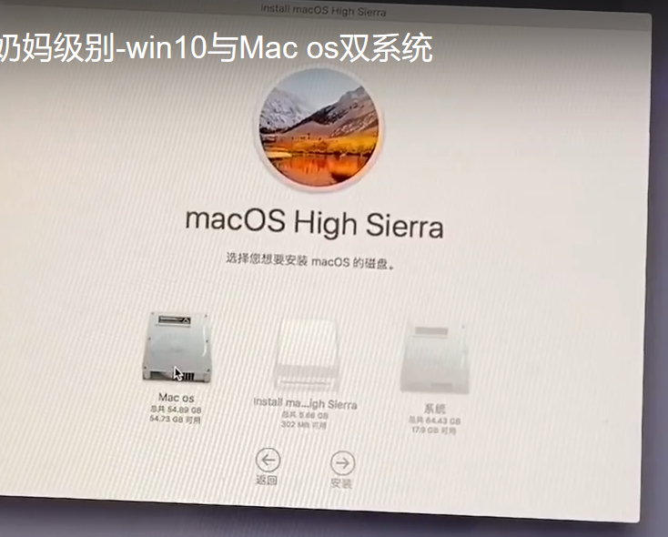
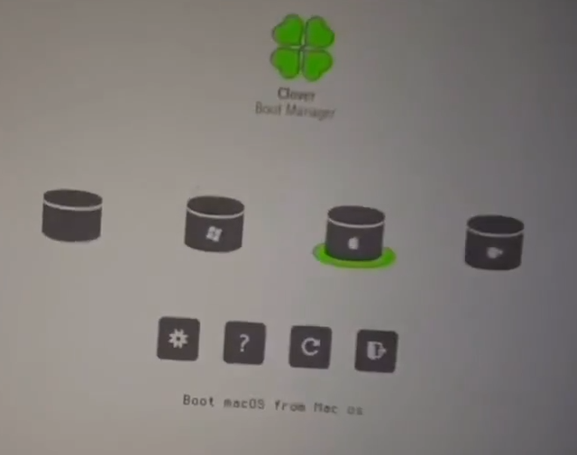
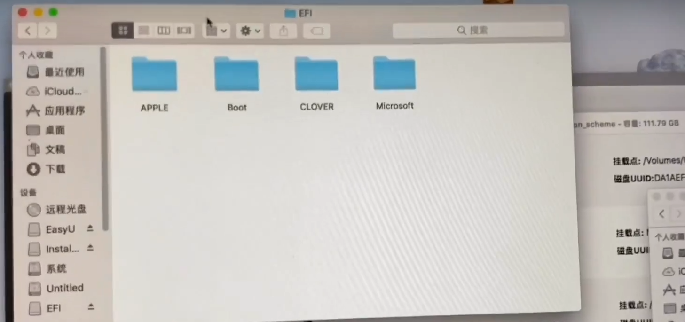
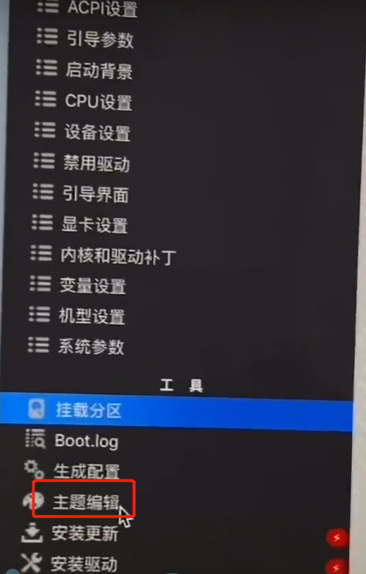
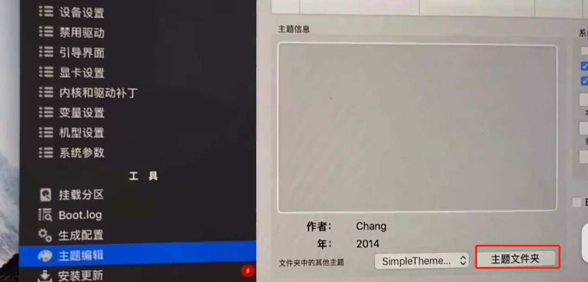
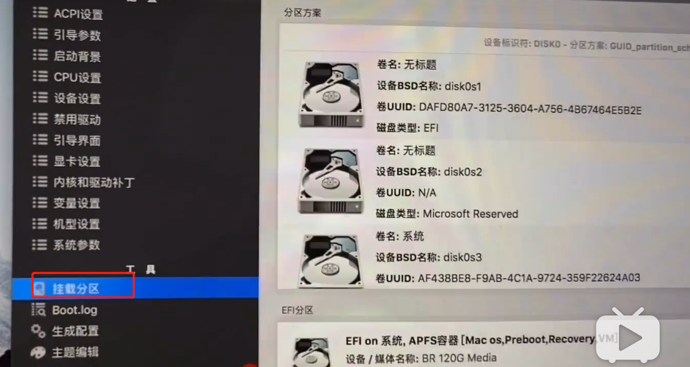
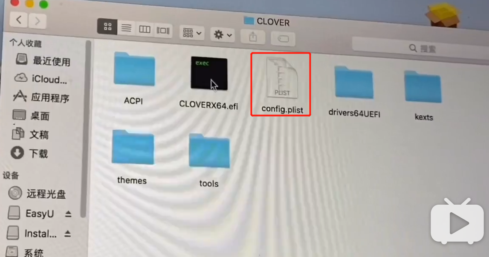
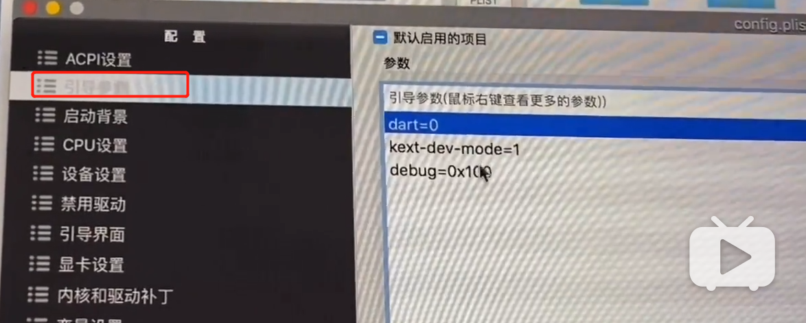

# 需要下载的文件

## 镜像文件

## transmac

将镜像刻录到u盘

## efi

使系统认为我们的电脑就是苹果电脑

## diskGenius

## 英伟达

# 制作u盘

1.打开transmac

2.再次抹除

3.写入镜像到u盘

# 分区

打开diskgenius将系统盘分了两个区

查看ufi文件

如果无法启动则需要修改efi的config.plist文件

# 重新启动

按f11选择自己硬盘,然后选择下方空白的那个

选择磁盘工具

选择要安装的磁盘

抹掉要安装的那个分区，选择日志式

 

如果选择安装会有提示，则需要更改时间，

打开终端，输入date 1025102016.20

然后手动退出中端

继续安装，选择在某个分区安装

如果卡住，需要选择手动重启，同时按住F11，进入界面

第三个

可能会自动重启，那也要按f11，然后按第三个

然后等跑代码，然后再次

出现，选择第三个

启动定位

关闭这个

将appstore的自动更新关闭

修改密码改为不用密码

安装英伟达驱动

需要重启，按11，选第三个

然后设置开机启动项，打开clever文件，打开，选择安装更新

然后点击两个挂载

然后选择打开分区

打开clever里面放的是主题

然后

然后选择clever里面的一个文件就可以更换主题

关闭跑代码

如果出现-v，将它删掉

然后保存

手动重启：

进入win10修改启动项，打开BOOTICE软件

找到efi文件

将位置移到最上面，然后选择重启

选择第二个

