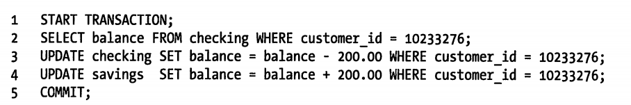
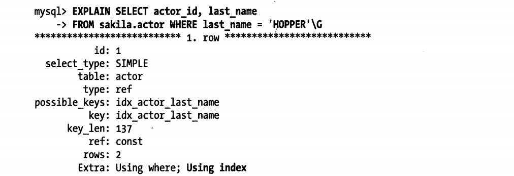
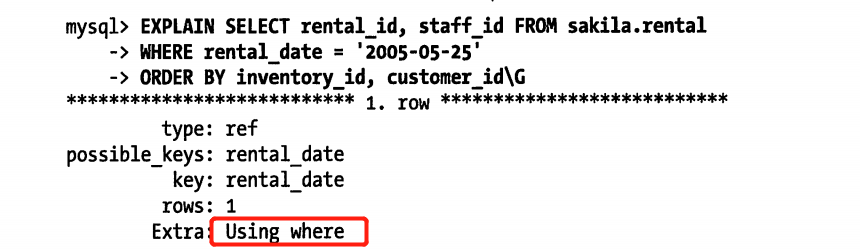
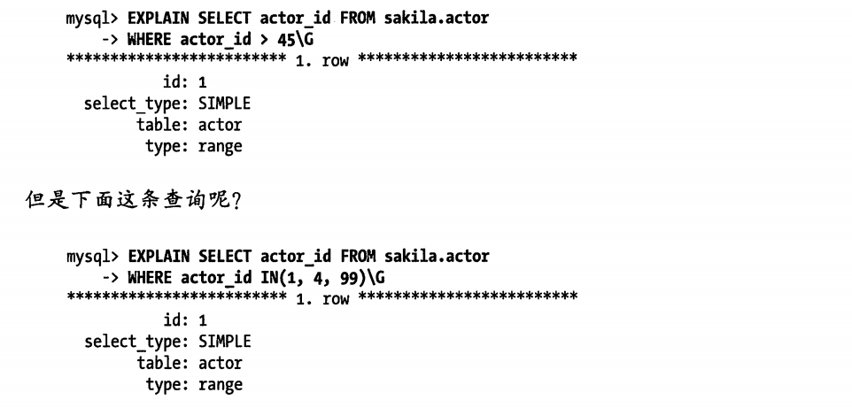
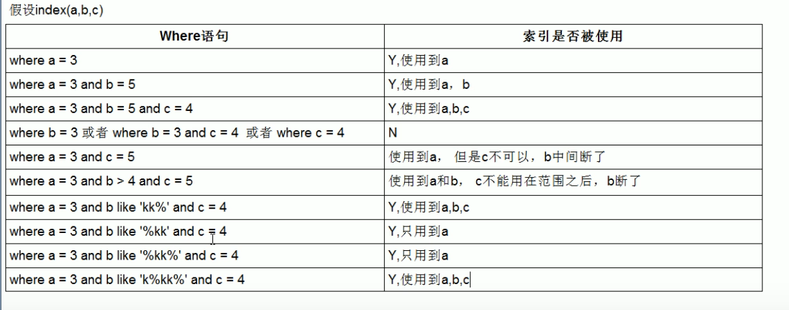
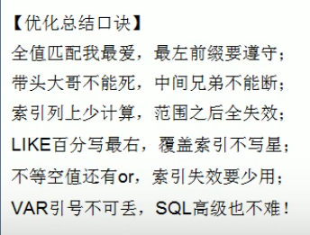
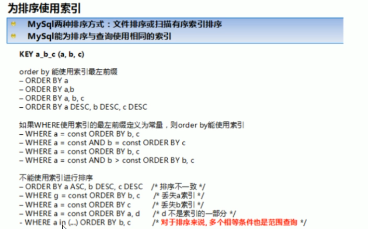
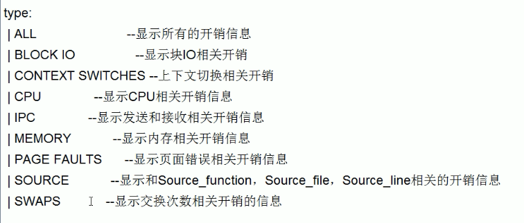

# MySql分层


- 连接层，最上层的服务并不是 MYSQL所独有的,大多数基于网络的客户端/服务器的工具或者服务都有类似的架构。比如连接处理、授权认证、安全等等。
- 服务层，第二层架构是 MYSQL比较有意思的部分。大多数 MYSQL的核心服务功能都在这一层,包括査询解析、分析、优化、缓存以及所有的内置函数(例如,日期、时间、数学和加密函数),所有跨存储引擎的功能都在这一层实现:存储过程、触发器、视图等。
- 引擎层，负责mysql中数据的储存和提取，提供了各种数据储存方法（两种重要引擎：InnoDB  MyISAM），服务器通过API与存储引擎进行通信。这些接口屏蔽了不同存储引擎之间的差异,使得这些差异对上层的査询过程透明。支持的引擎可以通过命令`show engines; ` 命令查看，我们也可以通过下面的命令查看默认的存储引擎。


```sql
mysql> show variables like '%storage_engine%';
```

# 并发控制

**读写锁**

解决这类经典问题的方法就是并发控制,其实非常简单。在处理并发读或者写时,可以通过实现一个由两种类型的锁组成的锁系统来解决问题。这两种类型的锁通常被称为共享锁( shared lock)和排他锁( exclusive lock),也叫读锁( *read lock*)和写锁( writelock)。这里先不讨论锁的具体实现,描述一下锁的概念如下:读锁是共享的,或者说是相互不阻塞的。多个客户在同一时刻可以同时读取同一个资源,而互不干扰。写锁则是排他的也就是说一个写锁会阻塞其他的写锁和读锁,这是出于安全策略的考虑,只有这样,才能确保在给定的时间里,只有一个用户能执行写入,并防止其他用户读取正在写入的同资源。

**锁的粒度**

- 表锁是 MYSQL中最基本的锁策略,并且是开销最小的策略。它会锁定整张表。一个用户在对表进行写操作(插入、删除、更新等)前,需要先获得写锁,这会阻塞其他用户对该表的所有读写操作。只有没有写锁时,其他读取的用户才能获得读锁,读锁之间是不相互阻塞的。尽管存储引擎可以管理自己的锁, MYSQL本身还是会使用各种有效的表锁来实现不同的目的。例如,服务器会为诸如 ALTER TABLE之类的语句使用表锁,而忽略存储引擎的锁机制。
- 行级锁可以最大程度地支持并发处理(同时也带来了最大的锁开销)。行级锁可以最大程度地支持并发处理(同时也带来了最大的锁开销)。众所周知,在INNODB和 Xtradb,以及其他一些存储引擎中实现了行级锁。行级锁只在存储引擎层实现,而 MYSQL服务器层没有实现。服务器层完全不了解存储引擎中的锁实现。


# 事务

事务就是一组原子性的SQL査询,或者说一个独立的工作单元。如果数据库引擎能够成功地对数据库应用该组査询的全部语句,那么就执行该组查询。如果其中有任何一条语句因为崩溃或其他原因无法执行,那么所有的语句都不会执行。也就是说,事务内的语句,要么全部执行成功,要么全部执行失败。

## 事务的ACID特性

银行应用是解释事务必要性的一个经典例子。假设一个银行的数据库有两张表:支票( checking)表和储蓄( savings)表。现在要从用户Jane的支票账户转移200美元到她的储蓄账户,那么需要至少三个步骤



单纯的事务概念并不是故事的全部。试想一下,如果执行到第四条语句时服务器崩溃了,会发生什么?天知道,用户可能会损失200美元。再假如,在执行到第三条语句和第四条语句之间时,另外一个进程要删除支票账户的所有余额,那么结果可能就是银行在不知道这个逻辑的情况下白白给了Jane200美元。

除非系统通过严格的ACID测试,否则空谈事务的概念是不够的。ACID表示原子性( atomicity)、一致性( consistency)、隔离性( isolation)和持久性( durability)。一个运行良好的事务处理系统,必须具备这些标准特征。

- 原子性( atomicity)，一个事务必须被视为一个不可分割的最小工作单元,整个事务中的所有操作要么全部提交成功,要么全部失败回滚,对于一个事务来说,不可能只执行其中的一部分操作,这就是事务的原子性

- 一致性( consistency)，数据库总是从一个一致性的状态转换到另外一个一致性的状态。在前面的例子中,一致性确保了,即使在执行第三、四条语句之间时系统崩溃,支票账户中也不会损失200美元,因为事务最终没有提交,所以事务中所做的修改也不会保存到数据库中。【**一致性（Consistency）：** 执行事务前后，数据保持一致，多个事务对同一个数据读取的结果是相同的；】

- 隔离性( isolation)，通常来说,一个事务所做的修改在最终提交以前,对其他事务是不可见的。在前面的例子中,当执行完第三条语句、第四条语句还未开始时,此时有另外一个账户汇总程序开始运行,则其看到的支票账户的余额并没有被减去200美元。后面我们讨论隔离级别( Isolation level)的时侯,会发现为什么我们要说“通常来说”是不可见的。【**隔离性（Isolation）：** 并发访问数据库时，一个用户的事务不被其他事务所干扰，各并发事务之间数据库是独立的；】

- 持久性( durability)，一旦事务提交,则其所做的修改就会永久保存到数据库中。此时即使系统崩溃,修改的数据也不会丢失。持久性是个有点模糊的概念,因为实际上持久性也分很多不同的级别。有些持久性策略能够提供非常强的安全保障,而有些则未必。而且不可能有能做到100%的持久性保证的策略(如果数据库本身就能做到真正的持久性,那么备份又怎么能增加持久性呢?)。

- 【**不可重复读和幻读区别：**

  不可重复读的重点是修改比如多次读取一条记录发现其中某些列的值被修改，幻读的重点在于新增或者删除比如多次读取一条记录发现记录增多或减少了。】


事务的ACID特性可以确保银行不会弄丢你的钱。而在应用逻辑中,要实现这一点非常难,甚至可以说是不可能完成的任务。一个兼容ACID的数据库系统,需要做很多复杂但可能用户并没有觉察到的工作,才能确保ACID的实现。也就是说，**一个事务不是总能够实现ACID特性！**


数据库事务有不同的隔离级别，不同的隔离级别对锁的使用是不同的，锁的应用最终导致不同事务的隔离级别。

[事务和锁机制是什么关系？ 开启事务就自动加锁了吗？](https://zhidao.baidu.com/question/751754554948922124.html)

1、事务与锁是不同的。事务具有ACID（原子性、一致性、隔离性和持久性），锁是用于解决隔离性的一种机制。

2、事务的隔离级别通过锁的机制来实现。另外锁有不同的粒度，同时事务也是有不同的隔离级别的。

3、开启事务就自动加锁。https://www.cnblogs.com/leijiangtao/p/11911644.html


## 隔离级别

在SQL标准中定义了四种隔离级别,每一种级別都规定了个事务中所做的修改,哪些在事务内和事务间是可见的,哪些是不可见的。较低级别的隔离通常可以执行更高的并发,系统的开销也更低。

### READ UNCOMMITTED(未提交读)

在 READ UNCOMMITTED级别,事务中的修改,即使没有提交,对其他事务也都是可见的。事务可以读取未提交的数据,这也被称为脏读( Dirty Read)。这个级别会导致很多问题,从性能上来说, READ UNCOMMITTED不会比其他的级别好太多,但却缺乏其他级别的很多好处,除非真的有非常必要的理由,在实际应用中一般很少使用。

### READ COMMITTED(提交读)

大多数数据库系统的默认隔离级别都是 READ COMMITTED(但 MYSQL不是)。READCOMMITTED满足前面提到的隔离性的简单定义:一个事务开始时,只能“看见”已经提交的事务所做的修改。换句话说,一个事务从开始直到提交之前,所做的任何修改对其他事务都是不可见的。这个级别有时候也叫做不可重复读( nonrepeatableread),因为两次执行同样的査询,可能会得到不一样的结果【一个事务在读取某些数据后的某个时间,再次读取以前读过的数据,却发现其读出的数据已经发生了改变、或某些记录已经被删除了!这种现象就叫做“不可重复读”。一句话:事务A读取到了事务B已经提交的修改数据,不符合隔离性】一个事务A在读c表的一条数据某个时间后,事务A再次读取以前c表的该条数据,却发现其读出的数据已经发生了改变、或某些记录已经被删除了!这种现象就叫做“不可重复读”。一句话:事务A读取到了另一个事务B对c表的已经提交的修改数据,不符合隔离性https://www.bilibili.com/video/BV1RE41187Yo?p=58

### REPEATABLE READ(可重复读)

REPEATABLE READ解决了脏读的问题。该级别保证了在同一个事务中多次读取同样记录的结果是一致的。但是理论上,可重复读隔离级别还是无法解决另外一个幻读( Phantom Read)的问题。所谓幻读,指的是当某个事务在读取某个范围内的记录时,另外一个事务又在该范围内插入了新的记录,当之前的事务再次读取该范围的记录另外一个事务又在该范围内插入了新的记录,当之前的事务再次以相同条件读取该范围的记录时,会产生幻行(Phantom Row)。 INNODB和 Xtradb存储引擎通过多版本并发控制(MVCC, Multiversion Concurrency Control)解决了幻读的问题。稍后会做进一步的讨论，可重复读是 MYSQL的默认事务隔离级别

### SERIIALIZABLE(可串行化)

SERIALIZABLE是最高的隔离级别。它通过强制事务串行执行,避免了前面说的幻读的问题。简单来说, SERIALIZABLE会在读取的每一行数据上都加锁,所以可能导致大量的超时和锁争用的问题。实际应用中也很少用到这个隔离级别,只有在非常需要确保数据的一致性而且可以接受没有并发的情况下,才考虑采用该级别。


## MySql中的事务

MYSQL提供了两种事务型的存储引擎: Innodb和 NDB Cluster，MYSQL服务器层不管理事务,事务是由下层的存储引擎实现的。所以在同一个事务中,使用多种存储引擎是不可靠的。

### 自动提交

自动提交(AUTO COMMIT),MYSQL默认采用自动提交(AUTO COMMIT)模式。也就是说,如果不是显式地开始一个事务,则每个査询都被当作一个事务执行提交操作。在当前连接中,可以通过设置AUTO COMMIT变量来启用或者禁用自动提交模式：


1或者ON表示启用,0或者OFF表示禁用。当 AUTOCOMMIT=0时,所有的査询都是在一个事务中,直到显式地执行 COMMIT提交或者 ROLLBACK回滚,该事务结束,同时又开始了，另一个新事务。修改 AUTO COMMIT 对非事务型的表,比如 MYISAM或者内存表,不会有任何影响。对这类表来说,没有 COMMIT 或者 ROLLBACK的概念,也可以说是相当于一直处于 AUTOCOMMIT启用的模式。

### **隐式和显式锁定**

INNODB采用的是两阶段锁定协议(two-phase locking protocol)。在事务执行过程中,随时都可以执行锁定,锁只有在执行 COMMIT或者 ROLLBACK的时侯才会释放,并且所有的锁是在同一时刻被释放。前面描述的锁定都是隐式锁定, INNODB会根据隔离级别在需要的时侯自动加锁。另外, INNODB也支持通过特定的语句进行显式锁定，但是应该尽量避免使用


MYSQL也支持 LOCK TABLES和 UNLOCK TABLES语句,这是在服务器层实现的,和存储引擎无关。它们有自己的用途,但并不能替代事务处理。如果应用需要用到事务,还是应该选择事务型存储引擎。经常可以发现,应用已经将表从 MYISAM转换到 INNODB,但还是显式地使用L0CK TABLES语句。这不但没有必要,还会严重影响性能,实际上 INNODB的行级锁工作得更好


## 多版本并发控制

MYSQL的大多数事务型存储引擎实现的都不是简单的行级锁。基于提升并发性能的考虑,它们一般都同时实现了多版本并发控制(MVCC)。不仅是 MYSQL,包Oracle Postgresql等其他数据库系统也都实现了MVCC,但各自的实现机制不尽相同,因为MVCC没有一个统一的实现标准。可以认为MVCC是行级锁的一个变种,但是它在很多情况下避免了加锁操作,因此开销更低。虽然实现机制有所不同,但大都实现了非阻塞的读操作,写操作也只锁定必要的行。

MVCC的实现,是通过保存数据在某个时间点的快照来实现的。也就是说,不管需要执行多长时间,每个事务看到的数据都是一致的。根据事务开始的时间不同,每个事务对同一张表,同一时刻看到的数据可能是不一样的。如果之前没有这方面的概念,这句话听起来就有点迷惑。熟悉了以后会发现,这句话其实还是很容易理解的。

前面说到不同存储引擎的MVCC实现是不同的,典型的有乐观( optimistic)并发控制和悲观( pessimistic)并发控制。下面我们通过 INNODB的简化版行为来说明MVCC是如何工作的。

INNODB的MVCC,是通过在每行记录后面保存两个隐藏的列来实现的。这两个列,个保存了行的创建时间,一个保存行的过期时间(或删除时间)。当然存储的并不是实际的时间值,而是系统版本号( system version number)。每开始一个新的事务,系统版本号都会自动递增。事务开始时刻的系统版本号会作为事务的版本号,用来和査询到的每行记录的版本号进行比较。下面看一下在 REPEATABLE READ隔离级别下,MVCC具体是如何操作的。


保存这两个额外系统版本号,使大多数读操作都可以不用加锁。这样设计使得读数据操作很简单,性能很好,并且也能保证只会读取到符合标准的行。不足之处是每行记录都需要额外的存储空间,需要做更多的行检査工作,以及一些额外的维护工作。MVCC只在 REPEATABLE READ和 READ COMMITTED两个隔离级别下工作。其他两个隔离级别都和MVCC不兼容,因为 READ UNCOMMITTED总是读取最新的数据行,而不是符合当前事务版本的数据行。而 SERIALIZABLE则会对所有读取的行都加锁。


# 1. 索引

索引是储存引擎用来快速找到记录的一种数据结构，**注意：索引是一种数据结构**

要理解 MYSQL中索引是如何工作的，我们可以通过跟书的“索引”类比来理解，如果想在一本书中找到某个特定主题，一般会先看书的“索引”,找到对应的页码。在MYSQL中，储存引擎用类似的方法使用索引，首先在索引中找到对应值，然后根据匹配的索引记录找到对应的数据行。

假如要进行下面的查询`SELECT first_name FROM sakila.actor WHERE actor_id = 5`。如果在 `actor_id`列上建有索引，则 MYSQL将使用该索引找到`actor_id`为5的行，具体过程是这样的： MYSQL先在索引上按值进行查找对应的索引记录，然后通过该索引记录找到数据行并返回所有包含该值的数据行。

索引有很多种类型，可以为不同的场景提供更好的性能。在 MYSQL中，索引是在存储引擎层而不是服务器层实现的。所以,并没有统一的索引标准：不同存储引擎的索引的工作方式并不一样，也不是所有的存储引擎都支持所有类型的索引。即使多个存储引擎支持同一种类型的索引,其底层的实现也可能不同。


# 1. 索引的类型--按数据结构类型分类

### 1.1 B-Tree索引

当人们谈论索引的时候，如果没有特别指明类型，那多半说的是`B-Tree`索引，它使用B-Tree数据结构来存储数据。大多数 *MYSQL*引擎都支持这种索引（实际上很多存储引擎使用的是B+Tree的数据结构，即每一个叶子节点都包含指向下一个叶子节点的指针，从而方便叶子节点的范围遍历）。我们使用术语`B-Tree`,是因为 MYSQL在 `CREATE TABLE`和其他语句中也使用该关键字。这里也说明，即使不同的储存引擎都是用`B-Tree`结构，但是不同的储存引擎都有不同的使用方式，具体实现方式不同。

#### 1.1.1 使用B-Tree索引进行查找

*B-Tree*通常意味着所有的值都是按顺序存储的，并且每一个叶子页到根的距离相同。下图展示了*B-Tree*(实际上是B+树)索引的抽象表示，大致反映了*INNODB*索引是如何工作的。 *MYISAM*使用的结构有所不同,但基本思想是类似的。


B-Tree索引能够加快访问数据的速度，因为储存引擎不在需要进行全表扫描获取需要的数据，取而代之的是从索引的根节点进行搜索（上图未画出根节点），根节点的槽中存放了指向子节点的指针，储存引擎根据这些指针向下层查找，通过比较节点页的值和要查找的值可以找到合适的值进入下一层子节点，这些指针实际上定义了子节点页中值的上限和下限。最终存储引擎要么是找到对应的值,要么该记录不存在。叶子节点比较特别,它们的指针指向的是被索引的数据,而不是其他的节点页(不同引擎的“指针”类型不同)。上图仅绘制了一个节点和其对应的叶子节点,其实在根节点和叶子节点之间可能有很多层节点页。树的深度和表的大小直接相关。以上就是索引的查找过程了，终于破解了我一直以来的疑惑了！

#### 1.1.2 使用B-Tree进行排序

*B-Tree*对索引列是顺序组织储存的，所以很适合进行查找范围数据。下面演示一个基于文本域的索引树，按字母顺序传递连续的值进行査找是非常合适的，所以像“找出所有以I到K开头的名字”这样的查找效率会非常高。


对于表中的每一行数据，索引中包含了 *last_name*、 *first_name*和*dob*列的值,下显示了该索引是如何组织数据的存储的


请注意，索引对多个值进行排序的依据是定义索引时列的顺序，我们刚刚的定义索引的语句是*key(last_name,first_name,data)*。可以看下最后两个条目，因为两个人的姓和名都一样，然后根据他们的出生日期来排列顺序。可以看到因为索引树中的节点是有序的，所以除了按值査找之外，索引还可以用于査询中的*ORDER BY*操作(按顺序査找)。一般来说，如果*B-Tree*可以按照某种方式査找到值，那么也可以按照这种方式用于排序。

> 个人总结：
>
> - 首先要明白b+树的结构是指针一棵树，各个节点之间是通过指针指向的
> - 然后要知道b+树非叶子节点并不一定存的是索引列的值，叶子节点才存了全部索引列的值（特别的，对于聚簇索引，叶子节点中还保存了除了索引列以外的所有列的值），叶子节点是数据页，一个叶子节点可以保存多个值。
> - 对于向b+树插入数据和查找数据，我暂时只考虑叶子节点的插入情况，非叶子节点我也不知道是如何维护的。


### 1.2 哈希索引

哈希索引( *hash index*)基于哈希表实现,只有精确匹配索引**所有列**的査询才有效。对于每一行数据,存储引擎都会对**所有的索引列**计算一个哈希码( *hash code*),哈希码是个较小的值,并且不同键值的行计算出来的哈希码也不一样。哈希索引将所有的哈希码存储在索引中，同时在哈希表中保存指向毎个数据行的指针.

在 *MYSQL*中,只有 *Memory*引擎显式支持哈希索引。这也是 *Memory*引擎表的默认索引类型, *Memory*引擎同时也支持*B-Tree*索引。值得一提的是, *Memory*引擎是支持非唯一哈希索引的，这在数据库世界里面是比较与众不同的。如果遇到多个列的哈希值相同的情况时（即发生哈希冲突时），索引会以链表的方式存放多个记录指针到同一个哈希条目中。

- 建表：
  
  - ```sql
    DROP TABLE IF EXISTS `testhash`;
    CREATE TABLE `testhash`  (
      `fname` varchar(50)  NOT NULL,
      `lname` varchar(50)  NOT NULL,
      INDEX `idx_fname`(`fname`) USING HASH
    ) ENGINE = MEMORY ROW_FORMAT = Fixed;
    INSERT INTO `testhash` VALUES ('Arjen', 'Lentz');
    INSERT INTO `testhash` VALUES ('Baron', 'Schwartz');
    INSERT INTO `testhash` VALUES ('Peter', 'Zaitsev');
    INSERT INTO `testhash` VALUES ('Vadim', 'Tkachenko');
    ```
    
    
  
- 表中有如下数据
  
  - ```sql
    mysql> select * from testhash;
    +-------+-----------+
    | fname | lname     |
    +-------+-----------+
    | Arjen | Lentz     |
    | Baron | Schwartz  |
    | Peter | Zaitsev   |
    | Vadim | Tkachenko |
    +-------+-----------+
    4 rows in set (0.00 sec)
    
    ```
  
    
  
- 假设使用假想的哈希函数f()，它返回下面的值（都是实例数据，不是真实数据）
  
  - 
  
- 那么哈希索引的数据结构如下
  
  - 
  
- 注意每个槽的编号是顺序的，但是数据行不是,试试如下查询
  
  - ```sql
    mysql> select lname from testhash where fname = 'Peter';
    +---------+
    | lname   |
    +---------+
    | Zaitsev |
    +---------+
    1 row in set (0.00 sec)
    
    ```
  
    
  
- MYSQL先计算' Peter'的哈希值,并使用该值寻找对应的记录指针。因为f(' Peter')=8784,所以 MYSQL在索引中査找8784,可以找到指向第3行的指针,最后一步是比较第三行的值是否为' Peter',以确保就是要査找的行（因为考虑了哈希冲突的情况）。

#### Hash索引的一些限制

- 由上面的讨论可以知道，哈希索引只包含哈希值和行指针，而不储存字段的值，所以不能使用索引中的值来避免索引行。不过，访问内存中行的速度很快，所以大部情况下这点对性能的影响并不明显。
- 由上面的讨论可以知道，哈希索引数据并不是按照索引值顺序存储的，所以也就无法用于排序
- 哈希索引也不太支持部分索引列的匹配查找，因为哈希索引始终是使用索引列全部内容来计算哈希值的。加入，在数据列（A,B）上建立哈希索引，如果只查询数据列A，则无法使用该索引。
- 哈希索引只支持等值比较查询，包括=，IN()，<=>（注意<>和<=>是不同的操作）
- 哈希冲突问题
  - 访问哈希索引的数据非常快，除非有很多哈希冲突(不同的索引列值却有相同的哈希值)。当出现哈希冲突的时候,存储引擎必须遍历链表中所有的行指针，逐行进行比较,直到找到所有符合条件的行。
  - 如果哈希冲突很多的话，一些索引维护操作的代价也会很高。例如,如果在某个选择性很低(哈希冲突很多)的列上建立哈希索引，那么当从表中删除一行时，存储引擎需要遍历对应哈希值的链表中的毎一行，找到并删除对应行的引用，冲突越多，代价越大。


### 1.3 空间数据索引(R-Tree)

*MYISAM*表支持空间索引，可以用作地理数据存储。和*B-Tree*素引不同，这类索引无须前缀査询。空间索引会从所有维度来索引数据。査询时，可以有效地使用任意维度来组合查询。必须使用 *MYSQL*的*GIS*相关函数如 *MBRCONTAINS()*等来维护数据。 *MYSQL*的*GIS*支持并不完善，所以大部分人都不会使用这个特性。开源关系数据库系统中对*GIS*的解决方案做得比较好的是 *PostgreSQL*的 *PostGIS*。


### 1.4 全文索引

全文索引是一种特殊的索引类型，它查找的是文本中的关键字，而不是直接比较索引中的值。全文搜索和其他几类索引的匹配方式完全不一样。它有许多需要注意的细节,如停用词、词干和复数、布尔搜索等。全文索引更类似于搜索引擎做的事情,而不是简单的*WERE*条件匹配。但是当前最新版本中（5.0）只有 *MyISAM* 存储引擎支持 *FULLTEXT* 索引，并且只限于 *CHAR*、*VARCHAR* 和 *TEXT*列。索引总是对整个列进行的，不支持局部（前缀）索引。

在相同的列上同时创建全文素引和基于值的*B-Tree*索引不会有冲突,全文索引适用于*MATCH AGAINST*操作,而不是普通的*WHERE*条件操作。

如果文本中出现多个一样的字符,而且需要查找的话,那么其条件只能是 where column lick '%xxxx%' 这样做会让索引失效这个时候全文索引就起到了作用了

```sql
#4.添加全文索引
alter table 'table_name' add fulltext(column1, column2);
```

有了全文索引，就可以用SELECT查询命令去检索那些包含着一个或多个给定单词的数据记录了。

```sql
ELECT * FROM tablename
WHERE MATCH(column1, column2) AGAINST(‘xxx′, ‘sss′, ‘ddd′)
```

这条命令将把column1和column2字段里有xxx、sss和ddd的数据记录全部查询出来。


### 1.5 索引的好处

最常见的*B-Tree*素引，按照顺序存储数据，所以 *MYSQL*可以用来做 *ORDER BY*和 *GROUP BY*操作。因为数据是有序的,所以***B-Tree*也就会将相关的列值都存储在一起**。最后，因为索引中存储了实际的列值,所以某些査询只使用索引就能够完成全部査询（覆盖索引，后面会讲到）。

总结下来索引有如下三个优点

1. 索引大大减少了服务器需要扫描的数据量；
2. 索引可以帮助服务器避免排序和临时表；
3. 索引可以将随机*I/O*变为顺序*I/O*([什么是随机I/O和顺序I/O?](https://www.cnblogs.com/myseries/p/12448042.html))；

如何评价一个索引是否适合某个查询的“三星系统(thre-star system):索引将相关的记录放到一起则获得一星;如果素引中的数据顺序和査找中的排列顺序一致则获得二星;如果索引中的列包含了査询中需要的全部列则获得“三星”。后面我们将会介绍这些原则。


# 2. 高性能的索引策略


## 2.1 前缀索引和索引的选择性

有时候需要索引很长的字符列,这会让索引变得大且慢。通常可以索引开始的部分字符,这样可以大大节约索引空间,从而提高索引效率。但这样也会降低索引的选择性。**索引的选择性**是指，不重复的索引值(也称为基数,cardinality)和数据表的记录总数(#T)的比值,范围从l/#T到1之间。索引的选择性越高则查询效率越高，因为选择性高的索引可以让 MYSQL在查找时过滤掉更多的行。唯一索引的选择性是1,这是最好的索引选择性,性能也是最好的。

一般情况下某个列前缀的选择性也是足够高的，足以满足査询性能。对于BLOB、TEXT或者很长的 VARCHAR类型的列，必须使用前缀索引，因为 MYSQL不允许索引这些列的完整长度。诀窍在于要选择足够长的前缀以保证较高的选择性，同时又不能太长(以便节约空间)。前缀应该足够长，以使得前缀索引的选择性接近于索引整个列。换句话说，使用了前缀索引之后的“基数”应该接近于完整列的“基数”。

如果找到了合适的前缀长度,下面演示一下如何创建前缀索引，创建前缀长度为7的前缀索引:

```sql
#表的结构为
mysql> create table city_demo(city varchar(50) NOT NULL);

# 计算不同前缀长度时的选择性
mysql> SELECT COUNT(DISTINCT LEFT(city, 3))/COUNT(*)  AS sel3,
COUNT(DISTINCT LEFT(city, 4))/COUNT(*)  AS sel4,        
COUNT( DISTINCT LEFT(city, 5))/COUNT(*) AS sel5,          
COUNT(DISTINCT LEFT(city, 6))/COUNT(*) AS  sel6,        
COUNT(DISTINCT LEFT(city, 7))/COUNT(*) AS sel7 FROM city_demo;
+-------+-------+-------+-------+-------+
| sel3  |  sel4 | sel5  | sel6  | sel7  |
+-------+-------+-------+-------+-------+
|0.0239 |0.0293 |0.0305 |0.0309 |0.0310 |
+-------+-------+-------+-------+-------+
# 査询显示当前缀长度到达7的时候,再增加前缀长度,选择性提升的幅度巳经很小了。

# 创建前缀索引
mysql > ALTER TABLE sakila city_demo ADD KEY (city(7)) ;
```

使用场景：一个常见的场景是针对很长的十六进制唯一ID使用前缀索引。比如存session时，需要在一个很长的十六进制字符串上创建索引。此时如果采用长度为8的前缀索引通常能显著地提升性能,并且这种方法对上层应用完全透明。


### 前缀索引的一些限制

前缀索引是一种能使索引更小、更快的有效办法,但另一方面也有其缺点: *MYSQL*无法使用前缀索引做*ORDER BY*和 *GROUP BY*，也无法使用前缀索引做覆盖扫描。


## 2.2 选择合适的索引列顺序

我们遇到的最容易引起困惑的问题就是索引列的顺序。正确的顺序依赖于使用该索引的查询，并且同时需要考虑如何更好地满足排序和分组的需要(顺便说明，本节内容适用于*B-Tree*索引 ；哈希或者其他类型的索引并不会像*B-Tree*索引一样按顺序存储数据)

对于如何选择索引的列顺序有一个经验法则：将选择性最高的列放到索引最前列。这个建议有用吗？在某些场景可能有帮助，但通常不如避免随机*IO*和排序那么重要，考虑问题需要更全面(场景不同则选择不同,没有一个放之四海皆准的法则。这里只是说明这个经验法则可能没有你想象的重要)。

当不需要考虑排序和分组时，将选择性最高的列放在前面通常是很好的。这时候索引的作用只是用于优化 *WHERE*条件的査找。在这种情况下，这样设计的索引确实能够最快地过滤出需要的行，对于在 *WHERE*子句中只使用了索引部分前缀列的査询来说选择性也更高。然而，性能不只是依赖于所有索引列的选择性(整体基数)，也和査询条件的具体值有关，也就是和值的分布有关。这和前面介绍的选择前缀的长度需要考虑的地方一样。可能需要根据那些运行频率最高的査询来调整索引列的顺序，让这种情况下索引的选择性最高。

举个例子：

```sql
# id为2的员工，客户id为584的记录
mysql> select * from payment where staff_id = 2 and customer_id=584;
```

是应该创建一个*( staff_id, customer_id)*素引还是应该颠倒一下顺序？可以跑一些査询来确定在这个表中值的分布情况，并确定哪个列的选择性更高。先用下面的査询预测下，看看各个 *WHERE*条件的分支对应的数据基数有多大

```sql
mysql> select sum(staff_id),sum(customer_id) froam payment;
+---------------+------------------+
| sum(staff_id) | sum(customer_id) |
+---------------+------------------+
|      7992     |     30           |
+---------------+------------------+
1 row in set (0.00 sec)

```

根据前面的经验法则,应该将索引列 *customer_id*放到前面，因为对应条件值的*customer_id*数量更小。我们再来看看对于这个 customer_id I的条件值,对应的 staffid列的选择性如何

```sql
mysql> select sum(staff_id=2) from payment where  customer_id =584; 
+---------------+
| staff_id=2    |
+---------------+
|      17       |
+---------------+
```

如果按上述办法优化，可能对其他一些条件值的査询不公平，服务器的整体性能可能变得更糟，或者其他某些查询的运行变得不如预期。最好还是按经验法则来做，因为经验法则考虑的是全局基数和选择性，而不是某个具体查询：

```sql
mysql> SELECT COUNT(DISTINCT staff_id)/COUNT(*)  AS staff_id_selectivity,
COUNT(DISTINCT customer_id)/COUNT(*)  AS customer_id_selectivity,        
COUNT(*) 
FROM payment;
+--------------------------+--------------------------+------------+
| customer_id_selectivity  | customer_id_selectivity  | COUNT(*)   | 
+--------------------------+--------------------------+------------+
|      0.0001              |          0.0373          |   16049    | 
+--------------------------+--------------------------+------------+
```

*customer_id*的选择性更高,所以答案是将其作为索引列的第一列:

```sql
mysql> ALTER TABLE payment ADD KEY(customer_id, staff_id);
```

------

当使用前缀索引的时候，在某些条件值的基数比正常值高的时候，问题就来了。下面是一个真实案例，在一个用户分享购买商品和购买经验的论坛上，这个特殊表上的査询运行得非常慢:


explain的结果如下：


*MYSQL*为这个査询选择了索引( *groupid*, *userid*)，如果不考虑列的基数，这看起来是个非常合理的选择。但如果考虑一下 *user ID*和 *group ID*条件匹配的行数,可能就会有不同的想法了


从上面的结果来看符合组( *groupid*)条件几乎满足表中的所有行,符合用户(*userid*)条件的有130万条记录--也就是说索引基本上没什么用。因为这些数据是从其他应用中迁移过来的，迁移的时候把所有的消息都赋予了管理员组的用户。这个案例的解决办法是修改应用程序代码，区分这类特殊用户和组，禁止针对这类用户和组执行这个査询。

从这个小案例可以看到经验法则和推论在多数情况是有用的，但要注意不要认为平均情况下的性能一定能能代表特殊情况下的性能，特殊情况可能会擢毁整个应用的性能。


## 2.3 聚簇索引

聚簇索引并不是一种单独的索引类型，而是一种数据存储方式。具体的细节依赖于其实现方式，但 *Innodb*的聚簇索引实际上在同一个结构中保存了*B-Tree*索引和数据行。当表有聚簇索引时，它的数据行实际上存放在索引的叶子页( leaf page*)中。术语“聚簇”表示数据行和相邻的键值紧凑地存储在一起。因为无法同时把数据行存放在两个不同的地方,所以一个表只能有一个聚簇索引(不过，覆盖索引可以模拟多个聚簇索引的情况，后面将详细介绍)。

因为是存储引擎负责实现索引，因此不是所有的存储引擎都支持聚簇索引。本节我们主要关注 *Innodb*,但是这里讨论的原理对于任何支持聚簇索引的存储引擎都是适用的。

下图展示了聚簇索引中的记录是如何存放的。注意到，叶子页包含了行的**全部数据**，但是节点页只包含了索引列。在这个案例中,索引列包含的是整数值（到现在为止的索引列都只能使用主键列作为索引列，如果没有定义主键，*INNODB*会选择一个唯一的非空素引代替。如果没有这样的索引*INNODB*会隐式定义一个主键来作为聚簇素引）。


### 2.3.1 聚簇索引的优势

1. 可以把相关数据保存在一起。例如实现电子邮箱时，可以根据用户ID来聚集数据，这样只需要从磁盘读取少数的数据页就能获取某个用户的全部邮件。如果没有使用聚簇索引，则每封邮件都可能导致一次磁盘I/O。

2. 数据访问更快。聚簇索引将索引和数据保存在同一个B-Tree中，因此从聚簇索引中获取数据通常比在非聚簇索引中査找要快。

3. 使用覆盖索引扫描的查询可以直接使用页节点中的主键值。


### 2.3.2 聚簇索引的一些限制

- 聚簇数据最大限度地提高了*IO*密集型应用的性能,但如果数据全部都放在内存中则访问的顺序就没那么重要了,聚簇索引也就没什么优势了。

- 插入速度严重依赖于插入顺序。按照主键的顺序插入是加载数据到 *Innode*表中速度最快的方式。

- 更新聚簇索引列的代价很高，因为会强制 *Innodb*将每个被更新的行移动到新的位置（是因为数据行和相邻的键值紧凑地存储在一起？）

- 基于聚簇索引的表在插入新行，或者主键被更新导致需要移动行的时候,可能面临“页分裂( *page split*)”【页分裂后面有讲，可以先了解了解】的问题。当行的主键值要求必须将这一行插入到某个已满的页中时，存储引擎会将该页分裂成两个页面来容纳该行，这就是一次页分裂操作页分裂会导致表占用更多的磁盘空间。

- 聚簇索引可能导致全表扫描变慢，尤其是行比较稀疏,或者由于页分裂导致数据存储不连续的时候。
- 二级索引(非聚簇索引)可能比想象的要更大，因为在二级索引的叶子节点包含了引用行的主键列。
- 二级索引访问需要两次索引査找，而不是一次。这一点可能让人有些疑惑，为什么二级索引需要两次索引査找？答案在于二级索引中保存的“行指针”的实质。要记住，二级索引叶子节点保存的不是指向行的物理位置的指针，而是行的主键值这意味着通过二级索引査找行，存储引擎需要找到二级索引的叶子节点获得对应的主键值，然后根据这个值去聚簇索引中査找到对应的行。这里做了重复的工作：两次*B-Tree*査找而不是一次。


### 2.3.3 InnoDB和MyISAM 数据分布

#### MyISAM 数据分布

我们将来讨论*INNODB*和 *MYISAM*的数据分布对比

聚簇索引和非聚簇索引的数据分布有区别，以及对应的主键索引和二级索引的数据分布也有区别，通常会让人感到困扰和意外。来看看 *INNODB*和 *MYISAM*是如何存储下面这个表的:

```sql
create table layout_test(
	col1 int not null, 
	col2 int not null,
	primary key(col1), 
	key(col2)
);
```

假设该表的主键取值为1~10000，列*coL2*的值是从1~100之间随机赋值，所以有很多重复的值，按照随机顺序插入，并使用 *OPTIMIZE TABLE*命令做了优化。换句话说,数据在磁盘上的存储方式已经最优，但行的顺序是随机的。*MYISAM*的数据分布。 *MYISAM*的数据分布非常简单，所以先介绍它。 *MYISAM*按照数据插入的顺序存储在磁盘上，如图所示。


在行的旁边显示了行号，从0开始递增。因为此表的行是定长的，所以 *MYISAM*可以从表的开头跳过所需的字节找到需要的行( *MYISAM*并不总是使用上图中的“行号”，而是根据定长还是变长的行使用不同策略)，这种分布方式很容易创建索引。

下面显示的一系列图，隐藏了页的物理细节，只显示索引中的“节点”，素引中的每个叶子节点包含“行号”。下图显示了表的主键*col1*的索引结构。


那*col2*列上的索引又会如何呢？col2列的索引结构如下所示，有什么特殊的吗？事实上，它和其他索引没有什么区别。


可以发现：*MyISAM*中主键索引和其它索引在结构上没有什么不同，主键索引就是一个名为*primary*的唯一非空索引而已。

------

#### INNODB数据分布

因为 *INNODB*支持聚簇索引，所以使用非常不同的方式存储同样的数据。 INNODB 中表 *layout_test*的*主键分布*以如下图所示。


第一眼看上去,感觉该图和前面的图没有什么不同,但再仔细看细节，会注意到该图显示了叶子节点中保存了整个表的行数据，而不是只有索引。因为在 *INNODB*中，聚簇索引“就是”表，所以不像 *MYISAM*那样需要独立的行存储。

聚簇索引的每一个叶子节点都包含了主键值、事务ID、用于事务和*MVCC*的回滚指针以及所有的剩余列(在这个例子中是coL2)。如果主键是一个列前缀索引， *INNODB*也会包含完整的主键列和剩下的其他列。

还有一点和 *MYISAM*的不同是， *INNODB*的二级索引和聚簇索引很不相同。 *INNODB*级索引的叶子节点中存储的不是“行指针”，而是主键值，并以此作为指向行的“指针”。这样的策略减少了当出现行移动或者数据页分裂时二级索引的维护工作。使用主键值当作指针会让二级索引占用更多的空间，换来的好处是， *INNODB*在移动行时无须更新二级素引中的这个"指针"。

下图显示了示例表的*coL2*列的索引。每一个叶子节点都包含了索引列(这里是*col2*)，紧接着是主键值(*col1*)


#### I*NNODB*和 *MYISAM*保存数据和索引的区别

下图是描述 *INNODB*和 *MYISAM*如何存放表的抽象图。从图中可以很容易看出*INNODB*和 *MYISAM*保存数据和索引的区别。


### 2.3.4 *Innodb*表插入数据

在 Innodb表中按主键顺序插入行

如果正在使用 Innodb表并且没有什么数据需要聚集，那么可以定义一个代理键( *surrogate key*)作为主键,这种主键的数据应该和应用无关，最简单的方法是使用*AUTO INCREMENT*自增列。这样可以保证数据行是按顺序写入，对于根据主键做关联操作的性能也会更好。

最好避免随机的(不连续且值的分布范围非常大)聚簇索引，特别是对于I/O密集型的应用。例如，从性能的角度考虑，使用UUID来作为聚簇索引则会很糟糕：它使得聚簇索引的插入变得完全随机，这是最坏的情况，使得数据没有任何聚集特性。为了演示这一点,我们做如下两个基准测试。第一个使用整数ID插入 userinfo表


第二个例子是 userinfo uuid表。除了主键改为UUID,其余和前面的 userinfo表完全相同。


我们测试了这两个表的设计。首先，我们在一个有足够内存容纳索引的服务器上向这两个表各插入100万条记录。然后向这两个表继续插入300万条记录，使索引的大小超过服务器的内存容量。下表对测试结果做了比较。


注意到向UUID主键插入行不仅花费的时间更长，而且素引占用的空间也更大。这一方面是由于主键字段更长;另一方面毫无疑问是由于页分裂和碎片导致的。

#### 聚簇索引插入数据

为了明白为什么会这样，来看看往第一个表中插入数据时，索引发生了什么变化。下图显示了插满一个页面后继续插入相邻的下一个页面的场景。


如上图所示,因为主键的值是顺序的，所以 INNODB把毎一条记录都存储在上一条记录的后面。当达到页的最大填充因子时( *INNODB*默认的最大填充因子是页大小的15/16,留出部分空间用于以后修改)，下一条记录就会写入新的页中。一旦数据按照这种顺序的方式加载，主键页就会近似于被顺序的记录填满，这也正是所期望的结果(然而，二级索引页可能是不ー样的)。

#### 二级索引插入数据

对比一下向第二个使用了UUID聚簇素引的表插入数据，看看有什么不同，下图显示了结果。


因为新行的主键值不一定比之前插入的大，所以 *INNODB*无法简单地总是把新行插人到索引的最后，而是需要为新的行寻找合适的位置一一通常是已有数据的中间位置一一并且分配空间。这会增加很多的额外工作，并导致数据分布不够优化。下面是总结的一些缺点

- 写入的目标页可能已经刷到磁盘上并从缓存中移除，或者是还没有被加载到缓存中，*INNODB*在插入之前不得不先找到并从磁盘读取目标顶到内存中。这将导致大量的随机*I/O*。

- 因为写入是乱序的, *INNODB*不得不频繁地做页分裂操作，以便为新的行分配空间。页分裂会导致移动大量数据，一次插入最少需要修改三个页而不是一个页。

- 由于频繁的页分裂，页会变得稀疏并被不规则地填充，所以最终数据会有碎片。在把这些随机值载入到聚簇素引以后，也许需要做一次 *OPTIMIZE TABLE*来重建表并优化页的填充。


从这个案例可以看出使用 *INNODB*时应该尽可能地按主键顺序插入数据,并且尽可能地使用单调增加的聚簇键的值来插入新行。


## 2.4 覆盖索引

通常大家都会根据查询的 *WHERE*条件来创建合适的索引，不过这只是索引优化的一个方面。设计优秀的索引应该考虑到整个查询，而不单单是 *WHERE*条件部分。索引确实是种査找数据的高效方式，但是 *MYSQL*也可以使用索引来直接获取列的数据,这样就不再需要读取数据行。如果索引的叶子节点中已经包含要查询的数据，那么还有什么必要再回表查询呢？如果一个索引包含(或者说覆盖)所有需要查询的字段的值，我们就称之为“覆盖索引”

覆盖索引是非常有用的工具，能够极大地提髙性能。考虑一下如果査询只需要扫描索引而无须回表，会带来多少好处

- 索引条目通常远小于数据行大小，所以如果只需要读取索引，那 MYSQL就会极大地减少数据访问量。这对缓存的负载非常重要，因为这种情况下响应时间大部分花费在数据拷贝上。覆盖索引对于*I/O*密集型的应用也有帮助，因为索引比数据更小，更容易全部放入内存中(这对于 *MYISAM*尤其正确,因为 *MYISAM*能压缩索引以变得更小)。
- 因为索引是按照列值顺序存储的(至少在单个页内是如此)，所以对于*IO*密集型的范围査询会比随机从磁盘读取毎一行数据的*IO*要少得多。
- 一些存储引擎如 *MYISAM*在内存中只缓存索引，数据则依赖于操作系统来缓存，因此要访问数据需要一次系统调用。这可能会导致严重的性能问题，尤其是那些系统调用占了数据访问中的最大开销的场景。
- 由于 *INNODB*的聚簇索引，覆盖索引对 *INNODB*表特别有用。 *INNODB*的二级索引在叶子节点中保存了行的主键值,所以如果二级主键能够覆盖査询，则可以避免对主键索引的二次査询

在所有这些场景中,在素引中满足査询的成本一般比査询行要小得多。不是所有类型的索引都可以成为覆盖索引。覆盖索引必须要存储索引列的值，而哈希索引、空间索引和全文索引等都不存储索引列的值,所以 *MYSQL*只能使用*B-Tree*素引做覆盖索引。另外,不同的存储引檠实现覆盖索引的方式也不同,而且不是所有的引擎都支持覆盖索引(在写作本书时, Memory存储引擎就不支持覆盖索引）

当发起一个被索引覆盖的查询(也叫做索引覆盖查询)时,在 *EXPLAIN*的 *Extra*列可以看到" *Using index”*的信息。例如，表 *inventory*有一个多列索引*( store_id,film_id)*。 *MYSQL*如果只需访问这两列，就可以使用这个索引做覆盖素引，如下所示:


在大多数存储引擎中，覆盖索引只能覆盖那些只访问素引中部分列的査询。不过，可以更进一步优*INNODB*。回想一下，*INNODB*的二级素引的叶子节点都包含了主键的值这意味着 *INNODB*的二级索引可以有效地利用这些“额外”的主键列来覆盖査询。例如, actor表使用 *INNODB*存储引擎，并在 *Last_name*字段有二级素引，虽然该索引的列不包括主键 *actor_id*,但也能够用于对 *actor_id*做覆盖査询




## 2.5 使用索引扫描来做排序

MYSQL有两种方式可以生成有序的结果：通过排序操作或者按素引顺序扫描，如果*EXPLAIN*出来的*type*列的值为“*index*”，则说明 *MYSQL*使用了素引扫描来做排序(不要和 *Extra*列的“ *Using index*”搞混淆了)。

**扫描索引本身是很快的，因为只需要从一条索引记录移动到紧接着的下一条记录。但如果索引不能覆盖査询所需的全部列，那就不得不每扫描一条索引记录就都回表査询一次对应的行。这基本上都是随机*I/O*，因此按索引顺序读取数据的速度通常要比顺序地全表扫描慢，尤其是在*IO*密集型的工作负载时。**

MYSQL可以使用同一个素引既满足排序，又用于查找行。因此，如果可能，设计索引时应该尽可能地同时满足这两种任务，这样是最好的。

只有当索引的列顺序和 *ORDER BY*子句的顺序完全一致，并且所有列的排序方向(倒序或正序)都一样时， MYSQLオ能够使用索引来对结果做排序，如果查询需要关联多张表，则只有当*ORDER BY*子句引用的字段全部为第一个表时，才能使用素引做排序。ORDER BY子句和査找型査询的限制是一样的:需要满足索引的最左前缀的要求;否则MYSQL都需要执行排序操作，而无法利用素引排序。有一种情况下 RDER BY子句可以不满足索引的最左前缀的要求,就是前导列为常量的时候。如果 WHERE子句或者J0IN子句中对这些列指定了常量,就可以“弥补”索引的不足。

有一种情况下 ORDER BY子句可以不满足索引的最左前缀的要求,就是前导列为常量的时候。如果 AHERE子句或者0IN子句中对这些列指定了常量,就可以“弥补”索引的不足。


*MYSQL*可以使用 *rental_date*索引为下面的査询做排序，从 *EXPLAIN*中可以看到没有出现在磁盘中读取文件进行排序操作。



即使 ORDER BY子句不满足索引的最左前缀的要求，也可以用于査询排序，这是因为索引的第一列被指定为一个常数。还有更多可以使用索引做排序的査询示例。下面这个査询可以利用索引排序，是因为查询为素引的第一列提供了常量条件，而使用第二列进行排序，将两列组合在一起，就形成了索引的最左前缀


## 2.6 MYISAM的压缩(前缀压缩)索引

*MYISAM*使用前缀压缩来减少索引的大小，从而让更多的索引可以放入内存中，这在某些情况下能极大地提高性能。默认只压缩字符串，但通过参数设置也可以对整数做压缩。

*MYISAM*压缩每个索引块的方法是，先完全保存索引块中的第一个值，然后将其他值和第一个值进行比较得到相同前缀的字节数和剩余的不同后缀部分，把这部分存储起来即可。例如，索引块中的第一个值是“ *perform*"，第二个值是 *performance*"，那么第个值的前缀压缩后存储的是类似“*7,ance*”这样的形式。 *MYISAN*对行指针也采用类似的前缀压缩方式。

压缩块使用更少的空间,代价是某些操作可能更慢。因为每个值的压缩前缀都依赖前面的值,所以 MYISAM査找时无法在索引块使用二分査找而只能从头开始扫描。正序的扫描速度还不错,但是如果是倒序扫描一一例如 ORDER BY DESC-一就不是很好了。所有在块中査找某一行的操作平均都需要扫描半个索引块（有刚刚所说的索引块压缩的方法决定的，后面索引块中的值与前面的索引块有关系）。

测试表明,对于CPU密集型应用，因为扫描需要随机查找，压缩索引使得 MYISAM在索引査找上要慢好几倍。压缩索引的倒序扫描就更慢了。压缩索引需要在CPU内存资源与磁盘之间做权衡。压缩索引可能只需要十分之一大小的磁盘空间，如果是IO密集型应用，对某些查询带来的好处会比成本多很多。


# 3. 索引的分类

## 3.1 单值索引

- **单值索引：单列，一个表可以有多个单值索引**
  - **唯一索引：唯一索引,与普通索引类似,但是不同的是唯一索引要求列的值是唯一的,这一点和主键索引一样.但是他允许有空值**
  - **主键索引,不允许有空值,(在B+TREE中的InnoDB引擎中,主键索引起到了至关重要的地位)，主键索引建立的规则是 int优于varchar,一般在建表如果设置了主键就会自动创建,最好是与表的其他字段不相关的列或者是业务不相关的列.**
  - **普通索引,这个是最基本的索引**

```sql
#1.添加UNIQUE(唯一索引)
alter table 'table_name' add unique('column1','column2');

#2.添加PRIMARY KEY(主键索引)
alter table 'table_name' add primary key('column');

#3.添加普通索引
alter table 'table_name' add index index_name('column');
```


## 3.2 复合索引

- **复合索引：多个列构成的索引，一个表中含有多个单列索引不代表是组合索引,通俗一点讲 组合索引是:包含多个字段但是只有一个索引名称**

```sql
#5.添加多列索引
alter table 'table_name' add index index_name('column1','column2','column3');
```


## 需要注意的地方

- [x] **在表与表的而连接条件上加上索引,可以加快连接查询的速度**

- [x] 查询中与其他表关联的字段，外键关系建立索引（两个表上都会自动创建索引）

- [x] 在经常需要排序(order by),分组(group by)和的distinct 列上加索引 可以加快排序查询的时间,  (单独order by 用不了索引，索引考虑加where 或加limit)

- [x] like语句的 如果你对nickname字段建立了一个索引.当查询的时候的语句是 nickname lick '%ABC%' 那么这个索引讲不会起到作用.而nickname lick 'ABC%' 那么将可以用到索引

- [x] 使用短索引,如果你的一个字段是Char(32)或者int(32),在创建索引的时候指定前缀长度 比如前10个字符 (前提是多数值是唯一的..)那么短索引可以提高查询速度,并且可以减少磁盘的空间,也可以减少I/0操作.  

- [x] 很少数据的列也不应该建立索引,比如 一个性别字段 0或者1,在查询中,结果集的数据占了表中数据行的比例比较大,mysql需要扫描的行数很多,增加索引,并不能提高效率


# 什么是范围条件?

从 EXPLAIN的输出很难区分 MYSQL是要查询范围值,还是查询列表值。 EXPLAIN使用同样的词“range”来描述这两种情况。例如，从type列来看，MYSQL会把下面这种查询当作是“range”类型



从 EXPLAIN的结果是无法区分这两者的，但可以从值的范围和多个等于条件来得出不同。在我们看来，第二个查询就是多个等値条件查询。我们不是挑别：这两种访问效率是不同的。对于范国条件查询，MYSQL无法再使用范围列后面的其他索引列了，但是对于“多个等値条件查询”则没有这个限制。


# 使用延迟关联

下面这个査询显示了如何高效地使用(sex, rating)素引进行排序和分页：


我们把这种以上这个方式叫做延迟关联( deferred join)，因为延迟了对列的访问。在査询的第阶段 MYSQL可以使用覆盖索引，在FROM子句的子査询中找到匹配的 主键id，然后根据这些 id值在外层查询匹配获取需要的所有列值。这可以减少 MYSQL扫描那些需要丢弃的行数。

# 储存引擎


可以使用 SHOW TABLE STATUS命令显示表的相关信息。例如使用命令`show TABLE STATUS like 'award' \G;`

```properties
           Name: award   
           # 表名
         Engine: InnoDB
        Version: 10
     Row_format: Dynamic
     # 行的格式，对于行的格式。对于 MYISAM表,可选的值为 Dynamic、 Fixed或者 Compressed。Dynamiced的行长度是可变的,一般包含可变长度的字段,如 VARCHAR或BL0B。 Fixed的行长度则是固定的,只包含固定长度的列,如CHAR和 INTEGER。 Compressed的行则只在压缩表中存在
           Rows: 4
           #表中的行数。对于 MYISAM和其他一些存储引擎,该值是精确的,但对于 INNODB该值是估计值。
 Avg_row_length: 4096
 #平均每行包含的字节数
    Data_length: 16384
   # 表数据的大小，单位为字节
Max_data_length: 0
 # 表数据的最大长度，该值和储存引擎有关系
   Index_length: 0
   # 索引的大小
      Data_free: 0
      #对于 MYISAM表,表示已分配但目前没有使用的空间。这部分空间包括了之前删除的行,以及后续可以被 INSERT利用到的空间。
 Auto_increment: NULL
 # 下一个Auto_increment的值
    Create_time: 2020-03-15 09:02:24
    Update_time: NULL
    # 表数据最后的修改时间
     Check_time: NULL
     # 使用 CKECK TABLE命令或者 myisamchk工具最后一次检査表的时间。
      Collation: utf8_general_ci
      # 表默认的字符集和字符列排序规则
       Checksum: NULL
       # 如果开启，则保存的是整个表的实时校验和
 Create_options: 
 # 创建表时的其它选项
        Comment: 获奖信息表

```


## InnoDB储存引擎

INNODB的数据存储在表空间( tablespace)中,表空间是由 INNODB管理的一个黑盒子,由一系列的数据文件组成。在 MYSQL4.4以后的版本中, INNODB可以将每个表的数据和素引存放在单独的文件中。 INNODB也可以使用裸设备作为表空间的存储介质,但现代的文件系统使得裸设备不再是必要的选择。

INNODB采用MVCC来支持高并发,并且实现了四个标准的隔离级别。其默认级别是REPEATABLE READ(可重复读),并且通过间隙锁(next-key locking)策路防止幻读的出现。间隙锁使得 INNODB不仅仅锁定査询涉及的行,还会对索引中的间隙进行锁定,以防止幻影行的插入

INNODB表是基于聚簇索引建立的，我们会在后面的章节详细讨论聚簇索引。 INNODB的素引结构和 MYSQL的其他存储引擎有很大的不同,聚簇索引对主键査询有很高的性能不过它的二级索引( secondary index,非主键素引)中必须包含主键列,所以如果主键列很大的话,其他的所有索引都会很大。因此,若表上的索引较多的话,主键应当尽可能的小。 INNODB的存储格式是平台独立的,也就是说可以将数据和索引文件从 Intel平台复制到 Powerpc或者 Sun SPARC平台


## MyISAM存储引擎

MYISAM会将表存储在两个文件中:数据文件和索引文件,分别以,MYD和.MYI为扩展名。 MYISAM表可以包含动态或者静态(长度固定)行。 MYSQL会根据表的定义来决定采用何种行格式。 MYISAM表可以存储的行记录数,一般受限于可用的磁盘空间,或者操作系统中单个文件的最大尺寸。

在mysql5.1之前，都是使用MyISAM作为默认的储存引擎，MyISAM提供了大量的特性，包括全文索引，压缩，空间函数等，但是它不支持事务和行锁，且有一个毫无疑问的缺陷就是崩溃后无法安全恢复。对于只读的数据或者表比较小、可以忍受修复( repair)操作 ,则依然可以继续使用 MYISAM(但请不要默认使用 MYISAM,而是应当默认使用 Innode)。

修复对于 MYISAM表, MYSQL可以手工或者自动执行检査和修复操作,但这里说的修复和事务恢复以及崩溃恢复是不同的概念。执行表的修复可能导致一些数据丢失,而且修复操作是非常慢的。可以通过 CHECK TABLE mytable检査表的错误,如果有错误可以通过执行 REPAIR TABLE mytable进行修复。另外,如果 MYSQL服务器已经关闭,也可以通过 myisamchk命令行工具进行检査和修复操作。

**索引特性，对于 MYISAM表,即使是BL0B和TET等长字段,也可以基于其前500个字符创建索引。 MYISAN也支持全文索引,这是一种基于分词创建的索引,可以支持复杂的査询。**

**延迟更新索引键( Delayed Key Write)创建 MYISAM表的时候,如果指定了 DELAY KEY WRITE选项,在每次修改执行完成时,不会立刻将修改的索引数据写入磁盘,而是会写到内存中的键缓冲区(in-memoryey buffer),只有在清理键缓冲区或者关闭表的时候才会将对应的索引块写入到磁盘。这种方式可以极大地提升写入性能,但是在数据库或者主机崩溃时会造成索引损坏,需要执行修复操作。延迟更新索引键的特性,可以在全局设置,也可以为单表设置。**


# sql性能问题

分析sql执行计划：explain ，可以模拟sql优化器执行sql，从而知道 MYSQL是如何处理你的sqL语句的。分析你的査询语句或是表结构的性能瓶颈

- id:查询编号
- select type：表示 SELECT 的类型
- table：输出结果集的表。
- type：表示表的连接类型
- possible_keyss：表示查询时，可能使用的索引。
- key：表示实际使用的索引。
- key_len: 表示索引中使用的字节数,可通过该列计算査询中使用的索引的长度。在不损失精确性的情况下,长度越短越好，key_len显示的值为索引字段的最大可能长度,并非实际使用长度,即 key_len是根据表定义计算而得,不是通过表内检索出的
- ref:表之间的引用，显示引用了某个常量或者另一个表的哪一列的值
- rows：根据表统计信息及索引选用情况，大致估算出所需的记录所需要的扫描行的数量。
- Extra：执行情况的说明和描述。
  - Using filesort ：说明 mysql会对数据使用一个外部的索引排序,而不是按照表内的索引顺序进行读取。MYSQL中无法利用索引完成的排序操作称为文件排序
  - Using temporary：使了用临时表保存中间结果,MYSQL在对查询结果排序时使用临时表。常见于排序 order by和分组查询 group by。
  - Covering Index：表示相应的 select操作中使用了覆盖索引( Covering Index),避免访问了表的数据行,效率不错!如果同时出现 using where:表明索引被用米执行索引键值的查找如果没有同时出现 using where,表明索引用来读取数据而非执行查找动作。
    - 理解方式一:就是 select的数据列只用从索引中就能够取得,不必读取数据行, MYSQL可以利用索引返回 select列表中的字段,而不必根据索引再次读取数据文件,换句话说查询列要被所建的索引覆盖
    - 理解方式二:素引是高效找到行的一个方法,但是一般数据库也能使用素引找到一个列的数据,因此它不必读取整个行。毕竟素引叶子节点存储了它们素引的数据;当能通过读取索引就可以得到想要的数据,那就不需要读取行了。一个索引包含了(或覆盖了)满足查询结果的数据就叫做覆盖素引。
  - Using join Buffer：使用了连接缓存


### id

id值相同，从上往下顺序执行（就是行数少的表优先查询）

```sql
EXPLAIN SELECT tc.tcdesc FROM teacherCard tc,teacher t , course c WHERE c.tid = t.tid and t.tcid = tc.tcid and c.cname = 'sql' # 查询教授sql课程老师的描述信息
```


如果id值不同，执行的查询顺序是，id值越大的越优先查询（其实就是在嵌套子查询时，先查内层，再查外层）

```sql
EXPLAIN SELECT tc.tcdesc FROM teacherCard tc WHERE tc.tcid = (
		SELECT t.tcid FROM teacher t WHERE t.tid = (SELECT c.tid FROM course c WHERE c.cname = 'sql')
)# 查询教授sql课程老师的描述信息
```

结果


id值有相同有不同，则id大的先查询，然后相同的就是上往下查询，使用子查询和多表查询

```sql
EXPLAIN SELECT tc.tcdesc , t.tname  FROM teacherCard tc, teacher t WHERE t.tcid = tc.tcid 
and t.tid = (SELECT c.tid FROM course c WHERE c.cname = 'sql'); # 查询教授sql课程老师的描述信息
```


### select_type

| select_type查询类型 |                             说明                             |
| ------------------- | :----------------------------------------------------------: |
| PRIMARY             |                     最外层的 select 查询                     |
| SIMPLE              |           简单的 select 查询,不使用 union 及子查询           |
| SUBQUERY            | 在select 或 where中子查询中的第一个 select 查询,不依赖于外部查询的结果集 |
| DEPENDENT SUBQUERY  |     子查询中的第一个 select 查询,依赖于外部查询的结果集      |
| DERIVED             | 用于 from 子句里有子查询的情况。 MySQL 会递归执行这些子查询, 把结果放在临时表里。 |
| UNION               | UNION 中的第二个或随后的 select 查询,不依赖于外部查询的结果集 |
| DEPENDENT UNION     | UNION 中的第二个或随后的 select 查询,依赖于外部查询的结果集  |
| UNCACHEABLE UNION   |  UNION 中的第二个或随后的 select 查询,属于不可缓存的子查询   |

2.常见的selectType举例

- SIMPLE：简单的 select 查询,不使用 union 及子查询

- PRIMARY：也就是最后执行的语句

- SUBQUERY：在select或者where中包含了子查询

- DERIVED：临时表会增加MYSQL负担，但是有时候不得不用，类比：Java中两个变量交换数值

  - ```sql
    EXPLAIN SELECT cr.cname  FROM  (SELECT *  FROM course  WHERE tid =1 UNION SELECT * FROM course where tid = 2 )cr;
    ```

  - 在from子查询中，如果有table1 union table2 ，那么table1 就是DERIVED ，table2 就是UNION

  - 

- UNION：两个表的查询结果合并，若第二个select出现在union之后，则被标记为union

- ```ruby
  mysql> EXPLAIN SELECT t1.id from t1 UNION SELECT t2.id from t2;
  +----+--------------+------------+------+---------------+------+---------+------+------+-------+
  | id | select_type  | table      | type | possible_keys | key  | key_len | ref  | rows | Extra |
  +----+--------------+------------+------+---------------+------+---------+------+------+-------+
  |  1 | PRIMARY      | t1         | ALL  | NULL          | NULL | NULL    | NULL |    3 |       |
  |  2 | UNION        | t2         | ALL  | NULL          | NULL | NULL    | NULL |    3 |       |
  |NULL|  UNION RESULT| <union1,2> | ALL  | NULL          | NULL | NULL    | NULL | NULL |       |
  +----+--------------+------------+------+---------------+------+---------+------+------+-------+
  ```

- UNION RESULT：从合并的结果中进行再次查询，案例上面就是


### type

表示表的连接类型，[实例演示](https://www.cnblogs.com/heat-man/p/4945708.html)

- system 只有一条数据的系统表，或者衍生表（临时表）只有一条数据的主查询

- const 单表中有且只有一个匹配行（没有匹配行则type为null），例如 primary key 或者 unique index

  - 设置表`tid`字段为主键，然后执行

    ```sql
    EXPLAIN SELECT * FROM test01 WHERE tid=1
    ```

  - 

- eq_ref：对于每一行，在此表中只查询一条记录，简单来说，常见于primary key或者unique index扫描

- ref：与eq_ref类似，区别在于不是使用primary key 或者 unique index，而是使用普通的索引，即查询的结果不唯一

- ref_or_null：与 ref 类似，区别在于条件中包含对 NULL 的查询

- index_merge：索引合并优化

- unique_subquery：in的后面是一个查询主键字段的子查询

- index_subquery：与 unique_subquery 类似，区别在于 in 的后面是查询非唯一索引字段的子查询

- range：单表中的使用索引进行范围查询

- index：对于每一条记录，都通过查询索引来得到数据

- all：对于每一条记录，都通过全表扫描来得到数据，未使用索引


# 案例分析

## 建表

```
DROP TABLE IF EXISTS `article`;
CREATE TABLE `article`  (
  `id` int(10) UNSIGNED NOT NULL AUTO_INCREMENT,
  `author_id` int(10) NOT NULL,
  `category_id` int(10) UNSIGNED NOT NULL,
  `views` int(10) UNSIGNED NOT NULL,
  `comments` int(10) UNSIGNED NOT NULL,
  `title` varchar(255) CHARACTER  NOT NULL,
  `cotent` text CHARACTER  NOT NULL,
  PRIMARY KEY (`id`) USING BTREE
) ENGINE = InnoDB  ROW_FORMAT = Dynamic;

INSERT INTO `article` VALUES (1, 1, 1, 1, 1, '1', '1');
INSERT INTO `article` VALUES (2, 2, 2, 2, 2, '2', '2');
INSERT INTO `article` VALUES (3, 3, 3, 3, 3, '3', '3');
```

## sql 查询

### 单表

查询 category_ id为1且 comments大于1的情况下vews最多的 article_id

```sql
mysql> explain select id,author_id from article where category_id = 1 and comments =1 order by views desc \G;
*************************** 1. row ***************************
           id: 1
  select_type: SIMPLE
        table: article
   partitions: NULL
         type: ALL
possible_keys: NULL
          key: NULL
      key_len: NULL
          ref: NULL
         rows: 3
     filtered: 33.33
        Extra: Using where; Using filesort
1 row in set, 1 warning (0.00 sec)

```

可以看到并没有使用索引all，并且使用了排序Using filesort

那么我们新建一个索引

```sql
create index idx_article_ccv on article(category_id,comments,views);
# 或者
alter table 'article' add index idx_article_ccv('category_id','comments','views');
# 查看索引
mysql> show index from article \G;
*************************** 1. row ***************************
        Table: article
   Non_unique: 0
     Key_name: PRIMARY
 Seq_in_index: 1
  Column_name: id
    Collation: A
  Cardinality: 2
     Sub_part: NULL
       Packed: NULL
         Null: 
   Index_type: BTREE
      Comment: 
Index_comment: 
*************************** 2. row ***************************
        Table: article
   Non_unique: 1
     Key_name: idx_article_ccv
 Seq_in_index: 1
  Column_name: category_id
    Collation: A
  Cardinality: 3
     Sub_part: NULL
       Packed: NULL
         Null: 
   Index_type: BTREE
      Comment: 
Index_comment: 
*************************** 3. row ***************************
        Table: article
   Non_unique: 1
     Key_name: idx_article_ccv
 Seq_in_index: 2
  Column_name: comments
    Collation: A
  Cardinality: 3
     Sub_part: NULL
       Packed: NULL
         Null: 
   Index_type: BTREE
      Comment: 
Index_comment: 
*************************** 4. row ***************************
        Table: article
   Non_unique: 1
     Key_name: idx_article_ccv
 Seq_in_index: 3
  Column_name: views
    Collation: A
  Cardinality: 3
     Sub_part: NULL
       Packed: NULL
         Null: 
   Index_type: BTREE
      Comment: 
Index_comment: 
4 rows in set (0.00 sec)

再次进行查询
mysql> explain select id,author_id from article where category_id = 1 and comments >1 order by views desc \G;
*************************** 1. row ***************************
           id: 1
  select_type: SIMPLE
        table: article
   partitions: NULL
         type: range
possible_keys: idx_article_ccv
          key: idx_article_ccv
      key_len: 8
          ref: NULL
         rows: 1
     filtered: 100.00
        Extra: Using index condition; Using filesort
1 row in set, 1 warning (0.00 sec)

如果使用
mysql> explain select id,author_id from article where category_id = 1 and comments =1 order by views desc \G;
*************************** 1. row ***************************
           id: 1
  select_type: SIMPLE
        table: article
   partitions: NULL
         type: ref
possible_keys: idx_article_ccv
          key: idx_article_ccv
      key_len: 8
          ref: const,const
         rows: 1
     filtered: 100.00
        Extra: Using where
1 row in set, 1 warning (0.00 sec)
可以看到 type变成了 ref 性能提高了，因为之前> 后面的索引是会失效的（排序原理是这样的：先排序 category_id,如果遇到相同的 category_id则再排序 comments,如果遇到相同的 comments则再排序vews,当 comments字段在联合素引里处于中间位置时,因 comments>1条件是一个范围值(所谓 range)My SQL无法利用素引再对后面的vews部分进行检素,即 range类型查询字段后面的素引无效），因此由上所示改成=号会好很多，这个改是改了，但是无法满足我们‘查询 category_ id为1且 comments大于1的情况下vews最多的 article_id’的查询需求

删掉现在的这个索引
mysql> drop index idx_article_ccv on article;
Query OK, 0 rows affected (0.01 sec)


mysql> create index idx_article on article(category_id,views);
Query OK, 0 rows affected (0.01 sec)
Records: 0  Duplicates: 0  Warnings: 0
mysql> show index from article\G;
*************************** 1. row ***************************
        Table: article
   Non_unique: 0
     Key_name: PRIMARY
 Seq_in_index: 1
  Column_name: id
    Collation: A
  Cardinality: 2
     Sub_part: NULL
       Packed: NULL
         Null: 
   Index_type: BTREE
      Comment: 
Index_comment: 
*************************** 2. row ***************************
        Table: article
   Non_unique: 1
     Key_name: idx_article
 Seq_in_index: 1
  Column_name: category_id
    Collation: A
  Cardinality: 3
     Sub_part: NULL
       Packed: NULL
         Null: 
   Index_type: BTREE
      Comment: 
Index_comment: 
*************************** 3. row ***************************
        Table: article
   Non_unique: 1
     Key_name: idx_article
 Seq_in_index: 2
  Column_name: views
    Collation: A
  Cardinality: 3
     Sub_part: NULL
       Packed: NULL
         Null: 
   Index_type: BTREE
      Comment: 
Index_comment: 
3 rows in set (0.00 sec)

再次进行查询
mysql> explain select id,author_id from article where category_id = 1 and comments >1 order by views desc \G;
*************************** 1. row ***************************
           id: 1
  select_type: SIMPLE
        table: article
   partitions: NULL
         type: ref
possible_keys: idx_article
          key: idx_article
      key_len: 4
          ref: const
         rows: 1
     filtered: 33.33
        Extra: Using where
1 row in set, 1 warning (0.00 sec)
结论:可以看到,tpe变为了ref,Exda中的 Using filesort也消失了,结果非常理想

```

### 双表

建表

```sql
DROP TABLE IF EXISTS `book`;
CREATE TABLE `book`  (
  `book_id` int(10) UNSIGNED NOT NULL AUTO_INCREMENT,
  `card` int(10) UNSIGNED DEFAULT NULL,
  PRIMARY KEY (`book_id`) USING BTREE
) ENGINE = InnoDB ROW_FORMAT = Dynamic;


DROP TABLE IF EXISTS `class`;
CREATE TABLE `class`  (
  `id` int(10) UNSIGNED NOT NULL AUTO_INCREMENT,
  `card` int(10) UNSIGNED DEFAULT NULL,
  PRIMARY KEY (`id`) USING BTREE
) ENGINE = InnoDB  ROW_FORMAT = Dynamic;

执行多几次下列语句添加数据
insert into class(card) values(FLOOR(1+RAND()*20));
insert into book(card) values(FLOOR(1+RAND()*20));

mysql> explain select * from class left join book on class.card = book.card\G;
*************************** 1. row ***************************
           id: 1
  select_type: SIMPLE
        table: class
   partitions: NULL
         type: ALL
possible_keys: NULL
          key: NULL
      key_len: NULL
          ref: NULL
         rows: 12
     filtered: 100.00
        Extra: NULL
*************************** 2. row ***************************
           id: 1
  select_type: SIMPLE
        table: book
   partitions: NULL
         type: ALL
possible_keys: NULL
          key: NULL
      key_len: NULL
          ref: NULL
         rows: 13
     filtered: 100.00
        Extra: Using where; Using join buffer (Block Nested Loop)
2 rows in set, 1 warning (0.00 sec)


建立引索
mysql> create index idx_book  on book(card);
Query OK, 0 rows affected (0.01 sec)

mysql> explain select * from class left join book on class.card = book.card\G;
*************************** 1. row ***************************
           id: 1
  select_type: SIMPLE
        table: class
   partitions: NULL
         type: ALL
possible_keys: NULL
          key: NULL
      key_len: NULL
          ref: NULL
         rows: 12
     filtered: 100.00
        Extra: NULL
*************************** 2. row ***************************
           id: 1
  select_type: SIMPLE
        table: book
   partitions: NULL
         type: ref
possible_keys: idx_book
          key: idx_book
      key_len: 5
          ref: test.class.card
         rows: 1
     filtered: 100.00
        Extra: Using index
2 rows in set, 1 warning (0.00 sec)

可以看到有一个的type变为了 ref, rows也变成了优化比较明显。这是由左连接特性决定的。 LEFT JOIN条件用于确定如何从右表搜索行，左边的行一定都有，所以右边是我们的关键点一定需要建立索引。

删除，在join另外一边建
mysql> drop index idx_book on book;
Query OK, 0 rows affected (0.01 sec)

mysql> create index idx_class  on class(card);
Query OK, 0 rows affected (0.01 sec)

mysql> explain select * from class left join book on class.card = book.card\G;
*************************** 1. row ***************************
           id: 1
  select_type: SIMPLE
        table: class
   partitions: NULL
         type: index
possible_keys: NULL
          key: idx_class
      key_len: 5
          ref: NULL
         rows: 12
     filtered: 100.00
        Extra: Using index
*************************** 2. row ***************************
           id: 1
  select_type: SIMPLE
        table: book
   partitions: NULL
         type: ALL
possible_keys: NULL
          key: NULL
      key_len: NULL
          ref: NULL
         rows: 13
     filtered: 100.00
        Extra: Using where; Using join buffer (Block Nested Loop)
2 rows in set, 1 warning (0.00 sec)
```

### 多表

建表

```sql
DROP TABLE IF EXISTS `phone`;
CREATE TABLE `phone`  (
  `phoneid` int(10) UNSIGNED NOT NULL AUTO_INCREMENT,
  `card` int(10) UNSIGNED NOT NULL,
  PRIMARY KEY (`phoneid`) USING BTREE
) ENGINE = InnoDB  ROW_FORMAT = Dynamic;

插入一些数据
insert into phone(card) values(FLOOR(1+RAND()*20));  ......

删除 class 和 book表的索引
drop index idx_class on class;
drop index idx_book on book;

mysql> EXPLAIN select * from class left join book on class.card=book.card left join phone on book.card = phone.card\G
*************************** 1. row ***************************
           id: 1
  select_type: SIMPLE
        table: class
   partitions: NULL
         type: ALL
possible_keys: NULL
          key: NULL
      key_len: NULL
          ref: NULL
         rows: 12
     filtered: 100.00
        Extra: NULL
*************************** 2. row ***************************
           id: 1
  select_type: SIMPLE
        table: book
   partitions: NULL
         type: ALL
possible_keys: NULL
          key: NULL
      key_len: NULL
          ref: NULL
         rows: 13
     filtered: 100.00
        Extra: Using where; Using join buffer (Block Nested Loop)
*************************** 3. row ***************************
           id: 1
  select_type: SIMPLE
        table: phone
   partitions: NULL
         type: ALL
possible_keys: NULL
          key: NULL
      key_len: NULL
          ref: NULL
         rows: 24
     filtered: 100.00
        Extra: Using where; Using join buffer (Block Nested Loop)
3 rows in set, 1 warning (0.00 sec)

建索引
create index idx_book  on book(card);
create index idx_phone  on phone(card);
mysql> EXPLAIN select * from class left join book on class.card=book.card left join phone on book.card = phone.card\G
*************************** 1. row ***************************
           id: 1
  select_type: SIMPLE
        table: class
   partitions: NULL
         type: ALL
possible_keys: NULL
          key: NULL
      key_len: NULL
          ref: NULL
         rows: 12
     filtered: 100.00
        Extra: NULL
*************************** 2. row ***************************
           id: 1
  select_type: SIMPLE
        table: book
   partitions: NULL
         type: ref
possible_keys: idx_book
          key: idx_book
      key_len: 5
          ref: test.class.card
         rows: 1
     filtered: 100.00
        Extra: NULL
*************************** 3. row ***************************
           id: 1
  select_type: SIMPLE
        table: phone
   partitions: NULL
         type: ref
possible_keys: idx_phone
          key: idx_phone
      key_len: 4
          ref: test.book.card
         rows: 1
     filtered: 100.00
        Extra: Using index
3 rows in set, 1 warning (0.00 sec)

后2行的type都是ref且总rows优化很好,效果不错,因此家引最好设置在需要经常查询的字段中
尽可能减少Join语句中的 Nested Loopl的循环总次数：“永远用小结果集驱动大的结果集，因为笛卡尔积”；
优先优化 Nested Loop的内层循环;

```

### 防止索引失效

> create index idx_staffs_nameAgePos  on staffs(name,age,pos);
>
> 提示：在以下的该书中，name，age，pos 列称为索引列

建表

```
DROP TABLE IF EXISTS `staffs`;
CREATE TABLE `staffs`  (
  `id` int(10) NOT NULL AUTO_INCREMENT,
  `name` varchar(24) CHARACTER  NOT NULL,
  `age` int(10) NOT NULL DEFAULT 0,
  `pos` varchar(20) CHARACTER  NOT NULL,
  `add_time` timestamp(0) NOT NULL DEFAULT CURRENT_TIMESTAMP,
  PRIMARY KEY (`id`) USING BTREE
) ENGINE = InnoDB  ROW_FORMAT = Dynamic;

INSERT INTO `staffs` VALUES (1, 'z3', 22, 'manage', '2020-03-28 07:38:42');
INSERT INTO `staffs` VALUES (2, 'july', 23, 'dev', '2020-03-28 07:38:54');
INSERT INTO `staffs` VALUES (3, '2000', 23, 'dev', '2020-03-28 07:39:09');

建立索引
create index idx_staffs_nameAgePos  on staffs(name,age,pos);

```

#### 最佳左前缀

```sql

全值匹配
mysql> explain select * from staffs where name = 'july'\G;
*************************** 1. row ***************************
           id: 1
  select_type: SIMPLE
        table: staffs
   partitions: NULL
         type: ref
possible_keys: idx_staffs_nameAgePos
          key: idx_staffs_nameAgePos
      key_len: 74
          ref: const
         rows: 1
     filtered: 100.00
        Extra: NULL
1 row in set, 1 warning (0.00 sec)


mysql> explain select * from staffs where name = 'july' and age=25\G;
*************************** 1. row ***************************
           id: 1
  select_type: SIMPLE
        table: staffs
   partitions: NULL
         type: ref
possible_keys: idx_staffs_nameAgePos
          key: idx_staffs_nameAgePos
      key_len: 78
          ref: const,const
         rows: 1
     filtered: 100.00
        Extra: NULL
1 row in set, 1 warning (0.00 sec)

mysql> explain select * from staffs where name = 'july' and age=25 and pos='dev'\G;
*************************** 1. row ***************************
           id: 1
  select_type: SIMPLE
        table: staffs
   partitions: NULL
         type: ref
possible_keys: idx_staffs_nameAgePos
          key: idx_staffs_nameAgePos
      key_len: 140
          ref: const,const,const
         rows: 1
     filtered: 100.00
        Extra: NULL
1 row in set, 1 warning (0.00 sec)

可以看到随着匹配的条件越来越精确，key_len的值也越来越大
如果不满足最佳左前缀法则，那么索引就会失效
mysql>  explain select * from staffs where  age=23 and pos='dev'\G;
*************************** 1. row ***************************
           id: 1
  select_type: SIMPLE
        table: staffs
   partitions: NULL
         type: ALL
possible_keys: NULL
          key: NULL
      key_len: NULL
          ref: NULL
         rows: 3
     filtered: 33.33
        Extra: Using where
1 row in set, 1 warning (0.00 sec)

mysql>  explain select * from staffs where  pos='dev'\G; 
*************************** 1. row ***************************
           id: 1
  select_type: SIMPLE
        table: staffs
   partitions: NULL
         type: ALL
possible_keys: NULL
          key: NULL
      key_len: NULL
          ref: NULL
         rows: 3
     filtered: 33.33
        Extra: Using where
1 row in set, 1 warning (0.00 sec)

从左边开始就可以用到索引
mysql>  explain select * from staffs where name = 'july' \G;
*************************** 1. row ***************************
           id: 1
  select_type: SIMPLE
        table: staffs
   partitions: NULL
         type: ref
possible_keys: idx_staffs_nameAgePos
          key: idx_staffs_nameAgePos
      key_len: 74
          ref: const
         rows: 1
     filtered: 100.00
        Extra: NULL
1 row in set, 1 warning (0.00 sec)

如果建立了复合索引，并且在where条件中索引了多列，那么要遵守最左前缀法则。指的是查询从索引的最左前列开始并且不跳过索引中的列，如果跳过了中间的，则索引只用到了多列索引左边的一部分，右边的索引列失效如下，只用到了name列作为索引。
mysql>  explain select * from staffs where name = 'july' and pos='dev'\G;
*************************** 1. row ***************************
           id: 1
  select_type: SIMPLE
        table: staffs
   partitions: NULL
         type: ref
possible_keys: idx_staffs_nameAgePos
          key: idx_staffs_nameAgePos
      key_len: 74
          ref: const
         rows: 1
     filtered: 33.33
        Extra: Using index condition
1 row in set, 1 warning (0.00 sec)


```

#### 不要在索引列做任何操作

不在索引列上做任何操作(计算、函数、(自动or手动)类型转换)，会导致做了操作的索引列和后面的索引列都失效

```sql
mysql> explain select * from staffs where left(name,4)="july"\G;
*************************** 1. row ***************************
           id: 1
  select_type: SIMPLE
        table: staffs
   partitions: NULL
         type: ALL
possible_keys: NULL
          key: NULL
      key_len: NULL
          ref: NULL
         rows: 3
     filtered: 100.00
        Extra: Using where
1 row in set, 1 warning (0.00 sec)
可以看到索引失效了

mysql> explain select * from staffs where name='july' and age +1=24 and pos='dev'\G;
*************************** 1. row ***************************
           id: 1
  select_type: SIMPLE
        table: staffs
   partitions: NULL
         type: ref
possible_keys: idx_staffs_nameAgePos
          key: idx_staffs_nameAgePos
      key_len: 74
          ref: const
         rows: 2
     filtered: 25.00
        Extra: Using index condition
1 row in set, 1 warning (0.00 sec)
可以看到只使用了一个索引列
```

#### 不能使用索引中范围条件

存储引擎不能使用索引中范围条件右边的列（即右边索引列失效），使用范围的那一列还是可以使用的，如下的type表示为range说明使用了

```sql
mysql> explain select * from staffs where name='july' and age>25 and pos='manager'\G;
*************************** 1. row ***************************
           id: 1
  select_type: SIMPLE
        table: staffs
   partitions: NULL
         type: range
possible_keys: idx_staffs_nameAgePos
          key: idx_staffs_nameAgePos
      key_len: 78
          ref: NULL
         rows: 1
     filtered: 33.33
        Extra: Using index condition
1 row in set, 1 warning (0.00 sec)
```

#### 尽量使用覆盖索引

尽量使用覆盖索引(只访问索引的查询(索引列和査询列一致),减少select *

```sql
mysql> explain select * from staffs where name = 'july' and age=23 and pos='dev'\G;
*************************** 1. row ***************************
           id: 1
  select_type: SIMPLE
        table: staffs
   partitions: NULL
         type: ref
possible_keys: idx_staffs_nameAgePos
          key: idx_staffs_nameAgePos
      key_len: 140
          ref: const,const,const
         rows: 2
     filtered: 100.00
        Extra: NULL
1 row in set, 1 warning (0.00 sec)

现在只访问索引覆盖的列，那么可以看到Extra为Using index，说明使用了覆盖索引，提高了效率
mysql> explain select name,age,pos from staffs where name = 'july' and age=23 and pos='dev'\G;
*************************** 1. row ***************************
           id: 1
  select_type: SIMPLE
        table: staffs
   partitions: NULL
         type: ref
possible_keys: idx_staffs_nameAgePos
          key: idx_staffs_nameAgePos
      key_len: 140
          ref: const,const,const
         rows: 1
     filtered: 100.00
        Extra: Using index
1 row in set, 1 warning (0.00 sec)

以下也可以使用覆盖索引
mysql> explain select name,age from staffs where name = 'july' and age=23 and pos='dev'\G;
*************************** 1. row ***************************
           id: 1
  select_type: SIMPLE
        table: staffs
   partitions: NULL
         type: ref
possible_keys: idx_staffs_nameAgePos
          key: idx_staffs_nameAgePos
      key_len: 140
          ref: const,const,const
         rows: 2
     filtered: 100.00
        Extra: Using index
1 row in set, 1 warning (0.00 sec)

mysql> explain select name,age from staffs where name = 'july' and age>23 and pos='dev'\G;
*************************** 1. row ***************************
           id: 1
  select_type: SIMPLE
        table: staffs
   partitions: NULL
         type: range
possible_keys: idx_staffs_nameAgePos
          key: idx_staffs_nameAgePos
      key_len: 78
          ref: NULL
         rows: 1
     filtered: 25.00
        Extra: Using where; Using index
1 row in set, 1 warning (0.00 sec)

```


#### 使用不等于符号

mysq在使用不等于(=或者<>)的时候无法使用整个索引会导致全表扫描

```sql
mysql> explain select * from staffs where name != 'july'\G ;
*************************** 1. row ***************************
           id: 1
  select_type: SIMPLE
        table: staffs
   partitions: NULL
         type: ALL
possible_keys: idx_staffs_nameAgePos
          key: NULL
      key_len: NULL
          ref: NULL
         rows: 4
     filtered: 50.00
        Extra: Using where
1 row in set, 1 warning (0.00 sec)

我意外发现如果使用了覆盖索引，也是可以使用覆盖索引滴
mysql> explain select name,age,pos from staffs where name != 'july' \G;
*************************** 1. row ***************************
           id: 1
  select_type: SIMPLE
        table: staffs
   partitions: NULL
         type: range
possible_keys: idx_staffs_nameAgePos
          key: idx_staffs_nameAgePos
      key_len: 74
          ref: NULL
         rows: 2
     filtered: 100.00
        Extra: Using where; Using index
1 row in set, 1 warning (0.00 sec)


```

#### is not null也无法使用索引

会导致使用了和 is not null 的列和后面的索引列都失效

```sql
mysql> explain select * from staffs where name='july' and age=24 and pos is not null\G;
*************************** 1. row ***************************
           id: 1
  select_type: SIMPLE
        table: staffs
   partitions: NULL
         type: ref
possible_keys: idx_staffs_nameAgePos
          key: idx_staffs_nameAgePos
      key_len: 79
          ref: const,const
         rows: 1
     filtered: 75.00
        Extra: Using index condition
1 row in set, 1 warning (0.00 sec)


如果本来字段不允许为null的列使用 is null ，则Extra会报Impossible Where,整个索引就会失效
mysql> explain select * from staffs where name is null \G;
*************************** 1. row ***************************
           id: 1
  select_type: SIMPLE
        table: NULL
   partitions: NULL
         type: NULL
possible_keys: NULL
          key: NULL
      key_len: NULL
          ref: NULL
         rows: NULL
     filtered: NULL
        Extra: Impossible WHERE
1 row in set, 1 warning (0.00 sec)


这里我将age字段修改为允许为null,
alter table staffs modify age int DEFAULT NULL;
那么索引没影响，正常使用
mysql> explain select * from staffs where name='july'  and age is null  and pos='dev'\G;
*************************** 1. row ***************************
           id: 1
  select_type: SIMPLE
        table: staffs
   partitions: NULL
         type: ref
possible_keys: idx_staffs_nameAgePos
          key: idx_staffs_nameAgePos
      key_len: 141
          ref: const,const,const
         rows: 1
     filtered: 100.00
        Extra: Using index condition
1 row in set, 1 warning (0.00 sec)

再修改回去，后面备用
alter table staffs modify age int  not null;
```


#### like 的使用

要注使用like列及其后面的索引列会失效

```sql
发现没使用like列的索引列
mysql> explain select * from staffs where name ='july' and age=23 and pos like '%dev' \G;
*************************** 1. row ***************************
           id: 1
  select_type: SIMPLE
        table: staffs
   partitions: NULL
         type: ref
possible_keys: idx_staffs_nameAgePos
          key: idx_staffs_nameAgePos
      key_len: 78
          ref: const,const
         rows: 2
     filtered: 25.00
        Extra: Using index condition
1 row in set, 1 warning (0.00 sec)


发现没使用like列的索引列
mysql> explain select * from staffs where name ='july' and age=23 and pos like '%dev%' \G;
*************************** 1. row ***************************
           id: 1
  select_type: SIMPLE
        table: staffs
   partitions: NULL
         type: ref
possible_keys: idx_staffs_nameAgePos
          key: idx_staffs_nameAgePos
      key_len: 78
          ref: const,const
         rows: 2
     filtered: 25.00
        Extra: Using index condition
1 row in set, 1 warning (0.00 sec)


如果是%是在后面则可以使用该索引列，并且该列后面的索引列也是可以使用的，这里跟>号的那种范围查询不一样
mysql> explain select * from staffs where name ='july' and age=23 and pos like 'dev%' \G;
*************************** 1. row ***************************
           id: 1
  select_type: SIMPLE
        table: staffs
   partitions: NULL
         type: range
possible_keys: idx_staffs_nameAgePos
          key: idx_staffs_nameAgePos
      key_len: 140
          ref: NULL
         rows: 2
     filtered: 100.00
        Extra: Using index condition
1 row in set, 1 warning (0.00 sec)

三个索引列都使用到了I(key_len很大)
mysql>  explain select * from staffs where name like 'july%' and age=23 and pos ='dev' \G;
*************************** 1. row ***************************
           id: 1
  select_type: SIMPLE
        table: staffs
   partitions: NULL
         type: range
possible_keys: idx_staffs_nameAgePos
          key: idx_staffs_nameAgePos
      key_len: 140
          ref: NULL
         rows: 2
     filtered: 25.00
        Extra: Using index condition
1 row in set, 1 warning (0.00 sec)


这使得以下查询也可以使用索引
mysql> explain select * from staffs where name like 'july%'\G
*************************** 1. row ***************************
           id: 1
  select_type: SIMPLE
        table: staffs
   partitions: NULL
         type: range
possible_keys: idx_staffs_nameAgePos
          key: idx_staffs_nameAgePos
      key_len: 74
          ref: NULL
         rows: 2
     filtered: 100.00
        Extra: Using index condition
1 row in set, 1 warning (0.00 sec)


```

但是使用覆盖索引可以解锁这个问题

```sql
建表
DROP TABLE IF EXISTS `tbl_user`;
CREATE TABLE `tbl_user`  (
  `id` int(11) NOT NULL AUTO_INCREMENT,
  `name` varchar(20)  DEFAULT NULL,
  `age` int(11) DEFAULT NULL,
  `email` varchar(20)  DEFAULT NULL,
  PRIMARY KEY (`id`) USING BTREE,
) ENGINE = InnoDB ROW_FORMAT = Dynamic;

INSERT INTO `tbl_user` VALUES (1, '1aa1', 21, 'b@163.com');
INSERT INTO `tbl_user` VALUES (2, '2aa2', 222, 'a@163.com');
INSERT INTO `tbl_user` VALUES (3, '3aa3', 265, 'c@163.com');
INSERT INTO `tbl_user` VALUES (4, '4aa4', 21, 'd@163.com');
INSERT INTO `tbl_user` VALUES (5, '5aa5', 121, 'e@163.com');

创建索引
create index idx_user_nameAge on tbl_user(name,age);

以下的查询都可以使用索引
explain select name,age from staffs where name like '%july'\G;
explain select id from staffs where name like '%july'\G;
explain select name from staffs where name like '%july'\G;
explain select id,name,age from staffs where name like '%july'\G;
explain select id,name from staffs where name like '%july'\G;
explain select name,age from staffs where name like '%july'\G;


```


#### 字符串不加单引号索引失效

无法使用整个索引会导致该索引列及后面的索引列失效

```sql
mysql> explain select * from staffs where name ='july' and age=23 and pos=23\G;
*************************** 1. row ***************************
           id: 1
  select_type: SIMPLE
        table: staffs
   partitions: NULL
         type: ref
possible_keys: idx_staffs_nameAgePos
          key: idx_staffs_nameAgePos
      key_len: 78
          ref: const,const
         rows: 2
     filtered: 20.00
        Extra: Using index condition
1 row in set, 2 warnings (0.00 sec)


使用了单引号就不会失效啦
mysql> explain select * from staffs where name ='july' and age=23 and pos='23'\G;                                                                                          
*************************** 1. row ***************************
           id: 1
  select_type: SIMPLE
        table: staffs
   partitions: NULL
         type: ref
possible_keys: idx_staffs_nameAgePos
          key: idx_staffs_nameAgePos
      key_len: 140
          ref: const,const,const
         rows: 1
     filtered: 100.00
        Extra: NULL
1 row in set, 1 warning (0.00 sec)


```

#### 使用or导致索引失效

无法使用整个索引会导致全表扫描

```sql
mysql> explain select * from staffs where name ='july' and age=23 and pos='23' or pos ='dev'\G;
*************************** 1. row ***************************
           id: 1
  select_type: SIMPLE
        table: staffs
   partitions: NULL
         type: ALL
possible_keys: idx_staffs_nameAgePos
          key: NULL
      key_len: NULL
          ref: NULL
         rows: 5
     filtered: 20.64
        Extra: Using where
1 row in set, 1 warning (0.00 sec)

```


### 总结





# 面试题

[解决无法group by的问题](https://blog.csdn.net/qq_34707744/article/details/78031413)

```sql
建表
CREATE TABLE `test03`  (
  `id` int(10) NOT NULL AUTO_INCREMENT,
  `c1` char(10) CHARACTER  DEFAULT NULL,
  `c2` char(10) CHARACTER  DEFAULT NULL,
  `c3` char(10) CHARACTER  DEFAULT NULL,
  `c4` char(10) CHARACTER  DEFAULT NULL,
  `c5` char(10) CHARACTER  DEFAULT NULL,
  PRIMARY KEY (`id`) USING BTREE,
) ENGINE = InnoDB  ROW_FORMAT = Dynamic;

INSERT INTO `test03` VALUES (1, 'a1', 'a2', 'a3', 'a4', 'a5');
INSERT INTO `test03` VALUES (2, 'b1', 'b2', 'b3', 'b4', 'b5');
INSERT INTO `test03` VALUES (3, 'c1', 'c2', 'c3', 'c4', 'c5');
INSERT INTO `test03` VALUES (4, 'd1', 'd2', 'd3', 'd4', 'd5');
INSERT INTO `test03` VALUES (5, 'e', 'e2', 'e3', 'e4', 'e5');

建索引
create index idx_test03_c1234 on test03(c1,c2,c3,c4);


题目根据以下sql分析索引的使用情况
以下的这种四个都有的随便排列组合都是可以使用到全部索引列的
explain select * from test03 where c4='a4' and c3='a3' and c2='a2' and c1='a1'\G;
explain select * from test03 where c4='a4'  and c2='a2' and c1='a1' and c3='a3'\G;
explain select * from test03 where c4='a4'  and c2='a2' and c3='a3' and c1='a1' \G;


只有前三个索引列由效
explain select * from test03 where  c1='a1' and c2='a2' and c3>'a3' and c4='a4'\G;
四个都有效
explain select * from test03 where  c1='a1' and c2='a2' and  c4>'a4' and  c3='a3'\G;
前两个有效
mysql> explain select * from test03 where  c1='a1' and c2='a2' and  c4>'a4'\G;

下两个都是用到了前三个索引列，第三个索引列用来排序了
explain select * from test03 where  c1='a1' and c2='a2' and  c4='a4' order by c3\G;
explain select * from test03 where  c1='a1' and c2='a2'  order by c3\G;
只用到了前两个索引列，并且extra列会出现Using filesort，即没有用到索引进行排序
explain select * from test03 where  c1='a1' and c2='a2'  order by c4\G;
用到了三个个索引列，c2和c3用来排序了
explain select * from test03 where  c1='a1' order by c2,c3\G;
只用到了一个索引列，并且extra列会出现Using filesort，即没有用到索引进行排序
mysql>  explain select * from test03 where  c1='a1' order by c3,c2\G;
下面两个都是，用到了三个索引列，c2,c3用来排序，没有filesort
explain select * from test03 where  c1='a1' and c2='a2'  order by c2,c3\G;
explain select * from test03 where  c1='a1' and c2='a2' and c5='a5'  order by c2,c3\G;
用到了三个索引列，本来按道理是会出现filesort的，但是这里没有，因为你c2列是常量了
explain select * from test03 where  c1='a1' and c2='a2' and c5='a5'  order by c3,c2\G;
只用到了一个索引列，c2列不是常量
explain select * from test03 where  c1='a1'  and c5='a5'  order by c3,c2\G;
用到了三个索引列，c2和c3用来分组
explain select * from test03 where  c1='a1'  and c4='a4'  group by c2,c3\G;
只用到了一个索引列，出现Using temporary（分组之前必排序，会有临时表产生） 和 Using filesort
explain select * from test03 where  c1='a1'  and c4='a4'  group by c3,c2\G;
```

建议

1. 对于单键索引,尽量选择针对当前 query过滤性更好的索引

2. 在选择组合索引的时候,当前 Query中过滤性最好的字段在索引字段顺序中,位置越靠前越好。

3. 在选择组合索引的时,尽量选择可以能够包含当前 query中的 where字句中更多字段的索引

4. 
   尽可能通过分析统计信息和调整 query的写法来达到选择合适索引的目的


# 进一步优化

## 小表驱动大表

```sql
当B表的数据集小于A时，优先有in
select * from A where id in(select id from B)
等价于
for select id from B
for select id from A where A.id = B.id

当A表的数据集小于B时，优先用exists
select * from A where exists (select 1 from B where A.id = B.id)
等价于
for select id from A
for select id from B where A.id = B.id


```

## 

## OrderBy

order by 尽量使用index方式进行排序，尽量避免filesort方式排序

```sql
建表 
CREATE TABLE `tblA`  (
  `id` int(10) NOT NULL AUTO_INCREMENT,
  `age` int(10) DEFAULT NULL,
  `birth` timestamp(6) NOT NULL DEFAULT CURRENT_TIMESTAMP(6) ON UPDATE CURRENT_TIMESTAMP(6),
  PRIMARY KEY (`id`) USING BTREE,
) ENGINE = InnoDB  ROW_FORMAT = Dynamic;

INSERT INTO `tblA` VALUES (1, 22, '2020-03-29 07:42:11.420958');
INSERT INTO `tblA` VALUES (2, 23, '2020-03-29 07:42:17.065939');
INSERT INTO `tblA` VALUES (3, 24, '2020-03-29 07:42:20.220961');


加索引
create index idx_A_agebirth on tblA(age,birth);

下面两个都使用了索引进行排序
explain select * from tblA where age>20 order by age;
explain select * from tblA where age>20 order by age,birth;

没使用索引进行排序，产生filesort
explain select * from tblA where age>20 order by birth;
explain select * from tblA where age>20 order by birth,age;
explain select * from tblA order by birth;
explain select * from tblA where birth>'2016-01-28 00:00:00' order by birth;
explain select * from tblA order by age ASC,birth DESC;

使用index进行排序的两种情况
ORDER BY语句使用索引最左前列使用
Where子句与 Order BY子句条件列组合满足索引最左前列
 
```

排序有两种算法：

双路排序：MySQL4.1之前是使用双路排序，字面意思是两次扫描磁盘，最终得到数据。读取行指针和order by列，对他们进行排序，然后扫描已经排序好的列表，按照列表中的值重新从列表中读取对应的数据传输。从磁盘取排序字段，在buffer进行排序，再从磁盘取其他字段。取一批数据，要对磁盘进行两次扫描，众所周知，I\O是很耗时的，所以在mysql4.1之后，出现了第二种改进的算法，就是单路排序。

单路排序：从磁盘读取查询需要的所有列，按照orderby列在buffer对它们进行排序，然后扫描排序后的列表进行输出，
它的效率更快一些，避免了第二次读取数据，并且把随机IO变成顺序IO，但是它会使用更多的空间，因为它把每一行都保存在内存中了。

单路缺点：在 sort buffers中,方法B比方法A要多占用很多空间,因为方法B是把所有字段都取出,所以有可能取出的数据的总大小超出了sort buffer的容量,导致每次只能取 sort buffer容量大小的数据,进行排序(创建tmp文件,多路合并),排完再取sort _buffer容量大小,再排…从而多次IO本来想省一次IO操作,反而导致了大量的IO操作,反而得不偿失。优化策略：服务器参数调优：增大sort_buffer_size参数的设置，增大max_length_for_sort_data参数的设置

总结：

1. Order bya时 select是一个大忌，只 Query需要的字段,这点非常重要。在这里的影响是:
  1.  当 Query的字段大小总和小于 max_length_for_sort_data而且排序字段不是 TEXT BLOB类型时,会用改进后的算法一一单路排序,否则用老算法一一多路排序。
  2.  两种算法的数据都有可能超出 sort_buffere的容量,超出之后,会创建mp文件进行合并排序,导致多次IO,但是用单路排序算法的风险会更大一些,所以要提高 sort_buffer_size
2. 尝试提高 sort_buffer_size不管用哪种算法,提高这个参数都会提高效率,当然,要根据系统的能力去提高,因为这个参数是针对每个进程的
3. 尝试提高 max_length_for_ sort_data提高这个参数,会增加用改进算法的概率。但是如果设的太高,数据总容量超出 sort_buffer_size的概率就增大,明显症状是高的磁盘IO活动和低的处理器使用率




## Group By

group by 实质是先排序后分组，遵循索引的最佳左前缀原则，规则跟order by一样，有一个小不同就是。where高于 having,能写在 where限定的条件就不要去having限定了。


# 慢查询日志

MYSQL的慢查询日志是 MYSQL提供的一种日志记录,它用来记录在 MYSQL中响应时间超过阀值的语句,具体指运行时间超过Iong_query_time值的SQL,则会被记录到慢查询日志中
具体指运行时间超过long_query_timef值的SQL,则会被记录到慢查询日志中。Iong_query_timef的默认值为10,意思是运行10秒以上的语句。
由他来查看哪些SQL超出了我们的最大忍耐时间值,比如一条Sql执行超过5秒钟,我们就算慢SQL,希望能收集超过5秒的sql,结合之前 explain进行全面分析

默认情况下, MYSQL数据库没有开启慢查询日志,需要我们手动来设置这个参数。当然,如果不是调优需要的话,一般不建议启动该参数,因为开启慢查询日志会或多或少带来一定的性能影响。慢査询日志支持将日志记录写入文件

查看时候开启，及如何开启？

SHOW VARIABLES LIKE '%slow_query_log%'   可以查看状态，使用`set global slow_query_log = 1` 开启。使用 `set global slow_ query_log=1`开启了慢查询日志只对当前数据库生效如果 MYSQL重启后则会失效。
如果要永久生效,就必须修改配置文件my.cnf(其它系统变量也是如此)修改my.cnf文件,[mysq]下增加或修改参数`slow_ query_log和slow_ query_log_fIe`后,然后重启 MYSQL服务器。也即将如下两行配置进my.cnf文件`slow_query_log =1` 和`slow_query_log_file=/var/lib/mysql/atguigu-slow.log`。关于慢查询的参数slow_ query_log_file,它指定慢查询日志文件的存放路径,系統默认会给一个缺省的文件host_name-slow.log(如果没有指定参数slow_ query_log_file的话）

```sql
mysql> SHOW VARIABLES LIKE '%slow_query_log%';
+---------------------+--------------------------------------+
| Variable_name       | Value                                |
+---------------------+--------------------------------------+
| slow_query_log      | OFF                                  |
| slow_query_log_file | /var/lib/mysql/976cba6dbb0d-slow.log |
+---------------------+--------------------------------------+
2 rows in set (0.00 sec)

mysql> set global slow_query_log = 1;
Query OK, 0 rows affected (0.00 sec)


这个是由参数long_query_time控制,默认情况下long_query_time的值为10秒的，
命令:
mysql> SHOW VARIABLES LIKE 'long_query_time%';
+-----------------+-----------+
| Variable_name   | Value     |
+-----------------+-----------+
| long_query_time | 10.000000 |
+-----------------+-----------+
1 row in set (0.01 sec)

可以使用命令修改,也可以在 my.conf参数里面修改，假如运行时间正好等于long_query_time的情况,并不会被记录下来。也就是说,在mysql源码里是判断大于long_query_time,而非大于等于。

设置时间
mysql> set global long_query_time = 3;
Query OK, 0 rows affected (0.00 sec)

mysql> SHOW VARIABLES LIKE 'long_query_time%';
+-----------------+-----------+
| Variable_name   | Value     |
+-----------------+-----------+
| long_query_time | 10.000000 |
+-----------------+-----------+
1 row in set (0.01 sec)

发现时间没有改变，原因是因为需要重新新开一个连接


mysql> select sleep(4);
+----------+
| sleep(4) |
+----------+
|        0 |
+----------+
1 row in set (4.00 sec)

退出mysql
cd /var/lib/mysql 
查看.log结尾的文件就可以了

也可以通过以下命令直接查看有几条慢查询日志
mysql> show global status like '%slow_queries%';
+---------------+-------+
| Variable_name | Value |
+---------------+-------+
| Slow_queries  | 2     |
+---------------+-------+
1 row in set (0.00 sec)


```


## 日志分析工具mysqldumpshow


# 存储过程

储存过程和函数的区别就是储存过程没有返回值

```sql


建表，准备插入百万条数据


DROP TABLE IF EXISTS `emp`;
CREATE TABLE `emp`  (
  `id` mediumint(10) UNSIGNED NOT NULL AUTO_INCREMENT,
  `ename` varchar(20)  NOT NULL DEFAULT '',
  `job` varchar(9)  NOT NULL DEFAULT '',
  `mgr` mediumint(10) UNSIGNED NOT NULL DEFAULT 0,
  `hiredate` date NOT NULL,
  `sal` decimal(7, 2) NOT NULL,
  `deptno` mediumint(10) NOT NULL DEFAULT 0,
  PRIMARY KEY (`id`) USING BTREE
) ENGINE = InnoDB  ROW_FORMAT = Dynamic;


DROP TABLE IF EXISTS `dept`;
CREATE TABLE `dept`  (
  `id` int(10) UNSIGNED NOT NULL AUTO_INCREMENT,
  `deptno` mediumint(10) UNSIGNED NOT NULL DEFAULT 0,
  `dname` varchar(20)  NOT NULL DEFAULT '',
  `loc` varchar(13)  NOT NULL DEFAULT '',
  PRIMARY KEY (`id`) USING BTREE
) ENGINE = InnoDB  ROW_FORMAT = Dynamic;

2.设置参数log_trust_function_createors
创建函数,假如报错: This function has none of DETERMINISTIC 是由于开启过慢查询日志,因为我们开启了bin-log,我们就必须为我们的 Function指定一个参数
mysql> show variables like 'log_bin_trust_function_creators';
+---------------------------------+-------+
| Variable_name                   | Value |
+---------------------------------+-------+
| log_bin_trust_function_creators | OFF   |
+---------------------------------+-------+
1 row in set (0.00 sec)
mysql> set global log_bin_trust_function_creators=1;
Query OK, 0 rows affected (0.00 sec)

这样添加了参数,如果 mysqld重启,上述参数又会消失,水久方法windows下 my.ini[mysqld]加上
log_bin_trust_function_ creators=1
linux下 /etc/my.cnf下的  my.cnf[mysqld] log_bin_trust_function_creators=1


随机产生字符串的函数
mysql> DELIMITER $$
mysql> Create FUNCTION rand_string(n int) returns varchar(255)
    -> BEGIN
    -> DECLARE char_str VARCHAR(100) DEFAULT 'abcdefghijklmnopqrstuvwxyzABCDEFGHIJKLMNOPQRSTUVWXYZ';
    -> DECLARE return_str VARCHAR(255) DEFAULT '';
    -> DECLARE i int DEFAULT 0;
    -> WHILE i<n DO
    -> set return_str = CONCAT(return_str,substring(chars_str,floor(1+RAND()*52),1));
    -> set i = i+1;
    -> END WHILE;
    -> return return_str;
    -> END $$
Query OK, 0 rows affected (0.00 sec)


随机产生部门编号的函数
mysql> DELIMITER $$
mysql> Create FUNCTION rand_num() returns int(5)
    -> begin
    -> DECLARE i int DEFAULT 0;
    -> set i = FLOOR(100+RAND(rand())*10);
    -> return i;
    -> END $$
Query OK, 0 rows affected (0.00 sec)

创建储存过程
mysql> CREATE PROCEDURE insert_emp(IN START INT (10) , IN max_num INT (10))
    -> BEGIN
    -> DECLARE i INT DEFAULT 0; 
    -> SET autocommit = 0;
    -> REPEAT 
    -> SET i = i + 1 ;
    -> INSERT INTO emp (empno,ename,job,mgr,hiredate,sal,comm,deptno) VALUES ((START + i),rand_string(6) , 'SALESMAN' , 0001  , CURDATE() , 2000 , 400 , rand_num ());
    -> UNTIL i = max_num
    -> END REPEAT;
    -> COMMIT;
    -> END $$
Query OK, 0 rows affected (0.00 sec)
创建往emp表中插入数据的存储过程

创建往dept表中插入数据的存储过程
mysql> CREATE PROCEDURE insert_dept(IN START INT (10) , IN max_num INT (10))
    -> BEGIN
    -> DECLARE i INT DEFAULT 0; 
    -> SET autocommit = 0;
    -> REPEAT 
    -> SET i = i + 1 ;
    -> INSERT INTO dept (deptno,dname,loc) VALUES ((START + i),rand_string(10), rand_string(8));
    -> UNTIL i = max_num
    -> END REPEAT;
    -> COMMIT;
    -> END $$
Query OK, 0 rows affected (0.00 sec)

恢复结束符
mysql>  DELIMITER ;$$

插入数据
call insert_dept(100,10)

```


# show profile

是mysql提供的可以用来分析当前会话中语句执行资源消耗情况的，可以用来sql的调优

```sql
查看状态
mysql> show variables like 'profiling';
+---------------+-------+
| Variable_name | Value |
+---------------+-------+
| profiling     | OFF   |
+---------------+-------+
1 row in set (0.01 sec)

将profiling打开
mysql> set profiling=on;
Query OK, 0 rows affected, 1 warning (0.00 sec)

查看记录的状态
mysql> show profiles;
+----------+------------+---------------------------------+
| Query_ID | Duration   | Query                           |
+----------+------------+---------------------------------+
|        1 | 0.00176550 | show variables like 'profiling' |
|        2 | 0.00029150 | select * from staffs            |
+----------+------------+---------------------------------+
2 rows in set, 1 warning (0.00 sec)

5.诊断SQL，show profile cpu,block io for query 上一步前面的问题SQL 数字号码；
mysql> show profile cpu,block io for query 2;
+----------------------+----------+----------+------------+--------------+---------------+
| Status               | Duration | CPU_user | CPU_system | Block_ops_in | Block_ops_out |
+----------------------+----------+----------+------------+--------------+---------------+
| starting             | 0.000067 | 0.000000 |   0.000000 |            0 |             0 |
| checking permissions | 0.000008 | 0.000000 |   0.000000 |            0 |             0 |
| Opening tables       | 0.000021 | 0.000000 |   0.000000 |            0 |             0 |
| init                 | 0.000020 | 0.000000 |   0.000000 |            0 |             0 |
| System lock          | 0.000010 | 0.000000 |   0.000000 |            0 |             0 |
| optimizing           | 0.000005 | 0.000000 |   0.000000 |            0 |             0 |
| statistics           | 0.000014 | 0.000000 |   0.000000 |            0 |             0 |
| preparing            | 0.000012 | 0.000000 |   0.000000 |            0 |             0 |
| executing            | 0.000003 | 0.000000 |   0.000000 |            0 |             0 |
| Sending data         | 0.000075 | 0.000000 |   0.000000 |            0 |             0 |
| end                  | 0.000006 | 0.000000 |   0.000000 |            0 |             0 |
| query end            | 0.000021 | 0.000000 |   0.000000 |            0 |             0 |
| closing tables       | 0.000008 | 0.000000 |   0.000000 |            0 |             0 |
| freeing items        | 0.000011 | 0.000000 |   0.000000 |            0 |             0 |
| cleaning up          | 0.000013 | 0.000000 |   0.000000 |            0 |             0 |
+----------------------+----------+----------+------------+--------------+---------------+


```

还可以查看其它信息




在`show profile cpu,block io for query 2;`查询结果中显示了整个查询的生命周期，我们不可能全记住吧，需要重点理解下面四个

1. converting HEAP to MyISAM 查询结果太大，内存都不够用了往磁盘上搬了。
2. Creating tmp table 创建临时表
3. Copying to tmp table on disk 把内存中临时表复制到磁盘，危险！！！
4. locked


# 主从复制

## 原理


MYSQL复制过程分成三步master

1. 将改变记录到二进制日志( binary log)。这些记录过程叫做二进制日志事件, binary log events
2. slave将 master的 binary log events拷贝到它的中继日志( relay log)
3. slave重做中继日志中的事件,将改变应用到自己的数据库中。 MYSQL复制是异步的且串行化的


https://www.cnblogs.com/chenshishuo/p/5030029.html