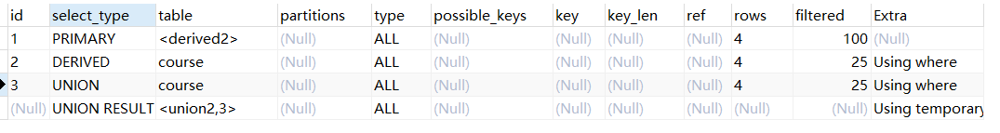

# MySql分层


连接层

最上层的服务并不是 MYSQL所独有的,大多数基于网络的客户端/服务器的工具或者服务都有类似的架构。比如连接处理、授权认证、安全等等。


服务层

第二层架构是 MYSQL比较有意思的部分。大多数 MYSQL的核心服务功能都在这一层,包括査询解析、分析、优化、缓存以及所有的内置函数(例如,日期、时间、数学和加密函数),所有跨存储引擎的功能都在这一层实现:存储过程、触发器、视图等。


引擎层

**负责mysql中数据的储存和提取，提供了各种数据储存方法**（两种引擎：InnoDB  MyISAM），服务器通过API与存储引擎进行通信。这些接口屏蔽了不同存储引擎之间的差异,使得这些差异对上层的査询过程透明。支持的引擎可以通过命令`show engines; ` 命令查看

**查看MySQL当前默认的存储引擎**

我们也可以通过下面的命令查看默认的存储引擎。

```sql
mysql> show variables like '%storage_engine%';
```


存储层

存储数据


# 并发控制

表锁是 MYSQL中最基本的锁策略,并且是开销最小的策略。


行级锁可以最大程度地支持并发处理(同时也带来了最大的锁开销)。


# 事务

事务就是一组原子性的SQL査询,或者说一个独立的工作单元。如果数据库引擎能够成功地对数据库应用该组査询的全部语句,那么就执行该组查询。如果其中有任何一条语句因为崩溃或其他原因无法执行,那么所有的语句都不会执行。也就是说,事务内的语句,要么全部执行成功,要么全部执行失败。

## 事务的ACID特性

银行应用是解释事务必要性的一个经典例子。假设一个银行的数据库有两张表:支票( checking)表和储蓄( savings)表。现在要从用户Jane的支票账户转移200美元到她的储蓄账户,那么需要至少三个步骤


单纯的事务概念并不是故事的全部。试想一下,如果执行到第四条语句时服务器崩溃了,会发生什么?天知道,用户可能会损失200美元。再假如,在执行到第三条语句和第四条语句之间时,另外一个进程要删除支票账户的所有余额,那么结果可能就是银行在不知道这个逻辑的情况下白白给了Jane200美元。


除非系统通过严格的ACID测试,否则空谈事务的概念是不够的。ACID表示原子性( atomicity)、一致性( consistency)、隔离性( isolation)和持久性( durability)。一个运行良好的事务处理系统,必须具备这些标准特征。

原子性( atomicity)，一个事务必须被视为一个不可分割的最小工作单元,整个事务中的所有操作要么全部提交成功,要么全部失败回滚,对于一个事务来说,不可能只执行其中的一部分操作,这就是事务的原子性

一致性( consistency)，数据库总是从一个一致性的状态转换到另外一个一致性的状态。在前面的例子中,一致性确保了,即使在执行第三、四条语句之间时系统崩溃,支票账户中也不会损失200美元,因为事务最终没有提交,所以事务中所做的修改也不会保存到数据库中。

隔离性( isolation)，通常来说,一个事务所做的修改在最终提交以前,对其他事务是不可见的。在前面的例子中,当执行完第三条语句、第四条语句还未开始时,此时有另外一个账户汇总程序开始运行,则其看到的支票账户的余额并没有被减去200美元。后面我们讨论隔离级别( Isolation level)的时侯,会发现为什么我们要说“通常来说”是不可见的。

持久性( durability)，一旦事务提交,则其所做的修改就会永久保存到数据库中。此时即使系统崩溃,修改的数据也不会丢失。持久性是个有点模糊的概念,因为实际上持久性也分很多不同的级别。有些持久性策略能够提供非常强的安全保障,而有些则未必。而且不可能有能做到100%的持久性保证的策略(如果数据库本身就能做到真正的持久性,那么备份又怎么能增加持久性呢?)。


数据库事务有不同的隔离级别，不同的隔离级别对锁的使用是不同的，锁的应用最终导致不同事务的隔离级别。

[事务和锁机制是什么关系？ 开启事务就自动加锁了吗？](https://zhidao.baidu.com/question/751754554948922124.html)

1、事务与锁是不同的。事务具有ACID（原子性、一致性、隔离性和持久性），锁是用于解决隔离性的一种机制。

2、事务的隔离级别通过锁的机制来实现。另外锁有不同的粒度，同时事务也是有不同的隔离级别的。

3、开启事务就自动加锁。https://www.cnblogs.com/leijiangtao/p/11911644.html


## 隔离级别

在SQL标准中定义了四种隔离级别,每一种级別都规定了个事务中所做的修改,哪些在事务内和事务间是可见的,哪些是不可见的。较低级别的隔离通常可以执行更高的并发,系统的开销也更低。

### READ UNCOMMITTED(未提交读)

在 READ UNCOMMITTED级别,事务中的修改,即使没有提交,对其他事务也都是可见的。事务可以读取未提交的数据,这也被称为脏读( Dirty Read)。这个级别会导致很多问题,从性能上来说, READ UNCOMMITTED不会比其他的级别好太多,但却缺乏其他级别的很多好处,除非真的有非常必要的理由,在实际应用中一般很少使用。

### READ COMMITTED(提交读)

大多数数据库系统的默认隔离级别都是 READ COMMITTED(但 MYSQL不是)。READCOMMITTED满足前面提到的隔离性的简单定义:一个事务开始时,只能“看见”已经提交的事务所做的修改。换句话说,一个事务从开始直到提交之前,所做的任何修改对其他事务都是不可见的。这个级别有时候也叫做不可重复读( nonrepeatableread),因为两次执行同样的査询,可能会得到不一样的结果

### REPEATABLE READ(可重复读)

REPEATABLE READ解决了脏读的问题。该级别保证了在同一个事务中多次读取同样记录的结果是一致的。但是理论上,可重复读隔离级别还是无法解决另外一个幻读( Phantom Read)的问题。所谓幻读,指的是当某个事务在读取某个范围内的记录时,另外一个事务又在该范围内插入了新的记录,当之前的事务再次读取该范围的记录另外一个事务又在该范围内插入了新的记录,当之前的事务再次读取该范围的记录时,会产生幻行( Phantom Row)。 INNODB和 Xtradb存储引擎通过多版本并发控制(MVCC, Multiversion Concurrency Control)解决了幻读的问题。本章稍后会做进一步的讨论，可重复读是 MYSQL的默认事务隔离级别

### SERIIALIZABLE(可串行化)

SERIALIZABLE是最高的隔离级别。它通过强制事务串行执行,避免了前面说的幻读的问题。简单来说, SERIALIZABLE会在读取的每一行数据上都加锁,所以可能导致大量的超时和锁争用的问题。实际应用中也很少用到这个隔离级别,只有在非常需要确保数据的一致性而且可以接受没有并发的情况下,才考虑采用该级别。

## MySql中的事务

MYSQL提供了两种事务型的存储引擎: Innodb和 NDB Cluster

自动提交( AUTOCOMMIT),MYSQL默认采用自动提交( AUTOCOMMIT)模式。**也就是说,如果不是显式地开始一个事务,则每个査询都被当作一个事务执行提交操作。？？？？**在当前连接中,可以通过设置AUTOCOMMIT变量来启用或者禁用自动提交模式


1或者ON表示启用,0或者OFF表示禁用。当 AUTOCOMMIT=0时,所有的査询另一个新事务。修改 AUTOCOMMIT 对非事务型的表,比如 MYISAM或者内存表,不会有任何影响。对这类表来说,没有 COMMIT 或者 ROLLBACK的概念,也可以说是相当于一直处于 AUTOCOMMIT启用的模式。都是在一个事务中,直到显式地执行 COMMIT提交或者 ROLLBACK回滚,该事务结束,同时又开始了。


隐式和显式锁定INNODB采用的是两阶段锁定协议(two- phase locking protocol)。**在事务执行过程中,随时都可以执行锁定,锁只有在执行 COMMIT或者 ROLLBACK的时侯才会释放,并且所有的锁是在同一时刻被释放。？？**前面描述的锁定都是隐式锁定, INNODB会根据隔离级别在需要的时侯自动加锁。另外, INNODB也支持通过特定的语句进行显式锁定

MYSQL也支持 LOCK TABLES和 UNLOCK TABLES语句,这是在服务器层实现的,和存储引擎无关。它们有自己的用途,但并不能替代事务处理。如果应用需要用到事务,还是应该选择事务型存储引擎。经常可以发现,应用已经将表从 MYISAM转换到 INNODB,但还是显式地使用L0CKTABLES语句。这不但没有必要,还会严重影响性能,实际上 INNODB的行级锁工作得更好

# 索引

要理解 MYSQL中索引是如何工作的,最简单的方法就是去看看一本书的“索引”部分如果想在一本书中找到某个特定主题,一般会先看书的“索引”,找到对应的页码。在MYSQL中，储存引擎用类似的方法使用索引，首先在索引中找到对应值，然后根据匹配的索引找到对应的数据行，加入要进行下面的查询`SELECT first_name FROM sakila.actor WHERE actor_id = 5`如果在 actor_id列上建有索引,则 MYSQL将使用该索引找到 actor_id为5的行,也就是说, MYSQL先在索引上按值进行查找,然后返回所有包含该值的数据行。

索引有很多种类型,可以为不同的场景提供更好的性能。在 MYSQL中,索引是在存储引擎层而不是服务器层实现的。所以,并没有统一的索引标准:不同存储引擎的索引的工作方式并不一样,也不是所有的存储引擎都支持所有类型的索引。即使多个存储引擎支持同一种类型的索引,其底层的实现也可能不同。

### B-Tree引索

当人们谈论索引的时候,如果没有特别指明类型,那多半说的是B-Tree索引,它使用B-Tree数据结构来存储数据。大多数 MYSQL引擎都支持这种索引。实际上很多存储引擊使用的是B+Tree的数据结构,即每一个叶子节点都包含指向下一个叶子节点的指针,从而方便叶子节点的范围遍历。我们使用术语“B-Tree”,是因为 MYSQL在 CREATE TABLE和其他语句中也使用该关键字。这里也说明，即使不同的储存引擎都是用B-Tree结构，但是不同的储存引擎都有不同的使用方式，具体实现方式不同。

B-Tree通常意味着所有的值都是按顺序存储的,并且每一个叶子页到根的距离相同。下图展示了B-Tree(实际上是B+树)索引的抽象表示,大致反映了 INNODB索引是如何工作的。 MYISAM使用的结构有所不同,但基本思想是类似的。


B-Tree索引能够加快访问数据的速度，因为储存引擎不在需要进行全表扫描获取需要的数据，取而代之的是从索引的根节点进行搜索（上图未画出根节点），根节点的槽中存放了指向子节点的指针，储存引擎根据这些指针向下层查找，通过比较节点页的值和要查找的值可以找到合适的值进入下一层子节点，这些指针实际上定义了子节点页中值的上限和下限。最终存储引擎要么是找到对应的值,要么该记录不存在。叶子节点比较特别,它们的指针指向的是被索引的数据,而不是其他的节点页(不同引擎的“指针”类型不同)。上图仅绘制了一个节点和其对应的叶子节点,其实在根节点和叶子节点之间可能有很多层节点页。树的深度和表的大小直接相关。以上就是引索的查找过程了，终于破解了我一直以来的疑惑了！可以发现要查找的值（即数据行）是通过叶子也中的指针来查找的，查找的值（即数据行）不是储存在叶子页或者节点页之中的！

可以使用B-Tree索引的查询类型：B-Tree索引适用于全键值、键值范围或键前缀査找，其中键前缀査找只适用于根据最左前缀的査找。前面所述的素引对如下类型的查询有效，

- 全值匹配
  全值匹配指的是和索引中的所有列进行匹配,例如前面提到的索引可用于査找姓名为 Cuba Allen、出生于1960-01-01的人。
- 匹配最左前缀，前面提到的索引可用于査找所有姓为 Allen的人,即只使用素引的第一列

- 匹配列前缀，也可以只匹配某一列的值的开头部分。例如前面提到的索引可用于査找所有以J开头的姓的人。这里也只使用了索引的第一列

- 匹配范围值，例如前面提到的索引可用于查找姓在 Allen和 Barrymore之间的人。这里也只使用了素引的第一列

- 精确匹配某一列并范国匹配另外一列，前面提到的索引也可用于査找所有姓为AIln,并且名字是字母K开头(比如KimKarl等)的人。即第一列 Last name全匹配,第二列 first name范围匹配。

- 只访问索引的查询B-Tree通常可以支持“只访问索引的查询”,即査询只需要访问索引,而无须访问数据行。后面我们将单独讨论这种“覆盖索引”的优化

#### 使用B-Tree索引的一些限制


### 哈希索引

哈希索引( hash index)基于哈希表实现,只有精确匹配索引**所有列**的査询才有效。对于每一行数据,存储引擎都会对**所有的素引列**计算一个哈希码( hash code),哈希码是个较小的值,并且不同键值的行计算出来的哈希码也不一样。哈希索引将所有的哈希码存储在索引中,同时在哈希表中保存指向毎个数据行的指针.

在 MYSQL中,只有 Memory引擎显式支持哈希索引。这也是 Memory引擎表的默认索引类型, Memory引擎同时也支持B-Tree索引。值得一提的是, Memory引擎是支持非唯一哈希索引的,这在数据库世界里面是比较与众不同的。如果多个列的哈希值相同,索引会以链表的方式存放多个记录指针到同一个哈希条目中。

- 假设有下表：
  - 
- 表中有如下数据
  - 
- 假设使用假想的哈希函数f()，它返回下面的值
  - 
- 那么哈希索引的数据结构如下
  - 
- 注意每个槽的编号是顺序的，但是数据行不是,试试如下查询
  - 
- MYSQL先计算' Peter'的哈希值,并使用该值寻找对应的记录指针。因为f(' Peter')=8784,所以 MYSQL在索引中査找8784,可以找到指向第3行的指针,最后一步是比较第三行的值是否为' Peter',以确保就是要査找的行（因为考虑了哈希冲突的情况）。

#### Hash引索的一些限制


### 全文引索

全文引索是一种特殊的引索类型，它查找的是文本中的关键字，而不是直接比较引索中的值。全文搜索和其他几类索引的匹配方式完全不一样。它有许多需要注意的细节,如停用词、词干和复数、布尔搜索等。全文索引更类似于搜索引擎做的事情,而不是简单的WERE条件匹配。

在相同的列上同时创建全文素引和基于值的B-Tree索引不会有冲突,全文索引适用于MATCH AGAINST操作,而不是普通的WHERE条件操作。


### 索引的好处

最常见的B-Tree素引,按照顺序存储数据,所以 MYSQL可以用来做 ORDER BY和 GROUP BY操作。因为数据是有序的,所以B-Tree也就会将相关的列值都存储在一起。最后,因为索引中存储了实际的列值,所以某些査询只使用索引就能够完成全部査询。

总结下来索引有如下三个优点

1. 索引大大减少了服务器需要扫描的数据量。
2. 索引可以帮助服务器避免排序和临时表。
3. 索引可以将随机I/O变为顺序I/O(https://blog.csdn.net/coslay/article/details/42276025)


## 索引的分类

### 单值索引

- **单值索引：单列，一个表可以有多个单值索引**
  - **唯一索引：唯一索引,与普通索引类似,但是不同的是唯一索引要求列所有的值是唯一的,这一点和主键索引一样.但是他允许有空值**
  - **主键索引,不允许有空值,(在B+TREE中的InnoDB引擎中,主键索引起到了至关重要的地位)，主键索引建立的规则是 int优于varchar,一般在建表如果设置了主键就会自动创建,最好是与表的其他字段不相关的列或者是业务不相关的列.**
  - **普通索引,这个是最基本的索引**

```sql
#1.添加UNIQUE(唯一索引)
alter table 'table_name' add unique('column');

#2.添加PRIMARY KEY(主键索引)
alter table 'table_name' add primary key('column');

#3.添加普通索引
alter table 'table_name' add index index_name('column');
```


### 复合索引

- **复合索引：多个列构成的索引，相当于二级目录，一个表中含有多个单列索引不代表是组合索引,通俗一点讲 组合索引是:包含多个字段但是只有索引名称**

```sql
#5.添加多列索引
alter table 'table_name' add index index_name('column1','column2','column3');
```


### 全文索引

文本字段上(text)如果建立的是普通索引,那么只有对文本的字段内容前面的字符进行索引,其字符大小根据索引建立索引时申明的大小来规定.

如果文本中出现多个一样的字符,而且需要查找的话,那么其条件只能是 where column lick '%xxxx%' 这样做会让索引失效这个时候全文索引就祈祷了作用了

```sql
#4.添加全文索引
alter table 'table_name' add fulltext(column1, column2);
```

有了全文索引，就可以用SELECT查询命令去检索那些包含着一个或多个给定单词的数据记录了。

```
ELECT * FROM tablename
WHERE MATCH(column1, column2) AGAINST(‘xxx′, ‘sss′, ‘ddd′)
```

这条命令将把column1和column2字段里有xxx、sss和ddd的数据记录全部查询出来。


## 索引的弊端

- 索引本身很大，可以存放在内存/硬盘（通常为硬盘）
- 索引不是所有的情况均适用，如少量数据，频繁更新，很少使用的字段都不适合
- 索引会降低增删改的效率


## 优势

- 可以通过建立唯一索引或者主键索引,保证数据库表中每一行数据的唯一性.
- 建立索引可以大大提高检索的数据,以及减少表的检索行数
- 降低cpu使用频率（order by ..  就不用再排序了，因为索引的数据结构B+树就已经是拍好序的）


## 需要注意的地方

- **在表与表的而连接条件上加上索引,可以加快连接查询的速度？？？**

- 在经常需要排序(order by),分组(group by)和的distinct 列上加索引 可以加快排序查询的时间,  (单独order by 用不了索引，索引考虑加where 或加limit)

- like语句的 如果你对nickname字段建立了一个索引.当查询的时候的语句是 nickname lick '%ABC%' 那么这个索引讲不会起到作用.而nickname lick 'ABC%' 那么将可以用到索引

- **使用短索引,如果你的一个字段是Char(32)或者int(32),在创建索引的时候指定前缀长度 比如前10个字符 (前提是多数值是唯一的..)那么短索引可以提高查询速度,并且可以减少磁盘的空间,也可以减少I/0操作.  什么是短引索？？**

- **很少数据的列也不应该建立索引,比如 一个性别字段 0或者1,在查询中,结果集的数据占了表中数据行的比例比较大,mysql需要扫描的行数很多,增加索引,并不能提高效率， 什么是结果集和数据行？？**

  

# 储存引擎


可以使用 SHOW TABLE STATUS命令显示表的相关信息。例如使用命令`show TABLE STATUS like 'award' \G;`

```properties
           Name: award   
           # 表名
         Engine: InnoDB
        Version: 10
     Row_format: Dynamic
     # 行的格式，对于行的格式。对于 MYISAM表,可选的值为 Dynamic、 Fixed或者 Compressed。Dynamiced的行长度是可变的,一般包含可变长度的字段,如 VARCHAR或BL0B。 Fixed的行长度则是固定的,只包含固定长度的列,如CHAR和 INTEGER。 Compressed的行则只在压缩表中存在
           Rows: 4
           #表中的行数。对于 MYISAM和其他一些存储引擎,该值是精确的,但对于 INNODB该值是估计值。
 Avg_row_length: 4096
 #平均每行包含的字节数
    Data_length: 16384
   # 表数据的大小，单位为字节
Max_data_length: 0
 # 表数据的最大长度，该值和储存引擎有关系
   Index_length: 0
   # 索引的大小
      Data_free: 0
      #对于 MYISAM表,表示已分配但目前没有使用的空间。这部分空间包括了之前删除的行,以及后续可以被 INSERT利用到的空间。
 Auto_increment: NULL
 # 下一个Auto_increment的值
    Create_time: 2020-03-15 09:02:24
    Update_time: NULL
    # 表数据最后的修改时间
     Check_time: NULL
     # 使用 CKECK TABLE命令或者 myisamchk工具最后一次检査表的时间。
      Collation: utf8_general_ci
      # 表默认的字符集和字符列排序规则
       Checksum: NULL
       # 如果开启，则保存的是整个表的实时校验和
 Create_options: 
 # 创建表时的其它选项
        Comment: 获奖信息表

```


## InnoDB储存引擎

INNODB的数据存储在表空间( tablespace)中,表空间是由 INNODB管理的一个黑盒子,由一系列的数据文件组成。在 MYSQL4.4以后的版本中, INNODB可以将每个表的数据和素引存放在单独的文件中。 INNODB也可以使用裸设备作为表空间的存储介质,但现代的文件系统使得裸设备不再是必要的选择。

INNODB采用MVCC来支持高并发,并且实现了四个标准的隔离级别。其默认级别是REPEATABLE READ(可重复读),并且通过间隙锁(next- key locking)策路防止幻读的出现。间隙锁使得 INNODB不仅仅锁定査询涉及的行,**还会对索引中的间隙进行锁定,以防止幻影行的插入   ?? 引索？？**

INNODB表是基于聚簇索引建立的,我们会在后面的章节详细讨论聚簇索引。 INNODB的素引结构和 MYSQL的其他存储引擎有很大的不同,聚簇索引对主键査询有很高的性能不过它的二级索引( secondary index,非主键素引)中必须包含主键列,所以如果主键列很大的话,其他的所有索引都会很大。因此,若表上的索引较多的话,主键应当尽可能的小。 INNODB的存储格式是平台独立的,也就是说可以将数据和索引文件从 Intel平台复制到 Powerpc或者 Sun SPARC平台


## MyISAM存储引擎

MYISAM会将表存储在两个文件中:数据文件和索引文件,分别以,MYD和.MYI为扩展名。 MYISAM表可以包含动态或者静态(长度固定)行。 MYSQL会根据表的定义来决定采用何种行格式。 MYISAM表可以存储的行记录数,一般受限于可用的磁盘空间,或者操作系统中单个文件的最大尺寸。

在mysql5.1之前，都是使用MyISAM作为默认的储存引擎，MyISAM提供了大量的特性，包括全文引索，压缩，空间函数等，但是它不支持事务和行锁，且有一个毫无疑问的缺陷就是崩溃后无法安全恢复。对于只读的数据,**或者表比较小、可以忍受修复( repair)操作  ？？？？**,则依然可以继续使用 MYISAM(但请不要默认使用 MYISAM,而是应当默认使用 Innode)。

修复对于 MYISAM表, MYSQL可以手工或者自动执行检査和修复操作,但这里说的修复和事务恢复以及崩溃恢复是不同的概念。执行表的修复可能导致一些数据丢失,而且修复操作是非常慢的。可以通过 CHECK TABLE mytable检査表的错误,如果有错误可以通过执行 REPAIR TABLE mytable进行修复。另外,如果 MYSQL服务器已经关闭,也可以通过 myisamchk命令行工具进行检査和修复操作。

**索引特性，对于 MYISAM表,即使是BL0B和TET等长字段,也可以基于其前500个字符创建索引。 MYISAN也支持全文索引,这是一种基于分词创建的索引,可以支持复杂的査询。**

**延迟更新索引键( Delayed Key Write)创建 MYISAM表的时候,如果指定了 DELAY KEY WRITE选项,在每次修改执行完成时,不会立刻将修改的索引数据写入磁盘,而是会写到内存中的键缓冲区(in-memoryey buffer),只有在清理键缓冲区或者关闭表的时候才会将对应的索引块写入到磁盘。这种方式可以极大地提升写入性能,但是在数据库或者主机崩溃时会造成索引损坏,需要执行修复操作。延迟更新索引键的特性,可以在全局设置,也可以为单表设置。**


# sql性能问题

分析sql执行计划：explain ，可以模拟sql优化器执行sql，从而让开发人员知道自己编写的sql具体的执行！


###### id

id值相同，从上往下顺序执行,就是行数少的表优先查询

```sql
EXPLAIN SELECT tc.tcdesc FROM teacherCard tc,teacher t , course c WHERE c.tid = t.tid and t.tcid = tc.tcid and c.cname = 'sql' # 查询教授sql课程老师的描述信息
```


如果id值不同，执行的查询顺序是，id值越大的越优先查询（其实就是在嵌套子查询时，先查内层，再查外层）

```sql
EXPLAIN SELECT tc.tcdesc FROM teacherCard tc WHERE tc.tcid = (
		SELECT t.tcid FROM teacher t WHERE t.tid = (SELECT c.tid FROM course c WHERE c.cname = 'sql')
)# 查询教授sql课程老师的描述信息
```

结果


id值有相同有不同，则id大的先查询，然后相同的就是上往下查询，使用子查询和多表查询

```sql
EXPLAIN SELECT tc.tcdesc , t.tname  FROM teacherCard tc, teacher t WHERE t.tcid = tc.tcid 
and t.tid = (SELECT c.tid FROM course c WHERE c.cname = 'sql'); # 查询教授sql课程老师的描述信息
```


###### select_type

- PRIMAEY：包含子查询sql中的外层查询

- SUBQUERY：包含子查询sql中的非外层查询

- SIMPLE：简单查询即不包含子查询和unique的查询

- DERIVED：衍生查询，在查询的时候用到了临时表的

  - **在from子查询中只有一张表，那么该表就是衍生查询，但是我的mysql5.7只是显示简单查询，那为何不是PRIMAEY查询？？**

    - EXPLAIN SELECT cr.cname  FROM  (SELECT *  FROM course  WHERE tid in (1,2 ) ) cr;

  - 在from子查询中，如果有table1 union table2 ，那么table1 就是DERIVED ，table2 就是UNION

    - ```sql
      EXPLAIN SELECT cr.cname  FROM  (SELECT *  FROM course  WHERE tid =1 UNION SELECT * FROM course where tid = 2 )cr;
      ```

      

    - 

- UNION：上例


###### type

称为索引类型，类型

system  const  eq_ref  ref  range  index  all  要对type进行优化的前提是有索引，其中system 和const只是理想情况，实际上只能达到ref 或者range

- system 只有一条数据的系统表，或者衍生表只有一条数据的主查询

- const 仅能查到一条数据的sql，用于primary key 或 unique 索引

  - 设置表`tid`字段为主键，然后执行

    ```sql
    EXPLAIN SELECT * FROM test01 WHERE tid=1
    ```

  - 

- eq_ref:唯一性索引:对于每个索引键的査询,返回匹配唯一行数据(有且只有1个,不能多、不能0)  select .. from ...  where id= ..常见于唯一索引和主键索引。


https://www.cnblogs.com/chenshishuo/p/5030029.html