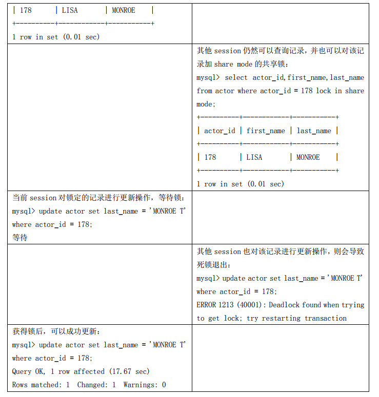
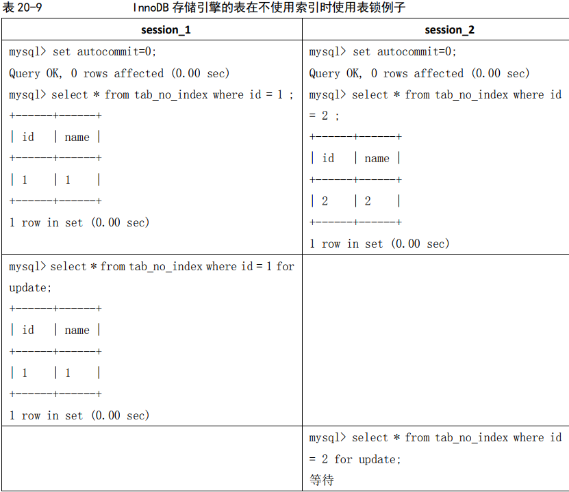
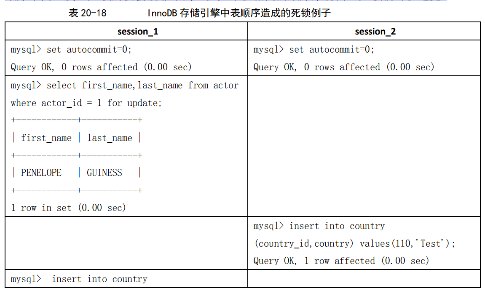
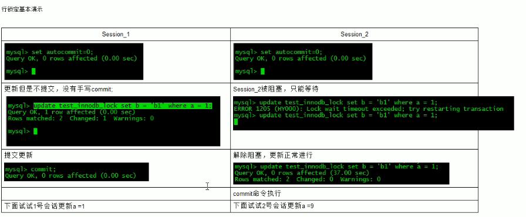

# 第20章 锁问题

## 20.1 MySQL 锁概述

相对其他数据库而言，MySQL的锁机制比较简单，其最显著的特点是不同的存储引擎支持不同的锁机制。比如，MyISAM和MEMORY存储引擎采用的是表级锁（table-level locking）；BDB存储引擎采用的是页面锁（page-level locking），但也支持表级锁；InnoDB存储引擎既支持行级锁（row-level locking），也支持表级锁，但默认情况下是采用行级锁。

相对其他数据库而言，MySQL的锁机制比较简单，其最显著的特点是不同的存储引擎支持不同的锁机制。比如，MyISAM和MEMORY存储引擎采用的是表级锁（table-level locking）；BDB存储引擎采用的是页面锁（page-level locking），但也支持表级锁；InnoDB存储引擎既支持行级锁（row-level locking），也支持表级锁，但默认情况下是采用行级锁。
MySQL这3种锁的特性可大致归纳如下。
 表级锁：开销小，加锁快；不会出现死锁；锁定粒度大，发生锁冲突的概率最高,并发度最低。
 行级锁：开销大，加锁慢；会出现死锁；锁定粒度最小，发生锁冲突的概率最低,并发度也最高。
 页面锁：开销和加锁时间界于表锁和行锁之间；会出现死锁；锁定粒度界于表锁和行锁之间，并发度一般。

表级锁更适合于以查询为主，只有少量按索引条件更新数据的应用，如Web 应用；而行级锁则更适合于有大量按索引条件并发更新少量不同数据，同时又有并发查询的应用，如一些在线事务处理（OLTP）系统。

## 20.2 MyISAM 表锁

### 20.2.1 查询表级锁争用情况

可以通过检查table_locks_waited和table_locks_immediate状态变量来分析系统上的表锁定争夺：

```sql
mysql> show status like 'table%';
+-----------------------+-------+
| Variable_name         | Value |
+-----------------------+-------+
| Table_locks_immediate | 2979  |
| Table_locks_waited    | 0     |
+-----------------------+-------+
2 rows in set (0.00 sec))

```

Table_locks_immediate:产生表级锁定的次数,表示可以立即获取锁的查询次数,每立即获取锁值加1

Table_locks_waited :出现表级锁定争用而发生等待的次数(不能立即获取锁的次数,毎等待一次锁值加1),此值高则说明存在着较严重的表级锁争用情况;


### 20.2.2 MySQL 表级锁的锁模式

MySQL 的表级锁有两种模式：表共享读锁（Table Read Lock）和表独占写锁（Table Write Lock）。锁模式的兼容性如表 20-1 所示


可见，对 MyISAM 表的读操作，不会阻塞其他用户对同一表的读请求，但会阻塞对同一表的写请求；对 MyISAM 表的写操作，则会阻塞其他用户对同一表的读和写操作；MyISAM 表的读操作与写操作之间，以及写操作之间是串行的！根据如表 20-2 所示的例子可以知道，当一个线程获得对一个表的写锁后，只有持有锁的线程可以对表进行更新操作。其他线程的读、写操作都会等待，直到锁被释放为止。

**MyISAM 存储引擎的写阻塞读例子**


### 20.2.3 如何加表锁

MyISAM 在执行查询语句（SELECT）前，会自动给涉及的所有表加读锁，在执行更新操作（UPDATE、DELETE、INSERT 等）前，会自动给涉及的表加写锁，这个过程并不需要用户干预，因此，用户一般不需要直接用 LOCK TABLE 命令给 MyISAM 表显式加锁。在本书的示例中，显式加锁基本上都是为了方便而已，并非必须如此。给 MyISAM 表显示加锁，一般是为了在一定程度模拟事务操作，实现对某一时间点多个表的一致性读取。例如，有一个订单表 orders，其中记录有各订单的总金额 total，同时还有一个订单明细表 order_detail，其中记录有各订单每一产品的金额小计 subtotal，假设我们需要检查这两个表的金额合计是否相符，可能就需要执行如下两条 SQL：

```sql
Select sum(total) from orders;
Select sum(subtotal) from order_detail;
```

这时，如果不先给两个表加锁，就可能产生错误的结果，因为第一条语句执行过程中，order_detail 表可能已经发生了改变。因此，正确的方法应该是：

```sql
Lock tables orders read local, order_detail read local;
Select sum(total) from orders;
Select sum(subtotal) from order_detail;
Unlock tables;

```

要特别说明以下两点内容。
上面的例子在 LOCK TABLES 时加了“local”选项，其作用就是在满足 MyISAM 表并发插入条件的情况下，允许其他用户在表尾并发插入记录，有关 MyISAM 表的并发插入问题，在后面的章节中还会进一步介绍。
在用 LOCK TABLES 给表显式加表锁时，必须同时取得所有涉及到表的锁，并且 MySQL 不支持锁升级。也就是说，在执行 LOCK TABLES 后，**只能访问显式加锁的这些表**，不能访问未加锁的表；同时，如果加的是读锁，那么只能执行查询操作，而不能执行更新操作。其实，在自动加锁的情况下也基本如此，MyISAM 总是一次获得 SQL 语句所需要的全部锁。这也正是 MyISAM 表不会出现死锁（Deadlock Free）的原因。在如表 20-3 所示的例子中，一个 session 使用 LOCK TABLE 命令给表 film_text 加了读锁，这个 session 可以查询锁定表中的记录，但更新或**访问其他表**都会提示错误；同时，另外一个session 可以查询表中的记录，但更新就会出现锁等待。

**MyISAM 存储引擎的读阻塞写例子**


当使用 LOCK TABLES 时，不仅需要一次锁定用到的所有表，而且，同一个表在 SQL 语句中出现多少次，就要通过与 SQL 语句中相同的别名锁定多少次，否则也会出错！举例说明如下。

（1）对 actor 表获得读锁：

```sql
mysql> lock table actor read;
Query OK, 0 rows affected (0.00 sec)
```

（2）但是通过别名访问会提示错误：

```sql
mysql> select a.first_name,a.last_name,b.first_name,b.last_name from actor a,actor b where 
a.first_name = b.first_name and a.first_name = 'Lisa' and a.last_name = 'Tom' and a.last_name 
<> b.last_name;
ERROR 1100 (HY000): Table 'a' was not locked with LOCK TABLES
```

（3）需要对别名分别锁定：

```sql
mysql> lock table actor as a read,actor as b read;
Query OK, 0 rows affected (0.00 sec)
```

（4）按照别名的查询可以正确执行：

```sql
mysql> select a.first_name,a.last_name,b.first_name,b.last_name from actor a,actor b where 
a.first_name = b.first_name and a.first_name = 'Lisa' and a.last_name = 'Tom' and a.last_name 
<> b.last_name;
+------------+-----------+------------+-----------+
| first_name | last_name | first_name | last_name |
+------------+-----------+------------+-----------+
| Lisa       | Tom       | LISA       | MONROE    |
+------------+-----------+------------+-----------+
1 row in set (0.00 sec)
```

### 20.2.4 并发插入（Concurrent Inserts）

上文提到过 MyISAM 表的读和写是串行的，但这是就总体而言的。在一定条件下，MyISAM表也支持查询和插入操作的并发进行。MyISAM存储引擎有一个系统变量concurrent_insert，专门用以控制其并发插入的行为，其值分别可以为0、1或2。
 当concurrent_insert设置为0时，不允许并发插入。
 当concurrent_insert设置为1时，如果MyISAM表中没有空洞（即表的中间没有被删除的行），MyISAM允许在一个进程读表的同时，另一个进程从表尾插入记录。这也是MySQL的默认设置。
 当concurrent_insert设置为2时，无论MyISAM表中有没有空洞，都允许在表尾并发插入记录。

在如表 20-4 所示的例子中，session_1 获得了一个表的 READ LOCAL 锁，该线程可以对表进行查询操作，但不能对表进行更新操作；其他的线程（session_2），虽然不能对表进行删除和更新操作，但却可以对该表进行并发插入操作，这里假设该表中间不存在空洞。

**MyISAM 存储引擎的读写（INSERT）并发例子**


可以利用MyISAM存储引擎的并发插入特性，来解决应用中对同一表查询和插入的锁争用。例如，将concurrent_insert系统变量设为2，总是允许并发插入；同时，通过定期在系统空闲时段执行OPTIMIZE TABLE语句来整理空间碎片，收回因删除记录而产生的中间空洞。有关OPTIMIZE TABLE语句的详细介绍，可以参见第18章中“两个简单实用的优化方法”一节的内容。

### 20.2.5 MyISAM 的锁调度

前面讲过，MyISAM 存储引擎的读锁和写锁是互斥的，读写操作是串行的。那么，一个进程请求某个 MyISAM 表的读锁，同时另一个进程也请求同一表的写锁，MySQL 如何处理呢？答案是写进程先获得锁。不仅如此，即使读请求先到锁等待队列，写请求后到，写锁也会插到读锁请求之前！这是因为 MySQL 认为写请求一般比读请求要重要。这也正是 MyISAM 表不太适合于有大量更新操作和查询操作应用的原因，因为，大量的更新操作会造成查询操作很难获得读锁，从而可能永远阻塞。这种情况有时可能会变得非常糟糕！幸好我们可以通过一些设置来调节 MyISAM 的调度行为。

很难获得读锁，从而可能永远阻塞。这种情况有时可能会变得非常糟糕！幸好我们可以通过一些设置来调节 MyISAM 的调度行为。
通过指定启动参数low-priority-updates，使MyISAM引擎默认给予读请求以优先的权利。
通过执行命令SET LOW_PRIORITY_UPDATES=1，使该连接发出的更新请求优先级降低。
通过指定INSERT、UPDATE、DELETE语句的LOW_PRIORITY属性，降低该语句的优先级。

虽然上面 3 种方法都是要么更新优先，要么查询优先的方法，但还是可以用其来解决查询相对重要的应用（如用户登录系统）中，读锁等待严重的问题。另外，MySQL也提供了一种折中的办法来调节读写冲突，即给系统参数max_write_lock_count设置一个合适的值，当一个表的读锁达到这个值后，MySQL就暂时将写请求的优先级降低，给读进程一定获得锁的机会。上面已经讨论了写优先调度机制带来的问题和解决办法。这里还要强调一点：一些需要长时间运行的查询操作，也会使写进程“饿死”！因此，应用中应尽量避免出现长时间运行的查询操作，不要总想用一条SELECT语句来解决问题，因为这种看似巧妙的SQL语句，往往比较复杂，执行时间较长，在可能的情况下可以通过使用中间表等措施对SQL语句做一定的“分解”，使每一步查询都能在较短时间完成，从而减少锁冲突。如果复杂查询不可避免，应尽量安排在数据库空闲时段执行，比如一些定期统计可以安排在夜间执行。

## 20.3 InnoDB 锁问题

### 20.3.1 背景知识

innodb是事务型的，会自动提交事务

“脏读”、“不可重复读”和“幻读”，其实都是数据库读一致性问题，必须由数据库提供一定的事务隔离机制来解决。数据库实现事务隔离的方式，基本上可分为以下两种。
 一种是在读取数据前，对其加锁，阻止其他事务对数据进行修改。
 另一种是不用加任何锁，通过一定机制生成一个数据请求时间点的一致性数据快照（Snapshot)，并用这个快照来提供一定级别（语句级或事务级）的一致性读取。从用户的角度来看，好象是数据库可以提供同一数据的多个版本，因此，这种技术叫做数据多版本并发控制（MultiVersion Concurrency Control，简称 MVCC 或MCC），也经常称为多版本数库。

为了解决“隔离”与“并发”的矛盾，ISO/ANSI SQL92 定义了 4 个事务隔离级别，每个级别的隔离程度不同，允许出现的副作用也不同，应用可以根据自己的业务逻辑要求，通过选择不同的隔离级别来平衡“隔离”与“并发”的矛盾。表 20-5 很好地概括了这 4 个隔离级别的特性。


最后要说明的是：各具体数据库并不一定完全实现了上述 4 个隔离级别，例如，Oracle 只提供 Read committed 和 Serializable 两个标准隔离级别，另外还提供自己定义的 Read only 隔离级别；SQL Server 除支持上述 ISO/ANSI SQL92 定义的 4 个隔离级别外，还支持一个叫做“快照”的隔离级别，但严格来说它是一个用 MVCC 实现的 Serializable 隔离级别。MySQL 支持全部 4 个隔离级别，但在具体实现时，有一些特点，比如在一些隔离级别下是采用 MVCC一致性读，但某些情况下又不是，这些内容在后面的章节中将会做进一步介绍。

### 20.3.2 获取 InnoDB 行锁争用情况

可以通过检查 InnoDB_row_lock 状态变量来分析系统上的行锁的争夺情况

```sql
mysql> show status like 'innodb_row_lock%';
+-------------------------------+-------+
| Variable_name                 | Value |
+-------------------------------+-------+
| InnoDB_row_lock_current_waits | 0     |
| InnoDB_row_lock_time          | 0     |
| InnoDB_row_lock_time_avg      | 0     |
| InnoDB_row_lock_time_max      | 0     |
| InnoDB_row_lock_waits         | 0     |
+-------------------------------+-------+
5 rows in set (0.01 sec)
```

如果发现锁争用比较严重，如 InnoDB_row_lock_waits 和 InnoDB_row_lock_time_avg 的值比较高，还可以通过设置 InnoDB Monitors 来进一步观察发生锁冲突的表、数据行等，并分析锁争用的原因。
具体方法如下：

```sql
mysql> CREATE TABLE innodb_monitor(a INT) ENGINE=INNODB;
Query OK, 0 rows affected (0.14 sec)
```

然后就可以用下面的语句来进行查看：

```sql
mysql> Show innodb status\G;
*************************** 1. row ***************************
 
Type: InnoDB
 
Name: 
Status:
…
…
------------
TRANSACTIONS
------------
Trx id counter 0 117472192
Purge done for trx's n:o < 0 117472190 undo n:o < 0 0
History list length 17
Total number of lock structs in row lock hash table 0
LIST OF TRANSACTIONS FOR EACH SESSION:
---TRANSACTION 0 117472185, not started, process no 11052, OS thread id 1158191456
MySQL thread id 200610, query id 291197 localhost root
---TRANSACTION 0 117472183, not started, process no 11052, OS thread id 1158723936
MySQL thread id 199285, query id 291199 localhost root
Show innodb status
…

```

监视器可以通过发出下列语句来停止查看：

```sql
mysql> DROP TABLE innodb_monitor;
Query OK, 0 rows affected (0.05 sec)
```

设置监视器后，在 SHOW INNODB STATUS 的显示内容中，会有详细的当前锁等待的信息，包括表名、锁类型、锁定记录的情况等，便于进行进一步的分析和问题的确定。打开监视器以后，默认情况下每 15 秒会向日志中记录监控的内容，如果长时间打开会导致.err 文件变得非常的巨大，所以用户在确认问题原因之后,记得删除监控表以关闭监视器，或者通过
使用“--console”选项来启动服务器以关闭写日志文件。

### 20.3.3 InnoDB 的行锁模式及加锁方法

InnoDB 实现了以下两种类型的行锁。
 共享锁（S）：允许一个事务去读一行，阻止其他事务获得相同数据集的排他锁。
 排他锁（X)：允许获得排他锁的事务更新数据，阻止其他事务取得相同数据集的共享读锁和排他写锁。

另外，为了允许行锁和表锁共存，实现多粒度锁机制，InnoDB 还有两种内部使用的意向锁（Intention Locks），这两种意向锁都是**表锁**。
 意向共享锁（IS）：事务打算给数据行加行共享锁，事务在给一个数据行加共享锁前必须先取得该**表**的 IS 锁。
 意向排他锁（IX）：事务打算给数据行加行排他锁，事务在给一个数据行加排他锁前必须先取得该**表**的 IX 锁。
上述锁模式的兼容情况具体如表 20-6 所示。


如果一个事务请求的锁模式与当前的锁兼容(注意锁冲突和兼容是两个事务间的事！)，InnoDB 就将请求的锁授予该事务；反之，如果两者不兼容，该事务就要等待锁释放。意向锁是 InnoDB 自动加的，不需用户干预。对于 UPDATE、DELETE 和 INSERT 语句，InnoDB会自动给涉及数据集加排他锁（X)；**对于普通 SELECT 语句，InnoDB 不会加任何锁**；事务可以通过以下语句显示给记录集加共享锁或排他锁。
共享锁（S）：SELECT * FROM table_name WHERE ... LOCK IN SHARE MODE。
排他锁（X)：SELECT * FROM table_name WHERE ... FOR UPDATE。

用 SELECT ... IN SHARE MODE 获得共享锁，主要用在需要数据依存关系时来确认某行记录是否存在，并确保没有人对这个记录进行 UPDATE 或者 DELETE 操作。但是如果当前事务也需要对该记录进行更新操作，则很有可能造成死锁，对于锁定行记录后需要进行更新操作的应用，应该使用 SELECT... FOR UPDATE 方式获得排他锁。

在如表 20-7 所示的例子中，使用了 SELECT ... IN SHARE MODE 加锁后再更新记录，看看会出现什么情况，其中 actor 表的 actor_id 字段为主键。建表：

```
creat table`actor`  (
  `actor_id` int(11) NOT NULL AUTO_INCREMENT,
  `first_name` varchar(255) DEFAULT NULL,
  `last_name` varchar(255)  DEFAULT NULL,
  PRIMARY KEY (`actor_id`) USING BTREE
) ENGINE = InnoDB
```

新建的连接都是默认的自动提交，因此每个session都手动设置为非自动提交




当使用SELECT...FOR UPDATE加锁后再更新记录，出现如表20-8所示的情况。


### 20.3.4 InnoDB 行锁实现方式

InnoDB 行锁是通过给索引上的索引项加锁来实现的，这一点 MySQL 与 Oracle 不同，后者是通过在数据块中对相应数据行加锁来实现的。InnoDB 这种行锁实现特点意味着：只有通过索引条件检索数据，InnoDB 才使用行级锁，否则，InnoDB 将使用表锁！在实际应用中，要特别注意 InnoDB 行锁的这一特性，不然的话，可能导致大量的锁冲突，从而影响并发性能。下面通过一些实际例子来加以说明。

（1）在不通过索引条件查询的时候，InnoDB 确实使用的是表锁，而不是行锁。在如表 20-9 所示的例子中，开始 tab_no_index 表没有索引：

```sql
mysql> create table tab_no_index(id int,name varchar(10)) engine=innodb;
Query OK, 0 rows affected (0.15 sec)
mysql> insert into tab_no_index values(1,'1'),(2,'2'),(3,'3'),(4,'4');
Query OK, 4 rows affected (0.00 sec)
Records: 4 Duplicates: 0 Warnings: 0
```

**InnoDB 存储引擎的表在不使用索引时使用表锁例子**



在如表 20-9 所示的例子中，看起来 session_1 只给一行加了排他锁，但 session_2 在请求其他行的排他锁时，却出现了锁等待！原因就是在没有索引的情况下，InnoDB 只能使用表锁。当我们给其增加一个索引后，InnoDB 就只锁定了符合条件的行，如表 20-10 所示。

创建 tab_with_index 表，id 字段有普通索引：

```sql
mysql> create table tab_with_index(id int,name varchar(10)) engine=innodb;
Query OK, 0 rows affected (0.15 sec)
mysql> alter table tab_with_index add index id(id);
Query OK, 4 rows affected (0.24 sec)
Records: 4 Duplicates: 0 Warnings: 0
```


（2）由于 MySQL 的行锁是针对索引加的锁，不是针对记录加的锁，所以虽然是访问不同行的记录，但是如果是使用相同的索引键，是会出现锁冲突的。应用设计的时候要注意这一点。在如表 20-11 所示的例子中，表 tab_with_index 的 id 字段有索引，name 字段没有索引：


（3）当表有多个索引的时候，不同的事务可以使用不同的索引锁定不同的行，另外，不论是使用主键索引、唯一索引或普通索引，InnoDB 都会使用行锁来对数据加锁。在如表 20-12 所示的例子中，表 tab_with_index 的 id 字段有主键索引，name 字段有普通索引：

```sql
mysql> alter table tab_with_index add index name(name);
Query OK, 5 rows affected (0.23 sec)
Records: 5 Duplicates: 0 Warnings: 0
```

**InnoDB 存储引擎的表使用不同索引的阻塞例子**


（4）即便在条件中使用了索引字段，但是否使用索引来检索数据是由 MySQL 通过判断不同执行计划的代价来决定的，如果 MySQL 认为全表扫描效率更高，比如对一些很小的表，它就不会使用索引，这种情况下 InnoDB 将使用表锁，而不是行锁。因此，在分析锁冲突时，别忘了检查 SQL 的执行计划，以确认是否真正使用了索引。关于 MySQL 在什么情况下不使用索引的详细讨论，参见本章“索引问题”一节的介绍。
在下面的例子中，检索值的数据类型与索引字段不同，虽然 MySQL 能够进行数据类型转换，但却不会使用索引，从而导致 InnoDB 使用表锁。通过用 explain 检查两条 SQL 的执行计划，我们可以清楚地看到了这一点。
例子中 tab_with_index 表的 name 字段有索引，但是 name 字段是 varchar 类型的，如果where 条件中不是和 varchar 类型进行比较，则会对 name 进行类型转换，而执行的全表扫描。

```sql
mysql> alter table tab_no_index add index name(name);
Query OK, 4 rows affected (8.06 sec)
Records: 4 Duplicates: 0 Warnings: 0
mysql> explain select * from tab_with_index where name = 1 \G
*************************** 1. row *************************** 
id: 1 
select_type: SIMPLE
table: tab_with_index 
type: ALL
possible_keys: name 
key: NULL 
key_len: NULL 
ref: NULL 
rows: 4
Extra: Using where
1 row in set (0.00 sec)
mysql> explain select * from tab_with_index where name = '1' \G
*************************** 1. row *************************** 
id: 1 
select_type: SIMPLE 
table: tab_with_index 
type: ref
possible_keys: name 
key: name 
key_len: 23 
ref: const 
rows: 1
Extra: Using where
1 row in set (0.00 sec)

```

### 20.3.5 间隙锁（Next-Key 锁）

当我们用范围条件而不是相等条件检索数据，并请求共享或排他锁时，InnoDB 会给符合条件的已有数据记录的索引项加锁；对于键值在条件范围内但并不存在的记录，叫做“间隙（GAP)”，InnoDB 也会对这个“间隙”加锁，这种锁机制就是所谓的间隙锁（Next-Key 锁）。举例来说，假如 emp 表中只有 101 条记录，其 empid的值分别是 1,2,...,100,101，下面的 

```sql
SQL：Select * from emp where empid > 100 for update;
```

是一个范围条件的检索，InnoDB 不仅会对符合条件的 empid 值为 101 的记录加锁，也会对empid 大于 101（这些记录并不存在）的“间隙”加锁。InnoDB 使用间隙锁的目的，一方面是为了防止幻读，以满足相关隔离级别的要求，对于上面的例子，要是不使用间隙锁，如果其他事务插入了 empid 大于 100 的任何记录，那么本事务如果再次执行上述语句，就会发生幻读；另外一方面，是为了满足其恢复和复制的需要。有关其恢复和复制对锁机制的影响，以及不同隔离级别下 InnoDB 使用间隙锁的情况，在后续的章节中会做进一步介绍。

很显然，在使用范围条件检索并锁定记录时，InnoDB 这种加锁机制会阻塞符合条件范围内键值的并发插入，这往往会造成严重的锁等待。因此，在实际应用开发中，尤其是并发插入比较多的应用，我们要尽量优化业务逻辑，尽量使用相等条件来访问更新数据，避免使用范围条件。

还要特别说明的是，InnoDB 除了通过范围条件加锁时使用间隙锁外，如果使用相等条件请求给一个不存在的记录加锁，InnoDB 也会使用间隙锁！
在如表 20-13 所示的例子中，假如 emp 表中只有 101 条记录，其 empid 的值分别是1,2,......,100,101。


### 20.3.9 关于死锁

上文讲过，MyISAM 表锁是 deadlock free 的，这是因为 MyISAM 总是一次获得所需的全部锁，要么全部满足，要么等待，因此不会出现死锁。但在 InnoDB 中，除单个 SQL 组成的事务外，锁是逐步获得的，这就决定了在 InnoDB 中发生死锁是可能的。如表 20-17 所示的就是一个发生死锁的例子。


在上面的例子中，两个事务都需要获得对方持有的排他锁才能继续完成事务，这种循环锁等待就是典型的死锁。
发生死锁后，InnoDB 一般都能自动检测到，并使一个事务释放锁并回退，另一个事务获得锁，继续完成事务。但在涉及外部锁，或涉及表锁的情况下，InnoDB 并不能完全自动检测到死锁，这需要通过设置锁等待超时参数 innodb_lock_wait_timeout 来解决。需要说明的是，这个参数并不是只用来解决死锁问题，在并发访问比较高的情况下，如果大量事务因无法立即获得所需的锁而挂起，会占用大量计算机资源，造成严重性能问题，甚至拖跨数据库。我们通过设置合适的锁等待超时阈值，可以避免这种情况发生。

通常来说，死锁都是应用设计的问题，通过调整业务流程、数据库对象设计、事务大小，以及访问数据库的 SQL 语句，绝大部分死锁都可以避免。下面就通过实例来介绍几种避免死锁的常用方法。

（1）在应用中，如果不同的程序会并发存取多个表，应尽量约定以相同的顺序来访问表，这样可以大大降低产生死锁的机会。在下面的例子中，由于两个 session 访问两个表的顺序不同，发生死锁的机会就非常高！但如果以相同的顺序来访问，死锁就可以避免。




### 查看innodb行锁

```
mysql> show status like 'innodb_row_lock%';
+-------------------------------+-------+
| Variable_name                 | Value |
+-------------------------------+-------+
| Innodb_row_lock_current_waits | 0     |
| Innodb_row_lock_time          | 0     |
| Innodb_row_lock_time_avg      | 0     |
| Innodb_row_lock_time_max      | 0     |
| Innodb_row_lock_waits         | 0     |
+-------------------------------+-------+
5 rows in set (0.01 sec)
```


# 测试

建表

```sql
CREATE TABLE `mylock`  (
  `id` int(11) NOT NULL AUTO_INCREMENT,
  `name` varchar(20)  DEFAULT NULL,
  PRIMARY KEY (`id`) USING BTREE
) ENGINE = MyISAM  ROW_FORMAT = Dynamic;

INSERT INTO `mylock` VALUES (1, 'a');
INSERT INTO `mylock` VALUES (2, 'b');
INSERT INTO `mylock` VALUES (3, 'c');
INSERT INTO `mylock` VALUES (4, 'd');
INSERT INTO `mylock` VALUES (5, 'e');
```


读锁


写锁


行锁




不恰当使用索引导致索引行锁升级为表锁

varchar  不用 ' '  导致系统自动转换类型, 行锁变表锁

