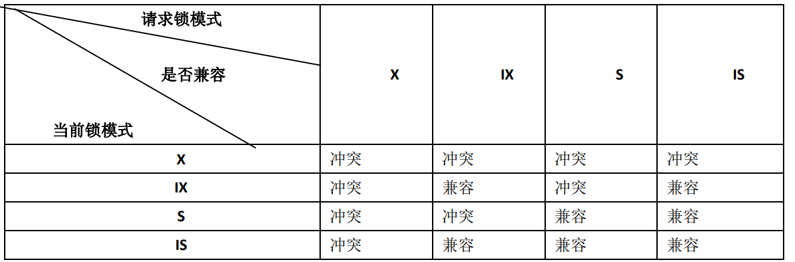
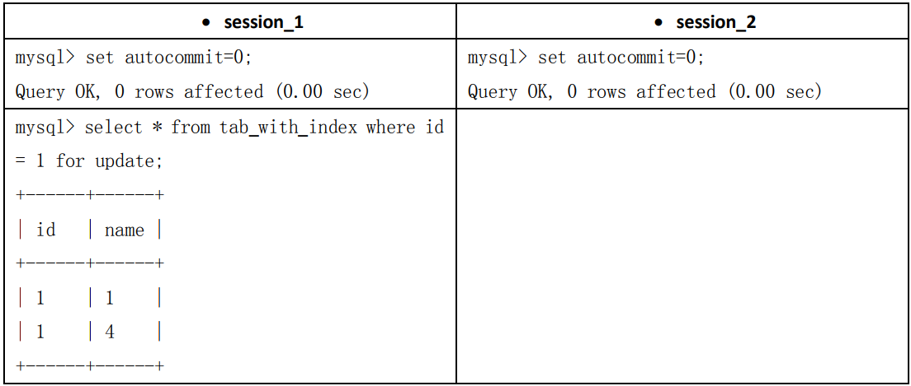
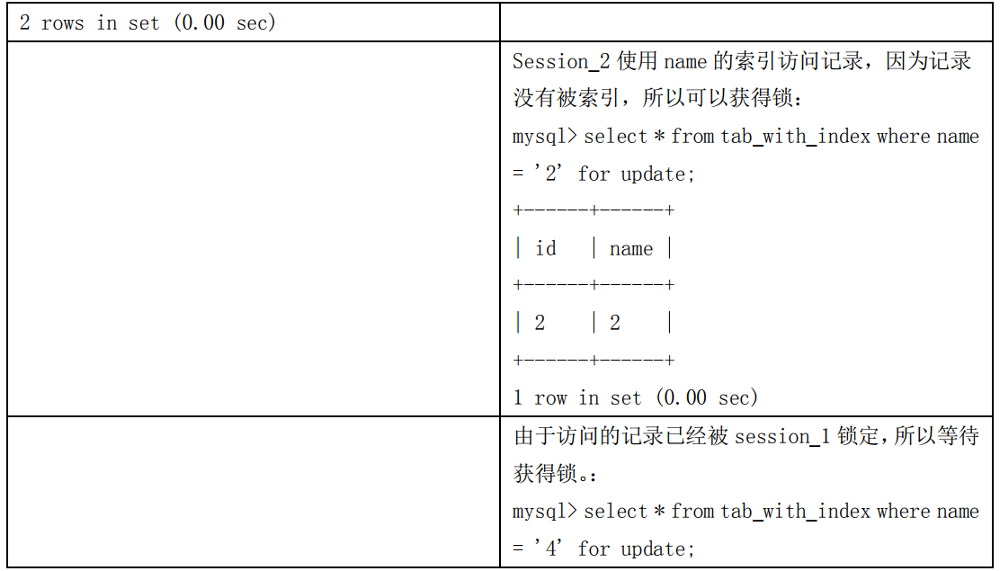

# 文章架构


[TOC]


# MySql架构

下面是mysql服务器的各组件之间的逻辑架构图


- 连接层，最上层的服务并不是 `MYSQL`所独有的，大多数基于网络的客户端/服务器的工具或者服务都有类似的架构。比如连接处理、授权认证、安全等等。

- 服务层（服务器层），第二层架构是 `MYSQL`比较有意思的部分。大多数 `MYSQL`的核心服务功能都在这一层，包括査询解析、分析、优化、缓存以及所有的内置函数(例如日期、时间、数学和加密函数)，所有跨存储引擎的功能都在这一层实现：存储过程、触发器、视图等。

  > - 为了管理方便，人们把连接管理、查询缓存、语法解析、查询优化这些并不涉及真实数据存储的功能划分为MySQL server的功能，把真实存取数据的功能划分为存储引擎的功能。各种不同的存储引擎向上边的MySQL server层提供统一的调用接口（也就是存储引擎API）

- 引擎层，负责`MYSQL`中数据的储存和提取，提供了各种数据储存方法（两种重要引擎：`InnoDB`  `MYISAM`），服务器通过`API`与存储引擎进行通信。这些接口屏蔽了不同存储引擎之间的差异，使得这些差异对上层的査询过程透明。支持的引擎可以通过命令`show engines; ` 命令查看，我们也可以通过下面的命令查看默认的存储引擎。

```sql
mysql> show variables like '%storage_engine%';
```

> 这里要特别注意的就是服务层的优化器和引擎层，这是将我们后面讨论的重点！
>
> mysql执行前会进行查询缓存->解析->优化->执行
>
> `MYSQL`会解析查询，并创建内部数据结构(解析树)，然后对其进行各种优化，包括重写査询、决定表的读取顺序，以及选择合适的索引等。用户可以通过特殊的关键字提示(`hint`)优化器，影响它的决策过程。我们可以请求优化器解释(`explain`)优化过程的各个因素，使用户可以知道服务器是如何进行优化决策的，并提供一个参考基准，便于用户重构査询，使应用尽可能高效运行。优化器并不关心表使用的是什么存储引擎，但存储引擎对于优化查询是有影响的。优化器会请求存储引擎提供容量或某个具体操作的开销信息，以及表数据的统计信息等。例如，某些存储引擎的某种索引，可能对一些特定的查询有优化。例如对于 SELECT语句，在解析査询之前，服务器会先检査查询缓存(`Query Cache`)，如果能够在其中找到对应的査询，服务器就不必再执行査询解析、优化和执行的整个过程，而是直接返回查询缓存中的结果集。


# 第20章 锁问题

## 20.1 MySQL 锁概述

当数据库中，数据作为许多用户共享的资源，如何保证数据的并发性访问的一致性呢？

储存引擎实现了各种锁`MyISAM`和`MEMORY`存储引擎采用的是表级锁（`table-level locking`）；BDB存储引擎采用的是页面锁（`page-level locking`），但也支持表级锁；`InnoDB`存储引擎既支持行级锁（`row-level locking`），也支持表级锁，但默认情况下是采用行级锁。

加锁也需要消耗资源。锁的各种操作,包括获得锁、检査锁是否已经解除、释放锁等，都会增加系统的开销。如果系统花费大量的时间来管理锁，而不是存取数据，那么系统的性能可能会因此受到影响。所谓的锁策略，就是在锁的开销和数据的安全性之间寻求平衡，这种平衡当然也会影响到性能。

MySQL这3种锁的特性可大致归纳如下：

1. 表级锁：开销小，加锁快；不会出现死锁；锁定粒度大，发生锁冲突的概率最高，并发度最低。
2. 行级锁：开销大，加锁慢；会出现死锁；锁定粒度最小，发生锁冲突的概率最低，并发度也最高。
3. 页面锁：开销和加锁时间界于表锁和行锁之间；会出现死锁；锁定粒度界于表锁和行锁之间，并发度一般。

> 锁一般是由储存引擎提供的，但是尽管存储引擎可以管理自己的锁，`MySQL`本身还是会使用各种有效的表锁来实现不同的目的。例如，服务器会为诸如 `ALTER TABLE`之类的语句使用表锁，而忽略存储引擎的锁机制；`MYSQL`也支持`LOCK TABLES`和`UNLOCK TABLES`语句，这也是在服务器层实现的，和存储引擎无关。
>
> 而行级锁都是由储存引擎实现的；


## 20.2 MyISAM 表锁

### 20.2.1 查询表级锁争用情况

可以通过检查`table_locks_waited`和`table_locks_immediate`状态变量来分析系统上的表锁争用情况：

```sql
mysql> show status like 'table%';
+-----------------------+-------+
| Variable_name         | Value |
+-----------------------+-------+
| Table_locks_immediate | 2979  |
| Table_locks_waited    | 0     |
+-----------------------+-------+


2 rows in set (0.00 sec))

```

- `Table_locks_immediate`：产生表级锁定的次数，表示可以立即获取锁的查询次数，每立即获取锁值加1；
- `Table_locks_waited` ：出现表级锁定争用而发生等待的次数(不能立即获取锁的次数，毎等待一次锁值加1)，此值高则说明存在着较严重的表级锁争用情况;


### 20.2.2 MySQL 表级锁的锁模式

`MySQL` 的表级锁有两种模式：表共享读锁（`Table Read Lock`）和表独占写锁（`Table Write Lock`）。锁模式的兼容性如表 20-1 所示


可见，对 `MyISAM` 表的读操作，不会阻塞其他用户对同一表的读请求，但会阻塞对同一表的写请求；对 `MyISAM` 表的写操作，则会阻塞其他用户对同一表的读和写操作；

### 20.2.3 如何加表锁

`MyISAM` 在执行查询语句（`SELECT`）前，会自动给涉及的所有表加读锁，在执行更新操作（`UPDATE`、`DELETE`、`INSERT` 等）前，会自动给涉及的表加写锁，这个过程并不需要用户干预。因此，用户一般不需要直接用 `LOCK TABLE` 命令给 `MyISAM` 表显式加锁。在本书的示例中，显式加锁基本上都是为了方便而已，并非必须如此。给 `MyISAM` 表显式加锁，一般是为了在一定程度模拟事务操作，实现对某一时间点多个表的一致性读取。例如，有一个订单表 orders，其中记录有各订单的总金额 total，同时还有一个订单明细表 order_detail，其中记录有各订单每一产品的金额小计 `subtotal`，假设我们需要检查这两个表的金额合计是否相符，可能就需要执行如下两条 `SQL`：

```sql
Select sum(total) from orders;
Select sum(subtotal) from order_detail;
```

这时，如果不先给两个表加锁，就可能产生错误的结果，因为第一条语句执行过程中，`order_detail` 表可能已经发生了改变。因此，正确的方法应该是：

```sql
Lock tables orders read local, order_detail read local;
Select sum(total) from orders;
Select sum(subtotal) from order_detail;
Unlock tables;

```

要特别说明以下两点内容。

- 上面的例子在 `LOCK TABLES` 时加了“`local`”选项，其作用就是在满足 `MyISAM` 表并发插入条件的情况下，允许其他用户在表尾并发插入记录，有关 MyISAM 表的并发插入问题，在后面的章节中还会进一步介绍。
- 在用 `LOCK TABLES` 给表显式加表锁时，<span style="color:red">必须同时取得所有涉及到表的锁，并且 MySQL 不支持锁升级</span> ，也就是说，在执行 `LOCK TABLES` 后，只能访问显式加锁的这些表，不能访问未加锁的表；同时，如果加的是读锁，那么只能执行查询操作，而不能执行更新操作。

> MyISAM 总是一次获得 SQL 语句所需要的全部锁。这也正是 MyISAM 表不会出现死锁（Deadlock Free）的原因。

#### MyISAM 存储引擎加写锁的例子

由下面的例子可以知道，当一个session获得对一个表的写锁后，只有持有锁的session可以对该表进行读，更新操作，并且持有锁的session更新或访问其他表都会提示错误。其他session的读、写对该表操作都会等待，直到锁被释放为止。

```sql
#建表
DROP TABLE IF EXISTS `film_text`;
CREATE TABLE `film_text`  (
  `film_id` int(20) NOT NULL AUTO_INCREMENT,
  `title` varchar(40)  DEFAULT NULL,
  PRIMARY KEY (`film_id`) USING BTREE
) ENGINE = MyISAM  ROW_FORMAT = Dynamic;

INSERT INTO `film_text` VALUES (1001, '天使');
```


#### MyISAM 存储引擎加读锁的例子

在下面所示的例子中，一个 `session` 使用 `LOCK TABLE` 命令给表 `film_text` 加了读锁，这个 `session` 可以查询锁定表中的记录，但更新或访问其他表都会提示错误；同时，另外一个session 可以查询锁定表中的记录，但更新就会出现锁等待。


当使用 `LOCK TABLES` 时，不仅需要一次锁定用到的所有表，而且，同一个表在 `SQL` 语句中出现多少次，就要通过与 `SQL` 语句中相同的别名锁定多少次，否则也会出错！举例说明如下。

（1）对 actor 表获得读锁：

```sql
mysql> lock table actor read;
Query OK, 0 rows affected (0.00 sec)
```

（2）但是通过别名访问会提示错误：

```sql
mysql> select a.first_name,a.last_name,b.first_name,b.last_name from actor a,actor b where 
a.first_name = b.first_name and a.first_name = 'Lisa' and a.last_name = 'Tom' and a.last_name 
<> b.last_name;
ERROR 1100 (HY000): Table 'a' was not locked with LOCK TABLES
```

（3）需要对别名分别锁定：

```sql
mysql> lock table actor as a read,actor as b read;
Query OK, 0 rows affected (0.00 sec)
```

（4）按照别名的查询可以正确执行：

```sql
mysql> select a.first_name,a.last_name,b.first_name,b.last_name from actor a,actor b where 
a.first_name = b.first_name and a.first_name = 'Lisa' and a.last_name = 'Tom' and a.last_name 
<> b.last_name;
+------------+-----------+------------+-----------+
| first_name | last_name | first_name | last_name |
+------------+-----------+------------+-----------+
| Lisa       | Tom       | LISA       | MONROE    |
+------------+-----------+------------+-----------+
1 row in set (0.00 sec)
```

### 20.2.4 并发插入（Concurrent Inserts）

上文提到过 `MyISAM` 表的读和写是串行的，但这是就总体而言的。在一定条件下，`MyISAM`表也支持查询和插入操作的并发进行。`MyISAM`存储引擎有一个系统变量`concurrent_insert`，专门用以控制其并发插入的行为，其值分别可以为0、1或2。

- 当`concurrent_insert`设置为0时，不允许并发插入。
- 当`concurrent_insert`设置为1时，如果MyISAM表中没有空洞（即表的中间没有被删除的行），MyISAM允许在一个进程读表的同时，另一个进程从表尾插入记录。这也是MySQL的默认设置。
- 当`concurrent_insert`设置为2时，无论MyISAM表中有没有空洞，都允许在表尾并发插入记录。

在`Mysql 5.5.2`及以下版本`concurrent_insert`参数使用数值型默认为1，从5.5.3版本开始`concurrent_insert`参数用枚举值默认为`AUTO`。它允许的操作是“`MySQL permits INSERT and SELECT statements to run concurrently for MyISAM tables that have no free blocks in the middle of the data file.`”

在如下所示的例子中，`session_1` 获得了一个表的 `READ LOCAL` 锁，该线程可以对表进行查询操作，但不能对表进行更新操作；其他的线程（session_2），虽然不能对表进行删除和更新操作，但却可以对该表进行并发插入操作，这里假设该表中间不存在空洞。

**MyISAM 存储引擎的读写（INSERT）并发例子**


可以利用`MyISAM`存储引擎的并发插入特性，来解决应用中对同一表查询和插入的锁争用。例如，将`concurrent_insert`系统变量设为2，总是允许并发插入；同时，通过定期在系统空闲时段执行`OPTIMIZE TABLE`语句来整理空间碎片，收回因删除记录而产生的中间空洞。

### 20.2.5 MyISAM 的锁调度

前面讲过，`MyISAM` 存储引擎的读锁和写锁是互斥的，读写操作是串行的。那么，一个进程请求某个 `MyISAM` 表的读锁，同时另一个进程也请求同一表的写锁，MySQL 如何处理呢？答案是写进程先获得锁。不仅如此，即使读请求先到锁等待队列，写请求后到，写锁也会插到读锁请求之前！这是因为 `MySQL` 认为写请求一般比读请求要重要。这也正是 `MyISAM` 表不太适合于有大量更新操作和查询操作应用的原因，因为，大量的更新操作会造成查询操作很难获得读锁，从而可能永远阻塞。这种情况有时可能会变得非常糟糕！幸好我们可以通过一些设置来调节 `MyISAM` 的调度行为。

很难获得读锁，从而可能永远阻塞。这种情况有时可能会变得非常糟糕！幸好我们可以通过一些设置来调节 MyISAM 的调度行为。

- 通过指定启动参数`low-priority-updates`，使`MyISAM`引擎默认给予读请求以优先的权利。
- 通过执行命令`SET LOW_PRIORITY_UPDATES=1`，使该连接发出的更新请求优先级降低。
- 通过指定`INSERT`、`UPDATE`、`DELETE`语句的`LOW_PRIORITY`属性，降低该语句的优先级。

虽然上面 3 种方法都是要么更新优先，要么查询优先的方法，但还是可以用其来解决查询相对重要的应用（如用户登录系统）中读锁等待严重的问题。另外，`MySQL`也提供了一种折中的办法来调节读写冲突，即给系统参数`max_write_lock_count`设置一个合适的值，当一个表的读锁达到这个值后，`MySQL`就暂时将写请求的优先级降低，给读进程一定获得锁的机会。上面已经讨论了写优先调度机制带来的问题和解决办法。这里还要强调一点：一些需要长时间运行的查询操作，也会使写进程“饿死”！因此，应用中应尽量避免出现长时间运行的查询操作，不要总想用一条`SELECT`语句来解决问题，因为这种看似巧妙的`SQL`语句，往往比较复杂，执行时间较长，在可能的情况下可以通过使用中间表等措施对`SQL`语句做一定的“分解”，使每一步查询都能在较短时间完成，从而减少锁冲突。如果复杂查询不可避免，应尽量安排在数据库空闲时段执行，比如一些定期统计可以安排在夜间执行。

## 20.3 InnoDB 锁问题

在讲解Innodb锁问题之前，我们需要先了解什么叫做事务！

### 20.3.1 什么是事务

我们要理解事务和锁之间的关系，将二者联系起来！

### 20.3.2 获取 InnoDB 行锁争用情况

可以通过检查 `InnoDB_row_lock` 状态变量来分析系统上的行锁的争夺情况

```sql
mysql> show status like 'innodb_row_lock%';
+-------------------------------+-------+
| Variable_name                 | Value |
+-------------------------------+-------+
| InnoDB_row_lock_current_waits | 0     |
| InnoDB_row_lock_time          | 0     |
| InnoDB_row_lock_time_avg      | 0     |
| InnoDB_row_lock_time_max      | 0     |
| InnoDB_row_lock_waits         | 0     |
+-------------------------------+-------+
5 rows in set (0.01 sec)

| Innodb_row_lock_current_waits：正在等待锁定的数量
| Innodb_row_lock_time：从系统启动道现在锁定的总时间长度
| Innodb_row_lock_time_avg：每次等待花费的平均时间
| Innodb_row_lock_time_max：从系统启动到现在等待最长的一次所花的时间
| Innodb_row_lock_waits：系统启动后到现在总共等待的次数
```

### 20.3.3 InnoDB 的行锁模式及加锁方法

`InnoDB` 实现了以下两种类型的行锁。

- 共享锁（`S`）：允许一个事务去读一行，阻止其他事务获得相同数据集的排他锁。
- 排他锁（`X`)：允许获得排他锁的事务更新数据，阻止其他事务取得相同数据集的共享读锁和排他写锁。

另外，为了允许行锁和表锁共存，实现多粒度锁机制，`InnoDB` 还有两种内部使用的意向锁（`Intention Locks`），这两种意向锁都是**表锁**。

- 意向共享锁（`IS`）：事务打算给数据行加行共享锁，事务在给一个数据行加共享锁前必须先取得该**表**的 `IS`锁。
- 意向排他锁（`IX`）：事务打算给数据行加行排他锁，事务在给一个数据行加排他锁前必须先取得该**表**的 `IX`锁。

上述锁模式的兼容情况具体如表 20-6 所示。



如果一个事务请求的锁模式与当前的锁兼容(注意锁冲突和兼容是两个事务间的事！)，`InnoDB` 就将请求的锁授予该事务；反之，如果两者不兼容，该事务就要等待锁释放。意向锁是 `InnoDB` 自动加的，不需用户干预。对于 `UPDATE`、`DELETE` 和 `INSERT` 语句，`InnoDB`会自动给涉及数据集加排他锁（X)；**对于普通 SELECT 语句，`InnoDB` 不会加任何锁**；事务可以通过以下语句显式给记录集加共享锁或排他锁。

- 共享锁（S）：`SELECT * FROM table_name WHERE ... LOCK IN SHARE MODE`。
- 排他锁（X)：`SELECT * FROM table_name WHERE ... FOR UPDATE`。

用 `SELECT ... IN SHARE MODE` 获得共享锁，主要用在需要数据依存关系时来确认某行记录是否存在，并确保没有人对这个记录进行 `UPDATE` 或者 `DELETE` 操作。但是如果当前事务也需要对该记录进行更新操作，则很有可能造成死锁，对于锁定行记录后需要进行更新操作的应用，应该使用 `SELECT... FOR UPDATE` 方式获得排他锁。

在如表 20-7 所示的例子中，使用了 `SELECT ... IN SHARE MODE` 加锁后再更新记录，看看会出现什么情况，其中 `actor` 表的 `actor_id` 字段为主键。建表：

```sql
creat table`actor`  (
  `actor_id` int(11) NOT NULL AUTO_INCREMENT,
  `first_name` varchar(255) DEFAULT NULL,
  `last_name` varchar(255)  DEFAULT NULL,
  PRIMARY KEY (`actor_id`) USING BTREE
) ENGINE = InnoDB
```

新建的连接事务的每条查询都是默认的自动提交，因此每个`session`都手动设置为非自动提交

<span style="color:red">InnoDB行锁不是一次性上锁并且支持锁升级</span>


当使用`SELECT...FOR UPDATE`加锁后再更新记录，出现如表20-8所示的情况。


这里session_1 缺少了一个commit操作，这样才能释放他持有的锁


### 20.3.4 InnoDB 行锁实现方式

InnoDB 行锁是通过给索引上的索引项加锁来实现的，这一点 `MySQL` 与 `Oracle` 不同，后者是通过在数据块中对相应数据行加锁来实现的。`InnoDB` 这种行锁实现特点意味着：只有通过索引条件检索数据，`InnoDB` 才使用行级锁，否则，`InnoDB` 将使用表锁！在实际应用中，要特别注意 `InnoDB` 行锁的这一特性，不然的话，可能导致大量的锁冲突，从而影响并发性能。下面通过一些实际例子来加以说明。

（1）在不通过索引条件查询的时候，`InnoDB` 确实使用的是表锁，而不是行锁。在如表 20-9 所示的例子中，开始 `tab_no_index` 表没有索引：

```sql
mysql> create table tab_no_index(id int,name varchar(10)) engine=innodb;
Query OK, 0 rows affected (0.15 sec)
mysql> insert into tab_no_index values(1,'1'),(2,'2'),(3,'3'),(4,'4');
Query OK, 4 rows affected (0.00 sec)
Records: 4 Duplicates: 0 Warnings: 0
```

**InnoDB 存储引擎的表在不使用索引时使用表锁例子**


在如上表所示的例子中，看起来 `session_1` 只给一行加了排他锁，但 `session_2` 在请求其他行的排他锁时，却出现了锁等待！原因就是在没有索引的情况下，`InnoDB` 只能使用表锁。当我们给其增加一个索引后，`InnoDB` 就只锁定了符合条件的行，如下表所示。

创建 `tab_with_index` 表，id 字段有普通索引：

```sql
mysql> create table tab_with_index(id int,name varchar(10)) engine=innodb;
Query OK, 0 rows affected (0.15 sec)
mysql> alter table tab_with_index add index id(id);
Query OK, 4 rows affected (0.24 sec)
Records: 4 Duplicates: 0 Warnings: 0
```


（2）由于 `MySQL` 的行锁是针对索引加的锁，不是针对记录加的锁，所以虽然是访问不同行的记录，但是如果是使用相同的索引键，是会出现锁冲突的。应用设计的时候要注意这一点。在如下表所示的例子中，表 `tab_with_index` 的 `id` 字段有索引，`name` 字段没有索引：


（3）当表有多个索引的时候，不同的事务可以使用不同的索引锁定不同的行，另外，不论是使用主键索引、唯一索引或普通索引，`InnoDB` 都会使用行锁来对数据加锁。在如下表所示的例子中，表 `tab_with_index` 的 id 字段有主键索引，name 字段有普通索引：

```sql
mysql> alter table tab_with_index add index name(name);
Query OK, 5 rows affected (0.23 sec)
Records: 5 Duplicates: 0 Warnings: 0
```

**InnoDB 存储引擎的表使用不同索引的阻塞例子**





（4）即便在条件中使用了索引字段，但是否使用索引来检索数据是由 `MySQL` 通过判断不同执行计划的代价来决定的，如果 `MySQL` 认为全表扫描效率更高，比如对一些很小的表，它就不会使用索引，这种情况下 `InnoDB` 将使用表锁，而不是行锁。因此，在分析锁冲突时，别忘了检查 `SQL` 的执行计划，以确认是否真正使用了索引。
在下面的例子中，检索值的数据类型与索引字段不同，虽然 `MySQL` 能够进行数据类型转换，但却不会使用索引，从而导致 InnoDB 使用表锁。通过用 explain 检查两条 `SQL` 的执行计划，我们可以清楚地看到了这一点。
例子中 `tab_with_index` 表的 `name` 字段有索引，但是 `name` 字段是 `varchar` 类型的，如果`where` 条件中不是和 `varchar` 类型进行比较，则会对 `name` 进行类型转换造成索引失效，而执行的全表扫描。

```sql
mysql> alter table tab_no_index add index name(name);
Query OK, 4 rows affected (8.06 sec)
Records: 4 Duplicates: 0 Warnings: 0
mysql> explain select * from tab_with_index where name = 1 \G
*************************** 1. row *************************** 
id: 1 
select_type: SIMPLE
table: tab_with_index 
type: ALL
possible_keys: name 
key: NULL 
key_len: NULL 
ref: NULL 
rows: 4
Extra: Using where
1 row in set (0.00 sec)
mysql> explain select * from tab_with_index where name = '1' \G
*************************** 1. row *************************** 
id: 1 
select_type: SIMPLE 
table: tab_with_index 
type: ref
possible_keys: name 
key: name 
key_len: 23 
ref: const 
rows: 1
Extra: Using where
1 row in set (0.00 sec)

```

### 20.3.5 间隙锁（`Next-Key`锁）

当我们**用范围条件**而不是相等条件检索数据，并请求共享或排他锁时，`InnoDB` 会给符合条件的已有数据记录的索引项加锁；对于键值在条件范围内但并不存在的记录，叫做“间隙（`GAP`)”，`InnoDB` 也会对这个“间隙”加锁，这种锁机制就是所谓的间隙锁（`Next-Key` 锁）。举例来说，假如 `emp` 表中只有 101 条记录，其 `empid`的值分别是 1,2,...,100,101，下面的 

```sql
SQL：Select * from emp where empid > 100 for update;
```

是一个范围条件的检索，`InnoDB` 不仅会对符合条件的 `empid` 值为 101 的记录加锁，也会对`empid` 大于 101（这些记录并不存在）的“间隙”加锁。`InnoDB` 使用间隙锁的目的，一方面是为了防止幻读，以满足相关隔离级别的要求，对于上面的例子，要是不使用间隙锁，如果其他事务插入了 `empid` 大于 100 的任何记录，那么本事务如果再次执行上述语句，就会发生幻读；

很显然，在使用范围条件检索并锁定记录时，`InnoDB` 这种加锁机制会阻塞符合条件范围内键值的并发插入，这往往会造成严重的锁等待。因此，在实际应用开发中，尤其是并发插入比较多的应用，我们要尽量优化业务逻辑，尽量使用相等条件来访问更新数据，避免使用范围条件。

还要特别说明的是，`InnoDB` 除了通过范围条件加锁时使用间隙锁外，如果使用相等条件请求给一个不存在的记录加锁，`InnoDB` 也会使用间隙锁！
在如下表所示的例子中，假如 `emp` 表中只有 101 条记录，其 `empid` 的值分别是1,2,......,100,101。


### 20.3.9 关于死锁

上文讲过，`MyISAM` 表锁是 不会出现死锁滴的，这是因为 `MyISAM` 总是一次获得所需的全部锁，要么全部满足，要么等待，因此不会出现死锁。但在 `InnoDB` 中，除单个 `SQL` 组成的事务外，锁是逐步获得的，这就决定了在 InnoDB 中发生死锁是可能的。如表 20-17 所示的就是一个发生死锁的例子。


在上面的例子中，两个事务都需要获得对方持有的排他锁才能继续完成事务，这种循环锁等待就是典型的死锁。
发生死锁后，`InnoDB` 一般都能自动检测到，并使一个事务释放锁并回退，另一个事务获得锁，继续完成事务。但在涉及外部锁，或涉及表锁的情况下，`InnoDB` 并不能完全自动检测到死锁，这需要通过设置锁等待超时参数 `innodb_lock_wait_timeout` 来解决。需要说明的是，这个参数并不是只用来解决死锁问题，在并发访问比较高的情况下，如果大量事务因无法立即获得所需的锁而挂起，会占用大量计算机资源，造成严重性能问题，甚至拖跨数据库。我们通过设置合适的锁等待超时阈值，可以避免这种情况发生。

通常来说，死锁都是应用设计的问题，通过调整业务流程、数据库对象设计、事务大小，以及访问数据库的 SQL 语句，绝大部分死锁都可以避免。


### 多版本并发控制

MYSQL的大多数事务型存储引擎实现的都不是简单的行级锁。基于提升并发性能的考虑,它们一般都同时实现了多版本并发控制(MVCC)。不仅是 MYSQL,包Oracle Postgresql等其他数据库系统也都实现了MVCC，但各自的实现机制不尽相同，因为MVCC没有一个统一的实现标准。可以认为MVCC是行级锁的一个变种，但是它在很多情况下避免了加锁操作，因此开销更低。虽然实现机制有所不同,但大都实现了非阻塞的读操作，写操作也只锁定必要的行。

MVCC的实现,是通过保存数据在某个时间点的快照来实现的。也就是说,不管需要执行多长时间，每个事务看到的数据都是一致的。根据事务开始的时间不同，每个事务对同一张表，同一时刻看到的数据可能是不一样的。如果之前没有这方面的概念，这句话听起来就有点迷惑。熟悉了以后会发现,这句话其实还是很容易理解的。

前面说到不同存储引擎的`MVCC`实现是不同的，典型的有乐观( optimistic)并发控制和悲观( pessimistic)并发控制。下面我们通过 `INNODB`的简化版行为来说明`MVCC`是如何工作的。

`INNODB`的`MVCC`，是通过在每行记录后面保存两个隐藏的列来实现的。这两个列,个保存了行的创建时间,一个保存行的过期时间(或删除时间)。当然存储的并不是实际的时间值，而是系统版本号(`system version number`)。每开始一个新的事务，系统版本号都会自动递增。事务开始时刻的系统版本号会作为事务的版本号，用来和査询到的每行记录的版本号进行比较。下面看一下在 `REPEATABLE READ`隔离级别下，`MVCC`具体是如何操作的。


保存这两个额外系统版本号，使大多数读操作都可以不用加锁。这样设计使得读数据操作很简单，性能很好，并且也能保证只会读取到符合标准的行。不足之处是每行记录都需要额外的存储空间，需要做更多的行检査工作，以及一些额外的维护工作。`MVCC`只在 `REPEATABLE READ`和 `READ COMMITTED`两个隔离级别下工作。其他两个隔离级别都和`MVCC`不兼容，因为 `READ UNCOMMITTED`总是读取最新的数据行，而不是符合当前事务版本的数据行。而 `SERIALIZABLE`则会对所有读取的行都加锁。

> 个人总结：在mysql中，行锁，事务，索引都是存储引擎实现的，因此对于不同的储存引擎他们的实现方式是不同的！如MyISAM没有实现行锁和事务，INNODB实现了行锁和事务。

