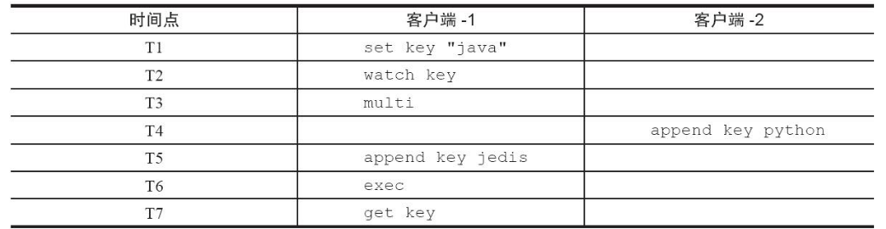
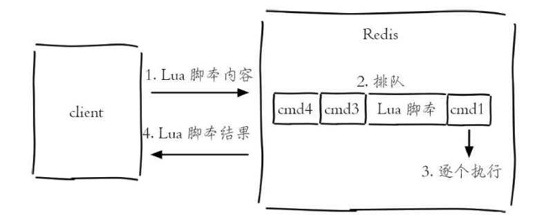

## 事务与Lua

### 事务

Redis提供了简单的事务功能，将一组需要一起执行的命令放到`multi`和`exec`两个命令之间。`multi`命令代表事务开始，`exec`命令代表事务结束，它们之间的命令是原子顺序执行的，例如下面操作实现了上述用户关注问题。

> - sadd key member [member ...]
>   - 将一个或多个 `member` 元素加入到集合 `key` 当中，已经存在于集合的 `member` 元素将被忽略。假如 `key` 不存在，则创建一个只包含 `member` 元素作成员的集合。当 `key` 不是集合类型时，返回一个错误。
> - `sismember key member`
>   - 判断 `member` 元素是否是集合 `key` 的成员。如果不是就返回0。

```shell
127.0.0.1:6379> multi
OK
127.0.0.1:6379> sadd user:a:follow user:b
QUEUED
127.0.0.1:6379> sadd user:b:fans user:a
QUEUED
```

可以看到`sadd`命令此时的返回结果是`QUEUED`，代表命令并没有真正执行，而是暂时保存在Redis中。如果此时另一个客户端执行`sismember user:a:follow user:b`返回结果应该为0。

只有当`exec`执行后，用户A关注用户B的行为才算完成，如下所示返回的两个结果对应`sadd`命令。

```shell
127.0.0.1:6379> exec
1) (integer) 1
2) (integer) 
1127.0.0.1:6379> sismember user:a:follow user:b
(integer) 1
```

如果要停止事务的执行，可以使用`discard`命令代替`exec`命令即可。

```shell
127.0.0.1:6379> discard
OK
127.0.0.1:6379> sismember user:a:follow user:b
(integer) 0
```

如果事务中的命令出现错误，Redis的处理机制也不尽相同。

#### 1.命令错误

> - mget key [key ...]
>   - 返回所有(一个或多个)给定 `key` 的值。如果给定的 `key` 里面，有某个 `key` 不存在，那么这个 `key` 返回特殊值 `nil` 。因此，该命令永不失败。
> - set key value 
>   - 将字符串值 `value` 关联到 `key` 。如果 `key` 已经持有其他值，`set`就覆写旧值，无视类型。对于某个原本带有生存时间（TTL）的键来说， 当`set`命令成功在这个键上执行时， 这个键原有的 TTL 将被清除。

例如下面操作错将`set`写成了`sett`，属于语法错误，会造成整个事务无法执行，key和`counter`的值未发生变化：

```shell
127.0.0.1:6388> mget key counter
1) "hello"
2) "100"
127.0.0.1:6388> multi
OK
127.0.0.1:6388> sett key world
(error) ERR unknown command 'sett'
127.0.0.1:6388> incr counter
QUEUED
127.0.0.1:6388> exec
(error) EXECABORT Transaction discarded because of previous errors.
127.0.0.1:6388> mget key counter
1) "hello"
2) "100"
```

#### 2.运行时错误

例如用户B在添加粉丝列表时，误把`sadd`命令写成了`zadd`命令，这种就是运行时命令，因为语法是正确的：

```shell
127.0.0.1:6379> multi
OK
127.0.0.1:6379> sadd user:a:follow user:b
QUEUED
127.0.0.1:6379> zadd user:b:fans 1 user:a
QUEUED127.0.0.1:6379> exec
1) (integer) 1
2) (error) WRONGTYPE Operation against a key holding the wrong kind of value
127.0.0.1:6379> sismember user:a:follow user:b
(integer) 1
```

可以看到Redis并不支持回滚功能，`sadd user:a:follow user:b`命令已经执行成功，开发人员需要自己修复这类问题。

有些应用场景需要在事务之前，确保事务中的`key`没有被其他客户端修改过，才执行事务，否则不执行（类似乐观锁）。Redis提供了`watch`命令来解决这类问题，下表展示了两个客户端执行命令的时序。

> 有点事务隔离性的味道



可以看到“客户端-1”在执行`multi`之前执行了`watch`命令，“客户端-2”在“客户端-1”执行`exec`之前修改了key值，造成事务没有执行（`exec`结果为`nil`），整个代码如下所示：

```shell
#T1：客户端1
127.0.0.1:6379> set key "java"
OK
#T2：客户端1
127.0.0.1:6379> watch key
OK
#T3：客户端1
127.0.0.1:6379> multi
OK
#T4：客户端2
127.0.0.1:6379> append key python
(integer) 11
#T5：客户端1
127.0.0.1:6379> append key jedis
QUEUED
#T6：客户端1
127.0.0.1:6379> exec
(nil)
#T7：客户端1
127.0.0.1:6379> get key
"javapython"
```

Redis提供了简单的事务，之所以说它简单，主要是因为它不支持事务中的回滚特性，同时无法实现命令之间的逻辑关系计算，当然也体现了Redis的“keep it simple”的特性，下一小节介绍的Lua脚本同样可以实现事务的相关功能，但是功能要强大很多。

### Lua用法简述

#### 1.数据类型及其逻辑处理

Lua语言提供了如下几种数据类型：booleans（布尔）、numbers（数值）、strings（字符串）、tables（表格），和许多高级语言相比，相对简单。下面将结合例子对Lua的基本数据类型和逻辑处理进行说明。

##### 字符串

下面定义一个字符串类型的数据：`local strings val = "world"`

其中，local代表val是一个局部变量，如果没有local代表是全局变量。`print`函数可以打印出变量的值，例如下面代码将打印world，其中"--"是Lua语言的注释。

```lua
-- 结果是
"world"print(hello)
```

##### 数组

在Lua中，如果要使用类似数组的功能，可以用tables类型，下面代码使用定义了一个tables类型的变量myArray，但和大多数编程语言不同的是，Lua的数组下标从1开始计算：

```lua
local tables myArray = {"redis", "jedis", true, 88.0}
--true
print(myArray[3])
```

如果想遍历这个数组，可以使用for和while，这些关键字和许多编程语言是一致的。

1. 关键字for以end作为结束符，要遍历myArray，首先需要知道tables的长度，只需要在变量前加一个#号即可：

   ```lua
   for i = 1, #myArraydo    
   	print(myArray[i])
   end
   ```

   Lua还提供了内置函数ipairs，使用for index，valueipairs（tables）可以遍历出所有的索引下标和值：

   ```lua
   for index,value in ipairs(myArray)
       do    
       print(index) 
       print(value)
   end
   ```

2. 下面代码同样会计算1到100的和，只不过使用的是while循环，while循环同样以end作为结束符。

   ```LUA
   local int sum = 0
   local int i = 0
   while i <= 100
       do   
       sum = sum +i  
       i = i + 1
   end
   --输出结果为5050
   print(sum)
   ```

3. 要确定数组中是否包含了jedis，有则打印true，注意if以end结尾，if后紧跟then：

   ```lua
   local tables myArray = {"redis", "jedis", true, 88.0}
   for i = 1, #myArray
   do    
       if myArray[i] == "jedis"    
       then        
           print("true")  
           break   
       else     
       	--do nothing   
       end
   end
   ```

##### 哈希

如果要使用类似哈希的功能，同样可以使用tables类型，例如下面代码定义了一个tables，每个元素包含了key和value，其中strings1..string2是将两个字符串进行连接：

```lua
local tables user_1 = {age = 28, name = "tome"}
--user_1 age is 28
print("user_1 age is " .. user_1["age"])
```

如果要遍历user_1，可以使用Lua的内置函数pairs：

```lua
for key,value in pairs(user_1) 
    do 
    print(key .. value)
end
```

####  2.函数定义

在Lua中，函数以function开头，以end结尾，funcName是函数名，中间部分是函数体：

```lua
function funcName()   
...
end
--contact函数将两个字符串拼接：
function contact(str1, str2)    
    return str1 .. str2
end
--"hello world"
print(contact("hello ", "world"))
```

### Redis与Lua

#### 1. 在Redis中使用Lua

在Redis中执行Lua脚本有两种方法：eval和evalsha。

**eval** 

`eval 脚本内容 key个数 key列表 参数列表`

下面例子使用了key列表和参数列表来为Lua脚本提供更多的灵活性：

```shell
127.0.0.1:6379> eval 'return "hello " .. KEYS[1] .. ARGV[1]' 1 redis world
"hello redisworld"
```

此时KEYS[1]="redis"，ARGV[1]="world"，所以最终的返回结果是"hello redisworld"。如果Lua脚本较长，还可以使用`redis-cli--eval`直接执行文件。`eval`命令和`--eval`参数本质是一样的，客户端如果想执行Lua脚本，首先在客户端编写好Lua脚本代码，然后把脚本作为字符串发送给服务端，服务端会将执行结果返回给客户端，整个过程如图所示。



**evalsha**

除了使用eval，Redis还提供了evalsha命令来执行Lua脚本。如下图所示，首先要将Lua脚本加载到Redis服务端，得到该脚本的`SHA1`校验和，`evalsha`命令使用SHA1作为参数可以直接执行对应Lua脚本，避免每次发送Lua脚本的开销。这样客户端就不需要每次执行脚本内容，而脚本也会常驻在服务端，脚本功能得到了复用。


1. 加载脚本：`script load`命令可以将脚本内容加载到Redis内存中，例如下面将lua_get.lua加载到Redis中，得到SHA1为："7413dc2440db1fea7c0a0bde841fa68eefaf149c"

   ```lua
   # redis-cli script load "$(cat lua_get.lua)"
   "7413dc2440db1fea7c0a0bde841fa68eefaf149c"
   ```

2. 执行脚本：`evalsha`的使用方法如下，参数使用SHA1值，执行逻辑和`eval`一致。`evalsha 脚本SHA1值 key个数 key列表参数列表`  。所以只需要执行如下操作，就可以调用lua_get.lua脚本：

   ```lua
   127.0.0.1:6379> evalsha 7413dc2440db1fea7c0a0bde841fa68eefaf149c 1 redis world
   "hello redisworld"
   ```

#### 2. Lua的Redis API

Lua可以使用`redis.call`函数实现对Redis的访问，例如下面代码是Lua使用`redis.call`调用了Redis的set和get操作：

```shell
redis.call("set", "hello", "world")
redis.call("get", "hello")
```

放在Redis的执行效果如下：

```lua
127.0.0.1:6379> eval 'return redis.call("get", KEYS[1])' 1 hello
"world"
```

除此之外Lua还可以使用`redis.pcall`函数实现对Redis的调用，`redis.call`和`redis.pcall`的不同在于，如果`redis.call`执行失败，那么脚本执行结束会直接返回错误，而`redis.pcall`会忽略错误继续执行脚本，所以在实际开发中要根据具体的应用场景进行函数的选择。

### 案例

Lua脚本功能为Redis开发和运维人员带来如下三个好处：

1. Lua脚本在Redis中是原子执行的，执行过程中间不会插入其他命令。
2. Lua脚本可以帮助开发和运维人员创造出自己定制的命令，并可以将这些命令常驻在Redis内存中，实现复用的效果。
3. Lua脚本可以将多条命令一次性打包，有效地减少网络开销。

下面以一个例子说明Lua脚本的使用，当前列表记录着热门用户的id，假设这个列表有5个元素，如下所示：

```shell
127.0.0.1:6379> lrange hot:user:list 0 -1
1) "user:1:ratio"
2) "user:8:ratio"
3) "user:3:ratio"
4) "user:99:ratio"
5) "user:72:ratio"
```

`user:{id}:ratio`代表用户的热度，它本身又是一个字符串类型的键：

```shell
127.0.0.1:6379> mget user:1:ratio user:8:ratio user:3:ratio user:99:ratio     user:72:ratio
1) "986"
2) "762"
3) "556"
4) "400"
5) "101"
```

现要求将列表内所有的键对应热度做加1操作，并且保证是原子执行，此功能可以利用Lua脚本来实现。

1. 将列表中所有元素取出，赋值给mylist：`local mylist = redis.call("lrange", KEYS[1], 0, -1)`

2. 定义局部变量count=0，这个count就是最后incr的总次数：`local count = 0`

3. 遍历mylist中所有元素，每次做完count自增，最后返回count：

   ```lua
   for index,key in ipairs(mylist) 
       do   
       redis.call("incr",key)  
       count = count + 1
   end
   return count
   ```

------

将上述脚本写入lrange_and_mincr.lua文件中，并执行如下操作，返回结果为5。

```shell
redis-cli --eval lrange_and_mincr.lua  hot:user:list
(integer) 5
```

```shell
# 执行后所有用户的热度自增1：这是一个原子操作
127.0.0.1:6379> mget user:1:ratio user:8:ratio user:3:ratio user:99:ratio     user:72:ratio
1) "987"
2) "763"
3) "557"
4) "401"
5) "102"
```

