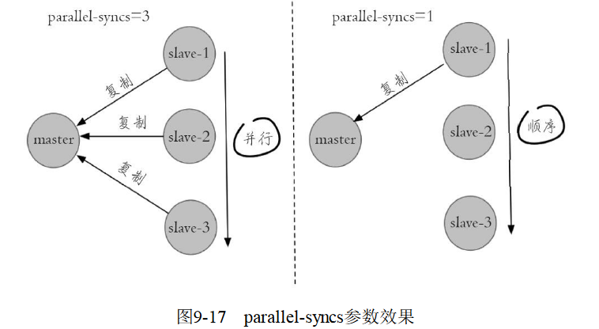
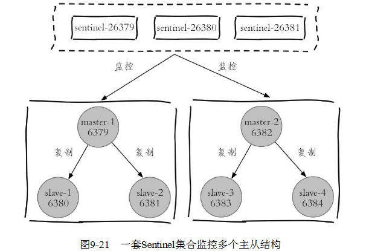
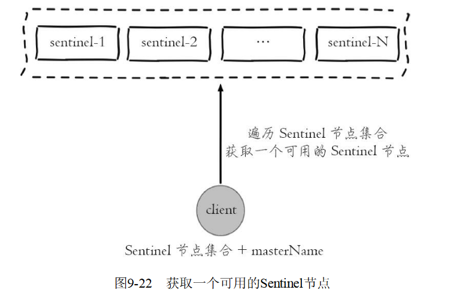
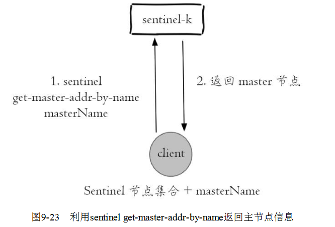
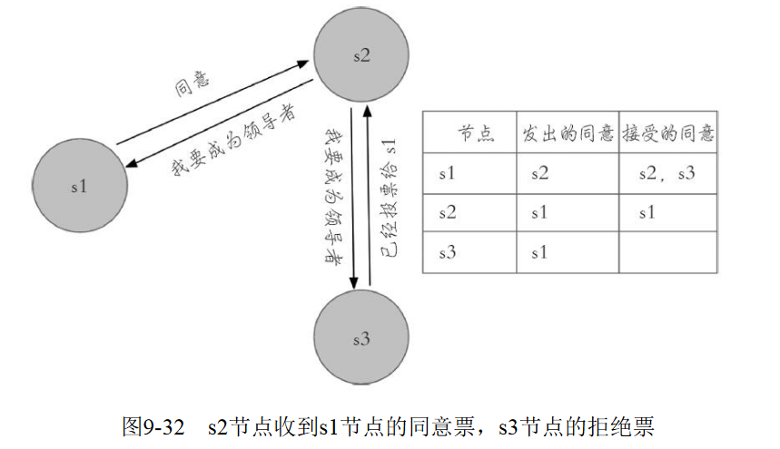

[TOC]


# 第9章 哨兵-- 解决故障转移问题

**用于故障转移**

`Redis`的主从复制模式下，一旦主节点由于故障不能提供服务，需要人工将从节点晋升为主节点，同时还要通知应用方更新主节点地址，对于很多应用场景这种故障处理的方式是无法接受的。可喜的是Redis从2.8开始正式提供了`Redis Sentinel`（哨兵）架构来解决这个问题。

## 9.1 基本概念

由于对`Redis`的许多概念都有不同的名词解释，所以在介绍`Redis Sentinel`之前，先对几个名词进行说明，这样便于在后面的介绍中达成一致，如表9-1所示。


`Redis Sentinel`是`Redis`的高可用实现方案，在实际的生产环境中，对提高整个系统的高可用性是非常有帮助的。本节首先会回顾主从复制模式下故障处理可能产生的问题，而后引出高可用的概念。

### 9.1.1 主从复制的问题

`Redis`的主从复制模式可以将主节点的数据改变同步给从节点，这样从节点就可以起到两个作用：第一，作为主节点的一个备份，一旦主节点出了故障不可达的情况，从节点可以作为后备“顶”上来，并且保证数据尽量不丢失（主从复制是最终一致性）。第二，从节点可以扩展主节点的读能力，一旦主节点不能支撑住大并发量的读操作，从节点可以在一定程度上帮助主节点分担读压力。

但是主从复制也带来了以下问题：

- 一旦主节点出现故障，需要手动将一个从节点晋升为主节点，同时需要修改应用方的主节点地址，还需要命令其他从节点去复制新的主节点，整个过程都需要人工干预。
- 主节点的写能力受到单机的限制。
- 主节点的存储能力受到单机的限制。

其中第一个问题就是`Redis`的高可用问题，将在下一个小节进行分析。第二、三个问题属于`Redis`的分布式问题，以后会介绍。

### 9.1.2 高可用

`Redis`主从复制模式下，一旦主节点出现了故障不可达，需要人工干预进行故障转移，无论对于`Redis`的应用方还是运维方都带来了很大的不便。对于应用方来说无法及时感知到主节点的变化，必然会造成一定的写数据丢失和读数据错误，甚至可能造成应用方服务不可用。对于`Redis`的运维方来说，整个故障转移的过程是需要人工来介入的，故障转移实时性和准确性上都无法得到保障，图9-1到图9-5展示了一个1主2从的`Redis`主从复制模式下的主节点出现故障后，是如何进行故障转移的，过程如下所示。

1. 如图9-1所示，主节点发生故障后，客户端（`client`）连接主节点失败，两个从节点与主节点连接失败造成复制中断。

   

2. 如图9-2所示，如果主节点无法正常启动，需要选出一个从节点（比如选择`slave-1`），对其执行`slaveof no one`命令使其成为新的主节点。

   

3. 如图9-3所示，原来的从节点（`slave-1`）成为新的主节点后，更新应用方的主节点信息，重新启动应用方。

   

4. 如图9-4所示，客户端命令另一个从节点（`slave-2`）去复制新的主节点（`new-master`）

   

5. 如图9-5所示，待原来的主节点恢复后，让它去复制新的主节点。

   

   

上述处理过程就可以认为整个服务或者架构的设计不是高可用的，因为整个故障转移的过程需要人介入。考虑到这点，有些公司把上述流程自动化了，但是仍然存在如下问题：第一，判断节点不可达的机制是否健全和标准。第二，如果有多个从节点，怎样保证只有一个被晋升为主节点。第三，通知客户端新的主节点机制是否足够健壮。`Redis Sentinel`正是用于解决这些问题。

###  9.1.3 Redis Sentinel的高可用性

当主节点出现故障时，`Redis Sentinel`能自动完成故障发现和故障转移，并通知应用方，从而实现真正的高可用。

   `Redis Sentinel`是一个分布式架构，其中包含若干个`Sentinel`节点和`Redis`数据节点，每个`Sentinel`节点会对数据节点和其余`Sentinel`节点进行监控，当它发现节点不可达时，会对节点做下线标识。如果被标识的是主节点，它还会和其他`Sentinel`节点进行“协商”，当大多数`Sentinel`节点都认为主节点不可达时，它们会选举出一个`Sentinel`节点来完成自动故障转移的工作，同时会将这个变化实时通知给`Redis`应用方。整个过程完全是自动的，不需要人工来介入，所以这套方案很有效地解决了`Redis`的高可用问题。

这里的分布式是指：`Redis`数据节点、`Sentinel`节点集合、客户端分布在多个物理节点的架构，不要与第`Redis Cluster`分布式混淆。

如图9-6所示，`Redis Sentinel`与`Redis`主从复制模式只是多了若干`Sentinel`节点，所以`Redis Sentinel`并没有针对`Redis`节点做了特殊处理，这里是很多开发和运维人员容易混淆的。


从逻辑架构上看，`Sentinel`节点集合会定期对所有节点进行监控，特别是对主节点的故障实现自动转移。

下面以1个主节点、2个从节点、3个`Sentinel`节点组成的`Redis Sentinel`为例子进行说明，拓扑结构如图9-7所示。


1. 如图9-8所示，主节点出现故障，此时两个从节点与主节点失去连接，主从复制失败。

   

2. 如图9-9所示，每个`Sentinel`节点通过定期监控发现主节点出现了故障。

   

3. 如图9-10所示，多个`Sentinel`节点对主节点的故障达成一致，选举出`sentinel-3`节点作为领导者负责故障转移。

   

4. 如图9-11所示，`Sentinel`领导者节点执行了故障转移，整个过程和9.1.2节介绍的是完全一致的，只不过是自动化完成的

   

5. 故障转移后整个`Redis Sentinel`的拓扑结构图9-12所示。

   

通过上面介绍的`Redis Sentinel`逻辑架构以及故障转移的处理，可以看出`Redis Sentinel`具有以下几个功能：

1. **监控：`Sentinel`节点会定期检测`Redis`数据节点、其余`Sentinel`节点是否可达。**
2. **通知：`Sentinel`节点会将故障转移的结果通知给应用方。**
3. **主节点故障转移：实现从节点晋升为主节点并维护后续正确的主从关系。**
4. **配置提供者：后面我们会讲到，在`Redis Sentinel`结构中，客户端在初始化的时候连接的是`Sentinel`节点集合，从中获取主节点信息。**

同时看到，`Redis Sentinel`包含了若个`Sentinel`节点，这样做也带来了两个好处：

1. 对于节点的故障判断是由多个`Sentinel`节点共同完成，这样可以有效地防止误判。
2. `Sentinel`节点集合是由若干个`Sentinel`节点组成的，这样即使个别`Sentinel`节点不可用，整个`Sentinel`节点集合依然是健壮的。

但是`Sentinel`节点本身就是独立的`Redis`节点，只不过它们有一些特殊，它们不存储数据，只支持部分命令。下一节将完整介绍`Redis Sentinel`的部署过程，相信在安装和部署完`Redis Sentinel`后，读者能更清晰地了解`Redis Sentinel`的整体架构。


## 9.2 安装和部署

### 9.2.4 配置优化

了解每个配置的含义有助于更加合理地使用`Redis Sentinel`，因此本节将对每个配置的使用和优化进行详细介绍。`Redis`安装目录下有一个`sentinel.conf`，是默认的`Sentinel`节点配置文件，下面就以它作为例子进行说明。

#### 1.配置说明和优化

```shell
port 26379
dir /opt/soft/redis/data        
sentinel monitor mymaster 127.0.0.1 6379 2
sentinel down-after-milliseconds mymaster 30000
sentinel parallel-syncs mymaster 1sentinel failover-timeout mymaster 180000
#sentinel auth-pass <master-name> <password>
#sentinel notification-script <master-name> <script-path>
#sentinel client-reconfig-script <master-name> <script-path>
```

`port`和`dir`分别代表`Sentinel`节点的端口和工作目录，下面重点对`sentinel`相关配置进行详细说明。

##### 1. sentinel monitor

配置如下：`sentinel monitor <master-name> <ip> <port> <quorum> `

`Sentinel`节点会定期监控主节点，所以从配置上必然也会有所体现，本配置说明`Sentinel`节点要监控的是一个名字叫做<master-name>，ip地址和端口为<ip><port>的主节点。<quorum>代表要判定主节点最终不可达所需要的票数。**但实际上`Sentinel`节点会对所有节点进行监控，但是我们在上面的`Sentinel`节点的配置中没有看到有关从节点和其余`Sentinel`节点的配置，那是因为`Sentinel`节点会从主节点中获取有关从节点以及其余`Sentinel`节点的相关信息**，有关这部分是如何实现的，将在9.5节介绍。

例如某个`Sentinel`初始节点配置如下：


当所有节点启动后，配置文件中的内容发生了变化，体现在三个方面：

1. `Sentinel`节点自动发现了从节点、其余`Sentinel`节点。
2. 去掉了默认配置，例如`parallel-syncs`、`failover-timeout`参数。
3. 添加了配置纪元相关参数。

启动后变化为：


<quorum>参数用于故障发现和判定，例如将`quorum`配置为2，代表至少有2个`Sentinel`节点认为主节点不可达，那么这个不可达的判定才是客观的。对于<quorum>设置的越小，那么达到下线的条件越宽松，反之越严格。一般建议将其设置为`Sentinel`节点的一半加1。

同时<quorum>还与`Sentinel`节点的领导者选举有关，至少要有`max（quorum，num（sentinels）/2+1`）个`Sentinel`节点参与选举，才能选出领导者`Sentinel`，从而完成故障转移。例如有5个`Sentinel`节点，`quorum=4`，那么至少要有`max（quorum，num（sentinels）/2+1）=4`个在线`Sentinel`节点才可以进行领导者选举。

##### 2. sentinel down-after-milliseconds

配置如下：`sentinel down-after-milliseconds <master-name> <times> `

每个`Sentinel`节点都要通过定期发送`ping`命令来判断`Redis`数据节点和其余`Sentinel`节点是否可达，如果超过了`down-after-milliseconds`配置的时间且没有有效的回复，则判定节点不可达，<times>（单位为毫秒）就是超时时间。这个配置是对节点失败判定的重要依据。

优化说明：`down-after-milliseconds`越大，代表`Sentinel`节点对于节点不可达的条件越宽松，反之越严格。条件宽松有可能带来的问题是节点确实不可达了，那么应用方需要等待故障转移的时间越长，也就意味着应用方故障时间可能越长。条件严格虽然可以及时发现故障完成故障转移，但是也存在一定的误判率。

##### 3. sentinel parallel-syncs

配置如下： `sentinel parallel-syncs <master-name> <nums> `

当`Sentinel`节点集合对主节点故障判定达成一致时，`Sentinel`领导者节点会做故障转移操作，选出新的主节点，原来的从节点会向新的主节点发起复制操作，`parallel-syncs`就是用来限制在一次故障转移之后，每次向新的主节点发起复制操作的从节点个数。如果这个参数配置的比较大，那么多个从节点会向新的主节点同时发起复制操作，尽管复制操作通常不会阻塞主节点，但是同时向主节点发起复制，必然会对主节点所在的机器造成一定的网络和磁盘`IO`开销。图9-17展示`parallel-syncs=3`和`parallel-syncs=1`的效果，`parallel-syncs=3`会同时发起复制，parallel-syncs=1时从节点会轮询发起复制。



##### 4. sentinel failover-timeout

配置如下：`sentinel failover-timeout <master-name> <times> `

`failover-timeout`通常被解释成故障转移超时时间，但实际上它作用于故障转移的各个阶段：

a）选出合适从节点。b）晋升选出的从节点为主节点。c）命令其余从节点复制新的主节点。d）等待原主节点恢复后命令它去复制新的主节点。`failover-timeout`的作用具体体现在四个方面：

1. 如果`Redis Sentinel`对一个主节点故障转移失败，那么下次再对该主节点做故障转移的起始时间是`failover-timeou`t的2倍。
2. 在b）阶段时，如果`Sentinel`节点向a）阶段选出来的从节点执行`slaveof no one`一直失败（例如该从节点此时出现故障），当此过程超过`failover-timeout`时，则故障转移失败。
3. 在b）阶段如果执行成功，`Sentinel`节点还会执行`info`命令来确认a）阶段选出来的节点确实晋升为主节点，如果此过程执行时间超过`failover-timeout`时，则故障转移失败。
4. 如果c）阶段执行时间超过了`failover-timeout`（不包含复制时间），则故障转移失败。注意：即使超过了这个时间，`Sentinel`节点也会最终配置从节点去同步最新的主节点。

##### 5. sentinel auth-pass

配置如下：`sentinel auth-pass <master-name> <password>`

如果`Sentinel`监控的主节点配置了密码，`sentinel auth-pass`配置通过添加主节点的密码，防止`Sentinel`节点对主节点无法监控。

##### 6. sentinel notification-script

配置如下：`sentinel notification-script <master-name> <script-path>`

`entinel notification-script`的作用是在**故障转移期间**，当一些警告级别的`Sentinel`事件发生（指重要事件，例如`-sdown`：客观下线、`-odown`：主观下线）时，会触发对应路径的脚本，并向脚本发送相应的事件参数。

例如在`/opt/redis/scripts/`下配置了`notification.sh`，该脚本会接收每个`Sentinel`节点传过来的事件参数，可以利用这些参数作为邮件或者短信报警依据：

```shell
#!/bin/sh
#获取所有参数
msg=$*
#报警脚本或者接口，将msg作为参数
exit 0
```

如果需要该功能，就可以在`Sentinel`节点添加如下配置（`<master-name>=mymaster`）：

`sentinel notification-script mymaster /opt/redis/scripts/notification.sh`

##### 7. sentinel client-reconfig-script

配置如下：`sentinel client-reconfig-script <master-name> <script-path>`

`sentinel client-reconfig-script`的作用是在**故障转移结束后，**会触发对应路径的脚本，并向脚本发送故障转移结果的相关参数。和`notification-script`类似，可以在`/opt/redis/scripts/`下配置了`client-reconfig.sh`，该脚本会接收每个`Sentinel`节点传过来的故障转移结果参数，并触发类似短信和邮件报警：

```shell
#!/bin/sh
#获取所有参数
msg=$*
#报警脚本或者接口，将msg作为参数
exit 0
```

如果需要该功能，就可以在`Sentinel`节点添加如下配置（`<master-name>=mymaster`）：

`sentinel client-reconfig-script mymaster /opt/redis/scripts/client-reconfig.sh`

当故障转移结束，每个`Sentinel`节点会将故障转移的结果发送给对应的脚本，具体参数如下：`<master-name> <role> <state> <from-ip> <from-port> <to-ip> <to-port>`

1. <master-name>：主节点名。
2. <role>：`Sentinel`节点的角色，分别是`leader`和`observer`，`leader`代表当前`Sentinel`节点是领导者，是它进行的故障转移；`observer`是其余`Sentinel`节点。
3. <from-ip>：原主节点的`ip`地址。·<from-port>：原主节点的端口。
4. <to-ip>：新主节点的`ip`地址。
5. <to-port>：新主节点的端口。

例如以下内容分别是三个`Sentinel`节点发送给脚本的，其中一个是`leader`，另外两个是`observer`：

```shell
mymaster leader start 127.0.0.1 6379 127.0.0.1 6380
mymaster observer start 127.0.0.1 6379 127.0.0.1 6380
mymaster observer start 127.0.0.1 6379 127.0.0.1 6380
```

有关`sentinel notification-script`和`sentinel client-reconfig-script`有几点需要注意：

- <script-path>必须有可执行权限。
- <script-path>开头必须包含`shell`脚本头（例如#！/bin/sh），否则事件发生时`Redis`将无法执行脚本产生如下错误：`-script-error /opt/sentinel/notification.sh 0 2`

1. `Redis`规定脚本的最大执行时间不能超过60秒，超过后脚本将被杀掉。
2. 如果`shell`脚本以`exit` 1结束，那么脚本稍后重试执行。如果以`exit 2`或者更高的值结束，那么脚本不会重试。正常返回值是`exit 0`。
3. 如果需要运维的`Redis Sentinel`比较多，建议不要使用这种脚本的形式来进行通知，这样会增加部署的成本。

#### 2.如何监控多个主节点

`Redis Sentinel`可以同时监控多个主节点，具体拓扑图类似于图9-18。配置方法也比较简单，只需要指定多个`masterName`来区分不同的主节点即可，例如下面的配置监控`monitor master-business-1（10.10.xx.1：6379）`和`monitor master-business-2（10.10.xx.2：6379）`两个主节点：

```shell
sentinel monitor master-business-1 10.10.xx.1 6379 2 
sentinel down-after-milliseconds master-business-1 60000 
sentinel failover-timeout master-business-1 180000 
sentinel parallel-syncs master-business-1 1
sentinel monitor master-business-2 10.16.xx.2 6380 2 
sentinel down-after-milliseconds master-business-2 10000 
sentinel failover-timeout master-business-2 180000 
sentinel parallel-syncs master-business-2 1

```


#### 3.调整配置

和普通的`Redis`数据节点一样，`Sentinel`节点也支持动态地设置参数，而且和普通的`Redis`数据节点一样并不是支持所有的参数，具体使用方法如下：`sentinel set <param> <value>`

表9-3是`sentinel set`命令支持的参数。


有几点需要注意一下：

1. `sentinel set`命令只对当前`Sentinel`节点有效。
2. `sentinel set`命令如果执行成功会立即刷新配置文件，这点和`Redis`普通数据节点设置配置需要执行`config rewrite`刷新到配置文件不同。
3. 建议所有`Sentinel`节点的配置尽可能一致，这样在故障发现和转移时比较容易达成一致。
4. 表9-3中为`sentinel set`支持的参数，具体可以参考源码中的`sentinel.c`的`sentinelSetCommand`函数。
5. `Sentinel`对外不支持`config`命令。

### 9.2.5 部署技巧

1. `Sentinel`节点不应该部署在一台物理“机器”上。这里特意强调物理机是因为一台物理机做成了若干虚拟机或者现今比较流行的容器，它们虽然有不同的`IP`地址，但实际上它们都是同一台物理机，同一台物理机意味着如果这台机器有什么硬件故障，所有的虚拟机都会受到影响，为了实现`Sentinel`节点集合真正的高可用，请勿将`Sentinel`节点部署在同一台物理机器上。

2. 部署至少三个且奇数个的`Sentinel`节点。3个以上是通过增加`Sentinel`节点的个数提高对于故障判定的准确性，因为领导者选举需要至少一半加1个节点，奇数个节点可以在满足该条件的基础上节省一个节点。有关`Sentinel`节点如何判断节点失败，如何选举出一个`Sentinel`节点进行故障转移将在9.5节进行介绍。

   

## 9.3 sentinel  API

`Sentinel`节点是一个特殊的`Redis`节点，它有自己专属的`API`，本节将对其进行介绍。为了方便演示，以图9-21进行说明：`Sentinel`节点集合监控着两组主从模式的`Redis`数据节点。



#### 1.sentinel masters

展示所有被监控的主节点状态以及相关的统计信息，例如：

```shell
127.0.0.1:26379> sentinel masters
1)  1) "name"    
	2) "mymaster-2"    
	3) "ip"    
	4) "127.0.0.1"    
	5) "port"    
	6) "6382"
	.........忽略............
2)  1) "name"    
	2) "mymaster-1"    
	3) "ip"    
	4) "127.0.0.1"    
	5) "port"    
	6) "6379"
.........忽略............
```

#### 2.sentinel master<master name>

展示指定<master name>的主节点状态以及相关的统计信息，例如：

```shell
127.0.0.1:26379> sentinel master mymaster-
	1) "name"    
	2) "mymaster-1"    
	3) "ip"    
	4) "127.0.0.1"    
	5) "port"    
	6) "6379"
.........忽略............
```

#### 3.sentinel slaves<master name>

展示指定<master name>的从节点状态以及相关的统计信息，例如：

```shell
127.0.0.1:26379> sentinel slaves mymaster-1
1)  1) "name"    
	2) "127.0.0.1:6380"    
	3) "ip"    
	4) "127.0.0.1"    
	5) "port"    
	6) "6380"
.........忽略............
2)  1) "name"    
	2) "127.0.0.1:6381"    
	3) "ip"    
	4) "127.0.0.1"    
	5) "port"    
	6) "6381"
.........忽略............
```

#### 4.sentinel sentinels<master name>

展示指定<master name>的`Sentinel`节点集合（不包含当前`Sentinel`节点），例如

```shell
127.0.0.1:26379> sentinel sentinels mymaster-1
1)  1) "name"    
2) "127.0.0.1:26380"    
3) "ip"    
4) "127.0.0.1"    
5) "port"    
6) "26380"
.........忽略............2)  
1) "name"    
2) "127.0.0.1:26381"    
3) "ip"    
4) "127.0.0.1"    
5) "port"    
6) "26381"
.........忽略...........
```

#### 5.sentinel get-master-addr-by-name<master name>

返回指定<master name>主节点的IP地址和端口，例如：

```shell
127.0.0.1:26379> sentinel get-master-addr-by-name mymaster-1
1) "127.0.0.1"
2) "6379"
```

#### 6.sentinel reset<pattern>

当前`Sentinel`节点对符合<pattern>（通配符风格）主节点的配置进行重置，包含清除主节点的相关状态（例如故障转移），重新发现从节点和`Sentinel`节点。例如`sentinel-1`节点对`mymaster-1`节点重置状态如下：

```shell
127.0.0.1:26379> sentinel reset mymaster-1
(integer)1
```

#### 7.sentinel failover<master name>

对指定<master name>主节点进行强制故障转移（没有和其他`Sentinel`节点“协商”），当故障转移完成后，其他`Sentinel`节点按照故障转移的结果更新自身配置，这个命令在`Redis Sentinel`的日常运维中非常有用，将在9.6节进行详细介绍。例如，对`mymaster-2`进行故障转移：

```shell
127.0.0.1:26379> sentinel  failover mymaster-2
OK
```

执行命令前，`mymaster-2`是127.0.0.1：6382

```shell
127.0.0.1:26379> info sentinel
# Sentinelsentinel_masters:2
sentinel_tilt:0sentinel_running_scripts:0
sentinel_scripts_queue_length:0
master0:name=mymaster2,status=ok,address=127.0.0.1:6382,slaves=2,sentinels=3
master1:name=mymaster-1,status=ok,address=127.0.0.1:6379,slaves=2,sentinels=3
```

执行命令后：`mymaster-2`由原来的一个从节点127.0.0.1：6383代替。

```
127.0.0.1:26379> info sentinel
#Sentinelsentinel_masters:2
sentinel_tilt:0sentinel_running_scripts:0sentinel_scripts_queue_length:0
master0:name=mymaster-2,status=ok,address=127.0.0.1:6383,slaves=2,sentinels=3
master1:name=mymaster-1,status=ok,address=127.0.0.1:6379,slaves=2,sentinels=3
```


#### 8.sentinel ckquorum<master name>

检测当前可达的`Sentinel`节点总数是否达到<quorum>的个数。例如`quorum=3`，而当前可达的`Sentinel`节点个数为2个，那么将无法进行故障转移，`Redis Sentinel`的高可用特性也将失去。

```shell
例如：
127.0.0.1:26379> sentinel ckquorum mymaster-1
OK 3 usable Sentinels. Quorum and failover authorization can be reache
```


#### 9.sentinel flushconfig

将`Sentinel`节点的配置强制刷到磁盘上，这个命令`Sentinel`节点自身用得比较多，对于开发和运维人员只有当外部原因（例如磁盘损坏）造成配置文件损坏或者丢失时，这个命令是很有用的。例如：

```shell
127.0.0.1:26379> sentinel flushconfig
OK
```


#### 10.sentinel remove<master name>

取消当前`Sentinel`节点对于指定<master name>主节点的监控。例如`sentinel-1`当前对`mymaster-1`进行了监控：

```shell
127.0.0.1:26379> info sentinel
#Sentinel
sentinel_masters:2
sentinel_tilt:0
sentinel_running_scripts:0
sentinel_scripts_queue_length:0
master0:name=mymaster2,status=ok,address=127.0.0.1:6382,slaves=2,sentinels=3
master1:name=mymaster-1,status=ok,address=127.0.0.1:6379,slaves=2,sentinels=3
```

例如下面，`sentinel-1`节点取消对`mymaster-1`节点的监控，但是要注意这个命令仅仅对当前`Sentinel`节点有效。

```
127.0.0.1:26379> sentinel remove mymaster-1
```

再执行`info sentinel`命令，发现`sentinel-1`已经失去对`mymaster-1`的监控：

```shell
127.0.0.1:26379> info sentinel
#Sentinel
sentinel_masters:2
sentinel_tilt:0
sentinel_running_scripts:0
sentinel_scripts_queue_length:0
master0:name=mymaster2,status=ok,address=127.0.0.1:6382,slaves=2,sentinels=3
```


#### 11.sentinel monitor<master name><ip><port><quorum>

这个命令和配置文件中的含义是完全一样的，只不过是通过命令的形式来完成`Sentinel`节点对主节点的监控。例如命令`sentinel-1`节点重新监控`mymaster-1`节点：

```shell
127.0.0.1:26379> sentinel monitor mymaster-1 127.0.0.1 6379 2
OK
```

命令执行后，发现`sentinel-1`节点重新对`mymaster-1`节点进行监控：

```shell
#Sentinel
sentinel_masters:2
sentinel_tilt:0
sentinel_running_scripts:0
sentinel_scripts_queue_length:0
master0:name=mymaster2,status=ok,address=127.0.0.1:6383,slaves=2,sentinels=3
master1:name=mymaster-1,status=ok,address=127.0.0.1:6379,slaves=2,sentinels=3
```


#### 12.sentinel set<master name>

动态修改`Sentinel`节点配置选项，这个命令已经在9.2.4小节进行了说明，这里就不赘述了。

#### 13.sentinel is-master-down-by-addr

`Sentinel`节点之间用来交换对主节点是否下线的判断，根据参数的不同，还可以作为`Sentinel`领导者选举的通信方式，具体细节9.5节会介绍。

## 9.4 客户端

连接通过前面的学习，相信读者对`Redis Sentinel`有了一定的了解，本节将介绍应用方如何正确地连接`Redis Sentinel`。有人会说这有什么难的，已经知道了主节点的ip地址和端口，用对应编程语言的客户端连接主节点不就可以了吗？但试想一下，如果这样使用客户端，客户端连接`Redis Sentinel`和主从复制的`Redis`又有什么区别呢，如果主节点挂掉了，虽然`Redis Sentinel`可以完成故障转移，但是客户端无法获取这个变化，那么使用`Redis Sentinel`的意义就不大了，所以各个语言的客户端需要对`Redis Sentinel`进行显式的支持。

### 9.4.1Redis Sentinel的客户端

`Sentinel`节点集合具备了监控、通知、自动故障转移、配置提供者若干功能，也就是说实际上最了解主节点信息的就是`Sentinel`节点集合，而各个主节点可以通过<master-name>进行标识的，所以，无论是哪种编程语言的客户端，如果需要正确地连接`Redis Sentinel`，必须有`Sentinel`节点集合和`masterName`两个参数。

### 9.4.2Redis Sentinel客户端基本实现原理

实现一个`Redis Sentinel`客户端的基本步骤如下：

1. 遍历`Sentinel`节点集合获取一个可用的`Sentinel`节点，后面会介绍`Sentinel`节点之间可以共享数据，所以从任意一个`Sentinel`节点获取主节点信息都是可以的，如图9-22所示。

   

2. 通过`sentinel get-master-addr-by-name master-name`这个`API`来获取对应主节点的相关信息，如图9-23所示。

   

3. 验证当前获取的“主节点”是真正的主节点，这样做的目的是为了防止故障转移期间主节点的变化，如图9-24所示。

   

4. 保持和`Sentinel`节点集合的“联系”，时刻获取关于主节点的相关“信息”，如图9-25所示。

   

   

从上面的模型可以看出，`Redis Sentinel`客户端只有在初始化和切换主节点时需要和`Sentinel`节点集合进行交互来获取主节点信息，所以在设计客户端时需要将`Sentinel`节点集合考虑成配置（相关节点信息和变化）发现服务。当发生故障转移时，客户端便可以收到哨兵的通知，从而完成主节点的切换。具体做法是：利用 `Redis` 提供的发布订阅功能，为每一个哨兵节点开启一个单独的线程，订阅哨兵节点的 + `switch-master` 频道，当收到消息时，重新初始化连接池。

## 9.5 实现原理

本节将介绍`Redis Sentinel`的基本实现原理，具体包含以下几个方面：`Redis Sentinel`的三个定时任务、主观下线和客观下线、`Sentinel`领导者选举、故障转移，相信通过本节的学习读者能对`Redis Sentinel`的高可用特性有更加深入的理解和认识。

### 9.5.1 三个定时监控任务

一套合理的监控机制是`Sentinel`节点判定节点不可达的重要保证，`Redis Sentinel`通过三个定时监控任务完成对各个节点发现和监控：

1. 每隔10秒，每个`Sentinel`节点会**向主节点和从节点**发送`info`命令获取最新的拓扑结构，如图9-26所示。

   

   例如下面就是在一个通过向**主节点**执行`info`命令，获取从节点的信息，这也是为什么`Sentinel`节点不需要显式配置监控从节点。·当有新的从节点加入时都可以立刻感知出来。·节点不可达或者故障转移后，可以通过`info`命令实时更新节点拓扑信息。例如下面就是在一个主节点上执行`info replication`的结果片段：

   ```shell
   #Replication
   role:master
   connected_slaves:2
   slave0:ip=127.0.0.1,port=6380,state=online,offset=4917,lag=1
   slave1:ip=127.0.0.1,port=6381,state=online,offset=4917,lag=1
   ```

   `Sentinel`节点通过对上述结果进行解析就可以找到相应的**从节点**。

   这个定时任务的作用具体可以表现在三个方面：

   1. 通过向主节点执行`info`命令，获取从节点的信息，这也是为什么`Sentinel`节点不需要显式配置监控从节点。
   2. 当有新的从节点加入时都可以立刻感知出来。
   3. 节点不可达或者故障转移后，可以通过`info`命令实时更新节点拓扑信息。

2. 每隔2秒，每个`Sentinel`节点会向`Redis`数据节点的**_ sentinel_ ：hello**频道上发送该`Sentinel`节点对于主节点的判断以及当前`Sentinel`节点的信息（如图所示），同时每个`Sentinel`节点也会订阅该频道，来了解其他`Sentinel`节点以及它们对主节点的判断，所以这个定时任务可以完成以下两个工作：

   

   1. 发现新的`Sentinel`节点：通过订阅主节点的**__ sentinel__：hello**了解其他的`Sentinel`节点信息，如果是新加入的`Sentinel`节点，将该`Sentinel`节点信息保存起来，并与该`Sentinel`节点创建连接。

   2. `Sentinel`节点之间交换主节点的状态，作为后面客观下线以及领导者选举的依据。`Sentinel`节点`publish`的消息格式如下：

      ```shell
      <Sentinel节点IP> 
      <Sentinel节点端口> 
      <Sentinel节点runId> 
      <Sentinel节点配置版本>    
      <主节点名字> <主节点Ip> <主节点端口> <主节点配置版本>
      ```

3. 每隔1秒，每个`Sentinel`节点会向主节点、从节点、其余`Sentinel`节点发送一条`ping`命令做一次心跳检测，来确认这些节点当前是否可达。如图9-28所示。通过上面的定时任务，`Sentinel`节点对主节点、从节点、其余`Sentinel`节点都建立起连接，实现了对每个节点的监控，这个定时任务是节点失败判定的重要依据。

   

### 9.5.2 主观下线和客观下线

#### 1.主观下线

上一小节介绍的第三个定时任务，每个`Sentinel`节点会每隔1秒对主节点、从节点、其他`Sentinel`节点发送`ping`命令做心跳检测，当这些节点超过`down-after-milliseconds`没有进行有效回复，`Sentinel`节点就会对该节点做失败判定，这个行为叫做主观下线。从字面意思也可以很容易看出主观下线是当前`Sentinel`节点的一家之言，存在误判的可能，如图所示。


#### 2.客观下线

当`Sentinel`主观下线的节点是主节点时，该`Sentinel`节点会通过`sentinel is-master-down-by-addr`命令向其他`Sentinel`节点询问对主节点的判断，当超过<quorum>个数，`Sentinel`节点认为主节点确实有问题，这时该`Sentinel`节点会做出客观下线的决定，这样客观下线的含义是比较明显了，也就是大部分`Sentinel`节点都对主节点的下线做了同意的判定，那么这个判定就是客观的，如图9-30所示。


从节点、`Sentinel`节点在主观下线后，没有后续的故障转移操作。

> 这里有必要对`sentinel is-master-down-by-addr`命令做一个介绍，它的使用方法如下：`sentinel is-master-down-by-addr <ip> <port> <current_epoch> <runid>`
>
> - `ip`：主节点IP。
> - `port`：主节点端口。
> - `current_epoch`：当前配置纪元。
> - `runid`：此参数有两种类型，不同类型决定了此API作用的不同。
>   - 当`runid`等于“*”时，作用是`Sentinel`节点直接交换对主节点下线的判定。当`runid`等于当前`Sentinel`节点的`runid`时，作用是当前`Sentinel`节点希望目标`Sentinel`节点同意自己成为领导者的请求，有关`Sentinel`领导者选举，后面会进行介绍。
>
> 例如`sentinel-1`节点对主节点做主观下线后，会向其余`Sentinel`节点（假设`sentinel-2`和`sentinel-3`节点）发送该命令`sentinel is-master-down-by-addr 127.0.0.1 6379 0 *`
>
> 返回结果包含三个参数，如下所示：
>
> - `down_state`：目标`Sentinel`节点对于主节点的下线判断，1是下线，0是在线。
> - `leader_runid`：当`leader_runid`等于“*”时，代表返回结果是用来做主节点是否不可达，当`leader_runid`等于具体的`runid`，代表目标节点同意`runid`成为领导者。
> - `leader_epoch`：领导者纪元。
>

### 9.5.3 领导者Sentinel节点选举

假如`Sentinel`节点对于主节点已经做了客观下线，那么是不是就可以立即进行故障转移了？当然不是，实际上故障转移的工作只需要一个`Sentinel`节点来完成即可，所以`Sentinel`节点之间会做一个领导者选举的工作，选出一个Sentinel节点作为领导者进行故障转移的工作。`Redis`使用了`Raft`算法实现领导者选举，因为Raft算法相对比较抽象和复杂，以及篇幅所限，所以这里给出一个`Redis Sentinel`进行领导者选举的大致思路：

1. 每个在线的`Sentinel`节点都有资格成为领导者，**当它确认主节点主观下线时候**，会向其他`Sentinel`节点发送`sentinel is-master-down-by-addr`命令，要求将自己设置为领导者

2. 收到命令的`Sentinel`节点，如果没有同意过其他`Sentinel`节点的`sentinelis-master-down-by-addr`命令，将同意该请求，否则拒绝。

3. 如果该`Sentinel`节点发现自己的票数已经大于等于`max（quorum，num（sentinels）/2+1）`，那么它将成为领导者。

4. 如果此过程没有选举出领导者，将进入下一次选举。图9-31展示了一次领导者选举的大致过程：

   

   

   1. `s1（sentinel-1）`最先完成了客观下线，它会向`s2（sentinel-2）`和`s3（sentinel-3）`发送`sentinel is-master-down-by-addr`命令，`s2`和`s3`同意选其为领导者。
   2. `s1`此时已经拿到2张投票，满足了大于等于`max（quorum，num（sentinels）/2+1）=2`的条件，所以此时s1成为领导者。

由于每个`Sentinel`节点只有一票，所以当`s2`向`s1`和`s3`索要投票时，只能获取一票，而`s3`由于最后完成主观下线，当`s3`向s1和`s2`索要投票时一票都得不到，整个过程如图9-32和9-33所示。选举的过程非常快，基本上谁先完成客观下线，谁就是领导者。一旦`Sentinel`得到足够的票数，不存在图9-32和图9-33的过程。




实际上`Redis Sentinel`实现会更简单一些，因为一旦有一个`Sentinel`节点获得了`max（quorum，num（sentinels）/2+1）`的票数，其他`Sentinel`节点再去确认已经没有意义了，因为每个`Sentinel`节点只有一票，如果读者有兴趣的话，可以修改`sentinel.c`源码，在`Sentinel`的执行命令列表中添加`monitor`命令：

### 9.5.4 故障转移

**领导者选举出的`Sentinel`节点负责故障转移**，具体步骤如下：

1. **在从节点列表中选出一个节点作为新的主节点**，选择方法如下：

   1. 过滤：“不健康”（主观下线、断线）、5秒内没有回复过`Sentinel`节点`ping`响应、与主节点失联超过`down-after-milliseconds*10`秒。

   2. 选择`slave-priority`（从节点优先级）最高的从节点列表，如果存在则返回，不存在则继续。

   3. 选择复制偏移量最大的从节点（复制的最完整），如果存在则返回，不存在则继续。

   4. 选择runid最小的从节点。整个过程如图9-34所示。

      

2. `Sentinel`领导者节点会对第一步选出来的从节点执行`slaveof no one`命令让其成为主节点。

3. `Sentinel`领导者节点会向剩余的从节点发送命令，让它们成为新主节点的从节点，复制规则和`parallel-syncs`参数有关。

4. `Sentinel`节点集合会将原来的主节点更新为从节点，并保持着对其关注，当其恢复后命令它去复制新的主节点。

- 9.2 前面部分
- 开发和运维的部分
- 9.4 java客户端部分