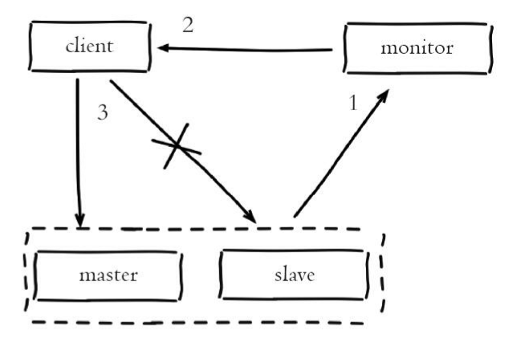
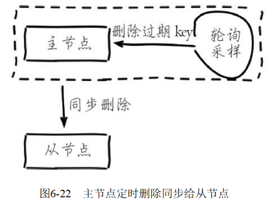
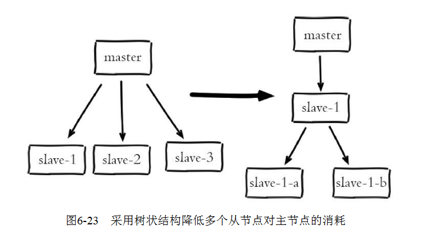

[TOC]


# 复制

在分布式系统中为了解决单点问题，通常会把数据复制多个副本部署到其他机器，满足故障恢复和负载均衡等需求。`Redis`也是如此，它为我们提供了复制功能，实现了相同数据的多个`Redis`副本。复制功能是高可用`Redis`的基础，后面章节的哨兵和集群都是在复制的基础上实现高可用的。

## 6.1 配置

### 6.1.1 建立复制

参与复制的Redis实例划分为主节点（`master`）和从节点（`slave`）。默认情况下，`Redis`都是主节点。每个从节点只能有一个主节点，而主节点可以同时具有多个从节点。复制的数据流是单向的，只能由主节点复制到从节点。配置复制的方式有以下三种：

1. 在配置文件中加入`slaveof{masterHost}{masterPort}`随`Redis`启动生效。
2. 在`redis-server`启动命令后加入`--slaveof{masterHost}{masterPort}`生效。
3. 直接使用命令：`slaveof{masterHost}{masterPort}`生效。综上所述，`slaveof`命令在使用时，可以运行期动态配置，也可以提前写到配置文件中。例如本地启动两个端口为6379和6380的`Redis`节点，在`127.0.0.1：6380`执行如下命令：`127.0.0.1:6380>slaveof 127.0.0.1 6379`

`slaveof`配置都是在从节点发起，这时6379作为主节点，6380作为从节点。复制关系建立后执行如下命令测试：

```shell
127.0.0.1:6379>set hello redis
OK
127.0.0.1:6379>get hello
"redis"
127.0.0.1:6380>get hello 
"redis"
```

运行结果中看到复制已经工作了，针对主节点6379的任何修改都可以同步到从节点6380中，复制过程如图所示：


`slaveof`本身是异步命令，执行`slaveof`命令时，节点只保存主节点信息后返回，后续复制流程在节点内部异步执行，具体细节以后会讲。主从节点复制成功建立后，可以使用`info replication`命令查看复制相关状态，如下所示。

1. 主节点6379复制状态信息：

   1. ```shell
      127.0.0.1:6379>info replication
      #Replication
      role:master
      connected_slaves:1
      slave0:ip=127.0.0.1,port=6379,state=online,offset=43,lag=0
      ....
      ```

2. 从节点6380复制状态信息：

   1. ```shell
      127.0.0.1:6380>info replication
      # Replication
      role:slave
      master_host:127.0.0.1
      master_port:6380
      master_link_status:up
      master_last_io_seconds_ago:4
      master_sync_in_progress:0
      ....
      ```


### 6.1.2 断开复制

`slaveof`命令不但可以建立复制，还可以在从节点执行`slaveof no one`来断开与主节点复制关系。例如在6380节点上执行`slaveof no one`来断开复制，如图所示。


断开复制主要流程：1）断开与主节点复制关系。2）从节点晋升为主节点。从节点断开复制后并不会抛弃原有数据，只是无法再获取主节点上的数据变化。

通过`slaveof`命令还可以实现切主操作，所谓切主是指把当前从节点对主节点的复制切换到另一个主节点。执行`slaveof{newMasterIp}{newMasterPort}`命令即可，例如把6380节点从原来的复制6379节点变为复制6381节点，如图6-3所示。


切主操作流程如下：1）断开与旧主节点复制关系。2）与新主节点建立复制关系。3）删除从节点当前所有数据。4）对新主节点进行复制操作。

### 6.1.4 只读

默认情况下，从节点使用`slave-read-only=yes`配置为只读模式。由于复制只能从主节点到从节点，对于从节点的任何修改主节点都无法感知，修改从节点会造成主从数据不一致。因此建议线上不要修改从节点的只读模式。

## 6.2 拓扑

Redis的复制拓扑结构可以支持单层或多层复制关系，根据拓扑复杂性可以分为以下三种：一主一从、一主多从、树状主从结构，下面分别介绍。

### 1.一主一从结构

一主一从结构是最简单的复制拓扑结构，用于主节点出现宕机时从节点提供故障转移支持（如图所示）。当应用写命令并发量较高且需要持久化时，可以只在从节点上开启`AOF`，这样既保证数据安全性同时也避免了持久化对主节点的性能干扰。但需要注意的是，当主节点关闭持久化功能时，如果主节点脱机要避免自动重启操作。因为主节点之前没有开启持久化功能自动重启后数据集为空，这时从节点如果继续复制主节点会导致从节点数据也被清空的情况，丧失了持久化的意义。安全的做法是在从节点上执行`slaveof no one`断开与主节点的复制关系，再重启主节点从而避免这一问题。


### 2.一主多从结构

一主多从结构（又称为星形拓扑结构）使得应用端可以利用多个从节点实现读写分离（见图）。对于读占比较大的场景，可以把读命令发送到从节点来分担主节点压力。同时在日常开发中如果需要执行一些比较耗时的读命令，如：`keys`、`sort`等，可以在其中一台从节点上执行，防止慢查询对主节点造成阻塞从而影响线上服务的稳定性。对于写并发量较高的场景，多个从节点会导致主节点写命令的多次发送从而过度消耗网络带宽，同时也加重了主节点的负载影响服务稳定性。


### 3.树状主从结构

状主从结构（又称为树状拓扑结构）使得从节点不但可以复制主节点数据，同时可以作为其他从节点的主节点继续向下层复制。通过引入复制中间层，可以有效降低主节点负载和需要传送给从节点的数据量。如图6-6所示，数据写入节点A后会同步到B和C节点，B节点再把数据同步到D和E节点，数据实现了一层一层的向下复制。当主节点需要挂载多个从节点时为了避免对主节点的性能干扰，可以采用树状主从结构降低主节点压力。


## 6.3 原理

### 6.3.1 复制过程

在从节点执行`slaveof`命令后，复制过程便开始运作，下面详细介绍建立复制的完整流程，如下图所示。从图中可以看出复制过程大致分为6个过程：


1. 保存主节点（`master`）信息。执行`slaveof`后从节点只保存主节点的地址信息便直接返回，这时建立复制流程还没有开始，在从节点6380执行`info replication`可以看到如下信息：

   ```shell
   master_host:127.0.0.1
   master_port:6379
   master_link_status:down
   ```

   从统计信息可以看出，主节点的`ip`和`port`被保存下来，但是主节点的连接状态（`master_link_status`）是下线状态。执行`slaveof`后`Redis`会打印如下日志：

   ```shell
   SLAVE OF 127.0.0.1:6379 enabled (user request from 'id=65 addr=127.0.0.1:58090     fd=5 name= age=11 idle=0 flags=N db=0 sub=0 psub=0 multi=-1 qbuf=0 qbuf-free=     32768 obl=0 oll=0 omem=0 events=r cmd=slaveof')
   ```

2. 从节点（`slave`）内部通过每秒运行的定时任务维护复制相关逻辑，当定时任务发现存在新的主节点后，会尝试与该节点建立网络连接，如图所示。

   

   **从节点会建立一个`socket`套接字，例如图6-8中从节点建立了一个端口为24555的套接字，专门用于接受主节点发送的复制命令。**

   从节点连接成功后打印如下日志：

   ```shell
   Connecting to MASTER 127.0.0.1:6379  
   MASTER <-> SLAVE sync start
   ```

   如果从节点无法建立连接，定时任务会无限重试直到连接成功或者执行`slaveof no one`取消复制，如图6-9所示。关于连接失败，可以在从节点执行`info replication`查看`master_link_down_since_seconds`指标，它会记录与主节点连接失败的系统时间。从节点连接主节点失败时也会每秒打印如下日志，方便运维人员发现问题：

   ```shell
   Error condition on socket for SYNC: {socket_error_reason}
   ```

   

3. 发送`ping`命令。连接建立成功后从节点发送`ping`请求进行首次通信，`ping`请求主要目的如下：检测主从之间网络套接字是否可用。检测主节点当前是否可接受处理命令。

   如果发送`ping`命令后，从节点没有收到主节点的`pong`回复或者超时，比如网络超时或者主节点正在阻塞无法响应命令，从节点会断开复制连接，下次定时任务会发起重连，如图6-10所示。

   

   从节点发送的`ping`命令成功返回，`Redis`打印如下日志，并继续后续复制流程：

   ```shell
   Master replied to PING, replication can continue..
   ```

4. 权限验证。如果主节点设置了`requirepass`参数，则需要密码验证，从节点必须配置`masterauth`参数保证与主节点相同的密码才能通过验证；如果验证失败复制将终止，从节点重新发起复制流程。

5. 同步数据集。主从复制连接正常通信后，对于首次建立复制的场景，主节点会把持有的数据全部发送给从节点，这部分操作是耗时最长的步骤（是全量复制，发送的是RDB文件）。`Redis`在2.8版本以后采用新复制命令`psync`进行数据同步，原来的`sync`命令依然支持，保证新旧版本的兼容性。新版同步划分两种情况：全量同步和部分同步，而老版的`sync`命令只支持全量同步，下一节将重点介绍。

6. 命令持续复制。当主节点把当前的数据同步给从节点后，便完成了复制的建立流程。接下来主节点会持续地把写命令发送给从节点，保证主从数据一致性。在命令传播阶段，除了发送写命令，主从节点还维持着心跳机制：`PING`和`REPLCONF ACK`。由于心跳机制的原理涉及部分复制，因此将在介绍了部分复制的相关内容后单独介绍该心跳机制。

   > 传输延迟
   >
   > 需要注意的是，命令传播是异步的过程，即主节点发送写命令后并不会等待从节点的回复；因此实际上主从节点之间很难保持实时的一致性，延迟在所难免。数据不一致的程度，与主从节点之间的网络状况、主节点写命令的执行频率、以及主节点中的`repl-disable-tcp-nodelay`配置等有关。`Redis`为我们提供了`repl-disable-tcp-nodelay`参数用于控制是否关闭`TCP_NODELAY`，默认关闭，说明如下：
   >
   > 1. 当关闭时，主节点产生的命令数据无论大小都会及时地发送给从节点，这样主从之间延迟会变小，但增加了网络带宽的消耗。适用于主从之间的网络环境良好的场景，如同机架或同机房部署。
   > 2. 当开启时，主节点会合并较小的`TCP`数据包从而节省带宽。默认发送时间间隔取决于`Linux`的内核，一般默认为40毫秒。这种配置节省了带宽但增大主从之间的延迟。适用于主从网络环境复杂或带宽紧张的场景，如跨机房部署。

### 6.3.2 数据同步

Redis在2.8及以上版本使用`psync`命令完成主从数据同步，同步过程分为：全量复制和部分复制。

1. 全量复制：一般用于初次复制场景，`Redis`早期支持的复制功能只有全量复制，它会把主节点全部数据一次性发送给从节点，当数据量较大时，会对主从节点和网络造成很大的开销。

2. 部分复制：用于处理在主从复制中因网络闪断等原因造成的数据丢失场景，当从节点再次连上主节点后，如果条件允许，主节点会补发丢失数据给从节点。因为补发的数据远远小于全量数据，可以有效避免全量复制的过高开销。部分复制是对老版复制的重大优化，有效避免了不必要的全量复制操作。因此当使用复制功能时，尽量采用2.8以上版本的`Redis`。`psync`命令运行需要以下三个组件支持：

   

#### 1.**主从节点**各自复制偏移量

主节点和从节点分别维护一个复制偏移量（`offset`），代表的是**主节点向从节点传递的字节数**；主节点每次向从节点传播N个字节数据时，主节点的`offset`增加N；从节点每次收到主节点传来的N个字节数据时，从节点的offset增加N。

`offset`用于判断主从节点的数据库状态是否一致：如果二者`offset`相同，则一致；如果`offset`不同，则不一致，此时可以根据两个`offset`找出从节点缺少的那部分数据。例如，如果主节点的`offset`是1000，而从节点的`offset`是500，那么部分复制就需要将`offset`为501-1000的数据传递给从节点。而`offset`为501-1000的数据存储的位置，就是等会要介绍的复制积压缓冲区。

  统计信息在`info relication`中的`master_repl_offset`指标中：

```shell
127.0.0.1:6379> info replication
# Replication
role:master
...
master_repl_offset:1055130
...
```

​	从节点（`slave`）每秒钟上报自身的复制偏移量给主节点，因此主节点也会保存从节点的复制偏移量，统计指标如下：

```shell
   127.0.0.1:6379> info replication
   role:master
   connected_slaves:1 
   slave0:ip=127.0.0.1,port=6380,state=online,offset=1055214,lag=1
   ...
```

​	从节点在接收到主节点发送的命令后，也会累加记录自身的偏移量。统计信息在`info relication`中的`slave_repl_offset`指标中：（不知道为啥从节点执行的`info replication`命令后显示的主从节点偏移量跟主节点执行`info replication`命令后显示得不一样，这篇文章以主节点执行`info replication`命令显示的数据来讨论）

   ```shell
127.0.0.1:6380> info replication
# Replication
role:slave
...
slave_repl_offset:10
...
   ```

​	复制偏移量的维护如图6-11所示。通过对比主从节点的复制偏移量，可以判断主从节点数据是否一致。


​	可以通过主节点的统计信息，计算出`master_repl_offset`-`slave_offset`字节量，判断主从节点复制相差的数据量，根据这个差值判定当前复制的健康度。如果主从之间复制偏移量相差较大，则可能是网络延迟或命令阻塞等原因引起。

#### 2. **主节点复制积压缓冲区**

​	复制积压缓冲区是保存在主节点上的一个固定长度的队列，默认大小为1MB，当主节点有连接的从节点（`slave`）时被创建，这时主节点（`master`）响应写命令时，不但会把命令发送给从节点，还会写入复制积压缓冲区，如图6-12所示。


   由于缓冲区本质上是先进先出的定长队列，所以能实现保存最近已复制数据的功能，用于部分复制和复制命令丢失的数据补救。复制缓冲区相关统计信息保存在主节点的`info replication`中：

   ```shell
127.0.0.1:6379> info replication
# Replicationrole:master
...
repl_backlog_active:1     // 开启复制缓冲区
repl_backlog_size:1048576   // 缓冲区最大长度
repl_backlog_first_byte_offset:7479 // 起始偏移量，计算当前缓冲区可用范围
repl_backlog_histlen:1048576            // 已保存数据的有效长度。
   ```

​	根据统计指标，可算出复制积压缓冲区内的可用偏移量范围：[`repl_backlog_first_byte_offset`，`repl_backlog_first_byte_offset`+`repl_backlog_histlen`]。也就是说偏移量在这个范围内的都可以从这里获取数据。

由于该缓冲区长度固定且有限，因此可以备份的写命令也有限，当主从节点offset的差距过大超过缓冲区长度时，将无法执行部分复制，只能执行全量复制。反过来说，为了提高网络中断时部分复制执行的概率，可以根据需要增大复制积压缓冲区的大小(通过配置`repl-backlog-size`)；例如如果网络中断的平均时间是60s，而主节点平均每秒产生的写命令(特定协议格式)所占的字节数为100KB，则复制积压缓冲区的平均需求为6MB，保险起见，可以设置为12MB，来保证绝大多数断线情况都可以使用部分复制。

#### 3. **主节点**运行id

每个`Redis`节点启动后都会动态分配一个40位的十六进制字符串作为运行`ID`。运行`ID`的主要作用是用来唯一识别`Redis`节点，比如从节点保存主节点的运行`ID`识别自己正在复制的是哪个主节点。如果只使用`ip+port`的方式识别主节点，那么主节点重启变更了整体数据集（如替换`RDB/AOF`文件），从节点再基于偏移量复制数据将是不安全的，因此当运行`ID`变化后从节点将做全量复制。可以运行`info server`命令查看当前节点的运行`ID`：

```shell
127.0.0.1:6379> info server
# Server
redis_version:3.0.7
...
run_id:545f7c76183d0798a327591395b030000ee6def9
...
```

需要注意的是Redis关闭再启动后，运行`ID`会随之改变，例如执行如下命令：

   ```shell
# redis-cli -p 6379 info server | grep run_idrun_id:545f7c76183d0798a327591395b030000ee6def9
# redis-cli -p shutdown
# redis-server redis-6379.conf
# redis-cli -p 6379 info server | grep run_idrun_id:2b2ec5f49f752f35c2b2da4d05775b5b3aaa57ca
   ```

  如何在不改变运行`ID`的情况下重启呢？

  当需要调优一些内存相关配置，例如：`hash-max-ziplist-value`等，这些配置需要`Redis`重新加载才能优化已存在的数据，这时可以使用`debug reload`命令重新加载`RDB`并保持运行`ID`不变，从而有效避免不必要的全量复制。命令如下：

   ```shell
# redis-cli -p 6379 info server | grep run_idrun_id:2b2ec5f49f752f35c2b2da4d05775b5b3aaa57ca
# redis-cli debug reload
OK
# redis-cli -p 6379 info server | grep run_idrun_id:2b2ec5f49f752f35c2b2da4d05775b5b3aaa57ca
   ```

  `debug reload`命令会阻塞当前`Redis`节点主线程，阻塞期间会生成本地`RDB`快照并清空数据之后再加载`RDB`文件。因此对于大数据量的主节点和无法容忍阻塞的应用场景，谨慎使用。

------

#### psync命令

`psync`命令从节点使用`psync`命令完成部分复制和全量复制功能，命令格式：`psync{runId}{offset}`，参数含义如下：`runId`：从节点所复制主节点的运行id。`offset`：当前从节点已复制的数据偏移量。

`psync`命令运行流程如图6-13所示：


1. 从节点（`slave`）发送`psync`命令给主节点，参数`runId`是当前从节点保存的主节点运行`ID`，如果没有则为默认值，参数`offset`是当前从节点保存的复制偏移量，如果是第一次参与复制则默认值为-1。
2. 主节点（`master`）根据`psync`参数和自身数据情况决定响应结果：
   1. 如果回复+`FULLRESYNC{runId}{offset}`，那么从节点将触发全量复制
   2. 如果回复`+CONTINUE`，从节点将触发部分复制流程。
   3. 如果回复`+ERR`，说明主节点版本低于Redis2.8，无法识别`psync`命令，从节点将发送旧版的`sync`命令触发全量复制流程。

### 6.3.3 全量复制

全量复制是`Redis`最早支持的复制方式，也是主从第一次建立复制时必须经历的阶段。触发全量复制的命令是`sync`和`psync`

这里主要介绍`psync`全量复制流程，它与2.8以前的`sync`全量复制机制基本一致。全量复制的完整运行流程如图6-15所示。


1. 发送`psync`命令进行数据同步，由于是第一次进行复制，从节点没有复制偏移量和主节点的运行ID，所以发送`psync-1`。

2. 主节点根据`psync-1`解析出当前为全量复制，回复`+FULLRESYNC`响应。

3. 从节点接收主节点的响应数据保存运行`ID`和偏移量`offset`，执行到当前步骤时从节点打印如下日志：

   ```shell
   Partial resynchronization not possible (no cached master)
   Full resync from master: 92d1cb14ff7ba97816216f7beb839efe036775b2:21678
   ```

4. 主节点执行`bgsave`保存`RDB`文件到本地。主节点`bgsave`相关日志如下：

   ```shell
   M * Full resync requested by slave 127.0.0.1:6380
   M * Starting BGSAVE for SYNC with target: disk
   C * Background saving started by pid 32618
   C * RDB: 0 MB of memory used by copy-on-write
   M * Background saving terminated with success
   ```

   `Redis3`.0之后在输出的日志开头会有M、S、C等标识，对应的含义是：M=当前为主节点日志，S=当前为从节点日志，C=子进程日志，我们可以根据日志标识快速识别出每行日志的角色信息。

5. 主节点发送`RDB`文件给从节点，从节点把接收的`RDB`文件保存在本地并直接作为从节点的数据文件，接收完`RDB`后从节点打印相关日志，可以在日志中查看主节点发送的数据量：

   ```shell
   16:24:03.057 * MASTER <-> SLAVE sync: receiving 24777842 bytes from master
   ```

   需要注意，对于数据量较大的主节点，比如生成的`RDB`文件超过6GB以上时要格外小心。传输文件这一步操作非常耗时，速度取决于主从节点之间网络带宽，通过细致分析`Full resync`和`MASTER<->SLAVE`这两行日志的时间差，可以算出`RDB`文件从创建到传输完毕消耗的总时间。如果总时间超过`repl-timeout`所配置的值（默认60秒），从节点将放弃接受`RDB`文件并清理已经下载的临时文件，导致全量复制失败，此时从节点打印如下日志：

   ```shell
   M 27 May 12:10:31.169 
   # Timeout receiving bulk data from MASTER
   ... 
   If the problem persists try to set the 'repl-timeout' parameter in redis.conf to a larger
   ```

   针对数据量较大的节点，建议调大`repl-timeout`参数防止出现全量同步数据超时。例如对于千兆网卡的机器，网卡带宽理论峰值大约每秒传输100MB，在不考虑其他进程消耗带宽的情况下，6GB的`RDB`文件至少需要60传输时间，默认配置下，极易出现主从数据同步超时。

6. 对于从节点开始接收`RDB`快照到接收完成期间，主节点仍然响应读写命令，因此主节点会把这期间写命令数据保存在**复制客户端缓冲区**内，当从节点加载完`RDB`文件后，主节点再把**缓冲区**内的数据发送给从节点，保证主从之间数据一致性。如果主节点创建和传输`RDB`的时间过长，对于高流量写入场景非常容易造成主节点**复制客户端缓冲区**溢出。默认配置为`client-output-buffer-limit slave256MB64MB60`，如果60秒内缓冲区消耗持续大于64MB或者直接超过256MB时，主节点将直接关闭复制客户端连接，造成全量同步失败。对应日志如下：

   ```shell
   M 27 May 12:13:33.669 # Client id=2 addr=127.0.0.1:24555 age=1 idle=1 flags=S     qbuf=0 qbuf-free=0 obl=18824 oll=21382 omem=268442640 events=r cmd=psync scheduled to be closed ASAP for overcoming of output buffer limits
   ```

   因此，运维人员需要根据主节点数据量和写命令并发量调整`client-output-buffer-limit slave`配置，避免全量复制期间**客户端缓冲区**溢出。对于主节点，当发送完所有的数据后就认为全量复制完成，打印成功日志：`Synchronization with slave127.0.0.1：6380succeeded`，但是对于从节点全量复制依然没有完成，还有后续步骤需要处理。

7. 从节点接收完主节点传送来的全部数据后会清空自身旧数据，该步骤对应如下日志：

   ```shell
   16:24:02.234 * MASTER <-> SLAVE sync: Flushing old data
   ```

8. 从节点清空数据后开始加载`RDB`文件，对于较大的`RDB`文件，这一步操作依然比较耗时，可以通过计算日志之间的时间差来判断加载`RDB`的总耗时，对应如下日志：

   ```shell
   16:24:03.578 * MASTER <-> SLAVE sync: Loading DB in memory
   16:24:06.756 * MASTER <-> SLAVE sync: Finished with success
   ```

   对于线上做读写分离的场景，从节点也负责响应读命令。如果此时从节点正出于全量复制阶段或者复制中断，那么从节点在响应读命令可能拿到过期或错误的数据。对于这种场景，`Redis`复制提供了`slave-serve-stale-data`参数，默认开启状态。如果开启则从节点依然响应所有命令。对于无法容忍不一致的应用场景可以设置no来关闭命令执行，此时从节点除了`info`和`slaveof`命令之外所有的命令只返回“`SYNC with master in progress`”信息。

9. 从节点成功加载完`RDB`后，如果当前节点开启了`AOF`持久化功能，它会立刻做`bgrewriteaof`操作(重写aof操作)，为了保证全量复制后`AOF`持久化文件立刻可用。

> 上述过程的简单版：
>
> （1）从节点判断无法进行部分复制，向主节点发送全量复制的请求；或从节点发送部分复制的请求，但主节点判断无法进行全量复制；具体判断过程需要在讲述了部分复制原理后再介绍。
>
> （2）主节点收到全量复制的命令后，执行bgsave，在后台生成RDB文件，并使用一个缓冲区（称为复制缓冲区）记录从现在开始执行的所有写命令
>
> （3）主节点的bgsave执行完成后，将RDB文件发送给从节点；从节点首先清除自己的旧数据，然后载入接收的RDB文件，将数据库状态更新至主节点执行bgsave时的数据库状态
>
> （4）主节点将前述复制缓冲区中的所有写命令发送给从节点，从节点执行这些写命令，将数据库状态更新至主节点的最新状态
>
> （5）如果从节点开启了AOF，则会触发bgrewriteaof的执行，从而保证AOF文件更新至主节点的最新状态

过分析全量复制的所有流程，读者会发现全量复制是一个非常耗时费力的操作。它的时间开销主要包括：

1. 主节点`bgsave`时间
2. `RDB`文件网络传输时间
3. 从节点清空数据时间
4. 从节点加载`RDB`的时间
5. 可能的`AOF`重写时间

例如我们线上数据量在6G左右的主节点，从节点发起全量复制的总耗时在2分钟左右。因此当数据量达到一定规模之后，由于全量复制过程中将进行多次持久化相关操作和网络数据传输，这期间会大量消耗主从节点所在服务器的`CPU`、内存和网络资源。所以除了第一次复制时采用全量复制在所难免之外，对于其他场景应该规避全量复制的发生。正因为全量复制的成本问题，`Redis`实现了部分复制功能。

### 6.3.4 部分复制

部分复制主要是`Redis`针对全量复制的过高开销做出的一种优化措施，使用`psync{runId}{offset}`命令实现。当从节点（`slave`）正在复制主节点（`master`）时，如果出现网络闪断或者命令丢失等异常情况时，从节点会向主节点要求补发丢失的命令数据，如果主节点的**复制积压缓冲区**中存在这部分数据则直接发送给从节点，这样就可以保持主从节点复制的一致性。补发的这部分数据一般远远小于全量数据，所以开销很小。部分复制的流程如图6-16所示。


1. 主从节点之间网络出现中断时，如果超过`repl-timeout`时间，主节点会认为从节点故障并中断复制连接，打印如下日志：

   ```shell
   M # Disconnecting timedout slave: 127.0.0.1:6380
   M # Connection with slave 127.0.0.1:6380 lost.
   ```

   如果此时从节点没有宕机，也会打印与主节点连接丢失日志：

   ```
   S # Connection with master lost.
   S * Caching the disconnected master state.
   ```

2. 主从连接中断期间主节点依然响应命令，但因复制连接中断命令无法发送给从节点，不过主节点内部存在的**复制积压缓冲区**，依然可以保存最近一段时间的写命令数据，默认最大缓存1MB。

3. 当主从节点网络恢复后，从节点会再次连上主节点，打印如下日志：

   ```shell
   S * Connecting to MASTER 127.0.0.1:6379
   S * MASTER <-> SLAVE sync started
   S * Non blocking connect for SYNC fired the event.
   S * Master replied to PING, replication can continue
   ...
   ```

4. 当主从连接恢复后，由于从节点之前保存了自身已复制的偏移量和主节点的运行`ID`。因此会把它们当作`psync`参数发送给主节点，要求进行部分复制操作。该行为对应从节点日志如下：

   ```shell
   S * Trying a partial resynchronization (request 2b2ec5f49f752f35c2b2da4d05775b5    b3aaa57ca:49768480)
   ```

5. 主节点接到`psync`命令后首先核对参数`runId`是否与自身一致，如果一致，说明之前复制的是当前主节点；之后根据参数`offset`在自身**复制积压缓冲区**查找，如果偏移量之后的数据存在缓冲区中，则对从节点发送`+CONTINUE`响应，表示可以进行部分复制。从节点接到回复后打印如下日志：

   ```shell
   S * Successful partial resynchronization with master.
   S * MASTER <-> SLAVE sync: Master accepted a Partial Resynchronization.
   ```

6. 主节点根据偏移量把**复制积压缓冲区**里的数据发送给从节点，保证主从复制进入正常状态。发送的数据量可以在主节点的日志获取，如下所示：

   ```shell
   M * Slave 127.0.0.1:6380 asks for synchronization
   M * Partial resynchronization request from 127.0.0.1:6380 accepted. Sending 78     bytes of backlog starting from offset 49769216
   ```

   从日志中可以发现这次部分复制只同步了78字节，传递的数据远远小于全量数据。

### 6.3.5 心跳

主从节点在建立复制后，它们之间维护着长连接并彼此发送心跳命令，如图6-17所示。


主从心跳判断机制：

1. 主从节点彼此都有心跳检测机制，各自模拟成对方的客户端进行通信，通过`client list`命令查看复制相关客户端信息，主节点的连接状态为`flags=M`，从节点连接状态为`flags=S`。
2. 主节点默认每隔10秒对从节点发送ping命令，判断从节点的存活性和连接状态。可通过参数`repl-ping-slave-period`控制发送频率。
3. 从节点在主线程中每隔1秒发送`replconf ack{offset}`命令，给主节点上报自身当前的复制偏移量。`replconf`命令主要作用如下：
   1. 实时监测主从节点网络状态。此外，在主节点中使用`info Replication`，可以看到其从节点的状态中的lag值，代表的是主节点上次收到该`REPLCONF ACK`命令的时间间隔，在正常情况下，该值应该是0或1，如下图所示：
   2. 上报自身复制偏移量，检查复制数据是否丢失，如果从节点数据丢失，再从主节点的复制缓冲区中拉取丢失数据。注意，offset和复制积压缓冲区，不仅可以用于部分复制，也可以用于处理命令丢失等情形；区别在于前者是在断线重连后进行的，而后者是在主从节点没有断线的情况下进行的。
   3. 辅助保证从节点的数量和延迟：Redis主节点中使用`min-slaves-to-write`和`min-slaves-max-lag`参数，来保证主节点在不安全的情况下不会执行写命令；所谓不安全，是指从节点数量太少，或延迟过高。例如`min-slaves-to-write`和`min-slaves-max-lag`分别是3和10，含义是如果从节点数量小于3个，或所有从节点的延迟值都大于10s，则主节点拒绝执行写命令。而这里从节点延迟值的获取，就是通过主节点接收到`REPLCONF ACK`命令的时间来判断的，即前面所说的`info Replication`中的`lag`值。

> 为了降低主从延迟，一般把Redis主从节点部署在相同的机房/同城机房，避免网络延迟和网络分区造成的心跳中断等情况。

### 6.3.6 异步复制

主节点不但负责数据读写，还负责把写命令同步给从节点。写命令的发送过程是异步完成，也就是说主节点自身处理完写命令后直接返回给客户端，并不等待从节点复制完成，如图6-18所示。


主节点复制流程：

1. 主节点6379接收处理命令。
2. 命令处理完之后返回响应结果。
3. 对于修改命令异步发送给6380从节点，从节点在主线程中执行复制的命令。

由于主从复制过程是异步的，就会造成从节点的数据相对主节点存在延迟。具体延迟多少字节，我们可以在主节点执行`info  replication`命令查看相关指标获得。如下

```
slave0:ip=127.0.0.1,port=6380,state=online,offset=841,lag=1 
master_repl_offset:8
```

在统计信息中可以看到从节点`slave0`信息，分别记录了从节点的`ip`和`port`，从节点的状态，`offset`表示当前从节点的复制偏移量，`master_repl_offset`表示当前主节点的复制偏移量，两者的差值就是当前从节点复制延迟量。`Redis`的复制速度取决于主从之间网络环境和`repl-disable-tcp-nodelay`和命令处理速度等。正常情况下，延迟在1秒以内。

## 6.4 开发与运维中的问题

理解了复制原理之后，本节我们重点分析基于复制的应用场景。通过复制机制，数据集可以存在多个副本（从节点）。这些副本可以应用于读写分离、故障转移（`failover`）、实时备份等场景。但是在实际应用复制功能时，依然有一些坑需要跳过。

### 6.4.1 读写分离

对于读占比较高的场景，可以通过把一部分读流量分摊到从节点（slave）来减轻主节点（`master`）压力，同时需要注意永远只对主节点执行写操作，如图6-19所示。


当使用从节点响应读请求时，业务端可能会遇到如下问题：复制数据延迟。读到过期数据。从节点故障。

#### 1.数据延迟

`Redis`复制数据的延迟由于异步复制特性是无法避免的，延迟取决于网络带宽和命令阻塞情况，比如刚在主节点写入数据后立刻在从节点上读取可能获取不到。需要业务场景允许短时间内的数据延迟。对于无法容忍大量延迟场景，可以编写外部监控程序监听主从节点的复制偏移量，当延迟较大时触发报警或者通知客户端避免读取延迟过高的从节点，实现逻辑如图6-20所示。



说明如下：

1. 监控程序（`monitor`）定期检查主从节点的偏移量，主节点偏移量在`info replication`的`master_repl_offset`指标记录，从节点偏移量可以查询主节点的`slave0`字段的`offset`指标，它们的差值就是主从节点延迟的字节量。
2. 当延迟字节量过高时，比如超过10MB。监控程序触发报警并通知客户端从节点延迟过高。可以采用Zookeeper的监听回调机制实现客户端通知。
3. 客户端接到具体的从节点高延迟通知后，修改读命令路由到其他从节点或主节点上。当延迟恢复后，再次通知客户端，恢复从节点的读命令请求。

这种方案的成本比较高

#### 2.读到过期数据

当主节点存储大量设置超时的数据时，如缓存数据，`Redis`内部需要维护过期数据删除策略，删除策略主要有两种：惰性删除和定时删除

1. 惰性删除：主节点每次处理读取命令时，都会检查键是否超时，如果超时则执行del命令删除键对象，之后del命令也会异步发送给从节点。需要注意的是为了保证复制的一致性，从节点自身永远不会主动删除超时数据，如图6-21所示。

   

2. 定时删除：`Redis`主节点在内部定时任务会循环采样一定数量的键，当发现采样的键过期时执行del命令，之后再同步给从节点，如图6-22所示。

   

   如果此时数据大量超时，主节点采样速度跟不上过期速度且主节点没有读取过期键的操作，那么从节点将无法收到`del`命令。这时在从节点上可以读取到已经超时的数据。`Redis`在3.2版本解决了这个问题，从节点读取数据之前会检查键的过期时间来决定是否返回数据，可以升级到3.2版本来规避这个问题。

#### 3.从节点故障问题

对于从节点的故障问题，需要在客户端维护可用从节点列表，当从节点故障时立刻切换到其他从节点或主节点上。

### 6.4.2 主从配置不一致

主从配置不一致是一个容易忽视的问题。对于有些配置主从之间是可以不一致，比如：主节点关闭`AOF`在从节点开启。但对于内存相关的配置必须要一致，比如`maxmemory`，`hash-max-ziplist-entries`等参数。当配置的`maxmemory`从节点小于主节点，如果复制的数据量超过从节点`maxmemory`时，它会根据`maxmemory-policy`策略进行内存溢出控制，此时从节点数据已经丢失，但主从复制流程依然正常进行，复制偏移量也正常。修复这类问题也只能手动进行全量复制。当压缩列表相关参数不一致时，虽然主从节点存储的数据一致但实际内存占用情况差异会比较大。

### 6.4.3 规避全量复制

1. 第一次建立复制，由于是第一次建立复制，从节点不包含任何主节点数据，因此必须进行全量复制才能完成数据同步。
2. 节点运行`ID`不匹配：当主从复制关系建立后，从节点会保存主节点的运行`ID`，如果此时主节点因故障重启，那么它的运行`ID`会改变，从节点发现主节点运行`ID`不匹配时，会认为自己复制的是一个新的主节点从而进行全量复制。对于这种情况应该从架构上规避，比如提供故障转移功能。
3. 复制积压缓冲区不足：当主从节点网络中断后，从节点再次连上主节点时会发送`psync{offset}{runId}`命令请求部分复制，如果请求的偏移量不在主节点的积压缓冲区内，则无法提供给从节点数据，因此部分复制会退化为全量复制。针对这种情况需要根据网络中断时长和写命令数据量分析出合理的积压缓冲区大小。网络中断一般有闪断、机房割接、网络分区等情况。这时网络中断的时长一般在分钟级（`net_break_time`）。写命令数据量可以统计高峰期主节点每秒`info replication`的`master_repl_offset`（这个参数的是主节点的偏移量）差值获取（`write_size_per_minute`）。积压缓冲区默认为1MB，对于大流量场景显然不够，这时需要增大积压缓冲区，保证`repl_backlog_size`>`net_break_time`*`write_size_per_minute`，从而避免因复制积压缓冲区不足造成的全量复制。（`repl_backlog_size`这个参数在复制积压缓冲区那里讲到过。）

### 6.4.4 规避复制风暴

复制风暴是指大量从节点对同一主节点或者对同一台机器的多个主节点短时间内发起全量复制的过程。复制风暴对发起复制的主节点或者机器造成大量开销，导致`CPU`、内存、带宽消耗。因此我们应该分析出复制风暴发生的场景，提前采用合理的方式规避。规避方式有如下几个。

#### 1.单主节点复制风暴

单主节点复制风暴一般发生在主节点挂载多个从节点的场景。当主节点重启恢复后，从节点会发起全量复制流程，这时主节点就会为从节点创建`RDB`快照，如果在快照创建完毕之前，有多个从节点都尝试与主节点进行全量同步，那么其他从节点将共享这份`RDB`快照。这点`Redis`做了优化，有效避免了创建多个快照。但是，同时向多个从节点发送`RDB`快照，可能使主节点的网络带宽消耗严重，造成主节点的延迟变大，极端情况会发生主从节点连接断开，导致复制失败。

解决方案首先可以减少主节点（`master`）挂载从节点（`slave`）的数量，或者采用树状复制结构，加入中间层从节点用来保护主节点，如图6-23所示。



从节点采用树状树非常有用，网络开销交给位于中间层的从节点，而不必消耗顶层的主节点。但是这种树状结构也带来了运维的复杂性，增加了手动和自动处理故障转移的难度。

#### 2.单机器复制风暴

由于Redis的单线程架构，通常单台机器会部署多个Redis实例。当一台机器（`machine`）上同时部署多个主节点（`master`）时，如图6-24所示。


如果这台机器出现故障或网络长时间中断，当它重启恢复后，会有大量从节点（slave）针对这台机器的主节点进行全量复制，会造成当前机器网络带宽耗尽。如何避免？方法如下：

- 应该把主节点尽量分散在多台机器上，避免在单台机器上部署过多的主节点。
- 当主节点所在机器故障后提供故障转移机制，避免机器恢复后进行密集的全量复制。

