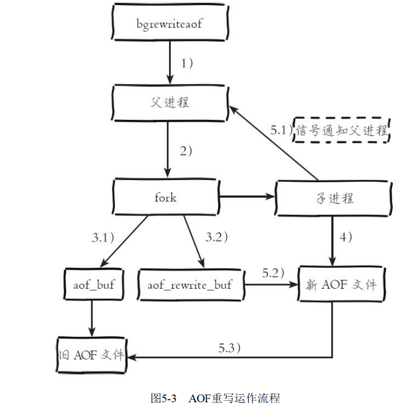
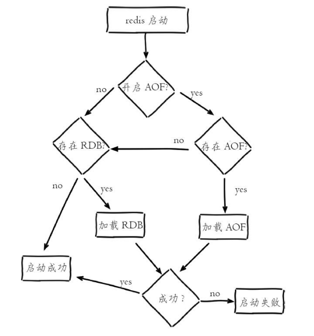

## 5.1 RDB

`RDB`持久化是把当前进程数据生成快照保存到硬盘的过程，触发`RDB`持久化过程分为手动触发和自动触发。

### 5.1.1 触发机制

手动触发分别对应`save`和`bgsave`命令：

- `save`命令：阻塞当前`Redis`服务器，直到`RDB`过程完成为止，对于内存比较大的实例会造成长时间阻塞，线上环境不建议使用。运行save命令对应的Redis日志如下：`DB saved on disk`

- `bgsave`命令：`Redis`进程执行`fork`操作创建子进程，`RDB`持久化过程由子进程负责，完成后自动结束。阻塞只发生在`fork`阶段，一般时间很短。运行`bgsave`命令对应的Redis日志如下：

  - ```properties
    Background saving started by pid 3151
    DB saved on disk
    RDB: 0 MB of memory used by copy-on-write
    Background saving terminated with success
    ```

显然`bgsave`命令是针对`save`阻塞问题做的优化。因此`Redis`内部所有的涉及`RDB`的操作都采用`bgsave`的方式，而`save`命令已经废弃。

------

除了执行命令手动触发之外，`Redis`内部还存在自动触发`RDB`的持久化机制，例如以下场景：

- 如果从节点执行全量复制操作，那么主节点自动执行`bgsave`生成`RDB`文件发送给从节点。（以后将复制的时候会讲到）。
- 执行`debug reload`命令重新加载`Redis`时，也会自动触发`save`操作。
- 默认情况下执行`shutdown`命令时，如果没有开启`AOF`持久化功能则自动执行`bgsave`。

### 5.1.2 bgsave执行流程


1. 执行`bgsave`命令之后，`Redis`父进程会判断是否有正在执行的`RDB/AOF`子进程正在执行，如果发现了有，则`bgsave`命令直接返回。
2. 父进程执行`fork`操作创建子进程，`fork`命令执行成果中父进程会阻塞。
3. 父进程`fork`完成后，`bgsave`命令返回“`Background saving started`”信息并不再阻塞父进程，可以继续响应其他命令。
4. 子进程会创建`RDB`文件，根据父进程内存生成**临时快照文件**，完成后对原有文件进行替换。
5. 进程发送信号给父进程表示完成，父进程更新统计信息。

### 5.1.3 RDB文件的处理

**保存**：`RDB`文件保存在配置文件中的`dir`配置指定的目录下，文件名通过配置文件中的`dbfilename`配置指定。可以通过执行`config set dir{newDir}`和`config setdbfilename{newFileName}`命令在运行期动态执行，当下次运行时`RDB`文件会保存到新目录。

**压缩**：`Redis`默认采用`LZF`算法对生成的`RDB`文件做压缩处理，压缩后的文件远远小于内存大小，默认开启，可以通过参数`config setrdbcompression{yes|no}`动态修改。虽然压缩`RDB`会消耗`CPU`，但可大幅降低文件的体积，方便保存到硬盘或通过网络发送给从节点，因此线上建议开启。

**校验**：如果`Redis`加载损坏的`RDB`文件时拒绝启动，并打印如下日志：`# Short read or OOM loading DB. Unrecoverable error, aborting now`，这时可以使用`Redis`提供的`redis-check-dump`工具检测`RDB`文件并获取对应的错误报告。

### 5.1.4 RDB的优缺点

`RDB`的优点：

- `RDB`是一个紧凑压缩的二进制文件，代表`Redis`在某个时间点上的数据快照。非常适用于备份，全量复制等场景。比如每6小时执行`bgsave`备份，并把`RDB`文件拷贝到远程机器或者文件系统中（如`hdfs`），用于灾难恢复。
- `Redis`加载`RDB`恢复数据远远快于`AOF`的方式。

`RDB`的缺点：

- `RDB`方式数据没办法做到实时持久化/秒级持久化。因为`bgsave`每次运行都要执行fork操作创建子进程，属于重量级操作，频繁执行成本过高。
- RDB文件使用特定二进制格式保存，Redis版本演进过程中有多个格式的RDB版本，存在老版本Redis服务无法兼容新版RDB格式的问题。

## 5.2 AOF

`AOF`（append only file）持久化：以独立日志的方式记录每次写命令，重启时再重新执行`AOF`文件中的命令达到恢复数据的目的。目前已经是`Redis`持久化的主流方式。

### 5.2.1 使用AOF

开启AOF功能需要在配置文件配置：`appendonly yes`，默认不开启。`AOF`文件名通过`appendfilename`配置设置，默认文件名是`appendonly.aof`。保存路径同`RDB`持久化方式一致，通过`dir`配置指定。`AOF`的工作流程操作：命令写入（`append`）、文件同步（`sync`）、文件重写（`rewrite`）、重启加载（`load`）


1. 所有的写入命令会追加到`aof_buf`（缓冲区）中。
2. `AOF`缓冲区根据对应的策略向硬盘做同步动作。
3. 随着`AOF`文件越来越大，需要定期对`AOF`文件进行重写，达到压缩的目的。
4. 当`Redis`服务器重启时，可以加载`AOF`文件进行数据恢复。

了解AOF工作流程之后，下面针对每个步骤做详细介绍。

### 5.2.2 命令写入

`AOF`命令写入的内容直接是文本协议格式。例如`set hello world`这条命令，在`AOF`缓冲区会追加如下文本：`3\r\n$3\r\nset\r\n$5\r\nhello\r\n$5\r\nworld\r\n` 

下面介绍关于`AOF`的两个疑惑：

1. `AOF`为什么直接采用文本协议格式？可能的理由如下：
   1. 文本协议具有很好的兼容性
   2. 开启`AOF`之后，所有的命令都是用文本协议格式进行追加操作，避免了二次处理开销
   3. 文本协议具有可读性，可以直接查看与修改
2. `AOF`为什么把命令追加到`aof_buf`中？
   1. Redis使用单线程响应命令，如果每次写`AOF`文件命令都直接追加到硬盘，那么性能完全取决于当前硬盘负载。先写入缓冲区`aof_buf`中，还有另一个好处，`Redis`可以提供多种缓冲区同步硬盘的策略，在性能和安全性方面做出平衡。

### 5.2.3 文件同步

我们接着刚刚提到的缓冲区同步硬盘策略，`Redis`提供了多种`AOF`缓冲区同步文件策略，由参数`appendfsync`控制，不同值的含义如下表所示：


1. 配置为`always`时，每次写入都要同步`AOF`文件，在一般的`SATA`硬盘上，`Redis`只能支持大约几百`TPS`写入，显然跟`Redis`高性能特性背道而驰，不建议配置。
2. 配置为`no`，由于操作系统每次同步`AOF`文件的周期不可控，而且会加大每次同步硬盘的数据量，虽然提升了性能，但数据安全性无法保证。
3. 配置为`everysec`，是建议的同步策略，也是默认配置，做到兼顾性能和数据安全性。理论上只有在系统突然宕机的情况下丢失1秒的数据。

> 系统调用`write`和`fsync`说明：
>
> - `write`操作会触发延迟写（`delay write`）机制，就事`Linux`在内核提供页缓冲区用来提高硬盘`IO`性能。`write`操作写入这个页缓冲区之后就直接返回了，认为完成了这次的`write`操作，但是这个实际还没有真正地写到硬盘上，同步硬盘操作依赖于系统调度机制，例如：缓冲区页空间写满或达到特定时间周期。同步文件到硬盘之前，如果此时系统故障宕机，缓冲区内数据将丢失。
> - `fsync`针对单个文件操作（比如`AOF`文件），做强制硬盘同步，`fsync`将阻塞直到写入硬盘完成后返回，保证了数据持久化。


### 5.2.4 重写机制

随着命令不断写入`AOF`，文件会越来越大，为了解决这个问题，`Redis`引入`AOF`重写机制压缩文件体积。`AOF`文件重写是把`Redis`进程内的数据转化为写命令同步到新`AOF`文件的过程。

重写后的`AOF`文件为什么可以变小？有如下原因：

1. 进程内已经超时的数据不再写入文件。
2. 旧的`AOF`文件含有无效命令，如`del key1`、`hdel key2`、`srem keys`、`seta111`、`set a222`等。重写使用进程内数据直接生成，这样新的`AOF`文件只保留最终数据的写入命令。
3. 多条写命令可以合并为一个，如：`lpush list a`、`lpush list b`、`lpush list c`可以转化为：`lpush list a b c`。为了防止单条命令过大造成客户端缓冲区溢出，对于list、set、hash、zset等类型操作，以64个元素为界拆分为多条。`AOF`重写降低了文件占用空间，除此之外，另一个目的是：更小的`AOF`文件可以更快地被`Redis`加载。

`AOF`重写过程可以手动触发和自动触发：·手动触发：直接调用`bgrewriteaof`命令。自动触发：根据`auto-aof-rewrite-min-size`（表示运行AOF重写时文件最小体积，默认为64MB）和`auto-aof-rewrite-percentage`（代表当前`AOF`文件空间（`aof_current_size`）和上一次重写后`AOF`文件空间（`aof_base_size`）的比值。）参数确定自动触发时机。

自动触发时机=`aof_current_size`>`auto-aof-rewrite-min-size`&&（`aof_current_size-aof_base_size`）/`aof_base_size`>=`auto-aof-rewrite-percentage`其中`aof_current_size`和`aof_base_size`可以在`info Persistence`统计信息中查看。

当触发`AOF`重写时，内部做了哪些事呢？



1. 执行`AOF`重写请求。如果当前进程正在执行AOF重写，请求不执行并返回如下响应：`ERR Background append only file rewriting already in progress`；如果当前进程正在执行`bgsave`操作，重写命令延迟到`bgsave`完成之后再执行，返回如下响应：`Background append only file rewriting scheduled`
2. 父进程执行`fork`创建子进程，开销等同于`bgsave`过程。
3. 
   1. 主进程`fork`操作完成后，继续响应其他命令。所有修改命令依然写入`AOF`缓冲区并根据`appendfsync`策略同步到**硬盘**，保证原有`AOF`机制正确性。
   2. 由于`fork`操作运用写时复制技术，子进程只能共享`fork`操作时的内存数据。由于父进程依然响应命令，`Redis`使用“`AOF`**重写缓冲区(aof_rewrite_buf)**”保存这部分新数据，防止新`AOF`文件生成期间丢失这部分数据。
4. 子进程根据内存快照，按照命令合并规则写入到新的`AOF`文件。每次批量写入硬盘数据量由配置`aof-rewrite-incremental-fsync`控制，默认为32MB，防止单次刷盘数据过多造成硬盘阻塞。
5. 
   1. 新`AOF`文件写入完成后，子进程发送信号给父进程，父进程更新统计信息，具体见`info persistence`下的`aof_*`相关统计。
   2. 父进程把`AOF`**重写缓冲区(aof_rewrite_buf)**的数据写入到新的`AOF`文件。
   3. 使用新`AOF`文件替换老文件，完成`AOF`重写。

### 5.2.5 重启加载

`AOF`和`RDB`文件都可以用于服务器重启时的数据恢复



流程说明：