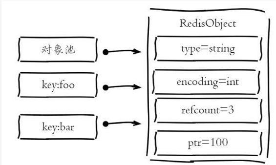

## 1. 数据结构和内部编码

type命令实际返回的就是当前键对应的value（值对象）的数据结构类型，它们分别是：string（字符串）、hash（哈希）、list（列表）、set（集合）、zset（有序集合），但这些只是Redis对外的数据结构，如图所示：

> **在Redis中，键和值都是一个对象，键总是一个字符串对象，而值可以是字符串、列表、集合等对象，所以我们通常说键为字符串键，表示这个键对应的值为字符串对象，我们说一个键为集合键时，表示这个键对应的值为集合对象**


实际上每种数据结构都有自己底层的内部编码实现，而且是多种实现，这样Redis会在合适的场景选择合适的内部编码，如下图所示：


可以看到每种数据结构都有两种以上的内部编码实现，例如list数据结构包含了linkedlist和ziplist两种内部编码。同时有些内部编码，例如ziplist，可以作为多种外部数据结构的内部实现，可以通过`object encoding`命令查询内部编码：

```shell
127.0.0.1:6379> object encoding hello
"embstr"
127.0.0.1:6379> object encoding mylist
"ziplist"
```

可以看到键hello对应值对象的内部编码是embstr，键mylist对应值对象的内部编码是ziplist。

Redis这样设计有两个好处：

1. 可以改进内部编码，而对外的数据结构和命令没有影响，这样一旦开发出更优秀的内部编码，无需改动外部数据结构和命令，例如Redis3.2提供了quicklist，结合了ziplist和linkedlist两者的优势，为列表类型提供了一种更为优秀的内部编码实现，而对外部用户来说基本感知不到。
2. 多种内部编码实现可以在不同场景下发挥各自的优势，例如ziplist比较节省内存，但是在列表元素比较多的情况下，性能会有所下降，这时候Redis会根据配置选项将列表类型的内部实现转换为linkedlist。

## 2. Redis构建的类型系统

### 2.1 redisObject对象

 Redis内部使用一个redisObject对象来表示所有的key和value，每次在Redis数据块中创建一个键值对时，**一个是键对象，一个是值对象，而Redis中的每个对象都是由redisObject结构来表示**。

**在Redis中，键总是一个字符串对象，而值可以是字符串、列表、集合等对象，所以我们通常说键为字符串键，表示这个键对应的值为字符串对象，我们说一个键为集合键时，表示这个键对应的值为集合对象。**

redisobject最主要的信息：

```c
redisobject源码
typedef struct redisObject{
     //类型
     unsigned type:4;
     //编码
     unsigned encoding:4;
     //指向底层数据结构的指针
     void *ptr;
     //引用计数
     int refcount;
     //记录最后一次被程序访问的时间
     unsigned lru:22;
}robj
```

1. `type`字段：表示当前对象使用的数据类型，Redis主要支持5种数据类型：string、hash、list、set、zset。可以使用type{key}命令查看对象所属类型，type命令返回的是**值对象**类型，键都是string类型。
2. `encoding`字段：表示Redis内部编码类型，encoding在Redis内部使用，代表当前对象内部采用哪种数据结构实现。可以使用` object encoding {key}`命令查看对象所属的类型对应的内部数据结构。
3. `lur`字段：记录对象最后一次被访问的时间，当配置了`maxmemory`和`maxmemory-policy=volatile-lru`或者`allkeys-lru`时，用于辅助LRU算法删除键数据。可以使用`object idletime{key}`命令在不更新lru字段情况下查看当前键的空闲时间。
4. `refcount`字段：记录当前对象被引用的次数，用于通过引用次数回收内存，当refcount=0时，可以安全回收当前对象空间。使用`object refcount{key}`获取当前对象引用。
5. `ptr`字段：与对象的数据内容相关，如果是整数，直接存储数据；否则表示指向数据的指针。Redis在3.0之后对值对象是字符串且长度<=39字节的数据，内部编码为embstr类型，字符串sds和redisObject一起分配，从而只要一次内存操作即可。


### 2.2 命令的类型检查和多态

#### Redis命令分类

- 一种是只能用于对应数据类型的命令，例如`LPUSH`和`LLEN`只能用于列表键， `SADD` 和 `SRANDMEMBER`只能用于集合键。
- 另一种是可以用于任何类型键的命令。比如`TTL`。

当执行一个处理数据类型的命令时，Redis执行以下步骤：

- 根据给定 `key` ，在数据库字典中查找和它相对应的 `redisObject` ，如果没找到，就返回 `NULL` 。
- 检查 `redisObject` 的 `type` 属性和执行命令所需的类型是否相符，如果不相符，返回类型错误。
- 根据 `redisObject` 的 `encoding` 属性所指定的编码，选择合适的操作函数来处理底层的数据结构。
- 返回数据结构的操作结果作为命令的返回值。

## 3. 5种数据类型对应的编码和数据结构

### 3.1 string

**string 是最常用的一种数据类型，普通的key/value存储都可以归结为string类型，value不仅是string，也可以是数字。其他几种数据类型的构成元素也都是字符串，注意Redis规定字符串的长度不能超过512M**

- 编码 **字符串对象的编码可以是int raw embstr**

  - int编码
    - 保存的是可以用long类型表示的整数值
  - raw编码
    - 保存长度大于44字节的字符串
  - embstr编码
    - 保存长度小于44字节的字符串

  int用来保存整数值，raw用来保存长字符串，embstr用来保存短字符串。embstr编码是用来专门保存短字符串的一种优化编码。  

  Redis中对于浮点型也是作为字符串保存的，在需要时再将其转换成浮点数类型 

- 编码的转换

  - 当 int 编码保存的值不再是整数，或大小超过了long的范围时，自动转化为raw 
  - 对于 embstr 编码，由于 Redis 没有对其编写任何的修改程序（embstr 是只读的），在对embstr对象进行修改时，都会先转化为raw再进行修改，因此，只要是修改embstr对象，修改后的对象一定是raw的，无论是否达到了44个字节。

- 常用命令

  - set/get

    - set:设置key对应的值为string类型的value （多次set name会覆盖）
    - get:获取key对应的值

  - mset /mget  

    - mset 批量设置多个key的值，如果成功表示所有值都被设置，否则返回0表示没有任何值被设置
    - mget批量获取多个key的值，如果不存在则返回null

    ```shell
    127.0.0.1:6379> mset user1:name redis user1:age 22
    OK
    127.0.0.1:6379>  mget user1:name user1:age
    1) "redis"
    2) "22"
    ```

- - - 应用场景
      - 类似于哈希操作，存储对象
  - incr && incrby<原子操作>
    - incr对key对应的值进行加加操作，并返回新的值，incrby加指定的值
  - decr && decrby<原子操作>
    - decr对key对应的值进行减减操做，并返回新的值，decrby减指定的值
  - setnx <小小体验一把分布式锁，真香>
    - 设置Key对应的值为string类型的值，如果已经存在则返回0
  - setex                
    - 设置key对应的值为string类型的value，并设定有效期
  - setrange/getrange 
    - setrange从指定位置替换字符串
    - getrange获取key对应value子字符串
- 其他命令
  - msetnx 同mset，不存在就设置，不会覆盖已有的key
  - getset 设置key的值，并返回key旧的值
  - append 给指定的key的value追加字符串，并返回新字符串的长度  
  - strlen 返回key对应的value字符串的长度
- 应用场景
  - 因为string类型是二进制安全的，可以用来存放图片，视频等内容。
  - 由于redis的高性能的读写功能，而string类型的value也可以是数字，可以用做计数器（使用INCR，DECR指令）。比如分布式环境中统计系统的在线人数，秒杀等。
  - 除了上面提到的，还有用于SpringSession实现分布式session
  - 分布式系统全局序列号 

### 3.2 list

**list列表,它是简单的字符串列表，你可以添加一个元素到列表的头部，或者尾部**。

- 编码

  - 列表对象的编码可以是ziplist（压缩列表）和linkedlist（双端链表）。
  - 编码转换
    - 同时满足下面两个条件时使用压缩列表：
      - 列表保存元素个数小于512个
      - 每个元素长度小于64字节
    - 不能满足上面两个条件使用linkedlist（双端列表）编码    

- 常用命令

  - lpush： 从头部加入元素

  ```shell
  127.0.0.1:6379> lpush list1 hello
  (integer) 1
  127.0.0.1:637 9> lpush list1 world
  (integer) 2
  127.0.0.1:6379> lrange list1 0 -1
  1) "world"
  2) "hello"
  ```
  - rpush：从尾部加入元素

    ```shell
    127.0.0.1:6379> rpush list2 world
    (integer) 1
    127.0.0.1:6379> rpush list2 hello
    (integer) 2
    127.0.0.1:6379> lrange list2 0 -1
    1) "world"
    2) "hello"
    ```

  - lpop： 从list的头部删除元素，并返回删除的元素

    ```shell
    127.0.0.1:6379> lrange list1 0 -1
    1) "world"
    2) "hello"
    127.0.0.1:6379> lpop list1
    "world"
    127.0.0.1:6379> lrange list1 0 -1
    1) "hello"
    ```

  - rpop：从list的尾部删除元素，并返回删除的元素

    ```shell
    127.0.0.1:6379> lrange list2 0 -1
    1) "hello"
    2) "world"
    127.0.0.1:6379> rpop list2
    "world"
    127.0.0.1:6379> lrange list2 0 -1
    1) "hello"
    ```

  - rpoplpush: 第一步从尾部删除元素，第二步从首部插入元素  结合着使用

  - linsert :插入方法   linsert listname before [集合的元素] [插入的元素]

    ```shell
    127.0.0.1:6379> lpush list3 hello 
    (integer) 1
    127.0.0.1:6379> lpush list3 world
    (integer) 2
    127.0.0.1:6379> linsert list3 before hello start
    (integer) 3
    127.0.0.1:6379> lrange list3 0 -1
    1) "world"
    2) "start"
    3) "hello"
    ```

  - lset ：替换指定下标的元素 

    ```shell
    127.0.0.1:6379> lrange list1 0 -1 
    1) "a" 
    2) "b" 
    127.0.0.1:6379> lset list1 0 v 
    OK 
    127.0.0.1:6379> lrange list1 0 -1 
    1) "v"
    2) "b"
    ```

  - lrm : 删除元素，返回删除的个数

    ```shell
    127.0.0.1:6379> lrange list1 0 -1
    1) "b"
    2) "b"
    3) "a"
    4) "b"
    127.0.0.1:6379> lrange list1 0 -1
    1) "a"
    2) "b"
    ```

  - lindex：返回list中指定位置的元素

  - llen：返回list中的元素的个数		

- 实现数据结构
  - Stack（栈）
    - LPUSH+LPOP
  - Queue（队列）
    - LPUSH + RPOP
  - Blocking MQ（阻塞队列）
    - LPUSH+BRPOP
- 应用场景
  - 实现简单的消息队列
  - 利用LRANGE命令，实现基于Redis的分页功能

### 3.3 set

**集合对象set是string类型（整数也会转成string类型进行存储）的无序集合。注意集合和列表的区别：集合中的元素是无序的，因此不能通过索引来操作元素；集合中的元素不能有重复。**

- 编码

  - 集合对象的编码可以是`intset`或者`hashtable`
    - `intset`（整数集合）：当集合中的元素都是整数且元素个数小于`set-max-intset-entries`配置（默认512个）时，Redis会选用`intset`来作为集合的内部实现，从而减少内存的使用。
    - `hashtable`编码的集合对象使用字典作为底层实现，字典的每个键都是一个字符串对象，这里的每个字符串对象就是一个集合中的元素，而字典的值全部设置为null。**当使用HT编码时，Redis中的集合SET相当于Java中的HashSet，内部的键值对是无序的，唯一的。内部实现相当于一个特殊的字典，字典中所有value都是NULL。**
  - 编码转换
    - 当集合满足下列两个条件时，使用intset编码：
      - 集合对象中的所有元素都是整数
      - 集合对象所有元素数量不超过512   

- 常用命令

  - sadd： 向集合中添加元素 （set不允许元素重复）
  - smembers： 查看集合中的元素

  ```shell
  127.0.0.1:6379> sadd set1 aaa
  (integer) 1
  127.0.0.1:6379> sadd set1 bbb
  (integer) 1
  127.0.0.1:6379> sadd set1 ccc
  (integer) 1
  127.0.0.1:6379> smembers set1 
  1) "aaa"
  2) "ccc"
  3) "bbb"
  ```

- srem： 删除集合元素
- spop： 随机返回删除的key
- sdiff ：返回两个集合的不同元素 （哪个集合在前就以哪个集合为标准）

```shell
127.0.0.1:6379> smembers set1
1) "ccc"
2) "bbb"
127.0.0.1:6379> smembers set2
1) "fff"
2) "rrr"
3) "bbb"
127.0.0.1:6379> sdiff set1 set2
1) "ccc"
127.0.0.1:6379> sdiff set2 set1
1) "fff"
2) "rrr"
```

- sinter： 返回两个集合的交集
- sinterstore： 返回交集结果，存入目标集合

```shell
127.0.0.1:6379> sinterstore set3 set1 set2
(integer) 1
127.0.0.1:6379> smembers set3
1) "bbb"
```

- sunion：  取两个集合的并集
- sunionstore：  取两个集合的并集，并存入目标集合
- smove： 将一个集合中的元素移动到另一个集合中
- scard： 返回集合中的元素个数
- sismember： 判断某元素是否存在某集合中，0代表否 1代表是
- srandmember： 随机返回一个元素

```shell
127.0.0.1:6379> srandmember set1 1
1) "bbb"
127.0.0.1:6379> srandmember set1 2
1) "ccc"
2) "bbb"
```

- 应用场景
  - 对于 set 数据类型，由于底层是字典实现的，查找元素特别快，另外set 数据类型不允许重复，利用这两个特性我们可以进行全局去重，比如在用户注册模块，判断用户名是否注册；微信点赞，微信抽奖小程序
  - 另外就是利用交集、并集、差集等操作，可以计算共同喜好，全部的喜好，自己独有的喜好，可能认识的人等功能。

### 3.4 zset

**和集合对象相比，有序集合对象是有序的。与列表使用索引下表作为排序依据不同，有序集合为每一个元素设置一个分数（score）作为排序依据。**

- 编码

  - 有序集合的编码可以使ziplist或者skiplist

    - ziplist编码的有序集合对象使用压缩列表作为底层实现，每个集合元素使用两个紧挨在一起的压缩列表节点来保存，第一个节点保存元素的成员，第二个节点保存元素的分值。并且压缩列表内的集合元素按分值从小到大的顺序进行排列，小的放置在靠近表头的位置，大的放置在靠近表尾的位置。
    - skiplist编码的有序集合对象使用zset结构作为底层实现，一个zset结构同时包含一个字典和一个跳跃表。
    - skiplist和ziplist实现的具体不同可以参考[这里](https://blog.csdn.net/mytt_10566/article/details/94664942)。

    ```c
    typedef struct zset{
     //跳跃表
    zskiplist *zsl;
    //字典
    dict *dice;
    }zset
    //字典的键保存元素的成员，字典的值保存元素的分值，跳跃表节点的object属性保存元素的成员，跳跃表节点的score属性保存元素的分值。这两种数据结构会通过指针来共享相同元素的成员和分值，所以不会产生重复成员和分值，造成内存的浪费。
    ```

- 编码转换
  - 当有序结合对象同时满足以下两个条件时，对象使用ziplist编码，否则使用skiplist编码
    - 保存的元素数量小于128
    - 保存的所有元素长度都小于64字节

常用命令 

- zrem： 删除集合中名称为key的元素member
- zincrby： 以指定值去自动递增
- zcard： 查看元素集合的个数
- zcount： 返回score在给定区间中的数量

```shell
127.0.0.1:6379> zrange zset 0 -1
1) "one"
2) "three"
3) "two"
4) "four"
5) "five"
6) "six"
127.0.0.1:6379> zcard zset
(integer) 6
127.0.0.1:6379> zcount zset 1 4
(integer) 4
```

- zrangebyscore：  找到指定区间范围的数据进行返回

```shell
127.0.0.1:6379> zrangebyscore zset 0 4 withscores 
1) "one"
2) "1"
3) "three"
4) "2"
5) "two"
6) "2"
7) "four"
8) "4"
```

- zremrangebyrank zset from to：  删除索引

```shell
127.0.0.1:6379> zrange zset 0 -1
1) "one"
2) "three"
3) "two"
4) "four"
5) "five"
6) "six"
127.0.0.1:6379> zremrangebyrank zset 1 3
(integer) 3
127.0.0.1:6379> zrange zset 0 -1
1) "one"
2) "five"
3) "six"
```

- zremrangebyscore zset from to： 删除指定序号

```shell
127.0.0.1:6379> zrange zset 0 -1 withscores
1) "one"
2) "1"
3) "five"
4) "5"
5) "six"
6) "6"
127.0.0.1:6379> zremrangebyscore zset 3 6
(integer) 2
127.0.0.1:6379> zrange zset 0 -1 withscores
1) "one"
2) "1"
```

- - zrank： 返回排序索引 （升序之后再找索引）
  - zrevrank：  返回排序索引 （降序之后再找索引）
- 应用场景
  - 对于 zset 数据类型，有序的集合，可以做范围查找，排行榜应用，取 TOP N 操作等。

### 3.5 hash

**hash对象的键是一个字符串类型，值是一个键值对集合**

- 编码

  - hash对象的编码可以是ziplist或者hashtable
    - 当使用ziplist，也就是压缩列表作为底层实现时，新增的键值是保存到压缩列表的表尾。
    - hashtable 编码的hash表对象底层使用字典数据结构，哈希对象中的每个键值对都使用一个字典键值对。**Redis中的字典相当于Java里面的HashMap，内部实现也差不多类似，都是通过“数组+链表”的链地址法来解决哈希冲突的，这样的结构吸收了两种不同数据结构的优点。**
  - 编码转换
    - 当同时满足下面两个条件使用ziplist编码，否则使用hashtable编码
      - 列表保存元素个数小于512个
      - 每个元素长度小于64字节   

- hash是一个String类型的field和value之间的映射表

- Hash特别适合存储对象

- 所存储的成员较少时数据存储为zipmap,当成员数量增大时会自动转成真正的HashMap，此时encoding为ht

- Hash命令详解

  - hset/hget

    - hset hashname hashkey hashvalue
    - hget hashname hashkey

    ```shell
    127.0.0.1:6379> hset user id 1
    (integer) 1
    127.0.0.1:6379> hset user name z3
    (integer) 1
    127.0.0.1:6379> hset user add shanxi
    (integer) 1
    127.0.0.1:6379> hget user id
    "1"
    127.0.0.1:6379> hget user name
    "z3"
    127.0.0.1:6379> hget user add
    "shanxi"
    ```

  - hmset/hmget

    - hmset hashname hashkey1hashvalue1 hashkey2 hashvalue2  hashkey3 hashvalue3

    - hget hashname hashkey1 hashkey2 hashkey3

      ```shell
      127.0.0.1:6379> hmset user id 1 name z3 add shanxi
      OK
      127.0.0.1:6379> hmget user id name add
      1) "1"
      2) "z3"
      3) "shanxi"
      ```

  - hsetnx/hgetnx

  - hincrby/hdecrby

    ```shell
      127.0.0.1:6379> hincrby user2 id 3   
      (integer) 6  
      127.0.0.1:6379> hget user2 id  
      "6"
    ```

    - hexist 判断是否存在key，不存在返回0

  - hlen 返回hash集合里所有的键值数

    ```shell
      127.0.0.1:6379> hmset user3 id 3 name w5   OK   
      127.0.0.1:6379> hlen user3   (integer) 2
      + hdel :删除指定的hash的key
      + hkeys 返回hash里所有的字段
      + hvals 返回hash里所有的value
      + hgetall：返回hash集合里所有的key和value
      127.0.0.1:6379> hgetall user3
      1) "id"
      2) "3"
      3) "name"
      4) "w3"
      5) "add"
      6) "beijing"
    ```

- 优点
  - 同类数据归类整合存储，方便数据管理，比如单个用户的所有商品都放在一个hash表里面。
  - 相比string操作消耗内存cpu更小
- 缺点
  - hash结构的存储消耗要高于单个字符串
  - 过期功能不能使用在field上，只能用在key上
  - redis集群架构不适合大规模使用
- 应用场景
  - 对于 hash 数据类型，value 存放的是键值对，比如可以做单点登录存放用户信息。
  - 存放商品信息，实现购物车

## 4. 内存回收和内存共享

```c
typedef struct redisObject{
     //类型
     unsigned type:4;
     //编码
     unsigned encoding:4;
     //指向底层数据结构的指针
     void *ptr;
     //引用计数
     int refcount;
     //记录最后一次被程序访问的时间
     unsigned lru:22;

}robj
```

#### 4.1 内存回收 

因为c语言不具备自动内存回收功能，当将redisObject对象作为数据库的键或值而不是作为参数存储时其生命周期是非常长的，为了解决这个问题，Redis自己构建了一个内存回收机制，通过redisobject结构中的refcount实现.这个属性会随着对象的使用状态而不断变化。

1. 创建一个新对象，属性初始化为1
2. 对象被一个新程序使用，属性refcount加1
3. 对象不再被一个程序使用，属性refcount减1
4. 当对象的引用计数值变为0时，对象所占用的内存就会被释放

#### 4.2 内存共享 

refcount属性除了能实现内存回收以外，还能实现内存共享

共享对象池是指Redis内部维护[0-9999]的整数对象池。创建大量的整数类型redisObject存在内存开销，每个redisObject内部结构至少占16字节，甚至超过了整数自身空间消耗。所以Redis内存维护一个[0-9999]的整数对象池，用于节约内存。除了整数值对象，其他类型如list、hash、set、zset内部元素也可以使用整数对象池。因此开发中在满足需求的前提下，尽量使用整数对象以节省内存。

整数对象池在Redis中通过变量`REDIS_SHARED_INTEGERS`定义，不能通过配置修改。可以通过object refcount命令查看对象引用数验证是否启用整数对象池技术，如下：

```shell
redis> set foo 100
OK
redis> object refcount foo
(integer) 2
redis> set bar 100
OK
redis> object refcount bar
(integer) 3
```

设置键foo等于100时，直接使用共享池内整数对象，因此引用数是2，再设置键bar等于100时，引用数又变为3，如图所示。



使用共享对象池后，相同的数据内存使用降低30%以上。可见当数据大量使用[0-9999]的整数时，共享对象池可以节约大量内存。需要注意的是对象池并不是只要存储[0-9999]的整数就可以工作。当设置`maxmemory`并启用LRU相关淘汰策略如：`volatile-lru`，`allkeys-lru`时，Redis禁止使用共享对象池，测试命令如下：

```shell
redis> set key:1 99
OK             // 设置key:1=99
redis> object refcount key:1
(integer) 2     // 使用了对象共享,引用数为2
redis> config set maxmemory-policy volatile-lru
OK            // 开启LRU淘汰策略
redis> set key:2 99
OK            // 设置key:2=99
redis> object refcount key:2
(integer) 3  // 使用了对象共享,引用数变为3
redis> config set maxmemory 1GB
OK            // 设置最大可用内存
redis> set key:3 99
OK              // 设置key:3=99
redis> object refcount key:3
(integer) 1     // 未使用对象共享,引用数为1
redis> config set maxmemory-policy volatile-ttl
OK          // 设置非LRU淘汰策略
redis> set key:4 99
OK             // 设置key:4=99
redis> object refcount key:4
(integer) 4    // 又可以使用对象共享,引用数变为4
```

1. 什么开启maxmemory和LRU淘汰策略后对象池无效？

   LRU算法需要获取对象最后被访问时间，以便淘汰最长未访问数据，每个对象最后访问时间存储在redisObject对象的lru字段。对象共享意味着多个引用共享同一个redisObject，这时lru字段也会被共享，导致无法获取每个对象的最后访问时间。如果没有设置maxmemory，直到内存被用尽Redis也不会触发内存回收，所以共享对象池可以正常工作。综上所述，共享对象池与maxmemory+LRU策略冲突，使用时需要注意。对于ziplist编码的值对象，即使内部数据为整数也无法使用共享对象池，因为ziplist使用压缩且内存连续的结构，对象共享判断成本过高，ziplist编码细节后面内容详细说明。

2. 为什么只有整数对象池？

   首先整数对象池复用的几率最大，其次对象共享的一个关键操作就是判断相等性，Redis之所以只有整数对象池，是因为整数比较算法时间复杂度为O（1），只保留一万个整数为了防止对象池浪费。如果是字符串判断相等性，时间复杂度变为O（n），特别是长字符串更消耗性能（浮点数在Redis内部使用字符串存储）。对于更复杂的数据结构如hash、list等，相等性判断需要O（n2）。对于单线程的Redis来说，这样的开销显然不合理，因此Redis只保留整数共享对象池。


## 5. 字符串优化

字符串对象是Redis内部最常用的数据类型。所有的键都是字符串类型， 值对象数据除了整数之外都使用字符串存储。比如执行命令:`lpush  cache:type “redis” “memcache” “tair” “levelDB”`  ，Redis首先创建”`cache:type`”键字符串，然后创建链表对象，链表对象内再包含四个**字符串**对象(不是redisObject对象)，排除Redis内部用到的字符串对象之外至少创建5个**字符串**对象。可见**字符串**对象在Redis内部使用非常广泛，因此深刻理解Redis字符串对于内存优化非常有帮助:

### 1.字符串结构

Redis没有采用原生C语言的字符串类型而是自己实现了字符串结构，内部简单动态字符串(simple dynamic string)，简称SDS。结构下图所示。


Redis自身实现的字符串结构有如下特点:

- O(1)时间复杂度获取：字符串长度，已用长度，未用长度。
- 可用于保存字节数组，支持安全的二进制数据存储。
- 内部实现空间预分配机制，降低内存再分配次数。
- 惰性删除机制，字符串缩减后的空间不释放，作为预分配空间保留。

### 2.预分配机制

因为字符串(SDS)存在预分配机制，日常开发中要小心预分配带来的内存浪费，例如下表的测试用例。

表：字符串内存预分配测试

| 阶段  | 数据量 | 操作说明                        | 命令   | key大小 | value大小 | used_mem | used_memory_rss | mem_fragmentation_ratio |
| ----- | ------ | ------------------------------- | ------ | ------- | --------- | -------- | --------------- | ----------------------- |
| 阶段1 | 200w   | 新插入200w数据                  | set    | 20字节  | 60字节    | 321.98MB | 331.44MB        | 1.02                    |
| 阶段2 | 200w   | 在阶段1上每个对象追加60字节数据 | append | 20字节  | 60字节    | 657.67MB | 752.80MB        | 1.14                    |
| 阶段3 | 200w   | 重新插入200w数据                | set    | 20字节  | 120字节   | 474.56MB | 482.45MB        | 1.02                    |

从测试数据可以看出，同样的数据追加后内存消耗非常严重，下面我们结合图来分析这一现象。阶段1每个字符串对象空间占用如下图所示。


阶段1插入新的字符串后，free字段保留空间为0，总占用空间=实际占用空间+1字节，最后1字节保存‘\0’标示结尾，这里忽略int类型len和free字段消耗的8字节。在阶段1原有字符串上追加60字节数据空间占用如下图所示。


追加操作后字符串对象预分配了一倍容量作为预留空间，而且大量追加操作需要内存重新分配，造成内存碎片率(`mem_fragmentation_ratio`)上升。直接插入与阶段2相同数据的空间占用，如下图所示。


阶段3直接插入同等数据后，相比阶段2节省了每个字符串对象预分配的空间，同时降低了碎片率。

字符串之所以采用预分配的方式是防止修改操作需要不断重分配内存和字节数据拷贝。但同样也会造成内存的浪费。字符串预分配每次并不都是翻倍扩容，空间预分配规则如下:

- 1) 第一次创建len属性等于数据实际大小，free等于0，不做预分配。
- 2) 修改后如果已有free空间不够且数据小于1M，每次预分配一倍容量。如原有len=60byte，free=0，再追加60byte，预分配120byte，总占用空间:60byte+60byte+120byte+1byte。
- 3) 修改后如果已有free空间不够且数据大于1MB，每次预分配1MB数据。如原有len=30MB，free=0，当再追加100byte ,预分配1MB，总占用空间:1MB+100byte+1MB+1byte。 
  开发提示:尽量减少字符串频繁修改操作如append，setrange, 改为直接使用set修改字符串，降低预分配带来的内存浪费和内存碎片化。

### 3.字符串重构

字符串重构:指不一定把每份数据作为字符串整体存储，像json这样的数据可以使用hash结构来进行储存，使用二级结构存储也能帮我们节省内存。同时可以使用hmget,hmset命令支持字段的部分读取修改，而不用每次整体存取。例如下面的json数据：

```json
{
    "vid": "413368768",
    "title": "搜狐屌丝男士",
    "videoAlbumPic": "http://photocdn.sohu.com/60160518/vrsa_ver8400079_ae433_pic26.jpg",
    "pid": "6494271",
    "type": "1024",
    "playlist": "6494271",
    "playTime": "468"
}
```

分别使用字符串和hash结构测试内存表现，如下表所示。

表：测试内存表现

| 数据量 | key    | 存储类型 | value       | 配置                      | used_mem    |
| ------ | ------ | -------- | ----------- | ------------------------- | ----------- |
| 200W   | 20字节 | string   | json字符串  | 默认                      | 612.62M     |
| 200W   | 20字节 | hash     | key-value对 | 默认                      | 默认 1.88GB |
| 200W   | 20字节 | hash     | key-value对 | hash-max-ziplist-value:66 | 535.60M     |

根据测试结构，第一次默认配置下使用hash类型，内存消耗不但没有降低反而比字符串存储多出2倍，而调整`hash-max-ziplist-value=66`之后内存降低为535.60M。因为上面示例的json数据中的videoAlbumPic属性长度是65，而`hash-max-ziplist-value`默认值是64，Redis采用hashtable编码方式，反而消耗了大量内存。调整配置后hash类型内部编码方式变为ziplist，相比字符串更省内存且支持属性的部分操作。


## 5 编码优化

了解编码和类型对应关系之后，我们不禁疑惑Redis为什么对一种数据结构实现多种编码方式？主要原因是Redis作者想通过不同编码实现效率和空间的平衡。比如当我们的存储只有10个元素的列表，当使用双向链表数据结构时，必然需要维护大量的内部字段如每个元素需要：前置指针，后置指针，数据指针等，造成空间浪费，如果采用连续内存结构的压缩列表（ziplist），将会节省大量内存，而由于数据长度较小，存取操作时间复杂度即使为O（n2）性能也可满足需求

### 5.1 控制编码类型

编码类型转换在Redis写入数据时自动完成，这个转换过程是不可逆的，转换规则只能从小内存编码向大内存编码转换。例如：

```shell
redis> lpush list:1 a b c d
(integer) 4  // 存储4个元素
redis> object encoding list:1
"ziplist"      // 采用ziplist压缩列表编码
redis> config set list-max-ziplist-entries
4OK      // 设置列表类型ziplist编码最大允许4个元素
redis> lpush list:1 e
(integer) 5  // 写入第5个元素e
redis> object encoding list:1
"linkedlist" // 编码类型转换为链表
redis> rpop list:1
"a"       // 弹出元素
aredis> llen list:1
(integer) 4     // 列表此时有4个元素
redis> object encoding list:1
"linkedlist"    // 编码类型依然为链表，未做编码回退
```

以上命令体现了list类型编码的转换过程，其中Redis之所以不支持编码回退，主要是数据增删频繁时，数据向压缩编码转换非常消耗CPU，得不偿失。以上示例用到了`list-max-ziplist-entries`参数，这个参数用来决定列表长度在多少范围内使用ziplist编码。当然还有其他参数控制各种数据类型的编码，如下表所示。

表：hash,list,set,zset内部编码配置

| 类型 | 编码       | 决定条件                                                     |
| ---- | ---------- | ------------------------------------------------------------ |
| hash | ziplist    | 满足所有条件:  value最大空间(字节)<=hash-max-ziplist-value  field个数<=hash-max-ziplist-entries |
| 同上 | hashtable  | 满足任意条件:  value最大空间(字节)>hash-max-ziplist-value  field个数>hash-max-ziplist-entries |
| list | ziplist    | ziplist 满足所有条件:  value最大空间(字节)<=list-max-ziplist-value  链表长度<=list-max-ziplist-entries |
| 同上 | linkedlist | 满足任意条件  value最大空间(字节)>list-max-ziplist-value  链表长度>list-max-ziplist-entries |
| 同上 | quicklist  | 3.2版本新编码:  废弃list-max-ziplist-entries和list-max-ziplist-entries配置  使用新配置:  list-max-ziplist-size:表示最大压缩空间或长度,最大空间使用[-5-1]范围配置，默认-2表示8KB,正整数表示最大压缩长度  list-compress-depth:表示最大压缩深度，默认=0不压缩 |
| set  | intset     | 满足所有条件:  元素必须为整数  集合长度<=set-max-intset-entries |
| 同上 | hashtable  | 满足任意条件  元素非整数类型  集合长度>hash-max-ziplist-entries |
| zset | ziplist    | 满足所有条件:  value最大空间(字节)<=zset-max-ziplist-value  有序集合长度<=zset-max-ziplist-entries |
| 同上 | skiplist   | 满足任意条件:  value最大空间(字节)>zset-max-ziplist-value  有序集合长度>zset-max-ziplist-entries |

掌握编码转换机制，对我们通过编码来优化内存使用非常有帮助。下面以hash类型为例，介绍编码转换的运行流程，如下图所示。


理解编码转换流程和相关配置之后，可以使用`config set`命令设置编码相关参数来满足使用压缩编码的条件。对于已经采用非压缩编码类型的数据如hashtable,linkedlist等，设置参数后即使数据满足压缩编码条件，Redis也不会做转换，需要重启Redis重新加载数据才能完成转换。

### 5.2 ziplist编码

ziplist编码主要目的是为了节约内存，因此所有数据都是采用线性连续的内存结构。ziplist编码是应用范围最广的一种，可以分别作为hash、list、zset类型的底层数据结构实现。首先从ziplist编码结构开始分析，它的内部结构类似这样: <….> 。一个ziplist可以包含多个entry(元素)，每个entry保存具体的数据(整数或者字节数组)，内部结构如下图所示。


ziplist结构字段含义：

- 1) `zlbytes`:记录整个压缩列表所占字节长度，方便重新调整ziplist空间。类型是int-32，长度为4字节
- 2) `zltail`:记录距离尾节点的偏移量，方便尾节点弹出操作。类型是int-32，长度为4字节
- 3) `zllen`:记录压缩链表节点数量，当长度超过216-2时需要遍历整个列表获取长度，一般很少见。类型是int-16，长度为2字节
- 4) `entry`:记录具体的节点，长度根据实际存储的数据而定。 
  - a) `prev_entry_bytes_length`:记录前一个节点所占空间，用于快速定位上一个节点，可实现列表反向迭代。
  - b) `encoding`:标示当前节点编码和长度，前两位表示编码类型：字符串/整数，其余位表示数据长度。
  - c) `contents`:保存节点的值，针对实际数据长度做内存占用优化。
- 5) `zlend`:记录列表结尾，占用一个字节。

根据以上对ziplist字段说明，可以分析出该数据结构特点如下:

- 1) 内部表现为数据紧凑排列的一块连续内存数组。
- 2) 可以模拟双向链表结构，以O(1)时间复杂度入队和出队。
- 3) 新增删除操作涉及内存重新分配或释放，加大了操作的复杂性。
- 4) 读写操作涉及复杂的指针移动，最坏时间复杂度为O(n2)。
- 5) 适合存储小对象和长度有限的数据。

下面通过测试展示ziplist编码在不同类型中内存和速度的表现，如下表所示。

表：ziplist在hash,list,zset内存和速度测试

| 类型 | 数据量 | key总数量 | 长度 | value大小 | 普通编码内存量/平均耗时 | 压缩编码内存量/平均耗时 | 内存降低比例 | 耗时增长倍数 |      |
| ---- | ------ | --------- | ---- | --------- | ----------------------- | ----------------------- | ------------ | ------------ | ---- |
| hash | 100万  | 1千       | 1千  | 36字节    | 103.37M/0.84微秒        | 43.83M/13.24微秒        | 57.5%        | 15倍         |      |
| list | 100万  | 1千       | 1千  | 36字节    | 92.46M/2.04微秒         | 39.92M/5.45微秒         | 56.8%        | 2.5倍        |      |
| zset | 100万  | 1千       | 1千  | 36字节    | 151.84M/1.85微秒        | 43.83M/77.88微秒        | 71%          | 42倍         |      |

测试数据采用100W个36字节数据，划分为1000个键，每个类型长度统一为1000。从测试结果可以看出：

- 1) 使用ziplist可以分别作为hash,list,zset数据类型实现。
- 2) 使用ziplist编码类型可以大幅降低内存占用。
- 3) ziplist实现的数据类型相比原生结构，命令操作更加耗时，不同类型耗时排序:list < hash < zset。

ziplist压缩编码的性能表现跟值长度和元素个数密切相关，正因为如此Redis提供了`{type}-max-ziplist-value`和`{type}-max-ziplist-entries`相关参数来做控制ziplist编码转换。最后再次强调使用ziplist压缩编码的原则：追求空间和时间的平衡。

开发提示：

1）针对性能要求较高的场景使用ziplist，建议长度不要超过1000，每个元素大小控制在512字节以内。

2）命令平均耗时使用info Commandstats命令获取，包含每个命令调用次数，总耗时，平均耗时，单位微秒。

### 5.3 intset编码

intset编码是集合(set)类型编码的一种，内部表现为存储有序，不重复的整数集。当集合只包含整数且长度不超过`set-max-intset-entries`配置时被启用。执行以下命令查看intset表现：

```c
127.0.0.1:6379> sadd set:test 3 4 2 6 8 9 2
(integer) 6 //乱序写入6个整数
127.0.0.1:6379> object encoding set:test
"intset" //使用intset编码
127.0.0.1:6379> smembers set:test
"2" "3" "4" "6" "8" "9" // 排序输出整数结合
redis> config set set-max-intset-entries 6
OK //设置intset最大允许整数长度
redis> sadd set:test 5
(integer) 1 //写入第7个整数 5
redis> object encoding set:test
"hashtable" // 编码变为hashtable
redis> smembers set:test
"8" "3" "5" "9" "4" "2" "6" //乱序输出
```

以上命令可以看出intset对写入整数进行排序，通过O(log(n))时间复杂度实现查找和去重操作，intset编码结构如下图所示。


intset的字段结构含义：

- 1) encoding:整数表示类型，根据集合内最长整数值确定类型，整数类型划分三种:int-16，int-32，int-64。
- 2) length:表示集合元素个数。
- 3) contents:整数数组，按从小到大顺序保存。

intset保存的整数类型根据长度划分，当保存的整数超出当前类型时，将会触发自动升级操作且升级后不再做回退。升级操作将会导致重新申请内存空间，把原有数据按转换类型后拷贝到新数组。

开发提示：使用intset编码的集合时，尽量保持整数范围一致，如都在int-16范围内。防止个别大整数触发集合升级操作，产生内存浪费。

下面通过测试查看ziplist编码的集合内存和速度表现，如下表所示。

表：ziplist编码在set下内存和速度表现

| 数据量 | key大小 | value大小 | 编码      | 集合长度 | 内存量  | 内存降低比例 | 平均耗时  |
| ------ | ------- | --------- | --------- | -------- | ------- | ------------ | --------- |
| 100w   | 20byte  | 7字节     | hashtable | 1千      | 61.97MB | –            | 0.78毫秒  |
| 100w   | 20byte  | 7字节     | intset    | 1千      | 4.77MB  | 92.6%        | 0.51毫秒  |
| 100w   | 20byte  | 7字节     | ziplist   | 1千      | 8.67MB  | 86.2%        | 13.12毫秒 |

根据以上测试结果发现intset表现非常好，同样的数据内存占用只有不到hashtable编码的十分之一。intset数据结构插入命令复杂度为O(n)，查询命令为O(log(n))，由于整数占用空间非常小，所以在集合长度可控的基础上，写入命令执行速度也会非常快，因此当使用整数集合时尽量使用intset编码。上表测试第三行把ziplist-hash类型也放入其中，主要因为intset编码必须存储整数，当集合内保存非整数数据时，无法使用intset实现内存优化。这时可以使用ziplist-hash类型对象模拟集合类型，hash的field当作集合中的元素，value设置为1字节占位符即可。使用ziplist编码的hash类型依然比使用hashtable编码的集合节省大量内存。

