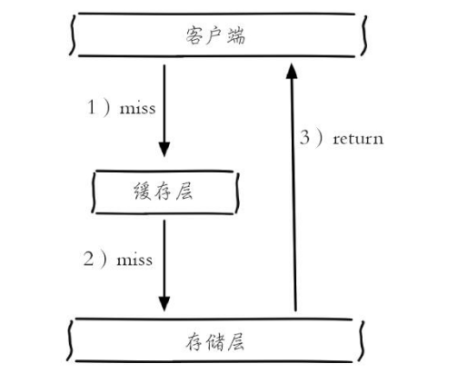
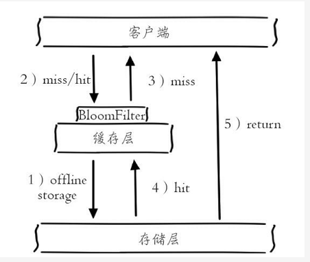
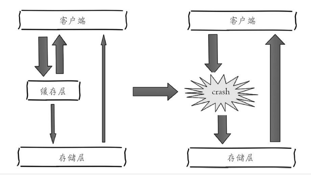

# 缓存设计

## 缓存的收益和成本

下左侧为客户端直接调用存储层的架构，右侧为比较典型的缓存层+存储层架构，下面分析一下缓存加入后带来的收益和成本。查询时先去查询缓存，如果缓存存在，那么就直接返回缓存中的数据；如果缓存中不存在，那么就从mysql中查询数据后将查得的数据保存在缓存层中，再将数据返回。


收益如下：

1. 加速读写：因为缓存通常都是全内存的（例如Redis、Memcache），而存储层通常读写性能不够强悍（例如MySQL），通过缓存的使用可以有效地加速读写，优化用户体验。
2. 降低后端负载：帮助后端减少访问量和复杂计算（例如很复杂的SQL语句），在很大程度降低了后端的负载。

成本如下：

1. 数据不一致性：缓存层和存储层的数据存在着一定时间窗口的不一致性，时间窗口跟更新策略有关。
2. 代码维护成本：加入缓存后，需要同时处理缓存层和存储层的逻辑，增大了开发者维护代码的成本。
3. 运维成本：以Redis Cluster为例，加入后无形中增加了运维成本。


## 缓存更新策略

缓存中的数据通常都是有生命周期的，需要在指定时间后被删除或更新，这样可以保证缓存空间在一个可控的范围。但是缓存中的数据会和数据源中的真实数据有一段时间窗口的不一致，需要利用某些策略进行更新。下面将分别从使用场景、一致性、开发人员开发/维护成本三个方面介绍三种缓存的更新策略。

#### 1.LRU/LFU/FIFO算法剔除使用场景。

剔除算法通常用于缓存使用量超过了预设的最大值时候，如何对现有的数据进行剔除。例如Redis使用`maxmemory-policy`这个配置作为内存最大值后对于数据的剔除策略。

1. 一致性。要清理哪些数据是由具体算法决定，开发人员只能决定使用哪种算法，所以数据的一致性是最差的。
2. 维护成本。算法不需要开发人员自己来实现，通常只需要配置最大`maxmemory`和对应的策略即可。开发人员只需要知道每种算法的含义，选择适合自己的算法即可。

#### 2.超时剔除

1. 使用场景。超时剔除通过给缓存数据设置过期时间，让其在过期时间后自动删除，例如Redis提供的`expire`命令。如果业务可以容忍一段时间内，缓存层数据和存储层数据不一致，那么可以为其设置过期时间。在数据过期后，再从真实数据源获取数据，重新放到缓存并设置过期时间。例如一个视频的描述信息，可以容忍几分钟内数据不一致，但是涉及交易方面的业务，后果可想而知。
2. 一段时间窗口内（取决于过期时间长短）存在一致性问题，即缓存数据和真实数据源的数据不一致。
3. 维护成本不是很高，只需设置expire过期时间即可，当然前提是应用方允许这段时间可能发生的数据不一致。

#### 3.主动更新

1. 使用场景。应用方对于数据的一致性要求高，需要在真实数据更新后，立即更新缓存数据。例如可以利用消息系统或者其他方式通知缓存更新。
2. 一致性最高，但如果主动更新发生了问题，那么这条数据很可能很长时间不会更新，所以建议结合超时剔除一起使用效果会更好。
3. 维护成本会比较高，开发者需要自己来完成更新，并保证更新操作的正确性。

下表给出了缓存的三种常见更新策略的对比：


有两个建议：

1. 低一致性业务建议配置最大内存和淘汰策略的方式使用。
2. 高一致性业务可以结合使用超时剔除和主动更新，这样即使主动更新出了问题，也能保证数据过期时间后删除脏数据。

#### 大佬的双写一致性解决方法

[点这里](https://github.com/doocs/advanced-java/blob/master/docs/high-concurrency/redis-consistence.md)

> [PV、TPS、QPS是怎么计算出来的？](https://www.zhihu.com/question/21556347)

## 穿透优化

缓存穿透说简单点就是大量请求的 key 根本不存在于缓存中，导致请求直接到了数据库上，根本没有经过缓存这一层。举个例子：某个黑客故意制造我们缓存中不存在的 key 发起大量请求，导致大量请求落到数据库。通常出于容错的考虑，如果从存储层查不到数据则不写入缓存层，如下图所示整个过程分为如下3步：



1. 缓存层不命中。
2. 存储层不命中，不将空结果写回缓存。
3. 返回空结果。

解决方法

#### 1.缓存空对象

如下图所示，当第2步存储层不命中后，仍然将空对象保留到缓存层中，之后再访问这个数据将会从缓存中获取，这样就保护了后端数据源。


缓存空对象会有两个问题：第一，空值做了缓存，意味着缓存层中存了更多的键，需要更多的内存空间（如果是攻击，问题更严重），比较有效的方法是针对这类数据设置一个较短的过期时间，让其自动剔除。第二，缓存层和存储层的数据会有一段时间窗口的不一致，可能会对业务有一定影响。例如过期时间设置为5分钟，如果此时存储层添加了这个数据，那此段时间就会出现缓存层和存储层数据的不一致，此时可以利用消息系统或者其他方式清除掉缓存层中的空对象。下面给出了缓存空对象的实现代码：

```java
public Object getObjectInclNullById(Integer id) {
    // 从缓存中获取数据
    Object cacheValue = cache.get(id);
    // 缓存为空
    if (cacheValue == null) {
        // 从数据库中获取
        Object storageValue = storage.get(key);
        // 缓存空对象
        cache.set(key, storageValue);
        // 如果存储数据为空，需要设置一个过期时间(300秒)
        if (storageValue == null) {
            // 必须设置过期时间，否则有被攻击的风险
            cache.expire(key, 60 * 5);
        }
        return storageValue;
    }
    return cacheValue;
}
```

#### 2.布隆过滤器拦截

**布隆过滤器：**布隆过滤器是一个非常神奇的数据结构，通过它我们可以非常方便地判断一个给定数据是否存在与海量数据中。我们需要的就是判断key 是否合法，有没有感觉布隆过滤器就是我们想要找的那个“人”。具体是这样做的：把所有可能存在的请求的值都存放在布隆过滤器中，当用户请求过来，我会先判断用户发来的请求的值是否存在于布隆过滤器中。不存在的话，直接返回请求参数错误信息给客户端，存在的话才会走下面的流程。[啥是布隆过滤器？](https://github.com/Snailclimb/JavaGuide/blob/master/docs/dataStructures-algorithms/data-structure/bloom-filter.md)

例如：一个推荐系统有4亿个用户id，每个小时算法工程师会根据每个用户之前历史行为计算出推荐数据放到存储层中，但是最新的用户由于没有历史行为，就会发生缓存穿透的行为，为此可以将所有推荐数据的用户做成布隆过滤器。如果布隆过滤器认为该用户id不存在，那么就不会访问存储层，在一定程度保护了存储层。



## 崩优化图

下图描述了什么是缓存雪崩：由于缓存层承载着大量请求，有效地保护了存储层，但是如果缓存层由于某些原因不能提供服务，于是所有的请求都会达到存储层，存储层的调用量会暴增，造成存储层也会级联宕机的情况。缓存雪崩的英文原意是`stampeding herd`（奔逃的野牛），指的是缓存层宕掉后，流量会像奔逃的野牛一样，打向后端存储。



1. 事前：尽量保证整个 redis 集群的高可用性（例如Redis Sentinel和Redis Cluster都实现了高可用。），发现机器宕机尽快补上。选择合适的内存淘汰策略。
2. 事中：本地ehcache缓存 + hystrix限流&降级，避免MySQL崩掉
3. 事后：利用 redis 持久化机制保存的数据尽快恢复缓存

> 降级：无论是缓存层还是存储层都会有出错的概率，可以将它们视同为资源。作为并发量较大的系统，假如有一个资源不可用，可能会造成线程全部阻塞（hang）在这个资源上，造成整个系统不可用。降级机制在高并发系统中是非常普遍的：比如推荐服务中，如果个性化推荐服务不可用，可以降级补充热点数据，不至于造成前端页面是开天窗。在实际项目中，我们需要对重要的资源（例如Redis、MySQL、HBase、外部接口）都进行隔离，让每种资源都单独运行在自己的线程池中，即使个别资源出现了问题，对其他服务没有影响。但是线程池如何管理，比如如何关闭资源池、开启资源池、资源池阀值管理，这些做起来还是相当复杂的。这里推荐一个Java依赖隔离工具Hystrix（https://github.com/netflix/hystrix）。Hystrix是解决依赖隔离的利器。


##  Redis 的并发竞争 Key 问题

所谓 Redis 的并发竞争 Key 的问题也就是多个系统同时对一个 key 进行操作，但是最后执行的顺序和我们期望的顺序不同，这样也就导致了结果的不同！

推荐一种方案：分布式锁（zookeeper 和 redis 都可以实现分布式锁）。（如果不存在 Redis 的并发竞争 Key 问题，不要使用分布式锁，这样会影响性能）

基于zookeeper临时有序节点可以实现的分布式锁。大致思想为：每个客户端对某个方法加锁时，在zookeeper上的与该方法对应的指定节点的目录下，生成一个唯一的瞬时有序节点。  判断是否获取锁的方式很简单，只需要判断有序节点中序号最小的一个。  当释放锁的时候，只需将这个瞬时节点删除即可。同时，其可以避免服务宕机导致的锁无法释放，而产生的死锁问题。完成业务流程后，删除对应的子节点释放锁。

在实践中，当然是从以可靠性为主。所以首推Zookeeper。

> 更详细的内容可以参考大佬的文章：https://www.cnblogs.com/JJJ1990/p/10496850.html