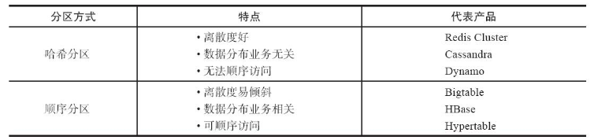
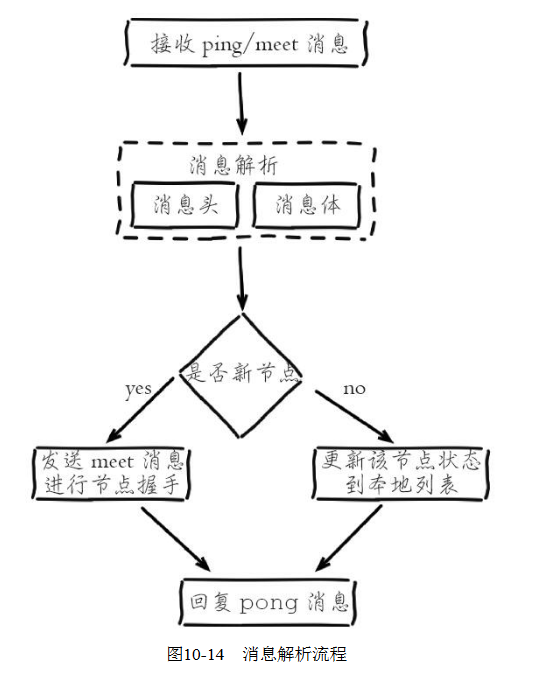
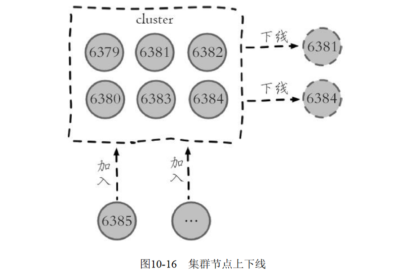
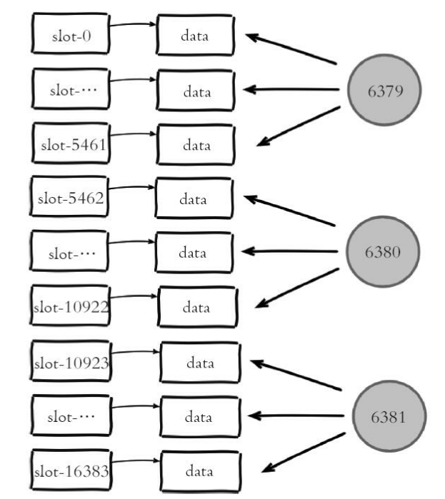
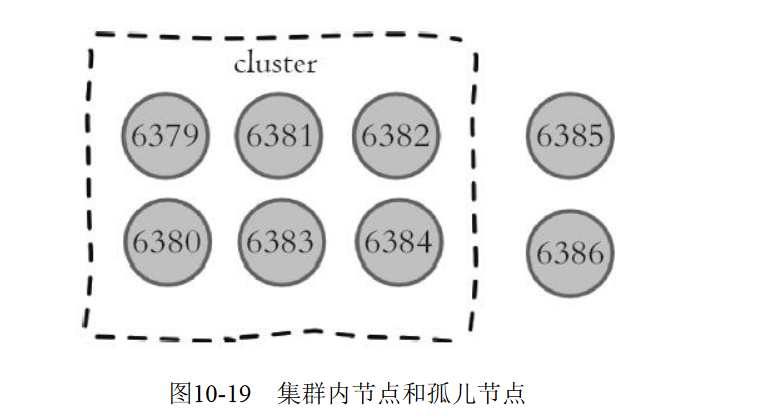
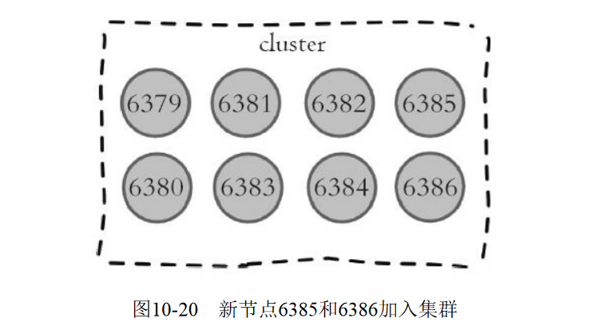
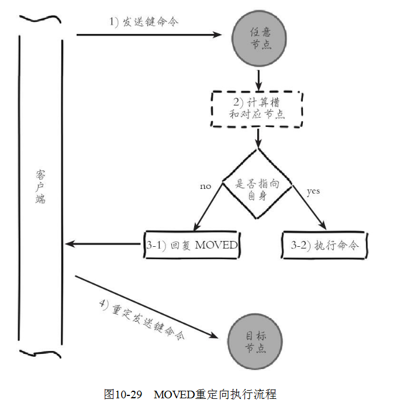

##  10章 集群

`Redis Cluster`是`Redis`的分布式解决方案，在3.0版本正式推出，有效地解决了`Redis`分布式方面的需求。当遇到单机内存、并发、流量等瓶颈时，可以采用`Cluster`架构方案达到负载均衡的目的。

**之前**，`Redis`分布式方案一般有两种：

- 客户端分区方案，优点是分区逻辑可控，缺点是需要自己处理数据路由、高可用、故障转移等问题。
- 代理方案，优点是简化客户端分布式逻辑和升级维护便利，缺点是加重架构部署复杂度和性能损耗。

**现在**官方为我们提供了专有的集群方案：`Redis Cluster`，它非常优雅地解决了Redis集群方面的问题，因此理解应用好`Redis Cluster`将极大地解放我们使用分布式`Redis`的工作量，同时它也是学习分布式存储的绝佳案例。本章将从数据分布、搭建集群、节点通信、集群伸缩、请求路由、故障转移、集群运维几个方面介绍`Redis Cluster`。

## 10.1 数据分布

### 10.1.1 数据分布理论

分布式数据库首先要解决把整个数据集按照分区规则映射到多个节点的问题，即把数据集划分到多个节点上，每个节点负责整体数据的一个子集。如图10-1所示。需要重点关注的是数据分区规则。常见的分区规则有哈希分区和顺序分区两种，表10-1对这两种分区规则进行了对比。




由于`Redis Cluster`采用哈希分区规则，这里我们重点讨论哈希分区，常见的哈希分区规则有几种，下面分别介绍。

#### 1.节点取余分区

​	使用特定的数据，如`Redis`的键或用户`ID`，再根据节点数量`N`使用公式：`hash（key）%N`计算出哈希值，用来决定数据映射到哪一个节点上。这种方案存在一个问题：当节点数量变化时，如扩容或收缩节点，数据节点映射关系需要重新计算，会导致数据的重新迁移。

​	这种方式的突出优点是简单性，常用于数据库的分库分表规则，一般采用预分区的方式，提前根据数据量规划好分区数，比如划分为512或1024张表，保证可支撑未来一段时间的数据量，再根据负载情况将表迁移到其他数据库中。扩容时通常采用翻倍扩容，避免数据映射全部被打乱导致全量迁移的情况，如图10-2所示。


#### 2.一致性哈希分区

一致性哈希分区（`Distributed Hash Table`）实现思路是为系统中每个节点分配一个`token`，范围一般在0~2^32，这些`token`构成一个哈希环。数据读写执行节点查找操作时，先根据`key`计算`hash`值，然后顺时针找到第一个大于等于该哈希值的`token`节点，如图10-3所示。


这种方式相比节点取余最大的好处在于加入和删除节点只影响哈希环中相邻的节点，对其他节点无影响。以上图为例，如果在 `node1` 和 `node2` 之间增加 `node5`，则只有 `node2` 中的一部分数据会迁移到 `node5`；如果去掉 `node2`，则原 `node2` 中的数据只会迁移到 `node4` 中，只有 `node4` 会受影响。但一致性哈希分区存在几个问题：

1. 加减节点会造成哈希环中部分数据无法命中，需要手动处理或者忽略这部分数据，因此一致性哈希常用于缓存场景。
2. 当使用少量节点时，节点变化将大范围影响哈希环中数据映射，因此这种方式不适合少量数据节点的分布式方案。还是以上图为例，如果去掉 `node2`，`node4` 中的数据由总数据的 `1/4` 左右变为 `1/2` 左右，与其他节点相比负载过高。
3. 普通的一致性哈希分区在增减节点时需要增加一倍或减去一半节点才能保证数据和负载的均衡。

正因为一致性哈希分区的这些缺点，一些分布式系统采用虚拟槽对一致性哈希进行改进，比如`Dynamo`系统。

#### 3.虚拟槽分区

虚拟槽分区巧妙地使用了哈希空间，使用分散度良好的哈希函数把所有数据映射到一个固定范围的整数集合中，整数定义为槽（`slot`）。这个范围一般远远大于节点数，比如`Redis Cluster`槽范围是0~16383。采用大范围槽的主要目的是为了方便数据拆分和集群扩展。每个节点会负责一定数量的槽，**槽是集群内数据管理和迁移的基本单位，槽解耦了数据和实际节点之间的关系，增加或删除节点对系统的影响很小。**如图10-4所示。


当前集群有5个节点，每个节点平均大约负责3276个槽。由于采用高质量的哈希算法，每个槽所映射的数据通常比较均匀，将数据平均划分到5个节点进行数据分区。如果此时删除 `node2`，只需要将槽 4-7 重新分配即可，例如槽 4-5 分配给 `node1`，槽 6 分配给 `node3`，槽 7 分配给 `node4`；可以看出删除 `node2` 后，数据在其他节点的分布仍然较为均衡。`Redis Cluster`就是采用虚拟槽分区，下面就介绍Redis数据分区方法。

### 10.1.2Redis数据分区

Redis 集群中内置了 `16384` 个哈希槽。当客户端连接到 Redis 集群之后，会同时得到一份关于这个集群的配置信息，当客户端具体对某一个 `key` 值进行操作时，会计算出它的一个 Hash 值，然后把结果对 `16384`  **求余数**，这样每个 `key` 都会对应一个编号在 `0-16383` 之间的哈希槽，Redis 会根据节点数量 **大致均等** 的将哈希槽映射到不同的节点。。每一个节点负责维护一部分槽以及槽所映射的键值数据，如图10-5所示。


`Redis`虚拟槽分区的特点：

1. 解耦数据和节点之间的关系，简化了节点扩容和收缩难度。
2. 节点自身维护槽的映射关系，不需要客户端或者代理服务维护槽分区元数据。
3. 支持节点、槽、键之间的映射查询，用于数据路由、在线伸缩等场景。数据分区是分布式存储的核心，理解和灵活运用数据分区规则对于掌握`Redis Cluster`非常有帮助

### 10.1.3 集群功能限制

`Redis`集群相对单机在功能上存在一些限制，需要开发人员提前了解，在使用时做好规避。

限制如下：

1. `key`批量操作支持有限。如`mset`、`mget`，目前只支持具有相同`slot`值的`key`执行批量操作。对于映射为不同`slot`值的`key`由于执行`mget`、`mget`等操作可能存在于多个节点上因此不被支持。
2. `key`事务操作支持有限。同理只支持多`key`在同一节点上的事务操作，当多个`key`分布在不同的节点上时无法使用事务功能。
3. `key`作为数据分区的最小粒度，因此不能将一个大的键值对象如`hash`、`list`等映射到不同的节点。
4. 不支持多数据库空间。单机下的`Redis`可以支持16个数据库，集群模式下只能使用一个数据库空间，即`db0`。
5. 复制结构只支持一层，从节点只能复制主节点，不支持嵌套树状复制结构。

## 10.2 搭建集群

介绍完`Redis`集群分区规则之后，下面我们开始搭建`Redis`集群。搭建集群工作需要以下三个步骤：1）准备节点。2）节点握手。3）分配槽。

### 10.2.1 准备节点

`Redis`集群一般由多个节点组成，节点数量至少为6个才能保证组成完整高可用的集群。每个节点需要开启配置`cluster-enabled yes`，让`Redis`运行在集群模式下。建议为集群内所有节点统一目录，一般划分三个目录：`conf`、`data`、`log`，分别存放配置、数据和日志相关文件。把6个节点配置统一放在`conf`目录下，集群相关配置如下

```shell
#节点端口
port 6379
# 开启集群模式
cluster-enabled yes
# 节点超时时间，单位毫秒
cluster-node-timeout 15000
# 集群内部配置文件
cluster-config-file "nodes-6379.conf"
```

其他配置和单机模式一致即可，配置文件命名规则`redis-{port}.conf`，准备好配置后启动所有节点，命令如下：

```shell
redis-server conf/redis-6379.conf
redis-server conf/redis-6380.conf
redis-server conf/redis-6381.conf
redis-server conf/redis-6382.conf
redis-server conf/redis-6383.conf
redis-server conf/redis-6384.conf
```

检查节点日志是否正确，日志内容如下：

```shell
cat log/redis-6379.log
* No cluster configuration found, I'm cfb28ef1deee4e0fa78da86abe5d24566744411e
# Server started, Redis version 3.0.7
* The server is now ready to accept connections on port 6379
```

6379节点启动成功，第一次启动时如果没有集群配置文件，它会自动创建一份，文件名称采用`cluster-config-file`参数项控制，建议采用`node-{port}.conf`格式定义，通过使用端口号区分不同节点，防止同一机器下多个节点彼此覆盖，造成集群信息异常。如果启动时存在集群配置文件，节点会使用配置文件内容初始化集群信息。启动过程如图10-6所示。


集群模式的`Redis`除了原有的配置文件之外又加了一份集群配置文件。当集群内节点信息发生变化，如添加节点、节点下线、故障转移等。节点会自动保存集群状态到配置文件中。需要注意的是，`Redis`自动维护集群配置文件，不要手动修改，防止节点重启时产生集群信息错乱。

如节点6379首次启动后生成集群配置如下：

```shell
#cat data/nodes-6379.conf
cfb28ef1deee4e0fa78da86abe5d24566744411e 127.0.0.1:6379 myself,master - 0 0 0 connected
vars currentEpoch 0 lastVoteEpoch 0
```

文件内容记录了集群初始状态，这里最重要的是节点ID，它是一个40位16进制字符串，用于唯一标识集群内一个节点，之后很多集群操作都要借助于节点ID来完成。需要注意是，节点ID不同于运行ID。节点ID在集群初始化时只创建一次，节点重启时会加载集群配置文件进行重用，而`Redis`的运行ID每次重启都会变化。在节点6380执行`cluster nodes`命令获取集群节点状态：

```shell
127.0.0.1:6380>cluster nodes
8e41673d59c9568aa9d29fb174ce733345b3e8f1 127.0.0.1:6380 myself,master - 0 0 0
```

可以看到每个节点目前只能识别出自己的节点信息。我们启动6个节点，但每个节点彼此并不知道对方的存在，下面通过节点握手让6个节点彼此建立联系从而组成一个集群。

### 10.2.2 节点握手

节点握手是指一批运行在集群模式下的节点通过`Gossip`协议彼此通信，达到感知对方的过程。节点握手是集群彼此通信的第一步，由客户端发起命令：`cluster meet{ip}{port}`，如图10-7所示。

图中执行的命令是：`cluster meet 127.0.0.16380`让节点6379和6380节点进行握手通信。`cluster meet`命令是一个异步命令，执行之后立刻返回。内部发起与目标节点进行握手通信，如图10-8所示。


1. 节点6379本地创建6380节点信息对象，并发送`meet`消息。
2. 节点6380接受到`meet`消息后，保存6379节点信息并回复`pong`消息。
3. 之后节点6379和6380彼此定期通过`ping/pong`消息进行正常的节点通信。

这里的`meet`、`ping`、`pong`消息是`Gossip`协议通信的载体，之后的节点通信部分做进一步介绍，它的主要作用是节点彼此交换状态数据信息。6379和6380节点通过`meet`命令彼此建立通信之后，集群结构如图10-9所示。


```shell
127.0.0.1:6379> cluster nodes
cfb28ef1deee4e0fa78da86abe5d24566744411e 127.0.0.1:6379 myself,master - 0 0     0 connected 
8e41673d59c9568aa9d29fb174ce733345b3e8f1 127.0.0.1:6380 master - 0 1468073534265 1 connected
127.0.0.1:6380> cluster nodes
cfb28ef1deee4e0fa78da86abe5d24566744411e 127.0.0.1:6379 master - 0 1468073571641     0 connected
8e41673d59c9568aa9d29fb174ce733345b3e8f1 127.0.0.1:6380 myself,master - 0 0     1 connected
```

下面分别执行`meet`命令让其他节点加入到集群中：

```shell
127.0.0.1:6379>cluster meet 127.0.0.1 6381
127.0.0.1:6379>cluster meet 127.0.0.1 6382
127.0.0.1:6379>cluster meet 127.0.0.1 6383
127.0.0.1:6379>cluster meet 127.0.0.1 6384
```

我们只需要在集群内任意节点上执行`cluster meet`命令加入新节点，握手状态会通过消息在集群内传播，这样其他节点会自动发现新节点并发起握手流程。最后执行`cluster nodes`命令确认6个节点都彼此感知并组成集群：

```shell
127.0.0.1:6379> cluster nodes
4fa7eac4080f0b667ffeab9b87841da49b84a6e4 127.0.0.1:6384 master - 0 1468073975551     5 connected
cfb28ef1deee4e0fa78da86abe5d24566744411e 127.0.0.1:6379 myself,master - 0 0 0 
connected
be9485a6a729fc98c5151374bc30277e89a461d8 127.0.0.1:6383 master - 0 1468073978579     4 connected
40622f9e7adc8ebd77fca0de9edfe691cb8a74fb 127.0.0.1:6382 master - 0 1468073980598     3 connected
8e41673d59c9568aa9d29fb174ce733345b3e8f1 127.0.0.1:6380 master - 0 1468073974541     1 connected
40b8d09d44294d2e23c7c768efc8fcd153446746 127.0.0.1:6381 master - 0 1468073979589     2 connected
```


节点建立握手之后集群还不能正常工作，这时集群处于下线状态，所有的数据读写都被禁止。通过如下命令可以看到：

```xshell
127.0.0.1:6379> set hello redis
(error) CLUSTERDOWN The cluster is down
```

通过`cluster info`命令可以获取集群当前状态：

```shell
127.0.0.1:6379> cluster  info
cluster_state:fail
cluster_slots_assigned:0
cluster_slots_ok:0
cluster_slots_pfail:0
cluster_slots_fail:0
cluster_known_nodes:6
cluster_size:0
```

从输出内容可以看到，被分配的槽（`cluster_slots_assigned`）是0，由于目前所有的槽没有分配到节点，因此集群无法完成槽到节点的映射。只有当16384个槽全部分配给节点后，集群才进入在线状态。

### 10.2.3 分配槽

`Redis`集群把所有的数据映射到16384个槽中。每个`key`会映射为一个固定的槽，只有当节点分配了槽，才能响应和这些槽关联的键命令。通过`cluster addslots`命令为节点分配槽。这里利用`bash`特性批量设置槽（`slots`），命令如下：

```shell
redis-cli -h 127.0.0.1 -p 6379 cluster addslots {0...5461}
redis-cli -h 127.0.0.1 -p 6380 cluster addslots {5462...10922}
redis-cli -h 127.0.0.1 -p 6381 cluster addslots {10923...16383}
```

把16384个`slot`平均分配给6379、6380、6381三个节点。执行`cluster info`查看集群状态，如下所示：

```shell
127.0.0.1:6379> cluster info
cluster_state:ok
cluster_slots_assigned:16384
cluster_slots_ok:16384
cluster_slots_pfail:0
cluster_slots_fail:0
cluster_known_nodes:6
cluster_size:3
cluster_current_epoch:5
cluster_my_epoch:0
cluster_stats_messages_sent:4874
cluster_stats_messages_received:4726

```

当前集群状态是OK，集群进入在线状态。所有的槽都已经分配给节点，执行`cluster nodes`命令可以看到节点和槽的分配关系。

目前还有三个节点没有使用，作为一个完整的集群，每个负责处理槽的节点应该具有从节点，保证当它出现故障时可以自动进行故障转移。集群模式下，`Reids`节点角色分为主节点和从节点。首次启动的节点和被分配槽的节点都是主节点，从节点负责复制主节点槽信息和相关的数据。使用`cluster replicate{nodeId}`命令让一个节点成为从节点。其中命令执行必须在对应的从节点上执行，`nodeId`是要复制主节点的节点ID，命令如下：

```shell
127.0.0.1:6382>cluster replicate cfb28ef1deee4e0fa78da86abe5d24566744411e
OK
127.0.0.1:6383>cluster replicate 8e41673d59c9568aa9d29fb174ce733345b3e8f1
OK
127.0.0.1:6384>cluster replicate 40b8d09d44294d2e23c7c768efc8fcd153446746
OK
```

`Redis`集群模式下的主从复制使用了之前介绍的`Redis`复制流程，依然支持全量和部分复制。复制（`replication`）完成后，整个集群的结构如图10-11所示。


```shell
127.0.0.1:6379> cluster nodes
4fa7eac4080f0b667ffeab9b87841da49b84a6e4 127.0.0.1:6384 slave 40b8d09d44294d2e2    3c7c768efc8fcd153446746 0 1468076865939 5 connected
cfb28ef1deee4e0fa78da86abe5d24566744411e 127.0.0.1:6379 myself,master - 0 0 0 
connected 0-5461
be9485a6a729fc98c5151374bc30277e89a461d8 127.0.0.1:6383 slave 8e41673d59c9568aa    9d29fb174ce733345b3e8f1 0 1468076868966 4 connected
40622f9e7adc8ebd77fca0de9edfe691cb8a74fb 127.0.0.1:6382 slave cfb28ef1deee4e0fa    78da86abe5d24566744411e 0 1468076869976 3 connected
8e41673d59c9568aa9d29fb174ce733345b3e8f1 127.0.0.1:6380 master - 0 1468076870987 1     connected 5462-10922
40b8d09d44294d2e23c7c768efc8fcd153446746 127.0.0.1:6381 master - 0 1468076867957 2     connected 10923-16383
```

目前为止，我们依照`Redis`协议手动建立一个集群。它由6个节点构成，3个主节点负责处理槽和相关数据，3个从节点负责故障转移。手动搭建集群便于理解集群建立的流程和细节，不过读者也从中发现集群搭建需要很多步骤，当集群节点众多时，必然会加大搭建集群的复杂度和运维成本。因此`Redis`官方提供了`redis-trib.rb`工具方便我们快速搭建集群。

### 10.2.4 用redis-trib.rb搭建集群

## 10.3 节点通信

### 10.3.1 通信流程

在分布式存储中需要提供维护节点元数据信息的机制，所谓元数据是指：节点负责哪些数据，是否出现故障等状态信息。常见的元数据维护方式分为：集中式和`P2P`方式。`Redis`集群采用`P2P`的`Gossip`（流言）协议，`Gossip`协议工作原理就是节点彼此不断通信交换信息，一段时间后所有的节点都会知道集群完整的信息，这种方式类似流言传播，如图10-12所示。


通信过程说明：

1. 集群中的每个节点都会单独开辟一个`TCP`通道，用于节点之间彼此通信，通信端口号在基础端口上加10000。
2. 每个节点在固定周期内通过特定规则选择几个节点发送`ping`消息。
3. 接收到`ping`消息的节点用`pong`消息作为响应。

集群中每个节点通过一定规则挑选要通信的节点，每个节点可能知道全部节点，也可能仅知道部分节点，只要这些节点彼此可以正常通信，最终它们会达到一致的状态。当节点出故障、新节点加入、主从角色变化、槽信息变更等事件发生时，通过不断的`ping/pong`消息通信，经过一段时间后所有的节点都会知道整个集群全部节点的最新状态，从而达到集群状态同步的目的。

> #### 两个端口
>
> 在 哨兵系统 中，节点分为数据节点和哨兵节点：前者存储数据，后者实现额外的控制功能。在 集群中，没有数据节点与非数据节点之分：所有的节点都存储数据，也都参与集群状态的维护。为此，集群中的每个节点，都提供了两个 TCP 端口：
>
> - **普通端口：** 即我们在前面指定的端口 (7000等)。普通端口主要用于为客户端提供服务 *（与单机节点类似）*；但在节点间数据迁移时也会使用。
> - **集群端口：** 端口号是普通端口 + 10000（10000是固定值，无法改变），如 `7000` 节点的集群端口为 `17000`。集群端口只用于节点之间的通信，如搭建集群、增减节点、故障转移等操作时节点间的通信；不要使用客户端连接集群接口。为了保证集群可以正常工作，在配置防火墙时，要同时开启普通端口和集群端口。

### 10.3.2  Gossip消息

`gossip`协议的主要职责就是信息交换。信息交换的载体就是节点彼此发送的`Gossip`消息，了解这些消息有助于我们理解集群如何完成信息交换。常用的`Gossip`消息可分为：`ping`消息、`pong`消息、`meet`消息、fail消息等，它们的通信模式如图10-13所示。

> Gossip 协议
>
> 节点间通信，按照通信协议可以分为几种类型：单对单、广播、Gossip 协议等。重点是广播和 Gossip 的对比。
>
> - 广播是指向集群内所有节点发送消息。优点是集群的收敛速度快(集群收敛是指集群内所有节点获得的集群信息是一致的)，缺点 是每条消息都要发送给所有节点，CPU、带宽等消耗较大。
> - Gossip 协议的特点是：在节点数量有限的网络中，每个节点都 “随机” 的与部分节点通信 *（并不是真正的随机，而是根据特定的规则选择通信的节点）*，经过一番杂乱无章的通信，每个节点的状态很快会达到一致。Gossip 协议的优点有负载 *(比广播)* 低、去中心化、容错性高 *(因为通信有冗余)* 等；缺点主要是集群的收敛速度慢。


1. `meet`消息：用于通知新节点加入。消息发送者通知接收者加入到当前集群，`meet`消息通信正常完成后，接收节点会加入到集群中并进行周期性的`ping`、`pong`消息交换。
2. `ping`消息：集群内交换最频繁的消息，集群内每个节点每秒向多个其他节点发送`ping`消息，用于检测节点是否在线和交换彼此状态信息。`ping`消息发送封装了**自身节点和部分其他节点的状态数据**。
3. `pong`消息：当接收到`ping`、`meet`消息时，作为响应消息回复给发送方确认消息正常通信。`pong`消息内部封装了**自身状态数据**。节点也可以向集群内广播自身的`pong`消息来通知整个集群对**自身状态**进行更新。
4. `fail`消息：当节点判定集群内**另一个节点**下线时，会向集群内广播一个`fail`消息，其他节点接收到`fail`消息之后把对应节点更新为下线状态。具体细节将在后面10.6节“故障转移”中说明。

所有的消息格式划分为：消息头和消息体。消息头包含**发送节点自身状态数据**，接收节点根据消息头就可以获取到发送节点的相关数据，结构如下：

```c
typedef struct {   
char sig[4]; /* 信号标示 */    
uint32_t totlen; /* 消息总长度 */    
uint16_t ver; /* 协议版本*/    
uint16_t type; /* 消息类型,用于区分meet,ping,pong等消息 */    
uint16_t count; /* 消息体包含的节点数量，仅用于meet,ping,ping消息类型*/    
uint64_t currentEpoch; /* 当前发送节点的配置纪元 */    
uint64_t configEpoch; /* 主节点/从节点的主节点配置纪元 */    
uint64_t offset; /* 复制偏移量 */    
char sender[CLUSTER_NAMELEN]; /* 发送节点的nodeId */    
unsigned char myslots[CLUSTER_SLOTS/8]; /* 发送节点负责的槽信息 */    
char slaveof[CLUSTER_NAMELEN]; /* 如果发送节点是从节点，记录对应主节点的nodeId */    
uint16_t port; /* 端口号 */    
uint16_t flags; /* 发送节点标识,区分主从角色，是否下线等 */    
unsigned char state; /* 发送节点所处的集群状态 */    
unsigned char mflags[3]; /* 消息标识 */   
union clusterMsgData data /* 消息正文 */;
} clusterMsg;
```

集群内所有的消息都采用相同的消息头结构`clusterMsg`，它包含了发送节点关键信息，如节点`id`、槽映射、节点标识（主从角色，是否下线）等。消息体在`Redis`内部采用`clusterMsgData`结构声明，结构如下：

```c
union clusterMsgData {   
/* ping,meet,pong消息体*/    
struct {        
/* gossip消息结构数组 */
clusterMsgDataGossip gossip[1];
} ping;    
/* FAIL 消息体 */    
struct {        
clusterMsgDataFail about;    
} fail;
// 
...};
```

消息体`clusterMsgData`定义发送消息的数据，其中`ping`、`meet`、`pong`都采用`clusterMsgDataGossip`数组作为消息体数据，实际消息类型使用消息头的`type`属性区分。每个消息体包含该节点的多个`clusterMsgDataGossip`结构数据，用于信息交换，结构如下：

```c
typedef struct {    
char nodename[CLUSTER_NAMELEN]; /* 节点的nodeId */  
uint32_t ping_sent; /* 最后一次向该节点发送ping消息时间 */   
uint32_t pong_received; /* 最后一次接收该节点pong消息时间 */   
char ip[NET_IP_STR_LEN]; /* IP */   
uint16_t port; /* port*/   
uint16_t flags; /* 该节点标识, */} 
clusterMsgDataGossip;
```

当接收到`ping`、`meet`消息时，接收节点会解析消息内容并根据自身的识别情况做出相应处理，对应流程如图10-14所示。



接收节点收到`ping/meet`消息时，执行解析消息头和消息体流程：

1. 解析消息头过程：消息头包含了**发送节点**的信息，如果**发送节点**是新节点且消息是`meet`类型，则加入到本地节点列表；如果是已知节点，则尝试更新发送节点的状态，如槽映射关系、主从角色等状态。
2. 解析消息体过程：如果消息体的`clusterMsgDataGossip`数组包含的节点是新节点，则尝试发起与新节点的`meet`握手流程；如果是已知节点，则根据`cluster MsgDataGossip`中的`flags`字段判断该节点是否下线，用于故障转移。

消息处理完后回复`pong`消息，内容同样包含消息头和消息体，发送节点接收到回复的`pong`消息后，采用类似的流程解析处理消息并更新与接收节点最后通信时间，完成一次消息通信。

### 10.3.3 节点选择

虽然`Gossip`协议的信息交换机制具有天然的分布式特性，但它是有成本的。由于内部需要频繁地进行节点信息交换，而`ping/pong`消息会携带当前节点和部分其他节点的状态数据，势必会加重带宽和计算的负担。`Redis`集群内节点通信采用固定频率（定时任务每秒执行10次）。因此节点每次选择需要通信的节点列表变得非常重要。通信节点选择过多虽然可以做到信息及时交换但成本过高。节点选择过少会降低集群内所有节点彼此信息交换频率，从而影响故障判定、新节点发现等需求的速度。因此`Redis`集群的`Gossip`协议需要兼顾信息交换实时性和成本开销，通信节点选择的规则如图10-15所示。


根据通信节点选择的流程可以看出消息交换的成本主要体现在单位时间选择发送消息的节点数量和每个消息携带的数据量。

#### 1.选择发送消息的节点数量

`PING` 消息使用 `Gossip` 协议发送，接收节点的选择兼顾了收敛速度和带宽成本，具体规则如下：(1)每秒随机找 5 个节点，在其中选择最久没有通信的 1 个节点发送`ping`消息，用于保证`Gossip`信息交换的随机性。(2)每100毫秒都会扫描本地节点列表，如果发现节点最近一次接受`pong`消息的时间大于`cluster_node_timeout/2`的所有节点，则立刻发送`ping`消息，防止该节点信息太长时间未更新。根据以上规则得出每个节点每秒需要发送`ping`消息的数量`=1+10*num（node.pong_received>cluster_node_timeout/2）`，因此`cluster_node_timeout`参数对消息发送的节点数量影响非常大。当我们的带宽资源紧张时，可以适当调大这个参数，如从默认15秒改为30秒来降低带宽占用率。过度调大`cluster_node_timeout`会影响消息交换的频率从而影响故障转移、槽信息更新、新节点发现的速度。因此需要根据业务容忍度和资源消耗进行平衡。同时整个集群消息总交换量也跟节点数成正比。

#### 2.消息数据量

每个`ping`消息的数据量体现在消息头和消息体中，其中消息头主要占用空间的字段是`myslots[CLUSTER_SLOTS/8]`，占用2KB，这块空间占用相对固定。消息体会携带一定数量的其他节点信息用于信息交换。具体数量见以下伪代码：

```c
def get_wanted():   
	int total_size = size(cluster.nodes)    # 默认包含节点总量的1/10
	nt wanted = floor(total_size/10);    
	if wanted < 3:        # 至少携带3个其他节点信息        
		wanted = 3;   
    if wanted > total_size -2 :        # 最多包含total_size - 2个    
         wanted = total_size - 2; 
    return wanted;
```

根据伪代码可以看出消息体携带数据量跟集群的节点数息息相关，更大的集群每次消息通信的成本也就更高，因此对于`Redis`集群来说并不是大而全的集群更好，对于集群规模控制的建议见之后10.7节“集群运维”。

## 10.4 集群伸缩

### 10.4.1 伸缩原理

`Redis`集群提供了灵活的节点扩容和收缩方案。在不影响集群对外服务的情况下，可以为集群添加节点进行扩容也可以下线部分节点进行缩容，如图10-16所示



从图10-16看出，`Redis`集群可以实现对节点的灵活上下线控制。其中原理可抽象为槽和对应数据在不同节点之间灵活移动。首先来看我们之前搭建的集群槽和数据与节点的对应关系，如图10-17所示。



三个主节点分别维护自己负责的槽和对应的数据，如果希望加入1个节点实现集群扩容时，需要通过相关命令把一部分槽和数据迁移给新节点，如图10-18所示。


图中每个节点把一部分槽和数据迁移到新的节点6385，每个节点负责的槽和数据相比之前变少了从而达到了集群扩容的目的。这里我们故意忽略了槽和数据在节点之间迁移的细节，目的是想让读者重点关注在上层槽和节点分配上来，理解集群的水平伸缩的**上层原理：集群伸缩=槽和数据在节点之间的移动**，下面将介绍集群扩容和收缩的细节。

### 10.4.2 扩容集群

扩容是分布式存储最常见的需求，`Redis`集群扩容操作可分为如下步骤：1）准备新节点。2）加入集群。3）迁移槽和数据。

#### 1.准备新节点

需要提前准备好新节点并运行在集群模式下，新节点建议跟集群内的节点配置保持一致，便于管理统一。准备好配置后启动两个节点命令如下：

```shell
redis-server conf/redis-6385.conf
redis-server conf/redis-6386.conf
```

启动后的新节点作为孤儿节点运行，并没有其他节点与之通信，集群结构如图10-19所示。



#### 2.加入集群

新节点依然采用cluster meet命令加入到现有集群中。在集群内任意节点执行`cluster meet`命令让6385和6386节点加入进来，命令如下：

```shell
127.0.0.1:6379> cluster meet 127.0.0.1 6385
127.0.0.1:6379> cluster meet 127.0.0.1 6386
```

新节点加入后集群结构如图10-20所示。



集群内新旧节点经过一段时间的`ping/pong`消息通信之后，所有节点会发现新节点并将它们的状态保存到本地。例如我们在6380节点上执行`clusternodes`命令可以看到新节点信息，如下所示：

```shell
127.0.0.1:6380>cluster ndoes
1a205dd8b2819a00dd1e8b6be40a8e2abe77b756 127.0.0.1:6385 master - 0 1469347800759     7 connected
475528b1bcf8e74d227104a6cf1bf70f00c24aae 127.0.0.1:6386 master - 0 1469347798743     8 connected
....
```

新节点刚开始都是主节点状态，但是由于没有负责的槽，所以不能接受任何读写操作。对于新节点的后续操作我们一般有两种选择：·为它迁移槽和数据实现扩容。·作为其他主节点的从节点负责故障转移。

`redis-trib.rb`工具也实现了为现有集群添加新节点的命令，还实现了直接添加为从节点的支持，命令如下：

```shell
redis-trib.rb add-node new_host:new_port existing_host:existing_port --slave     --master-id <arg>
```

内部同样采用`cluster meet`命令实现加入集群功能。对于之前的加入集群操作，我们可以采用如下命令实现新节点加入：

```shell
redis-trib.rb add-node 127.0.0.1:6385 127.0.0.1:6379
redis-trib.rb add-node 127.0.0.1:6386 127.0.0.1:6379
```

正式环境建议使用`redis-trib.rb add-node`命令加入新节点，该命令内部会执行新节点状态检查，如果新节点已经加入其他集群或者包含数据，则放弃集群加入操作并打印如下信息：

```shell
[ERR] Node 127.0.0.1:6385 is not empty. Either the node already knows other nodes (check with CLUSTER NODES) or contains some key in database 0.
```

如果我们手动执行`cluster meet`命令加入已经存在于其他集群的节点，会造成被加入节点的集群合并到现有集群的情况，从而造成数据丢失和错乱，后果非常严重，线上谨慎操作。

#### 3.迁移槽和数据

加入集群后需要为新节点迁移槽和相关数据，槽在迁移过程中集群可以正常提供读写服务，迁移过程是集群扩容最核心的环节，下面详细讲解。

（1）槽迁移计划槽是`Redis`集群管理数据的基本单位，首先需要为新节点制定槽的迁移计划，确定原有节点的哪些槽需要迁移到新节点。迁移计划需要确保每个节点负责相似数量的槽，从而保证各节点的数据均匀。例如，在集群中加入6385节点，如图10-21所示。加入6385节点后，原有节点负责的槽数量从6380变为4096个。


槽迁移计划确定后开始逐个把槽内数据从源节点迁移到目标节点，如图10-22所示


2）迁移数据数据

迁移过程是逐个槽进行的，每个槽数据迁移的流程如图10-23所示。流程说明：


1. 对目标节点发送`cluster setslot{slot}importing{sourceNodeId}`命令，让目标节点准备导入槽的数据。
2. 对源节点发送`cluster setslot{slot}migrating{targetNodeId}`命令，让源节点准备迁出槽的数据。
3. 源节点循环执行`cluster getkeysinslot{slot}{count}`命令，获取`count`个属于槽`{slot}`的键。
4. 在源节点上执行`migrate{targetIp}{targetPort}""0{timeout}keys{keys...}`命令，把获取的键通过流水线（`pipeline`）机制批量迁移到目标节点，批量迁移版本的`migrate`命令在Redis3.0.6以上版本提供，之前的`migrate`命令只能单个键迁移。对于大量`key`的场景，批量键迁移将极大降低节点之间网络`IO`次数。
5. 重复执行步骤3）和步骤4）直到槽下所有的键值数据迁移到目标节点。
6. 向集群内所有主节点发送`cluster setslot{slot}node{targetNodeId}`命令，通知槽分配给目标节点。为了保证槽节点映射变更及时传播，需要遍历发送给所有主节点更新被迁移的槽指向新节点。

使用伪代码模拟迁移过程如下：

```c
def move_slot(source,target,slot):    
    # 目标节点准备导入槽    
    target.cluster("setslot",slot,"importing",source.nodeId);    
    # 目标节点准备全出槽  
    source.cluster("setslot",slot,"migrating",target.nodeId);  
    while true :       
        # 批量从源节点获取键    
        keys = source.cluster("getkeysinslot",slot,pipeline_size);    
        if keys.length == 0:         
       	 	# 键列表为空时，退出循环         
       	 	break;        
    # 批量迁移键到目标节点        		    	   				    source.call("migrate",target.host,target.port,"",0,timeout,"keys",keys);   
    # 向集群所有主节点通知槽被分配给目标节点  
    for node in nodes:      
    	if node.flag == "slave":     
    		continue;       
    node.cluster("setslot",slot,"node",target.nodeId
```

根据以上流程，我们手动使用命令把源节点6379负责的槽4096迁移到目标节点6385中，流程如下：

1. 目标节点准备导入槽4096数据：

   1. ```shell
      127.0.0.1:6385>cluster setslot 4096 importing cfb28ef1deee4e0fa78da86abe5d24566744411e
      OK
      ```

      确认槽4096导入状态开启：

   2. ```shell
      127.0.0.1:6385>cluster nodes
      1a205dd8b2819a00dd1e8b6be40a8e2abe77b756 127.0.0.1:6385 myself,master - 0 0 7 connected     [4096-<-cfb28ef1deee4e0fa78da86abe5d24566744411e]
      ...
      ```

2. 源节点准备导出槽4096数据：

   1. ```shell
      127.0.0.1:6379>cluster setslot 4096 migrating 1a205dd8b2819a00dd1e8b6be40a8e2abe77b756
      OK
      ```

   2. 确认槽4096导出状态开启

      ```shell
      127.0.0.1:6379>cluster nodes
      cfb28ef1deee4e0fa78da86abe5d24566744411e 127.0.0.1:6379 myself,master - 0 0 0 connected     0-5461 [4096->-1a205dd8b2819a00dd1e8b6be40a8e2abe77b756]
      ...
      ```

3. 批量获取槽4096对应的键，这里我们获取到3个处于该槽的键：

   1. ```shell
      127.0.0.1:6379> cluster getkeysinslot 4096 100
      1) "key:test:5028"
      2) "key:test:68253"
      3) "key:test:79212"
      ```

   2. 确认这三个键是否存在于源节点：

      ```shell
      127.0.0.1:6379>mget key:test:5028 key:test:68253 key:test:79212
      1) "value:5028"
      2) "value:68253"
      3) "value:79212"
      ```

      批量迁移这3个键，migrate命令保证了每个键迁移过程的原子性：

      ```shell
      127.0.0.1:6379>migrate 127.0.0.1 6385 "" 0 5000 keys key:test:5028 key:test:68253     key:test:79212
      ```

      出于演示目的，我们继续查询这三个键，发现已经不在源节点中，Redis返回ASK转向错误，ASK转向负责引导客户端找到数据所在的节点，细节将在后面10.5节“请求路由”中说明。

      ```shell
      127.0.0.1:6379> mget key:test:5028 key:test:68253 key:test:79212
      (error) ASK 4096 127.0.0.1:6385
      ```
```
      
通知所有主节点槽4096指派给目标节点6385：
      
​```shell
      127.0.0.1:6379>cluster setslot 4096 node 1a205dd8b2819a00dd1e8b6be40a8e2abe77b756
      127.0.0.1:6380>cluster setslot 4096 node 1a205dd8b2819a00dd1e8b6be40a8e2abe77b756
      127.0.0.1:6381>cluster setslot 4096 node 1a205dd8b2819a00dd1e8b6be40a8e2abe77b756
      127.0.0.1:6385>cluster setslot 4096 node 1a205dd8b2819a00dd1e8b6be40a8e2abe77b756
```

确认源节点6379不再负责槽4096改为目标节点6385负责：
      


```shell
      127.0.0.1:6379> cluster nodes
      cfb28ef1deee4e0fa78da86abe5d24566744411e 127.0.0.1:6379 myself,master - 0 0 0 connected     0-4095 4097-5461
      1a205dd8b2819a00dd1e8b6be40a8e2abe77b756 127.0.0.1:6385 master - 0 1469718011079 7     connected 4096...
```


手动执行命令演示槽迁移过程，是为了让读者更好地理解迁移流程，实际操作时肯定涉及大量槽并且每个槽对应非常多的键。因此`redis-trib`提供了槽重分片功能，命令如下：

```
   redis-trib.rb reshard host:port --from <arg> --to <arg> --slots <arg> --yes --timeout     <arg> --pipeline <arg>
```

   参数说明：

1. `host`：`port`：必传参数，集群内任意节点地址，用来获取整个集群信息。
   2. --`from`：制定源节点的id，如果有多个源节点，使用逗号分隔，如果是`all`源节点变为集群内所有主节点，在迁移过程中提示用户输入。
3. --`to`：需要迁移的目标节点的id，目标节点只能填写一个，在迁移过程中提示用户输入。
   4. --`slots`：需要迁移槽的总数量，在迁移过程中提示用户输入。
   5. --`yes`：当打印出`reshard`执行计划时，是否需要用户输入`yes`确认后再执行`reshard`。
   6. --`timeout`：控制每次`migrate`操作的超时时间，默认为60000毫秒。
   7. --`pipeline`：控制每次批量迁移键的数量，默认为10。

`reshard`命令简化了数据迁移的工作量，其内部针对每个槽的数据迁移同样使用之前的流程。我们已经为新节点6395迁移了一个槽4096，剩下的槽数据迁移使用`redis-trib.rb`完成，命令如下：

```shell
#redis-trib.rb reshard 127.0.0.1:6379 
>>> Performing Cluster Check (using node 127.0.0.1:6379)
M: cfb28ef1deee4e0fa78da86abe5d24566744411e 127.0.0.1:6379slots:0-4095,4097-5461 (5461 slots) master1 additional replica(s)
M: 40b8d09d44294d2e23c7c768efc8fcd153446746 127.0.0.1:6381slots:10923-16383 (5461 slots) master1 additional replica(s)
M: 8e41673d59c9568aa9d29fb174ce733345b3e8f1 127.0.0.1:6380slots:5462-10922 (5461 slots) master1 additional replica(s)
M: 1a205dd8b2819a00dd1e8b6be40a8e2abe77b756 127.0.0.1:6385slots:4096 (1 slots) master0 additional replica(s)
// ...
[OK] All nodes agree about slots configuration.
>>> Check for open slots...
>>> Check slots coverage...
[OK] All 16384 slots covered.
```

打印出集群每个节点信息后，`reshard`命令需要确认迁移的槽数量，这里我们输入4096个：`How many slots do you want to move (from 1 to 16384)4096`

输入6385的节点`ID`作为目标节点，目标节点只能指定一个：`What is the receiving node ID 1a205dd8b2819a00dd1e8b6be40a8e2abe77b756`

之后输入源节点的`ID`，这里分别输入节点6379、6380、6381三个节点ID最后用`done`表示结束：

```shell
Please enter all the source node IDs.
Type 'all' to use all the nodes as source nodes for the hash slots.
Type 'done' once you entered all the source nodes IDs.
Source node #1:cfb28ef1deee4e0fa78da86abe5d24566744411e
Source node #2:8e41673d59c9568aa9d29fb174ce733345b3e8f1
Source node #3:40b8d09d44294d2e23c7c768efc8fcd153446746
Source node #4:done
```

数据迁移之前会打印出所有的槽从源节点到目标节点的计划，确认计划无误后输入yes执行迁移工作：

```shell
Moving slot 0 from cfb28ef1deee4e0fa78da86abe5d24566744411e
....
Moving slot 1365 from cfb28ef1deee4e0fa78da86abe5d24566744411e
Moving slot 5462 from 8e41673d59c9568aa9d29fb174ce733345b3e8f1
...
Moving slot 6826 from 8e41673d59c9568aa9d29fb174ce733345b3e8f1
Moving slot 10923 from 40b8d09d44294d2e23c7c768efc8fcd153446746
...
Moving slot 12287 from 40b8d09d44294d2e23c7c768efc8fcd153446746
Do you want to proceed with the proposed reshard plan (yes/no) yes
```

`redis-trib`工具会打印出每个槽迁移的进度，如下：

```shell
Moving slot 0 from 127.0.0.1:6379 to 127.0.0.1:6385
........
Moving slot 1365 from 127.0.0.1:6379 to 127.0.0.1:6385 
..
Moving slot 5462 from 127.0.0.1:6380 to 127.0.0.1:6385: 
........
Moving slot 6826 from 127.0.0.1:6380 to 127.0.0.1:6385 
..
Moving slot 10923 from 127.0.0.1:6381 to 127.0.0.1:6385 
..... 
Moving slot 10923 from 127.0.0.1:6381 to 127.0.0.1:6385 
..
```

当所有的槽迁移完成后，`reshard`命令自动退出，执行`cluster nodes`命令检查节点和槽映射的变化，如下所示：

```shell
127.0.0.1:6379>cluster nodes
40622f9e7adc8ebd77fca0de9edfe691cb8a74fb 127.0.0.1:6382 slave cfb28ef1deee4e0fa    78da86abe5d24566744411e 0 1469779084518 3 connected
40b8d09d44294d2e23c7c768efc8fcd153446746 127.0.0.1:6381 master - 0 1469779085528 2 connected 12288-16383
4fa7eac4080f0b667ffeab9b87841da49b84a6e4 127.0.0.1:6384 slave 40b8d09d44294d2e2 3c7c768efc8fcd153446746 0 1469779087544 5 connected
be9485a6a729fc98c5151374bc30277e89a461d8 127.0.0.1:6383 slave 8e41673d59c9568aa    9d29fb174ce733345b3e8f1 0 1469779088552 4 connected
cfb28ef1deee4e0fa78da86abe5d24566744411e 127.0.0.1:6379 myself,master - 0 0 0     connected 1366-4095 4097-5461
475528b1bcf8e74d227104a6cf1bf70f00c24aae 127.0.0.1:6386 master - 0 1469779086536 8 connected
8e41673d59c9568aa9d29fb174ce733345b3e8f1 127.0.0.1:6380 master - 0     1469779085528 1 connected 6827-10922
1a205dd8b2819a00dd1e8b6be40a8e2abe77b756 127.0.0.1:6385 master - 0     1469779083513 9 connected 0-1365 4096 5462-6826 10923-12287
```

节点6385负责的槽变为：0-1365 4096 5462-6826 10923-12287。由于槽用于`hash`运算本身顺序没有意义，因此无须强制要求节点负责槽的顺序性。迁移之后建议使用`redis-trib.rb rebalance`命令检查节点之间槽的均衡性。命令如下：

```shell
# redis-trib.rb rebalance 127.0.0.1:6380
>>> Performing Cluster Check (using node 127.0.0.1:6380)
[OK] All nodes agree about slots configuration.
>>> Check for open slots...
>>> Check slots coverage...
[OK] All 16384 slots covered.
*** No rebalancing needed! All nodes are within the 2.0% threshold.
```

可以看出迁移之后所有主节点负责的槽数量差异在2%以内，因此集群节点数据相对均匀，无需调整。

（3）添加从节点

扩容之初我们把6385、6386节点加入到集群，节点6385迁移了部分槽和数据作为主节点，但相比其他主节点目前还没有从节点，因此该节点不具备故障转移的能力。这时需要把节点6386作为6385的从节点，从而保证整个集群的高可用。使用`cluster replicate{masterNodeId}`命令为主节点添加对应从节点，注意在集群模式下`slaveof`添加从节点操作不再支持。如下所示：

```
127.0.0.1:6386>cluster replicate 1a205dd8b2819a00dd1e8b6be40a8e2abe77b756
```

从节点内部除了对主节点发起全量复制之外，还需要更新本地节点的集群相关状态，查看节点6386状态确认已经变成6385节点的从节点：

```shell
127.0.0.1:6386>cluster nodes
475528b1bcf8e74d227104a6cf1bf70f00c24aae 127.0.0.1:6386 myself,slave 1a205dd8b2    819a00dd1e8b6be40a8e2abe77b756 0 0 8 connected
1a205dd8b2819a00dd1e8b6be40a8e2abe77b756 127.0.0.1:6385 master - 0 1469779083513 9     connected 0-1365 4096 5462-6826 10923-12287...
```

到此整个集群扩容完成，集群关系结构如图10-24所示


### 10.4.3 收缩集群

## 10.5 请求路由

目前我们已经搭建好`Redis`集群并且理解了通信和伸缩细节，但还没有使用客户端去操作集群。`Redis`集群对客户端通信协议做了比较大的修改，为了追求性能最大化，并没有采用代理的方式而是采用客户端直连节点的方式。因此对于希望从单机切换到集群环境的应用需要修改客户端代码。本节我们关注集群请求路由的细节，以及客户端如何高效地操作集群。

### 10.5.1 请求重定向

在集群模式下，`Redis`接收任何键相关命令时首先计算键对应的槽，再根据槽找出所对应的节点，如果节点是自身，则处理键命令；否则回复`MOVED`重定向错误，通知客户端请求正确的节点。这个过程称为`MOVED`重定向，如图10-29所示。例如，在之前搭建的集群上执行如下命令：

```
127.0.0.1:6379> set key:test:1 value-1
OK
```



执行`set`命令成功，因为键key：test：1对应槽5191正好位于6379节点负责的槽范围内，可以借助`cluster keyslot{key}`命令返回`key`所对应的槽，如下所示：

```shell
127.0.0.1:6379> cluster keyslot key:test:1
(integer) 5191
127.0.0.1:6379> cluster nodes
cfb28ef1deee4e0fa78da86abe5d24566744411e 127.0.0.1:6379 myself,master - 0 0 10 connected     1366-4095 4097-5461 12288-13652
...
```

再执行以下命令，由于键对应槽是9252，不属于6379节点，则回复`MOVED{slot}{ip}{port}`格式重定向信息：

```shell
127.0.0.1:6379> set key:test:2 value-2
(error) MOVED 9252 127.0.0.1:6380
127.0.0.1:6379> cluster keyslot key:test:2
(integer) 9252
```

重定向信息包含了键所对应的槽以及负责该槽的节点地址，根据这些信息客户端就可以向正确的节点发起请求。在6380节点上成功执行之前的命令：`127.0.0.1:6380> set key:test:2 value-2  OK`

使用`redis-cli`命令时，可以加入`-c`参数支持自动重定向，简化手动发起重定向操作，如下所示：

```shell
#redis-cli -p 6379 -c
127.0.0.1:6379> set key:test:2 value-2
-> Redirected to slot [9252] located at 127.0.0.1:6380
OK
```

`redis-cli`自动帮我们连接到正确的节点执行命令，这个过程是在`redis-cli`内部维护，实质上是`client`端接到`MOVED`信息之后再次发起请求，并不在Redis节点中完成请求转发，如图10-30所示。


节点对于不属于它的键命令只回复重定向响应，并不负责转发。熟悉Cassandra的用户希望在这里做好区分，不要混淆。正因为集群模式下把解析发起重定向的过程放到客户端完成，所以集群客户端协议相对于单机有了很大的变化。

键命令执行步骤主要分两步：计算槽，查找槽所对应的节点。下面分别介绍。

#### 1.计算槽

Redis首先需要计算键所对应的槽。根据键的有效部分使用CRC16函数计算出散列值，再取对16383的余数，使每个键都可以映射到0~16383槽范围内。伪代码如下：

```c
def key_hash_slot(key):  
int keylen = key.length();   
for (s = 0; s < keylen; s++):      
	if (key[s] == '{'):      
	break; 
if (s == keylen) return crc16(key,keylen) & 16383;  
for (e = s+1; e < keylen; e++):     
	if (key[e] == '}') 
		break;        
if (e == keylen || e == s+1) 
	return crc16(key,keylen) & 16383;  
/* 使用{和}之间的有效部分计算槽 */  
return crc16(key+s+1,e-s-1) & 16383
```

根据伪代码，如果键内容包含{和}大括号字符，则计算槽的有效部分是括号内的内容；否则采用键的全内容计算槽。`cluster keyslot`命令就是采用`key_hash_slot`函数实现的，例如：

```shell
127.0.0.1:6379> cluster keyslot key:test:111
(integer) 10050
127.0.0.1:6379> cluster keyslot key:{hash_tag}:111
(integer) 2515
127.0.0.1:6379> cluster keyslot key:{hash_tag}:222
(integer) 251
```

其中键内部使用大括号包含的内容又叫做`hash_tag`，它提供不同的键可以具备相同`slot`的功能，常用于`Redis IO`优化。例如在集群模式下使用`mget`等命令优化批量调用时，键列表必须具有相同的`slot`，否则会报错。这时可以利用`hash_tag`让不同的键具有相同的`slot`达到优化的目的。命令如下：

```shell
127.0.0.1:6385> mget user:10086:frends user:10086:videos
(error) CROSSSLOT Keys in request don't hash to the same slot
127.0.0.1:6385> mget user:{10086}:friends user:{10086}:videos
1) "friends"
2) "videos
```

`Pipeline`同样可以受益于`hash_tag`，由于`Pipeline`只能向一个节点批量发送执行命令，而相同`slot`必然会对应到唯一的节点，降低了集群使用`Pipeline`的门槛。

#### 2.槽节点查找

先介绍两个结构

节点需要专门的数据结构来存储集群的状态。所谓集群的状态，是一个比较大的概念，包括：集群是否处于上线状态、集群中有哪些节点、节点是否可达、节点的主从状态、槽的分布……

节点为了存储集群状态而提供的数据结构中，最关键的是 `clusterNode` 和 `clusterState` 结构：前者记录了一个节点的状态，后者记录了集群作为一个整体的状态。

##### clusterNode 结构

`clusterNode` 结构保存了 **一个节点的当前状态**，包括创建时间、节点 id、ip 和端口号等。每个节点都会用一个 `clusterNode` 结构记录自己的状态，并为集群内所有其他节点都创建一个 `clusterNode` 结构来记录节点状态。

下面列举了 `clusterNode` 的部分字段，并说明了字段的含义和作用：

```c
typedef struct clusterNode {
    //节点创建时间
    mstime_t ctime;
    //节点id
    char name[REDIS_CLUSTER_NAMELEN];
    //节点的ip和端口号
    char ip[REDIS_IP_STR_LEN];
    int port;
    //节点标识：整型，每个bit都代表了不同状态，如节点的主从状态、是否在线、是否在握手等
    int flags;
    //配置纪元：故障转移时起作用，类似于哨兵的配置纪元
    uint64_t configEpoch;
    //槽在该节点中的分布：占用16384/8个字节，16384个比特；每个比特对应一个槽：比特值为1，则该比特对应的槽在节点中；比特值为0，则该比特对应的槽不在节点中
    unsigned char slots[16384/8];
    //节点中槽的数量
    int numslots;
    …………
} clusterNode;
```

除了上述字段，`clusterNode` 还包含节点连接、主从复制、故障发现和转移需要的信息等。

##### clusterState 结构

`clusterState` 结构保存了在当前节点视角下，集群所处的状态。主要字段包括：

```c
typedef struct clusterState {
    //自身节点
    clusterNode *myself;
    //配置纪元
    uint64_t currentEpoch;
    //集群状态：在线还是下线
    int state;
    //集群中至少包含一个槽的节点数量
    int size;
    //哈希表，节点名称->clusterNode节点指针
    dict *nodes;
    //槽分布信息：数组的每个元素都是一个指向clusterNode结构的指针；如果槽还没有分配给任何节点，则为NULL
    clusterNode *slots[16384];
    …………
} clusterState;
```

`Redis`计算得到键对应的槽后，需要查找槽所对应的节点。集群内通过消息交换每个节点都会知道所有节点的槽信息，内部保存在`clusterState`结构中。

`slots`数组表示槽和节点对应关系，实现请求重定向伪代码如下：

```c
def execute_or_redirect(key):   
    int slot = key_hash_slot(key);   
    ClusterNode node = slots[slot];    
    if(node == clusterState.myself):     
        return executeCommand(key);   
    else:      
    return '(error) MOVED {slot} {node.ip}:{node.port}';
```

根据伪代码看出节点对于判定键命令是执行还是`MOVED`重定向，都是借助`slots[CLUSTER_SLOTS]`数组实现。根据`MOVED`重定向机制，客户端可以随机连接集群内任一`Redis`获取键所在节点，这种客户端又叫`Dummy`（傀儡）客户端，它优点是代码实现简单，对客户端协议影响较小，只需要根据重定向信息再次发送请求即可。但是它的弊端很明显，每次执行键命令前都要到`Redis`上进行重定向才能找到要执行命令的节点，额外增加了`IO`开销，这不是`Redis`集群高效的使用方式。正因为如此通常集群客户端都采用另一种实现：`Smart`（智能）客户端。

### 10.5.2 Smart客户端

#### 1.smart客户端原理

大多数开发语言的Redis客户端都采用Smart客户端支持集群协议，客户端如何选择见：http://redis.io/clients，从中找出符合自己要求的客户端类库。`Smart`客户端通过在内部维护slot→node的映射关系，本地就可实现键到节点的查找，从而保证`IO`效率的最大化，而MOVED重定向负责协助Smart客户端更新slot→node映射。我们以Java的Jedis为例，说明Smart客户端操作集群的流程。1）首先在JedisCluster初始化时会选择一个运行节点，初始化槽和节点映射关系，使用cluster slots命令完成 如下所示：

```shell
127.0.0.1:6379> cluster slots
1) 1) (integer) 0 // 开始槽范围   
   2) (integer) 1365 // 结束槽范围   
   3) 1) "127.0.0.1" // 主节点ip      
      2) (integer) 6385 // 主节点地址   
   4) 1) "127.0.0.1" // 从节点ip     
      2) (integer) 6386 // 从节点端口
2) 1) (integer) 5462   
   2) (integer) 6826   
   3) 1) "127.0.0.1"     
      2) (integer) 6385   
   4) 1) "127.0.0.1"     
      2) (integer) 6386.
 ..
```

2）JedisCluster解析cluster slots结果缓存在本地，并为每个节点创建唯一的JedisPool连接池。映射关系在JedisClusterInfoCache类中， 如下所示：

```java
public class JedisClusterInfoCache {
    private Map<String, JedisPool> nodes = new HashMap<String, JedisPool>();
    private Map<Integer, JedisPool> slots = new HashMap<Integer, JedisPool>();
    ...
}
```

3）JedisCluster执行键命令的过程有些复杂，但是理解这个过程对于开发人员分析定位问题非常有帮助，部分代码如下：

```java
public abstract class JedisClusterCommand<T> {
        // 集群节点连接处理器
        private JedisClusterConnectionHandler connectionHandler;
        // 重试次数， 默认5次
        private int redirections;
        // 模板回调方法
        public abstract T execute(Jedis connection);
        public T run(String key) {
                if (key == null) {
                        throw new JedisClusterException("No way to dispatch this command to Redis Cluster.");
                }
                return runWithRetries(SafeEncoder.encode(key), this.redirections, false, false);
        }
        // 利用重试机制运行键命令
        private T runWithRetries(byte[] key, int redirections, boolean tryRandomNode, boolean asking) {
                if (redirections <= 0) {
                        throw new JedisClusterMaxRedirectionsException("Too many Cluster redirections");
                }
                Jedis connection = null;
                try {
                        if (tryRandomNode) {
                                // 随机获取活跃节点连接
                                connection = connectionHandler.getConnection();
                } else {
                                // 使用slot缓存获取目标节点连接
                                connection = connectionHandler.getConnectionFromSlot(JedisClusterCRC16.getSlot(key));
                }
                return execute(connection);
                } catch (JedisConnectionException jce) {
                        // 出现连接错误使用随机连接重试
                        return runWithRetries(key, redirections - 1, true/*开启随机连接*/, asking);
                } catch (JedisRedirectionException jre) {
                        if (jre instanceof JedisMovedDataException) {
                                // 如果出现MOVED重定向错误,在连接上执行cluster slots命令重新初始化slot缓存
                                this.connectionHandler.renewSlotCache(connection);
                            }
                        // slot初始化后重试执行命令
                        return runWithRetries(key, redirections - 1, false, asking);
                } finally {
                        releaseConnection(connection);
                }
        }
}
```

键命令执行流程：
1）计算`slot`并根据`slots`缓存获取目标节点连接，发送命令。
2）如果出现连接错误， 使用随机连接重新执行键命令， 每次命令重试对`redi-rections`参数减1。
3）捕获到`MOVED`重定向错误， 使用`cluster slots`命令更新slots缓存（`renewSlotCache`方法）。
4）重复执行1）~3）步，直到命令执行成功，或者当redirections<=0时抛出Jedis `ClusterMaxRedirectionsException`异常。
整个流程如图10-31所示。