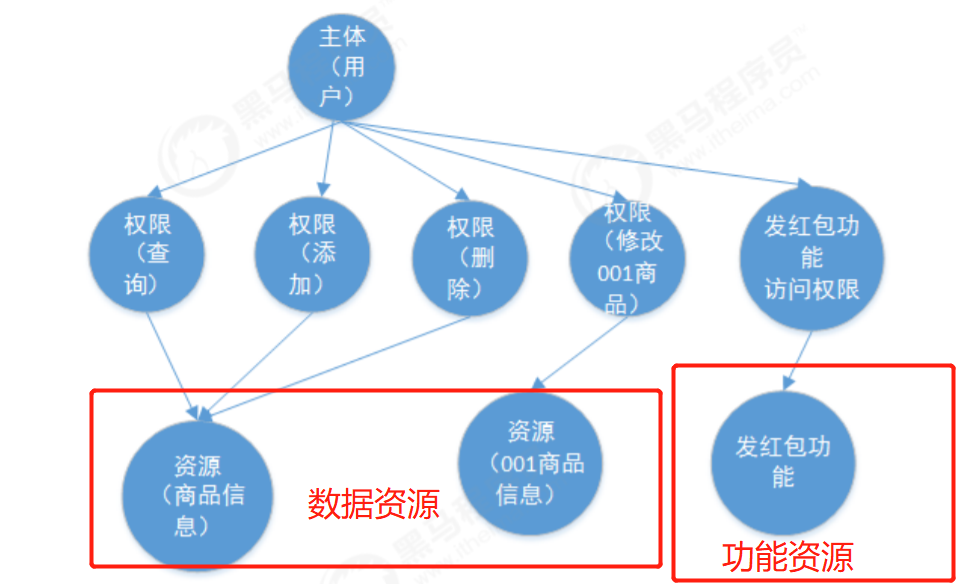
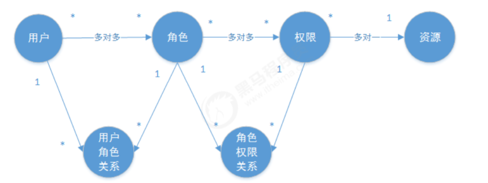
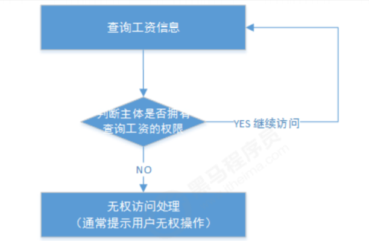

# 1.基本概念

## 1.1.什么是认证

系统为什么要认证？认证是为了保护系统的隐私数据与资源，用户的身份合法方可访问该系统的资源。

认证 ：用户认证就是判断一个用户的身份是否合法的过程，用户去访问系统资源时系统要求验证用户的身份信
息，身份合法方可继续访问，不合法则拒绝访问。常见的用户身份认证方式有：用户名密码登录，二维码登录，手
机短信登录，指纹认证等方式。

## 1.2 什么是会话

用户认证通过后，为了避免用户的每次操作都进行认证可将用户的信息保证在会话中。会话就是系统为了保持当前
用户的登录状态所提供的机制，常见的有基于session方式、基于token方式等。

基于session的认证方式如下图：


它的交互流程是，用户认证成功后，在服务端生成用户相关的数据保存在session(当前会话)中，发给客户端的
该session对应的sesssion_id ，客户端将该seession_id 存放到 cookie 中，这样用户客户端请求时带上 session_id 就可以验证服务器端是否存在改session_id对应的 session 数据，以此完成用户的合法校验，当用户退出系统或session过期销毁时，客户端的session_id也就无效了。

基于token方式如下图：


它的交互流程是，用户认证成功后，服务端生成一个token发给客户端，客户端可以放到 cookie 或 localStorage
等存储中，每次请求时带上 token，服务端收到token通过验证后即可确认用户身份

基于session的认证方式由Servlet规范定制，服务端要存储session信息需要占用内存资源，客户端需要支持
cookie；基于token的方式则一般不需要服务端存储token，并且不限制客户端的存储方式。如今移动互联网时代
更多类型的客户端需要接入系统，系统多是采用前后端分离的架构进行实现，所以基于token的方式更适合。

## 1.2 什么是授权

认证是为了保证用户身份的合法性，授权则是为了更细粒度的对隐私数据进行划分，授权是在认证通过后发生的，
控制不同的用户能够访问不同的资源。
授权： 授权是用户认证通过根据用户的权限来控制用户访问资源的过程，拥有资源的访问权限则正常访问，没有
权限则拒绝访问。

## 1.3 授权的数据模型

如何进行授权即如何对用户访问资源进行控制，首先需要学习授权相关的数据模型。
授权可简单理解为Who对What(which)进行How操作，包括如下：

1. Who，即主体（Subject），主体一般是指用户，也可以是程序如爬虫，需要访问系统中的资源。
2. What，即资源（Resource），如系统菜单、页面、按钮、代码方法、系统商品信息、系统订单信息等。
   1. 系统菜单、页面、按钮、代码方法都属于系统功能资源，对于web系统每个功能资源通常对应一个URL；
   2. 系统商品信息、系统订单信息都属于实体资源（数据资源），实体资源由资源类型和资源实例组成，比如商品信息为资源类型，商品编号 为001的商品为资源实例。 
3. How，权限/许可（Permission），规定了用户对资源的操作许可，权限离开资源没有意义，如用户对某资源的查询权限、用户对某资源的添加权限、用户对某的某个代码方法的调用权限、用户对编号为001商品修改权限等，通过权限可知用户对哪些资源都有哪些操作许可。

主体、资源、权限关系如下图：



主体、资源、权限相关的数据模型如下：

1. 主体（用户id、账号、密码、...）
2. 资源（资源id、资源名称、访问地址、...）
3. 权限（权限id、权限标识、权限名称、资源id、...）
4. 角色（角色id、角色名称、...）
5. 角色和权限关系（角色id、权限id、...）
6. 主体（用户）和角色关系（用户id、角色id、...）



通常企业开发中将资源和权限表合并为一张权限表，如下：

资源（资源id、资源名称、访问地址、...）
权限（权限id、权限标识、权限名称、资源id、...）
合并为：
权限（权限id、权限标识、权限名称、资源名称、资源访问地址、...）
修改后数据模型之间的关系如下图：


## 1.4 RBAC

如何实现授权？业界通常基于RBAC实现授权。

### 1.4.1 基于角色的访问控制

RBAC基于角色的访问控制（Role-Based Access Control）是按角色进行授权，比如：主体的角色为总经理可以查
询企业运营报表，查询员工工资信息等，访问控制流程如下：


根据上图中的判断逻辑，授权代码可表示如下：

```java
if(主体.hasRole("总经理角色id")){
	查询工资
}

```

如果上图中查询工资所需要的角色变化为总经理和部门经理，此时就需要修改判断逻辑为“判断用户的角色是否是
总经理或部门经理”，修改代码如下：

```java
if(主体.hasRole("总经理角色id") || 主体.hasRole("部门经理角色id")){
	查询工资
}
```

根据上边的例子发现，当需要修改角色的权限时就需要修改授权的相关代码，系统可扩展性差。

### 1.4.2 基于资源的访问控制

RBAC基于资源的访问控制（Resource-Based Access Control）是按资源（或权限）进行授权，比如：用户必须
具有查询工资权限才可以查询员工工资信息等，访问控制流程如下：



根据上图中的判断，授权代码可以表示为：

```java
if(主体.hasPermission("查询工资权限标识")){
	查询工资
}
```

优点：系统设计时定义好查询工资的权限标识，即使查询工资所需要的角色变化为总经理和部门经理也不需要修改
授权代码，系统可扩展性强。

# 2 基于Session的认证方式

基于Session的认证机制由Servlet规范定制，Servlet容器已实现，用户通过HttpSession的操作方法即可实现，如
下是HttpSession相关的操作API。


代码实例：参考物品管理项目；

# 3.Spring Security快速上手

## 3.3 认证

### 3.3.2.安全配置

spring security提供了用户名密码登录、退出、会话管理等认证功能，只需要配置即可使用。

1) 在config包下定义WebSecurityConfig，安全配置的内容包括：用户信息、密码编码器、安全拦截机制。

```java
@EnableWebSecurit
 public class WebSecurityConfig extends WebSecurityConfigurerAdapter {
        //配置用户信息服务，用来告诉spring security怎么查询用户的信息
        @Bean
        public UserDetailsService userDetailsService() {
            InMemoryUserDetailsManager manager = new InMemoryUserDetailsManager();
            manager.createUser(User.withUsername("zhangsan").password("123").authorities("p1").build());
            manager.createUser(User.withUsername("lisi").password("456").authorities("p2").build());
            return manager;
        }
     // 密码编码器
        @Bean
        public PasswordEncoder passwordEncoder() {
            return NoOpPasswordEncoder.getInstance();
        }
        //配置安全拦截机制
        @Override
        protected void configure(HttpSecurity http) throws Exception {
            http
                .authorizeRequests()
                .antMatchers("/r/**").authenticated() （1）
                .anyRequest().permitAll() （2）
                .and()
                .formLogin().successForwardUrl("/login‐success"); （3）
        }
    }
```

在userDetailsService()方法中，我们返回了一个UserDetailsService给spring容器，Spring Security会使用它来
获取用户信息。我们暂时使用InMemoryUserDetailsManager实现类，并在其中分别创建了zhangsan、lisi两个用
户，并设置密码和权限。

而在configure()中，我们通过HttpSecurity设置了安全拦截规则，其中包含了以下内容：
（1）url匹配/r/**的资源，经过认证后才能访问。
（2）其他url完全开放。
（3）支持form表单认证，认证成功后转向/login-success。
