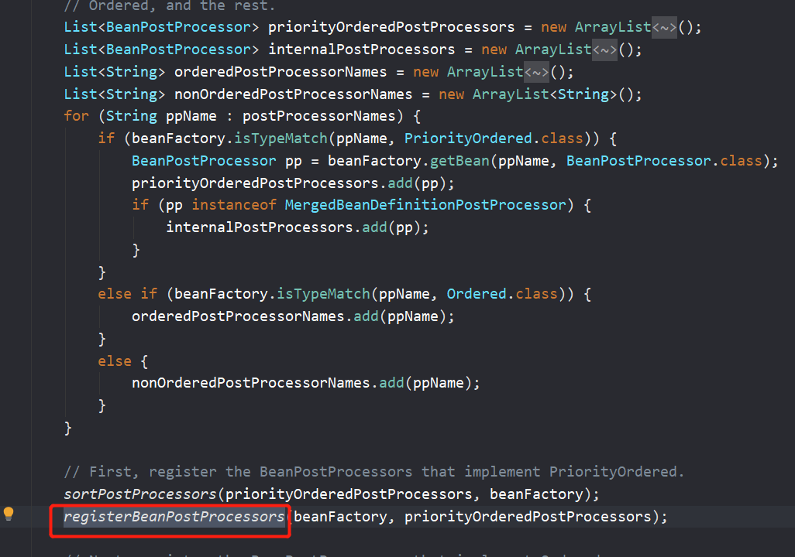
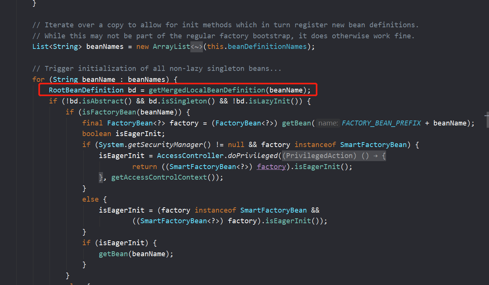

Spring容器的refresh()【创建刷新】;

# 1 prepareRefresh()

刷新前的预处理;

   1）、initPropertySources()这是一个空的方法，用来初始化一些属性设置;AbstractApplicationContext的子类自定义个性化的属性设置方法；

   

2）、getEnvironment().validateRequiredProperties();检验属性的合法等

 3）、earlyApplicationEvents= new LinkedHashSet<ApplicationEvent>();保存容器中的一些早期的事件；

如上

# 2 obtainFreshBeanFactory()

获取BeanFactory；
   1）、GenericApplicationContext.refreshBeanFactory();刷新【创建】BeanFactory；
         创建了一个this.beanFactory = new DefaultListableBeanFactory();设置id；

   2）、getBeanFactory();返回刚才GenericApplicationContext创建的BeanFactory对象；

   3）、将创建的BeanFactory【DefaultListableBeanFactory】返回；

# 3 prepareBeanFactory(beanFactory)

BeanFactory的预准备工作（BeanFactory进行一些设置）；
   1）、设置BeanFactory的类加载器、支持表达式解析器...

   2）、添加部分BeanPostProcessor【类型是ApplicationContextAwareProcessor】

   3）、设置忽略的自动装配的接口EnvironmentAware、EmbeddedValueResolverAware、xxx；

   4）、注册可以解析的自动装配；我们能直接在任何组件中自动注入：
         BeanFactory、ResourceLoader、ApplicationEventPublisher、ApplicationContext

   5）、添加BeanPostProcessor【类型是ApplicationListenerDetector】

   6）、添加编译时的AspectJ；

   7）、给BeanFactory中注册一些能用的组件；
      environment【类型是ConfigurableEnvironment】、
      systemProperties【类型是Map<String, Object>】、
      systemEnvironment【类型是Map<String, Object>】

# 4 postProcessBeanFactory(beanFactory)

BeanFactory准备工作完成后进行的后置处理工作；
   1）、需要自类重写这个方法，子类通过重写这个方法来在BeanFactory创建并预准备完成以后做进一步的设置

======================以上是BeanFactory的创建及预准备工作==================================

# 5 invokeBeanFactoryPostProcessors(beanFactory)

这个之前讲过了

执行BeanFactoryPostProcessor的方法；

   BeanFactoryPostProcessor：BeanFactory的后置处理器。在BeanFactory标准初始化之后执行的；
   两个接口：BeanFactoryPostProcessor、BeanDefinitionRegistryPostProcessor
   1）、执行BeanFactoryPostProcessor的方法；

​      先执行BeanDefinitionRegistryPostProcessor
​      1）、获取所有的BeanDefinitionRegistryPostProcessor；
​      2）、看先执行实现了PriorityOrdered优先级接口的BeanDefinitionRegistryPostProcessor、
​         postProcessor.postProcessBeanDefinitionRegistry(registry)
​      3）、在执行实现了Ordered顺序接口的BeanDefinitionRegistryPostProcessor；
​         postProcessor.postProcessBeanDefinitionRegistry(registry)
​      4）、最后执行没有实现任何优先级或者是顺序接口的BeanDefinitionRegistryPostProcessors；
​         postProcessor.postProcessBeanDefinitionRegistry(registry)

​      再执行BeanFactoryPostProcessor的方法
​      1）、获取所有的BeanFactoryPostProcessor
​      2）、看先执行实现了PriorityOrdered优先级接口的BeanFactoryPostProcessor、
​         postProcessor.postProcessBeanFactory()
​      3）、在执行实现了Ordered顺序接口的BeanFactoryPostProcessor；
​         postProcessor.postProcessBeanFactory()
​      4）、最后执行没有实现任何优先级或者是顺序接口的BeanFactoryPostProcessor；
​         postProcessor.postProcessBeanFactory()

# 6 registerBeanPostProcessors(beanFactory)

注册BeanPostProcessor（Bean的后置处理器）【 intercept bean creation 拦截bean的创建过程】
      不同接口类型的BeanPostProcessor；在Bean创建前后的执行时机是不一样的
      BeanPostProcessor、
      DestructionAwareBeanPostProcessor、
      InstantiationAwareBeanPostProcessor、
      SmartInstantiationAwareBeanPostProcessor、
      MergedBeanDefinitionPostProcessor
      

      1）、获取所有的 BeanPostProcessor;我们可以发现后置处理器都默认可以通过PriorityOrdered、Ordered接口来执行优先级
      2）、先注册PriorityOrdered优先级接口的BeanPostProcessor；
         把每一个BeanPostProcessor；添加到BeanFactory中
         beanFactory.addBeanPostProcessor(postProcessor);

​      3）、再注册Ordered接口的
​      4）、最后注册没有实现任何优先级接口的
​      5）、最终注册MergedBeanDefinitionPostProcessor；
​      6）、注册一个ApplicationListenerDetector；

注册一个ApplicationListenerDetector；它的作用是来在Bean创建完成后检查是否是ApplicationListener，如果是
         applicationContext.addApplicationListener((ApplicationListener<?>) bean);

# 7 initMessageSource()

初始化MessageSource组件（做国际化功能；消息绑定，消息解析）；
      1）、获取BeanFactory

​      2）、看容器中是否有id为messageSource的，类型是MessageSource的组件
​         如果有赋值给messageSource，如果没有自己创建一个DelegatingMessageSource；

MessageSource：取出国际化配置文件中的某个key的值；能按照区域信息获取；

 3）、把创建好的MessageSource注册在容器中，以后获取国际化配置文件的值的时候，可以自动注入MessageSource；
         beanFactory.registerSingleton(MESSAGE_SOURCE_BEAN_NAME, this.messageSource);   
         MessageSource.getMessage(String code, Object[] args, String defaultMessage, Locale locale);

# 8 initApplicationEventMulticaster()

初始化事件派发器；
      1）、获取BeanFactory
      2）、从BeanFactory中获取applicationEventMulticaster的ApplicationEventMulticaster；
      3）、如果上一步没有配置；创建一个SimpleApplicationEventMulticaster

​      4）、将创建的ApplicationEventMulticaster添加到BeanFactory中，以后其他组件直接自动注入

# 9 onRefresh()

留给子容器（子类）
      1、子类重写这个方法，在容器刷新的时候可以自定义逻辑；

# 10 registerListeners() 

给容器中将所有项目里面的ApplicationListener注册进来；

​      1、从容器中拿到所有的ApplicationListener
​      2、将每个监听器添加到事件派发器中；
​         getApplicationEventMulticaster().addApplicationListenerBean(listenerBeanName);
​      3、如果之前有事件，那么先派发之前步骤产生的事件；

# 11 finishBeanFactoryInitialization(beanFactory)

   1、beanFactory.preInstantiateSingletons();初始化后剩下的单实例bean
      1）、获取容器中的所有Bean，依次进行初始化和创建对象

​     

 2）、获取Bean的定义信息；RootBeanDefinition

​      3）、Bean不是抽象的，是单实例的，不是懒加载；

​         1）、判断是否是FactoryBean；是否是实现FactoryBean接口的Bean；

​        

 2）、不是工厂Bean。利用getBean(beanName);创建对象

放我们来看看getBean() 的步骤：          

  0、getBean(beanName)； ioc.getBean();

1、doGetBean(name, null, null, false);

​            2、先获取缓存中保存的单实例Bean。如果能获取到说明这个Bean之前被创建过（所有创建过的单实例Bean都会被缓存起来）
​               从private final Map<String, Object> singletonObjects = new ConcurrentHashMap<String, Object>(256);获取的

​            3、缓存中获取不到，开始Bean的创建对象流程；

​            4、回到doGetBean()，标记当前bean已经被创建

​            5、获取Bean的定义信息；

​            6、【获取当前Bean依赖的其他Bean;如果有按照getBean()把依赖的Bean先创建出来；】

​         

如果有按照getBean()把依赖的Bean先创建出来

   7、启动单实例Bean的创建流程；

​               1）、createBean(beanName, mbd, args);
​               2）、Object bean = resolveBeforeInstantiation(beanName, mbdToUse);让BeanPostProcessor先拦截返回代理对象；
​                  【InstantiationAwareBeanPostProcessor】：提前执行；

​                  先触发：postProcessBeforeInstantiation()；

​                  如果有返回值：触发postProcessAfterInitialization()；

​               3）、如果前面的InstantiationAwareBeanPostProcessor没有返回代理对象；调用4）
​               4）、Object beanInstance = doCreateBean(beanName, mbdToUse, args);创建Bean
​                   1）、【创建Bean实例】；createBeanInstance(beanName, mbd, args);
​                     利用工厂方法或者对象的构造器创建出Bean实例；
​                   2）、applyMergedBeanDefinitionPostProcessors(mbd, beanType, beanName);
​                     调用MergedBeanDefinitionPostProcessor的postProcessMergedBeanDefinition(mbd, beanType, beanName);
​                   3）、【Bean属性赋值】populateBean(beanName, mbd, instanceWrapper);
​                     赋值之前：
​                     1）、拿到InstantiationAwareBeanPostProcessor后置处理器；
​                        postProcessAfterInstantiation()；
​                     2）、拿到InstantiationAwareBeanPostProcessor后置处理器；
​                        postProcessPropertyValues()；
​                     =====赋值之前：===
​                     3）、应用Bean属性的值；为属性利用