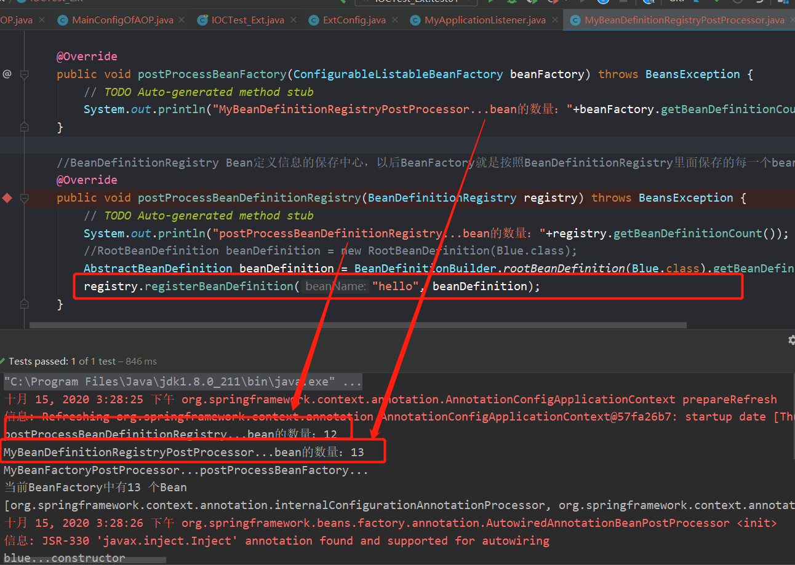

# BeanFactoryPostProcessor原理


 1、BeanFactoryPostProcessor：beanFactory的后置处理器；
		在BeanFactory标准初始化之后调用，来定制和修改BeanFactory的内容；所有的bean定义已经保存加载到beanFactory，但是bean的实例还未创建

BeanFactoryPostProcessor实现了beanFactory接口


运行测试，可以发现BeanFactoryPostProcessor在BeanFactory标准初始化之后调用，但是bean的实例还未创建


```
BeanFactoryPostProcessor原理:
1)、ioc容器创建对象
2)、invokeBeanFactoryPostProcessors(beanFactory);
		如何找到所有的BeanFactoryPostProcessor并执行他们的方法；
			1）、直接在BeanFactory中找到所有类型是BeanFactoryPostProcessor的组件，并执行他们的方法
			2）、在初始化创建其他组件前面执行
2、BeanDefinitionRegistryPostProcessor extends BeanFactoryPostProcessor
		postProcessBeanDefinitionRegistry();
		在所有bean定义信息将要被加载，bean实例还未创建的；
		优先于BeanFactoryPostProcessor执行；
		利用BeanDefinitionRegistryPostProcessor给容器中再额外添加一些组件；
```

在这里打一个断点


invokeBeanFactoryPostProcessors(beanFactory);执行BeanFactoryPostProcessors(beanFactory)


然后跳转到这里


来看看上图的代码的下面

让我们来看看是如何找到所有的BeanFactoryPostProcessor并执行他们的方法； 

直接在BeanFactory中找到所有类型是BeanFactoryPostProcessor的组件先进行分类，然后再执行他们的方法 ；


将上面分好组的postProcessorNames再转化为BeanFactotyPostPorcessor


然后执行inovokeBeanFactoryPostProcessors()方法


让我们看看这个方法


我们可以看到BeanFactoryPostProcessors是在初始化创建其他组件前面执行


# BeanDefinitionRegistryPostProcessor 

```
BeanDefinitionRegistryPostProcessor extends BeanFactoryPostProcessor
```

BeanDefinitionRegistryPostProcessor 是BeanFactoryPostProcessor的子接口，多定义了一个

postProcessBeanDefinitionRegistry()方法。这个方法的执行时机：在所有bean定义信息将要被加载，bean实例还未创建的；利用BeanDefinitionRegistryPostProcessor给容器中再额外添加一些组件


我们来实现BeanDefinitionRegistryPostProcessor接口：


可以看到，在我们注册了一个bean之后，数量增加了一个；BeanDefinitionRegistryPostProcessor 是先于BeanFactoryPostProcessor执行的




让我们分析一下他的原理：

	原理：
		1）、ioc创建对象
		2）、refresh()-》invokeBeanFactoryPostProcessors(beanFactory);
		3）、从容器中获取到所有的BeanDefinitionRegistryPostProcessor组件。
			1、依次触发所有的postProcessBeanDefinitionRegistry()方法
			2、再来触发postProcessBeanFactory()方法BeanFactoryPostProcessor；
		4）、再来从容器中找到BeanFactoryPostProcessor组件；然后依次触发postProcessBeanFactory()方法


refresh()-》invokeBeanFactoryPostProcessors(beanFactory);


从容器中获取到所有的BeanDefinitionRegistryPostProcessor组件


1、依次触发所有的postProcessBeanDefinitionRegistry()方法


2、再来触发postProcessBeanFactory()方法BeanFactoryPostProcessor；


4）、再来从容器中找到BeanFactoryPostProcessor组件；然后依次触发postProcessBeanFactory()方法


# 3、ApplicationListener

```
3、ApplicationListener：监听容器中发布的事件。事件驱动模型开发；
	  public interface ApplicationListener<E extends ApplicationEvent>
		监听 ApplicationEvent 及其下面的子事件；
	 步骤：
		1）、写一个监听器（ApplicationListener实现类）来监听某个事件（ApplicationEvent及其子类）
			@EventListener;
			原理：使用EventListenerMethodProcessor处理器来解析方法上的@EventListener；
		2）、把监听器加入到容器；
		3）、只要容器中有相关事件的发布，我们就能监听到这个事件；
				ContextRefreshedEvent：容器刷新完成（所有bean都完全创建）会发布这个事件；
				ContextClosedEvent：关闭容器会发布这个事件；
		4）、发布一个事件：
				applicationContext.publishEvent()；


```

1）、写一个监听器（ApplicationListener实现类）来监听某个事件

我们这里监听ApplicationEvent及其子类


我们写一个监听器（ApplicationListener实现类）来监听某个事件（必须是ApplicationEvent及其子类）；把监听器加入到容器；只要容器中有相关事件的发布，我们就能监听到这个事件；

ContextRefreshedEvent：容器刷新完成（所有bean都完全创建）spring会发布这个事件；ContextClosedEvent：关闭容器spring会发布这个事件；

我们也可以自己发布一个事件：applicationContext.publishEvent()；


```
扩展原理：
BeanPostProcessor：bean后置处理器，bean创建对象初始化前后进行拦截工作的
1、BeanFactoryPostProcessor：beanFactory的后置处理器；
		在BeanFactory标准初始化之后调用，来定制和修改BeanFactory的内容；
		所有的bean定义已经保存加载到beanFactory，但是bean的实例还未创建
BeanFactoryPostProcessor原理:
1)、ioc容器创建对象
2)、invokeBeanFactoryPostProcessors(beanFactory);
		如何找到所有的BeanFactoryPostProcessor并执行他们的方法；
			1）、直接在BeanFactory中找到所有类型是BeanFactoryPostProcessor的组件，并执行他们的方法
			2）、在初始化创建其他组件前面执行
2、BeanDefinitionRegistryPostProcessor extends BeanFactoryPostProcessor
		postProcessBeanDefinitionRegistry();
		在所有bean定义信息将要被加载，bean实例还未创建的；
		优先于BeanFactoryPostProcessor执行；
		利用BeanDefinitionRegistryPostProcessor给容器中再额外添加一些组件；
	原理：
		1）、ioc创建对象
		2）、refresh()-》invokeBeanFactoryPostProcessors(beanFactory);
		3）、从容器中获取到所有的BeanDefinitionRegistryPostProcessor组件。
			1、依次触发所有的postProcessBeanDefinitionRegistry()方法
			2、再来触发postProcessBeanFactory()方法BeanFactoryPostProcessor；
		4）、再来从容器中找到BeanFactoryPostProcessor组件；然后依次触发postProcessBeanFactory()方法
	
3、ApplicationListener：监听容器中发布的事件。事件驱动模型开发；
	  public interface ApplicationListener<E extends ApplicationEvent>
		监听 ApplicationEvent 及其下面的子事件；
	 步骤：
		1）、写一个监听器（ApplicationListener实现类）来监听某个事件（ApplicationEvent及其子类）
			@EventListener;
			原理：使用EventListenerMethodProcessor处理器来解析方法上的@EventListener；
		2）、把监听器加入到容器；
		3）、只要容器中有相关事件的发布，我们就能监听到这个事件；
				ContextRefreshedEvent：容器刷新完成（所有bean都完全创建）会发布这个事件；
				ContextClosedEvent：关闭容器会发布这个事件；
		4）、发布一个事件：
				applicationContext.publishEvent()；
	
 原理：
 	ContextRefreshedEvent、IOCTest_Ext$1[source=我发布的时间]、ContextClosedEvent；
 1）、ContextRefreshedEvent事件：
 	1）、容器创建对象：refresh()；
 	2）、finishRefresh();容器刷新完成会发布ContextRefreshedEvent事件
 2）、自己发布事件；
 3）、容器关闭会发布ContextClosedEvent；
 
 【事件发布流程】：
 	3）、publishEvent(new ContextRefreshedEvent(this));
 			1）、获取事件的多播器（派发器）：getApplicationEventMulticaster()
 			2）、multicastEvent派发事件：
 			3）、获取到所有的ApplicationListener；
 				for (final ApplicationListener<?> listener : getApplicationListeners(event, type)) {
 				1）、如果有Executor，可以支持使用Executor进行异步派发；
 					Executor executor = getTaskExecutor();
 				2）、否则，同步的方式直接执行listener方法；invokeListener(listener, event);
 				 拿到listener回调onApplicationEvent方法；
 
 【事件多播器（派发器）】
 	1）、容器创建对象：refresh();
 	2）、initApplicationEventMulticaster();初始化ApplicationEventMulticaster；
 		1）、先去容器中找有没有id=“applicationEventMulticaster”的组件；
 		2）、如果没有this.applicationEventMulticaster = new SimpleApplicationEventMulticaster(beanFactory);
 			并且加入到容器中，我们就可以在其他组件要派发事件，自动注入这个applicationEventMulticaster；
 
 【容器中有哪些监听器】
 	1）、容器创建对象：refresh();
 	2）、registerListeners();
 		从容器中拿到所有的监听器，把他们注册到applicationEventMulticaster中；
 		String[] listenerBeanNames = getBeanNamesForType(ApplicationListener.class, true, false);
 		//将listener注册到ApplicationEventMulticaster中
 		getApplicationEventMulticaster().addApplicationListenerBean(listenerBeanName);
 		
  SmartInitializingSingleton 原理：->afterSingletonsInstantiated();
  		1）、ioc容器创建对象并refresh()；
  		2）、finishBeanFactoryInitialization(beanFactory);初始化剩下的单实例bean；
  			1）、先创建所有的单实例bean；getBean();
  			2）、获取所有创建好的单实例bean，判断是否是SmartInitializingSingleton类型的；
  				如果是就调用afterSingletonsInstantiated();
		
```

