# **一、容器基础 XmlBeanFactory**

## 1、XmlBeanFactory启动流程图分析

https://www.processon.com/view/link/5f0fd2af7d9c081beab985bb

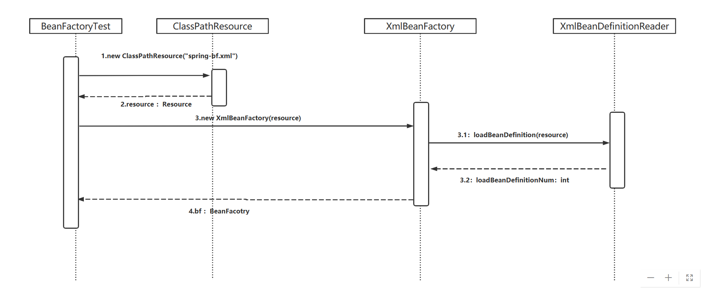


## 2、配置文件封装Resource接口

https://www.processon.com/view/link/5f0fd93a7d9c081beab98f76

Resource接口的作用：继承了InputStream接口，可以读取配置资源文件

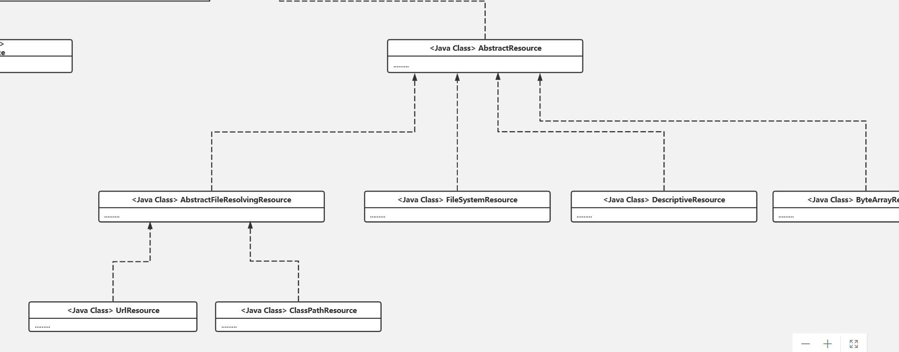

## 3、加载Bean流程图分析


## 4、加载Bean源码分析（外层包装逻辑，非解析bd逻辑）

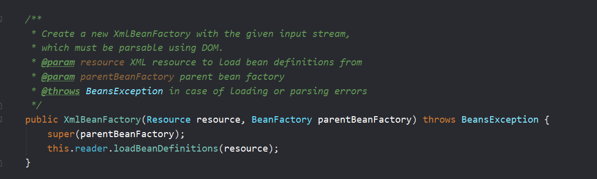


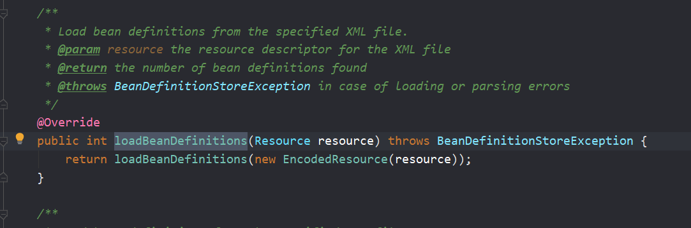

EncodedResource类可以指定编码集，一般不用指定编码，encoding(指定编码格式)和charset(指定字符集)为null；

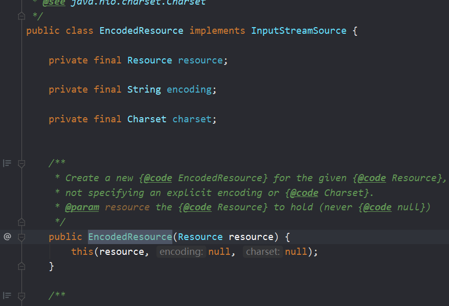

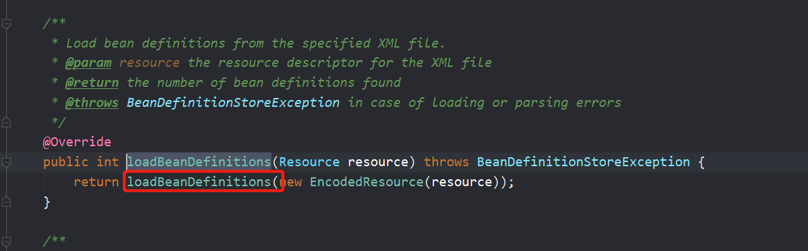

```java
public int loadBeanDefinitions(EncodedResource encodedResource) throws BeanDefinitionStoreException {
   Assert.notNull(encodedResource, "EncodedResource must not be null");
   if (logger.isInfoEnabled()) {
      logger.info("Loading XML bean definitions from " + encodedResource.getResource());
   }

   // 这是个ThreadLocal字段，用于拿到当前线程已经加载过的EncodedResource
   Set<EncodedResource> currentResources = this.resourcesCurrentlyBeingLoaded.get();
   if (currentResources == null) {
      currentResources = new HashSet<EncodedResource>(4);
      this.resourcesCurrentlyBeingLoaded.set(currentResources);
   }
   if (!currentResources.add(encodedResource)) {
      throw new BeanDefinitionStoreException(
            "Detected cyclic loading of " + encodedResource + " - check your import definitions!");
   }
   
   // 拿到 encodedResource 包装的 inputStream对象
   try {
      InputStream inputStream = encodedResource.getResource().getInputStream();
      try {
         // 因为接下来要使用sax解析器解析xml，所以需要将输入流包装成 inputSource， inputSource 是sax中用来表示资源的对象
         InputSource inputSource = new InputSource(inputStream);
         if (encodedResource.getEncoding() != null) {
            inputSource.setEncoding(encodedResource.getEncoding());
         }
         // 加载BeanDefinitions 的真正入口
         return doLoadBeanDefinitions(inputSource, encodedResource.getResource());
      }
      finally {
         inputStream.close();
      }
   }
   catch (IOException ex) {
      throw new BeanDefinitionStoreException(
            "IOException parsing XML document from " + encodedResource.getResource(), ex);
   }
   finally {
      // resourcesCurrentlyBeingLoaded表示当前线程正在加载的所有 resource ，直行到这里当前的这个resource就加载完了，所以要移除
      currentResources.remove(encodedResource);
      if (currentResources.isEmpty()) {
         // set为空了，所以要移除，防止内存泄漏
         this.resourcesCurrentlyBeingLoaded.remove();
      }
   }
}
```


```java
protected int doLoadBeanDefinitions(InputSource inputSource, Resource resource)
      throws BeanDefinitionStoreException {
   try {
      // 将 resource 转化为代码层面可以识别的具有层次结构的 Document
      Document doc = doLoadDocument(inputSource, resource);
      // 将Document 解析成 BeanDefinition ，并注册到BeanFactory中，返回注册的BeanDefinition的数量
      return registerBeanDefinitions(doc, resource);
   }
   catch (BeanDefinitionStoreException ex) {
      throw ex;
   }
   catch (SAXParseException ex) {
      throw new XmlBeanDefinitionStoreException(resource.getDescription(),
            "Line " + ex.getLineNumber() + " in XML document from " + resource + " is invalid", ex);
   }
   catch (SAXException ex) {
      throw new XmlBeanDefinitionStoreException(resource.getDescription(),
            "XML document from " + resource + " is invalid", ex);
   }
   catch (ParserConfigurationException ex) {
      throw new BeanDefinitionStoreException(resource.getDescription(),
            "Parser configuration exception parsing XML from " + resource, ex);
   }
   catch (IOException ex) {
      throw new BeanDefinitionStoreException(resource.getDescription(),
            "IOException parsing XML document from " + resource, ex);
   }
   catch (Throwable ex) {
      throw new BeanDefinitionStoreException(resource.getDescription(),
            "Unexpected exception parsing XML document from " + resource, ex);
   }
}
```


```java
protected Document doLoadDocument(InputSource inputSource, Resource resource) throws Exception {
   // 1. EntityResolver是做什么的？
    // 2. 验证模式是怎么获取的？
   return this.documentLoader.loadDocument(inputSource, getEntityResolver(), this.errorHandler,
         getValidationModeForResource(resource), isNamespaceAware());
}
```


```java
protected int getValidationModeForResource(Resource resource) {
   //获取默认validationMode
   int validationModeToUse = getValidationMode();
   //条件成立：说明set设置过 默认值，一般情况下 不会这样做。都是使用 自动检测。
   if (validationModeToUse != VALIDATION_AUTO) {
      return validationModeToUse;
   }


   //自动检查xml使用的是 哪种 验证模式。
   int detectedMode = detectValidationMode(resource);

   if (detectedMode != VALIDATION_AUTO) {
      return detectedMode;
   }
   // Hmm, we didn't get a clear indication... Let's assume XSD,
   // since apparently no DTD declaration has been found up until
   // detection stopped (before finding the document's root tag).
   return VALIDATION_XSD;
}
```


```java
protected int detectValidationMode(Resource resource) {
   //条件成立：说明文件是打开状态...当前程序没法再去读取了...
   if (resource.isOpen()) {
      throw new BeanDefinitionStoreException(
            "Passed-in Resource [" + resource + "] contains an open stream: " +
            "cannot determine validation mode automatically. Either pass in a Resource " +
            "that is able to create fresh streams, or explicitly specify the validationMode " +
            "on your XmlBeanDefinitionReader instance.");
   }


   InputStream inputStream;
   try {
      inputStream = resource.getInputStream();
   }
   catch (IOException ex) {
      throw new BeanDefinitionStoreException(
            "Unable to determine validation mode for [" + resource + "]: cannot open InputStream. " +
            "Did you attempt to load directly from a SAX InputSource without specifying the " +
            "validationMode on your XmlBeanDefinitionReader instance?", ex);
   }

   try {
	// 判断验证模式
      return this.validationModeDetector.detectValidationMode(inputStream);
   }
   catch (IOException ex) {
      throw new BeanDefinitionStoreException("Unable to determine validation mode for [" +
            resource + "]: an error occurred whilst reading from the InputStream.", ex);
   }
}
```

返回到这一层

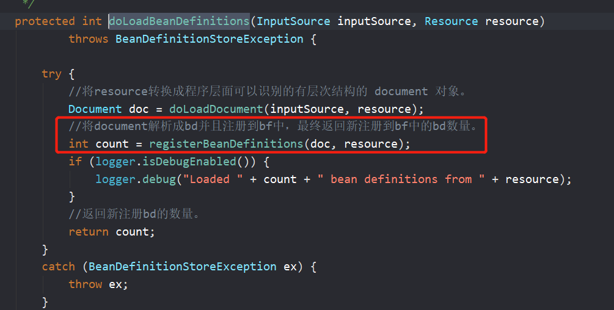


```java
public int registerBeanDefinitions(Document doc, Resource resource) throws BeanDefinitionStoreException {
   //创建一个 BeanDefinitionDocumentReader ，每个document对象，都会创建一个 beanDefinitionDocumentReader对象。
   BeanDefinitionDocumentReader documentReader = createBeanDefinitionDocumentReader();

   //getRegistry() 会返回咱们程序创建的 beanFactory实例。   countBefore：解析该doc之前，bf中已有的bd数量。
   int countBefore = getRegistry().getBeanDefinitionCount();

   //解析doc 并且注册到 bf中。
//xmlReaderContext：包含最主要的参数是 当前 this(即XmlBeanDefinitionReader) XmlBeanDefinitionReader又包含了beanfactory，所以可以吧doc解析来的东西注册到beanfacotory
   documentReader.registerBeanDefinitions(doc, createReaderContext(resource));

   //返回的新注册的bd数量。
   return getRegistry().getBeanDefinitionCount() - countBefore;
}
```


注意createReaderContext(resource)这个参数： 包含最主要的参数是 当前 this-> XmlBeanDefinitionReader -> bf。

```java
public XmlReaderContext createReaderContext(Resource resource) {
   return new XmlReaderContext(resource, this.problemReporter, this.eventListener,
         this.sourceExtractor, this, getNamespaceHandlerResolver());
}
```


看看这个方法：`public void registerBeanDefinitions(Document doc, XmlReaderContext readerContext) {}`

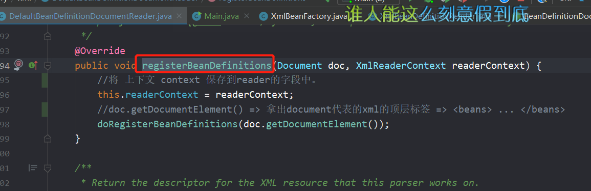


```java
protected void doRegisterBeanDefinitions(Element root) {
   // Any nested <beans> elements will cause recursion in this method. In
   // order to propagate and preserve <beans> default-* attributes correctly,
   // keep track of the current (parent) delegate, which may be null. Create
   // the new (child) delegate with a reference to the parent for fallback purposes,
   // then ultimately reset this.delegate back to its original (parent) reference.
   // this behavior emulates a stack of delegates without actually necessitating one.
   BeanDefinitionParserDelegate parent = this.delegate;


   //方法返回一个beans标签 解析器对象。
   this.delegate = createDelegate(getReaderContext(), root, parent);

   //一般情况下，条件成立。
   if (this.delegate.isDefaultNamespace(root)) {
      //获取beans标签 属性 profile：  dev/prod/pre..
      String profileSpec = root.getAttribute(PROFILE_ATTRIBUTE);
      //条件成立：说明beans标签上有 profile 属性 有值。
      if (StringUtils.hasText(profileSpec)) {
         //将profile 按照 ,; 拆分成字符串数组
         String[] specifiedProfiles = StringUtils.tokenizeToStringArray(
               profileSpec, BeanDefinitionParserDelegate.MULTI_VALUE_ATTRIBUTE_DELIMITERS);

         // We cannot use Profiles.of(...) since profile expressions are not supported
         // in XML config. See SPR-12458 for details.
         //environment.acceptsProfiles(String[] args) ：条件成立，说明beans标签可以继续解析成bd
         //条件成立：说明该beans标签不再继续解析。
         if (!getReaderContext().getEnvironment().acceptsProfiles(specifiedProfiles)) {
            if (logger.isDebugEnabled()) {
               logger.debug("Skipped XML bean definition file due to specified profiles [" + profileSpec +
                     "] not matching: " + getReaderContext().getResource());
            }
            return;
         }
      }
   }

   //这里是留给子类扩展的地方。
   preProcessXml(root);

   parseBeanDefinitions(root, this.delegate);

   //这里是留给子类扩展的地方。
   postProcessXml(root);

   this.delegate = parent;
}
```


# **二、获取XML的验证模式**

## 1、DTD/XSD 区别

https://note.youdao.com/ynoteshare1/index.html?id=6e316d7f2a7806df9a655b97f8c11f98&type=note

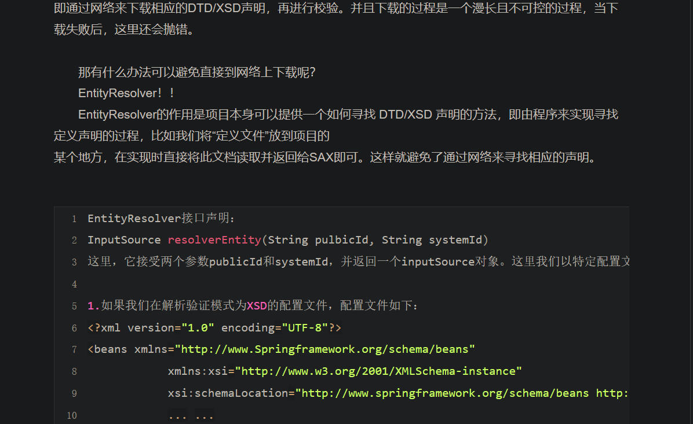


## 2、验证模式的读取

https://note.youdao.com/ynoteshare1/index.html?id=83cd921b931b16b378d81bb75e45d208&type=note


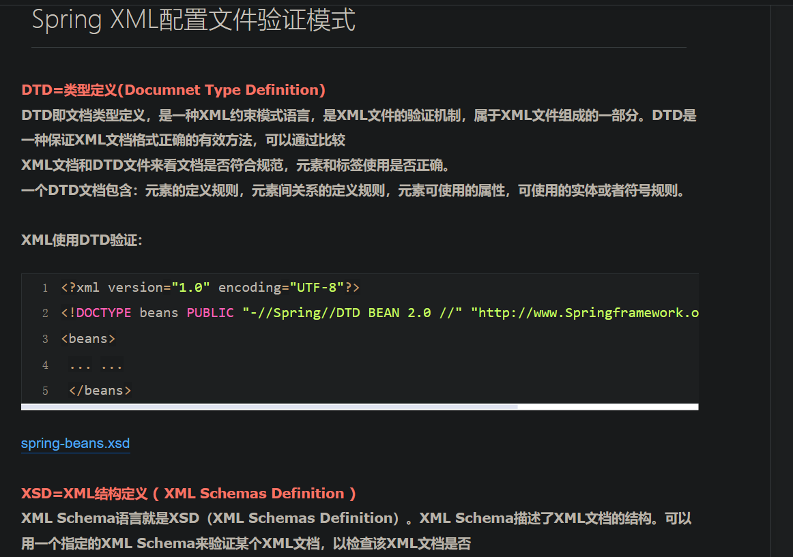

# **三、XML解析成程序可识别对象 Document**

## 1.EntityResolver用法

https://note.youdao.com/ynoteshare1/index.html?id=6e316d7f2a7806df9a655b97f8c11f98&type=note


# **四、解析并注册BeanDefinitions**

## 1.XmlBeanDefinitionReadr.registerBeanDefinitions(..) 源码分析（ps：不涉及解析document）

```java
public int registerBeanDefinitions(Document doc, Resource resource) throws BeanDefinitionStoreException {
   //创建一个 BeanDefinitionDocumentReader ，每个document对象，都会创建一个 beanDefinitionDocumentReader对象。
   BeanDefinitionDocumentReader documentReader = createBeanDefinitionDocumentReader();

   //getRegistry() 会返回咱们程序创建的 beanFactory实例。   countBefore：解析该doc之前，bf中已有的bd数量。
   int countBefore = getRegistry().getBeanDefinitionCount();

   //解析doc 并且注册到 bf中。
   //createReaderContext(resource)：包含最主要的参数是 当前 this(即XmlBeanDefinitionReader) XmlBeanDefinitionReader又包含了beanfactory，所以可以吧doc解析来的东西注册到beanfacotory
   documentReader.registerBeanDefinitions(doc, createReaderContext(resource));

   //返回的新注册的bd数量。
   return getRegistry().getBeanDefinitionCount() - countBefore;
}
```


**----------------------------------------------默认标签的解析（核心）--------------------------------------------------**


# **五、默认标签的解析**

## 1.BeanDefinition继承关系 / AbstractBeanDefiniton属性

https://www.processon.com/view/link/5f1167375653bb7fd23e18a4


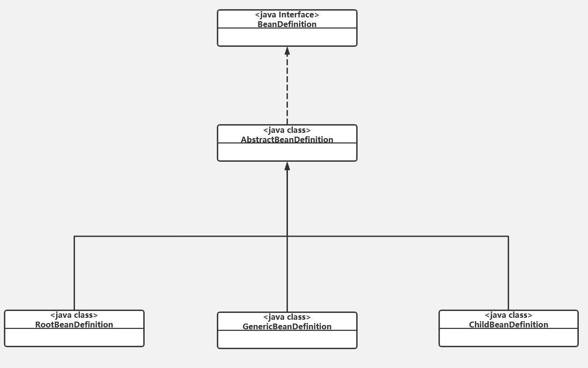


## 2.bean标签的解析及注册 

DefaultBeanDefinitionDocumentReader#registerBeanDefinitions()

```java
@Override
public void registerBeanDefinitions(Document doc, XmlReaderContext readerContext) {
   //将 上下文 context 保存到reader的字段中。
   this.readerContext = readerContext;
   //doc.getDocumentElement() => 拿出document代表的xml的顶层标签 => <beans> ... </beans>
   doRegisterBeanDefinitions(doc.getDocumentElement());
}
```


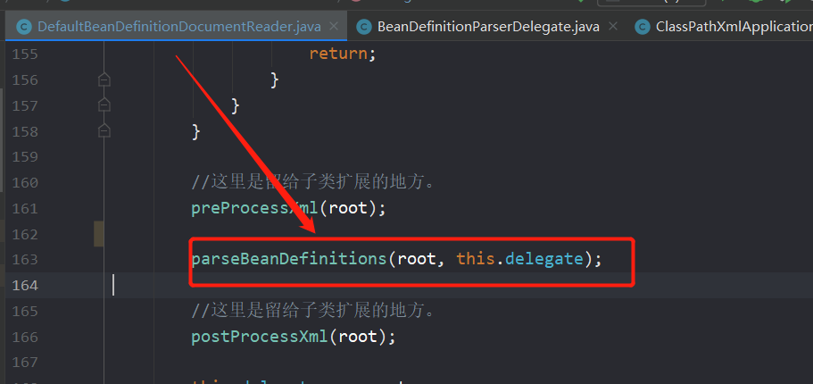


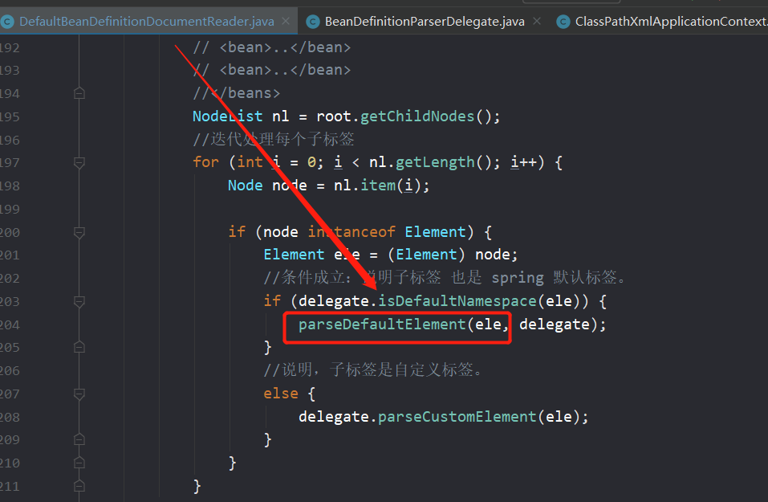


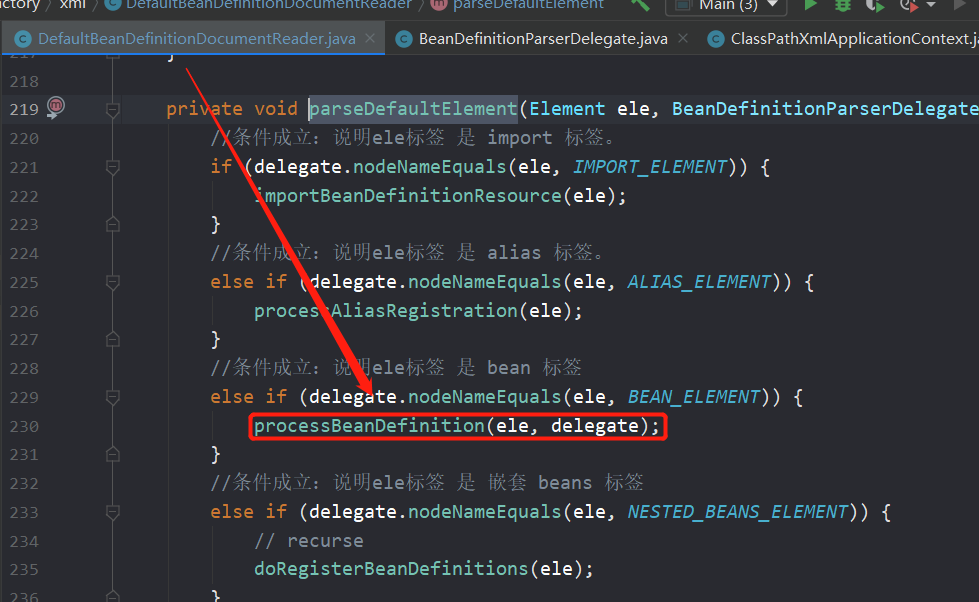


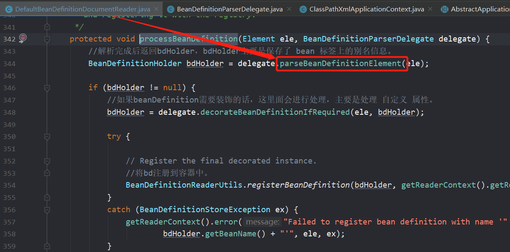


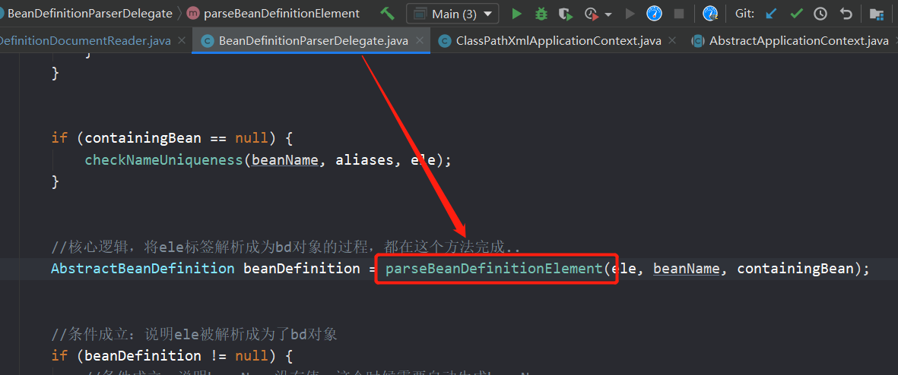


## 3.解析BeanDefinition

```java
public AbstractBeanDefinition parseBeanDefinitionElement(
      Element ele, String beanName, @Nullable BeanDefinition containingBean) {
   //表示当前 解析器状态 ，因为接下来要解析bean标签，所以状态设置为了 BeanEntry
   this.parseState.push(new BeanEntry(beanName));


   String className = null;
   //一般情况下 bean 标签都包含 class 属性，除非bean标签作为 parent 标签 让子标签继承时，class属性才为null。
   if (ele.hasAttribute(CLASS_ATTRIBUTE)) {
      //读取bean标签的className
      className = ele.getAttribute(CLASS_ATTRIBUTE).trim();
   }


   String parent = null;
   //bean标签可以继承parent标签，类似 子类 继承 父类。一般情况下，很少用到。
   if (ele.hasAttribute(PARENT_ATTRIBUTE)) {
      parent = ele.getAttribute(PARENT_ATTRIBUTE);
   }

   try {
      //创建出来了 一个 bd对象，bd对象仅仅设置了 class 信息.
      AbstractBeanDefinition bd = createBeanDefinition(className, parent);

      //解析bean标签上面定义的attribute信息：lazy-init、init-method、depends-on...
      parseBeanDefinitionAttributes(ele, beanName, containingBean, bd);

      //<bean>
      // <description>xxxxxx</description>
      // </bean>
      //将description子标签的信息 读取出来 保存到 bd中。
      bd.setDescription(DomUtils.getChildElementValueByTagName(ele, DESCRIPTION_ELEMENT));

      //解析
      // <bean>
      //    <meta key="meta_1" value="meta_val_1"/>
      //    <meta key="meta_2" value="meta_val_2"/>
      // </bean>
      parseMetaElements(ele, bd);

      //解析lookup-method子标签,bd.methodOverrides 属性 保存需要覆盖 复写的方法。 动态代理时实现。
      parseLookupOverrideSubElements(ele, bd.getMethodOverrides());

      //解析replace-method子标签
      parseReplacedMethodSubElements(ele, bd.getMethodOverrides());

      //解析构造方法参数子标签
      parseConstructorArgElements(ele, bd);
      //解析 属性 子标签
      parsePropertyElements(ele, bd);
      //解析 qualifier 子标签
      parseQualifierElements(ele, bd);

      bd.setResource(this.readerContext.getResource());
      bd.setSource(extractSource(ele));
      return bd;
   }
   catch (ClassNotFoundException ex) {
      error("Bean class [" + className + "] not found", ele, ex);
   }
   catch (NoClassDefFoundError err) {
      error("Class that bean class [" + className + "] depends on not found", ele, err);
   }
   catch (Throwable ex) {
      error("Unexpected failure during bean definition parsing", ele, ex);
   }
   finally {
      this.parseState.pop();
   }

   return null;
}
```

 

```xml
假设某个bean配置如下：
<bean id="xxxComponent" name="xxxComponent" class="xx.xx.xx.xxxComponent">
    <meta key="meta_1" value="meta_val_1"/>
    <meta key="meta_2" value="meta_val_2"/>
    ...
    
    <property name="key1" value="value1"/>
    <property name="key2" value="value2"/>
    ...
    
    
    <constructor-arg index="0">
        <value>aaa</value>
    </constructor-arg>
    <constructor-arg index="1">
        <value>bbb</value>
    </constructor-arg>
    <constructor-arg index="2">
        <map>
            <entry key="key" value="value">
            ...
        </map>
    </constructor-arg>
    
</bean>
```

###    3.1：解析bean的各种属性（Attribute）


###    3.2：解析meta子元素


###    3.3：解析lookup-method子元素

http://note.youdao.com/s/TZpskaeo


###    3.4：解析replaced-method子元素

http://note.youdao.com/s/K3OMeOsU


###    3.5：解析constructor-arg子元素


###    3.6：解析property子元素


###    3.7：解析qualifier子元素

```xml
    对于qualifier元素的获取，我们接触更多的是注解的形式，在使用Spring框架中进行自动注入时，Spring容器中匹配的候选Bean数目必须有且仅有一个。
当找不到一个匹配的Bean时，Spring容器将抛出BeanCreationException异常，并指出必须至少拥有一个匹配的Bean。
    Spring允许我们通过Qualifier指定注入Bean的名称，这样歧义就消除了，XML配置的方式如下：
<bean id="xxxComponent" class="xx.xx.xx.XxxComponent">
    <qualifier type="org.Springframework.beans.factory.annotation.Qualifier" value="qf"/>
</bean>               
```

​    

## 4.解析默认标签中的自定义标签元素

# **六、注册解析的BeanDefinition**

## 1.通过BeanName注册BeanDefinition

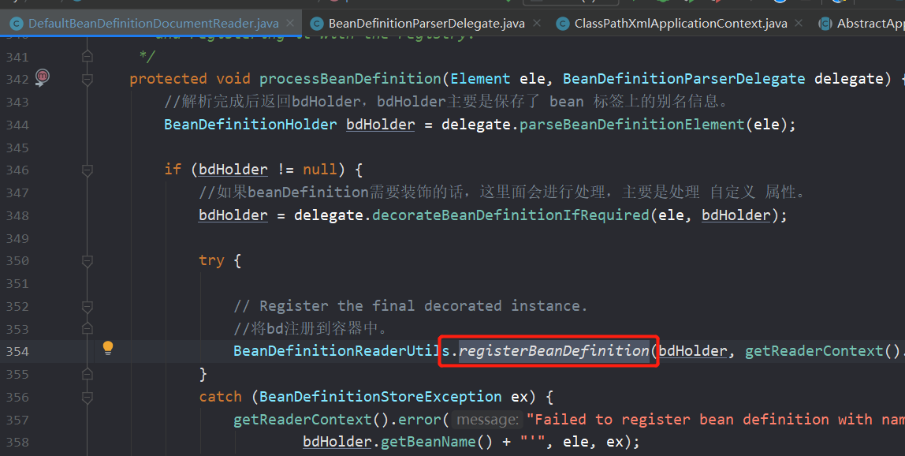

# 2.通过别名注册BeanDefinition


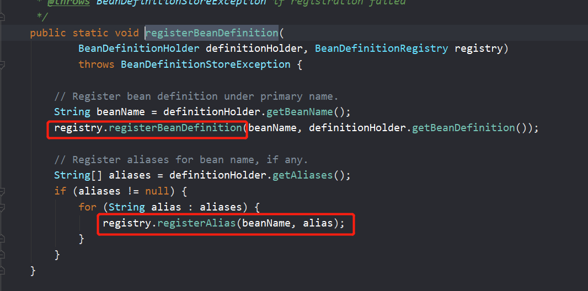

# **七、alias标签解析**

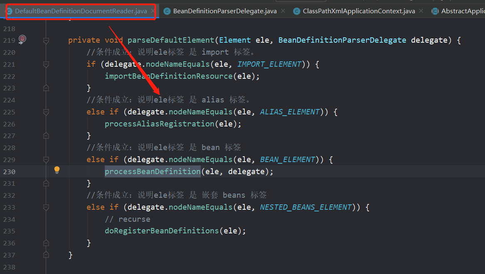

​                

```xml
<bean id="testBean" class="xx.xx.xx.xxBean"/>
1.要给这个JavaBean增加别名，以方便使用时，我们可以直接使用bean标签中的name属性：
<bean id="testBean" name="testBean,testBean2" class="xx.xx.xx.xxBean"/>
2.Spring还提供了 另外一种声明别名的方式：
<bean id="testBean" class="xx.xx.xx.xxBean"/>
<alias name="testBean" alias="testBean,testBean2"/>
```

# **八、import标签解析**


​         

```xml
<?xml version="1.0" encoding="UTF-8"?>
<beans xmlns="http://www.Springframework.org/schema/beans"
            xmlns:xsi="http://www.w3.org/2001/XMLSchema-instance"
            xsi:schemaLocation="http://www.springframework.org/schema/beans http://www.springframework.org/schema/beans/spring-beans.xsd">
            <import resource="application-business1.xml"/>
            <import resource="application-business2.xml"/>
            <import resource="application-business3.xml"/>
            ...
</beans>
```

  

# 两个时序图：

XmlBeanFactory初始化时序之加载bean流程图
https://www.processon.com/view/link/5f1111fa5653bb7fd23cd8c0


Bean标签解析及注册流程图
https://www.processon.com/view/link/5f1168ce1e08537d50b09348