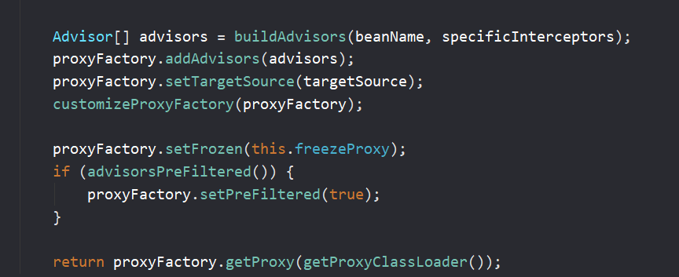

AOP 原理解析 跳转逻辑 代码演示

此文章分析过程：

1. 学习aop的api的使用
2. 查看@EnableAspectJAutoProxy的原理
3. 在2.2中分析出@EnableAspectJAutoProxy与后置处理器和BeanFactoryAware有关
4. 接着分析后置处理器SmartInstantiationAwareBeanPostProcessor  bean的注册逻辑
5. 

### 一、AOP功能测试


如果都放在了`MathCalculator`代码里，那就是一种耦合的方式


所以定义一个日志切面类(`LogAspects`)：切面类里面的方法需要动态感知MathCalculator.div运行到哪里，然后执行


```java
 通知方法：
* 前置通知(@Before)：logStart：在目标方法(div)运行之前运行
* 后置通知(@After)：logEnd：在目标方法(div)运行结束之后运行（无论方法正常结束还是异常结束）
* 返回通知(@AfterReturning)：logReturn：在目标方法(div)正常返回之后运行
* 异常通知(@AfterThrowing)：logException：在目标方法(div)出现异常以后运行
```

**先不用环绕通知,尝试前面4个**。注意不是`Junit`的`@Before`,`@After`

是`org.aspectj.lang.annotation.After;`

```java
@Before("top.p3wj.aop.MathCalculator.div")
```

如果想切`MathCalculator`的所有方法（且不区分参数，加"…"），即**`MathCalculator.\*(…)`**

1.1


但是看起来非常繁琐，有公共的切入点，所以**可以提取出来**。定义一个方法


1.2 讲业务逻辑类和切面类加入到容器中


1.3 告诉哪一个类是切面类


1.4 但是最后记住还要开启`AspectJ`。给配置类中加 `@EnableAspectJAutoProxy` 【开启基于注解的`aop`模式】


1.5 测试一下是否成功


发现并没有输出相应的东西，这是因为这是我们自己`new`的，只要容器中的组件才可以使用切面的功能

1.5.1 带异常


这下就有了

1.5.2 不带异常


2.1 那么怎么拿到运行时的信息呢？`JoinPoint`

2.1.1

`JoinPoint.getSignature`获得方法签名


获得方法名


参数列表


2.1.2

怎么获得返回值呢？`returning`属性


`returning`指定谁来封装这个返回值，比如我们用`Object result`来接受所有的返回值


2.1.3 获得异常，通过`throwing`

也跟`returning`一样要指定


不然会报红色，


这个也一样，如果不指定，`spring`不知道这个`exception`要干什么

加上后用1/0看一下结果


那么没有这个`@AfterThrowing`呢？


我们发现是对这个异常没有进行我们的一个处理的，并没有输出那一句话。

2.1.4 `JoinPoint`位置


我们发现，`JoinPotin`如果不放在第一个参数，`spring`是无法解析的

看一下异常：

```java
org.springframework.beans.factory.BeanCreationException: Error creating bean with name 'org.springframework.context.event.internalEventListenerProcessor': Initialization of bean failed; nested exception is java.lang.IllegalArgumentException: error at ::0 formal unbound in pointcut 
```

放在第一位就正常了


### 二、AOP原理

#### 2.1- @EnableAspectJAutoProxy （分析AnnotationAwareAspectJAutoProxyCreator继承体系）

`AOP`就是从`@EnableAspectJAutoProxy`开始的，加了就有`AOP`,不加就没有


我们点进去看一下


发现有`ImportBeanDefinitionRegistrar`，这是之前学的可以给容器`bean`中自定义注册


可以自定义地来注册，给`BeanDefinitionRegistry`

我们回到以前看看以前怎么做的，回到`MainConfig2`


`ImportSelector`


`ImportBeanDefinitionRegistrar`


那么`AspectJAutoProxyRegistrar`注册了什么`bean`呢？我们打一个断点`debug`一下
 

1.


注册这个组件，如果需要的情况下

2.


调用另一个方法，并传了`AnnotationAwareAspectJAutoProxyCreator.class`，我们`step into`进去瞧瞧

3.


3.1 判断是否容器中包含`org.springframework.aop.config.internalAutoProxyCreator`

3.2 包含则取得这个`org.springframework.aop.config.internalAutoProxyCreator`

3.3判断这个名字是否等于`AnnotationAwareAspectJAutoProxyCreator.class`


他这个是判断容器中包含`org.springframework.aop.config.internalAutoProxyCreator`才执行if的内容


但是我们没有。。。第一次

3.4所以进行了`else`


定义一个`bean`


3.5


然后这个`bean`的名就叫`org.springframework.aop.config.internalAutoProxyCreator`它的类型就是：`AnnotationAwareAspectJAutoProxyCreator.class`


4.1好了，这个`beanDefinition`就返回了，我们进行下一步


把`@EnableAspectJAutoProxy`这个注解的信息拿来

4.2 拿来看这个`proxyTargetClass`，`exposeProxy`属性是否为`true`


4.3 上面这个后来再说，如果为`true`，就做一些什么操作。

那么，重点就在于他给容器注册了一个**`AnnotationAwareAspectJAutoProxyCreator`**，把这个的功能研究出来了，那么`AOP`功能就出来了。以后也一样的，看见有`@EnableXX`的注解，就再去看看他给容器注册了什么组件，再去看这些组件的功能是什么


5.那我们就来看一下**`AnnotationAwareAspectJAutoProxyCreator`**

5.1 它有很多的继承关系，大家可以放大看一下


**注意两个接口**：

1. `XXBeanPostProcessor`，这是`bean`的后置处理器
2. `BeanFactoryAware`，能把`BeanFactory`传进来的


#### 2.2- AnnotationAwareAspectJAutoProxy

只要分析清楚作为后置处理器和`BeanFactory`做了哪些工作，整个aop的流程我们就清楚了

因为是从`AbstractAutoProxyCreator`开始实现**`SmartInstantiationAwareBeanPostProcessor`**和**`BeanFactoryAware`**接口的

##### AbstractAutoProxyCreator

我们点进去看一下

1.


我们发现是它进行`setBeanFactory`的，我们把断点打在这


2.只要是`postProcessXX`乱七八糟的，都是跟后置处理器有关的


我们把所有跟后置处理器有关的逻辑都打上断点

直接返回，或返回空方法的我们就不管了


打上断点：

```java
public Object postProcessBeforeInstantiation(Class<?> beanClass, String beanName) throws BeansException
```


```java
public Object postProcessAfterInitialization(Object bean, String beanName) throws BeansException {
```


注意有的方法名字有点像，


一个是`postProcessBefore`**Instantiation**，一个是`postProcessBefore`**Initialization**

一些不是重写的，自己定义的我们就不打断点了，例如


##### AbstractAdvisorAutoProxyCreator

我们继续上一层：
 

我们发现，在**`AbstractAdvisorAutoProxyCreator`**中，


又把`setBeanFactory`重写了


它会在**`setBeanFactory`**里边调用`initBeanFactory()`方法，`init`一个`BeanFactory`


我们再看看有没有跟后置处理器有关的，额。。。。没有。

##### AspectJAwareAdvisorAutoProxyCreator

我们再继续上面一层


前面是抽象的，这个是专门针对呀`AspectJ`的

我们发现。。。。这个类不是跟`beanpost`这些有关的，我们把它跳过

5.我们继续上一层

##### AnnotationAwareAspectJAutoProxyCreator

**`AnnotationAwareAspectJAutoProxyCreator`**


我们发现，它重写了它父亲的父亲的`initBeanFactory`

相当于还得调用它，其他的就没有跟后置处理器有关的了。我们再给他打上断点


再给他父类的`setBeanFactory`打上断点（它爷爷）


#### 2.3- 注册AnnotationAwareAspectJAutoProxy（分析后置处理器的注册逻辑和Aawre接口的作用）

**下面我们讲进行分析后置处理器的注册逻辑**

通过前面的分析打上了断点，我们再在这打上断点


我们来启动debug一下


启动，先来到了`setBeanFactory`

那么怎么来的呢？


我们从这里开始看

1.创建`IOC`容器


调用一个有参的构造器，就是下面这个，它分为三步


a）首先无参构造器创建对象。

b）再把我们这个配置类注册进来


c）调用refresh

`refresh`之前的文章有介绍，刷新容器的作用，即把容器中的`bean`全部创建出来


2.这个`bean`注册拦截器逻辑是怎样的呢？（其实之前`spring-annotation`文章有讲过）


3.再往前走


我们往上来看看这个大方法是什么


在beanFactory容器中拿到我们所有已经定义的且需要创建的后置处理器。为什么说已经定义了呢？因为我们那个test文件中传入了配置类，然后配置类里边有一个**`@EnableAspectJAutoProxy`**，之前说过这个注解会为我们容器注入一个**`AnnotationAwareAspectJAutoProxyCreator`**,包括容器中某人的一些后置处理器的定义。来到这一步的时候，只是有这么一些定义，还没有创建对象


4.我们继续，看看有哪些后置处理器


发现有`internalAutoProxyCreator`，当时注册的`beanDefinetion`定义了这些信息，即当时注册的是bean的定义信息，bean的定义信息的类型是`AnnotationAwareAspectJAutoProxyCreator`。这个之前有讲

可发现他还给`beanFactory`中加了其他的一些BeanPostProcessor


下一步，将实现了PriorityOrdered接口，和Ordered接口和剩余接口的BeanPostProcessor分开


拿到这些所有的`beanProcessor`。它来看是不是这个`PriorityOrdered`下的接口或者是否是其它接口下的`beanProcessor`


它是有一个优先级排序，即这些`beanPostProcessor`首先这个接口来判断优先级，谁在前，谁在后


5.排序


普通的就是没有实现优先级接口的


**那么所谓的注册是什么呢？**


我们现在要注册这个

它其实就是它，因为之前的bean定义


我们来看一下它


注意在左上方，是实现了Ordered接口的


它拿到这个名字，然后从beanFactory中获取

就调到了这里


又调用`doGetBean`


这个**`doGetBean`**有点长，只截取了一部分

然后进入`getSingleton()`方法，因为是第一次，容器中肯定没有


然后又回到了`AbstractBeanFactory`的getSinleton方法中，(因为sigletonFactory参数是一个匿名内部类)


来看看`createBean()`方法


现在就是来创建`bean`

7.那么我们就来看一下如何创建名字叫

`intemalAutoProxyCreator`的  `beanPostProcessor`


查看初始化方法`initalizeBean()`


可以看到这个`bean`是有的。

这个`bean`的创建在上面，可以来看一下


我们来看下创建的是什么


可以看见创建的是名为`internalAutoProxyCreator`的，类型为`AnnotationAwareAspectJAutoProxyCreator`的bean


赋值是什么鬼？进去看一下


就是`bean`的一些属性，`name`啊这些，下面我们依次点进去看一下。可能有点长。


我们看见有一个`BeanDefinitionHolder`


里面有一个`BeanDefinition`


我们看见，就是这些属性

所以`spring`的对象创建是将`Bean`的定义信息存储到这个`BeanDefinition`相应的属性中，后面对`Bean`的操作就直接对`BeanDefinition`进行，例如拿到这个`BeanDefinition`后，可以根据里面的类名、构造函数、构造函数参数，使用反射进行对象`initializeBean`。

10.这时候创建好了，**该初始化了，这里要注意，我们的`beanPostProcessor`就是在初始化的前后进行工作的**


这里面有个这个，其实在`spring-annotation`那篇博客中有涉及到


看是不是这些`Aware`接口的，是就调用这些方法——`Aware`接口的方法回调

因为我们这个类型 的`bean`是`BeanFactoryAware`接口的。**怕你忘了，我再贴一下图**


所以进入了这个方法。我们倒回去，看看这个`Aware`的执行完了会是什么


```java
applyBeanPostProcessorsBeforeInitialization
```

在初始化之前应用`Bean`后处理器

看一看。。。


它是调用所有的后置处理器，调用他们的`postProcessBeforeInitialization`

所以从上面给的分析可以发现，后置处理器在`Aware`之后，后置处理器又在初始化之前

看完了1和2，我们继续再来看这个3


```
invokeInitMethods
```

这个英文简单，执行初始化方法。在哪自己`@Bean`的时候可以指定初始化方法。

我们还是进去看一下吧：


执行完这个3后，又有一个4


初始化后应用Bean后置处理器，再点进去


也是跟之前的后置处理器一样，一个是`Before`,一个是`After`,在初始化的前后。

11.我们还是回到我们的方法栈

之前说它实现了`BeanFactoryAware`的


**最终就来到了我们的`AbstractAutoProxyCreator.setBeanFctory()`**

即：


13.我们又倒回去看看，`setBeanFactory`执行完后又是怎样的。`step over`来到下面这个`initBeanFactory`


看，调到了**`AnnotationAwareAspectJAutoProxyCreator`**

也就是我们要给容器中创建的这个`AspectJAutoProxyCreator`的这个`init`方法，

它创建了两个东西，一个`ReflectiveAspectJAdvisorFactory`反射的`AcpectJ`工厂，

一个`BeanFactoryAspectJAdvisorsBuilderAdapter`通知构建器的适配器。相当于把`aspectJAdvisorFactory`和`beanFactory`重新包装了一下

那么此时`AnnotationAwareAspectJAutoProxyCreator`就创建成功，并调用了它的`initBeanFactory`方法

**小结：**


#### 2.4- AnnotationAwareAspectJAutoProxy执行时机（分析InstantiationAwareBeanPostProcessor接口的方法和BeanPostProcessor接口方法的执行时机）

上面介绍了`AnnotationAwareAspectJAutoProxyCreator`的bean创建和注册过程

`AnnotationAwareAspectJAutoProxyCreator`本身就是一个后置处理器，我们接下来看一下它作为后置处理器接下来做了什么

来到这里


```
postProcessBeforeInstantiation
```

看看`BeanPostProcessor`呢


```java
postProcessBeforeInitialization
```

其实在前面有提到两者名字有一点像，那么他们的区别是什么呢？
 往上看，我们实现的 后置处理器是


可以看到`postProcessBeforeInstantiation()`是 `InstantiationAwareBeanPostProcessor`类中的方法


注意一下。

那么为什么来到这呢？


我们也来探究一下。回到之前的这个：


是从之前的栈桢这里来的

然后是`getBean->doGetBean`,我们去看一下`doGetBean`


这个`sharedInstance`得翻到上面


`spring`是通过这个机制来保证单实例只被创建一次，所有被创建的bean都会被缓存起来。[这里建议大家看视频](https://www.bilibili.com/video/BV1oW41167AV?p=31)

这里因为是第一个，所以在这个sharedInstance为null，需要进行创建：


就到了创建`bean`的`createBean`,查看`bean`的一些定义信息

**好，下面是AOP的重点！！！，小伙子们打起精神**


希望后置处理器在此能返回一个代理对象来替代原来的bean实例：

如果能返回这个`bean`即`！=null`，它就直接返回。

如果不能，


这里有一个`doCreateBean`,我们点进去


前面内容有了，这里就不赘述了。和3.6流程一样

我们现在是停到`resolveBeforeInstantiation`了，我们点进去看一下

后置处理器先尝试返回对象


我们先看看**`applyBeanPostProcessorsBeforeInstantiation`**是干什么的，点进去

先通过`getBeanPostProcessors()`获取所有的`BeanPostProcessors`。

如果说是**`InstantiationAwareBeanPostProcessor`**，就调用**`postProcessBeforeInstantiation`**方法


区别：`BeanPostProcessor`是在`Bean`对象创建完成初始化前后调用

`InstantiationAwareBeanPostProcessor`是在创建`Bean`实例之前先尝试用后置处理器返回对象的

不是以前学的**`postProcessBeforeInitialization`**

之前说了，我们的`AnnotationAwareAspectJAutoProxyCreator`继承了`InstantiationAwareBeanPostProcessor`接口，就是一个`InstantiationAwareBeanPostProcessor`后置处理器，

因此，在创建`Bean`时，`AnnotationAwareAspectJAutoProxyCreator`会在任何`bean`创建之前先尝试返回`bean`的实例。它在所有bean创建之前会进行拦截，因为它是这个`InstantiationAwareBeanPostProcessor`后置处理器


小结：


#### 2.5- 创建AOP代理（详细分析InstantiationAwareBeanPostProcessor接口的方法和BeanPostProcessor接口方法的执行时机）

我们来看看

**`InstantiationAwareBeanPostProcessor`**做了什么，我们来重新debug

```java
 //AnnotationAwareAspectJAutoProxyCreator【InstantiationAwareBeanPostProcessor】
```


我们继续来看看`AbstractAutoProxyCreator`(这是一个`InstantiationAwareBeanPostProcessor`) 

的`postProcessBeforeInstantiation()`方法


我们现在有很多`BeanPostProcessor`，找到其中的`InstantiationAwareBeanPostProcessor`然后执行它的`postProcessBeforeInstantiation()`方法


现在是创建容器中第一个`bean`，这是一个循环创建的过程

再放行


再放行，下面看其它bean的创建过程


出了点问题，我直接截视频里的了。

我们关心的是`MathCalculator`和`LogAspect`的创建


到了我们的计算器，我们来仔细看看`MathCalculator`的过程


然后判断我们的`calculator`是否在`adviseBeans`里面(`adviseBeans`中存放的是需要增强的`bean`)


判断是否是基础的类型，点进去看一下。


ctrl + alt +b点进去看，发现会判断是否为切面


判断是不是`Advice`,`PointCut`,`Advisor`,`AopInfrastructureBean`这些接口


判断是否有切面(`@Aspect`)这个注解，即实现和注解都算作切面


判断是否需要跳过，即不处理这个bean


`findCandidateAdvisors`找到候选的增强器


现在有4个增强器（就是我们切面里面的通知方法）


第一个：


下一个


下面就展示了，就是4个通知方法。通知方法被包装成`Advisor`类型的`list`集合

每一个通知方法的增强器的实际类型是`InstantiationModelAwarePointcutAdvisorImpl`

然后判断每个增强器的类型是不是`AspectJPointcutAdvisor`类型的


最终又调用父类的`shouldSkip`，直接返回`false`


从上面的过程我们可以i知道，这两个判断都是返回的false


然后返回到这里：


看这个方法的在`AbstractAutoProxyCreator`类中的实现


这里有一个


`wrapIfNecessary`。包装，如果需要的情况下


**这一节建议先自己看多看几遍源码，不然看视频也跟不走**

跟之前一样，也是判断是否为`isInfrastructureClass()`等等

然后进去这个方法：这个方法的作用是获取当前beans的所有通知方法和增强器


`findEligibleAdvisors`找到可用的增强器


`findCandidateAdvisors()`：拿到候选的增强器


`findAdvisorsTahtCanApply()`：来找到可以应用到`beanClass`的增强器

找到能在当前`bean`使用的增强器（找哪些通知方法是需要切入当前`bean`方法的），怎么找呢？

用这个`AopUtils`来找到这个`findAdvisorsThatConApply`

来看一下：


先找到能用增强器的集合eligibleAdvisors

通过`for`循环判断每一个增强器是不是这个`IntroductionAdvisor`类型。（前面有说到我们的增强器是`InstantiationModelAwarePointcutAdvisorImpl`类型的）


下面还有一个`for`循环


上图中有一个方法`canApply`是用来判断是否能用，怎么叫能用呢？我们进去看看


用切面表达式算一下每一个方法是否匹配

找到后还做了一个排序：


即调用哪些通知方法都是有顺序的

继续返回上上上层：


然后就是这


`specificInterceptors`数组就是我们这些已经指定好的拦截器，我们增强器就是要拦截目标方法执行的


 把增强器拿到，然后把当前`bean`已经增强过了，放到缓存里面保存一下

即：如果该`bean`是需要增强的就会来到这一步


这是获取到的增强器

插入一句


直接贴的视频中的图是因为我打断点进入不了视频中的方法，原因在于我没有把它标示为`spring`项目，导致我的切面并没有真正地识别到方法

当你的方法旁边的提示不是


而是`This advice advises no method`就会出现这样的问题

解决方法：

打开`Project Strusture`


添加就可以了

这个代理对象怎么创建呢？


还是拿到这个增强器，保存到代理工程`proxyFactory`




用我们这个代理工程来创建对象


来看看这个`AOP`怎么创建的


先来得到`AOP`代理的创建工厂，然后创建`AOP`代理(为这个`this`对象)

会有两种形式的代理对象


一种**`JdkDynamicAopProxy`**，一种是**`ObjenesisCglibAopProxy`**

这是`spring`自动决定

如果这个类是实现接口的能用`jdk`代理就用`jdk`代理。如果没有实现，例如我们的`MathCalculator`就用`Cglib`。我们也可以强制使用`Cglib`，这个后面再说

会为我们创建一个代理对象


可以看见是使用`Cglib`增强的代理

`wrap`的方法就用完了，给容器返回增强了代理的对象，组件想要执行方法，`Cglib`就会提前调用那些我们保存了的通知

以后容器获取到的就是这个组件的代理对象，执行目标方法的时候，这个代理对象就会这个切面通知方法的流程


在`bean`的创建前后会做一些事情，会判断这个对象是否需要包装，即需要被切入（增强），就会创建代理对象，容器拿到的就是一个代理对象。对象执行方法就是这个代理对象在执行方法。

#### 2.6- 获得拦截器链-MethodInterceptor

来说说目标方法的执行

我们来打上断点进行debug  确定是Cglib增强过的


里面还封装了5个增强器


比如第一个增强方法他是这个`AspectJAfterThrowingAdvice`


相当于容器中放的这个代理对象放了我们通知方法的信息，切入哪个方法 的信息


确认`MathCalculator`类

来到`CglibAopProxy.intercept`


拦截目标方法的执行（即让AOP代理先来拦截一下）

来看看他的逻辑。这里有一个`chain`

1.获取拦截器链


根据这个对象获取拦截器链


获取目标方法的拦截器链


如果这个链是空的，就`methodProxy.invoke`。就是没有拦截器链，直接执行目标方法

如果有，它创建一个`CglibMethodInvocation`对象，然后调用它的`proceed`方法，


把这些等等都传入进来

核心就来到了这个拦截器链该怎么获取，它是来做什么的。听起来像是在目标方法执行之前进行拦截的，但是在目标方法执行时我们是要执行通知方法的。所以我们猜测这个拦截器是来告诉通知方法怎么执行，再来执行目标方法。


我们step into 进来


这些都是缓存，缓存就是保存起来，方便下一次用。

它通过`advisorChainFactory`的`getInterceptorsAndDynamicInterceptionAdvice`来获取拦截器链

如果获取到了，就把这个cached返回。怎么获取的呢，我们step into 进去


再返回

所以整个拦截器链被封装在list中

`List interceptorList`保存所有拦截器。注意，list创建的时候已经赋值好了长度


一个是我们默认（`ExposeInvocationInterceptor`）的，剩下的就是我们的通知方法，

我们继续往下走


它拿到每一个`advisor`,判断如果是一个需要切面切入的增强器


包装成一个`interceptors`


再加入进来


如果是其他类型，也一样的操作，又或者直接传进来，最后addAll

一句话，遍历所有的增强器，再将其转为`interceptor`


主要是调用这句话：

```
Return an array of AOP Alliance MethodInterceptors to allow use of the given Advisor in an interception-based framework.
返回一个AOP联盟方法拦截器数组，以允许在基于拦截的框架中使用给定的Advisor。

Don't worry about the pointcut associated with the Advisor, if it's a PointcutAdvisor: just return an interceptor.
如果是PointcutAdvisor，不要担心与Advisor相关的pointcut：只需返回一个拦截器。
```


那么为什么需要转呢

我们来看一下，第一个advisor是


它是这个`MethodInterceptor`


还有一些适配器，做一些转化再加进来

即如果是`MethodInterceptor`直接加入到集合中，如果不是（虽然这里没有不是的逻辑，待会我们可以`debug`走一下）就一个for循环，使用增强器的适配器转为`MethodInterceptor`加入到集合中


我们来打一个断点，并放行


这是一个`AspectJAfterThrowingAdvice`,我们来看一下这个，发现它是这个`MethodInterceptor`


然后这3个适配器，我们点击下一步，


都没满足if的条件，即


然后返回。

再来看看第三个：


是这个`AspectJAfterreturningAdvice `，它不是 `MethodInterceptor`


直接来到了for


第一个是`MethodBeforeAdviceAdapter`，专门用来转前置通知的，它肯定是不支持我们这个afterReturning的，所以


if就没有成功。

再来看第二个`AfterReturningAdviceAdapter`


进来了，它是支持的。我们进去这个`AfterReturningAdviceAdapter`，这个`advisorAdapter`看看它是怎么转的


实际上就是把这个`advice`拿过来给他包装一个**`AfterReturningAdviceInterceptor`**


即是这个`MethodInterceptor`就直接放，不是就给包装过来

第三个后置通知也是直接ok的。


第五个是这个前置通知


前置通知不是，用`adapter`转换

我们让它全部走完，现在全部转为了`MethodInterceptor`


最终回来，可以知道`AfterReturningAdviceInterceptor`跟`MethodBeforeAdviceInterceptor`是用`adaptor`转过来的


转完过后，其实拦截器链就出来了，拦截器链里面就是每一个通知方法


接下来往下走


`new Cglib`，


然后`.proceed()`来执行我们的拦截器

小结


#### 2.7- 链式调用通知方法

下面来探究这个`proceed`方法

记录下拦截器链中有哪些内容


如果拦截器链是空的就创建一个，我们就不看 了，直接来到`else`


之前有讲,进去看一眼


所以我们执行的是`CglibMethodInvocaltion`的`proceed`

可以看见，这里有一个索引


****

它默认是-1，这里做了一个判断即如果“-1 == this.interceptorsAndDynamicMethodMatchers.size() - 1”

这个size是什么呢？
 

正好是这个拦截器。假如没有拦截器链，就相等了。

我们点进去`invokeJoinPoint()`看一下如果没有发生了什么？
 


其实就为反射创建。`method.invoke()`

`currentInterceptorIndex`记录当前拦截器的索引，如果当前是第四个拦截器了，当前索引为4。当前拦截器大小正好是5-1=4

它有两种情况：
 1.如果没有拦截器，直接执行目标方法，或者执行拦截器的索引和数组大小-1大小一样（指定到了最后一个拦截器），一会儿来看这个过程。反正`currentInterceptorIndex`是用来记录索引

1.


现在索引是-1，拦截器有5个

2.


第0号就是这个**`ExposeInvocationinterceptor`**

3.拿到之后怎么做呢？step into


它会调用`invoke`方法，然后把（`this`）传进来，这个`this`就是`ExposeInvocationInterceptor`对象。我们点进去：
 4.


它是先从`invocation`里面`get`,点进去看一下`invocaiton`


它是一个`ThreadLocal`，`TreadLocal`就是同一线程不同类中的数据传递用的，它把这个`MethodInvocation`共享。

第一次还没有共享，所以它把这个`MethodInvocation`先放进去


放进去后，执行`Cglib`的`proceed`

为什么呢，因为是这么过来的，它是`Cglib`


5.我们继续


咦，同样的流程，只是索引从之前的-1变成了0

6.它又自增一些，索引为1


**即**：


它就是这么个执行的。我们接下来继续

7.


可以看见它又调用这个`invoke(this)`，所有拦截器都会调用这个`invoke(this)`

进来，


它又是调这个`mi.proceed`

`mi`就是我们的`Cglib`，调这个又是索引自增一次，又是拿下一个。所以流程是这么下来的


现在是1了。


自增一个变2

8.再来看他，


还是调`invoke(this)`，我们step into


那就又是一样了。无限套娃，后面就不演示了

[也就是责任链模式，你可以点击查看还有其他模式举例](http://c.biancheng.net/view/1383.html)

通过链式的方式锁定到下一个拦截器

9.我们来到**`MethodBeforeAdviceInterceptor`**


10.它先调`advice.before`，调用前置通知的通知方法


这个`interceptor`总算做了一些事了

即这个**`MethodBeforeAdviceInterceptor`**在`invoke`的时候是先来调前置通知

它调完了才又进行之前的下一次

11.现在拦截器的index跟5-1一样长了

我这里直接赋值4了


11.来到了这里，invokeJoinpotint


这个目标方法一执行完就return了

前置通知调完再调用目标方法


然后这是一个递归因为，`MethodBeforeAdviceInterceptor`一调用完又返回到`AspectAfterAdvice`了


不管是否有异常，都来执行通知方法，即我们的后置通知，因为这是我们后置通知的拦截器，有点像`springMVC`中的拦截器

如果方法没有抛异常就来到`AfterReturningAdviceInterceptor`。只不过我们的方法抛了异常，即1/0，

`Returning`也不做什么处理的，就抛给上层`AspectAfterThrowingAdvice`


所以你看来到了`AfterThrowingAdvice`


我们来看一下`AfterReturningAdviceInterceptor`


只有你的`proceed`执行没有问题，它才会执行`afterReturning`

所以说我们的这个 **返回通知** 是在方法执行没有问题才执行

这么说：
 现在在这里有1/0有错误


就抛到了**`AspectAfterThrowingAdvice`**,且`afterReturning`没有执行


`Throwing`这里拿到这个异常


且如果有异常，这个异常就抛出去了。有人处理就处理，没有就抛给虚拟机

这就是我们的`AOP`流程：

1. 先来执行我们的前置通知
2. 执行我们的目标方法
3. 再执行后置通知
4. 如果有异常，执行异常通知
5. 如果没有异常，执行返回通知


再看一下我们的代码

**`MathCalculator`**


**`LogAspects`**


**如果1/1**


**如果1/0**


可以看见有异常AfterReturning就没了


来看这张图理解理解


### 三、总结

这一节原理还是很多，建议大家还是多看看视频，跟着多debug。下面做一下总结：

我们来看在创建这个容器对象的时候


会调用refresh()刷新容器


之前讲过，这里只是回忆一下


有一步是注册后置处理器。在这一步会创建后置处理器对象

后面一步就是初始化单实例bean


如果要初始化剩下的单实例bean，那么我们的


都在这了

组件创建完后就判断是否需要增强（即创建完后有一个postProcessAfterInitialization）：

return wrapIfNessary(bean,beanName,cacheKey)来判断是否需要包装（增强）。

是的话就将我们的通知方法包装成增强器（Advisor），给业务逻辑组件创建一个代理对象（Cglib）,**如果你有接口，它也可以创建jdk动态代理**

**而代理对象里面就有我们的增强器**。代理对象创建完后，我们的容器就创建完了。

执行目标方法其实就是代理对象执行目标方法。它是用CglibAopProxy.intercept()这个方法进行拦截。**拦截过程**：1.得到目标方法的拦截器链（也就是以前的增强器包装成拦截器MethodInterceptor）。2.利用拦截器的链式机制，依次进入每一个拦截器进行执行。

**3.执行效果我们就有两套：**

正常执行：前置通知-》目标方法-〉后置通知—》返回通知

出现一次：前置通知-》目标方法-〉后置通知—》异常通知

AOP的源码是spring里较重要的。大家多走几遍，来加深理解。以上只是为大家提供走源代码的一个思路并做下笔记帮助大家加深记忆。

\###再来看一下流程
 

```java
/**
 * AOP：【动态代理】
 *        指在程序运行期间动态的将某段代码切入到指定方法指定位置进行运行的编程方式；
 * 
 * 1、导入aop模块；Spring AOP：(spring-aspects)
 * 2、定义一个业务逻辑类（MathCalculator）；在业务逻辑运行的时候将日志进行打印（方法之前、方法运行结束、方法出现异常，xxx）
 * 3、定义一个日志切面类（LogAspects）：切面类里面的方法需要动态感知MathCalculator.div运行到哪里然后执行；
 *        通知方法：
 *           前置通知(@Before)：logStart：在目标方法(div)运行之前运行
 *           后置通知(@After)：logEnd：在目标方法(div)运行结束之后运行（无论方法正常结束还是异常结束）
 *           返回通知(@AfterReturning)：logReturn：在目标方法(div)正常返回之后运行
 *           异常通知(@AfterThrowing)：logException：在目标方法(div)出现异常以后运行
 *           环绕通知(@Around)：动态代理，手动推进目标方法运行（joinPoint.procced()）
 * 4、给切面类的目标方法标注何时何地运行（通知注解）；
 * 5、将切面类和业务逻辑类（目标方法所在类）都加入到容器中;
 * 6、必须告诉Spring哪个类是切面类(给切面类上加一个注解：@Aspect)
 * [7]、给配置类中加 @EnableAspectJAutoProxy 【开启基于注解的aop模式】
 *        在Spring中很多的 @EnableXXX;
 * 
 * 三步：
 *     1）、将业务逻辑组件和切面类都加入到容器中；告诉Spring哪个是切面类（@Aspect）
 *     2）、在切面类上的每一个通知方法上标注通知注解，告诉Spring何时何地运行（切入点表达式）
 *  3）、开启基于注解的aop模式；@EnableAspectJAutoProxy
 *  
 * AOP原理：【看给容器中注册了什么组件，这个组件什么时候工作，这个组件的功能是什么？】
 *        @EnableAspectJAutoProxy；
 * 1、@EnableAspectJAutoProxy是什么？
 *        @Import(AspectJAutoProxyRegistrar.class)：给容器中导入AspectJAutoProxyRegistrar
 *           利用AspectJAutoProxyRegistrar自定义给容器中注册bean；BeanDefinetion
 *           internalAutoProxyCreator=AnnotationAwareAspectJAutoProxyCreator
 * 
 *        给容器中注册一个AnnotationAwareAspectJAutoProxyCreator；
 * 
 * 2、 AnnotationAwareAspectJAutoProxyCreator：
 *        AnnotationAwareAspectJAutoProxyCreator
 *           ->AspectJAwareAdvisorAutoProxyCreator
 *              ->AbstractAdvisorAutoProxyCreator
 *                 ->AbstractAutoProxyCreator
 *                       implements SmartInstantiationAwareBeanPostProcessor, BeanFactoryAware
 *                    关注后置处理器（在bean初始化完成前后做事情）、自动装配BeanFactory
 * 
 * AbstractAutoProxyCreator.setBeanFactory()
 * AbstractAutoProxyCreator.有后置处理器的逻辑；
 * 
 * AbstractAdvisorAutoProxyCreator.setBeanFactory()-》initBeanFactory()
 * 
 * AnnotationAwareAspectJAutoProxyCreator.initBeanFactory()
 *
 *
 * 流程：
 *        1）、传入配置类，创建ioc容器
 *        2）、注册配置类，调用refresh（）刷新容器；
 *        3）、registerBeanPostProcessors(beanFactory);注册bean的后置处理器来方便拦截bean的创建；
 *           1）、先获取ioc容器已经定义了的需要创建对象的所有BeanPostProcessor
 *           2）、给容器中加别的BeanPostProcessor
 *           3）、优先注册实现了PriorityOrdered接口的BeanPostProcessor；
 *           4）、再给容器中注册实现了Ordered接口的BeanPostProcessor；
 *           5）、注册没实现优先级接口的BeanPostProcessor；
 *           6）、注册BeanPostProcessor，实际上就是创建BeanPostProcessor对象，保存在容器中；
 *              创建internalAutoProxyCreator的BeanPostProcessor【AnnotationAwareAspectJAutoProxyCreator】
 *              1）、创建Bean的实例
 *              2）、populateBean；给bean的各种属性赋值
 *              3）、initializeBean：初始化bean；
 *                    1）、invokeAwareMethods()：处理Aware接口的方法回调
 *                    2）、applyBeanPostProcessorsBeforeInitialization()：应用后置处理器的postProcessBeforeInitialization（）
 *                    3）、invokeInitMethods()；执行自定义的初始化方法
 *                    4）、applyBeanPostProcessorsAfterInitialization()；执行后置处理器的postProcessAfterInitialization（）；
 *              4）、BeanPostProcessor(AnnotationAwareAspectJAutoProxyCreator)创建成功；--》aspectJAdvisorsBuilder
 *           7）、把BeanPostProcessor注册到BeanFactory中；
 *              beanFactory.addBeanPostProcessor(postProcessor);
 * =======以上是创建和注册AnnotationAwareAspectJAutoProxyCreator的过程========
 * 
 *           AnnotationAwareAspectJAutoProxyCreator => InstantiationAwareBeanPostProcessor
 *        4）、finishBeanFactoryInitialization(beanFactory);完成BeanFactory初始化工作；创建剩下的单实例bean
 *           1）、遍历获取容器中所有的Bean，依次创建对象getBean(beanName);
 *              getBean->doGetBean()->getSingleton()->
 *           2）、创建bean
 *              【AnnotationAwareAspectJAutoProxyCreator在所有bean创建之前会有一个拦截，InstantiationAwareBeanPostProcessor，会调用postProcessBeforeInstantiation()】
 *              1）、先从缓存中获取当前bean，如果能获取到，说明bean是之前被创建过的，直接使用，否则再创建；
 *                 只要创建好的Bean都会被缓存起来
 *              2）、createBean（）;创建bean；
 *                 AnnotationAwareAspectJAutoProxyCreator 会在任何bean创建之前先尝试返回bean的实例
 *                 【BeanPostProcessor是在Bean对象创建完成初始化前后调用的】
 *                 【InstantiationAwareBeanPostProcessor是在创建Bean实例之前先尝试用后置处理器返回对象的】
 *                 1）、resolveBeforeInstantiation(beanName, mbdToUse);解析BeforeInstantiation
 *                    希望后置处理器在此能返回一个代理对象；如果能返回代理对象就使用，如果不能就继续
 *                    1）、后置处理器先尝试返回对象；
 *                       bean = applyBeanPostProcessorsBeforeInstantiation（）：
 *                          拿到所有后置处理器，如果是InstantiationAwareBeanPostProcessor;
 *                          就执行postProcessBeforeInstantiation
 *                       if (bean != null) {
                        bean = applyBeanPostProcessorsAfterInitialization(bean, beanName);
                     }
 * 
 *                 2）、doCreateBean(beanName, mbdToUse, args);真正的去创建一个bean实例；和3.6流程一样；
 *                 3）、
 *           
 *        
 * AnnotationAwareAspectJAutoProxyCreator【InstantiationAwareBeanPostProcessor】 的作用：
 * 1）、每一个bean创建之前，调用postProcessBeforeInstantiation()；
 *        关心MathCalculator和LogAspect的创建
 *        1）、判断当前bean是否在advisedBeans中（保存了所有需要增强bean）
 *        2）、判断当前bean是否是基础类型的Advice、Pointcut、Advisor、AopInfrastructureBean，
 *           或者是否是切面（@Aspect）
 *        3）、是否需要跳过
 *           1）、获取候选的增强器（切面里面的通知方法）【List<Advisor> candidateAdvisors】
 *              每一个封装的通知方法的增强器是 InstantiationModelAwarePointcutAdvisor；
 *              判断每一个增强器是否是 AspectJPointcutAdvisor 类型的；返回true
 *           2）、永远返回false
 * 
 * 2）、创建对象
 * postProcessAfterInitialization；
 *        return wrapIfNecessary(bean, beanName, cacheKey);//包装如果需要的情况下
 *        1）、获取当前bean的所有增强器（通知方法）  Object[]  specificInterceptors
 *           1、找到候选的所有的增强器（找哪些通知方法是需要切入当前bean方法的）
 *           2、获取到能在bean使用的增强器。
 *           3、给增强器排序
 *        2）、保存当前bean在advisedBeans中；
 *        3）、如果当前bean需要增强，创建当前bean的代理对象；
 *           1）、获取所有增强器（通知方法）
 *           2）、保存到proxyFactory
 *           3）、创建代理对象：Spring自动决定
 *              JdkDynamicAopProxy(config);jdk动态代理；
 *              ObjenesisCglibAopProxy(config);cglib的动态代理；
 *        4）、给容器中返回当前组件使用cglib增强了的代理对象；
 *        5）、以后容器中获取到的就是这个组件的代理对象，执行目标方法的时候，代理对象就会执行通知方法的流程；
 *        
 *     
 *     3）、目标方法执行  ；
 *        容器中保存了组件的代理对象（cglib增强后的对象），这个对象里面保存了详细信息（比如增强器，目标对象，xxx）；
 *        1）、CglibAopProxy.intercept();拦截目标方法的执行
 *        2）、根据ProxyFactory对象获取将要执行的目标方法拦截器链；
 *           List<Object> chain = this.advised.getInterceptorsAndDynamicInterceptionAdvice(method, targetClass);
 *           1）、List<Object> interceptorList保存所有拦截器 5
 *              一个默认的ExposeInvocationInterceptor 和 4个增强器；
 *           2）、遍历所有的增强器，将其转为Interceptor；
 *              registry.getInterceptors(advisor);
 *           3）、将增强器转为List<MethodInterceptor>；
 *              如果是MethodInterceptor，直接加入到集合中
 *              如果不是，使用AdvisorAdapter将增强器转为MethodInterceptor；
 *              转换完成返回MethodInterceptor数组；
 * 
 *        3）、如果没有拦截器链，直接执行目标方法;
 *           拦截器链（每一个通知方法又被包装为方法拦截器，利用MethodInterceptor机制）
 *        4）、如果有拦截器链，把需要执行的目标对象，目标方法，
 *           拦截器链等信息传入创建一个 CglibMethodInvocation 对象，
 *           并调用 Object retVal =  mi.proceed();
 *        5）、拦截器链的触发过程;
 *           1)、如果没有拦截器执行执行目标方法，或者拦截器的索引和拦截器数组-1大小一样（指定到了最后一个拦截器）执行目标方法；
 *           2)、链式获取每一个拦截器，拦截器执行invoke方法，每一个拦截器等待下一个拦截器执行完成返回以后再来执行；
 *              拦截器链的机制，保证通知方法与目标方法的执行顺序；
 *        
 *     总结：
 *        1）、  @EnableAspectJAutoProxy 开启AOP功能
 *        2）、 @EnableAspectJAutoProxy 会给容器中注册一个组件 AnnotationAwareAspectJAutoProxyCreator
 *        3）、AnnotationAwareAspectJAutoProxyCreator是一个后置处理器；
 *        4）、容器的创建流程：
 *           1）、registerBeanPostProcessors（）注册后置处理器；创建AnnotationAwareAspectJAutoProxyCreator对象
 *           2）、finishBeanFactoryInitialization（）初始化剩下的单实例bean
 *              1）、创建业务逻辑组件和切面组件
 *              2）、AnnotationAwareAspectJAutoProxyCreator拦截组件的创建过程
 *              3）、组件创建完之后，判断组件是否需要增强
 *                 是：切面的通知方法，包装成增强器（Advisor）;给业务逻辑组件创建一个代理对象（cglib）；
 *        5）、执行目标方法：
 *           1）、代理对象执行目标方法
 *           2）、CglibAopProxy.intercept()；
 *              1）、得到目标方法的拦截器链（增强器包装成拦截器MethodInterceptor）
 *              2）、利用拦截器的链式机制，依次进入每一个拦截器进行执行；
 *              3）、效果：
 *                 正常执行：前置通知-》目标方法-》后置通知-》返回通知
 *                 出现异常：前置通知-》目标方法-》后置通知-》异常通知
```