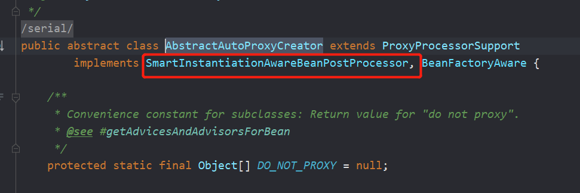
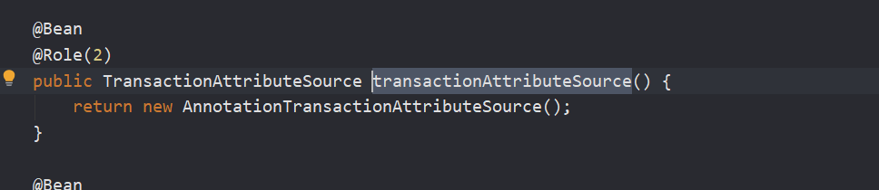

# 1）@EnableTransactionManagement

利用TransactionManagementConfigurationSelector给容器中会导入组件


这个类就是继承了ImportSelect接口


这个adviceMode默认是PROXY


所以可以导入两个组件AutoProxyRegistrar和ProxyTransactionManagementConfiguration


# 2）AutoProxyRegistrar


实现了ImportBeanDefinitionRegistrar接口，给容器中注册一个 InfrastructureAdvisorAutoProxyCreator 组件


给容器中注册一个 InfrastructureAdvisorAutoProxyCreator 组件；


利用后置处理器机制在对象创建以后，包装对象，返回一个代理对象（增强器），代理对象执行方法利用拦截器链进行调用；





# 3）ProxyTransactionManagementConfiguration 

1、给容器中注册**事务增强器**；


他这里需要一个事务属性transactionAttributeSource() 




来看其中一个SpringTransactionAnnotationParser解析器


**事务增强器**要用事务注解的信息（事务属性信息），解析事务注解，就是获取注解中各种属性的值


回到事务增强器，这里还注册了一个事务拦截器：


TransactionInterceptor   保存了事务属性信息transactionAttributeSource，事务管理器 txManager；

				

TransactionInterceptor其实还是一个方法拦截器


看看TransactionInterceptor的invoke方法


事务拦截器：

在目标方法执行的时候，执行拦截器链，只有一个拦截器，就是TransactionInterceptor；

1. 先获取事务相关的属性  transactionAttributeSource
2. 再获取PlatformTransactionManager，如果事先没有添加指定任何transactionmanger （在@Transactional注解中可以指定）；最终会从容器中按照类型获取一个PlatformTransactionManager； 
3. 执行目标方法 如果异常，获取到事务管理器，利用事务管理回滚操作； 如果正常，利用事务管理器，提交事务

先获取事务相关的属性  transactionAttributeSource


再获取PlatformTransactionManager，如果事先没有添加指定任何transactionmanger 最终会从容器中按照类型获取一个PlatformTransactionManager； 


回到上一步：


如果出现异常：


出现异常就拿到事务管理器进行回滚：


如果正常：


拿到事务管理器进行提交：


整个过程是跟Aop的过程是一样的

```properties
1）、@EnableTransactionManagement
			利用TransactionManagementConfigurationSelector给容器中会导入组件
			导入两个组件
			AutoProxyRegistrar
			ProxyTransactionManagementConfiguration
2）、AutoProxyRegistrar：
			给容器中注册一个 InfrastructureAdvisorAutoProxyCreator 组件；
			InfrastructureAdvisorAutoProxyCreator：？
			利用后置处理器机制在对象创建以后，包装对象，返回一个代理对象（增强器），代理对象执行方法利用拦截器链进行调用；
3）、ProxyTransactionManagementConfiguration 做了什么？
			1、给容器中注册事务增强器；
				1）、事务增强器要用事务注解的信息，AnnotationTransactionAttributeSource解析事务注解
				2）、事务拦截器：
					TransactionInterceptor；保存了事务属性信息，事务管理器；
					他是一个 MethodInterceptor；
					在目标方法执行的时候；
						执行拦截器链；
						事务拦截器：
							1）、先获取事务相关的属性
							2）、再获取PlatformTransactionManager，如果事先没有添加指定任何transactionmanger
								最终会从容器中按照类型获取一个PlatformTransactionManager；
							3）、执行目标方法
								如果异常，获取到事务管理器，利用事务管理回滚操作；
								如果正常，利用事务管理器，提交事务
```