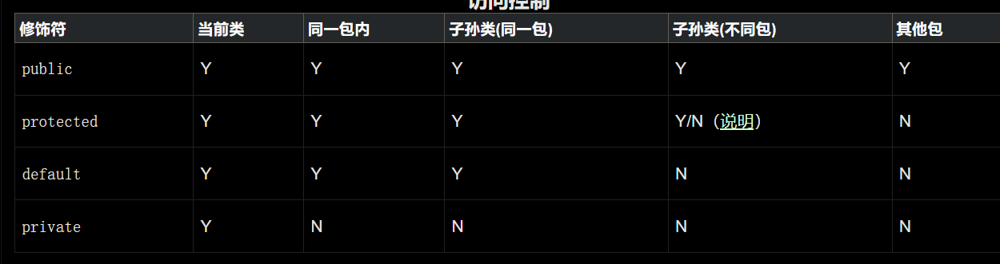

# 基础知识


## [1. Java 基本功](https://snailclimb.gitee.io/javaguide/#/docs/java/basis/Java基础知识?id=_1-java-基本功)

### [1.1. Java 入门（基础概念与常识）](https://snailclimb.gitee.io/javaguide/#/docs/java/basis/Java基础知识?id=_11-java-入门（基础概念与常识）)

#### [1.1.7. 为什么说 Java 语言“编译与解释并存”？](https://snailclimb.gitee.io/javaguide/#/docs/java/basis/Java基础知识?id=_117-为什么说-java-语言编译与解释并存？)

高级编程语言按照程序的执行方式分为编译型和解释型两种。简单来说，编译型语言是指编译器针对特定的操作系统将源代码一次性翻译成可被该平台执行的机器码；解释型语言是指解释器对源程序逐行解释成特定平台的机器码并立即执行。比如，你想阅读一本英文名著，你可以找一个英文翻译人员帮助你阅读， 有两种选择方式，你可以先等翻译人员将全本的英文名著（也就是源码）都翻译成汉语，再去阅读，也可以让翻译人员翻译一段，你在旁边阅读一段，慢慢把书读完。

Java 语言既具有编译型语言的特征，也具有解释型语言的特征，因为 Java 程序要经过先编译，后解释两个步骤，由 Java  编写的程序需要先经过编译步骤，生成字节码（*.class 文件），这种字节码必须由 Java 解释器来解释执行。因此，我们可以认为 Java  语言编译与解释并存。


### [1.2. Java 语法](https://snailclimb.gitee.io/javaguide/#/docs/java/basis/Java基础知识?id=_12-java-语法)

#### [1.2.1. 字符型常量和字符串常量的区别?](https://snailclimb.gitee.io/javaguide/#/docs/java/basis/Java基础知识?id=_121-字符型常量和字符串常量的区别)

1. 形式上: 字符常量是单引号引起的一个字符; 字符串常量是双引号引起的 0 个或若干个字符

2. 含义上: 字符常量相当于一个整型值( ASCII 值),可以参加表达式运算; 字符串常量代表一个地址值(该字符串在内存中存放位置)

3. 占内存大小 字符常量只占 2 个字节; 字符串常量占若干个字节 (**注意： char 在 Java 中占两个字节**),

   > 字符封装类 `Character` 有一个成员常量 `Character.SIZE` 值为 16,单位是`bits`,该值除以 8(`1byte=8bits`)后就可以得到 2 个字节

> java 编程思想第四版：2.2.2 节 


#### [1.2.8. ==和 equals 的区别](https://snailclimb.gitee.io/javaguide/#/docs/java/basis/Java基础知识?id=_128-和-equals-的区别)

**`==`** : 它的作用是判断两个对象的地址是不是相等。即判断两个对象是不是同一个对象。(**基本数据类型==比较的是值，引用数据类型==比较的是内存地址**)

> 因为 Java 只有值传递，所以，对于 == 来说，不管是比较基本数据类型，还是引用数据类型的变量，其本质比较的都是值，只是引用类型变量存的值是对象的地址。


#### [1.2.7. Java 泛型了解么？什么是类型擦除？介绍一下常用的通配符？](https://snailclimb.gitee.io/javaguide/#/docs/java/basis/Java基础知识?id=_127-java-泛型了解么？什么是类型擦除？介绍一下常用的通配符？)

Java 泛型（generics）是 JDK 5 中引入的一个新特性, 泛型提供了编译时类型安全检测机制，该机制允许程序员在编译时检测到非法的类型。泛型的本质是参数化类型，也就是说所操作的数据类型被指定为一个参数。

**Java 的泛型是伪泛型，这是因为 Java 在编译期间，所有的泛型信息都会被擦掉，这也就是通常所说类型擦除 。** 更多关于类型擦除的问题，可以查看这篇文章：[《Java 泛型类型擦除以及类型擦除带来的问题》](https://www.cnblogs.com/wuqinglong/p/9456193.html) 。

```java
List<Integer> list = new ArrayList<>();

list.add(12);
//这里直接添加会报错
list.add("a");
Class<? extends List> clazz = list.getClass();
Method add = clazz.getDeclaredMethod("add", Object.class);
//但是通过反射添加，是可以的
add.invoke(list, "kl");

System.out.println(list)
```

泛型一般有三种使用方式:泛型类、泛型接口、泛型方法。

**1.泛型类**：

```java
//此处T可以随便写为任意标识，常见的如T、E、K、V等形式的参数常用于表示泛型
//在实例化泛型类时，必须指定T的具体类型
public class Generic<T>{

    private T key;

    public Generic(T key) {
        this.key = key;
    }

    public T getKey(){
        return key;
    }
}
```

如何实例化泛型类：

```java
Generic<Integer> genericInteger = new Generic<Integer>(123456);
```

**2.泛型接口** ：

```java
public interface Generator<T> {
    public T method();
}
```

实现泛型接口，不指定类型：

```java
class GeneratorImpl<T> implements Generator<T>{
    @Override
    public T method() {
        return null;
    }
}
```

实现泛型接口，指定类型：

```java
class GeneratorImpl<T> implements Generator<String>{
    @Override
    public String method() {
        return "hello";
    }
}
```

**3.泛型方法** ：

```java
   public static < E > void printArray( E[] inputArray )
   {
         for ( E element : inputArray ){
            System.out.printf( "%s ", element );
         }
         System.out.println();
    }
```

使用：

```java
// 创建不同类型数组： Integer, Double 和 Character
Integer[] intArray = { 1, 2, 3 };
String[] stringArray = { "Hello", "World" };
printArray( intArray  );
printArray( stringArray  );
```

**常用的通配符为： T，E，K，V，？**

- ？ 表示不确定的 java 类型
- T (type) 表示具体的一个 java 类型
- K V (key value) 分别代表 java 键值中的 Key Value
- E (element) 代表 Element

更多关于 Java 泛型中的通配符可以查看这篇文章：[《聊一聊-JAVA 泛型中的通配符 T，E，K，V，？》](https://juejin.im/post/5d5789d26fb9a06ad0056bd9)


自己的总结：

泛型的使用方式？

1. 泛型一般有三种使用方式:泛型类、泛型接口、泛型方法，
2. 上面需要使用<T> 括号包起来，如果是用来声明变量类型就不用<>括号了

各个符号的区别？

1. ？ 表示不确定的 java 类型
2. T (type) 表示具体的一个 java 类型
3. K V (key value) 分别代表 java 键值中的 Key Value
4. E (element) 代表 Element

？ 和 T 的区别？

1. 类型参数可以多重限定而通配符不行，类型参数使用 & 符号设定多重边界
2. 通配符可以使用超类限定而类型参数不行

extends 和 super 的区别？

1. 用 extends 关键字声明，表示参数化的类型可能是所指定的类型，或者是此类型的子类。
2. 用 super 进行声明，表示参数化的类型可能是所指定的类型，或者是此类型的父类型，直至 Object

什么是范型擦除？

1. Java的泛型是伪泛型，这是因为Java在编译期间，所有的泛型信息都会被擦掉，Java的泛型基本上都是在编译器这个层次上实现的，在生成的字节码中是不包含泛型中的类型信息的，使用泛型的时候加上类型参数，在编译器编译的时候会去掉，这个过程成为类型擦除。
2. 类型擦除后保留的原始类型：无论何时定义一个泛型，相应的原始类型都会被自动提供，类型变量擦除，并使用其限定类型（无限定的变量用Object）替换


### [1.3. 基本数据类型](https://snailclimb.gitee.io/javaguide/#/docs/java/basis/Java基础知识?id=_13-基本数据类型)

#### [1.3.3. 8 种基本类型的包装类和常量池](https://snailclimb.gitee.io/javaguide/#/docs/java/basis/Java基础知识?id=_133-8-种基本类型的包装类和常量池)

**Java 基本类型的包装类的大部分都实现了常量池技术，即 Byte,Short,Integer,Long,Character,Boolean；前面 4  种包装类默认创建了数值[-128，127] 的相应类型的缓存数据，Character 创建了数值在[0,127]范围的缓存数据，Boolean  直接返回 True Or False。如果超出对应范围仍然会去创建新的对象。** 为啥把缓存设置为[-128，127]区间？（[参见 issue/461](https://github.com/Snailclimb/JavaGuide/issues/461)）性能和资源之间的权衡。

```java
public static Boolean valueOf(boolean b) {
    return (b ? TRUE : FALSE);
}
private static class CharacterCache {
    private CharacterCache(){}

    static final Character cache[] = new Character[127 + 1];
    static {
        for (int i = 0; i < cache.length; i++)
            cache[i] = new Character((char)i);
    }
}
```

两种浮点数类型的包装类 Float,Double 并没有实现常量池技术。**

```java
        Integer i1 = 33;
        Integer i2 = 33;
        System.out.println(i1 == i2);// 输出 true
        Integer i11 = 333;
        Integer i22 = 333;
        System.out.println(i11 == i22);// 输出 false
        Double i3 = 1.2;
        Double i4 = 1.2;
        System.out.println(i3 == i4);// 输出 false
```

**Integer 缓存源代码：**

```java
/**
*此方法将始终缓存-128 到 127（包括端点）范围内的值，并可以缓存此范围之外的其他值。
*/
    public static Integer valueOf(int i) {
        if (i >= IntegerCache.low && i <= IntegerCache.high)
            return IntegerCache.cache[i + (-IntegerCache.low)];
        return new Integer(i);
    }
```

**应用场景：**

1. Integer i1=40；Java 在编译的时候会直接将代码封装成 Integer i1=Integer.valueOf(40);，从而使用常量池中的对象。
2. Integer i1 = new Integer(40);这种情况下会创建新的对象。

```java
  Integer i1 = 40;
  Integer i2 = new Integer(40);
  System.out.println(i1 == i2);//输出 false
```

**Integer 比较更丰富的一个例子:**

```java
  Integer i1 = 40;
  Integer i2 = 40;
  Integer i3 = 0;
  Integer i4 = new Integer(40);
  Integer i5 = new Integer(40);
  Integer i6 = new Integer(0);

  System.out.println("i1=i2   " + (i1 == i2));
  System.out.println("i1=i2+i3   " + (i1 == i2 + i3));
  System.out.println("i1=i4   " + (i1 == i4));
  System.out.println("i4=i5   " + (i4 == i5));
  System.out.println("i4=i5+i6   " + (i4 == i5 + i6));
  System.out.println("40=i5+i6   " + (40 == i5 + i6));
```

结果：

```java
i1=i2   true
i1=i2+i3   true
i1=i4   false
i4=i5   false
i4=i5+i6   true
40=i5+i6   true
```

解释：

语句 i4 == i5 + i6，因为+这个操作符不适用于  Integer 对象，首先 i5 和 i6 进行自动拆箱操作，进行数值相加，即 i4 == 40。然后 Integer  对象无法与数值进行直接比较，所以 i4 自动拆箱转为 int 值 40，最终这条语句转为 40 == 40 进行数值比较。


### [1.4. 方法（函数）](https://snailclimb.gitee.io/javaguide/#/docs/java/basis/Java基础知识?id=_14-方法（函数）)


#### [1.4.2. 为什么 Java 中只有值传递？](https://snailclimb.gitee.io/javaguide/#/docs/java/basis/Java基础知识?id=_142-为什么-java-中只有值传递？)

首先回顾一下在程序设计语言中有关将参数传递给方法（或函数）的一些专业术语。**按值调用(call by value)表示方法接收的是调用者提供的值，而按引用调用（call by reference)表示方法接收的是调用者提供的变量地址。一个方法可以修改传递引用所对应的变量值，而不能修改传递值调用所对应的变量值。** 它用来描述各种程序设计语言（不只是 Java)中方法参数传递方式。

**Java 程序设计语言总是采用按值调用。也就是说，方法得到的是所有参数值的一个拷贝，也就是说，方法不能修改传递给它的任何参数变量的内容。**

#### [1.4.3. 重载和重写的区别](https://snailclimb.gitee.io/javaguide/#/docs/java/basis/Java基础知识?id=_143-重载和重写的区别)

> 重载就是同样的一个方法能够根据输入数据的不同，做出不同的处理
>
> 重写就是当子类继承自父类的相同方法，输入数据一样，但要做出有别于父类的响应时，你就要覆盖父类方法

**重载：**

发生在同一个类中，方法名必须相同，参数类型不同、个数不同、顺序不同，方法返回值和访问修饰符可以不同。

下面是《Java 核心技术》对重载这个概念的介绍：


综上：重载就是同一个类中多个同名方法根据不同的传参来执行不同的逻辑处理。

**重写：**

重写发生在运行期，是子类对父类的允许访问的方法的实现过程进行重新编写。

1. 返回值类型、方法名、参数列表必须相同，抛出的异常范围小于等于父类，访问修饰符范围大于等于父类。
2. 如果父类方法访问修饰符为 `private/final/static` 则子类就不能重写该方法，但是被 static 修饰的方法能够被再次声明。
3. 构造方法无法被重写

综上：重写就是子类对父类方法的重新改造，外部样子不能改变，内部逻辑可以改变

暖心的 Guide 哥最后再来个图表总结一下！

| 区别点     | 重载方法 | 重写方法                                                     |
| ---------- | -------- | ------------------------------------------------------------ |
| 发生范围   | 同一个类 | 子类                                                         |
| 参数列表   | 必须修改 | 一定不能修改                                                 |
| 返回类型   | 可修改   | 子类方法返回值类型应比父类方法返回值类型更小或相等           |
| 异常       | 可修改   | 子类方法声明抛出的异常类应比父类方法声明抛出的异常类更小或相等； |
| 访问修饰符 | 可修改   | 一定不能做更严格的限制（可以降低限制）                       |
| 发生阶段   | 编译期   | 运行期                                                       |

**方法的重写要遵循“两同两小一大”**（以下内容摘录自《疯狂 Java 讲义》,[issue#892](https://github.com/Snailclimb/JavaGuide/issues/892) ）：

- “两同”即方法名相同、形参列表相同；
- “两小”指的是子类方法返回值类型应比父类方法返回值类型更小或相等，子类方法声明抛出的异常类应比父类方法声明抛出的异常类更小或相等；
- “一大”指的是子类方法的访问权限应比父类方法的访问权限更大或相等。

#### [1.4.4. 深拷贝 vs 浅拷贝](https://snailclimb.gitee.io/javaguide/#/docs/java/basis/Java基础知识?id=_144-深拷贝-vs-浅拷贝)

1. **浅拷贝**：对基本数据类型进行值传递，对引用数据类型进行引用传递般的拷贝，此为浅拷贝。
2. **深拷贝**：对基本数据类型进行值传递，对引用数据类型，创建一个新的对象，并复制其内容，此为深拷贝。


#### 

## [2. Java 面向对象](https://snailclimb.gitee.io/javaguide/#/docs/java/basis/Java基础知识?id=_2-java-面向对象)

### [2.1. 类和对象](https://snailclimb.gitee.io/javaguide/#/docs/java/basis/Java基础知识?id=_21-类和对象)

#### [2.1.4. 成员变量与局部变量的区别有哪些？](https://snailclimb.gitee.io/javaguide/#/docs/java/basis/Java基础知识?id=_214-成员变量与局部变量的区别有哪些？)

1. 从语法形式上看:成员变量是属于类的，而局部变量是在代码块或方法中定义的变量或是方法的参数；成员变量可以被 public,private,static 等修饰符所修饰，而局部变量不能被访问控制修饰符及 static  所修饰；但是，成员变量和局部变量都能被 final 所修饰。
2. 从变量在内存中的存储方式来看:如果成员变量是使用`static`修饰的，那么这个成员变量是属于类的，如果没有使用`static`修饰，这个成员变量是属于实例的。而对象存在于堆内存，局部变量则存在于栈内存。
3. 从变量在内存中的生存时间上看:成员变量是对象的一部分，它随着对象的创建而存在，而局部变量随着方法的调用而自动消失。
4. 成员变量如果没有被赋初值:则会自动以类型的默认值而赋值（一种情况例外:被 final 修饰的成员变量也必须显式地赋值），而局部变量则不会自动赋值。


### [2.5. 其它重要知识点](https://snailclimb.gitee.io/javaguide/#/docs/java/basis/Java基础知识?id=_25-其它重要知识点)

#### [2.5.1. String StringBuffer 和 StringBuilder 的区别是什么? String 为什么是不可变的?](https://snailclimb.gitee.io/javaguide/#/docs/java/basis/Java基础知识?id=_251-string-stringbuffer-和-stringbuilder-的区别是什么-string-为什么是不可变的)

简单的来说：`String` 类中使用 final 关键字修饰字符数组来保存字符串，`private final char value[]`，所以`String` 对象是不可变的。

> 补充（来自[issue 675](https://github.com/Snailclimb/JavaGuide/issues/675)）：在 Java 9 之后，String 类的实现改用 byte 数组存储字符串 `private final byte[] value`;

而 `StringBuilder` 与 `StringBuffer` 都继承自 `AbstractStringBuilder` 类，在 `AbstractStringBuilder` 中也是使用字符数组保存字符串`char[]value` 但是没有用 `final` 关键字修饰，所以这两种对象都是可变的。

`StringBuilder` 与 `StringBuffer` 的构造方法都是调用父类构造方法也就是`AbstractStringBuilder` 实现的，大家可以自行查阅源码。

```
AbstractStringBuilder.java
abstract class AbstractStringBuilder implements Appendable, CharSequence {
    /**
     * The value is used for character storage.
     */
    char[] value;

    /**
     * The count is the number of characters used.
     */
    int count;

    AbstractStringBuilder(int capacity) {
        value = new char[capacity];
    }}
```

**线程安全性**

`String` 中的对象是不可变的，也就可以理解为常量，线程安全。`AbstractStringBuilder` 是 `StringBuilder` 与 `StringBuffer` 的公共父类，定义了一些字符串的基本操作，如 `expandCapacity`、`append`、`insert`、`indexOf` 等公共方法。`StringBuffer` 对方法加了同步锁或者对调用的方法加了同步锁，所以是线程安全的。`StringBuilder` 并没有对方法进行加同步锁，所以是非线程安全的。

**性能**

每次对 `String` 类型进行改变的时候，都会生成一个新的 `String` 对象，然后将指针指向新的 `String` 对象。`StringBuffer` 每次都会对 `StringBuffer` 对象本身进行操作，而不是生成新的对象并改变对象引用。相同情况下使用 `StringBuilder` 相比使用 `StringBuffer` 仅能获得 10%~15% 左右的性能提升，但却要冒多线程不安全的风险。

**对于三者使用的总结：**

1. 操作少量的数据: 适用 `String`
2. 单线程操作字符串缓冲区下操作大量数据: 适用 `StringBuilder`
3. 多线程操作字符串缓冲区下操作大量数据: 适用 `StringBuffer`


## [3. Java 核心技术](https://snailclimb.gitee.io/javaguide/#/docs/java/basis/Java基础知识?id=_3-java-核心技术)

### [3.2. 异常](https://snailclimb.gitee.io/javaguide/#/docs/java/basis/Java基础知识?id=_32-异常)

#### [3.2.1. Java 异常类层次结构图](https://snailclimb.gitee.io/javaguide/#/docs/java/basis/Java基础知识?id=_321-java-异常类层次结构图)


图片来自：https://simplesnippets.tech/exception-handling-in-java-part-1/


图片来自：https://chercher.tech/java-programming/exceptions-java

在 Java 中，所有的异常都有一个共同的祖先 `java.lang` 包中的 `Throwable` 类。`Throwable` 类有两个重要的子类 `Exception`（异常）和 `Error`（错误）。`Exception` 能被程序本身处理(`try-catch`)， `Error` 是无法处理的(只能尽量避免)。

`Exception` 和 `Error` 二者都是 Java 异常处理的重要子类，各自都包含大量子类。

- **`Exception`** :程序本身可以处理的异常，可以通过 `catch` 来进行捕获。`Exception` 又可以分为 受检查异常(必须处理) 和 不受检查异常(可以不处理)。
- **`Error`** ：`Error` 属于程序无法处理的错误 ，我们没办法通过 `catch` 来进行捕获 。例如，Java 虚拟机运行错误（`Virtual MachineError`）、虚拟机内存不够错误(`OutOfMemoryError`)、类定义错误（`NoClassDefFoundError`）等 。这些异常发生时，Java 虚拟机（JVM）一般会选择线程终止。

##### **受检查异常**

Java 代码在编译过程中，如果受检查异常没有被 `catch`/`throw` 处理的话，就没办法通过编译 。比如下面这段 IO 操作的代码。


除了`RuntimeException`及其子类以外，其他的`Exception`类及其子类都属于检查异常 。常见的受检查异常有： IO 相关的异常、`ClassNotFoundException` 、`SQLException`...。

##### **不受检查异常**

Java 代码在编译过程中 ，我们即使不处理不受检查异常也可以正常通过编译。

`RuntimeException` 及其子类都统称为非受检查异常，例如：`NullPointExecrption`、`NumberFormatException`（字符串转换为数字）、`ArrayIndexOutOfBoundsException`（数组越界）、`ClassCastException`（类型转换错误）、`ArithmeticException`（算术错误）等。


#### [3.2.3. try-catch-finally](https://snailclimb.gitee.io/javaguide/#/docs/java/basis/Java基础知识?id=_323-try-catch-finally)

- **`try`块：** 用于捕获异常。其后可接零个或多个 `catch` 块，如果没有 `catch` 块，则必须跟一个 `finally` 块。
- **`catch`块：** 用于处理 try 捕获到的异常。
- **`finally` 块：** 无论是否捕获或处理异常，`finally` 块里的语句都会被执行。当在 `try` 块或 `catch` 块中遇到 `return` 语句时，`finally` 语句块将在方法返回之前被执行。

**在以下 4 种特殊情况下，`finally` 块不会被执行：**

1. 在 `finally` 语句块第一行发生了异常。 因为在其他行，`finally` 块还是会得到执行
2. 在前面的代码中用了 `System.exit(int)`已退出程序。 exit 是带参函数 ；若该语句在异常语句之后，finally 会执行
3. 程序所在的线程死亡。
4. 关闭 CPU。

下面这部分内容来自 issue:https://github.com/Snailclimb/JavaGuide/issues/190。

**注意：** 当 try 语句和 finally 语句中都有 return 语句时，在方法返回之前，finally 语句的内容将被执行，并且 finally 语句的返回值将会覆盖原始的返回值。如下：

```java
public class Test {
    public static int f(int value) {
        try {
            return value * value;
        } finally {
            if (value == 2) {
                return 0;
            }
        }
    }
}
```

如果调用 `f(2)`，返回值将是 0，因为 finally 语句的返回值覆盖了 try 语句块的返回值。


## 4. 特别总结

- 从语法形式上看:成员变量是属于类的，而局部变量是在代码块或方法中定义的变量或是方法的参数；成员变量可以被  public,private,static 等修饰符所修饰，而局部变量不能被访问控制修饰符及 static  所修饰；但是，成员变量和局部变量都能被 final 所修饰。
- 如果父类方法访问修饰符为 `private/final/static` 则子类就不能重写该方法，但是被 static 修饰的方法能够被再次声明。
- 
- 
- redis实现高并发处理


------


# 易错的知识

## [1. 基础](https://snailclimb.gitee.io/javaguide/#/docs/java/basis/Java基础知识疑难点?id=_1-基础)


### [1.3. BigDecimal](https://snailclimb.gitee.io/javaguide/#/docs/java/basis/Java基础知识疑难点?id=_13-bigdecimal)

#### [1.3.1. BigDecimal 的用处](https://snailclimb.gitee.io/javaguide/#/docs/java/basis/Java基础知识疑难点?id=_131-bigdecimal-的用处)

《阿里巴巴Java开发手册》中提到：**浮点数之间的等值判断，基本数据类型不能用==来比较，包装数据类型不能用 equals 来判断。** 具体原理和浮点数的编码方式有关，这里就不多提了，我们下面直接上实例：

```java
float a = 1.0f - 0.9f;
float b = 0.9f - 0.8f;
System.out.println(a);// 0.100000024
System.out.println(b);// 0.099999964
System.out.println(a == b);// false
```

具有基本数学知识的我们很清楚的知道输出并不是我们想要的结果（**精度丢失**），我们如何解决这个问题呢？一种很常用的方法是：**使用使用 BigDecimal 来定义浮点数的值，再进行浮点数的运算操作。**

```java
BigDecimal a = new BigDecimal("1.0");
BigDecimal b = new BigDecimal("0.9");
BigDecimal c = new BigDecimal("0.8");

BigDecimal x = a.subtract(b); 
BigDecimal y = b.subtract(c); 

System.out.println(x); /* 0.1 */
System.out.println(y); /* 0.1 */
System.out.println(Objects.equals(x, y)); /* true */
```


#### [1.3.4. BigDecimal 的使用注意事项](https://snailclimb.gitee.io/javaguide/#/docs/java/basis/Java基础知识疑难点?id=_134-bigdecimal-的使用注意事项)

注意：我们在使用BigDecimal时，为了防止精度丢失，推荐使用它的 **BigDecimal(String)** 构造方法来创建对象。《阿里巴巴Java开发手册》对这部分内容也有提到如下图所示。


## [2. 集合](https://snailclimb.gitee.io/javaguide/#/docs/java/basis/Java基础知识疑难点?id=_2-集合)

### [2.2. Collection.toArray()方法使用的坑&如何反转数组](https://snailclimb.gitee.io/javaguide/#/docs/java/basis/Java基础知识疑难点?id=_22-collectiontoarray方法使用的坑amp如何反转数组)

该方法是一个泛型方法：`<T> T[] toArray(T[] a);` 如果`toArray`方法中没有传递任何参数的话返回的是`Object`类型数组。

```java
String [] s= new String[]{
    "dog", "lazy", "a", "over", "jumps", "fox", "brown", "quick", "A"
};
List<String> list = Arrays.asList(s);
Collections.reverse(list);
s=list.toArray(new String[0]);//没有指定类型的话会报错
```

由于JVM优化，`new String[0]`作为`Collection.toArray()`方法的参数现在使用更好，`new String[0]`就是起一个模板的作用，指定了返回数组的类型，0是为了节省空间，因为它只是为了说明返回的类型。详见：https://shipilev.net/blog/2016/arrays-wisdom-ancients/


### [2.3. 不要在 foreach 循环里进行元素的 remove/add 操作](https://snailclimb.gitee.io/javaguide/#/docs/java/basis/Java基础知识疑难点?id=_23-不要在-foreach-循环里进行元素的-removeadd-操作)

如果要进行`remove`操作，可以调用迭代器的 `remove `方法而不是集合类的 remove 方法。因为如果列表在任何时间从结构上修改创建迭代器之后，以任何方式除非通过迭代器自身`remove/add`方法，迭代器都将抛出一个`ConcurrentModificationException`,这就是单线程状态下产生的 **fail-fast 机制**。

> **fail-fast 机制** ：多个线程对 fail-fast 集合进行修改的时，可能会抛出ConcurrentModificationException，单线程下也会出现这种情况，上面已经提到过。

Java8开始，可以使用`Collection#removeIf()`方法删除满足特定条件的元素,如

```java
List<Integer> list = new ArrayList<>();
for (int i = 1; i <= 10; ++i) {
    list.add(i);
}
list.removeIf(filter -> filter % 2 == 0); /* 删除list中的所有偶数 */
System.out.println(list); /* [1, 3, 5, 7, 9] */
```

`java.util`包下面的所有的集合类都是fail-fast的，而`java.util.concurrent`包下面的所有的类都是fail-safe的。


## 特别总结

- ## [static 关键字](https://snailclimb.gitee.io/javaguide/#/docs/java/basis/Java常见关键字总结?id=static-关键字)

  **static 关键字主要有以下四种使用场景：**

  1. **修饰成员变量和成员方法:** 被 static 修饰的成员属于类，不属于单个这个类的某个对象，被类中所有对象共享，可以并且建议通过类名调用。被static 声明的成员变量属于静态成员变量，静态变量 存放在 Java 内存区域的方法区。调用格式：`类名.静态变量名`    `类名.静态方法名()`
  2. **静态代码块:** 静态代码块定义在类中方法外, 静态代码块在非静态代码块之前执行(静态代码块—>非静态代码块—>构造方法)。 该类不管创建多少对象，静态代码块只执行一次.
  3. **静态内部类（static修饰类的话只能修饰内部类）：** 静态内部类与非静态内部类之间存在一个最大的区别:  非静态内部类在编译完成之后会隐含地保存着一个引用，该引用是指向创建它的外围类，但是静态内部类却没有。没有这个引用就意味着：1.  它的创建是不需要依赖外围类的创建。2. 它不能使用任何外围类的非static成员变量和方法。
  4. **静态导包(用来导入类中的静态资源，1.5之后的新特性):** 格式为：`import static` 这两个关键字连用可以指定导入某个类中的指定静态资源，并且不需要使用类名调用类中静态成员，可以直接使用类中静态成员变量和成员方法。

- 注意：静态变量 存放在 Java 内存区域的方法区

- 注意：非静态代码块可在普通方法中定义(不过作用不大)；而静态代码块不行。

- ## [final 关键字](https://snailclimb.gitee.io/javaguide/#/docs/java/basis/Java常见关键字总结?id=final-关键字)

  **final关键字，意思是最终的、不可修改的，最见不得变化 ，用来修饰类、方法和变量，具有以下特点：**

  1. **final修饰的类不能被继承，final类中的所有成员方法都会被隐式的指定为final方法；**
  2. **final修饰的方法不能被重写；**
  3. **final修饰的变量是常量，如果是基本数据类型的变量，则其数值一旦在初始化之后便不能更改；如果是引用类型的变量，则在对其初始化之后便不能让其指向另一个对象。**

  说明：使用final方法的原因有两个。第一个原因是把方法锁定，以防任何继承类修改它的含义；第二个原因是效率。在早期的Java实现版本中，会将final方法转为内嵌调用。但是如果方法过于庞大，可能看不到内嵌调用带来的任何性能提升（现在的Java版本已经不需要使用final方法进行这些优化了）。类中所有的private方法都隐式地指定为final。


# 易问的知识

## [八 接口和抽象类的区别是什么?](https://snailclimb.gitee.io/javaguide/#/docs/essential-content-for-interview/PreparingForInterview/应届生面试最爱问的几道Java基础问题?id=八-接口和抽象类的区别是什么)

1. 接口的方法默认是 public，所有方法
2. 在接口中不能有实现，抽象类可以有非抽象的方法
3. 接口中的实例变量默认是 final 类型的，而抽象类中则不一定
4. 一个类可以实现多个接口，但最多只能实现一个抽象类
5. 一个类实现接口的话要实现接口的所有方法，而抽象类不一定
6. 接口不能用 new 实例化，但可以声明，但是必须引用一个实现该接口的对象 从设计层面来说，抽象是对类的抽象，是一种模板设计，接口是行为的抽象，是一种行为的规范。

注意：Java8 后接口可以有默认实现( default )。


## [十五. 什么是线程死锁?如何避免死锁?](https://snailclimb.gitee.io/javaguide/#/docs/essential-content-for-interview/PreparingForInterview/应届生面试最爱问的几道Java基础问题?id=十五-什么是线程死锁如何避免死锁)

### [15.1. 认识线程死锁](https://snailclimb.gitee.io/javaguide/#/docs/essential-content-for-interview/PreparingForInterview/应届生面试最爱问的几道Java基础问题?id=_151-认识线程死锁)

多个线程同时被阻塞，它们中的一个或者全部都在等待某个资源被释放。由于线程被无限期地阻塞，因此程序不可能正常终止。


## [十六. 说说 sleep() 方法和 wait() 方法区别和共同点?](https://snailclimb.gitee.io/javaguide/#/docs/essential-content-for-interview/PreparingForInterview/应届生面试最爱问的几道Java基础问题?id=十六-说说-sleep-方法和-wait-方法区别和共同点)

- 两者最主要的区别在于：**sleep 方法没有释放锁，而 wait 方法释放了锁** 。
- 两者都可以暂停线程的执行。
- Wait 通常被用于线程间交互/通信，sleep 通常被用于暂停执行。
- wait() 方法被调用后，线程不会自动苏醒，需要别的线程调用同一个对象上的 notify() 或者 notifyAll() 方法。sleep() 方法执行完成后，线程会自动苏醒。或者可以使用 wait(long timeout)超时后线程会自动苏醒。


# 面试题

1. String StringBuffer 和 StringBuilder 的区别是什么? 

2. String 为什么是不可变的?

   1. 缓存：如果字符串是可变的，我们一旦修改了s的内容，那必然导致s2的内容也被动的改变了
   2. hashcode缓存：因此，hashCode()方法在String类中被重写，以方便缓存，这样在第一次hashCode()调用期间计算和缓存散列，并从那时起返回相同的值
   3. 安全性 ：字符串在Java应用程序中广泛用于存储敏感信息，如用户名、密码、连接url、网络连接等。JVM类加载器在加载类的时也广泛地使用它，当我们在程序中传递一个字符串的时候，如果这个字符串的内容是不可变的，那么我们就可以相信这个字符串中的内容
   4. 线程安全：不可变会自动使字符串成为线程安全的，因为当从多个线程访问它们时，它们不会被更改

3. String类的常量池

   1. ```java
      String str = "aaa";   // 创建了一个对象
      ```

      使用字面量创建字符串对象时，jvm首先会在字符串常量池中查找是否存`"aaa"`这个对象，

      1. 如果不存在，则在字符串常量池中创建`"aaa"`对象，然后将此对象的引用地址返回给字符串常量
      2. 如果存在，则则不创建任何对象，直接将常量池中的对象的引用地址返回给字符串常量

   2. ```java
      String str = new String("aaa");  // 创建了两个对象
      ```

      1. 使用new关键字创建对象时，jvm首先在字符串常量池中查找有没有"aaa"这个对象

      1. 如果不存在，则首先在字符串常量池中创建一个`"aaa"`对象，然后再在堆中创建一个`"aaa"`对象，最后把堆中创建的这个对象的引用地址返回给字符串常量str；
      2. 如果存在，则只直接在堆中创建一个`"aaa"`对象返回给字符串常量str

   3. ```java
      String s3 = new String("hello") + new String("hello"); // 只在堆中创建了一个对象
      ```

   4. 当执行s3.intern()方法时

      ```java
      String intern3 = s3.intern();    
      ```

      1. 如果字符串常量池中不存在`"hellohello"`对象，则在字符串常量池中储存一份s3的引用，这个引用指向堆中的`"hellohello"`对象；
      2. 如果在字符串常量池中已经存在`"hellohello"`对象，那么就直接返回该对象的引用

4. 重载和重写，动态分派和静态分派，及重载是多态吗？：

   1. **方法的重写要遵循“两同两小一大”**（以下内容摘录自《疯狂 Java 讲义》,[issue#892](https://github.com/Snailclimb/JavaGuide/issues/892) ）：
      - “两同”即方法名相同、形参列表相同；
      - “两小”指的是子类方法返回值类型应比父类方法返回值类型更小或相等，子类方法声明抛出的异常类应比父类方法声明抛出的异常类更小或相等；
      - “一大”指的是子类方法的访问权限应比父类方法的访问权限更大或相等。
   2. 静态分派，方法的重载体现了静态分派，是一种静态行为
      1. 静态分派，方法的重载体现了静态分派，是一种静态行为，即重载方法只关系传递参数g1 和 g2 的静态类型，而不关心参数它们的实际类型。MyTest5.java
      2. 动态分派，方法的重写体现了动态分派，动态分派涉及到一个概念：方法接受者（即方法的调用者），动态分派关系到invokevirtual字节码指令的查找流程，查找流程的调用过程是这样的**（我不太懂，感觉这里没有说清楚）**，找到操作数栈顶元素的实际类型，如果在常量池的这个实际类型中找到了方法描述符和方法名称都和要调用的方法完全相同的方法，并且具相应的访问权限。那么就返回这个方法的直接引用，如果没有找到，则沿着继承体系从下往上查找。动态分派在字节码中的展示状态，是静态类型去调用方法，在运行期动态确认它的实际类型。
   3. 因为重载是静态的，重写是动态的，所以只有重写算是多态性的体现，重载不算多态。笔者认为这种争论没有意义，概念仅仅是说明问题的一种工具而已  https://segmentfault.com/q/1010000009725780

5. 枚举类

   1. 特点

      1. enum和class、interface的地位一样
      2. 使用enum定义的枚举类默认继承了java.lang.Enum，而不是继承Object类。枚举类可以实现一个或多个接口。
      3. 使用enum定义、非抽象的枚举类默认使用final修饰，不可以被继承。
      4. 枚举类的所有实例都必须放在第一行展示，不需使用new 关键字，不需显式调用构造器。自动添加public static final修饰。
      5. 枚举类的构造器只能是私有的。

   2. 为啥要使用枚举类？

      1. 枚举类更加直观，类型安全。使用常量会有以下几个缺陷：

         　　1. 类型不安全。若一个方法中要求传入季节这个参数，用常量的话，形参就是int类型，开发者传入任意类型的int类型值就行，但是如果是枚举类型的话，就只能传入枚举类中包含的对象。

            　　2. 没有命名空间。开发者要在命名的时候以SEASON_开头，这样另外一个开发者再看这段代码的时候，才知道这四个常量分别代表季节。

6. 说说反射？https://www.cnblogs.com/lzq198754/p/5780331.html   https://www.cnblogs.com/tech-bird/p/3525336.html

   1. 作用
      1. 在运行时判断任意一个对象所属的类；
      2. 在运行时调用任意一个对象的方法；
      3. 在运行时构造任意一个类的对象；
      4. 在运行时判断任意一个类所具有的成员变量和方法；
      5. 生成动态代理。
   2. 反射机制优缺点
      - **优点：** 运行期类型的判断，动态加载类，提高代码灵活度。
      - **缺点：** 1,性能瓶颈：反射相当于一系列解释操作，通知 JVM 要做的事情，性能比直接的 java 代码要慢很多。2,安全问题，让我们可以动态操作改变类的属性同时也增加了类的安全隐患。
   3. 反射的应用场景
      1. 我们在使用 JDBC 连接数据库时使用 `Class.forName()`通过反射加载数据库的驱动程序；
      2. Spring 框架的 IOC（动态加载管理 Bean）创建对象以及 AOP（动态代理）功能都和反射有联系；
      3. 动态配置实例的属性；

7. JDK动态代理的原理? https://www.cnblogs.com/flyoung2008/p/3251148.html

   1、通过实现InvocationHandler接口创建自己的**调用处理器** IvocationHandler handler = new InvocationHandlerImpl(...);
   2、通过为Proxy类指定ClassLoader对象和一组interface创建动态代理类
   Class clazz = Proxy.getProxyClass(classLoader,new Class[]{...});
   3、通过反射机制获取动态代理类的构造函数，其参数类型是**调用处理器接口类型**
   Constructor constructor = clazz.getConstructor(new Class[]{InvocationHandler.class});
   4、通过构造函数创建代理类实例，此时需将**调用处理器对象**作为参数被传入
   Interface Proxy = (Interface)constructor.newInstance(new Object[] (handler));
   为了简化对象创建过程，Proxy类中的newInstance方法封装了2~4，只需两步即可完成代理对象的创建。
   生成的ProxySubject继承Proxy类实现Subject接口，实现的Subject的方法实际调用处理器的invoke方法，而invoke方法利用反射调用的是被代理对象的的方法（Object result=method.invoke(proxied,args)）

8. 访问权限修饰符

   1. 

9. lambda 表达式

   1. ```java
      //1.表示无参数并生成结果的函数
      public interface Supplier<T> {
          /**
           * Gets a result.
           * @return a result
           */
          T get();
      }
      //2.表示接受一个参数并生成结果的函数
      public interface Function<T, R> {
        R apply(T t);
        //....
        }
      }
      //3.表示接受单个输入参数但不返回结果的操作
      public interface Consumer<T> {
      void accept(T t);
         //....
        }
      }
      //4.表示接受两个输入参数且不返回结果的操作
      public interface BiConsumer<T, U> {
         void accept(T t, U u);
           //....
        }
      }
      ```

10. final 关键字 和 finalize 关键字  https://www.cnblogs.com/Smina/p/7189427.html

    1.  final关键字，意思是最终的、不可修改的，最见不得变化 ，用来修饰类、方法和变量，具有以下特点：
       1. final修饰的类不能被继承，final类中的所有成员方法都会被隐式的指定为final方法；
       2. final修饰的方法不能被重写；
       3. final修饰的变量是常量，如果是基本数据类型的变量，则其数值一旦在初始化之后便不能更改；如果是引用类型的变量，则在对其初始化之后便不能让其指向另一个对象。
    2. 大致描述一下finalize流程：当对象变成(GC Roots)不可达时，GC会判断该对象是否覆盖了finalize方法，若未覆盖，则直接将其回收。否则，若对象未执行过finalize方法，将其放入F-Queue队列，由一低优先级线程执行该队列中对象的finalize方法。执行finalize方法完毕后，GC会再次判断该对象是否可达，若不可达，则进行回收，否则，对象“复活”

