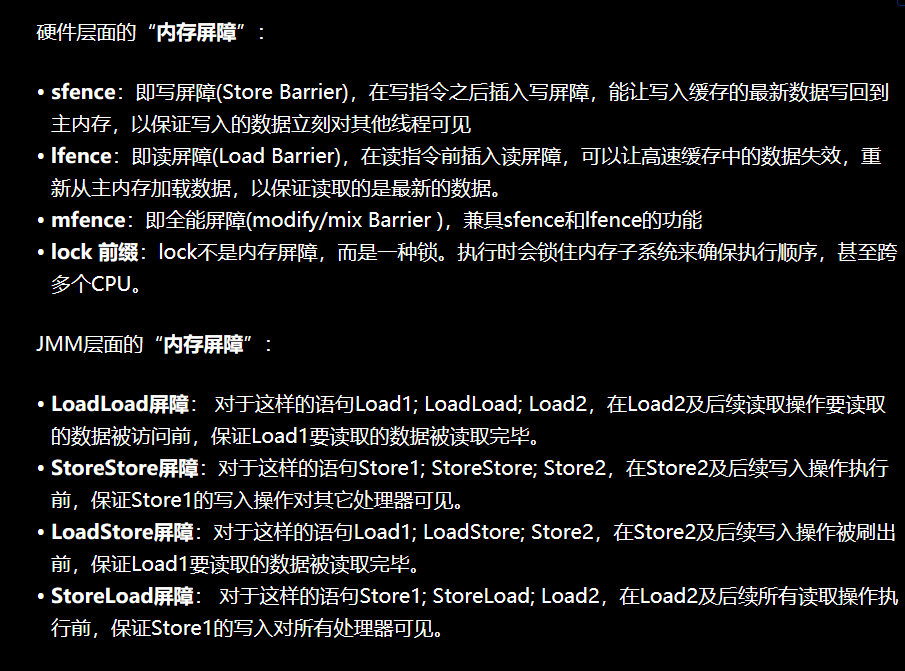

# [Java 并发进阶常见面试题总结](https://snailclimb.gitee.io/javaguide/#/docs/java/multi-thread/2020最新Java并发进阶常见面试题总结?id=java-并发进阶常见面试题总结)

## [1.synchronized 关键字](https://snailclimb.gitee.io/javaguide/#/docs/java/multi-thread/2020最新Java并发进阶常见面试题总结?id=_1synchronized-关键字)


### [1.5. 谈谈 synchronized 和 ReentrantLock 的区别](https://snailclimb.gitee.io/javaguide/#/docs/java/multi-thread/2020最新Java并发进阶常见面试题总结?id=_15-谈谈-synchronized-和-reentrantlock-的区别)

#### [1.5.1. 两者都是可重入锁](https://snailclimb.gitee.io/javaguide/#/docs/java/multi-thread/2020最新Java并发进阶常见面试题总结?id=_151-两者都是可重入锁)

#### [1.5.2.synchronized 依赖于 JVM 而 ReentrantLock 依赖于 API](https://snailclimb.gitee.io/javaguide/#/docs/java/multi-thread/2020最新Java并发进阶常见面试题总结?id=_152synchronized-依赖于-jvm-而-reentrantlock-依赖于-api)

#### [1.5.3.ReentrantLock 比 synchronized 增加了一些高级功能](https://snailclimb.gitee.io/javaguide/#/docs/java/multi-thread/2020最新Java并发进阶常见面试题总结?id=_153reentrantlock-比-synchronized-增加了一些高级功能)

相比`synchronized`，`ReentrantLock`增加了一些高级功能。主要来说主要有三点：

- **等待可中断** : `ReentrantLock`提供了一种能够中断等待锁的线程的机制，通过 `lock.lockInterruptibly()` 来实现这个机制。也就是说正在等待的线程可以选择放弃等待，改为处理其他事情。
- **可实现公平锁** : `ReentrantLock`可以指定是公平锁还是非公平锁。而`synchronized`只能是非公平锁。所谓的公平锁就是先等待的线程先获得锁。`ReentrantLock`默认情况是非公平的，可以通过 `ReentrantLock`类的`ReentrantLock(boolean fair)`构造方法来制定是否是公平的。
- **可实现选择性通知（锁可以绑定多个条件）**: `synchronized`关键字与`wait()`和`notify()`/`notifyAll()`方法相结合可以实现等待/通知机制。`ReentrantLock`类当然也可以实现，但是需要借助于`Condition`接口与`newCondition()`方法。


### 最后：特别总结

#### [4.5 Monitor 概念](https://gu_chun_bo.gitee.io/java-construct/#/java并发编程/java并发1?id=_45-monitor-概念)

##### [Java 对象头](https://gu_chun_bo.gitee.io/java-construct/#/java并发编程/java并发1?id=java-对象头)

以 32 位虚拟机为例,普通对象的对象头结构如下，其中的Klass Word为指针，指向对应的Class对象；


数组对象


其中 Mark Word 结构为


所以一个对象的结构如下：


##### [Monitor 原理](https://gu_chun_bo.gitee.io/java-construct/#/java并发编程/java并发1?id=monitor-原理)

Monitor被翻译为监视器或者说管程

每个java对象都可以关联一个Monitor，如果使用`synchronized`给对象上锁（重量级），该对象头的Mark Word中就被设置为指向Monitor对象的指针


- 刚开始时Monitor中的Owner为null
- 当Thread-2 执行synchronized(obj){}代码时就会将Monitor的所有者Owner 设置为 Thread-2，上锁成功，Monitor中同一时刻只能有一个Owner
- 当Thread-2 占据锁时，如果线程Thread-3，Thread-4也来执行synchronized(obj){}代码，就会进入EntryList中变成BLOCKED状态
- Thread-2 执行完同步代码块的内容，然后唤醒 EntryList 中等待的线程来竞争锁，竞争时是非公平的
- 图中 WaitSet 中的 Thread-0，Thread-1 是之前获得过锁，但条件不满足进入 WAITING 状态的线程，后面讲wait-notify 时会分析

> 注意：synchronized 必须是进入同一个对象的 monitor 才有上述的效果不加 synchronized 的对象不会关联监视器，不遵从以上规则

##### [synchronized原理](https://gu_chun_bo.gitee.io/java-construct/#/java并发编程/java并发1?id=synchronized原理-1)

代码如下 Test17.java

```java
    static final Object lock=new Object();
    static int counter = 0;
    public static void main(String[] args) {
        synchronized (lock) {
            counter++;
        }
    }
```

反编译后的部分字节码

```properties
 0 getstatic #2 <com/concurrent/test/Test17.lock>
 # 取得lock的引用（synchronized开始了）
 3 dup    
 # 复制操作数栈栈顶的值放入栈顶，即复制了一份lock的引用
 4 astore_1
 # 操作数栈栈顶的值弹出，即将lock的引用存到局部变量表中
 5 monitorenter
 # 将lock对象的Mark Word置为指向Monitor指针
 6 getstatic #3 <com/concurrent/test/Test17.counter>
 9 iconst_1
10 iadd
11 putstatic #3 <com/concurrent/test/Test17.counter>
14 aload_1
# 从局部变量表中取得lock的引用，放入操作数栈栈顶
15 monitorexit
# 将lock对象的Mark Word重置，唤醒EntryList
16 goto 24 (+8)
# 下面是异常处理指令，可以看到，如果出现异常，也能自动地释放锁
19 astore_2
20 aload_1
21 monitorexit
22 aload_2
23 athrow
24 return
```

> 注意：方法级别的 synchronized 不会在字节码指令中有所体现

##### [synchronized 原理进阶](https://gu_chun_bo.gitee.io/java-construct/#/java并发编程/java并发1?id=synchronized-原理进阶)

###### [轻量级锁](https://gu_chun_bo.gitee.io/java-construct/#/java并发编程/java并发1?id=轻量级锁)

轻量级锁的使用场景是：如果一个对象虽然有多个线程要对它进行加锁，但是加锁的时间是错开的（也就是没有人可以竞争的），那么可以使用轻量级锁来进行优化。轻量级锁对使用者是透明的，即语法仍然是`synchronized`，假设有两个方法同步块，利用同一个对象加锁

```java
static final Object obj = new Object();
public static void method1() {
     synchronized( obj ) {
         // 同步块 A
         method2();
     }
}
public static void method2() {
     synchronized( obj ) {
         // 同步块 B
     }
}
```

1. 每次指向到synchronized代码块时，都会创建锁记录（Lock Record）对象，每个线程都会包括一个锁记录的结构，锁记录内部可以储存对象的Mark Word和对象引用reference
   1. 
2. 让锁记录中的Object reference指向对象，并且尝试用cas(compare and sweep)替换Object对象的Mark Word ，将Mark Word 的值存入锁记录中
   1. 
3. 如果cas替换成功，那么对象的对象头储存的就是锁记录的地址和状态01，如下所示
   1. 
4. 如果cas失败，有两种情况
   1. 如果是其它线程已经持有了该Object的轻量级锁，那么表示有竞争，将进入锁膨胀阶段
   2. 如果是自己的线程已经执行了synchronized进行加锁，那么那么再添加一条 Lock Record 作为重入的计数
      1. 
5. 当线程退出synchronized代码块的时候，**如果获取的是取值为 null 的锁记录 **，表示有重入，这时重置锁记录，表示重入计数减一
   1. 
6. 当线程退出synchronized代码块的时候，如果获取的锁记录取值不为 null，那么使用cas将Mark Word的值恢复给对象
   1. 成功则解锁成功
   2. 失败，则说明轻量级锁进行了锁膨胀或已经升级为重量级锁，进入重量级锁解锁流程

###### [锁膨胀](https://gu_chun_bo.gitee.io/java-construct/#/java并发编程/java并发1?id=锁膨胀)

如果在尝试加轻量级锁的过程中，cas操作无法成功，这是有一种情况就是其它线程已经为这个对象加上了轻量级锁，这是就要进行锁膨胀，将轻量级锁变成重量级锁。

1. 当 Thread-1 进行轻量级加锁时，Thread-0 已经对该对象加了轻量级锁
   1. 
2. 这时 Thread-1 加轻量级锁失败，进入锁膨胀流程
   1. 即为对象申请Monitor锁，让Object指向重量级锁地址，然后自己进入Monitor 的EntryList 变成BLOCKED状态
   2. 
3. 当Thread-0 推出synchronized同步块时，使用cas将Mark  Word的值恢复给对象头，失败，那么会进入重量级锁的解锁过程，即按照Monitor的地址找到Monitor对象，将Owner设置为null，唤醒EntryList 中的Thread-1线程

###### [自旋优化](https://gu_chun_bo.gitee.io/java-construct/#/java并发编程/java并发1?id=自旋优化)

重量级锁竞争的时候，还可以使用自旋来进行优化，如果当前线程自旋成功（即在自旋的时候持锁的线程释放了锁），那么当前线程就可以不用进行上下文切换就获得了锁

1. 自旋重试成功的情况
   1. 
2. 自旋重试失败的情况，自旋了一定次数还是没有等到持锁的线程释放锁
   1. 

自旋会占用 CPU 时间，单核 CPU 自旋就是浪费，多核 CPU 自旋才能发挥优势。在 Java 6  之后自旋锁是自适应的，比如对象刚刚的一次自旋操作成功过，那么认为这次自旋成功的可能性会高，就多自旋几次；反之，就少自旋甚至不自旋，总之，比较智能。Java 7 之后不能控制是否开启自旋功能

##### [偏向锁](https://gu_chun_bo.gitee.io/java-construct/#/java并发编程/java并发1?id=偏向锁)

在轻量级的锁中，我们可以发现，如果同一个线程对同一个2对象进行重入锁时，也需要执行CAS操作，这是有点耗时滴，那么java6开始引入了偏向锁的东东，只有第一次使用CAS时将对象的Mark Word头设置为入锁线程ID，**之后这个入锁线程再进行重入锁时，发现线程ID是自己的，那么就不用再进行CAS了**


###### [偏向状态](https://gu_chun_bo.gitee.io/java-construct/#/java并发编程/java并发1?id=偏向状态)


一个对象的创建过程

1. 如果开启了偏向锁（默认是开启的），那么对象刚创建之后，Mark Word 最后三位的值101，并且这是它的Thread，epoch，age都是0，在加锁的时候进行设置这些的值.

2. 偏向锁默认是延迟的，不会在程序启动的时候立刻生效，如果想避免延迟，可以添加虚拟机参数来禁用延迟：-`XX:BiasedLockingStartupDelay=0`来禁用延迟

3. 注意：处于偏向锁的对象解锁后，线程 id 仍存储于对象头中

4. 实验Test18.java，加上虚拟机参数-XX:BiasedLockingStartupDelay=0进行测试

   1. ```java
      public static void main(String[] args) throws InterruptedException {
              Test1 t = new Test1();
              test.parseObjectHeader(getObjectHeader(t))；
              synchronized (t){
                  test.parseObjectHeader(getObjectHeader(t));
              }
              test.parseObjectHeader(getObjectHeader(t));
          }
      ```

1. 输出结果如下，三次输出的状态码都为101

```properties
biasedLockFlag (1bit): 1
    LockFlag (2bit): 01
biasedLockFlag (1bit): 1
    LockFlag (2bit): 01
biasedLockFlag (1bit): 1
    LockFlag (2bit): 01
```

测试禁用：如果没有开启偏向锁，那么对象创建后最后三位的值为001，这时候它的hashcode，age都为0，hashcode是第一次用到`hashcode`时才赋值的。在上面测试代码运行时在添加 VM 参数`-XX:-UseBiasedLocking`禁用偏向锁（禁用偏向锁则优先使用轻量级锁），退出`synchronized`状态变回001

1. 测试代码Test18.java 虚拟机参数`-XX:-UseBiasedLocking`

2. 输出结果如下，最开始状态为001，然后加轻量级锁变成00，最后恢复成001

   ```properties
   biasedLockFlag (1bit): 0
       LockFlag (2bit): 01
   LockFlag (2bit): 00
   biasedLockFlag (1bit): 0
       LockFlag (2bit): 01
   ```

###### [撤销偏向锁-hashcode方法](https://gu_chun_bo.gitee.io/java-construct/#/java并发编程/java并发1?id=撤销偏向锁-hashcode方法)

测试 `hashCode`：当调用对象的hashcode方法的时候就会撤销这个对象的偏向锁，因为使用偏向锁时没有位置存`hashcode`的值了

1. 测试代码如下，使用虚拟机参数`-XX:BiasedLockingStartupDelay=0`  ，确保我们的程序最开始使用了偏向锁！但是结果显示程序还是使用了轻量级锁。  Test20.java

   ```java
       public static void main(String[] args) throws InterruptedException {
           Test1 t = new Test1();
           t.hashCode();
           test.parseObjectHeader(getObjectHeader(t));
   
           synchronized (t){
               test.parseObjectHeader(getObjectHeader(t));
           }
           test.parseObjectHeader(getObjectHeader(t));
       }
   ```

输出结果

```properties
biasedLockFlag (1bit): 0
    LockFlag (2bit): 01
LockFlag (2bit): 00
biasedLockFlag (1bit): 0
    LockFlag (2bit): 01
```

###### [撤销偏向锁-其它线程使用对象](https://gu_chun_bo.gitee.io/java-construct/#/java并发编程/java并发1?id=撤销偏向锁-其它线程使用对象)

这里我们演示的是偏向锁撤销变成轻量级锁的过程，那么就得满足轻量级锁的使用条件，就是没有线程对同一个对象进行锁竞争，我们使用`wait` 和 `notify` 来辅助实现

1. 代码 Test19.java，虚拟机参数`-XX:BiasedLockingStartupDelay=0`确保我们的程序最开始使用了偏向锁！

2. 输出结果，最开始使用的是偏向锁，但是第二个线程尝试获取对象锁时，发现本来对象偏向的是线程一，那么偏向锁就会失效，加的就是轻量级锁

   ```properties
   biasedLockFlag (1bit): 1
       LockFlag (2bit): 01
   biasedLockFlag (1bit): 1
       LockFlag (2bit): 01
   biasedLockFlag (1bit): 1
       LockFlag (2bit): 01
   biasedLockFlag (1bit): 1
       LockFlag (2bit): 01
   LockFlag (2bit): 00
   biasedLockFlag (1bit): 0
       LockFlag (2bit): 01
   ```

###### [撤销 - 调用 wait/notify](https://gu_chun_bo.gitee.io/java-construct/#/java并发编程/java并发1?id=撤销-调用-waitnotify)

会使对象的锁变成重量级锁，因为wait/notify方法之后重量级锁才支持

###### [批量重偏向](https://gu_chun_bo.gitee.io/java-construct/#/java并发编程/java并发1?id=批量重偏向)

如果对象被多个线程访问，但是没有竞争，这时候偏向了线程一的对象又有机会重新偏向线程二，即可以不用升级为轻量级锁，可这和我们之前做的实验矛盾了呀，其实要实现重新偏向是要有条件的：就是超过20对象对同一个线程如线程一撤销偏向时，那么第20个及以后的对象才可以将撤销对线程一的偏向这个动作变为将第20个及以后的对象偏向线程二。Test21.java

## 


## [2. volatile 关键字](https://snailclimb.gitee.io/javaguide/#/docs/java/multi-thread/2020最新Java并发进阶常见面试题总结?id=_2-volatile-关键字)

### [2.3. 并发编程的三个重要特性](https://snailclimb.gitee.io/javaguide/#/docs/java/multi-thread/2020最新Java并发进阶常见面试题总结?id=_23-并发编程的三个重要特性)

1. **原子性** : 一个的操作或者多次操作，要么所有的操作全部都得到执行并且不会收到任何因素的干扰而中断，要么所有的操作都执行，要么都不执行。`synchronized` 可以保证代码片段的原子性。
2. **可见性** ：当一个变量对共享变量进行了修改，那么另外的线程都是立即可以看到修改后的最新值。`volatile` 关键字可以保证共享变量的可见性。
3. **有序性** ：代码在执行的过程中的先后顺序，Java 在编译器以及运行期间的优化，代码的执行顺序未必就是编写代码时候的顺序。`volatile` 关键字可以禁止指令进行重排序优化。


### [2.4. 说说 synchronized 关键字和 volatile 关键字的区别](https://snailclimb.gitee.io/javaguide/#/docs/java/multi-thread/2020最新Java并发进阶常见面试题总结?id=_24-说说-synchronized-关键字和-volatile-关键字的区别)

`synchronized` 关键字和 `volatile` 关键字是两个互补的存在，而不是对立的存在！

- **volatile 关键字**是线程同步的**轻量级实现**，所以**volatile 性能肯定比 synchronized 关键字要好**。但是**volatile 关键字只能用于变量而 synchronized 关键字可以修饰方法以及代码块**。
- **volatile 关键字能保证数据的可见性，但不能保证数据的原子性。synchronized 关键字两者都能保证。**
- **volatile 关键字主要用于解决变量在多个线程之间的可见性，而 synchronized 关键字解决的是多个线程之间访问资源的同步性。**


### 最后：特别总结

#### [volatile 原理](https://gu_chun_bo.gitee.io/java-construct/#/java并发编程/java并发2?id=volatile-原理)

volatile 的底层实现原理是内存屏障，Memory Barrier（Memory Fence）

1. 对 volatile 变量的写指令后会加入写屏障
2. 对 volatile 变量的读指令前会加入读屏障

##### [如何保证可见性](https://gu_chun_bo.gitee.io/java-construct/#/java并发编程/java并发2?id=如何保证可见性)

1. 写屏障（sfence）保证在该屏障之前的，对共享变量的改动，都同步到主存当中

   ```java
   public void actor2(I_Result r) {
       num = 2;
       ready = true; // ready是被volatile修饰的 ，赋值带写屏障
       // 写屏障
   }
   ```

而读屏障（lfence）保证在该屏障之后，对共享变量的读取，加载的是主存中最新数据

```java
public void actor1(I_Result r) {
 // 读屏障
 //  ready是被volatile修饰的 ，读取值带读屏障
 if(ready) {
     r.r1 = num + num;
 } else {
     r.r1 = 1;
 }
}
```


##### [如何保证有序性](https://gu_chun_bo.gitee.io/java-construct/#/java并发编程/java并发2?id=如何保证有序性)

1. 写屏障会确保指令重排序时，不会将写屏障之前的代码排在写屏障之后

   ```java
   public void actor2(I_Result r) {
    num = 2;
    ready = true; //  ready是被volatile修饰的 ， 赋值带写屏障
    // 写屏障
   }
   ```

读屏障会确保指令重排序时，不会将读屏障之后的代码排在读屏障之前

```java
public void actor1(I_Result r) {
 // 读屏障
 //  ready是被volatile修饰的 ，读取值带读屏障
 if(ready) {
     r.r1 = num + num;
 } else {
     r.r1 = 1;
 }
}
```

1. 

还是那句话，不能解决指令交错：

1. 写屏障仅仅是保证之后的读能够读到最新的结果，但不能保证其它线程的读跑到它前面去
2. 而有序性的保证也只是保证了本线程内相关代码不被重排序


#### [线程安全单例习题](https://gu_chun_bo.gitee.io/java-construct/#/java并发编程/java并发2?id=线程安全单例习题)

单例模式有很多实现方法，饿汉、懒汉、静态内部类、枚举类，试分析每种实现下获取单例对象（即调用 getInstance）时的线程安全，并思考注释中的问题 饿汉式：类加载就会导致该单实例对象被创建 懒汉式：类加载不会导致该单实例对象被创建，而是首次使用该对象时才会创建

实现1： 饿汉式

```java
// 问题1：为什么加 final，防止子类继承后更改
// 问题2：如果实现了序列化接口, 还要做什么来防止反序列化破坏单例，如果进行反序列化的时候会生成新的对象，这样跟单例模式生成的对象是不同的。要解决直接加上readResolve()方法就行了，如下所示
public final class Singleton implements Serializable {
    // 问题3：为什么设置为私有? 放弃其它类中使用new生成新的实例，是否能防止反射创建新的实例?不能。
    private Singleton() {}
    // 问题4：这样初始化是否能保证单例对象创建时的线程安全?没有，这是类变量，是jvm在类加载阶段就进行了初始化，jvm保证了此操作的线程安全性
    private static final Singleton INSTANCE = new Singleton();
    // 问题5：为什么提供静态方法而不是直接将 INSTANCE 设置为 public, 说出你知道的理由。
    //1.提供更好的封装性；2.提供范型的支持
    public static Singleton getInstance() {
        return INSTANCE;
    }
    public Object readResolve() {
        return INSTANCE;
    }
}
```

实现2： 饿汉式

```java
// 问题1：枚举单例是如何限制实例个数的：创建枚举类的时候就已经定义好了，每个枚举常量其实就是枚举类的一个静态成员变量
// 问题2：枚举单例在创建时是否有并发问题：没有，这是静态成员变量
// 问题3：枚举单例能否被反射破坏单例：不能
// 问题4：枚举单例能否被反序列化破坏单例：枚举类默认实现了序列化接口，枚举类已经考虑到此问题，无需担心破坏单例
// 问题5：枚举单例属于懒汉式还是饿汉式：饿汉式
// 问题6：枚举单例如果希望加入一些单例创建时的初始化逻辑该如何做：加构造方法就行了
enum Singleton {
 INSTANCE;
}
```

实现3：懒汉式

```java
public final class Singleton {
    private Singleton() { }
    private static Singleton INSTANCE = null;
    // 分析这里的线程安全, 并说明有什么缺点：synchronized加载静态方法上，可以保证线程安全。缺点就是锁的范围过大
    public static synchronized Singleton getInstance() {
        if( INSTANCE != null ){
            return INSTANCE;
        }
        INSTANCE = new Singleton();
        return INSTANCE;
    }
}
```

实现4：DCL  懒汉式

```java
public final class Singleton {
    private Singleton() { }
    // 问题1：解释为什么要加 volatile ?为了防止重排序问题
    private static volatile Singleton INSTANCE = null;

    // 问题2：对比实现3, 说出这样做的意义：提高了效率
    public static Singleton getInstance() {
        if (INSTANCE != null) {
            return INSTANCE;
        }
        synchronized (Singleton.class) {
            // 问题3：为什么还要在这里加为空判断, 之前不是判断过了吗？这是为了第一次判断时的并发问题。
            if (INSTANCE != null) { // t2
                return INSTANCE;
            }
            INSTANCE = new Singleton();
            return INSTANCE;
        }
    }
}
```

实现5：

```java
public final class Singleton {
    private Singleton() { }
    // 问题1：属于懒汉式还是饿汉式：懒汉式，这是一个静态内部类。类加载本身就是懒惰的，在没有调用getInstance方法时是没有执行LazyHolder内部类的类加载操作的。
    private static class LazyHolder {
        static final Singleton INSTANCE = new Singleton();
    }
    // 问题2：在创建时是否有并发问题，这是线程安全的，类加载时，jvm保证类加载操作的线程安全
    public static Singleton getInstance() {
        return LazyHolder.INSTANCE;
    }
}
```


## [3. ThreadLocal](https://snailclimb.gitee.io/javaguide/#/docs/java/multi-thread/2020最新Java并发进阶常见面试题总结?id=_3-threadlocal)


## [4. 线程池](https://snailclimb.gitee.io/javaguide/#/docs/java/multi-thread/2020最新Java并发进阶常见面试题总结?id=_4-线程池)

### [4.1. 为什么要用线程池？](https://snailclimb.gitee.io/javaguide/#/docs/java/multi-thread/2020最新Java并发进阶常见面试题总结?id=_41-为什么要用线程池？)

- **降低资源消耗**。通过重复利用已创建的线程降低线程创建和销毁造成的消耗。
- **提高响应速度**。当任务到达时，任务可以不需要的等到线程创建就能立即执行。
- **提高线程的可管理性**。线程是稀缺资源，如果无限制的创建，不仅会消耗系统资源，还会降低系统的稳定性，使用线程池可以进行统一的分配，调优和监控。

### [4.2. 实现 Runnable 接口和 Callable 接口的区别](https://snailclimb.gitee.io/javaguide/#/docs/java/multi-thread/2020最新Java并发进阶常见面试题总结?id=_42-实现-runnable-接口和-callable-接口的区别)

`Runnable`自 Java 1.0 以来一直存在，但`Callable`仅在 Java 1.5 中引入,目的就是为了来处理`Runnable`不支持的用例。**`Runnable` 接口**不会返回结果或抛出检查异常，但是**`Callable` 接口**可以。所以，如果任务不需要返回结果或抛出异常推荐使用 \**`Runnable` 接口**，这样代码看起来会更加简洁。

工具类 `Executors` 可以实现 `Runnable` 对象和 `Callable` 对象之间的相互转换。（`Executors.callable（Runnable task`）或 `Executors.callable（Runnable task，Object resule）`）。


### [4.3. 执行 execute()方法和 submit()方法的区别是什么呢？](https://snailclimb.gitee.io/javaguide/#/docs/java/multi-thread/2020最新Java并发进阶常见面试题总结?id=_43-执行-execute方法和-submit方法的区别是什么呢？)

1. **`execute()`方法用于提交不需要返回值的任务，所以无法判断任务是否被线程池执行成功与否；**
2. **`submit()`方法用于提交需要返回值的任务。线程池会返回一个 `Future` 类型的对象，通过这个 `Future` 对象可以判断任务是否执行成功**，并且可以通过 `Future` 的 `get()`方法来获取返回值，`get()`方法会阻塞当前线程直到任务完成，而使用 `get（long timeout，TimeUnit unit）`方法则会阻塞当前线程一段时间后立即返回，这时候有可能任务没有执行完。


### [4.5 ThreadPoolExecutor 类分析](https://snailclimb.gitee.io/javaguide/#/docs/java/multi-thread/2020最新Java并发进阶常见面试题总结?id=_45-threadpoolexecutor-类分析)


#### [4.5.1 `ThreadPoolExecutor`构造函数重要参数分析](https://snailclimb.gitee.io/javaguide/#/docs/java/multi-thread/2020最新Java并发进阶常见面试题总结?id=_451-threadpoolexecutor构造函数重要参数分析)

**`ThreadPoolExecutor` 3 个最重要的参数：**

- **`corePoolSize` :** 核心线程数线程数定义了最小可以同时运行的线程数量。
- **`maximumPoolSize` :** 当队列中存放的任务达到队列容量的时候，当前可以同时运行的线程数量变为最大线程数。
- **`workQueue`:** 当新任务来的时候会先判断当前运行的线程数量是否达到核心线程数，如果达到的话，新任务就会被存放在队列中。

`ThreadPoolExecutor`其他常见参数:

1. **`keepAliveTime`**:当线程池中的线程数量大于 `corePoolSize` 的时候，如果这时没有新的任务提交，核心线程外的线程不会立即销毁，而是会等待，直到等待的时间超过了 `keepAliveTime`才会被回收销毁；
2. **`unit`** : `keepAliveTime` 参数的时间单位。
3. **`threadFactory`** :executor 创建新线程的时候会用到。
4. **`handler`** :饱和策略。关于饱和策略下面单独介绍一下。

#### [4.5.2 `ThreadPoolExecutor` 饱和策略](https://snailclimb.gitee.io/javaguide/#/docs/java/multi-thread/2020最新Java并发进阶常见面试题总结?id=_452-threadpoolexecutor-饱和策略)

**`ThreadPoolExecutor` 饱和策略定义:**

如果当前同时运行的线程数量达到最大线程数量并且队列也已经被放满了任时，`ThreadPoolTaskExecutor` 定义一些策略:

- **`ThreadPoolExecutor.AbortPolicy`**：抛出 `RejectedExecutionException`来拒绝新任务的处理。
- **`ThreadPoolExecutor.CallerRunsPolicy`**：调用执行自己的线程运行任务，也就是直接在调用`execute`方法的线程中运行(`run`)被拒绝的任务，如果执行程序已关闭，则会丢弃该任务。因此这种策略会降低对于新任务提交速度，影响程序的整体性能。如果您的应用程序可以承受此延迟并且你要求任何一个任务请求都要被执行的话，你可以选择这个策略。
- **`ThreadPoolExecutor.DiscardPolicy`：** 不处理新任务，直接丢弃掉。
- **`ThreadPoolExecutor.DiscardOldestPolicy`：** 此策略将丢弃最早的未处理的任务请求。


## [6. AQS](https://snailclimb.gitee.io/javaguide/#/docs/java/multi-thread/2020最新Java并发进阶常见面试题总结?id=_6-aqs)

### [6.2. AQS 原理分析](https://snailclimb.gitee.io/javaguide/#/docs/java/multi-thread/2020最新Java并发进阶常见面试题总结?id=_62-aqs-原理分析)

#### [6.2.2. AQS 对资源的共享方式](https://snailclimb.gitee.io/javaguide/#/docs/java/multi-thread/2020最新Java并发进阶常见面试题总结?id=_622-aqs-对资源的共享方式)

**AQS 定义两种资源共享方式**

- Exclusive

  （独占）：只有一个线程能执行，如 

  ```
  ReentrantLock
  ```

  。又可分为公平锁和非公平锁：

  - 公平锁：按照线程在队列中的排队顺序，先到者先拿到锁
  - 非公平锁：当线程要获取锁时，无视队列顺序直接去抢锁，谁抢到就是谁的

- **Share**（共享）：多个线程可同时执行，如` CountDownLatch`、`Semaphore`、`CountDownLatch`、 `CyclicBarrier`、`ReadWriteLock` 我们都会在后面讲到。

`ReentrantReadWriteLock` 可以看成是组合式，因为 `ReentrantReadWriteLock` 也就是读写锁允许多个线程同时对某一资源进行读。

不同的自定义同步器争用共享资源的方式也不同。自定义同步器在实现时只需要实现共享资源 state 的获取与释放方式即可，至于具体线程等待队列的维护（如获取资源失败入队/唤醒出队等），AQS 已经在顶层实现好了。


### [6.3. AQS 组件总结](https://snailclimb.gitee.io/javaguide/#/docs/java/multi-thread/2020最新Java并发进阶常见面试题总结?id=_63-aqs-组件总结)

- **Semaphore(信号量)-允许多个线程同时访问：** synchronized 和 ReentrantLock 都是一次只允许一个线程访问某个资源，Semaphore(信号量)可以指定多个线程同时访问某个资源。
- **CountDownLatch （倒计时器）：** CountDownLatch 是一个同步工具类，用来协调多个线程之间的同步。这个工具通常用来控制线程等待，它可以让某一个线程等待直到倒计时结束，再开始执行。
- **CyclicBarrier(循环栅栏)：** CyclicBarrier 和 CountDownLatch 非常类似，它也可以实现线程间的技术等待，但是它的功能比  CountDownLatch 更加复杂和强大。主要应用场景和 CountDownLatch 类似。CyclicBarrier  的字面意思是可循环使用（Cyclic）的屏障（Barrier）。它要做的事情是，让一组线程到达一个屏障（也可以叫同步点）时被阻塞，直到最后一个线程到达屏障时，屏障才会开门，所有被屏障拦截的线程才会继续干活。CyclicBarrier 默认的构造方法是 CyclicBarrier(int parties)，其参数表示屏障拦截的线程数量，每个线程调用 await()方法告诉  CyclicBarrier 我已经到达了屏障，然后当前线程被阻塞。


# [AQS 原理以及 AQS 同步组件总结](https://snailclimb.gitee.io/javaguide/#/docs/java/multi-thread/AQS原理以及AQS同步组件总结)

### [3 Semaphore(信号量)-允许多个线程同时访问](https://snailclimb.gitee.io/javaguide/#/docs/java/multi-thread/AQS原理以及AQS同步组件总结?id=_3-semaphore信号量-允许多个线程同时访问)

**synchronized 和 ReentrantLock 都是一次只允许一个线程访问某个资源，Semaphore(信号量)可以指定多个线程同时访问某个资源。** 

执行 `acquire` 方法阻塞，直到有一个许可证可以获得然后拿走一个许可证；每个 `release` 方法增加一个许可证，实际调用releaseShared 方法，这可能会释放一个阻塞的 acquire 方法，实际调用 acquireSharedInterruptibly方法。然而，其实并没有实际的许可证这个对象，Semaphore 只是维持了一个可获得许可证的数量。 Semaphore 经常用于限制获取某种资源的线程数量。

### [4 CountDownLatch （倒计时器）](https://snailclimb.gitee.io/javaguide/#/docs/java/multi-thread/AQS原理以及AQS同步组件总结?id=_4-countdownlatch-（倒计时器）)

CountDownLatch允许 count 个线程阻塞在一个地方，直至所有线程的任务都执行完毕。在 Java 并发中，countdownlatch 的概念是一个常见的面试题，所以一定要确保你很好的理解了它。

CountDownLatch是共享锁的一种实现,它默认构造 AQS 的 state 值为 count。当线程使用countDown方法时,其实使用了`releaseShared`方法以CAS的操作来减少state,直至state为0就代表所有的线程都调用了countDown方法。当调用await方法的时候，其实调用了acquireSharedInterruptibly 方法，如果state不为0，就代表仍然有线程没有调用countDown方法，那么就把已经调用过countDown的线程都放入阻塞队列Park,并自旋CAS判断state == 0，直至最后一个线程调用了countDown，使得state == 0，于是阻塞的线程便判断成功，全部往下执行。

#### [4.3 CountDownLatch 的不足](https://snailclimb.gitee.io/javaguide/#/docs/java/multi-thread/AQS原理以及AQS同步组件总结?id=_43-countdownlatch-的不足)

CountDownLatch 是一次性的，计数器的值只能在构造方法中初始化一次，之后没有任何机制再次对其设置值，当 CountDownLatch 使用完毕后，它不能再次被使用。


### [5 CyclicBarrier(循环栅栏)](https://snailclimb.gitee.io/javaguide/#/docs/java/multi-thread/AQS原理以及AQS同步组件总结?id=_5-cyclicbarrier循环栅栏)

CyclicBarrier 和 CountDownLatch 非常类似，它也可以实现线程间的技术等待，但是它的功能比 CountDownLatch 更加复杂和强大。主要应用场景和 CountDownLatch 类似。

> CountDownLatch的实现是基于AQS的，而CycliBarrier是基于 ReentrantLock(ReentrantLock也属于AQS同步器)和 Condition 的.

CyclicBarrier  的字面意思是可循环使用（Cyclic）的屏障（Barrier）。它要做的事情是，让一组线程到达一个屏障（也可以叫同步点）时被阻塞，直到最后一个线程到达屏障时，屏障才会开门，所有被屏障拦截的线程才会继续干活。CyclicBarrier 默认的构造方法是 `CyclicBarrier(int parties)`，其参数表示屏障拦截的线程数量，每个线程调用`await`方法告诉 CyclicBarrier 我已经到达了屏障，然后当前线程被阻塞。


#### [5.4 CyclicBarrier 和 CountDownLatch 的区别](https://snailclimb.gitee.io/javaguide/#/docs/java/multi-thread/AQS原理以及AQS同步组件总结?id=_54-cyclicbarrier-和-countdownlatch-的区别)javadoc 是这么描述它们的：

> CountDownLatch: A synchronization aid that allows one or more threads to wait until a set of operations being performed in other threads  completes.(CountDownLatch: 一个或者多个线程，等待其他多个线程完成某件事情之后才能执行；) CyclicBarrier : A synchronization aid that allows a set of threads to  all wait for each other to reach a common barrier point.(CyclicBarrier : 多个线程互相等待，直到到达同一个同步点，再继续一起执行。)

对于 CountDownLatch 来说，重点是“一个线程（多个线程）等待”，而其他的 N 个线程在完成“某件事情”之后，可以终止，也可以等待。而对于 CyclicBarrier，重点是多个线程，在任意一个线程没有完成，所有的线程都必须等待。

CountDownLatch 是计数器，线程完成一个记录一个，只不过计数不是递增而是递减，而 CyclicBarrier 更像是一个阀门，需要所有线程都到达，阀门才能打开，然后继续执行。

### 6. 我发现的小细节

CyclicBarrier多个线程在执行完await之后不能继续执行后面的方法，除非达到指定的线程数；

CountDownLatch在执行完countDown之后还能继续执行后面的方法

以上结论从源码的角度分析即可。

```java
public static void main(String[] args) throws InterruptedException {
    // 创建一个具有固定线程数量的线程池对象（如果这里线程池的线程数量给太少的话你会发现执行的很慢）
    ExecutorService threadPool = Executors.newFixedThreadPool(300);
    final CountDownLatch countDownLatch = new CountDownLatch(threadCount);
    for (int i = 0; i < threadCount; i++) {
        final int threadnum = i;
        threadPool.execute(() -> {// Lambda 表达式的运用
            try {
                test(threadnum);
            } catch (InterruptedException e) {
                // TODO Auto-generated catch block
                e.printStackTrace();
            } finally {
                countDownLatch.countDown();// 表示一个请求已经被完成
                try {
                    Thread.sleep(3000);
                } catch (InterruptedException e) {
                    e.printStackTrace();
                }
                System.out.println("线程" + threadnum);
            }
        });
    }
    countDownLatch.await();
    threadPool.shutdown();
    System.out.println("finish");
}

public static void test(int threadnum) throws InterruptedException {
    Thread.sleep(1000);// 模拟请求的耗时操作
    System.out.println("threadnum:" + threadnum);
    Thread.sleep(1000);// 模拟请求的耗时操作
}
```


# [Java 线程池学习总结](https://snailclimb.gitee.io/javaguide/#/./docs/java/multi-thread/java线程池学习总结)

## [二 Executor 框架](https://snailclimb.gitee.io/javaguide/#/./docs/java/multi-thread/java线程池学习总结?id=二-executor-框架)

### [2.2 Executor 框架结构(主要由三大部分组成)](https://snailclimb.gitee.io/javaguide/#/./docs/java/multi-thread/java线程池学习总结?id=_22-executor-框架结构主要由三大部分组成)

#### [1) 任务(`Runnable` /`Callable`)](https://snailclimb.gitee.io/javaguide/#/./docs/java/multi-thread/java线程池学习总结?id=_1-任务runnable-callable)

#### [2) 任务的执行(`Executor`)](https://snailclimb.gitee.io/javaguide/#/./docs/java/multi-thread/java线程池学习总结?id=_2-任务的执行executor)

如下图所示，包括任务执行机制的核心接口 **`Executor`** ，以及继承自 `Executor` 接口的 **`ExecutorService` 接口。`ThreadPoolExecutor`** 和 **`ScheduledThreadPoolExecutor`** 这两个关键类实现了 **ExecutorService 接口**。

**这里提了很多底层的类关系，但是，实际上我们需要更多关注的是 `ThreadPoolExecutor` 这个类，这个类在我们实际使用线程池的过程中，使用频率还是非常高的。**

> **注意：** 通过查看 `ScheduledThreadPoolExecutor` 源代码我们发现 `ScheduledThreadPoolExecutor` 实际上是继承了 `ThreadPoolExecutor` 并实现了 ScheduledExecutorService ，而 `ScheduledExecutorService` 又实现了 `ExecutorService`，正如我们下面给出的类关系图显示的一样。


#### [3) 异步计算的结果(`Future`)](https://snailclimb.gitee.io/javaguide/#/./docs/java/multi-thread/java线程池学习总结?id=_3-异步计算的结果future)


### [2.3 Executor 框架的使用示意图](https://snailclimb.gitee.io/javaguide/#/./docs/java/multi-thread/java线程池学习总结?id=_23-executor-框架的使用示意图)


1. **主线程首先要创建实现 `Runnable` 或者 `Callable` 接口的任务对象。**
2. **把创建完成的实现 `Runnable`/`Callable`接口的 对象直接交给 `ExecutorService` 执行**: `ExecutorService.execute（Runnable command）`）或者也可以把 `Runnable` 对象或`Callable` 对象提交给 `ExecutorService` 执行（`ExecutorService.submit（Runnable task）`或 `ExecutorService.submit（Callable <T> task）`）。
3. **如果执行 `ExecutorService.submit（…）`，`ExecutorService` 将返回一个实现`Future`接口的对象**（我们刚刚也提到过了执行 `execute()`方法和 `submit()`方法的区别，`submit()`会返回一个 `FutureTask 对象）。由于 FutureTask` 实现了 `Runnable`，我们也可以创建 `FutureTask`，然后直接交给 `ExecutorService` 执行。
4. **最后，主线程可以执行 `FutureTask.get()`方法来等待任务执行完成。主线程也可以执行 `FutureTask.cancel（boolean mayInterruptIfRunning）`来取消此任务的执行。**


## [四 (重要)ThreadPoolExecutor 使用示例](https://snailclimb.gitee.io/javaguide/#/./docs/java/multi-thread/java线程池学习总结?id=四-重要threadpoolexecutor-使用示例)

### [4.3 几个常见的对比](https://snailclimb.gitee.io/javaguide/#/./docs/java/multi-thread/java线程池学习总结?id=_43-几个常见的对比)

#### [4.3.1 `Runnable` vs `Callable`](https://snailclimb.gitee.io/javaguide/#/./docs/java/multi-thread/java线程池学习总结?id=_431-runnable-vs-callable)

`Runnable`自 Java 1.0 以来一直存在，但`Callable`仅在 Java 1.5 中引入,目的就是为了来处理`Runnable`不支持的用例。**`Runnable` 接口**不会返回结果或抛出检查异常，但是**`Callable` 接口**可以。所以，如果任务不需要返回结果或抛出异常推荐使用 \**`Runnable` 接口**，这样代码看起来会更加简洁。

工具类 `Executors` 可以实现 `Runnable` 对象和 `Callable` 对象之间的相互转换。（`Executors.callable（Runnable task`）或 `Executors.callable（Runnable task，Object resule）`）。

#### [4.3.2 `execute()` vs `submit()`](https://snailclimb.gitee.io/javaguide/#/./docs/java/multi-thread/java线程池学习总结?id=_432-execute-vs-submit)

1. **`execute()`方法用于提交不需要返回值的任务，所以无法判断任务是否被线程池执行成功与否；**
2. **`submit()`方法用于提交需要返回值的任务。线程池会返回一个 `Future` 类型的对象，通过这个 `Future` 对象可以判断任务是否执行成功**，并且可以通过 `Future` 的 `get()`方法来获取返回值，`get()`方法会阻塞当前线程直到任务完成，而使用 `get（long timeout，TimeUnit unit）`方法则会阻塞当前线程一段时间后立即返回，这时候有可能任务没有执行完。

我们以**`AbstractExecutorService`**接口中的一个 `submit` 方法为例子来看看源代码：

```java
    public Future<?> submit(Runnable task) {
        if (task == null) throw new NullPointerException();
        RunnableFuture<Void> ftask = newTaskFor(task, null);
        execute(ftask);
        return ftask;
    }
```

上面方法调用的 `newTaskFor` 方法返回了一个 `FutureTask` 对象。

```java
    protected <T> RunnableFuture<T> newTaskFor(Runnable runnable, T value) {
        return new FutureTask<T>(runnable, value);
    }
```

我们再来看看`execute()`方法：

```java
    public void execute(Runnable command) {
      ...
    }
```

#### [4.3.3 `shutdown()`VS`shutdownNow()`](https://snailclimb.gitee.io/javaguide/#/./docs/java/multi-thread/java线程池学习总结?id=_433-shutdownvsshutdownnow)

- **`shutdown（）`** :关闭线程池，线程池的状态变为 `SHUTDOWN`。线程池不再接受新任务了，但是队列里的任务得执行完毕。
- **`shutdownNow（）`** :关闭线程池，线程的状态变为 `STOP`。线程池会终止当前正在运行的任务，并停止处理排队的任务并返回正在等待执行的 List。

#### [4.3.2 `isTerminated()` VS `isShutdown()`](https://snailclimb.gitee.io/javaguide/#/./docs/java/multi-thread/java线程池学习总结?id=_432-isterminated-vs-isshutdown)

- **`isShutDown`** 当调用 `shutdown()` 方法后返回为 true。
- **`isTerminated`** 当调用 `shutdown()` 方法后，并且所有提交的任务完成后返回为 true


## [五 几种常见的线程池详解](https://snailclimb.gitee.io/javaguide/#/./docs/java/multi-thread/java线程池学习总结?id=五-几种常见的线程池详解)

### [5.1 FixedThreadPool](https://snailclimb.gitee.io/javaguide/#/./docs/java/multi-thread/java线程池学习总结?id=_51-fixedthreadpool)

#### [5.1.3 为什么不推荐使用`FixedThreadPool`？](https://snailclimb.gitee.io/javaguide/#/./docs/java/multi-thread/java线程池学习总结?id=_513-为什么不推荐使用fixedthreadpool？)

**`FixedThreadPool` 使用无界队列 `LinkedBlockingQueue`（队列的容量为 Intger.MAX_VALUE）作为线程池的工作队列会对线程池带来如下影响 ：**

1. 当线程池中的线程数达到 `corePoolSize` 后，新任务将在无界队列中等待，因此线程池中的线程数不会超过 corePoolSize；
2. 由于使用无界队列时 `maximumPoolSize` 将是一个无效参数，因为不可能存在任务队列满的情况。所以，通过创建 `FixedThreadPool`的源码可以看出创建的 `FixedThreadPool` 的 `corePoolSize` 和 `maximumPoolSize` 被设置为同一个值。
3. 由于 1 和 2，使用无界队列时 `keepAliveTime` 将是一个无效参数；
4. 运行中的 `FixedThreadPool`（未执行 `shutdown()`或 `shutdownNow()`）不会拒绝任务，在任务比较多的时候会导致 OOM（内存溢出）。

### [5.2 SingleThreadExecutor 详解](https://snailclimb.gitee.io/javaguide/#/./docs/java/multi-thread/java线程池学习总结?id=_52-singlethreadexecutor-详解)

#### [5.2.1 介绍](https://snailclimb.gitee.io/javaguide/#/./docs/java/multi-thread/java线程池学习总结?id=_521-介绍)

`SingleThreadExecutor` 是只有一个线程的线程池。下面看看**SingleThreadExecutor 的实现：**从上面源代码可以看出新创建的 `SingleThreadExecutor` 的 `corePoolSize` 和 `maximumPoolSize` 都被设置为 1.其他参数和 `FixedThreadPool` 相同。

#### [5.2.3 为什么不推荐使用`SingleThreadExecutor`？](https://snailclimb.gitee.io/javaguide/#/./docs/java/multi-thread/java线程池学习总结?id=_523-为什么不推荐使用singlethreadexecutor？)

`SingleThreadExecutor` 使用无界队列 `LinkedBlockingQueue` 作为线程池的工作队列（队列的容量为 Intger.MAX_VALUE）。`SingleThreadExecutor` 使用无界队列作为线程池的工作队列会对线程池带来的影响与 `FixedThreadPool` 相同。说简单点就是可能会导致 OOM，


### [5.3 CachedThreadPool 详解](https://snailclimb.gitee.io/javaguide/#/./docs/java/multi-thread/java线程池学习总结?id=_53-cachedthreadpool-详解)

#### [5.3.2 执行任务过程介绍](https://snailclimb.gitee.io/javaguide/#/./docs/java/multi-thread/java线程池学习总结?id=_532-执行任务过程介绍)

**CachedThreadPool 的 execute()方法的执行示意图（该图片来源：《Java 并发编程的艺术》）：** 

**上图说明：**

1. 首先执行 `SynchronousQueue.offer(Runnable task)` 提交任务到任务队列。如果当前 `maximumPool` 中有闲线程正在执行 `SynchronousQueue.poll(keepAliveTime,TimeUnit.NANOSECONDS)`，那么主线程执行 offer 操作与空闲线程执行的 `poll` 操作配对成功，主线程把任务交给空闲线程执行，`execute()`方法执行完成，否则执行下面的步骤 2；
2. 当初始 `maximumPool` 为空，或者 `maximumPool` 中没有空闲线程时，将没有线程执行 `SynchronousQueue.poll(keepAliveTime,TimeUnit.NANOSECONDS)`。这种情况下，步骤 1 将失败，此时 `CachedThreadPool` 会创建新线程执行任务，execute 方法执行完成；

#### [5.3.3 为什么不推荐使用`CachedThreadPool`？](https://snailclimb.gitee.io/javaguide/#/./docs/java/multi-thread/java线程池学习总结?id=_533-为什么不推荐使用cachedthreadpool？)

`CachedThreadPool` 的`corePoolSize` 被设置为空（0），`maximumPoolSize`被设置为 Integer.MAX.VALUE，即它是无界的，这也就意味着如果主线程提交任务的速度高于 `maximumPool` 中线程处理任务的速度时，`CachedThreadPool` 会不断创建新的线程。极端情况下，这样会导致耗尽 cpu 和内存资源。

`CachedThreadPool`允许创建的线程数量为 Integer.MAX_VALUE ，可能会创建大量线程，从而导致 OOM。

## [六 ScheduledThreadPoolExecutor 详解](https://snailclimb.gitee.io/javaguide/#/./docs/java/multi-thread/java线程池学习总结?id=六-scheduledthreadpoolexecutor-详解)

### [6.2 运行机制](https://snailclimb.gitee.io/javaguide/#/./docs/java/multi-thread/java线程池学习总结?id=_62-运行机制)


**`ScheduledThreadPoolExecutor` 的执行主要分为两大部分：**

1. 当调用 `ScheduledThreadPoolExecutor` 的 **`scheduleAtFixedRate()`** 方法或者**`scheduleWirhFixedDelay()`** 方法时，会向 `ScheduledThreadPoolExecutor` 的 **`DelayQueue`** 添加一个实现了 **`RunnableScheduledFuture`** 接口的 **`ScheduledFutureTask`** 。
2. 线程池中的线程从 `DelayQueue` 中获取 `ScheduledFutureTask`，然后执行任务。

**`ScheduledThreadPoolExecutor` 为了实现周期性的执行任务，对 `ThreadPoolExecutor`做了如下修改：**

- 使用 **`DelayQueue`** 作为任务队列；
- 获取任务的方不同
- 执行周期任务后，增加了额外的处理

### [6.3 ScheduledThreadPoolExecutor 执行周期任务的步骤](https://snailclimb.gitee.io/javaguide/#/./docs/java/multi-thread/java线程池学习总结?id=_63-scheduledthreadpoolexecutor-执行周期任务的步骤)


1. 线程 1 从 `DelayQueue` 中获取已到期的 `ScheduledFutureTask（DelayQueue.take()）`。到期任务是指 `ScheduledFutureTask`的 time 大于等于当前系统的时间；
2. 线程 1 执行这个 `ScheduledFutureTask`；
3. 线程 1 修改 `ScheduledFutureTask` 的 time 变量为下次将要被执行的时间；
4. 线程 1 把这个修改 time 之后的 `ScheduledFutureTask` 放回 `DelayQueue` 中（`DelayQueue.add()`)。


# 一些面试问题

2. Synchronized 优化内容？和一些结构？

   1. 只有一个线程的加锁时候才使用偏向锁，当另一个线程来加锁的时候就算前一个加锁的线程已经释放了锁也会升级成轻量级锁；轻量级是在各个线程轮流加锁的时候使用的，不存在锁竞争即不存在线程阻塞等待；继续升级为重量级锁
   2. 记住3个结构：锁记录，markword，monitor

3. 三个特性，volatile和sychronized的区别，volatile的原理，happen before ? 如何实现单例？

   2. volatile的原理：https://zhuanlan.zhihu.com/p/133851347   https://mp.weixin.qq.com/s/Oa3tcfAFO9IgsbE22C5TEg

      1. 
      
   2. jvm内存模型：MM中规定所有的变量都存储在主内存（Main Memory）中，每条线程都有自己的工作内存（Work  Memory），线程的工作内存中保存了该线程所使用的变量的从主内存中拷贝的副本。线程对于变量的读、写都必须在工作内存中进行，而不能直接读、写主内存中的变量。同时，本线程的工作内存的变量也无法被其他线程直接访问，必须通过主内存完成。

      1. MESI（缓存一致性协议）一致性协议：当CPU写数据时，如果发现操作的变量是共享变量，即在其他CPU中也存在该变量的副本，会发出信号通知其他CPU将该变量的缓存行置为无效状态，因此当其他CPU需要读取这个变量时，发现自己缓存中缓存该变量的缓存行是无效的，那么它就会从内存重新读取
      2. 每个处理器通过嗅探在总线上传播的数据来检查自己缓存的值是不是过期了，当处理器发现自己缓存行对应的内存地址被修改，就会将当前处理器的缓存行设置成无效状态，当处理器对这个数据进行修改操作的时候，会重新从系统内存中把数据读到处理器缓存里
      3. 由于Volatile的MESI缓存一致性协议，需要不断的从主内存嗅探和cas不断循环，无效交互会导致总线带宽达到峰值

   3. java内存模型定义了一些规则来禁止cpu缓存和编译器优化，happen-before用来描述两个操作的内存的可见性，有以下6条： [地址](https://mp.weixin.qq.com/s/3o-zKBcm44BFRfy-CBL3Bg)

      1.程序的顺序执行，前一个语句对后一个语句可见 （当两个语句没有依赖的情况下还是可以乱序执行）
      2.volatile变量的写对另一个线程的读可见
      3.happen-before 具有传递性
      4.一个线程对锁的释放对另外一个线程的获取锁可见 （也就是一个线程在释放锁之前对共享变量的操作，另外一个线程获取锁后会看的到）
      5.线程a调用了线程b的start()方法，那么线程a在调用start方法之前的操作，对线程b内的run()方法可见
      6.线程a调用了线程b的join方法，那么线程b里的所有操作，将对线程a调用join之后的操作可见。

3. 知道哪些 CAS 的锁？CAS 的缺点？CAS的原理？

   1. 记住四种原子类，1.原子整形和原子引用  2.原子数组和原子字段更新器

      1. **基本类型** 

         使用原子的方式更新基本类型

         - AtomicInteger：整型原子类
         - AtomicLong：长整型原子类
         -  AtomicBoolean ：布尔型原子类

         **数组类型**

         使用原子的方式更新数组里的某个元素

         - AtomicIntegerArray：整型数组原子类
         - AtomicLongArray：长整型数组原子类
         - AtomicReferenceArray ：引用类型数组原子类

         **引用类型**

         - AtomicReference：引用类型原子类
         - AtomicMarkableReference：原子更新带有标记的引用类型。该类将 boolean 标记与引用关联起来，~~也可以解决使用 CAS 进行原子更新时可能出现的 ABA 问题。~~
         - AtomicStampedReference ：原子更新带有版本号的引用类型。该类将整数值与引用关联起来，可用于解决原子的更新数据和数据的版本号，可以解决使用 CAS 进行原子更新时可能出现的 ABA 问题。

         **对象的属性修改类型**

         - AtomicIntegerFieldUpdater:原子更新整型字段的更新器
         - AtomicLongFieldUpdater：原子更新长整型字段的更新器
         - AtomicReferenceFieldUpdater：原子更新引用类型里的字段

   2. 两个缺点：1.消耗资源  2.aba问题

   3. 
      ```java
          // setup to use Unsafe.compareAndSwapInt for updates（更新操作时提供“比较并替换”的作用）
          private static final Unsafe unsafe = Unsafe.getUnsafe();
          private static final long valueOffset;
         
          static {
              try {
                  valueOffset = unsafe.objectFieldOffset
                      (AtomicInteger.class.getDeclaredField("value"));
              } catch (Exception ex) { throw new Error(ex); }
          }
         
          private volatile int value;
      ```

      原理：AtomicInteger 类主要利用 CAS (compare and swap) + volatile 和 native 方法来保证原子操作，从而避免 synchronized 的高开销，执行效率大为提升

      CAS的原理是拿期望的值和原本的一个值作比较，如果相同则更新成新的值。UnSafe 类的 objectFieldOffset()  方法是一个本地方法，这个方法是用来拿到“原来的值”的内存地址。另外 value 是一个volatile变量，在内存中可见，因此 JVM  可以保证任何时刻任何线程总能拿到该变量的最新值

4. 线程池了解吗？  1.线程创建规则 （小于核心线程数的时候直接创建不考虑有没有空闲进程；大于核心线程数直接放队列而不用管有没有空闲进程；队列满了直接创建急救线程而不管有没有空闲进程）  2.资源回收  3.排队策略  4.拒绝策略

   1. 拒绝策略
      1. ThreadPoolExecutor.AbortPolicy：抛出 RejectedExecutionException来拒绝新任务的处理。
      2. ThreadPoolExecutor.CallerRunsPolicy：调用执行自己的线程运行任务，也就是直接在调用`execute`方法的线程中运行(run)被拒绝的任务，如果执行程序已关闭，则会丢弃该任务。因此这种策略会降低对于新任务提交速度，影响程序的整体性能。如果您的应用程序可以承受此延迟并且你要求任何一个任务请求都要被执行的话，你可以选择这个策略。
      3. ThreadPoolExecutor.DiscardPolicy： 不处理新任务，直接丢弃掉。
      4. ThreadPoolExecutor.DiscardOldestPolicy： 此策略将丢弃最早的未处理的任务请求。

6. 默认的一些线程池和线程池的构造参数如何确定？

   1. 默认线程池
      1. FixedThreadPool  nThreads, nThreads   new LinkedBlockingQueue<Runnable>()
      2. SingleThreadExecutor  1, 1,    new LinkedBlockingQueue<Runnable>()
      3. CachedThreadPool   0, Integer.MAX_VALUE   new SynchronousQueue<Runnable>()
   2. 构造参数如何确定
      1. https://mp.weixin.qq.com/s/YbyC3qQfUm4B_QQ03GFiNw
      2. https://mp.weixin.qq.com/s/baYuX8aCwQ9PP6k7TDl2Ww

7. 线程池的源码？

   1. ThreadPoolExecutor的submit中调用execute方法，发生了线程创建的那3步-----调用addWorker()方法
   2. ThreadPoolExecutor的addWorker()方法，新建Worker对象，然后是添加到workers集合中----调用Worker的start方法
   3. ThreadPoolExecutor.Worker实现了Runnable接口，run()方法中调用runWorker()------runWorker()，执行firstTask 然后getTask()继续执行
   4. 1.Worker实现了AbstractQueuedSynchronizer接口，执行任务的时候会加锁    2.添加到workers集合这个步骤也会使用ReentrantLock加锁

8. AQS

   1. 原理：在 AQS 内部，通过维护一个`FIFO 队列`来管理多线程的排队工作。在公平竞争的情况下，无法获取同步状态的线程将会被封装成一个节点，置于队列尾部。入队的线程将会通过自旋的方式获取同步状态，若在有限次的尝试后，仍未获取成功，线程则会被阻塞住。大致示意图如下：

      

      当头结点释放同步状态后，且后继节点对应的线程被阻塞，此时头结点

      线程将会去唤醒后继节点线程。后继节点线程恢复运行并获取同步状态后，会将旧的头结点从队列中移除，并将自己设为头结点。大致示意图如下：

      

      

   2. 自定义同步器在实现时只需要实现共享资源 state 的获取与释放方式即可，至于具体线程等待队列的维护（如获取资源失败入队/唤醒出队等），AQS 已经在上层已经帮我们实现好了

9. CountDownLatch以及CyclicBarrier以及CyclicBarrier？

   1. Semaphore(信号量)-  semaphore.acquire();// 获取一个许可  semaphore.release();// 释放一个许可
      1. 允许多个线程同时访问： synchronized 和 ReentrantLock 都是一次只允许一个线程访问某个资源，Semaphore(信号量)可以指定多个线程同时访问某个资源。
   2. CountDownLatch（倒计时器）：主线程调用 await() 进行阻塞，子线程调用 CountDownLatch.countDown() 修改state的值
      1. CountDownLatch 是一个同步工具类，用来协调多个线程之间的同步。这个工具通常用来控制线程等待，它可以让某一个线程等待直到倒计时结束，再开始执行。
   3. CyclicBarrier(循环栅栏)：new CyclicBarrier(n)，子线程在调用CyclicBarrier的await()方法之后进行阻塞，多个子线程共调用n次await()放开阻塞子线程继续，如此循环
      1.  CyclicBarrier 和 CountDownLatch 非常类似，它也可以实现线程间的技术等待，但是它的功能比 CountDownLatch 更加复杂和强大。主要应用场景和 CountDownLatch 类似。CyclicBarrier 的字面意思是可循环使用（Cyclic）的屏障（Barrier）。它要做的事情是，让一组线程到达一个屏障（也可以叫同步点）时被阻塞，直到最后一个线程到达屏障时，屏障才会开门，所有被屏障拦截的线程才会继续干活。CyclicBarrier 默认的构造方法是 CyclicBarrier(int parties)，其参数表示屏障拦截的线程数量，每个线程调用 await() 方法告诉 CyclicBarrier 我已经到达了屏障，然后当前线程被阻塞。

10. ReentrantLock和synchronized的区别？

   11. 等待可中断 : ReentrantLock提供了一种能够中断等待锁的线程的机制，通过 lock.lockInterruptibly() 来实现这个机制。也就是说正在等待的线程可以选择放弃等待，改为处理其他事情。

   12. 可实现公平锁 : ReentrantLock可以指定是公平锁还是非公平锁。而synchronized只能是非公平锁。所谓的公平锁就是先等待的线程先获得锁。ReentrantLock默认情况是非公平的，可以通过 ReentrantLock类的ReentrantLock(boolean fair)构造方法来制定是否是公平的。

   13. 可实现选择性通知（锁可以绑定多个条件）: synchronized关键字与wait()和notify()/`notifyAll()`方法相结合可以实现等待/通知机制。ReentrantLock类当然也可以实现，但是需要借助于Condition接口与newCondition()方法。

   4. ReentrantLock 是 JDK 层面实现的（也就是 API 层面，需要 lock() 和 unlock() 方法配合 try/finally 语句块来完成），synchronized 是依赖于 JVM 实现的

11. CyclicBarrier 和 CountDownLatch 的区别？

    1. 对于 CountDownLatch 来说，重点是“一个线程（多个线程）等待”，而其他的 N 个线程在完成“某件事情”之后，可以终止，也可以等待。而对于 CyclicBarrier，重点是多个线程，在任意一个线程没有完成，所有的线程都必须等待。
    2. CountDownLatch 是计数器，线程完成一个记录一个，只不过计数不是递增而是递减，而 CyclicBarrier 更像是一个阀门，需要所有线程都到达，阀门才能打开，然后继续执行。

12. 说说 sleep() 方法和 wait() 方法区别和共同点? 1.两者最主要的区别在于：sleep() 方法没有释放锁，而 wait() 方法释放了锁 。2.wait() 方法被调用后，线程不会自动苏醒，需要别的线程调用同一个对象上的 notify() 或者 notifyAll() 方法。sleep() 方法执行完成后，线程会自动苏醒。或者可以使用 wait(long timeout) 超时后线程会自动苏醒。

17. [什么是协程](https://blog.csdn.net/zheng199172/article/details/88800275)

18. 

19. AQS源码：

    1.  加锁：acquire()
       1. acquire方法的 acquireQueued() 逻辑
          1. acquireQueued() 会在一个死循环中不断尝试获得锁，失败后进入 park 阻塞
          2. 如果自己是紧邻着 head（排第二位），那么再次 tryAcquire() 尝试获取锁
          3. 进入 shouldParkAfterFailedAcquire() 逻辑，如果 shouldParkAfterFailedAcquire() 返回 true  继续进入 parkAndCheckInterrupt() 逻辑
       2.  shouldParkAfterFailedAcquire() 逻辑
          1. **上一个节点都在阻塞(ws == Node.SIGNAL)**， 那么自己也阻塞好了，返回true
          2. 上一个节点取消(ws > 0)，那么重构删除前面所有取消的节点，返回false
          3. **上一个节点其他状态，设置上一个节点状态为 Node.SIGNAL**，也返回false
       3.  parkAndCheckInterrupt() 逻辑
          1. LockSupport.park(this);
          2. return Thread.interrupted();
    2. 解锁：release()
       1. 调用unlock()方法里的release()方法中的tryRelease()释放锁，如果成功，设置 exclusiveOwnerThread 为 null
       2. unlock方法里的release方法方法中，如果当前队列不为 null，并且 head 的 waitStatus = -1，进入 unparkSuccessor() 逻辑：
       3. unparkSuccessor() 逻辑
          1. **将头结点状态设置为0**
          2. unpark 恢复其运行
       4. 如果Thread-1加锁成功（没有竞争），会设置  （acquireQueued 方法中）

          1. exclusiveOwnerThread 为 Thread-1，state = 1
          2. head 指向刚刚 Thread-1 所在的 Node，该 Node 清空 Thread
          3. 原本的 head 因为从链表断开，而可被垃圾回收

20. AQS 各种实现原理

    1. 公平锁实现原理
    2. 可打断实现原理
    3. 条件变量实现原理

21. Condition原理

    1. awaitUninterruptibly()---不可打断等待 - 直到被唤醒
       1. addConditionWaiter()，创建一个关联当前线程的新 Node，**状态为-2**， 添加至队列尾部
       2. fullyRelease(node)，释放节点持有的锁  
       3. !isOnSyncQueue(node)，如果该节点还没有转移至 AQS 队列, 阻塞 LockSupport.park(this);
       4. acquireQueued(node, savedState)  唤醒后, 尝试竞争锁, 如果失败进入 AQS 队列  
    2. 唤醒：
       1. signal()调用doSignal(first)再调用transferForSignal(first);
       2. transferForSignal(Node node) 将等待队列中的 Node 转移至 AQS 队列
          1. **设置当前node状态为0（因为处在队列末尾）**
          2.  Node p = enq(node)  加入 AQS 队列尾部
          3. **插入节点的上一个节点设置状态为 Node.SIGNAL**

22. ReentrantReadWriteLock

    1. 读锁不支持条件变量
    2. 重入时升级不支持：即持有读锁的情况下去获取写锁，会导致获取写锁永久等待
    3. 重入时降级支持：即持有写锁的情况下去获取读锁

