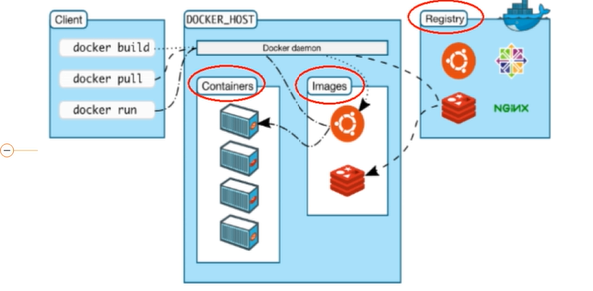

1. Kill 命令的一些区别  https://www.cnblogs.com/hollischuang/p/12880614.html
   
   1. Java程序的终止运行是基于JVM的关闭实现的，JVM关闭方式分为3种：
   
      > 正常关闭：当最后一个非守护线程结束或者调用了System.exit或者通过其他特定平台的方法关闭（接收到SIGINT（2）、SIGTERM（15）信号等）
      >
      > 强制关闭：通过调用Runtime.halt方法或者是在操作系统中强制kill（接收到SIGKILL（9）信号)
      >
      > 异常关闭：运行中遇到RuntimeException异常等。
   
   2. `kill -15`执行时，系统向对应的程序发送SIGTERM（15）信号，该信号是可以被执行、阻塞和忽略的，所以应用程序接收到信号后，可以做一些准备工作，再进行程序终止。
   
      1. 这也会带来很多副作用，如数据丢失等，所以，在非必要时，不要使用`kill -9`命令，尤其是那些web应用、提供RPC服务、执行定时任务、包含长事务等应用中，因为`kill -9` 没给spring容器、tomcat服务器、dubbo服务、流程引擎、状态机等足够的时间进行收尾。
   
   3. 有的时候，`kill -15`无法终止程序，因为他可能被忽略，这时候可以使用`kill -9`，系统会发出SIGKILL（9）信号，该信号不允许忽略和阻塞，所以应用程序会立即终止。
   
2. 进程间通讯的7种方式  https://blog.csdn.net/zhaohong_bo/article/details/89552188

   1. 管道pipe：管道是一种半双工的通信方式，数据只能单向流动，而且只能在具有亲缘关系的进程间使用。进程的亲缘关系通常是指父子进程关系。
   2. 命名管道FIFO：有名管道也是半双工的通信方式，但是它允许无亲缘关系进程间的通信。
   3. 消息队列MessageQueue：消息队列是由消息的链表，存放在内核中并由消息队列标识符标识。消息队列克服了信号传递信息少、管道只能承载无格式字节流以及缓冲区大小受限等缺点。
   4. 共享存储SharedMemory：共享内存就是映射一段能被其他进程所访问的内存，这段共享内存由一个进程创建，但多个进程都可以访问。共享内存是最快的 IPC 方式，它是针对其他进程间通信方式运行效率低而专门设计的。它往往与其他通信机制，如信号量，配合使用，来实现进程间的同步和通信。
   5. 信号量Semaphore：信号量是一个计数器，可以用来控制多个进程对共享资源的访问。它常作为一种锁机制，防止某进程正在访问共享资源时，其他进程也访问该资源。因此，主要作为进程间以及同一进程内不同线程之间的同步手段。
   6. 套接字Socket：套解口也是一种进程间通信机制，与其他通信机制不同的是，它可用于不同及其间的进程通信。
   7. 信号 ( sinal ) ： 信号是一种比较复杂的通信方式，用于通知接收进程某个事件已经发生。

3. 死锁产生的四个必要条件

   1. 互斥条件
   2. 不剥夺条件
   3. 循环等待
   4. 请求和保持
   5. 

4. 死锁如何处理

   1. 预防死锁

      1. 破坏互斥条件：将互斥的资源改为共享
      2. 破坏不可剥夺：1.主动放弃  2.操作系统协助
      3. 破坏请求和保持条件：可以一次性获取所有的资源
      4. 破坏循坏等待条件：可以顺序获取资源；

   2. 避免死锁：银行家算法

5. 进程调度算法（发生询问的时机：1.一个进程执行完了  2.有新的进程过来  3.cpu的时间片用完了）

   1. 旧的调度算法

      高响应比优先—HRRN

      最短剩余时间优先算法 SRTN

      

   2. 新的调度算法

      

6. 内存的扩充

   1. 旧的内存扩充

      1. 
      2. 

   2. 虚拟存储技术

      

      

7. 连续分配管理的内存分配？

   

   动态分区分配：

   1. 系统要用怎样的数据结构记录内存的使用情况呢？分为空闲分区表和空闲分区链

   2. 当多个空闲分区都能满足要求时，应该选择哪个分区进行分配？分为空闲分区表和空闲分区链讨论；

      

   3. 如何进行分区的分配和回收操作？分为空闲分区表和空闲分区链讨论；

8. 非连续分配管理的内存分配？

   

   

9. 快表？

   1. 

10. 磁盘调度算法

   11. 

       

18. docker 和 虚拟机的区别?https://www.zhihu.com/question/48174633   https://segmentfault.com/a/1190000019462392

    1. 虚拟机
       1. 虚拟机管理系统(Hypervisor)
       2. 客户机操作系统(Guest Operating System)。假设你需要运行3个相互隔离的应用，则需要使用Hypervisor启动3个客户机操作系统，也就是3个虚拟机。这些虚拟机都非常大，也许有700MB，这就意味着它们将占用2.1GB的磁盘空间。更糟糕的是，它们还会消耗很多CPU和内存。
       3. 各种依赖。每一个客户机操作系统都需要安装许多依赖。
       4. 应用。安装依赖之后，就可以在各个客户机操作系统分别运行应用了，
    2. docker分为
       1. 主操作系统
       2. Docker守护进程(Docker Daemon)。Docker守护进程取代了Hypervisor，它是运行在操作系统之上的后台进程，负责管理Docker容器。
       3. 各种依赖。对于Docker，应用的所有依赖都打包在Docker镜像中，Docker容器是基于Docker镜像创建的。
       4. 应用。应用的源代码与它的依赖都打包在Docker镜像中，不同的应用需要不同的Docker镜像。不同的应用运行在不同的Docker容器中，它们是相互隔离的。
    3. 对比
       1. Docker引擎运行在操作系统上，是基于<span style="color:red">内核的LXC、Chroot等技术实现容器的环境隔离和资源控制</span>，在容器启动后，容器里的进程直接与内核交互，无需经过Docker引擎中转，因此几乎没有性能损耗，能发挥出裸机的全部性能。
       2. Docker 是一种应用级别的容器引擎
       3. 虚拟机启动需要数分钟，而Docker容器可以在数毫秒内启动。由于没有臃肿的从操作系统，Docker可以节省大量的磁盘空间以及其他系统资源

19. docker 容器和镜像和仓库的区别？

    1. 

20. Docker的文件系统？

    

    1. Docker镜像采用分层存储格式，每个镜像可依赖其他镜像进行构建，每一层的镜像可被多个镜像引用，对用户而言，他们所看到的容器，其实是Docker利用UnionFS（联合文件系统）把相关镜像层的目录“联合”到同一个挂载点呈现出来的一个整体
    2. 利用UnionFS写时复制的特点，在启动一个容器时， Docker引擎实际上只是增加了一个可写层(如果对一个只读的文件进行修改，在修改前会先把文件复制一份到可写层)和构造了一个Linux容器，这两者都几乎不消耗系统资源，因此Docker容器能够做到秒级启动
    3. Docker中的操作系统镜像，与平常安装系统时用的ISO镜像不同。ISO镜像里包含了操作系统内核及该发行版系统包含的所有目录和软件，而Docker中的操作系统镜像，<span style="color:red">不包含系统内核，多个镜像公用同一个内核</span>，仅包含系统必备的一些目录（如/etc /proc等）和常用的软件和运行库等

21. Docker的资源隔离原理？

    1. `Linux Container`是Linux系统提供的容器化技术，简称`LXC`，它结合Namespace和CGroup技术为用户提供了更易用的接口来实现容器化

       > 1. 首先说一下何为容器，Linux系统提供了`Namespace`和`CGroup`技术实现环境隔离和资源控制，其中Namespace是Linux提供的一种内核级别环境隔离的方法，能使一个进程和该进程创建的子进程的运行空间都与Linux的超级父进程相隔离
       > 2. 注意Namespace只能实现运行空间的隔离，物理资源还是所有进程共用的，为了实现资源隔离，Linux系统提供了CGroup技术来控制一个进程组群可使用的资源（如CPU、内存、磁盘IO等），把这两种技术结合起来，就能构造一个用户空间独立且限定了资源的对象，这样的对象称为容器。

    2. LXC仅为一种轻量级的容器化技术，它仅能对部分资源进行限制，无法做到诸如网络限制、磁盘空间占用限制等。dotCloud公司结合LXC和`以下列出的技术`实现了Docker容器引擎：Chroot，UnionFS等

22. Docker持久化存储

    1. 把宿主机文件系统里的目录映射到容器内的目录。如此一来，容器内在该目录里创建的所有文件，都存储到宿主机的对应目录中
    2. 把多台宿主机的磁盘目录通过网络联合为共享存储，然后把共享存储中的特定目录映射给特定的容器

23. Docker镜像制作方法

    1. 通过正在运行的容器生成新镜像
    2. 通过Dockerfile文件来生成新镜像
    
18. 磁盘  https://mp.weixin.qq.com/s/tG1kOGtAJzHc37XGlsfAPQ

    1. df -h  主要是用于显示目前在 Linux 系统上的文件系统磁盘使用情况统计
       1. 
       2. 结果参数
          1. 
          2. 
    2. du 主要是为了显示目录或文件的大小。
       1. 常用参数
          1. 
       2. 结果参数
          1. 
    3. ls   主要是用于显示指定工作目录下的内容的信息
       1. 常用参数
          1. 
       2. 结果参数
          1. 

19. CPU过高

    1. 利用 top 查询CPU使用率最高的进程

       1. 常用参数

          1. 

          2. top进程内指令参数：

             

       2. 结果参数

          1. 
          2. 

20. Tomcat假死案例分析

    1. 发现问题 监控平台发现某个Tomcat节点已经无法采集到数据，连上服务器查看服务器进程还在，netstat -anop|grep 8001端口也有监听，查看日志打印时断时续
    2. /usr/bin/jmap -dump:live,format=b,file=/etc/redis/jmap-8001-2.bin 27401  dump内存快照
    3. 使用Memory Analyzer解析dump文件

21. 查询当前事务情况

    1. 可以通过查看如下3张表做相应的处理

       ```sql
       -- 当前运行的所有事务
       select *  from information_schema.innodb_trx;
       -- 当前出现的锁
       SELECT * FROM information_schema.INNODB_LOCKS;
       -- 锁等待的对应关系
       select *  from information_schema.INNODB_LOCK_WAITS;
       ```

    2. 查看当前的事务有哪些

       1. 

    3. 查看事务锁类型索引的详细信息

       1. 

22. 连接数过多：常出现too many connections异常,数据库连接到达最大连接数

    1. 解决方案：

       - 通过set global max_connections=XXX增大最大连接数。
       - 先利用show processlist获取连接信息，然后利用kill杀死过多的连

23. 优化SQL

    1. 通过增加索引，调整SQL语句的方式优化执行时长
       1. 
    
24. 命令：

    1. 磁盘和网络
       1. df：查看磁盘空间占用情况
       2. dh：查看当前目录下的文件及文件夹所占大小
       3. ifconfig：显示当前网络接口状态
       4. netstat：查看当前路由信息
    2. 解压与压缩
       1. tar
    3. 文件管理
       1. man：显示指定命令的帮助信息
       2. who：查询系统处于什么运行级别
       3. clear：用于清除屏幕信息
       4. mkdir：创建目录
       5. touch：用于创建文件
       6. more：用于分页查看文件，例如每页10行查看`boot.log`文件：more -c -10 /var/log/boot.log
       7. cat：用于查看文件
       8. cp：用于拷贝文件
    4. 软件安装
       1. rpm：RPM是`Red-Hat Package Manager`的缩写，一种Linux下通用的软件包管理方式，可用于安装和管理`.rpm`结尾的软件包
       2. yum：Yum是`Yellow dog Updater, Modified`的缩写，能够在线自动下载RPM包并安装，可以自动处理依赖性关系，并且一次安装所有依赖的软件包

​     


​      

