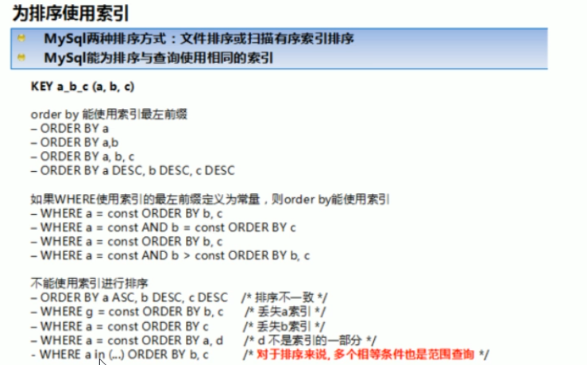
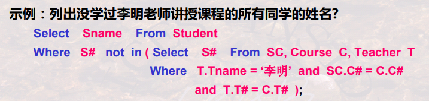
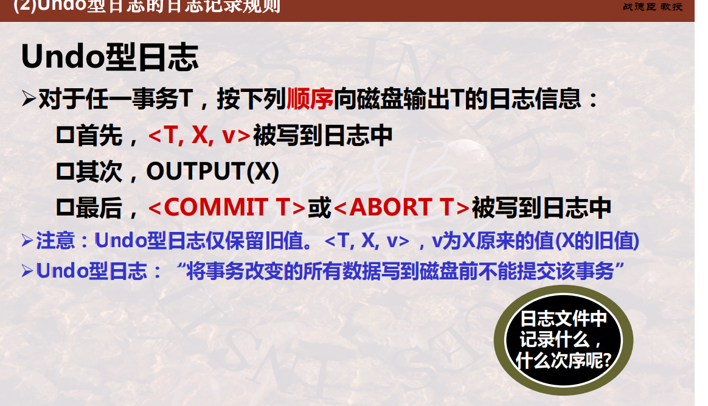
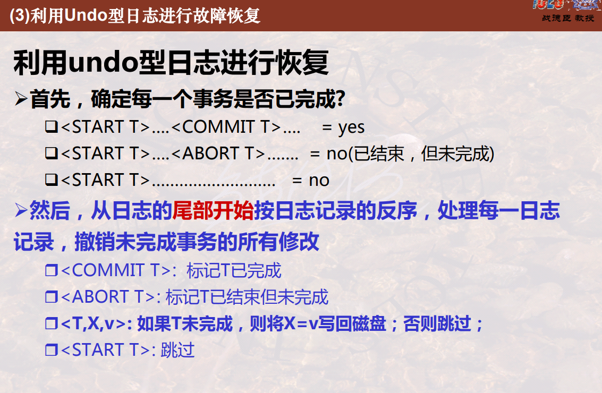
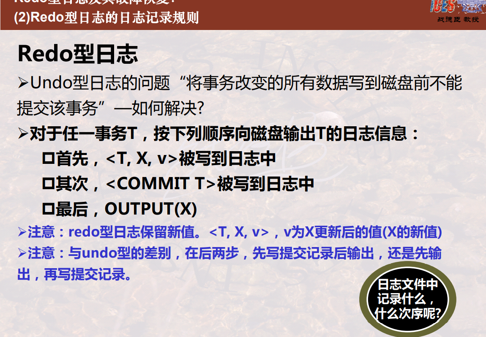
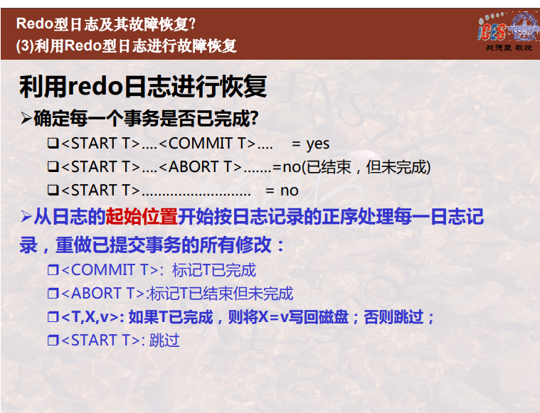
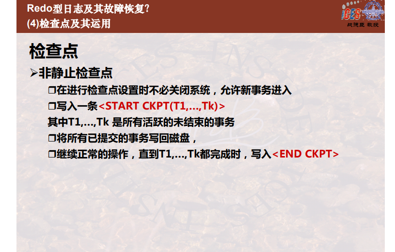
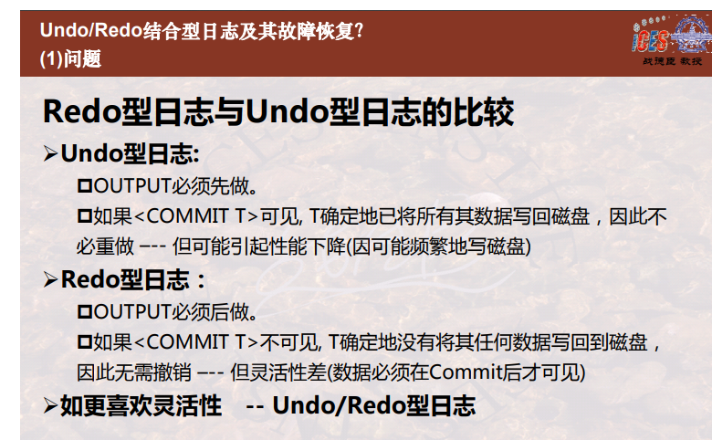

# mysql面试题

## 记住数据库的几个大的模块

1. sql和关系代数之间的实现关系，sql怎么实现关系代数的θ连接和外连接的（inner join 和 其它join）
2. 安全性和完整性
3. 数据库优化：物理优化和逻辑优化
4. 数据库索引
5. 数据库的事务处理：并发控制和故障恢复

## InnoDB 和 MyISAM 区别？

1. （答案来自看深入浅出mysql的笔记）  1.只有innodb支持外键（外键必须创建索引，这个会自动创建） 和 事务    2.MyISAM 支持全文索引，前缀压缩索引，innodb支持聚簇索引  3.innodb支持行锁，MVCC，间隙锁(next-key locking)，MyISAM 不支持    

   ## 说说 MySQL 的架构？

2.  0.mysql执行前会进行查询缓存->解析->优化->执行   1.连接层：连接处理、授权认证、安全  2.大多数 `MYSQL`的核心服务功能都在这一层，包括査询解析、分析、优化、缓存以及所有的内置函数(例如日期、时间、数学和加密函数)，所有跨存储引擎的功能都在这一层实现：存储过程、触发器、视图等。  3.引擎层，负责`MYSQL`中数据的储存和提取，提供了各种数据储存方法   


## 树

1. 一些树的概念：二叉搜索树（左边节点比根节点小，右边比根节点大），平衡二叉树（不一定是二叉搜索树），红黑树（属于平衡二叉树的一种，红黑树放弃了追求完全平衡，追求大致平衡；也属于二叉搜索树），b树（是多路搜索树），b+树
2. b树漫画入门：[地址](https://mp.weixin.qq.com/s?__biz=MzI2NjA3NTc4Ng==&mid=2652079363&idx=1&sn=7c2209e6b84f344b60ef4a056e5867b4&chksm=f1748ee6c60307f084fe9eeff012a27b5b43855f48ef09542fe6e56aab6f0fc5378c290fc4fc&scene=0&pass_ticket=75GZ52L7yYmRgfY0HdRdwlWLLEqo5BQSwUcvb44a7dDJRHFf49nJeGcJmFnj0cWg#rd)
3. b+树漫画入门：[地址](https://blog.csdn.net/qq_29373285/article/details/88610654)   1.b+树和b树的区别？  （1.尾端有链表直接相连，方便读取多条数据，2.有k个子树的中间节点包含有k个元素（B树中是k-1个元素），3.所有的中间节点元素都同时存在于子节点，4.只有叶子节点有卫星数据）
4. 加上这个b+树：[地址](https://mp.weixin.qq.com/s/jRZMMONW3QP43dsDKIV9VQ)  [地址](https://mp.weixin.qq.com/s/YMbRJwyjutGMD1KpI_fS0A)

1. 知道聚簇索引和非聚簇索引吗？  1.什么是聚簇索引，什么是非聚簇索引  2.什么引擎才有聚簇索引   3.非聚簇索引的二次查找  （感觉这个回答还是少了点，以后找找具体的回答）

2. 索引失效的情况？和explain的参数区别？

   1. 索引失效的情况

      1. 最佳左前缀

      2. 不在索引列上做任何操作(计算、函数、(自动or手动)类型转换)，会导致做了操作的索引列和后面的索引列都失效

      3. 存储引擎不能使用索引中范围条件右边的列（即右边索引列失效），使用范围的那一列还是可以使用的

      4. mysq在使用不等于(=或者<>)的时候无法使用整个索引会导致全表扫描

      5. 会导致使用了和 is not null 的列和后面的索引列都失效

      6. 要注使用like列及其后面的索引列会失效

      7. 使用or导致索引失效，无法使用整个索引会导致全表扫描

      8. 字符串不加单引号索引失效，会导致该索引列及后面的索引列失效

         

         需要注意的几点

         1. order的<号之前的字段的可以和where的const合在一起组成最左前缀
         2. 以下的这种四个都有的随便排列组合都是可以使用到全部索引列的
            explain select * from test03 where c4='a4' and c3='a3' and c2='a2' and c1='a1'\G;

      9. 如何尽量使用到索引？ https://mp.weixin.qq.com/s/3xkLTe7r388lRq-SBQllXw  

      10. 索引相关知识：https://mp.weixin.qq.com/s/woz5lkQwyJZNmoiiJZy7NA

   2. explain的参数区别：参考自己写的数据库的笔记

3. 慢查询分析：[地址](https://blog.csdn.net/qq_40884473/article/details/89455740)  主要是了解慢查询分析的各种参数 一：（ 1.slow_query_log用来开启，2.long_query_time设置慢查询的阈值，3.slow_query_log_file设置日志文件的存放路径等等   ） 二：mysqldumpslow工具用来分析日志，查找、分析SQL

4. mybatis防止注入？这个看了两篇文章，[文章1](https://mp.weixin.qq.com/s/TnODauaU3y3GdT7zTjWkGw)，[文章2](https://www.freebuf.com/vuls/240578.html)，重点关注在三个方面like，in和order by。----------------1.order必须的使用$，设置白名单进行解决，2.like使用 SQL concat() 函数解决，3.in使用foreach进行解决

5. 数据库的事务可能出现的四种错误：1.丢失更新 ，2.脏读（读到别人没提交的数据） ，3.不可重复读（两次都出现不一样），4.幻读（两次都出来新增加了数据）

6. 数据库的隔离级别和传播行为：1.读未提交，2.读已提交，3.可重复读，4.可串行化  ；InnoDB 存储引擎默认使用 REPEAaTABLE-READ（可重读） 

   7. TransactionDefinition.PROPAGATION_REQUIRED：使用的最多的一个事务传播行为，我们平时经常使用的`@Transactional`注解默认使用就是这个事务传播行为。如果当前存在事务，则加入该事务；如果当前没有事务，则创建一个新的事务。

   8. TransactionDefinition.PROPAGATION_REQUIRES_NEW： 创建一个新的事务，如果当前存在事务，则把当前事务挂起。也就是说不管外部方法是否开启事务，`Propagation.REQUIRES_NEW`修饰的内部方法会新开启自己的事务，且开启的事务相互独立，互不干扰。

   9. TransactionDefinition.PROPAGATION_NESTED:如果当前存在事务，则创建一个事务作为当前事务的嵌套事务来运行；如果当前没有事务，则该取值等价于`TransactionDefinition.PROPAGATION_REQUIRED`。

      1. 在外部方法未开启事务的情况下`Propagation.NESTED`和`Propagation.REQUIRED`作用相同，修饰的内部方法都会新开启自己的事务，且开启的事务相互独立，互不干扰。
      2. 如果外部方法开启事务的话，`Propagation.NESTED`修饰的内部方法属于外部事务的子事务，外部主事务回滚的话，子事务也会回滚，而内部子事务可以单独回滚而不影响外部主事务和其他子事务。

   10. TransactionDefinition.PROPAGATION_MANDATORY：如果当前存在事务，则加入该事务；如果当前没有事务，则抛出异常。（mandatory：强制性）

   11. TransactionDefinition.PROPAGATION_SUPPORTS: 如果当前存在事务，则加入该事务；如果当前没有事务，则以非事务的方式继续运行。

   12. TransactionDefinition.PROPAGATION_NOT_SUPPORTED: 以非事务方式运行，如果当前存在事务，则把当前事务挂起。

   13. TransactionDefinition.PROPAGATION_NEVER: 以非事务方式运行，如果当前存在事务，则抛出异常。

14. InnoDB的行锁？

    `InnoDB` 实现了以下两种类型的行锁。

    - 共享锁（`S`）：允许一个事务去读一行，阻止其他事务获得相同数据集的排他锁。
    - 排他锁（`X`)：允许获得排他锁的事务更新数据，阻止其他事务取得相同数据集的共享读锁和排他写锁。

    另外，为了允许行锁和表锁共存，实现多粒度锁机制，`InnoDB` 还有两种内部使用的意向锁（`Intention Locks`），这两种意向锁都是**表锁**。

    - 意向共享锁（`IS`）：事务打算给数据行加行共享锁，事务在给一个数据行加共享锁前必须先取得该**表**的 `IS`锁。
    - 意向排他锁（`IX`）：事务打算给数据行加行排他锁，事务在给一个数据行加排他锁前必须先取得该**表**的 `IX`锁。

    1. 意向锁是 `InnoDB` 自动加的，不需用户干预。对于 `UPDATE`、`DELETE` 和 `INSERT` 语句，`InnoDB`会自动给涉及数据集加排他锁（X)；**对于普通 SELECT 语句，`InnoDB` 不会加任何锁**；事务可以通过以下语句显式给记录集加共享锁或排他锁。
       1. 共享锁（S）：`SELECT * FROM table_name WHERE ... LOCK IN SHARE MODE`。
       2. 排他锁（X)：`SELECT * FROM table_name WHERE ... FOR UPDATE`。
    2. **InnoDB行锁**不是一次性上锁并且支持锁升级
    3. **InnoDB 行锁**是通过给索引上的索引项加锁来实现的
       1. 在不通过索引条件查询的时候，`InnoDB` 确实使用的是表锁
       2. 由于 `MySQL` 的行锁是针对索引加的锁，不是针对记录加的锁，所以虽然是访问不同行的记录，但是如果是使用相同的索引键，是会出现锁冲突的
       3. 当表有多个索引的时候，不同的事务可以使用不同的索引锁定**不同的行，并不是相同的行！！！**

15. mysql的七种锁：[地址](https://mp.weixin.qq.com/s/pWHCieOwAdCrz8cauduWlQ)

    1. (1)共享/排它锁(Shared and Exclusive Locks)：分为表锁和行锁
       (2)意向锁(Intention Locks)：是表级锁
       (3)记录锁(Record Locks)：**它封锁索引记录**，例如：select * from t where id=1 for update;

       (4)间隙锁(Gap Locks)：**它封锁索引记录中的间隔**，或者第一条索引记录之前的范围，又或者最后一条索引记录之后的范围；间隙锁的主要目的，就是为了防止其他事务在间隔中插入数据
       (5)临键锁(Next-key Locks)：**是记录锁与间隙锁的组合**，它的封锁范围，既包含索引记录，又包含索引区间
       (6)插入意向锁(Insert Intention Locks)：**是间隙锁(Gap Locks)的一种**（所以，也是实施在索引上的），它是专门针对insert操作的；多个事务，在同一个索引，同一个范围区间插入记录时，如果插入的位置不冲突，不会阻塞彼此
       (7)自增锁(Auto-inc Locks)：是表锁，自增锁是一种特殊的表级别锁

16. 不同隔离级别上使用的锁

    1. 三，可重复读(Repeated Read, RR)
       1. 普通的select使用快照读(snapshot read)
       2. 加锁的select(select ... in share mode / select ... for update), update, delete等语句；在唯一索引上使用唯一的查询条件，会使用记录锁(record lock)；范围查询条件，会使用间隙锁与临键锁
    2. 四，读提交(Read Committed, RC)
       1. 普通读是快照读；
       2. 加锁的select, update, delete等语句，除了在外键约束检查(foreign-key constraint checking)以及重复键检查(duplicate-key checking)时会封锁区间，其他时刻都只使用记录锁

17. MVCC？[地址](https://mp.weixin.qq.com/s/Jeg8656gGtkPteYWrG5_Nw)  [地址二](https://mp.weixin.qq.com/s/R3yuitWpHHGWxsUcE0qIRQ) [地址三，主要是搞懂一致性读也叫快照读，其他读为当前读](https://mp.weixin.qq.com/s/qHzb6oPrrbAPoIlfLJVNAg)

    1. `MVCC`只在 `REPEATABLE READ`和 `READ COMMITTED`两个隔离级别下工作。其他两个隔离级别都和`MVCC`不兼容，因为 `READ UNCOMMITTED`总是读取最新的数据行，而不是符合当前事务版本的数据行。而 `SERIALIZABLE`则会对所有读取的行都加锁。
    2. `READ COMMITTD`在每一次进行普通`SELECT`操作前都会生成一个`ReadView`，而`REPEATABLE READ`只在第一次进行普通`SELECT`操作前生成一个`ReadView`，之后的查询操作都重复这个`ReadView`就好了。
    3. 隐藏字段（`trx_id`列：**mysql5.7中，有写入操作的时候才分配trx_id**和roll_pointer列），Undo日志
    4. 在事务生成`readview`时，会把当前系统中正在执行的读写事务写入到`m_ids`列表中，另外还会存储两个值：
       - `min_trx_id`：该值代表生成`readview`时`m_ids`中的最小值。
       - `max_trx_id`：该值代表生成`readview`时系统中应该分配给下一个事务的id值。

       所以判断可见性的步骤就是：
       - 如果记录的`trx_id`列小于`min_trx_id`，说明肯定可见。
       - 如果记录的`trx_id`列大于`max_trx_id`，说明肯定不可见。
         - 如果记录的`trx_id`列在`min_trx_id`和`max_trx_id`之间，就要看一下该`trx_id`在不在`m_ids`列表中，如果在，说明不可见，否则可见。

18. 数据库连接池怎么设计？[地址](https://blog.csdn.net/shuaihj/article/details/14223015)  2、多数据库服务器和多用户，  1、并发问题，3、事务处理，    4、连接池的分配与释放，5、连接池的配置与维护

19. drop、delete与truncate的区别？用drop；在想删除部分数据行时候，用delete；在保留表而删除所有数据的时候用truncate ----[地址](https://www.cnblogs.com/zhizhao/p/7825469.html)

20. 复杂SQL

    1. Order by，Group by， Like

    2. 子查询（分清相关子查询和非相关子查询，not的话理解not in和not exist就行了）

       1. not in

          

       2. Some与 All子查询

          ```sql
          1.找出工资最低的教师姓名 Select Tname From Teacher Where Salary <= all ( Select Salary From Teacher ); 
          2.找出001号课成绩不是最高的所有学生的学号
          Select S# From SC
          Where C# = “001” and 
          Score < some ( Select Score From SC Where C# = “001” );
          3.找出所有课程都不及格的学生姓名(相关子查询)
          Select Sname From Student
          Where 60 > all ( Select Score From SC
          Where S# = Student.S# );
          ```

       3. NOT Exist

          ```sql
          1.检索学过001号教师主讲的所有课程的所有同学的姓名
          Select Sname From Student
          Where not exists //不存在
          ( Select * From Course //有一门001教师主讲课程
          Where Course.T# = ‘001’ and not exists //该同学没学过
          ( Select * From SC
          Where S# = Student.S# and C# = Course.C# ) );
          上述语句的意思：不存在有一门001号教师主讲的课程该同学没学过
          2.列出至少学过98030101号同学学过所有课程的同学的学号
          Select DISTINC S# From SC SC1
          Where not exists //不存在
          ( Select * From SC SC2 //有一门课程
          Where SC2.S# = ‘98030101’ and not exists //该同学没学过
          ( Select * From SC
          Where C# = SC2.C# and S# = SC1.S# ) );
          3.已知SPJ(Sno, Pno, Jno, Qty), 其中Sno供应商号，Pno零件号，
          Jno工程号，Qty数量，列出至少用了供应商S1供应的全部零件的工程号
          Select DISTINCT Jno From SPJ SPJ1
          Where not exists //不存在
          ( Select * From SPJ SPJ2 //有一种S1的零件
          Where SPJ2.Sno = ‘S1’ and not exists //该工程没用过
          ( Select * From SPJ SPJ3
          Where SPJ3.Pno = SPJ2.Pno 
          and SPJ3.Jno = SPJ1.Jno ) );
          ```

21. mysql架构？

    1. 单节点的可用性？单点系统存在的问题：可用性问题，性能瓶颈问题  [文章](https://mp.weixin.qq.com/s?__biz=MjM5ODYxMDA5OQ==&mid=2651959480&idx=1&sn=337bd74410a6bef616128fd17abd08a8&scene=21#wechat_redirect)

       1. shadow-master是一种常见的解决单点系统可用性问题的方案
       2. 减少与单点的交互，是存在单点的系统优化的核心方向，常见方法有批量写，客户端缓存
       3. 水平扩展也是提升单点系统性能的好方案

    2. 如何保证主库写高可用？和主库一致性问题？2020 https://mp.weixin.qq.com/s/_tT4L3ukmktUV3K8g7ZmeQ

       1. 保证高可用：通过双主架构，并设置双向同步，以冗余写库的方式，保证写库的高可用
       2. 主库一致性问题：
          1. 两个主库同时提供服务---->使用相同步长，不同初始值   或者    业务自己生成id
          2. 只有一个写库提供服务---->shadow-master（keepalived+vip）内网DNS探测

    3. 数据库的架构2019 https://mp.weixin.qq.com/s/3Q_ODwpbpCf3zcH57xUf4g   https://mp.weixin.qq.com/s/6zMc-IVBGRI788694ZKQig

       1. 数据库分组架构（主从同步）究竟解决什么问题？
          1. 线性提升数据库读性能
          2. 通过消除读写锁冲突提升数据库写性能
          3. 通过冗余从库实现数据的“读高可用”
       2. 分片架构（水平切分，这里特指进行分库）究竟解决什么问题？
          1. 线性提升数据库写性能，需要注意的是，分组架构是不能线性提升数据库写性能的
          2. 降低单库数据容量
       3. 垂直切分（这里特指进行分库）解决什么问题？
          1. 垂直切分即可以降低单库的数据量，还可以降低磁盘IO从而提升吞吐量，但它与业务结合比较紧密，并不是所有业务都能够进行垂直切分的。

    4. 数据库主从一致性问题2018 https://mp.weixin.qq.com/s/c1mOxGeoJzlWC1YkkbDRgA https://mp.weixin.qq.com/s/5JYtta9aMGcic7o_ejna-A  2016 [文章](https://mp.weixin.qq.com/s?__biz=MjM5ODYxMDA5OQ==&mid=2651959442&idx=1&sn=feb8ff75385d8031386e120ef3535329&scene=21#wechat_redirect)

       1. 方案一：忽略

       2. 方案二：强制读主

       3. 方案三：进行选择性读主

          （1）写主库

          （2）将哪个库，哪个表，哪个主键三个信息拼装一个key设置到cache里，这条记录的超时时间，设置为“主从同步时延”

       4. 方案四：使用数据库中间件

    5. 缓存和数据库一致性问题 2016- [文章](https://mp.weixin.qq.com/s?__biz=MjM5ODYxMDA5OQ==&mid=404202261&idx=1&sn=1b8254ba5013952923bdc21e0579108e&scene=21#wechat_redirect)  2016- [文章](https://mp.weixin.qq.com/s?__biz=MjM5ODYxMDA5OQ==&mid=404308725&idx=1&sn=1a25ce76dd1956014ceb8a011855268e&scene=21#wechat_redirect)

       1. 由于数据库层面的读写并发，引发的数据库与缓存数据不一致的问题（本质是后发生的读请求先返回了），可能通过两个小的改动解决：

          （1）修改服务Service连接池，id取模选取服务连接，能够保证同一个数据的读写都落在同一个后端服务上

          （2）修改数据库DB连接池，id取模选取DB连接，能够保证同一个数据的读写在数据库层面是串行的

    6. 主从DB与cache一致性   [别人的文章](https://mp.weixin.qq.com/s?__biz=MzAwNDA2OTM1Ng==&mid=2453149368&idx=2&sn=75d6ba3523303d9cac1f1c367209ef89&scene=21#wechat_redirect)

       1. 在“异常时序”或者“读从库”导致脏数据入缓存时，可以用**二次异步淘汰**的“**缓存双淘汰**”法来解决缓存与数据库中数据不一致的问题，具体实施至少有三种方案：

          （1）timer异步淘汰（本文没有细讲，本质就是起个线程专门异步二次淘汰缓存）

          （2）总线异步淘汰

          （3）读binlog异步淘汰

    7. 

    8. 

    9. 

    10. InnoDB的架构？

       1. 

       2. InnoDB整体也分为三层：

          （1）**内存结构**(In-Memory Structure)，这一层在MySQL服务进程内；

          （2）**OS Cache**，这一层属于内核态内存；

          （3）**磁盘结构**(On-Disk Structure)，这一层在文件系统上；

       3. 下面介绍的都是内存结构，不是磁盘结构

    11. 缓冲池(buffer pool)技术？ https://mp.weixin.qq.com/s/zKHNaWY5AS0OMmag1mQTKQ

        1. InnoDB的缓冲池缓存什么？有什么用？（时间）缓存**表数据与索引数据**，把磁盘上的数据加载到缓冲池，避免每次访问都进行磁盘IO，起到加速访问的作用。
        2. 什么是预读？（空间）磁盘读写，并不是按需读取，而是按页读取，一次至少读一页数据（一般是4K），如果未来要读取的数据就在页中，就能够省去后续的磁盘IO，提高效率

    12. 可能存在的问题？

        （1）预读失效：由于预读(Read-Ahead)，提前把页放入了缓冲池，但最终MySQL并没有从页中读取数据，称为预读失效

        （2）缓冲池污染：当某一个SQL语句，要批量扫描大量数据时，可能导致把缓冲池的所有页都替换出去，导致大量热数据被换出，MySQL性能急剧下降，这种情况叫缓冲池污染

    13. 怎么解决？

        1. 预读失效：将缓冲池分为**老生代和新生代**，入缓冲池的页，优先进入老生代，页被访问，才进入新生代，以解决预读失效的问题
        2. ）缓冲池污染：页被访问，且在老生代**停留时间超过配置阈值**的，才进入新生代，以解决批量数据访问，大量热数据淘汰的问题

    14. 什么是InnoDB的写缓冲？

        1. 它是一种应用在**非唯一普通索引页**(non-unique secondary index page)不在缓冲池中，对页进行了写操作，并不会立刻将磁盘页加载到缓冲池，而仅仅记录缓冲变更(buffer changes)，等未来数据被读取时，再将数据合并(merge)恢复到缓冲池中的技术。写缓冲的**目的**是降低写操作的磁盘IO，提升数据库性能。适用于业务是写多读少，或者不是写后立刻读取

    15. 为什么写缓存仅适用于非唯一普通索引？

        1. 如果索引设置了唯一(unique)属性，在进行修改操作时，InnoDB必须进行唯一性检查。也就是说，索引页即使不在缓冲池，磁盘上的页读取无法避免(否则怎么校验是否唯一？)，此时就应该直接把相应的页放入缓冲池再进行修改，而不应该再整写缓冲这个幺蛾子。

    16. 除了数据页被访问，还有哪些场景会触发刷写缓冲中的数据呢？

        1. （1）有一个后台线程，会认为数据库空闲时；

           （2）数据库缓冲池不够用时；

           （3）数据库正常关闭时；

           （4）redo log写满时；

    17. 

    18. 

    19. redo log的三层架构：

        1. 
        2. **粉色**，是InnoDB的一项很重要的内存结构(In-Memory Structure)，日志缓冲区(Log Buffer)，这一层，是MySQL应用程序用户态
        3. **屎黄色**，是操作系统的缓冲区(OS cache)，这一层，是OS内核态
        4. **蓝色**，是落盘的日志文件

    20. 各种缓存的意义？

        1. 操作系统为什么要缓冲数据到OS cache里，而不直接刷盘（flush，fsync）呢？这里就是将“每次写”优化为“批量写”，以提高操作系统性能。
        2. 数据库为什么要缓冲数据到Log Buffer里，而不是直接write呢？这也是“每次写”优化为“批量写”思路的体现，以提高数据库性能。

    21. MySQL事务提交时刷redo log有三种策略：

        1. （1）0：每秒write一次OS cache，同时fsync刷磁盘，性能好；
           （2）1：每次都write入OS cache，同时fsync刷磁盘，一致性好；
           （3）2：每次都write入OS cache，每秒fsync刷磁盘，折衷；

    22. 

    23. 

    24. RedoLog 和UndoLog的区别？ https://mp.weixin.qq.com/s/R3yuitWpHHGWxsUcE0qIRQ

        1. `redo log`的作用是为**持久化**而生的。写完内存，如果数据库挂了，那我们可以通过`redo log`来恢复内存还没来得及刷到磁盘的数据，将`redo log`加载到内存里边，那内存就能恢复到挂掉之前的数据了。（具体怎么恢复还不懂）
        2. `undo log`主要有两个作用：回滚和多版本控制(MVCC)
        3. 一句话，redo日志用于保障，已提交事务的ACID特性。
        4. 一句话，undo日志用于保障，未提交事务不会对数据库的ACID特性产生影响。

    25. 为什么要有undo日志？

        1. 数据库事务未提交时，会将事务修改数据的镜像（即修改前的旧版本）存放到undo日志里，当事务回滚时，或者数据库奔溃时，可以利用undo日志，即旧版本数据，撤销未提交事务对数据库产生的影响。

    26. 什么是回滚段？

        存储undo日志的地方，是回滚段。undo日志和回滚段和InnoDB的MVCC密切相关，回滚段里的数据，其实是历史数据的快照（snapshot），这些数据是不会被修改，select可以肆无忌惮的并发读取他们

    27. 

    28. 

    29. 

    30. 主从复制的原理？https://mp.weixin.qq.com/s/eEWMSTAUF1H-gFBx26jujw

        1. 原理
           1. MySql主库在事务提交时会把数据变更作为事件记录在二进制日志Binlog中；
              2. 主库推送二进制日志文件Binlog中的事件到从库的中继日志Relay Log中，之后从库根据中继日志重做数据变更操作，通过逻辑复制来达到主库和从库的数据一致性；
         2. 主从复制的并发重放Relay Log  https://mp.weixin.qq.com/s/pP2f7CYbT7ftM0tvk9c4mQ
               1. mysql5.6：按照库并行复制，建议使用“多库”架构；
            2. mysql5.7：按照GTID并行复制：将主库上同时并行执行的事务，分为一组，编一个号，这些事务在从库上的回放可以并行执行 ，和原来的日志相比，多了last_committed和sequence_number，last_committed是事务提交时，上次事务提交的编号，如果具备相同的last_committed，说明它们在一个组内，可以并发回放执行

    31. 主从复制的三个线程？

        1. MySql通过三个线程来完成主从库间的数据复制，其中Binlog Dump线程跑在主库上，I/O线程和SQL线程跑着从库上；
        2. 当在从库上启动复制时，首先创建I/O线程连接主库，主库随后创建Binlog Dump线程读取数据库事件并发送给I/O线程，I/O线程获取到事件数据后更新到从库的中继日志Relay Log中去，之后从库上的SQL线程读取中继日志Relay Log中更新的数据库事件并应用，如下图所示。
        3. 

    32. BinLog的日志格式？https://blog.csdn.net/ouyang111222/article/details/50300851

        1. Statement：每一条会修改数据的sql都会记录在binlog中。
           1. 优点：不需要记录每一行的变化，减少了binlog日志量，节约了IO，提高性能。
           2. 缺点：由于记录的只是执行语句，为了这些语句能在slave上正确运行，因此还必须记录每条语句在执行的时候的一些相关信息，以保证所有语句能在slave得到和在master端执行时候相同 的结果。另外mysql 的复制,像一些特定函数功能，slave可与master上要保持一致会有很多相关问题。
        2. Row：
           3. 优点： binlog中可以不记录执行的sql语句的上下文相关的信息，仅需要记录那一条记录被修改成什么了。所以rowlevel的日志内容会非常清楚的记录下每一行数据修改的细节。而且不会出现某些特定情况下的存储过程，或function，以及trigger的调用和触发无法被正确复制的问题.
                 2. 缺点:所有的执行的语句当记录到日志中的时候，都将以每行记录的修改来记录，这样可能会产生大量的日志内容。

         3. Mixed


故障恢复

故障恢复涉及到如何保证原子性和持久性---看了一个多小时没看懂


1. Undo型日志：“将事务改变的所有数据写到磁盘前不能提交该事务”	

   

   

   

   

2. 

   

   

   

   


# 文章汇总

1. SQL与索引优化合集  https://mp.weixin.qq.com/s/3xkLTe7r388lRq-SBQllXw
2. 索引，一文搞定   https://mp.weixin.qq.com/s/woz5lkQwyJZNmoiiJZy7NA
3. MySql 的各种锁   https://mp.weixin.qq.com/s/pWHCieOwAdCrz8cauduWlQ
4. InnoDB的各种缓存    https://mp.weixin.qq.com/s/zKHNaWY5AS0OMmag1mQTKQ


​    

​    

​    

​    

​    


