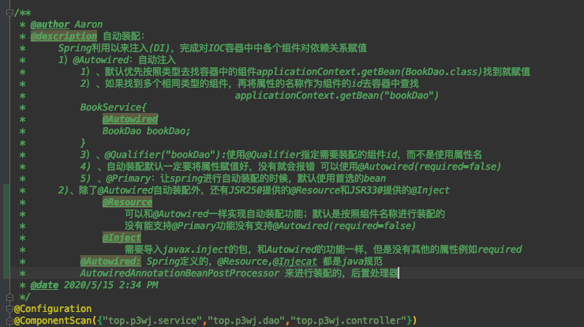

# spring

## 各种循环依赖的解决？

1. singletonsCurrentlyInCreation：解决**构造方法**循环依赖的问题

2. prototypesCurrentlyInCreation：解决**原型循环**依赖的问题

3. Map<String, Object> singletonObjects； Map<String, Object> earlySingletonObjects； Map<String, ObjectFactory<?>> singletonFactories：**解决setter和Filed注入**的循环依赖问题

   1. addSingleton  **其中一次**会在getSingleton(String beanName, ObjectFactory<?> singletonFactory) **两个参数**中被调用

   2. 二级缓存：添加：向里面添加数据只有一个地方，就是上面说的`getSingleton(beanName)` **一个参数**里从三级缓存里挪过来
       移除：`addSingleton、addSingletonFactory、removeSingleton`从代码中可以看出添加单例、添加单例工厂`ObjectFactory`的时候都会删除二级缓存里面对应的缓存值，是互斥的

   3. addSingletonFactory会在doCreateBean中被调用：**三级缓存中存的是对象的相关的ObjectFactory，如果被代理并且产生了循环依赖，那么就会提前进行aop的织入操作，doCreateBean里面的织入就不用再次进行了**

      1. 上面实现提前织入的代码为

         ```java
         // 下面是doCreateBean方法initializeBean里面的
         /** bean 初始化后置处理方法 */
         	public Object postProcessAfterInitialization(@Nullable Object bean, String beanName) {
         		if (bean != null) {
         			Object cacheKey = getCacheKey(bean.getClass(), beanName);
         			if (this.earlyProxyReferences.remove(cacheKey) != bean) {
         				// 如果需要，为 bean 生成代理对象
         				return wrapIfNecessary(bean, beanName, cacheKey);
         			}
         		}
         		return bean;
         	}
         ```

         ```java
         // 下面是doCreateBean方法里面的
         addSingletonFactory(beanName, () -> {
         				// 获取早期 bean 的引用，如果 bean 中的方法被 AOP 切点所匹配到，此时 AOP 相关逻辑会介入
         				return getEarlyBeanReference(beanName, mbd, bean); // 看下面的函数
         			});
         
         	protected Object getEarlyBeanReference(String beanName, RootBeanDefinition mbd, Object bean) {
         		Object exposedObject = bean;
         		if (!mbd.isSynthetic() && hasInstantiationAwareBeanPostProcessors()) {
         			for (SmartInstantiationAwareBeanPostProcessor bp : getBeanPostProcessorCache().smartInstantiationAware) {
         				exposedObject = bp.getEarlyBeanReference(exposedObject, beanName);// 看AbstractAutoProxyCreator类，它实现了smartInstantiationAware接口
         			}
         		}
         		return exposedObject;
         	}
         // 其中的AbstractAutoProxyCreator.getEarlyBeanReference方法
         @Override
         public Object getEarlyBeanReference(Object bean, String beanName) {
            Object cacheKey = getCacheKey(bean.getClass(), beanName);
            this.earlyProxyReferences.put(cacheKey, bean);
            return wrapIfNecessary(bean, beanName, cacheKey);
         }
         ```


## 为什么需要三级缓存？

1. 为什么需要三级缓存？3级缓存在这里有什么目的呢？
   1. 3级缓存里面保存的是对象工厂，这个对象工厂内部保留着最原生的对象引用，ObjectFactory的实现类，getObject()方法，它需要考虑一个问题。它到底要返回原生的，还是增强后的。getObject会判断当前这个早期实例 是否需要被增强，如果是，那么提前完成动态代理增强，返回代理对象。否则，返回原生对象。

## springioc的步骤？

1. getBean->doGetBean
   1. 尝试获取缓存
   2. 解决原型依赖
   3. 合并beanDefinition
   4. 解决depend-on依赖
2. getSingleton
   1. beforeSingletonCreation
   2. afterSingletonCreation
   3. addSingleton
3. createBean
   1. 处理 lookup-method 和 replace-method 配置
   2. 在 bean 初始化前应用后置处理resolveBeforeInstantiation（注意applyBeanPostProcessorsBeforeInstantiation和applyBeanPostProcessorsAfterInitialization的区别，前一个是InstantiationAwareBeanPostProcessor接口的，后一个是BeanPostProcessor接口的）
4. doGetBean
   1. createBeanInstance
   2. 添加到三级缓存
   3. populateBean
   4. initializeBean
      1. 若 bean 实现了 BeanNameAware、BeanFactoryAware、BeanClassLoaderAware 等接口，则向 bean 中注入相关对象
      2. 执行 bean 初始化前置操作
      3. 调用初始化方法invokeInitMethods
      4. 执行 bean 初始化后置操作

## Spring生命周期详细描述?

[5.5 Spring 中的 bean 生命周期?](https://snailclimb.gitee.io/javaguide/#/docs/system-design/framework/spring/Spring常见问题总结?id=_55-spring-中的-bean-生命周期)

这部分网上有很多文章都讲到了，下面的内容整理自：https://yemengying.com/2016/07/14/spring-bean-life-cycle/ ，除了这篇文章，再推荐一篇很不错的文章 ：https://www.cnblogs.com/zrtqsk/p/3735273.html 。

- Bean 容器找到配置文件中 Spring Bean 的定义。
- Bean 容器利用 Java Reflection API 创建一个Bean的实例。
- 如果涉及到一些属性值 利用 `set()`方法设置一些属性值。
- 如果 Bean 实现了 `BeanNameAware` 接口，调用 `setBeanName()`方法，传入Bean的名字。
- 如果 Bean 实现了 `BeanClassLoaderAware` 接口，调用 `setBeanClassLoader()`方法，传入 `ClassLoader`对象的实例。
- 与上面的类似，如果实现了其他 `*.Aware`接口，就调用相应的方法。
- 如果有和加载这个 Bean 的 Spring 容器相关的 `BeanPostProcessor` 对象，执行`postProcessBeforeInitialization()` 方法
- 如果Bean实现了`InitializingBean`接口，执行`afterPropertiesSet()`方法。
- 如果 Bean 在配置文件中的定义包含  init-method 属性，执行指定的方法。
- 如果有和加载这个 Bean的 Spring 容器相关的 `BeanPostProcessor` 对象，执行`postProcessAfterInitialization()` 方法
- 当要销毁 Bean 的时候，如果 Bean 实现了 `DisposableBean` 接口，执行 `destroy()` 方法。
- 当要销毁 Bean 的时候，如果 Bean 在配置文件中的定义包含 destroy-method 属性，执行指定的方法。

图示：


与之比较类似的中文版本:


## 如何保证Bean的线程安全?

https://blog.csdn.net/weixin_43727372/article/details/100324678

1. threadlocal 
2. 使用多例
3. 设计时避免有状态

## Spring中的AOP是如何实现的，jdk和CGLIB方法的区别?

1. AbstractAdvisorAutoProxyCreator实现了BeanFactoryAware接口，ioc容器为它做了啥？
2. AbstractAdvisorAutoProxyCreator作为InstantiationAwareBeanPostProcessor接口做了啥？
   1. 解析 @Aspect 注解，并构建通知器aspectJAdvisorsBuilder.buildAspectJAdvisors
      1. beanType 判断当前 bean 是否是一个的 Aspect 注解类
         1. getAdvisorMethods 用于返回不包含 @Pointcut 注解的方法，为每个方法分别调用 getAdvisor 方法
   2. createAopProxy
      1. 获取适合当前方法的拦截器getInterceptorsAndDynamicInterceptionAdvice
         1. 对于 PointcutAdvisor 类型的通知器，这里要调用通知器所持有的切点（Pointcut）对类和方法进行匹配，匹配成功说明应向当前方法织入通知逻辑
      2. invocation.proceed()执行拦截器链


## spring怎么实现事务的？

https://developer.ibm.com/zh/articles/j-master-spring-transactional-use/

1. 步骤：

   1. > 1. 编程式事务，在代码中硬编码。(不推荐使用)
      > 2. 声明式事务，在配置文件中配置（推荐使用）
      >
      > **声明式事务又分为两种：**
      >
      > 1. 基于XML的声明式事务
      > 2. 基于注解的声明式事务

      

2. 原理：

   1. AutoProxyRegistrar的InfrastructureAdvisorAutoProxyCreator 接口做了啥？Infrastructure（基础设施）
   2. ProxyTransactionManagementConfiguration 做了啥？
      1. transactionAttributeSource：解析事务注解，就是获取注解中各种属性的值
      2. transactionInterceptor：保存了事务属性信息transactionAttributeSource，事务管理器 txManager
         1. 看看拦截器的invoke方法
            1. 先获取事务相关的属性  transactionAttributeSource
            2. 再获取PlatformTransactionManager，如果事先没有添加指定任何transactionmanger （在@Transactional注解中可以指定）；最终会从容器中按照类型获取一个PlatformTransactionManager； 
            3. 执行目标方法；；如果异常，获取到事务管理器，利用事务管理回滚操作；；如果正常，利用事务管理器，提交事务


## Spring事务失效和解决方案？

1. 正确的设置 @Transactional 的 propagation 属性
   1. TransactionDefinition.PROPAGATION_REQUIRES_NEW： 创建一个新的事务，如果当前存在事务，则把当前事务挂起。
   2. TransactionDefinition.PROPAGATION_NOT_SUPPORTED： 以非事务方式运行，如果当前存在事务，则把当前事务挂起。
   3. TransactionDefinition.PROPAGATION_NEVER： 以非事务方式运行，如果当前存在事务，则抛出异常。
2. 正确的设置 @Transactional 的 rollbackFor 属性
3. @Transactional 只能应用到 public 方法才有效
4. 避免 Spring 的 AOP 的自调用问题


## 说说IOC和AOP？

自己的总结：

1. IoC（Inverse of Control:控制反转）是一种设计思想，就是 将原本在程序中手动创建对象的控制权，交由Spring框架来管理。在实际项目中一个 Service 类可能有几百甚至上千个类作为它的底层，假如我们需要实例化这个 Service，你可能要每次都要搞清这个  Service 所有底层类的构造函数，这可能会把人逼疯。如果利用 IoC  的话，你只需要配置好，然后在需要的地方引用就行了，这大大增加了项目的可维护性且降低了开发难度。
2. aop：AOP(Aspect-Oriented Programming:面向切面编程)能够将那些与业务无关，却为业务模块所共同调用的逻辑或责任（例如事务处理、日志管理、权限控制等）封装起来，便于减少系统的重复代码，降低模块间的耦合度。Spring AOP就是基于动态代理的，如果要代理的对象，实现了某个接口，那么Spring AOP会使用JDK Proxy，去创建代理对象，而对于没有实现接口的对象，就无法使用 JDK Proxy 去进行代理了，这时候Spring AOP会使用Cglib 

#### [IoC](https://snailclimb.gitee.io/javaguide/#/docs/system-design/framework/spring/Spring常见问题总结?id=ioc)

IoC（Inverse of Control:控制反转）是一种**设计思想**，就是 **将原本在程序中手动创建对象的控制权，交由Spring框架来管理。**  IoC 在其他语言中也有应用，并非 Spring 特有。 **IoC 容器是 Spring 用来实现 IoC 的载体，  IoC 容器实际上就是个Map（key，value）,Map 中存放的是各种对象。**

将对象之间的相互依赖关系交给 IoC 容器来管理，并由 IoC 容器完成对象的注入。这样可以很大程度上简化应用的开发，把应用从复杂的依赖关系中解放出来。  **IoC 容器就像是一个工厂一样，当我们需要创建一个对象的时候，只需要配置好配置文件/注解即可，完全不用考虑对象是如何被创建出来的。** 在实际项目中一个 Service 类可能有几百甚至上千个类作为它的底层，假如我们需要实例化这个 Service，你可能要每次都要搞清这个  Service 所有底层类的构造函数，这可能会把人逼疯。如果利用 IoC  的话，你只需要配置好，然后在需要的地方引用就行了，这大大增加了项目的可维护性且降低了开发难度。

Spring 时代我们一般通过 XML 文件来配置 Bean，后来开发人员觉得 XML 文件来配置不太好，于是 SpringBoot 注解配置就慢慢开始流行起来。

推荐阅读：https://www.zhihu.com/question/23277575/answer/169698662

**Spring IoC的初始化过程：** 


IoC源码阅读

- https://javadoop.com/post/spring-ioc

#### [AOP](https://snailclimb.gitee.io/javaguide/#/docs/system-design/framework/spring/Spring常见问题总结?id=aop)

AOP(Aspect-Oriented Programming:面向切面编程)能够将那些与业务无关，**却为业务模块所共同调用的逻辑或责任（例如事务处理、日志管理、权限控制等）封装起来**，便于**减少系统的重复代码**，**降低模块间的耦合度**，并**有利于未来的可拓展性和可维护性**。

**Spring AOP就是基于动态代理的**，如果要代理的对象，实现了某个接口，那么Spring AOP会使用**JDK Proxy**，去创建代理对象，而对于没有实现接口的对象，就无法使用 JDK Proxy 去进行代理了，这时候Spring AOP会使用**Cglib** ，这时候Spring AOP会使用 **Cglib** 生成一个被代理对象的子类来作为代理，如下图所示：


当然你也可以使用 AspectJ ,Spring AOP 已经集成了AspectJ  ，AspectJ  应该算的上是 Java 生态系统中最完整的 AOP 框架了。

使用 AOP 之后我们可以把一些通用功能抽象出来，在需要用到的地方直接使用即可，这样大大简化了代码量。我们需要增加新功能时也方便，这样也提高了系统扩展性。日志功能、事务管理等等场景都用到了 AOP 。


## Spring MVC容器的创建过程

1. 一般情况下，我们会在一个 Web 应用中配置两个容器。一个容器用于加载 Web 层的类，比如我们的接口  Controller、HandlerMapping、ViewResolver 等。我们把这个容器叫做 web  容器。另一个容器用于加载业务逻辑相关的类，比如 service、dao  层的一些类。我们把这个容器叫做业务容器。在容器初始化的过程中，业务容器会先于 web 容器进行初始化。web  容器初始化时，会将业务容器作为父容器。
   1. 业务容器的创建入口是 ContextLoaderListener 的 contextInitialized  方法。顾名思义，ContextLoaderListener 是用来监听 ServletContext 加载事件的。当  ServletContext 被加载后，监听器的 contextInitialized 方法就会被 Servlet 容器调用。 流程并不复杂，可简单总结为   创建容器 → 配置并刷新容器 → 设置容器到 ServletContext 中
   2. 业务容器是通过 ContextLoaderListener。那 Web 容器是通过什么创建的呢？答案是通过 DispatcherServlet，HttpServletBean 抽象类时，说过该类覆写了父类 HttpServlet 中的 init 方法。这个方法就是创建 Web 容器的入口。我们并未从上面的源码中发现创建容器的痕迹，我们发现 initServletBean 这个方法稍显奇怪，是个空方法。这个方法的访问级别为 protected，子类可进行覆盖。HttpServletBean 子类 FrameworkServlet 覆写了这个方法
      1. 从 ServletContext 中获取 ContextLoaderListener 创建的容器
      2. 若 this.webApplicationContext != null 条件成立，仅设置父容器和刷新容器即可
      3. 尝试从 ServletContext 中获取容器，若容器不为空，则无需执行步骤4
      4. 创建容器，并将 rootContext 作为父容器
      5. 设置容器到 ServletContext 中


## Spring MVC 的各个相关Servlet类？

​	

1. Http服务器相关，Servlet容器和spring的容器的区别：如果我们基于 Servlet 规范实现 Web 应用的话，HTTP 协议的处理过程就不需要我们参与了。这些工作交给 Servlet 容器就行了，我们只需要关心业务逻辑怎么实现即可
2.  Servlet 与 ServletConfig：init 方法会在容器启动时由容器调用，也可能会在 Servlet 第一次被使用时调用，调用时机取决 load-on-start  的配置。容器调用 init 方法时，会向其传入一个 ServletConfig 参数。ServletConfig  是什么呢？顾名思义，ServletConfig 是一个和 Servlet 配置相关的接口。举个例子说明一下，我们在配置 Spring MVC 的  DispatcherServlet 时，会通过 ServletConfig 将配置文件的位置告知 DispatcherServlet
3. GenericServlet 实现了 Servlet 和 ServletConfig 两个接口，为这两个接口中的部分方法提供了简单的实现。
4. 一般情况下，我们都是继承 GenericServlet 的子类 HttpServlet，该类是一个和 HTTP 协议相关的 Servlet。该类的关注点在于怎么处理 HTTP 请求，比如其定义了 doGet 方法处理 GET 类型的请求，定义了 doPost 方法处理 POST 类型的请求等。我们若需要基于 Servlet 写 Web 应用，应继承该类，并覆盖指定的方法。
5. FrameworkServlet：在HttpServlet中，其对不同方式的请求进行了分发，但是在DispatcherServlet中，由于需要使用同一的方式对不同的请求进行处理，因而其对各个请求方式进行了整合，FrameworkServlet重写了Service() 和 Doget，DoPost，等方法，这些方法会最终调用 DispatcherServlet 的 doService(request, response);--> doDispatch(request, response);  最终所有都到达doDispatch方法
6. DispatcherServlet：DispatcherServlet 主要的职责相信大家都比较清楚了，即协调各个组件工作。除此之外，DispatcherServlet 还有一个重要的事情要做，即初始化各种组件，比如 HandlerMapping、HandlerAdapter 等


## Spring MVC 的接受请求的过程


1. 首先，用户的浏览器发出了一个请求，这个请求经过互联网到达了我们的服务器。Servlet  容器首先接待了这个请求，并将该请求委托给 DispatcherServlet 进行处理。
2. 接着 DispatcherServlet  将该请求传给了处理器映射组件  HandlerMapping，并获取到适合该请求的拦截器和处理器。在获取到处理器后，DispatcherServlet  还不能直接调用处理器的逻辑，需要进行对处理器进行适配。
   1. 这里getHandler()方法就是通过遍历当前Spring容器中所有定义的HandlerMapping对象，通过调用它们的getHandler()方法，看当前的HandlerMapping能否将当前request映射到某个handler，也就是某个Controller方法上，如果能够映射到，则说明该handler能够处理当前请求
3. 对处理器进行适配，根据获取到的handler，查找当前容器中支持将当前request适配到该handler的HandlerAdapter；
   1. MVC中适配器模式解释：[地址](https://blog.csdn.net/u010288264/article/details/53835185)    [地址2](https://blog.csdn.net/a362212624/article/details/80431499)
   2. 通过找到的handler，然后在当前Spring容器中找到能够支持将当前request请求适配到找到的handler上的HandlerAdapter。这里需要找到这样的适配器的原因是， 可以看到处理器（宽泛的概念Controller，以及HttpRequestHandler，Servlet，等等）的类型不同，有多重实现方式，那么调用方式就不是确定的，如果需要直接调用Controller方法，需要调用的时候就得不断是使用if else来进行判断是哪一种子类然后执行。那么如果后面要扩展（宽泛的概念Controller，以及HttpRequestHandler，Servlet，等等）Controller，就得修改原来的代码，这样违背了开闭原则（对修改关闭，对扩展开放）
4. 应用容器中所有拦截器的preHandle()方法，只有在所有的preHandle()方法都通过之后才会将当前请求交由具体的handler进行处理；
5. DispatcherServlet 通过处理器适配器  HandlerAdapter 调用处理器的逻辑，并获取返回值 ModelAndView。
6. 应用容器中所有拦截器的postHandle()方法，以对当前请求进行后置处理；
7. 之后，DispatcherServlet 需要根据  ModelAndView 解析视图。解析视图的工作由 ViewResolver 完成，若能解析成功，ViewResolver  会返回相应的视图对象 View。
8. 在获取到具体的 View 对象后，最后一步要做的事情就是由 View 渲染视图，并将渲染结果返回给用户。


## Spring用到了哪些设计模式

[地址](https://snailclimb.gitee.io/javaguide/#/docs/system-design/framework/spring/Spring-Design-Patterns?id=%e6%80%bb%e7%bb%93)

1. 工厂设计模式 : Spring使用工厂模式通过 `BeanFactory`、`ApplicationContext` 创建 bean 对象。

2. 代理设计模式 : Spring AOP 功能的实现。

3. 单例设计模式 : Spring 中的 Bean 默认都是单例的。

4. 适配器模式 :Spring AOP 的增强或通知(Advice)使用到了适配器模式，具体看这个（在每个类型Advice（通知）都有对应的拦截器，MethodBeforeAdviceInterceptor、AfterReturningAdviceInterceptor、ThrowsAdviceInterceptor。

   Spring需要将每个Advice（通知）都封装成对应的拦截器类型，返回给容器，所以需要使用适配器模式对Advice进行转换。）：[地址](https://blog.csdn.net/adoocoke/article/details/8286902)、spring MVC 中也是用到了适配器模式适配`Controller`。   

5. 模板方法模式 : Spring 中 `jdbcTemplate`、`hibernateTemplate` 等以 Template 结尾的对数据库操作的类，它们就使用到了模板模式。

6. 包装器设计模式 : 我们的项目需要连接多个数据库，而且不同的客户在每次访问中根据需要会去访问不同的数据库。这种模式让我们可以根据客户的需求能够动态切换不同的数据源。

7. 观察者模式: Spring 事件驱动模型就是观察者模式很经典的一个应用。

## Spring 初始化过程


## SpringBoot核心自动装配原理

[Guide](https://mp.weixin.qq.com/s/bSY_LdiDs1339lL9zEGl9Q)

1. 什么是SpringBoot自动装配？SpringBoot 在启动时会扫描外部引用 jar 包中的`META-INF/spring.factories`文件，将文件中配置的类型信息加载到 Spring 容器（此处涉及到 JVM 类加载机制与 Spring 的容器知识），并执行类中定义的各种操作。对于外部 jar 来说，只需要按照 SpringBoot 定义的标准，就能将自己的功能装置进 SpringBoot。
2. `@SpringBootApplication`看作是 `@Configuration`、`@EnableAutoConfiguration`、`@ComponentScan` 注解的集合
   1. `@EnableAutoConfiguration`：启用 SpringBoot 的自动配置机制
   2. `@Configuration`：允许在上下文中注册额外的 bean 或导入其他配置类
   3. `@ComponentScan`：扫描被`@Component` (`@Service`,`@Controller`)注解的 bean，注解默认会扫描启动类所在的包下所有的类 ，可以自定义不扫描某些 bean。如下图所示，容器中将排除`TypeExcludeFilter`和`AutoConfigurationExcludeFilter`。
3. @EnableAutoConfiguration:实现自动装配的核心注解
   1. `EnableAutoConfiguration` 只是一个简单地注解，自动装配核心功能的实现实际是通过 `AutoConfigurationImportSelector`类。`AutoConfigurationImportSelector` 类实现了 `ImportSelector`接口，也就实现了这个接口中的 `selectImports`方法，该方法主要用于获取所有符合条件的类的全限定类名，这些类需要被加载到 IoC 容器中
      1. 第 1 步：用于获取`EnableAutoConfiguration`注解中的 `exclude` 和 `excludeName`
      2. 第 2 步：获取需要自动装配的所有配置类，读取`META-INF/spring.factories`
      3. 第 3 步：`@ConditionalOnXXX` 中的所有条件都满足，该类才会生效
4. 其它：springboot的注解？
   1. 


## spring security 认证流程


让我们仔细分析认证过程：

1. 用户提交用户名、密码被SecurityFilterChain中的 UsernamePasswordAuthenticationFilter 过滤器获取到，
   封装为请求Authentication，通常情况下是UsernamePasswordAuthenticationToken这个实现类。
2. 然后过滤器将Authentication提交至认证管理器（AuthenticationManager）进行认证
3. 认证成功后， AuthenticationManager 身份管理器返回一个被填充满了信息的（包括上面提到的权限信息，
   身份信息，细节信息，但密码通常会被移除） Authentication 实例。
4. SecurityContextHolder 安全上下文容器将第3步填充了信息的 Authentication ，通过
   SecurityContextHolder.getContext().setAuthentication(…)方法，设置到其中。
5. 可以看出AuthenticationManager接口（认证管理器）是认证相关的核心接口，也是发起认证的出发点，它
   的实现类为ProviderManager。而Spring Security支持多种认证方式，因此ProviderManager维护着一个
   List 列表，存放多种认证方式，最终实际的认证工作是由
   AuthenticationProvider完成的。咱们知道web表单的对应的AuthenticationProvider实现类为AbstractUserDetailsAuthenticationProvider，AbstractUserDetailsAuthenticationProvider的实现类为
   DaoAuthenticationProvider，它的内部又维护着一个UserDetailsService负责UserDetails的获取。最终
   AuthenticationProvider将UserDetails填充至Authentication。

## spring security 授权流程

通过快速上手我们知道，Spring Security可以通过 http.authorizeRequests() 对web请求进行授权保护。Spring
Security使用标准Filter建立了对web请求的拦截，最终实现对资源的授权访问。Spring Security的授权流程如下：


