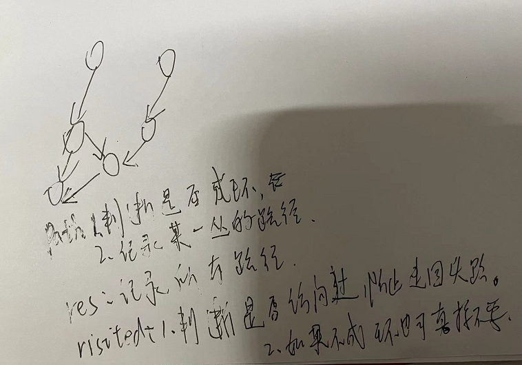

1. [手写 LRU（要求用泛型写）](https://labuladong.gitee.io/algo/%E9%AB%98%E9%A2%91%E9%9D%A2%E8%AF%95%E7%B3%BB%E5%88%97/LRU%E7%AE%97%E6%B3%95.html)
   
   1. 主要难度在于使用双向链表和hashmap实现类似LinkedhashMap的功能
   
2. 算法题3：堆   相关知识点：地址：https://leetcode-solution-leetcode-pp.gitbook.io/leetcode-solution/thinkings/heap#tiao-biao ；二叉树的分类：https://www.cnblogs.com/-citywall123/p/11788764.html
   1. 记住二叉堆进行插入和删除要进行的操作
   2. 记住二叉树的种类
   
3. 啥是不稳定算法？https://blog.csdn.net/xiaolangmin/article/details/88538446

4. 排序算法中的不稳定算法？

   1. 理解各种为啥不稳定算法：https://www.cnblogs.com/codingmylife/archive/2012/10/21/2732980.html
   2. 归并排序，插入排序，冒泡排序是稳定的，其它不稳定

5. 排序算法的复杂度？

   1. 快速排序，归并排序，堆排序为NlogN
   2. 希尔排序比N2好一点
   3. 其他为N2

   |       算法       | 稳定性 |          时间复杂度          | 空间复杂度 |           备注           |
   | :--------------: | :----: | :--------------------------: | :--------: | :----------------------: |
   |     选择排序     |   ×    |              N2              |     1      |                          |
   |     冒泡排序     |   √    |              N2              |     1      |                          |
   |     插入排序     |   √    |            N ~ N2            |     1      | 时间复杂度和初始顺序有关 |
   |     希尔排序     |   ×    | N 的若干倍乘于递增序列的长度 |     1      |      改进版插入排序      |
   |     快速排序     |   ×    |            NlogN             |    logN    |                          |
   | 三向切分快速排序 |   ×    |          N ~ NlogN           |    logN    |   适用于有大量重复主键   |
   |     归并排序     |   √    |            NlogN             |     N      |                          |
   |      堆排序      |   ×    |            NlogN             |     1      |    无法利用局部性原理    |

6. 你知道的排序算法有哪些？

   1. 选择排序
   2. 冒泡排序
   3. 插入排序
   4. 希尔排序
   5. 快速排序：三个优化：1.因为快速排序在小数组中也会递归调用自己，对于小数组，插入排序比快速排序的性能更好，因此在小数组中可以切换到插入排序 2.一种折中方法是取 3 个元素，并将大小居中的元素作为切分元素  3.三向切分
   6. 归并排序
   7. 堆排序

7. JDK的Arrays.sort()使用的是哪种排序方法？JDK1.8之后对于数据量大的时候不再使用快排，回去看一下这方面的优化吧？https://blog.csdn.net/TimHeath/article/details/68930482   https://www.cnblogs.com/baichunyu/p/11935995.html

   


看过的文章

1. 动态规划解决博弈问题https://github.com/labuladong/fucking-algorithm/blob/master/%E5%8A%A8%E6%80%81%E8%A7%84%E5%88%92%E7%B3%BB%E5%88%97/%E5%8A%A8%E6%80%81%E8%A7%84%E5%88%92%E4%B9%8B%E5%8D%9A%E5%BC%88%E9%97%AE%E9%A2%98.md
2. 最长上升子序列
3. 背包问题注意如何判断状态，选择，数组和状态转移方程
4. 子序列问题
   1. 一个数组一般dp的定义都是以nums[i]结尾的子序列的最xxx为dp[i]
   2. 两个数组使用一维dp
   3. 一个数组但是使用二维dp
5. 其它dp问题一般没有上面4.1的要求


# 二叉树-递归


## 二叉树

**1、是否可以通过遍历一遍二叉树得到答案**？如果可以，用一个 `traverse` 函数配合外部变量来实现，这叫「遍历」的思维模式。  力扣第 104 题「 [二叉树的最大深度](https://leetcode-cn.com/problems/maximum-depth-of-binary-tree/)」

**2、是否可以定义一个递归函数，通过子问题（子树）的答案推导出原问题的答案**？如果可以，写出这个递归函数的定义，并充分利用这个函数的返回值，这叫「分解问题」的思维模式。  力扣第 104 题「 [二叉树的最大深度](https://leetcode-cn.com/problems/maximum-depth-of-binary-tree/)」


确定了以上两种解题方式之后，还需要确定进行前序遍历还是中序遍历还是后序遍历。

二叉树的前序遍历和后序遍历

1. 中序位置主要用在 BST 场景中
2. **前序位置的代码只能从函数参数中获取父节点传递来的数据，而后序位置的代码不仅可以获取参数数据，还可以获取到子树通过函数返回值传递回来的数据**。一旦你发现题目和子树有关，那大概率要给函数设置合理的定义和返回值，在后序位置写代码了 
   1. 前序遍历：如果把根节点看做第 1 层，如何打印出每一个节点所在的层数？与    第 543 题「 [二叉树的直径](https://leetcode-cn.com/problems/diameter-of-binary-tree/)」
   2. 后续遍历：如何打印出每个节点的左右子树各有多少节点？


------

**二叉树题目的递归解法可以分两类思路，第一类是遍历一遍二叉树得出答案，第二类是通过分解问题计算出答案，这两类思路分别对应着 [回溯算法核心框架](https://labuladong.gitee.io/algo/4/29/105/) 和 [动态规划核心框架](https://labuladong.gitee.io/algo/3/23/68/)**。 

------


## 回溯(即dfs)

站在回溯树的一个节点上，你只需要思考 3 个问题：

1、路径：也就是已经做出的选择。

2、选择列表：也就是你当前可以做的选择。

3、结束条件：也就是到达决策树底层，无法再做选择的条件。

- 「路径」和「选择」是每个节点的属性
- 函数在树上游走要正确维护节点的属性，那么就要在这两个特殊时间点搞点动作。


回溯算法的框架：

```python
result = []
def backtrack(路径, 选择列表):
    if 满足结束条件:
        result.add(路径)
        return
    
    for 选择 in 选择列表:
        做选择
        backtrack(路径, 选择列表)
        撤销选择
```

------

我们在动态规划系列文章中多次强调，动态规划的三个需要明确的点就是「状态」「选择」和「base case」，是不是就对应着走过的「路径」，当前的「选择列表」和「结束条件」？

某种程度上说，动态规划的暴力求解阶段就是回溯算法。只是有的问题具有重叠子问题性质，可以用 dp table 或者备忘录优化，将递归树大幅剪枝，这就变成了动态规划。而今天的两个问题，都没有重叠子问题，也就是回溯算法问题了，复杂度非常高是不可避免的。

------


### 递归函数需要从总体上考虑

## 动态规划（重叠子问题、最优子结构、状态转移方程）

**如何列出正确的状态转移方程**？

1、**确定 base case**，这个很简单，显然目标金额 `amount` 为 0 时算法返回 0，因为不需要任何硬币就已经凑出目标金额了。

2、**确定「状态」，也就是原问题和子问题中会变化的变量**。由于硬币数量无限，硬币的面额也是题目给定的，只有目标金额会不断地向 base case 靠近，所以唯一的「状态」就是目标金额 `amount`。

3、**确定「选择」，也就是导致「状态」产生变化的行为**。目标金额为什么变化呢，因为你在选择硬币，你每选择一枚硬币，就相当于减少了目标金额。所以说所有硬币的面值，就是你的「选择」。

4、**明确 `dp` 函数/数组的定义**。我们这里讲的是自顶向下的解法，所以会有一个递归的 `dp` 函数，一般来说函数的参数就是状态转移中会变化的量，也就是上面说到的「状态」；函数的返回值就是题目要求我们计算的量。就本题来说，状态只有一个，即「目标金额」，题目要求我们计算凑出目标金额所需的最少硬币数量。

当然，我们也可以自底向上使用 dp table 来消除重叠子问题，关于「状态」「选择」和 base case 与之前没有区别，`dp` 数组的定义和刚才 `dp` 函数类似，也是把「状态」，也就是目标金额作为变量。**不过 `dp` 函数体现在函数参数，而 `dp` 数组体现在数组索引**


重叠子问题、最优子结构、状态转移方程就是动态规划三要素

找最优子结构的过程，其实就是证明状态转移方程正确性的过程，方程符合最优子结构就可以写暴力解了，写出暴力解就可以看出有没有重叠子问题了，有则优化，无则 OK。这也是套路，经常刷题的读者应该能体会。


**最优子结构**：可以从子问题的最优结果推出更大规模问题的最优结果。让你算**每个班**的最优成绩就是子问题，你知道所有子问题的答案后，就可以借此推出**全校**学生的最优成绩这个规模更大的问题的答案。


按上面的套路走，最后的结果就可以套这个框架：

```python
# 初始化 base case
dp[0][0][...] = base
# 进行状态转移
for 状态1 in 状态1的所有取值：
    for 状态2 in 状态2的所有取值：
        for ...
            dp[状态1][状态2][...] = 求最值(选择1，选择2...)
```

------

动态规划是一类算法问题，肯定是让你求最值的。因为动态规划问题拥有 [最优子结构](https://labuladong.gitee.io/algo/3/23/70/)，可以通过状态转移方程从小规模的子问题最优解推导出大规模问题的最优解。

分治算法呢，可以认为是一种算法思想，通过将原问题分解成小规模的子问题，然后根据子问题的结果构造出原问题的答案。这里有点类似动态规划，所以说运用分治算法也需要满足一些条件，你的原问题结果应该可以通过合并子问题结果来计算。

------


## 分治算法

废话不多说，解决本题的关键有两点：

**1、不要思考整体，而是把目光聚焦局部，只看一个运算符**。

**2、明确递归函数的定义是什么，相信并且利用好函数的定义**。


------

比如 [图论基础](https://labuladong.gitee.io/algo/2/20/48/)， [环判断和拓扑排序](https://labuladong.gitee.io/algo/2/20/49/) 和 [二分图判定算法](https://labuladong.gitee.io/algo/2/20/50/) 就用到了 DFS 算法；再比如 [Dijkstra 算法模板](https://labuladong.gitee.io/algo/2/20/55/)，就是改造版 BFS 算法加上一个类似 dp table 的数组。

好了，说的差不多了，上述这些算法的本质都是穷举二（多）叉树，有机会的话通过剪枝或者备忘录的方式减少冗余计算，提高效率，就这么点事儿。


比如， [东哥手把手带你刷二叉树（总纲）](https://labuladong.gitee.io/algo/2/19/33/) 中说二叉树非常重要，你把这个结构掌握了，就会发现 [动态规划](https://labuladong.gitee.io/algo/3/23/68/)， [分治算法](https://labuladong.gitee.io/algo/4/31/123/)， [回溯（DFS）算法](https://labuladong.gitee.io/algo/4/29/105/)， [BFS 算法框架](https://labuladong.gitee.io/algo/4/29/111/)， [Union-Find 并查集算法](https://labuladong.gitee.io/algo/2/20/51/)， [二叉堆实现优先级队列](https://labuladong.gitee.io/algo/2/21/63/) 就是把二叉树翻来覆去的运用。

------


## 图

<span style="color:red">1.图的遍历没有返回值2.拓扑排序中onpath的位置3.二分图中base case的位置</span>

所以，如果图包含环，遍历框架就要一个 `visited` 数组进行辅助：



```java
// 记录被遍历过的节点
boolean[] visited;
// 记录从起点到当前节点的路径
boolean[] onPath;

/* 图遍历框架 */
void traverse(Graph graph, int s) {
    if (visited[s]) return;
    // 经过节点 s，标记为已遍历
    visited[s] = true;
    // 做选择：标记节点 s 在路径上
    onPath[s] = true;
    for (int neighbor : graph.neighbors(s)) {
        traverse(graph, neighbor);
    }
    // 撤销选择：节点 s 离开路径
    onPath[s] = false;
}
```


另外，你应该注意到了，这个 `onPath` 数组的操作很像 [回溯算法核心套路](https://labuladong.gitee.io/algo/4/29/105/) 中做「做选择」和「撤销选择」，区别在于位置：回溯算法的「做选择」和「撤销选择」在 for 循环里面，而对 `onPath` 数组的操作在 for 循环外面。

在 for 循环里面和外面唯一的区别就是对根节点的处理。

比如下面两种多叉树的遍历：

```java
void traverse(TreeNode root) {
    if (root == null) return;
    System.out.println("enter: " + root.val);
    for (TreeNode child : root.children) {
        traverse(child);
    }
    System.out.println("leave: " + root.val);
}

void traverse(TreeNode root) {
    if (root == null) return;
    for (TreeNode child : root.children) {
        System.out.println("enter: " + child.val);
        traverse(child);
        System.out.println("leave: " + child.val);
    }
}
```

前者会正确打印所有节点的进入和离开信息，而后者唯独会少打印整棵树根节点的进入和离开信息。

**为什么回溯算法框架会用后者？因为回溯算法关注的不是节点，而是树枝**。

------

如果让你处理路径相关的问题，这个 `onPath` 变量是肯定会被用到的，比如 [拓扑排序](https://labuladong.gitee.io/algo/2/20/49/) 中就有运用。

当然，图还会有很多其他的有趣算法，比如 [二分图判定](https://labuladong.gitee.io/algo/2/20/50/)， [环检测和拓扑排序](https://labuladong.gitee.io/algo/2/20/49/)（编译器循环引用检测就是类似的算法）， [最小生成树](https://labuladong.gitee.io/algo/2/20/52/)， [Dijkstra 最短路径算法](https://labuladong.gitee.io/algo/2/20/55/) 等等，有兴趣的读者可以去看看，本文就到这了。


不过以我的经验呢，像网络流这种问题，你又不是打竞赛的，没时间的话就没必要学了；像 [最小生成树](https://labuladong.gitee.io/algo/2/20/52/) 和 [最短路径问题](https://labuladong.gitee.io/algo/2/20/54/)，虽然从刷题的角度用到的不多，但它们属于经典算法，学有余力可以掌握一下；像 [二分图判定](https://labuladong.gitee.io/algo/2/20/49/)、拓扑排序这一类，属于比较基本且有用的算法，应该比较熟练地掌握。

**那么本文就结合具体的算法题，来说两个图论算法：有向图的环检测、拓扑排序算法**。

------


### 拓扑排序

**其实也不难看出来，如果把课程抽象成节点，课程之间的依赖关系抽象成有向边，那么这幅图的拓扑排序结果就是上课顺序**。

首先，我们先判断一下题目输入的课程依赖是否成环，成环的话是无法进行拓扑排序的，所以我们可以复用上一道题的主函数：

```java
public int[] findOrder(int numCourses, int[][] prerequisites) {
    if (!canFinish(numCourses, prerequisites)) {
        // 不可能完成所有课程
        return new int[]{};
    }
    // ...
}
```

那么关键问题来了，如何进行拓扑排序？是不是又要秀什么高大上的技巧了？

**其实特别简单，将后序遍历的结果进行反转，就是拓扑排序的结果**。


代码虽然看起来多，但是逻辑应该是很清楚的，只要图中无环，那么我们就调用 `traverse` 函数对图进行 DFS 遍历，记录后序遍历结果，最后把后序遍历结果反转，作为最终的答案。

**那么为什么后序遍历的反转结果就是拓扑排序呢**？

我这里也避免数学证明，用一个直观地例子来解释，我们就说二叉树，这是我们说过很多次的二叉树遍历框架：

```java
void traverse(TreeNode root) {
    // 前序遍历代码位置
    traverse(root.left)
    // 中序遍历代码位置
    traverse(root.right)
    // 后序遍历代码位置
}
```

二叉树的后序遍历是什么时候？遍历完左右子树之后才会执行后序遍历位置的代码。换句话说，当左右子树的节点都被装到结果列表里面了，根节点才会被装进去。

**后序遍历的这一特点很重要，之所以拓扑排序的基础是后序遍历，是因为一个任务必须等到它依赖的所有任务都完成之后才能开始开始执行**。

你把二叉树理解成一幅有向图，边的方向是由父节点指向子节点，那么就是下图这样：

[](https://labuladong.gitee.io/algo/images/拓扑排序/2.jpeg)

按照我们的定义，边的含义是「被依赖」关系，那么上图的拓扑排序应该首先是节点 `1`，然后是 `2, 3`，以此类推。

但显然标准的后序遍历结果不满足拓扑排序，而如果把后序遍历结果反转，就是拓扑排序结果了：

[](https://labuladong.gitee.io/algo/images/拓扑排序/3.jpeg)


### 二分图

判定二分图的算法很简单，就是用代码解决「双色问题」。

**说白了就是遍历一遍图，一边遍历一边染色，看看能不能用两种颜色给所有节点染色，且相邻节点的颜色都不相同**。

既然说到遍历图，也不涉及最短路径之类的，当然是 DFS 算法和 BFS 皆可了，DFS 算法相对更常用些，所以我们先来看看如何用 DFS 算法判定双色图。

首先，基于 [学习数据结构和算法的框架思维](https://labuladong.gitee.io/algo/1/2/) 写出图的遍历框架：

```java
/* 二叉树遍历框架 */
void traverse(TreeNode root) {
    if (root == null) return;
    traverse(root.left);
    traverse(root.right);
}

/* 多叉树遍历框架 */
void traverse(Node root) {
    if (root == null) return;
    for (Node child : root.children)
        traverse(child);
}

/* 图遍历框架 */
boolean[] visited;
void traverse(Graph graph, int v) {
    // 防止走回头路进入死循环
    if (visited[v]) return;
    // 前序遍历位置，标记节点 v 已访问
    visited[v] = true;
    for (TreeNode neighbor : graph.neighbors(v))
        traverse(graph, neighbor);
}
```

因为图中可能存在环，所以用 `visited` 数组防止走回头路。

**这里可以看到我习惯把 return 语句都放在函数开头，因为一般 return 语句都是 base case，集中放在一起可以让算法结构更清晰**。

其实，如果你愿意，也可以把 if 判断放到其它地方，比如图遍历框架可以稍微改改：

```java
/* 图遍历框架 */
boolean[] visited;
void traverse(Graph graph, int v) {
    // 前序遍历位置，标记节点 v 已访问
    visited[v] = true;
    for (int neighbor : graph.neighbors(v)) {
        if (!visited[neighbor]) {
            // 只遍历没标记过的相邻节点
            traverse(graph, neighbor);
        }
    }
}
```

这种写法把对 `visited` 的判断放到递归调用之前，和之前的写法唯一的不同就是，你需要保证调用 `traverse(v)` 的时候，`visited[v] == false`。

为什么要特别说这种写法呢？因为我们判断二分图的算法会用到这种写法。

**回顾一下二分图怎么判断，其实就是让 `traverse` 函数一边遍历节点，一边给节点染色，尝试让每对相邻节点的颜色都不一样**。

所以，判定二分图的代码逻辑可以这样写：

```java
/* 图遍历框架 */
void traverse(Graph graph, boolean[] visited, int v) {
    visited[v] = true;
    // 遍历节点 v 的所有相邻节点 neighbor
    for (int neighbor : graph.neighbors(v)) {
        if (!visited[neighbor]) {
            // 相邻节点 neighbor 没有被访问过
            // 那么应该给节点 neighbor 涂上和节点 v 不同的颜色
            traverse(graph, visited, neighbor);
        } else {
            // 相邻节点 neighbor 已经被访问过
            // 那么应该比较节点 neighbor 和节点 v 的颜色
            // 若相同，则此图不是二分图
        }
    }
}
```

如果你能看懂上面这段代码，就能写出二分图判定的具体代码了，接下来看两道具体的算法题来实操一下。

# 二叉树其它


## BFS算法框架<span style="color:red">（最近距离）</span>

```java
// 计算从起点 start 到终点 target 的最近距离
int BFS(Node start, Node target) {
    Queue<Node> q; // 核心数据结构
    Set<Node> visited; // 避免走回头路
    
    q.offer(start); // 将起点加入队列
    visited.add(start);
    int step = 0; // 记录扩散的步数

    while (q not empty) {
        int sz = q.size();
        /* 将当前队列中的所有节点向四周扩散 */
        for (int i = 0; i < sz; i++) {
            Node cur = q.poll();
            /* 划重点：这里判断是否到达终点 */
            if (cur is target)
                return step;
            /* 将 cur 的相邻节点加入队列 */
            for (Node x : cur.adj()) {
                if (x not in visited) {
                    q.offer(x);
                    visited.add(x);
                }
            }
        }
        /* 划重点：更新步数在这里 */
        step++;
    }
}
```


### Dijkstra 算法（BFS加强版）


## 并查集

现在我们的 Union-Find 算法主要需要实现这两个 API：

```java
class UF {
    /* 将 p 和 q 连接 */
    public void union(int p, int q);
    /* 判断 p 和 q 是否连通 */
    public boolean connected(int p, int q);
    /* 返回图中有多少个连通分量 */
    public int count();
}
```

这里所说的「连通」是一种等价关系，也就是说具有如下三个性质：

1、自反性：节点 `p` 和 `p` 是连通的。

2、对称性：如果节点 `p` 和 `q` 连通，那么 `q` 和 `p` 也连通。

3、传递性：如果节点 `p` 和 `q` 连通，`q` 和 `r` 连通，那么 `p` 和 `r` 也连通。


```java
class UF {
    // 连通分量个数
    private int count;
    // 存储每个节点的父节点
    private int[] parent;

    // n 为图中节点的个数
    public UF(int n) {
        this.count = n;
        parent = new int[n];
        for (int i = 0; i < n; i++) {
            parent[i] = i;
        }
    }
    
    // 将节点 p 和节点 q 连通
    public void union(int p, int q) {
        int rootP = find(p);
        int rootQ = find(q);
        
        if (rootP == rootQ)
            return;
        
        parent[rootQ] = rootP;
        // 两个连通分量合并成一个连通分量
        count--;
    }

    // 判断节点 p 和节点 q 是否连通
    public boolean connected(int p, int q) {
        int rootP = find(p);
        int rootQ = find(q);
        return rootP == rootQ;
    }

    public int find(int x) {
        if (parent[x] != x) {
            parent[x] = find(parent[x]);
        }
        return parent[x];
    }

    // 返回图中的连通分量个数
    public int count() {
        return count;
    }
}
```


## 优先队列

使用数组实现的堆；


## 时间复杂度

### 递归

**递归算法的时间复杂度 = 递归的次数 x 函数本身的时间复杂度**

**递归算法的空间复杂度 = 递归堆栈的深度 + 算法申请的存储空间**

或者再说得直观一点：

**递归算法的时间复杂度 = 递归树的节点个数 x 每个节点的时间复杂度**

**递归算法的空间复杂度 = 递归树的高度 + 算法申请的存储空间**


------

比如前文 [动态规划核心框架](https://mp.weixin.qq.com/s?__biz=MzAxODQxMDM0Mw==&mid=2247484731&idx=1&sn=f1db6dee2c8e70c42240aead9fd224e6&scene=21#wechat_redirect) 中讲到的凑零钱问题的暴力递归解法

这棵树的高度有多高？不知道，那就按最坏情况来处理，假设全都是面额为 1 的硬币，这种情况下树高为`N`。

这棵树的结构是什么样的？不知道，那就按最坏情况来处理，假设它是一棵满`K`叉树好了。

那么，这棵树上共有多少节点？都按最坏情况来处理，高度为`N`的一棵满`K`叉树，其节点总数为`K^N - 1`，用 Big O 表示就是`O(K^N)`

------


对于带备忘录的动态规划算法的时间复杂度，以下几种理解方式都是等价的：

```
递归的次数 x 函数本身的时间复杂度
= 递归树节点个数 x 每个节点的时间复杂度
= 状态个数 x 计算每个状态的时间复杂度
= 子问题个数 x 解决每个子问题的时间复杂度
= O(N) * O(K)
= O(NK)
```

像「状态」「子问题」属于动态规划类型问题特有的词汇，但时间复杂度本质上还是递归次数 x 函数本身复杂度，换汤不换药罢了。

------


**先看标准全排列问题**（元素无重不可复选）

再来看看`backtrack`函数递归了多少次，即这个排列树上有多少个节点。

第 0 层（根节点）有`P(N, 0) = 1`个节点。

第 1 层有`P(N, 1) = N`个节点。

第 2 层有`P(N, 2) = N x (N - 1)`个节点。

第 3 层有`P(N, 3) = N x (N - 1) x (N - 2)`个节点。

以此类推，其中`P`就是我们高中学过的排列数函数。

全排列的回溯树高度为`N`，所以节点总数为：

```
P(N, 0) + P(N, 1) + P(N, 2) + ... + P(N, N)
```

这一堆排列数累加不好算，粗略估计一下上界吧，把它们全都扩大成`P(N, N) = N!`，**那么节点总数的上界就是`O(N\*N!)`**。

现在就可以得出算法的总时间复杂度：

```
  递归的次数 x 函数本身的时间复杂度
= 递归树节点个数 x 每个节点的时间复杂度
= O(N*N!) * O(N)
= O(N^2 * N!)
```


`backtrack`函数的递归深度为递归树的高度`O(N)`，而算法需要存储所有全排列的结果，即需要申请的空间为`O(N*N!)`。**所以总的空间复杂度为`O(N\*N!)`**。

------


**标准子集问题**（元素无重不可复选）

第 0 层（根节点）有`C(N, 0) = 1`个节点。

第 1 层有`C(N, 1) = N`个节点。

第 2 层有`C(N, 2)`个节点。

第 3 层有`C(N, 3)`个节点。

以此类推，其中`C`就是我们高中学过的组合数函数。

由于这棵组合树的高度为`N`，组合数求和公式是高中学过的，**所以总的节点数为`2^N`**：

```
C(N, 0) + C(N, 1) + C(N, 2) + ... + C(N, N) = 2^N
```

就算你忘记了组合数求和公式，其实也可以推导出来节点总数：因为`N`个元素的所有子集（幂集）数量为`2^N`，而这棵树的每个节点代表一个子集，所以树的节点总数也为`2^N`。

那么，现在就可以得出算法的总复杂度：

```
  递归的次数 x 函数本身的时间复杂度
= 递归树节点个数 x 每个节点的时间复杂度
= O(2^N) * O(N)
= O(N*2^N)
```

分析下该算法的空间复杂度：

`backtrack`函数的递归深度为递归树的高度`O(N)`，而算法需要存储所有子集的结果，粗略估算下需要申请的空间为`O(N*2^N)`，**所以总的空间复杂度为`O(N\*2^N)`**。


### 非递归算法分析

**其实，你只需要搞清楚代码到底在干什么，就能轻松计算出正确的复杂度了**。


# 数组/单链表系列

------

**单链表常考的技巧就是双指针**，前文 [单链表六大技巧](https://labuladong.gitee.io/algo/2/17/16/) 全给你总结好了，这些技巧就是会者不难，难者不会。

------


## 指针

### 单链表（快慢指针）


------

**数组常用的技巧有很大一部分还是双指针相关的技巧，说白了是教你如何聪明地进行穷举**。

**首先说二分搜索技巧**，可以归为两端向中心的双指针。如果让你在数组中搜索元素，一个 for 循环穷举肯定能搞定对吧，但如果数组是有序的，二分搜索不就是一种更聪明的搜索方式么。

前文 [二分搜索框架详解](https://labuladong.gitee.io/algo/2/18/26/) 给你总结了二分搜索代码模板，保证不会出现搜索边界的问题。前文 [二分搜索算法运用](https://labuladong.gitee.io/algo/2/18/28/) 给你总结了二分搜索相关题目的共性以及如何将二分搜索思想运用到实际算法中。

------


### 二分搜索（左右指针）

```cpp
int binarySearch(int[] nums, int target) {
    int left = 0, right = ...;

    while(...) {
        int mid = left + (right - left) / 2;
        if (nums[mid] == target) {
            ...
        } else if (nums[mid] < target) {
            left = ...
        } else if (nums[mid] > target) {
            right = ...
        }
    }
    return ...;
}
```

1、分析二分查找代码时，不要出现 else，全部展开成 else if 方便理解。

2、注意「搜索区间」和 while 的终止条件，如果存在漏掉的元素，记得在最后检查。

3、如需定义左闭右开的「搜索区间」搜索左右边界，只要在 `nums[mid] == target` 时做修改即可，搜索右侧时需要减一。

4、如果将「搜索区间」全都统一成两端都闭，好记，只要稍改 `nums[mid] == target` 条件处的代码和返回的逻辑即可，**推荐拿小本本记下，作为二分搜索模板**。


------

类似的两端向中心的双指针技巧还有力扣上的 N 数之和系列问题，前文 [一个函数秒杀所有 nSum 问题](https://labuladong.gitee.io/algo/1/14/) 讲了这些题目的共性，甭管几数之和，解法肯定要穷举所有的数字组合，然后看看那个数字组合的和等于目标和嘛。比较聪明的方式是先排序，利用双指针技巧快速计算结果。

------


### nsum（左右指针）

```cpp
vector<vector<int>> twoSumTarget(vector<int>& nums, int target) {
    // nums 数组必须有序
    sort(nums.begin(), nums.end());
    int lo = 0, hi = nums.size() - 1;
    vector<vector<int>> res;
    while (lo < hi) {
        int sum = nums[lo] + nums[hi];
        int left = nums[lo], right = nums[hi];
        if (sum < target) {
            while (lo < hi && nums[lo] == left) lo++;
        } else if (sum > target) {
            while (lo < hi && nums[hi] == right) hi--;
        } else {
            res.push_back({left, right});
            while (lo < hi && nums[lo] == left) lo++;
            while (lo < hi && nums[hi] == right) hi--;
        }
    }
    return res;
}
```

这样，一个通用化的 `twoSum` 函数就写出来了


------

**再说说 [滑动窗口算法技巧](https://labuladong.gitee.io/algo/2/18/25/)**，典型的快慢双指针，快慢指针中间就是滑动的「窗口」，主要用于解决子串问题。

文中最小覆盖子串这道题，让你寻找包含特定字符的最短子串，常规拍脑袋解法是什么？那肯定是类似字符串暴力匹配算法，用嵌套 for 循环穷举呗，平方级的复杂度。

而滑动窗口技巧告诉你不用这么麻烦，可以用快慢指针遍历一次就求出答案，这就是教你聪明的穷举技巧。

但是，就好像二分搜索只能运用在有序数组上一样，滑动窗口也是有其限制的，就是你必须明确的知道什么时候应该扩大窗口，什么时候该收缩窗口。

------


### 滑动窗口（快慢指针）

```cpp
/* 滑动窗口算法框架 */
void slidingWindow(string s, string t) {
    unordered_map<char, int> need, window;
    for (char c : t) need[c]++;
    
    int left = 0, right = 0;
    int valid = 0; 
    while (right < s.size()) {
        // c 是将移入窗口的字符
        char c = s[right];
        // 增大窗口
        right++;
        // 进行窗口内数据的一系列更新
        ...

        /*** debug 输出的位置 ***/
        printf("window: [%d, %d)\n", left, right);
        /********************/
        
        // 判断左侧窗口是否要收缩
        while (window needs shrink) {
            // d 是将移出窗口的字符
            char d = s[left];
            // 缩小窗口
            left++;
            // 进行窗口内数据的一系列更新
            ...
        }
    }
}
```

**滑动窗口算法的思路是这样**：

1、我们在字符串 `S` 中使用双指针中的左右指针技巧，初始化 `left = right = 0`，把索引**左闭右开**区间 `[left, right)` 称为一个「窗口」。

> PS：理论上你可以设计两端都开或者两端都闭的区间，但设计为左闭右开区间是最方便处理的。因为这样初始化 `left = right = 0` 时区间 `[0, 0)` 中没有元素，但只要让 `right` 向右移动（扩大）一位，区间 `[0, 1)` 就包含一个元素 `0` 了。如果你设置为两端都开的区间，那么让 `right` 向右移动一位后开区间 `(0, 1)` 仍然没有元素；如果你设置为两端都闭的区间，那么初始区间 `[0, 0]` 就包含了一个元素。这两种情况都会给边界处理带来不必要的麻烦。

2、我们先不断地增加 `right` 指针扩大窗口 `[left, right)`，直到窗口中的字符串符合要求（包含了 `T` 中的所有字符）。

3、此时，我们停止增加 `right`，转而不断增加 `left` 指针缩小窗口 `[left, right)`，直到窗口中的字符串不再符合要求（不包含 `T` 中的所有字符了）。同时，每次增加 `left`，我们都要更新一轮结果。

4、重复第 2 和第 3 步，直到 `right` 到达字符串 `S` 的尽头。


------

**还有回文串相关技巧**，如果判断一个串是否是回文串，使用双指针从两端向中心检查，如果寻找回文子串，就从中心向两端扩散。前文 [最长回文子串](https://labuladong.gitee.io/algo/2/18/23/) 使用了一种技巧同时处理了回文串长度为奇数或偶数的情况。

------


### **回文串**（左右指针）


------

**最后说说 [前缀和技巧](https://labuladong.gitee.io/algo/2/18/21/) 和 [差分数组技巧](https://labuladong.gitee.io/algo/2/18/22/)**。

如果频繁地让你计算子数组的和，每次用 for 循环去遍历肯定没问题，但前缀和技巧预计算一个 `preSum` 数组，就可以避免循环。

类似的，如果频繁地让你对子数组进行增减操作，也可以每次用 for 循环去操作，但差分数组技巧维护一个 `diff` 数组，也可以避免循环。

------


### **[前缀和技巧](https://labuladong.gitee.io/algo/2/18/21/) 和 [差分数组技巧](https://labuladong.gitee.io/algo/2/18/22/)**。

先看一道例题，力扣第 303 题「 [区域和检索 - 数组不可变](https://leetcode-cn.com/problems/range-sum-query-immutable/)」，让你计算数组区间内元素的和，这是一道标准的前缀和问题：

题目要求你实现这样一个类：

```java
class NumArray {

    public NumArray(int[] nums) {}
    
    /* 查询闭区间 [left, right] 的累加和 */
    public int sumRange(int left, int right) {}
}
```

直接看代码实现：

```java
class NumArray {
    // 前缀和数组
    private int[] preSum;

    /* 输入一个数组，构造前缀和 */
    public NumArray(int[] nums) {
        // preSum[0] = 0，便于计算累加和
        preSum = new int[nums.length + 1];
        // 计算 nums 的累加和
        for (int i = 1; i < preSum.length; i++) {
            preSum[i] = preSum[i - 1] + nums[i - 1];
        }
    }
    
    /* 查询闭区间 [left, right] 的累加和 */
    public int sumRange(int left, int right) {
        return preSum[right + 1] - preSum[left];
    }
}
```

核心思路是我们 new 一个新的数组 `preSum` 出来，`preSum[i]` 记录 `nums[0..i-1]` 的累加和


本文讲一个和前缀和思想非常类似的算法技巧「差分数组」，**差分数组的主要适用场景是频繁对原始数组的某个区间的元素进行增减**。

比如说，我给你输入一个数组 `nums`，然后又要求给区间 `nums[2..6]` 全部加 1，再给 `nums[3..9]` 全部减 3，再给 `nums[0..4]` 全部加 2，再给…

一通操作猛如虎，然后问你，最后 `nums` 数组的值是什么？

常规的思路很容易，你让我给区间 `nums[i..j]` 加上 `val`，那我就一个 for 循环给它们都加上呗，还能咋样？这种思路的时间复杂度是 O(N)，由于这个场景下对 `nums` 的修改非常频繁，所以效率会很低下。

这里就需要差分数组的技巧，类似前缀和技巧构造的 `prefix` 数组，我们先对 `nums` 数组构造一个 `diff` 差分数组，**`diff[i]` 就是 `nums[i]` 和 `nums[i-1]` 之差**：

```java
int[] diff = new int[nums.length];
// 构造差分数组
diff[0] = nums[0];
for (int i = 1; i < nums.length; i++) {
    diff[i] = nums[i] - nums[i - 1];
}
```


**这样构造差分数组 `diff`，就可以快速进行区间增减的操作**，如果你想对区间 `nums[i..j]` 的元素全部加 3，那么只需要让 `diff[i] += 3`，然后再让 `diff[j+1] -= 3` 即可：


现在我们把差分数组抽象成一个类，包含 `increment` 方法和 `result` 方法：

```java
// 差分数组工具类
class Difference {
    // 差分数组
    private int[] diff;
    
    /* 输入一个初始数组，区间操作将在这个数组上进行 */
    public Difference(int[] nums) {
        assert nums.length > 0;
        diff = new int[nums.length];
        // 根据初始数组构造差分数组
        diff[0] = nums[0];
        for (int i = 1; i < nums.length; i++) {
            diff[i] = nums[i] - nums[i - 1];
        }
    }

    /* 给闭区间 [i, j] 增加 val（可以是负数）*/
    public void increment(int i, int j, int val) {
        diff[i] += val;
        if (j + 1 < diff.length) {
            diff[j + 1] -= val;
        }
    }

    /* 返回结果数组 */
    public int[] result() {
        int[] res = new int[diff.length];
        // 根据差分数组构造结果数组
        res[0] = diff[0];
        for (int i = 1; i < diff.length; i++) {
            res[i] = res[i - 1] + diff[i];
        }
        return res;
    }
}
```


### 二叉堆

优先级队列这种数据结构有一个很有用的功能，你插入或者删除元素的时候，元素会自动排序，这底层的原理就是二叉堆的操作。

数据结构的功能无非增删查改，优先级队列有两个主要 API，分别是 `insert` 插入一个元素和 `delMax` 删除最大元素（如果底层用最小堆，那么就是 `delMin`）。

下面我们实现一个简化的优先级队列，先看下代码框架：

> PS：这里用到 Java 的泛型，`Key` 可以是任何一种可比较大小的数据类型，比如 Integer 等类型。

```java
public class MaxPQ
    <Key extends Comparable<Key>> {
    // 存储元素的数组
    private Key[] pq;
    // 当前 Priority Queue 中的元素个数
    private int size = 0;

    public MaxPQ(int cap) {
        // 索引 0 不用，所以多分配一个空间
        pq = (Key[]) new Comparable[cap + 1];
    }

    /* 返回当前队列中最大元素 */
    public Key max() {
        return pq[1];
    }

    /* 插入元素 e */
    public void insert(Key e) {...}

    /* 删除并返回当前队列中最大元素 */
    public Key delMax() {...}

    /* 上浮第 x 个元素，以维护最大堆性质 */
    private void swim(int x) {...}

    /* 下沉第 x 个元素，以维护最大堆性质 */
    private void sink(int x) {...}

    /* 交换数组的两个元素 */
    private void swap(int i, int j) {
        Key temp = pq[i];
        pq[i] = pq[j];
        pq[j] = temp;
    }

    /* pq[i] 是否比 pq[j] 小？ */
    private boolean less(int i, int j) {
        return pq[i].compareTo(pq[j]) < 0;
    }

    /* 还有 left, right, parent 三个方法 */
}
```


**上浮的代码实现：**

```java
private void swim(int x) {
    // 如果浮到堆顶，就不能再上浮了
    while (node > 1 && less(parent(x), x)) {
        // 如果第 x 个元素比上层大
        // 将 x 换上去
        exch(parent(x), x);
        x = parent(x);
    }
}
```


下沉比上浮略微复杂一点，因为上浮某个节点 A，只需要 A 和其父节点比较大小即可；但是下沉某个节点 A，需要 A 和其**两个子节点**比较大小，如果 A 不是最大的就需要调整位置，要把较大的那个子节点和 A 交换。

```java
private void sink(int x) {
    // 如果沉到堆底，就沉不下去了
    while (left(x) <= size) {
        // 先假设左边节点较大
        int older = left(x);
        // 如果右边节点存在，比一下大小
        if (right(x) <= N && less(older, right(x)))
            older = right(x);
        // 结点 x 比俩孩子都大，就不必下沉了
        if (less(older, x)) break;
        // 否则，不符合最大堆的结构，下沉 x 结点
        exch(x, older);
        x = older;
    }
}
```