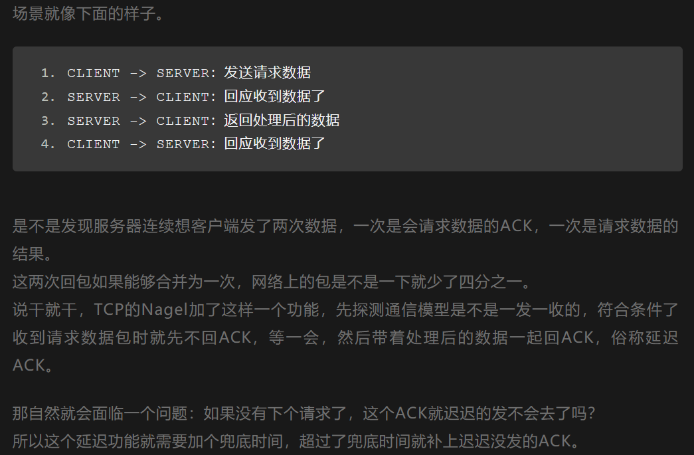

快速入门：https://blog.csdn.net/weixin_43914604/article/details/105516090

1. [能否说：“电路交换就是面向连接，而分组交换就是无连接”](https://www.jianshu.com/p/e45f5ed1bc0a)

   1. 记住各层的协议以及是不是面向连接的！

2. OSI七层模型  [地址](https://snailclimb.gitee.io/javaguide/#/docs/network/计算机网络?id=一-osi与tcpip各层的结构与功能都有哪些协议)

   1. 应用层：各种应用程序协议，如http，ftp，smtp
   2. 表示层：1.数据格式的转换，2.数据的加密和解密，3.数据的压缩和恢复
   3. 会话层：会话层允许不同主机上的各个进程进行会话；  建立，管理，中止会话；
   4. 传输层：传输层负责主机中两个进程之间的通信，功能是为`端到端`连接提供可靠的传输服务
   5. 网络层：因为因特网的主要网络层协议是`无连接`的网际协议（Internet Protocol，IP）和许多`路由`选择协议
   6. 数据链路层：将网络层传下来的数据包组装成帧
   7. 物理层：在物理媒介上的比特流的透明传输

3. 三次握手的过程：1.客户端–发送带有 SYN 标志的数据包–一次握手–服务端 2.服务端–发送带有 SYN/ACK 标志的数据包–二次握手–客户端 3.客户端–发送带有带有 ACK 标志的数据包–三次握手–服务端   [文章](https://blog.csdn.net/qzcsu/article/details/72861891)  [文章2]( https://blog.csdn.net/weixin_43914604/article/details/105516090)

4. 四次挥手的过程：1.客户端-发送一个 FIN，用来关闭客户端到服务器的数据传送 2.服务器-收到这个 FIN，它发回一 个 ACK，确认序号为收到的序号加1 。和 SYN 一样，一个 FIN 将占用一个序号 3.服务器-关闭与客户端的连接，发送一个FIN给客户端 4.客户端-发回 ACK 报文确认，并将确认序号设置为收到序号加1 

5. 为什么要三次握手？1.第一次握手：Client 什么都不能确认；Server 确认了对方发送正常，自己接收正常 2.第二次握手：Client 确认了：自己发送、接收正常，对方发送、接收正常；Server 确认了：对方发送正常，自己接收正常 3.第三次握手：Client 确认了：自己发送、接收正常，对方发送、接收正常；Server 确认了：自己发送、接收正常，对方发送、接收正常 

6. 为什么要四次挥手？任何一方都可以在数据传送结束后发出连接释放的通知，待对方确认后进入半关闭状态。当另一方也没有数据再发送的时候，则发出连接释放通知，对方确认后就完全关闭了TCP连接。

7. 为什么TCP客户端最后还要发送一次确认呢(即为啥不能两次握手呢)？一句话，主要防止已经失效的连接请求报文突然又传送到了服务器，从而产生错误。

8. 为什么客户端最后还要等待2MSL？1.简单说：客户端等待2MSL后如果仍然没有收到最后一次服务端的FIN的报文，证明服务端已经收到了客户端最后一次的ACK，所以不用再等下去了。 2.详细说：等服务器工作完成了，就把fin信号发送给客户端，此时服务器要等着客户端给他一个回信，让服务器知道客户端已经知道了。因此客户端收到后就给服务器一个回信，为了防止回信丢失，客户端就再等2MSL个时间，之所以是2个，是因为涉及到来回，第一个MSL中是回信在路上的最大时间，第二个MSL是万一回信没到服务端，服务端重发的FIN确认在路上的时间。  换句话说，客户端等待2MSL后如果仍然没有收到最后一次服务端的FIN的报文，证明服务端已经收到了客户端最后一次的ACK，所以不用再等下去了，2MSL的时间一次是客户端发送链路的最大耗时，一次是服务端可能重发的耗时

9. 为什么建立连接是三次握手，关闭连接确是四次挥手呢？  建立连接的时候， 服务器在LISTEN状态下，收到建立连接请求的SYN报文后，把ACK和SYN放在一个报文里发送给客户端。而关闭连接时，服务器收到对方的FIN报文时，仅仅表示对方不再发送数据了但是还能接收数据，而自己也未必全部数据都发送给对方了，所以己方可以立即关闭，也可以发送一些数据给对方后，再发送FIN报文给对方来表示同意现在关闭连接，因此，己方ACK和FIN一般都会分开发送，从而导致多了一次。

10. TCP 如何保证可靠性传输？（校验和，序列号，确认，重传（超时重传和快重传），流量控制（确定接收窗口rwnd大小），拥塞控制（确定拥塞窗口cwnd大小）1.满开始和拥塞避免  2.快重传和快恢复   满开始和拥塞避免是用来控制速度的   快恢复是跟拥塞窗口大小直接相关的   快重传跟丢失重传有关

11. 滑动窗口：1.停止-等待协议  2.gbn协议（发送方：记住累计确认和超时的全部重传       接收方：接受数据就行了）   3.选择重传协议（发送发：不是累计确认和超时只需要重传特定的帧      接收方：接受数据就行了）

12. 

13. 

14. 

15. 计网tcp三次握手中第三次丢失了怎么办？ https://juejin.cn/post/6844904063964807182#heading-3

    1. 客户端最后一次回复「SYN,ACK」的「ACK」包丢了：当客户端在 ESTABLISHED 状态下，开始发送数据包时，会携带上一个「ACK」的确认序号，所以哪怕客户端响应的「ACK」包丢了，服务端在收到这个数据包时，能够通过包内 ACK 的确认序号，正常进入 ESTABLISHED 状态。

16. 客户端故意不发最后一次「ACK」包？ https://blog.csdn.net/apache0554/article/details/47040103  https://blog.csdn.net/varyall/article/details/79681562

    1. 防范syn洪范攻击的方法：
       1. 方式1：减少SYN-ACK数据包的重发次数（默认是5次）：
          sysctl -w net.ipv4.tcp_synack_retries=3
          sysctl -w net.ipv4.tcp_syn_retries=3
       2. 方式2：使用SYN Cookie技术：
          sysctl -w net.ipv4.tcp_syncookies=1
       3. 方式3：增加backlog队列（默认是1024）：
          sysctl -w net.ipv4.tcp_max_syn_backlog=2048
       4. 方式4：限制SYN并发数：
          iptables -A INPUT -p tcp --syn -m limit --limit 1/s -j ACCEPT --limit 1/s

17. 四次握手最后一次丢失了怎么办？

    1. 客户端在回复「ACK」后，会进入 TIME-WAIT 状态，开始长达 2MSL 的等待，服务端因为没有收到「ACK」的回复，会重试一段时间，直到服务端重试超时后主动断开   
    2. 或者等待新的客户端接入后，收到服务端重试的「FIN」消息后，回复「RST」消息，在收到「RST」消息后，复位服务端的状态。

18. 

19. 

20. TCP的流量控制，当接收方的接收窗口为0的时候该怎么办？https://mp.weixin.qq.com/s/LUtk6u_zv0w8g8GIGWEuCw

    上文已经说了发送方式根据接收方回应的 window 来控制能发多少数据，如果接收方一直回应 0，那发送方就杵着？
    你想一下，发送方发的数据都得到 ACK 了，但是呢回应的窗口都是 0 ，这发送方此时不敢发了啊，那也不能一直等着啊，这 Window 啥时候不变 0 啊？
    于是 TCP 有一个 Zero Window Probe(盘问) 技术，发送方得知窗口是 0 之后，会去探测探测这个接收方到底行不行，也就是发送 ZWP 包给接收方。
    具体看实现了，可以发送多次，然后还有间隔时间，多次之后都不行可以直接 RST

21. TCP传输通信时,客户端突然断开连接  https://www.nowcoder.com/discuss/612115

    TCP设有一个保活计时器，如果客户端出现故障，服务器不会一直等待。服务器每收到一次客户端的请求都会重新复位这个计时器，时间通常设置为2小时，如果两小时没有收到客户端的任何数据，服务端就会每隔75分钟发送一个探测报文，如果连续发送10个探测报文都没有反应，服务端就会认为客户端出了故障，从而关闭连接

22. 大量的 TIME_WAIT 状态 TCP 连接存在，其本质原因是什么？ https://mp.weixin.qq.com/s/N_By2GsnoSpOWkssVzmFLg

    1. 如果是服务端存在大量TIME_WAIT 的原因：

       1.大量的短连接存在

       2.特别是 HTTP 请求中，如果 connection 头部取值被设置为 close 时，基本都由「服务端」发起主动关闭连接

       3.而，TCP 四次挥手关闭连接机制中，为了保证 ACK 重发和丢弃延迟数据，设置 time_wait 为 2 倍的 MSL（报文最大存活时间）

    2. 可能导致的问题

       1.每一个 time_wait 状态，都会占用一个「本地端口」，上限为 65535(16 bit，2 Byte)；2.当大量的连接处于 time_wait 时，新建立 TCP 连接会出错，address already in use : connect 异常

    3. 解决办法

       1. 1.客户端，HTTP 请求的头部，connection 设置为 keep-alive，保持存活一段时间：现在的浏览器，一般都这么进行了
       2. 2.服务器端允许 time_wait 状态的 socket 被重用缩减 time_wait 时间，设置为 1 MSL（即，2 mins）

23. 

24. 

25. 网际控制报文协议(Internet Control Message Protocol, ICMP)有什么用？让主机或路由器报告差错和异常情况。1.ICMP差错报告报文  终点不可达无法交复，TTL=0，首部字段有问题，改变路由 -----2.ICMP询问报文  回送请求和回答报文来测试是否可达， 时间戳请求和回答报文来进行时钟同步和测量时间

26. ARP (Address ResolutionProtocol, ARP)过程？1.检查arp高速缓存，有对应表项则写入MAC帧----2.没有则用MAC地址为FF-FF-FF-FF-FF-FF的帧封装的广播arp请求分组，统一局域网中的所有主机都能收到该请求，目的主机收到请求后就会向源主机单播一个arp相应分组，源主机收到之后将此映射写入arp缓存（10-20min更新一次）

27. 网络层的路由算法，简述RIP，OSPF过程？https://blog.csdn.net/weixin_43914604/article/details/105313629

    1. 外部网关协议：BGP
    2. 内部网关协议：RIP，OSPF
       1. （RIP是应用层协议使用UDP，只适合小规模，坏消息传得慢）RIP距离-向量路由算法中，每个结点仅与它的直接`邻居`交谈，它为它的邻居提供从自己到网络中所有其他结点的最低费用估计
       2. （RIP使用IP，适合大规模）OSPF链路状态路由算法也叫开放最短路径优先协议中，每个结点通过`广播`的方式与所有`其他结点`交谈，但它仅告诉它们与它直接相连的链路的费用
       3. 什么称为用UDP传送？什么称为用IP数据报传送?
          - 用UDP传送是指将该信息作为UDP报文的数据部分
          - 直接使用IP数据报传送是指将该信息直接作为IP 数据报的数据部分
          - RIP报文是作为UDP数据报的数据部分。
          - OSPF协议直接使用IP数据报进行传递

28. 

29. 

30. http的报文格式?：

    1. http报文格式：https://blog.csdn.net/a19881029/article/details/14002273
       1. HTTP请求报文主要由请求行、请求头部、请求正文3部分组成
          1. 请求行：请求方法、URL以及协议版本
          2. 请求头部：请求头部为请求报文添加了一些附加信息，由“名/值”对组成，每行一对，名和值之间使用冒号分隔
          3. 请求正文：可选部分
       2. HTTP响应报文主要由状态行、响应头部、响应正文3部分组成
          1. 状态行：协议版本，状态码，状态码描述
          2. 响应头部：为响应报文添加了一些附加信息
          3. 响应正文：可选部分

31. Http的状态码？https://www.runoob.com/http/http-status-codes.html
    1.  1信息性状态码，接受端的请求正在处理，服务器收到请求，需要请求者继续执行操作   2成功状态码，操作被成功接收并处理    3 重定向状态码，需要进一步的操作以完成请求     4 客户端错误状态码，请求包含语法错误或无法完成请求      5 服务器错误状态码，服务器在处理请求的过程中发生了错误
    2. 201 已创建。成功请求并创建了新的资源
    3. 202  已接受。已经接受请求，但未处理完成
    4. 301 永久移动。请求的资源已被永久的移动到新URI，返回信息会包括新的URI，浏览器会自动定向到新URI。今后任何新的请求都应使用新的URI代替
    5. 302 临时移动。与301类似。但资源只是临时被移动。客户端应继续使用原有URI
    6. 501 服务器不支持请求的功能，无法完成请求
    7. 502   作为网关或者代理工作的服务器尝试执行请求时，从远程服务器接收到了一个无效的响应 
    8. 503   由于超载或系统维护，服务器暂时的无法处理客户端的请求。延时的长度可包含在服务器的Retry-After头信息中

32. [十一 HTTP 1.0和HTTP 1.1的主要区别是什么?](https://snailclimb.gitee.io/javaguide/#/docs/network/计算机网络?id=十一-http-10和http-11的主要区别是什么) HTTP 1.0和HTTP 1.1的主要区别是什么?1.长连接 : 在HTTP/1.0中，默认使用的是短连接，2.错误状态响应码，新增了24个错误状态响应码，如409（Conflict）表示请求的资源与资源的当前状态发生冲突；410（Gone）表示服务器上的某个资源被永久性的删除 ，3.缓存处理，HTTP1.1则引入了更多的缓存控制策略例如Entity tag，If-Unmodified-Since, If-Match, If-None-Match等， 4.带宽优化及网络连接的使用HTTP1.1则在请求头引入了range头域，它允许只请求资源的某个部分，即返回码是206（Partial Content）

33. Http2.0?  Http3.0? [文章](https://mp.weixin.qq.com/s/RCEvWLGdZE27f7ehdgj5UQ)  [文章](https://mp.weixin.qq.com/s/JYGbFg6OPETutTXZyJQHRw)    [文章](https://mp.weixin.qq.com/s/pyyhRkaWtMhGR9Yh6lP-lw)

    1. 2.0:

       1. 二进制分帧：HTTP 2.0 的所有帧都采用二进制编码
          1. 帧：客户端与服务器通过交换帧来通信，帧是基于这个新协议通信的最小单位。
          2. 消息：是指逻辑上的 HTTP 消息，比如请求、响应等，由一或多个帧组成。
          3. 流：流是连接中的一个虚拟信道，每个流都有一个唯一的整数标识符，可以承载双向的消息，一个流代表了一个完整的**请求-响应**过程
          4. 一个域名对应一个连接，流是连接中的一个虚拟信道，每个流都有一个唯一的整数标识符，可以承载双向的消息，一个流代表了一个完整的**请求-响应**过程。**帧**是最小的数据单位，每个**帧**会标识出该帧属于哪个**流**，**流**也就是多个帧组成的数据流。多路复用，就是在一个 TCP 连接中可以存在多个流。
       2. 多路复用 (Multiplexing)
          1. 多路复用允许'同时'通过单一的 HTTP/2 连接发起多重的请求-响应消息。有了新的分帧机制后，HTTP/2 不再依赖多个TCP  连接去实现多流并行了。HTTP 2.0 连接都是持久化的，而且客户端与服务器之间也只需要一个连接（**每个域名一个连接**）即可。 
       3. 请求优先级
          1. 每个流都可以带有一个31 比特的优先值：0 表示最高优先级；2的31次方-1 表示最低优先级。
          2. 服务器可以根据流的优先级，控制资源分配（CPU、内存、带宽）。
          3. HTTP 2.0 一举解决了所有这些低效的问题：浏览器可以在发现资源时立即分派请求，指定每个流的优先级，让服务器决定最优的响应次序。这样请求就不必排队了，既节省了时间，也最大限度地利用了每个连接。
       4. header压缩
          1.  HTTP1.x的header带有大量信息，而且每次都要重复发送，HTTP/2使用encoder来减少需要传输的header大小，通讯双方各自cache一份header fields表，既避免了重复header的传输，又减小了需要传输的大小。
       5. 服务端推送：服务器可以对一个客户端请求发送多个响应。服务器向客户端推送资源无需客户端明确地请求

    2. 3.0？

       1. 队头阻塞问题  HTTP2.0协议的多路复用机制解决了HTTP层的队头阻塞问题，但是在TCP层仍然存在队头阻塞问题； QUIC协议是基于UDP协议实现的，在一条链接上可以有多个流，流与流之间是互不影响的，当一个流出现丢包影响范围非常小，从而解决队头阻塞问题

       2. 快速握手，0RTT 建链  ：首次连接的时候需要传递config包所以需要1RTT的时间，非首次连接的时候只需要0RTT

       3. 集成了 TLS 1.3 加密，前向安全问题： 通俗来说，前向安全指的是密钥泄漏也不会让之前加密的数据被泄漏，影响的只有当前，对之前的数据无影响。

       4. 前向纠错：接收端利用发送端在发送码元序列中加入的差错控制码元,不但能够发现错码,还能将错码恢复其正确取值。  QUIC每发送一组数据就对这组数据进行**异或运算**，并将结果作为一个FEC包发送出去，接收方收到这一组数据后根据数据包和FEC包即可进行校验和纠错

       5. 连接迁移：TCP协议使用五元组来表示一条唯一的连接，当我们从4G环境切换到wifi环境时，手机的IP地址就会发生变化，这时必须创建新的TCP连接才能继续传输数据。

          QUIC协议基于UDP实现摒弃了五元组的概念，使用64位的随机数作为连接的ID，并使用该ID表示连接。

34. 

35. 

36. https

    1. https的一些解释：图解：https://juejin.cn/post/6844903764399243278#heading-10
    2. 结合这个一起理解，https://juejin.cn/post/6844904158319869960#heading-12
    3. https：https://juejin.cn/post/6844903901037084686#heading-6
    4. 证书的认证过程，这个讲的是只需要客户端即浏览器验证服务器的，而不需要服务器认证客户端：https://mp.weixin.qq.com/s/DsnzPiGdciJM-_TM6tbmyQ
    5. 证书里面的内容，待签名证书内容（证书的拥有者名字，证书拥有者的公钥，证书有效时间，证书的签发者），证书的签名算法，证书的签名
    6. https的原理？.证书的产生过程 2.证书的认证过程 3.https的大致流程（1.证书的产生过程 2.证书的认证过程 3.https的大致流程（1.三次握手，2.Client Hello，3.Server Hello 4.Server Hello Done 5. 交换密钥 6.互发finished））

37. Https怎么抵御中间人攻击？

    1. 中间人攻击原理：针对SSL的中间人攻击方式主要有两类，分别是SSL劫持攻击和SSL剥离攻击
    2.  SSL劫持攻击
       1. SSL劫持攻击：即SSL证书欺骗攻击，攻击者为了获得HTTPS传输的明文数据，需要先将自己接入到客户端和目标网站之间；在传输过程中伪造服务器的证书，将服务器的公钥替换成自己的公钥，这样，中间人就可以得到明文传输带Key1、Key2和Pre-Master-Key，从而窃取客户端和服务端的通信数据；但是对于客户端来说，如果中间人伪造了证书，在校验证书过程中会提示证书错误，由用户选择继续操作还是返回，由于大多数用户的安全意识不强，会选择继续操作，此时，中间人就可以获取浏览器和服务器之间的通信数据 [文章](https://www.cnblogs.com/lulianqi/p/10558719.html)
       2. SSL剥离攻击（SSLStrip）：这种攻击方式也需要将攻击者设置为中间人，之后见HTTPS范文替换为HTTP返回给浏览器，而中间人和服务器之间仍然保持HTTPS服务器。由于HTTP是明文传输的，所以中间人可以获取客户端和服务器传输数据  [文章]( https://mp.weixin.qq.com/s/B7AWgnvGPIMItTiYX3VZDg)

38. HTTPS能被抓包吗？

    1. 能，Fiddler生成一个证书，用户手动把证书安装到客户端！
    2. 抓包过程：https://mp.weixin.qq.com/s/ArTfPR5sliUZQD8Dx8riGg  [原理](https://www.zhihu.com/question/24484809/answer/296984160)

39. 

40. 

41. get和post的几个误解（产生的误解的可能是因为http只能使用在浏览器中，有些只是浏览器的限制而已）：1.post比get安全？2.get传送的数据有限？3.get的数据不能把数据放在body中？     

42. get和post的区别两篇文章：[文章1](https://mp.weixin.qq.com/s/v9JzJalvzaSZxG3B87Ia3Q)，[文章2](https://mp.weixin.qq.com/s/0VqcbYwXJU_wV65ALLBF5Q)  [文章](https://blog.csdn.net/qq_33709582/article/details/113549520)

    1. GET在浏览器回退时是无害的，而POST会再次提交请求。
    2. GET产生的URL地址可以被Bookmark，而POST不可以。
    3. GET请求会被浏览器主动cache，而POST不会，除非手动设置。
    4. GET请求只能进行url编码，而POST支持多种编码方式。
    5. GET请求参数会被完整保留在浏览器历史记录里，而POST中的参数不会被保留。
    6. 对参数的数据类型，GET只接受ASCII字符，而POST没有限制。
    7. GET请求在URL中传送的参数是有长度限制的，而POST么有。
    8. GET比POST更不安全，因为参数直接暴露在URL上，所以不能用来传递敏感信息。
    9. GET参数通过URL传递，POST放在Request body中。

43. post如何防止表单重复提交（端重复提交的接口的幂等性问题，还有消息重复消费幂等性问题）？[文章地址](https://www.cnblogs.com/xdp-gacl/p/3859416.html)：1.理解重复提交的三种情况（三种情况都是使用第一次提交的时候的页面的数据进行请求的）  2.解决的两种方法（通过js和token两种方法解决，正是三种情况都是使用第一次提交的时候的页面的数据进行请求的所以才能通过token来解决）

44. 

45. 

46. 

47. csrf：1.先看了这一篇，讲了些概念和一些解决方法 [地址](https://www.jianshu.com/p/67408d73c66d)，   [彻底搞清referrer和origin](https://blog.csdn.net/zdavb/article/details/51161130?utm_medium=distribute.pc_relevant_t0.none-task-blog-BlogCommendFromMachineLearnPai2-1.control) 

    1. 使用post：如果使用get，只要一个img标签就可以了（但如果网站存在xss漏洞，此方法还是不行）
    2. 将cookie设置为HttpOnly，[原理](https://www.cnblogs.com/beautiful-code/p/13036312.html)
       1. 如果cookie中设置了HttpOnly属性，那么通过js脚本将无法读取到cookie信息，这样能有效的防止XSS攻击，窃取cookie内容（XSS：其原理是攻击者向有XSS漏洞的网站中输入(传入)恶意的HTML代码，当其它用户浏览该网站时，这段HTML代码会自动执行，从而达到攻击的目的）
    3. 增加token：系统开发人员可以在HTTP请求中以参数的形式加入一个**随机产生**的token，并在服务端进行token校验，如果请求中没有token或者token内容不正确，则认为是CSRF攻击而拒绝该请求
    4. 通过Referer识别

48. 学习跨域：[地址](http://www.ruanyifeng.com/blog/2016/04/cors.html)

    1. 跨域问题，同时注意到postman是没有跨域问题的，然后我了解到跨域问题的原理，然后通过filter解决的
       1. 简单请求
          1. 浏览器
             1. 请求时携带Origin字段
             2. 对响应的请求校验 Access-Control-Allow-Origin 字段是否跟自己的域名相匹配
          2. 服务器
             1. 可以校验Origin字段
             2. 可以决定返不返回  Access-Control-Allow-Origin 字段
       2. 复杂请求
          1. 浏览器
             1. 会先发送Option请求
             2. 一旦服务器通过了"预检"请求，以后每次浏览器正常的CORS请求，就都跟简单请求一样，会有一个`Origin`头信息字段。服务器的回应，也都会有一个`Access-Control-Allow-Origin`头信息字段。

49. [DNS 解析过程](https://blog.csdn.net/weixin_43914604/article/details/105583806)

    1. （1）递归查询方式  （2） 常用递归与迭代相结合的查询方式 
    2. 
    3. 

50. Delay ack  https://mp.weixin.qq.com/s/TNSYpcqamfC3Sn6IMxti5Q

    1. 

51. CDN?https://mp.weixin.qq.com/s/foOkh3w9i-_w5l6eKNzqWw

    1. 

       2. ①、当用户点击APP上的内容，APP会根据URL地址去**本地DNS**（域名解析系统）寻求IP地址解析。

          ②、本地DNS系统会将域名的解析权交给**CDN专用DNS服务器**。

          ③、CDN专用DNS服务器，将CDN的全局负载均衡设备IP地址返回用户。

          ④、用户向**CDN的负载均衡设备**发起内容URL访问请求。

          ⑤、CDN负载均衡设备根据用户IP地址，以及用户请求的内容URL，选择一台用户所属区域的**缓存服务器**。

          ⑥、负载均衡设备告诉用户这台缓存服务器的IP地址，让用户向所选择的缓存服务器发起请求。

          ⑦、用户向缓存服务器发起请求，缓存服务器响应用户请求，将用户所需内容传送到用户终端。

          ⑧、如果这台缓存服务器上并没有用户想要的内容，那么这台缓存服务器就要网站的**源服务器**请求内容。

          ⑨、源服务器返回内容给缓存服务器，缓存服务器发给用户，并根据用户自定义的缓存策略，判断要不要把内容缓存到缓存服务器上。

    2. 好处：

       1. 最大的好处，就是加速了网站的访问——用户与内容之间的物理距离缩短，用户的等待时间也得以缩短
       2. 此外，CDN还有安全方面的好处。内容进行分发后，源服务器的IP被隐藏，受到攻击的概率会大幅下降。而且，当某个服务器故障时，系统会调用临近的健康服务器 进行服务，避免对用户造成影响。