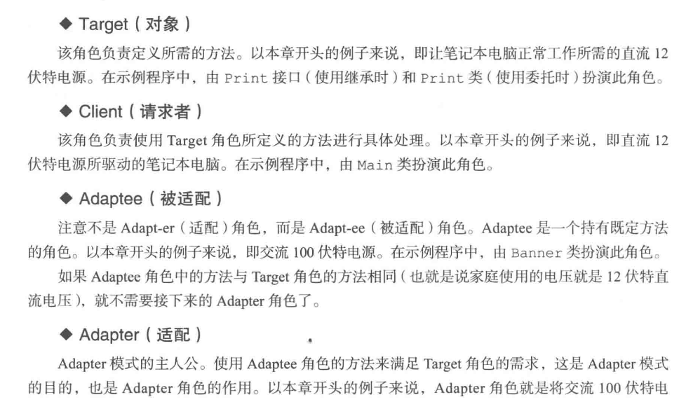
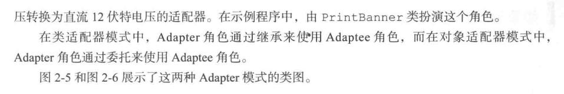
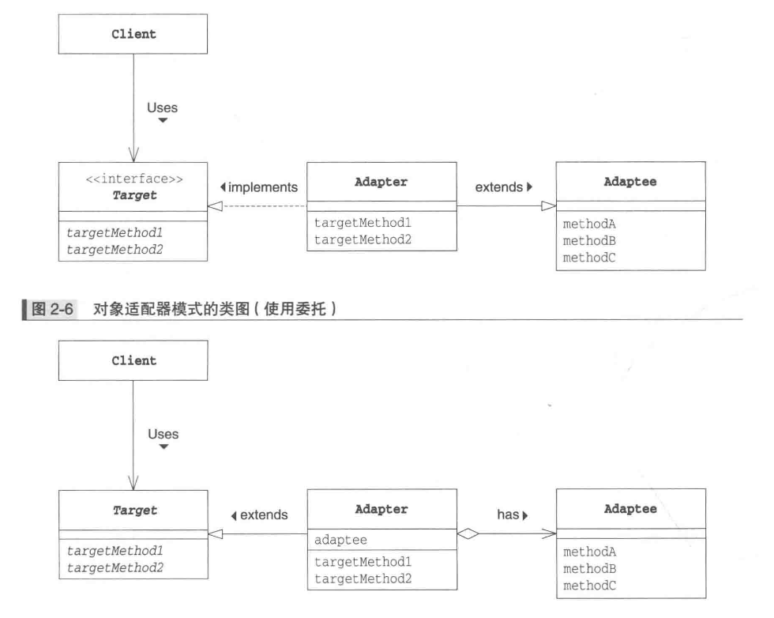

## 设计模式六大原则

https://mp.weixin.qq.com/s/yDiIZW3TQENLOFmzYH7NOw

https://mp.weixin.qq.com/s/nlyc9jhriCGyt92WRoBZFw

https://mp.weixin.qq.com/s/Hv-pV9PvIrHQgM6ayg33bQ

https://www.jianshu.com/p/807bc228dbc2

1. 单一职责原则：问题描述：定义是一个类应该只有一个发生变化的原因，比如一个类A负责两个职责，a1,a2，如果a1发生需求的变化，要修改类A的a1职责的变动，**有可能**引起a2的功能也发生故障，这样就耦合了

   1. ```java
      //  以下是不对的
      public class Animal {
          public void eat() {
               if (kind.equals("rabbit")) {
              System.out.println("eat some carmine");
          }
          if (kind.equals("tigger")) {
              System.out.println("eat some meat");
          }
          }
          public void sleep() {
              System.out.println("sleeping ~~");
          }
      }
      ```

2. 接口隔离原则：客户端不应该依赖它不需要的接口；一个类对另一个类的依赖应该建立在最小的接口上。

3. 依赖倒置原则：他是这么定义的，高层模块不应该依赖低层模块，二者都应该依赖其抽象；抽象不应该依赖细节；细节应该依赖抽象。

   1. ```java
      public class Cooker {
          public void cook(Potato potato) {
              System.out.println("开始做菜了");
              System.out.println(potato.getFood());
          }
      }
      
      class Potato {
          public String getFood() {
              return "酸辣土豆丝";
          }
      }
      // 改为
      public interface FoodMaterial {
         String getFood();
      }
      
      class Potato implements FoodMaterial{
         @Override
         public String getFood() {
             return "酸辣土豆丝";
         }
      }
      
      class Chicken implements FoodMaterial{
         @Override
         public String getFood() {
             return "可乐鸡翅";
         }
      }
      
      public class Cooker {
      
         public void cook(FoodMaterial foodMaterial) {
             System.out.println("开始做菜了");
             System.out.println(foodMaterial.getFood());
         }
         public static void main (String []args) {
             Cooker cooker = new Cooker();
             cooker.cook(new Potato());
         }
      }
      ```

4. 开闭原则：对于扩展是开放的，对于修改是关闭的，比如通过继承重写某个方法来得到想要的结果

5. 里氏替换原则：所有引用基类的地方都必须能透明地使用其子类的对象，

6. 迪米特原则：一个对象应当对其他对象有尽可能少的了解，不和陌生人说话，一个类尽可能的少的暴露public的方法和属性。权限控制关键字也要做好控制，两个类的耦合太牢固，随着业务的复杂度的提升，越改越麻烦，也越容易出错


## 策略模式

1. Strategy角色：负责决定实现策略所必需的接口(API)。在示例程序中,由 Strategy接口扮演此角色
2. Concrete Strategy角色：负责实现 Strategy角色的接口(API),即负责实现具体的策略(战略、方向、方法和算法)。在示例程序中,由 Winningstrategy类和 Probstrategy类扮演此角色。
3. Context角色：负责使用 Strategy角色。 Context角色保存了 Concrete Strategy角色的实例,并使用Concretestrategy角色去实现需求(总之,还是要调用 Strategy角色的接口(API))在示例程序中由 Player类扮演此角色。

这样看起来程序好像变复杂了,其实不然。例如,当我们想要通过改善算法来提高算法的处理速度时,如果使用了 Strategy模式,就不必修改 Strategy 角色的接口(API)了,仅仅修改Concrete Strategy角色即可。而且,使用委托这种弱关联关系可以很方便地整体替换算法。例如,如果想比较原来的算法与改进后的算法的处理速度有多大区别,简单地替换下算法即可进行测试。


## 适配器模式





