1. 自我介绍
   1. 工作上：在老师工作室进行项目开发，一个是农产品，一个是外包，也会带带工作室成员一起学习，和老师一起讨论项目需求
   2. 课内学习上：奖学金，大二绩点好
   3. 课外技术学习：阅读源码终于懂了spiring IOC的控制翻转是啥意思，AOP就是创建代理，aqs，spirng mvc
2. 你的项目模块是怎么划分的？
   
   1. 先对学生和教师端进行了两个大类划分，各个类再划分为用户信息管理，预约管理，预约订单管理
   2. 并且使用不用的url前缀，实现了不同的用户有不同的权限级别，同时减少耦合
   3. 因为之前做农产品的时候农户（卖家）和买家的接口放在一个包里，并且权限也没有做区分，买家可以访问卖家的接口；并且代码耦合在一起了
3. 基础架构的搭建？
   2. 使用redis+springboot+mysql架构，redis负责缓存用户个人信息，和实现定时任务处理，比如提醒用户预约课程上课时间和成功预约教师
   3. 全局跨域处理，封装统一的返回接口（ExceptionHandler），统一枚举类，全局的线程池，使用统一的JSR303校验
   4. 统一的日志AOP切面
4. 项目的难点是什么？
   1. 登录问题
      1. 说说 token 对接口的问题
      2. 跨域问题，同时注意到postman是没有跨域问题的，然后我了解到跨域问题的原理，然后通过filter解决的
         1. 简单请求
            1. 浏览器
               1. 请求时携带Origin字段
               2. 对响应的请求校验 Access-Control-Allow-Origin 字段是否跟自己的域名相匹配
            2. 服务器
               1. 可以校验Origin字段
               2. 可以决定返不返回  Access-Control-Allow-Origin 字段
         2. 复杂请求
            1. 浏览器
               1. 会先发送Option请求
               2. 一旦服务器通过了"预检"请求，以后每次浏览器正常的CORS请求，就都跟简单请求一样，会有一个`Origin`头信息字段。服务器的回应，也都会有一个`Access-Control-Allow-Origin`头信息字段。
      3. 登录的权限问题，使用url前缀，token 里面存了id，因为只有两个角色，就没有使用RBAC的权限认证方式，然后可以说说自己对于这种方式和spring security的对比，然后说说spring security的原理
      4. OAuth2.0 的流程
         1. 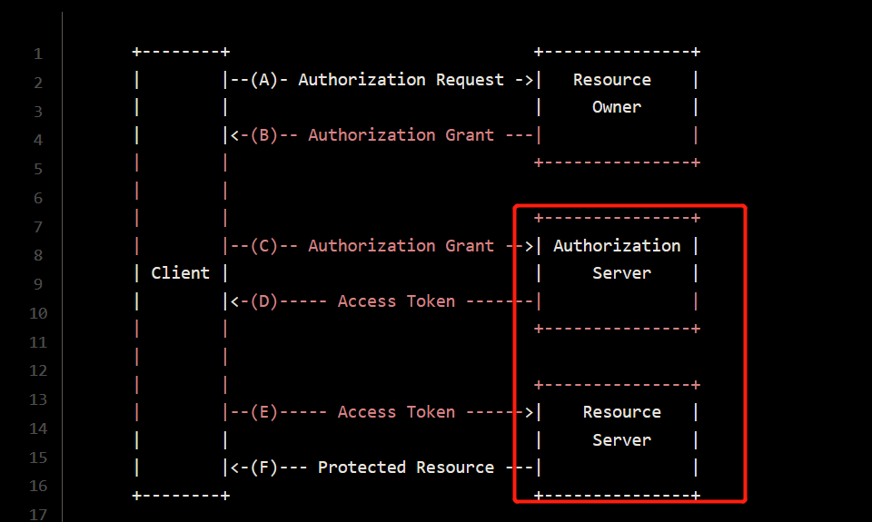
      5. JWT 
         1. token的格式：header.payload.signature
         2. {"alg": "HS512","typ": "JWT"}-------用Base64对这个JSON编码就得到JWT的第一部分
         3. {"sub":"wang","created":1489079981393,"exp":1489684781}-------payload进行Base64编码就得到JWT的第二部分
         4. HMACSHA256(base64UrlEncode(header) + "." + base64UrlEncode(payload), secret)------就得到JWT的第三部分
   2. Redis 保证了防止缓存穿透（访问不存在的key），缓存雪崩（大量的key同时失效），缓存击穿（针对一个key）：当时看到说可以缓存一个不存在的key，那我想，可以多几种状态
   3. 数据库优化，索引+主从
      1. 索引你是怎么进行优化的？ https://mp.weixin.qq.com/s/e0CqJG2-PCDgKLjQfh02tw
         1. MySQL 的优化过程，从 explain， analyze table , force index，覆盖索引，最左前缀原则（这边面试官看我比较懂，就没问了）
            1. 使用 explain 查看rows的值，因为rows的统计是这样的：默认选择N个数据页，统计这些页面上的不同值，得到一个平均值，然后乘于这个索引的页面数，得到索引的基数；  如果rows相差太大就看看是否走错了索引
               1. 使用 analyze table 进行重新统计索引信息 
               2. 使用 force index 强制使用某个索引
            2. 唯一索引和普通索引 + Change Buffer + Buffer Pool + Log Buffer
            3. 覆盖索引，最左前缀原则
            4. join查询使用索引，小标驱动大表
      2. 你是怎么保证主从的一致性的？

         1. 使用Sharing JDBC 作为中间件，需要高一致性的情况强制读主数据库
5. Reids
   1. Redis存放了什么数据？
      
      1. 学生每次发布的预约，然后将信息放在key中，通过scan命令进行模糊匹配，返回给前端数据
      2. 用户的一些头像信息，性别等信息，放在redis中，使用状态机进行了优化  [状态机](https://blog.csdn.net/xinghuanmeiying/article/details/81586954)
   2. 你是怎么保证数据库和redis的一致性的？这个有什么缺点吗？

      1. 使用延迟双删策略！会造成一个Cache Miss！

      1. 可以设置较短的失效时间
      2. 先删除缓存再删数据库
         1. 如果先删数据库再删缓存的话可能缓存删除失败，导致不一致性
   3. 如果要完全的一致性怎么办？

      1. 使用分布式锁
   4. 为什么使用Redis做延时队列？
      1. Rabbitmq 的同学知道它使用起来有多复杂，发消息之前要创建 Exchange，再创建 Queue，还要将 Queue 和 Exchange 通过某种规则绑定起来，发消息的时候要指定 routing-key，还要控制头部信息。消费者在消费消息之前也要进行上面一系列的繁琐过程，虽然我们的消息队列只有一组消费者，但还是需要经历上面这些繁琐的过程
      2. Redis 的消息队列不是专业的消息队列，它没有非常多的高级特性，没有 ack 保证，如果对消息的可靠性有着极致的追求，那么它就不适合使用

   5. 消息队列的缺点？
      1. 系统可用性降低
         1. 系统引入的外部依赖越多，越容易挂掉。本来你就是 A 系统调用 BCD 三个系统的接口就好了，ABCD 四个系统还好好的，没啥问题，你偏加个 MQ 进来，万一 MQ 挂了咋整？MQ 一挂，整套系统崩溃，你不就完了？如何保证消息队列的高可用，可以[点击这里查看](https://doocs.gitee.io/advanced-java/#/docs/high-concurrency/how-to-ensure-high-availability-of-message-queues)。
      2. 系统复杂度提高
         1. 硬生生加个 MQ 进来，你怎么[保证消息没有重复消费](https://doocs.gitee.io/advanced-java/#/docs/high-concurrency/how-to-ensure-that-messages-are-not-repeatedly-consumed)？怎么[处理消息丢失的情况](https://doocs.gitee.io/advanced-java/#/docs/high-concurrency/how-to-ensure-the-reliable-transmission-of-messages)？怎么保证消息传递的顺序性？头大头大，问题一大堆，痛苦不已。
      3. 一致性问题
         1. A 系统处理完了直接返回成功了，人都以为你这个请求就成功了；但是问题是，要是 BCD 三个系统那里，BD 两个系统写库成功了，结果 C 系统写库失败了，咋整？你这数据就不一致了。

6. 下单操作是怎么进行的？

   1. 使用了ReenntryLock，保证多线程的冲突
   2. 不答redis预减操作，不然会让你说redis事务的原子性

## 安全

安全

1. 安全的三大特性？
   1. 保密性，可用性，完整性
2. 你的项目实现了啥特性
   1. 只保证了完整性，没实现保密性，其实也可以通过双方加密参数实现保密性的
   2. 也没实现不可否认性，这个得使用数字签名，即Https。。。然后可以说说https的原理
3. 

### 公钥

1. 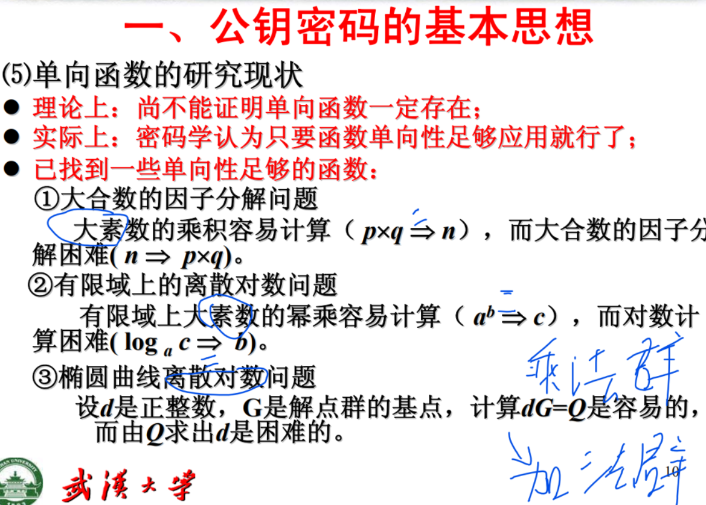
2. 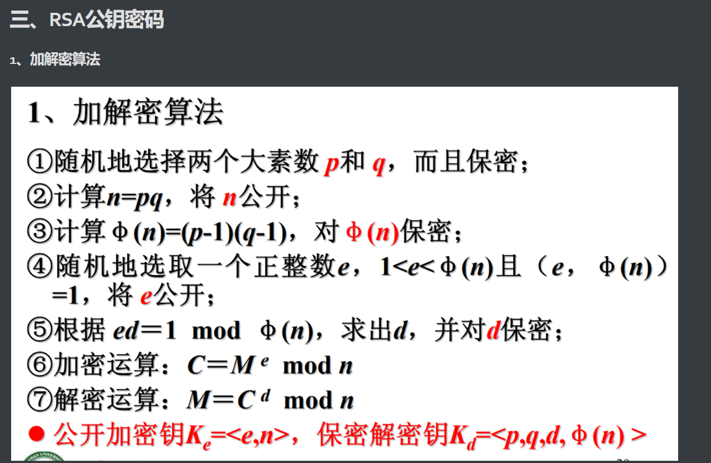
3. 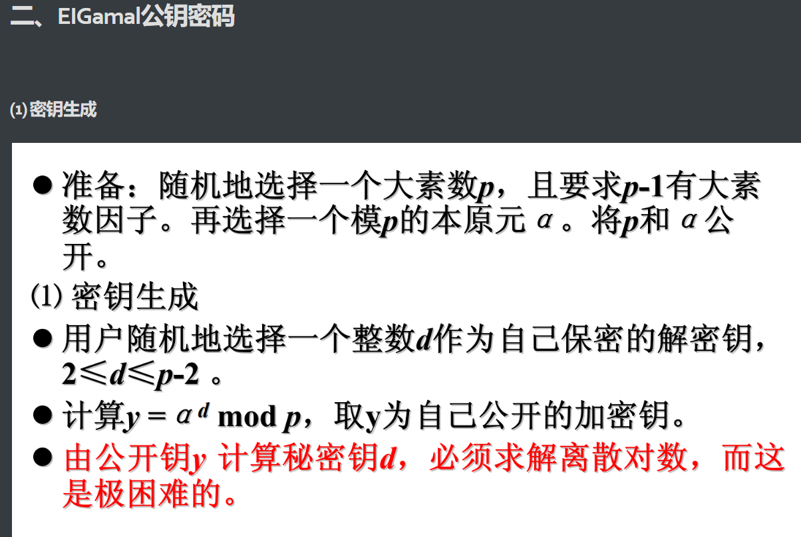

### 古典密码

古典密码：1.置换密码，2.代替密码，3.代数密码

### 分组密码

分组密码：就是不断使用 代替和置换和XOR 实现混淆，扩散

下面是密钥的产生示意图

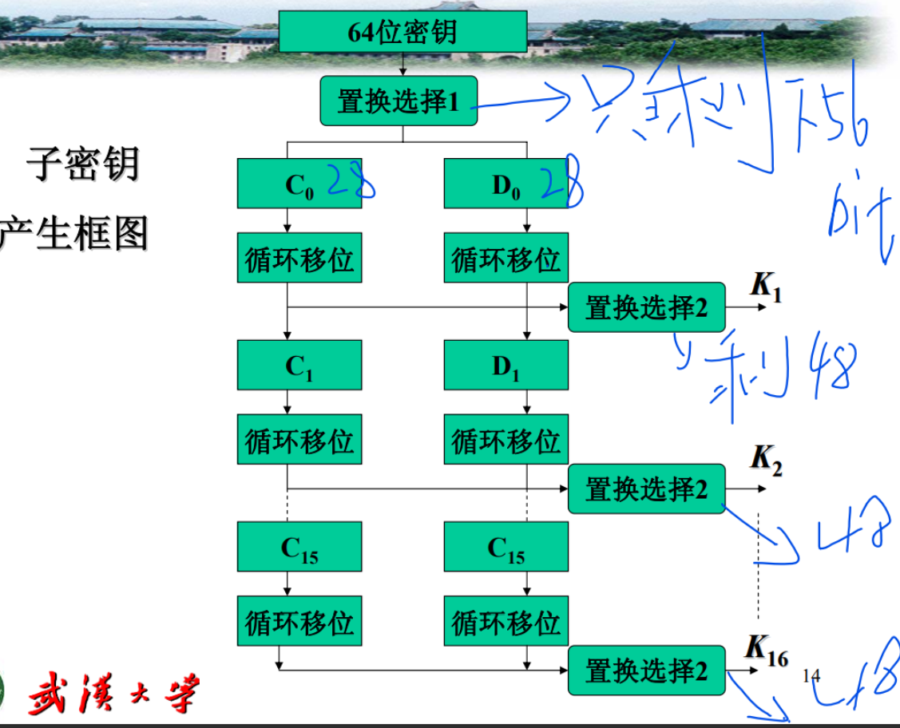

初始置换IP和逆初始置换IP-1

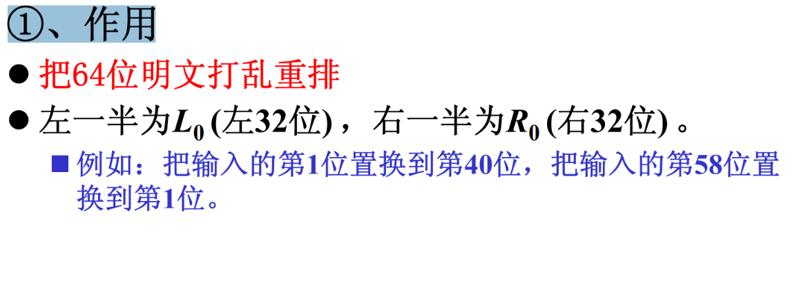

加密函数 f

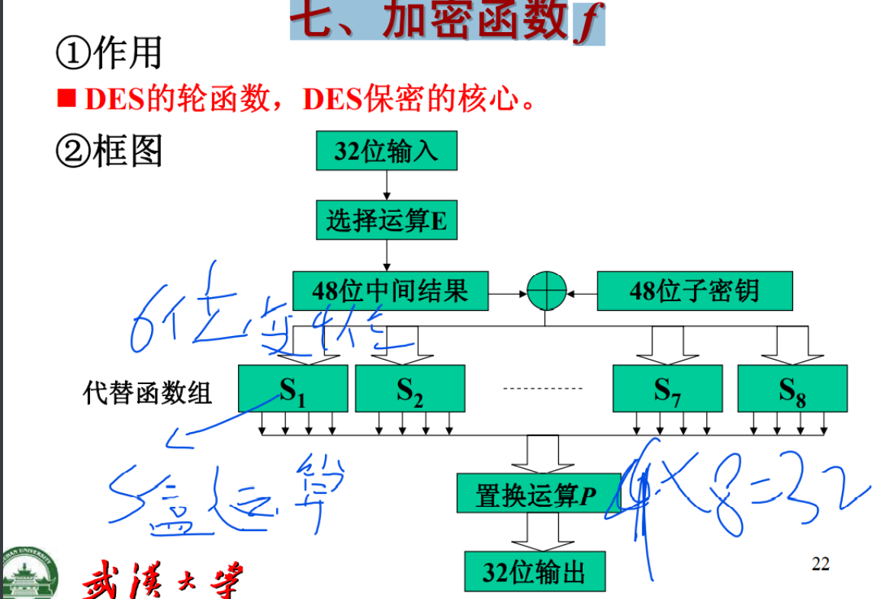

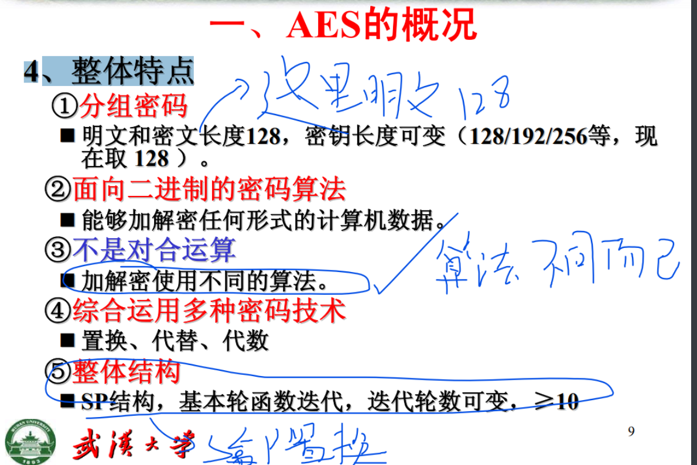

S盒变换 ByteSub(State )

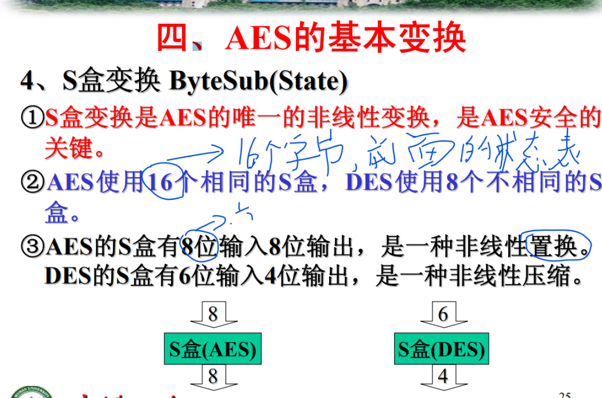

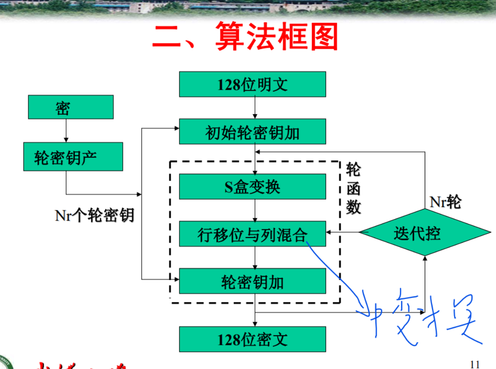

行移位变换 ShiftRow(State)

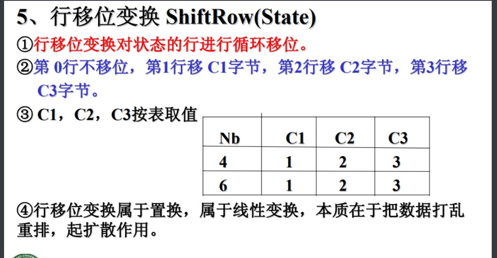

列混合变换 MixColumn(State)

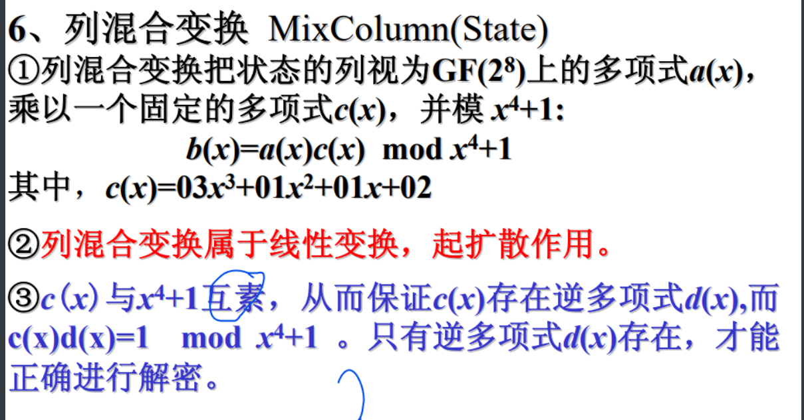

轮密钥加变换 AddRoundKey ()

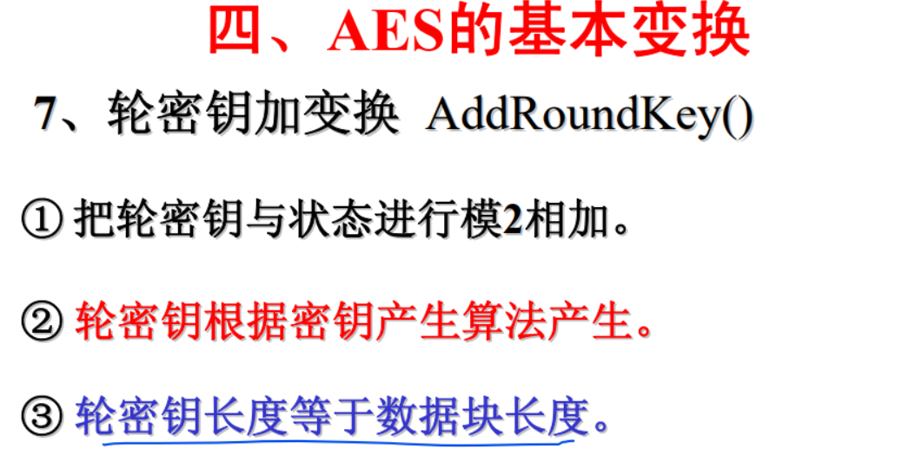

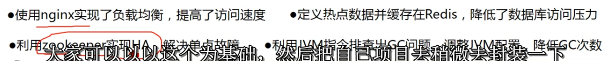

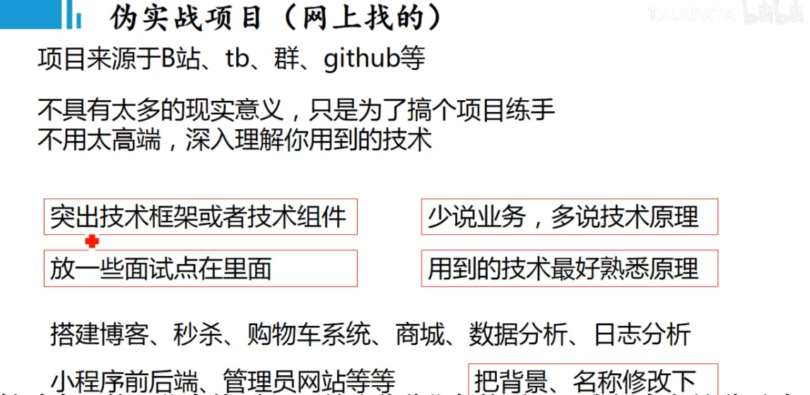

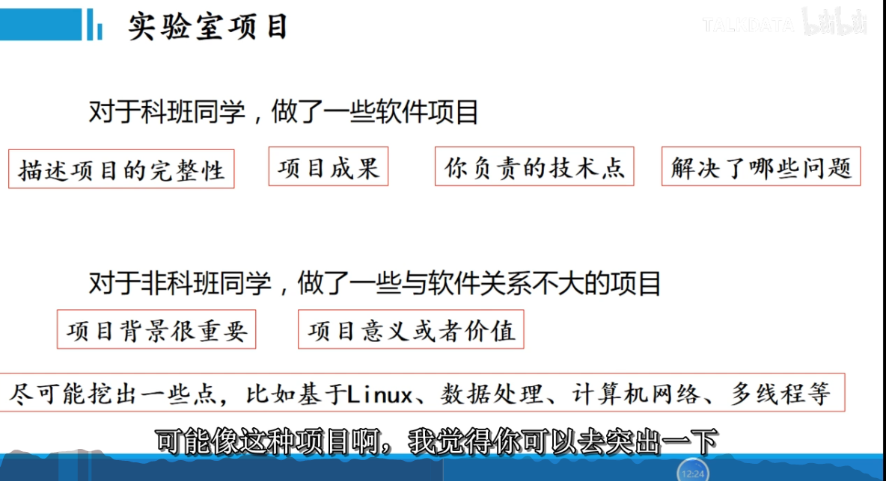

\1.   完成用户信息管理模块，基于JWT实现用户登录认证，实现微信登录，对 OAuth2.0 认证了流程有了一定的了解；通过 URL 携带Token，解决微信登录之后页面跳转并返回 Token 问题

\2.   数据库使用索引进行查询优化

\3.   配置全局线程池实现异步发送通知消息

\4.   实现 Redis 过期事件监听，并引入策略模式处理不同情况的过期事件

\5.   学会使用原型图进行开发，减少开发过程中需求模糊的问题

\6.   进一步协调前后端接口对接，提供详细的接口文档，对每个接口提供了测试示例和详细参数说明

- 你负责了项目的哪块内容？
- 项目的难点痛点是什么？你们怎么解决的？
- 你使用XX技术栈的时候有没有什么坑，你们怎么解决的？
- 项目中遇到过什么印象比较深的Bug？
- 遇到XX情况么？怎么解决的，怎么优化的？能多说几种方案么？
- 你是根据哪些指标进行针对性优化的？

https://mp.weixin.qq.com/s?__biz=MzAwNDA2OTM1Ng==&mid=2453141241&idx=1&sn=7d5f70947a1795eb2a099696acad922e&chksm=8cf2d47abb855d6cc436aad6784692073fe415e2912f6261fb8a960c9cb08e8d40824a677375&scene=178&cur_album_id=1343709756242067459#rd

## 360

【360公司2021春季校园招聘】已开启，还没有上车的小伙伴抓紧啦~
面向人群：21届应届生22届实习生
投递时间：21/3/1 至 21/4/16
笔试时间：21/3/28 或 21/4/17 分为两批
牛客链接：https://www.nowcoder.com/discuss/603888 (有问题请牛客帖子留言)
内推链接(微信或PC打开)：https://app.mokahr.com/recommendation-apply/360campus/26420?recommenderId=1121036#/jobs
内推查询链接：https://app.mokahr.com/m/candidate/applications/deliver-query/360campus

## 度小满

【度小满内推超级福利，内推免笔试！！！】
1、来自度小满招聘公众号最新消息，参与度小满春招补录内推，简历优先筛选，【免笔试】，欢迎同学们速速投递！
2、参与内推方式：（通过内推链接投递，均算作内推，需要电脑或者微信端打开）

2021届春招：https://sourl.cn/gGZiML
2022届实习生：https://sourl.cn/ffSjmL

3、投递后，辛苦大家在本帖下帮忙回复：名字最后1个字+投递岗位+已投递，方便我确认是否内推成功。
帖子链接：https://www.nowcoder.com/discuss/612798?type=post&order=time&pos=&page=1&channel=-1&source_id=search_post_nctrack

4、参与内推后，欢迎大家加入度小满内推群，不定时提供进度查询，简历修改服务。
2021届同学加群：915957849
2022届同学加群：869172308
（加入1个群即可，不要重复加入哦）

## 作业帮

【作业帮内推-SP年薪40W+】春招&实习
一、内推时间：即日起
二、内推对象：21届应届&22届实习&社招
三、内推岗位：研发/设计/主讲/辅导/管培生
四、内推方式： 

1、内推链接投递
21届春招：http://mrw.so/6ienzH
22届实习：http://mrw.so/6in2fo
日常实习：http://mrw.so/5yzOnt
社招：http://mrw.so/6aQP9T
2、牛客帖子链接：https://www.nowcoder.com/discuss/598488
3、内推答疑微信：Veritas_fox
4、春招HC有限，越早投递机会越大 

五、进度查询
关注【作业帮招聘】公众号，可实时查看进度

## 网易

## 腾讯PCG

1. 运营开发好像不错，题目挺简单，https://www.nowcoder.com/discuss/619384
2. 

## 阿里

1. 已经笔试  3-19

## 字节

1. 已投3-20

## CVTE

1. 已经笔试  

## 携程

1. 已经笔试  3-18

## 美团

1. 3-20 投递

## 京东

3-22 投递	

https://www.nowcoder.com/discuss/610558?type=all&order=time&pos=&page=3&channel=-1&source_id=search_all_nctrack

## 百度

3-22 投递

https://www.nowcoder.com/discuss/609915?type=all&order=time&pos=&page=1&channel=-1&source_id=search_all_nctrack

## 

## 快手

3-22 投递

https://www.nowcoder.com/discuss/596550?type=all&order=time&pos=&page=12&channel=-1&source_id=search_all_nctrack

## pdd

## 虾皮

## 华为

------

## 虎牙

## 深信服

## 蘑菇街

## bilibili

## 猿辅导

## 去哪儿

